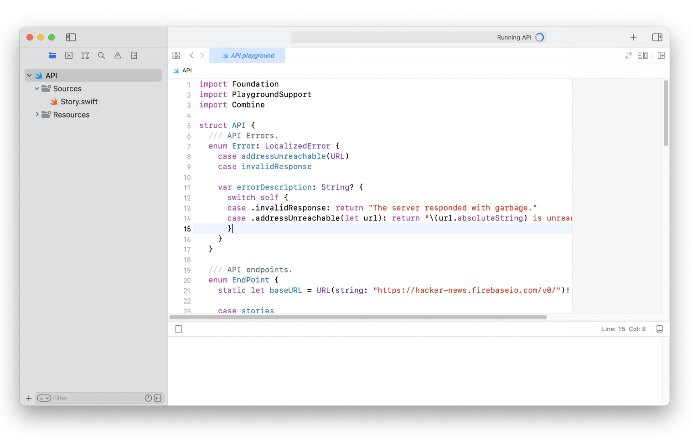
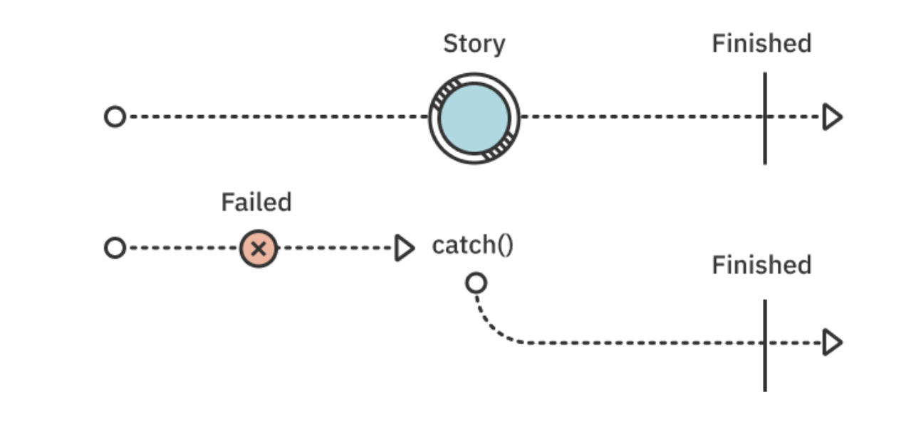
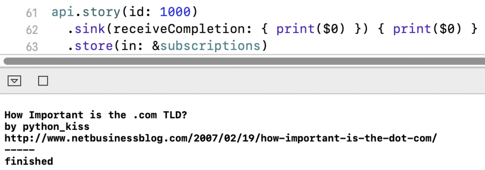
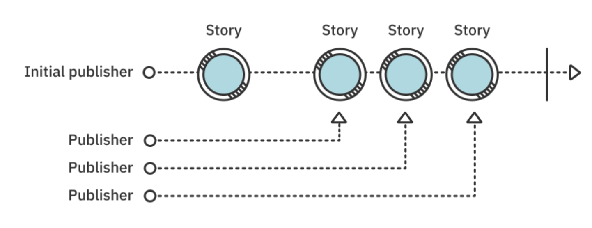
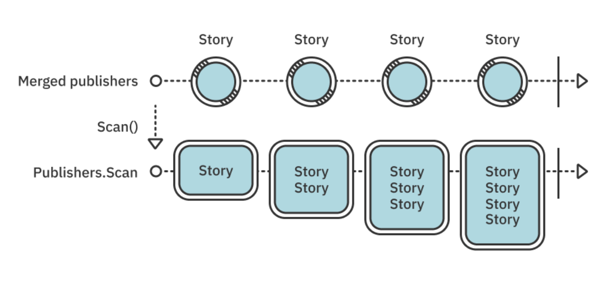

# 第三部分：Combine 的行为

你现在了解了大部分 Combine 的基础知识。你了解了发布者、订阅者和订阅如何工作以及这些部分之间的相互交织关系，以及如何使用操作符来操纵发布者及其发布的值。

本部分分为五个小节，每个小节都有自己的重点，用于将 Combine 用于特定用例的实用方法。你将学习如何利用 Combine 进行网络、如何调试你的 combine 发布者、如何使用计时器和观察符合 KVO 的对象，以及了解资源如何在 Combine 中工作。


## 第 9 节：网络

我们所做的很多事情都是围绕网络展开的。与后端通信、获取数据、推送更新、编码和解码 JSON……这是移动开发人员的日常工作。

Combine 提供了一些精选的 API 来帮助以声明方式执行常见任务。这些 API 围绕现代应用程序的两个关键组件展开：

1. 使用 URLSession 执行网络请求。

2. 使用 Codable 协议对 JSON 数据进行编码和解码。


### URLSession 扩展

URLSession 是执行网络数据传输任务的标准方式。它提供了具有强大配置选项和完全透明的后台的、支持现代异步的 API。它支持多种操作，例如：

- 用于检索 URL 内容的数据传输任务。

- 下载任务以检索 URL 的内容并将其保存到文件中。

- 上传任务将文件和数据上传到 URL。

- 流式传输任务以在两方之间传输数据。

- 连接到 websocket 的 Websocket 任务。

其中，只有第一个，数据传输任务，公开了一个 Combine 发布者。 Combine 使用具有两个变体的单个 API 处理这些任务，采用 URLRequest 或仅采用 URL。

下面看看如何使用这个 API：

```swift
guard let url = URL(string: "https://mysite.com/mydata.json") else { 
  return 
}

// 1
let subscription = URLSession.shared
  // 2
  .dataTaskPublisher(for: url)
  .sink(receiveCompletion: { completion in
    // 3
    if case .failure(let err) = completion {
      print("Retrieving data failed with error \(err)")
    }
  }, receiveValue: { data, response in
    // 4
    print("Retrieved data of size \(data.count), response = \(response)")
  })
```

下面是这段代码发生的事情：

1. 保留最终的 subscription 至关重要； 否则，它会立即被取消，并且请求永远不会执行。
2. 你正在使用将 URL 作为参数的 `dataTaskPublisher(for:)` 的重载。
3. 确保你总是处理错误！ 网络连接容易出现故障。
4. 结果是包含 `Data` 对象和 `URLResponse` 的元组。

如你所见，Combine 在 URLSession.dataTask 之上提供了一个透明的准系统发布者抽象，仅公开发布者而不是闭包。


### Codable 支持

Codable 协议是你绝对应该了解的现代、强大且仅限 Swift 的编码和解码机制。

Foundation 支持通过 JSONEncoder 和 JSONDecoder 对 JSON 进行编码和解码。 你也可以使用 PropertyListEncoder 和 PropertyListDecoder，但这些在网络请求的上下文中用处不大。

在前面的示例中，你下载了一些 JSON。 当然，你可以使用 JSONDecoder 对其进行解码：

```swift
let subscription = URLSession.shared
  .dataTaskPublisher(for: url)
  .tryMap { data, _ in
    try JSONDecoder().decode(MyType.self, from: data)
  }
  .sink(receiveCompletion: { completion in
    if case .failure(let err) = completion {
      print("Retrieving data failed with error \(err)")
    }
  }, receiveValue: { object in
    print("Retrieved object \(object)")
  })
```

你在 tryMap 中解码 JSON，该方法有效，但 Combine 提供了一个操作符来帮助减少代码：`decode(type:decoder:)`。

在上面的示例中，将 tryMap 操作符替换为以下行：

```swift
.map(\.data)
.decode(type: MyType.self, decoder: JSONDecoder())
```

不幸的是，由于 `dataTaskPublisher(for:)` 发出一个元组，你不能直接使用 `decode(type:decoder:)` 而不首先使用只发出数据部分结果的 `map(_:)`。

唯一的优点是你只在设置发布者时实例化 `JSONDecoder` 一次，而不是每次在 `tryMap(_:)` 闭包中创建它。


### 向多个订阅者发布网络数据

每次订阅发布者时，它都会开始工作。 在网络请求的情况下，这意味着如果多个订阅者需要结果，则多次发送相同的请求。

令人惊讶的是，Combine 没有像其他框架那样容易实现这一点的操作符。 你可以使用 share() 操作符，但这很棘手，因为你需要在结果返回之前订阅所有订阅者。

除了使用缓存机制外，一种解决方案是使用 `multicast()` 操作符，它创建一个 `ConnectablePublisher`，通过 Subject 发布值。 它允许你多次订阅 subject，然后在你准备好时调用发布者的 `connect()` 方法：

```swift
let url = URL(string: "https://www.raywenderlich.com")!
let publisher = URLSession.shared
// 1
  .dataTaskPublisher(for: url)
  .map(\.data)
  .multicast { PassthroughSubject<Data, URLError>() }

// 2
let subscription1 = publisher
  .sink(receiveCompletion: { completion in
    if case .failure(let err) = completion {
      print("Sink1 Retrieving data failed with error \(err)")
    }
  }, receiveValue: { object in
    print("Sink1 Retrieved object \(object)")
  })

// 3
let subscription2 = publisher
  .sink(receiveCompletion: { completion in
    if case .failure(let err) = completion {
      print("Sink2 Retrieving data failed with error \(err)")
    }
  }, receiveValue: { object in
    print("Sink2 Retrieved object \(object)")
  })

// 4
let subscription = publisher.connect()
```

在此代码中：

1. 创建你的 `DataTaskPublisher`，map 到它的 data，然后 multicast。你传递的闭包必须返回适当类型的 subject。 或者，你可以将现有 subject 传递给`multicast(subject:)`。 你将在后文中了解有关多播的更多信息。
2. 首次订阅发布者。 由于它是一个 `ConnectablePublisher`，它不会立即开始工作。
3. 再次订阅。
4. 准备好后连接发布者。 它将开始工作并向所有订阅者推送值。

使用此代码，你可以一次性发送请求并与两个订阅者共享结果。

> 注意：确保存储所有 Cancelable；否则，它们将在离开当前代码范围时被释放和取消，这在这种特定情况下是立即的。


这个过程仍然有点复杂，因为 Combine 不像其他响应式框架那样为这种场景提供操作符。在后文自定义发布者和处理背压”中，你将探索如何设计一个更好的解决方案。


### 关键点

- Combine 为 `dataTask(with:completionHandler:)` 方法提供了一个基于发布者的抽象，称为 `dataTaskPublisher(for:)`。

- 你可以使用发出 Data 值的发布者上的内置解码操作符来解码符合 Codable 的模型。

- 虽然没有操作符可以与多个订阅者共享订阅的重播，但你可以使用 ConnectablePublisher 和 multicast 操作符重新创建此行为。


### 然后去哪儿？

如果你想了解有关使用 Codable 的更多信息，可以查看以下资源：

- raywenderlich.com 上的“Swift 中的编码和解码”：https://www.raywenderlich.com/3418439-encoding-and-decoding-in-swift

- Apple 官方文档上的“编码和解码自定义类型”：https://developer.apple.com/documentation/foundation/archives_and_serialization/encoding_and_decoding_custom_types


## 第 10 节：调试

理解异步代码中的事件流一直是一个挑战。在 Combine 的上下文中尤其如此，因为发布者中的操作符链可能不会立即发出事件。 例如，像 `throttle(for:scheduler:latest:)` 这样的操作符不会发出它们接收到的所有事件，所以你需要了解发生了什么。 Combine 提供了一些操作符来帮助调试你的反应流。 了解它们将帮助你解决令人费解的情况。


### 打印事件

`print(_:to:)` 操作符是你在不确定是否有任何内容通过你的发布者时应该使用的第一个操作符。它是一个PassthroughPublisher ，可以打印很多关于正在发生的事情的信息。

即使是这样的简单案例：

```swift
let subscription = (1...3).publisher
  .print("publisher")
  .sink { _ in }
```

输出非常详细：

```
publisher: receive subscription: (1...3)
publisher: request unlimited
publisher: receive value: (1)
publisher: receive value: (2)
publisher: receive value: (3)
publisher: receive finished
```

在这里，你会看到 `print(_:to:)` 操作符显示了很多信息，因为它：

- 在收到订阅时打印并显示其上游发布者的描述。

- 打印订户的 demand request，以便你查看请求的项目数量。

- 打印上游发布者发出的每个值。

- 最后，打印完成事件。

有一个额外的参数接受一个 TextOutputStream 对象。 你可以使用它来重定向字符串以打印到记录器。 你还可以在日志中添加信息，例如当前日期和时间等。可能性无穷无尽！

例如，你可以创建一个简单的记录器来显示每个字符串之间的时间间隔，以便了解发布者发出值的速度：

```swift
class TimeLogger: TextOutputStream {
  private var previous = Date()
  private let formatter = NumberFormatter()

  init() {
    formatter.maximumFractionDigits = 5
    formatter.minimumFractionDigits = 5
  }

  func write(_ string: String) {
    let trimmed = string.trimmingCharacters(in: .whitespacesAndNewlines)
    guard !trimmed.isEmpty else { return }
    let now = Date()
    print("+\(formatter.string(for: now.timeIntervalSince(previous))!)s: \(string)")
    previous = now
  }
}
```

在你的代码中使用它非常简单：

```swift
let subscription = (1...3).publisher
  .print("publisher", to: TimeLogger())
  .sink { _ in }
```

结果显示每条打印行之间的时间：

```swift
+0.00111s: publisher: receive subscription: (1...3)
+0.03485s: publisher: request unlimited
+0.00035s: publisher: receive value: (1)
+0.00025s: publisher: receive value: (2)
+0.00027s: publisher: receive value: (3)
+0.00024s: publisher: receive finished
```

如上所述，这里的可能性是无限的。

> 注意：根据你运行此代码的计算机和 Xcode 版本，上面打印的时间间隔可能会略有不同。


### 执行副作用

除了打印信息外，对特定事件执行操作通常很有用。 我们将此称为执行副作用，因为你“在一边”采取的操作不会直接影响下游的其他发布者，但会产生类似于修改外部变量的效果。

`handleEvents(receiveSubscription:receiveOutput:receiveCompletion:receiveCancel:receiveRequest:) `让你可以拦截发布者生命周期中的所有事件，然后在每个步骤中采取行动。

想象一下，你正在跟踪一个发布者必须执行网络请求，然后发出一些数据的问题。 当你运行它时，它永远不会收到任何数据。 发生了什么？ 请求真的有效吗？ 你甚至听听什么回来？

考虑这段代码：

```swift
let request = URLSession.shared
  .dataTaskPublisher(for: URL(string: "https://www.raywenderlich.com/")!)

request
  .sink(receiveCompletion: { completion in
    print("Sink received completion: \(completion)")
  }) { (data, _) in
    print("Sink received data: \(data)")
  }
```

你运行它，从来没有看到任何打印。 看代码能看出问题吗？

如果没有，请使用 handleEvents 来跟踪正在发生的事情。 你可以在 publisher 和 sink 之间插入此操作符：

```swift
.handleEvents(receiveSubscription: { _ in
  print("Network request will start")
}, receiveOutput: { _ in
  print("Network request data received")
}, receiveCancel: {
  print("Network request cancelled")
})
```

然后，再次运行代码。 这次你会看到一些调试输出：

```
Network request will start
Network request cancelled
```

你忘记保留可取消项。 因此，订阅开始但立即被取消。 现在，你可以通过保留 Cancellable 来修复你的代码：

```swift
let subscription = request
  .handleEvents...
```

然后，再次运行你的代码，你现在将看到它的行为正确：

```
Network request will start
Network request data received
Sink received data: 303094 bytes
Sink received completion: finished
```


### 使用 Debugger 操作符作为最后的手段

Debugger 操作符是你在万不得已的时候确实需要使用的操作符，因为没有其他方法可以帮助你找出问题所在。

第一个简单的操作符是 `breakpointOnError()`。 顾名思义，当你使用此操作符时，如果任何上游发布者发出错误，Xcode 将在调试器中中断，让你查看堆栈，并希望找到你的发布者错误的原因和位置。

一个更完整的变体是 `breakpoint（receiveSubscription:receiveOutput:receiveCompletion:)`。 它允许你拦截所有事件并根据具体情况决定是否要暂停。

例如，只有当某些值通过发布者时，你才能中断：

```swift
.breakpoint(receiveOutput: { value in
  return value > 10 && value < 15
})
```

假设上游发布者发出整数值，但值 11 到 14 永远不会发生，你可以将断点配置为仅在这种情况下中断并让你调查！你还可以有条件地中断订阅和完成，但不能像 handleEvents 操作符那样拦截 Cancel。


### 关键点

- 与 `print` 操作符一起跟踪发布者的生命周期，

- 创建自己的 `TextOutputStream` 来自定义输出字符串，

- 使用 `handleEvents` 操作符拦截生命周期事件并执行操作，

- 使用 `breakpointOnError` 和 `breakpoint` 操作符来中断特定事件。


###  然后去哪儿？

你已经了解了如何跟踪你的发布商正在做的事情，现在是时候了解计时器了！ 继续下一节，了解如何使用 Combine 定期触发事件。


## 第 11 节：计时器

重复和非重复的 Timer 在编码时总是有用的。除了异步执行代码之外，你通常还需要控制任务应该重复的时间和频率。

在 Dispatch 框架可用之前，开发人员依靠 RunLoop 来异步执行任务并实现并发。 你可以使用 Timer 创建重复和非重复 Timer。 随后，Apple 发布了 Dispatch 框架，包括 DispatchSourceTimer。

尽管以上所有方法都能够创建计时器，但在 Combine 中并非所有计时器都相同。


### 使用 RunLoop

主线程和你创建的任何线程（最好使用 Thread 类）可以拥有自己的 RunLoop。 只需从当前线程调用 RunLoop.current：如果需要，Foundation 会为你创建一个。请注意，除非你了解 RunLoop 是如何运行的——特别是你需要一个 RunLoop ——否则最好只使用运行应用程序主线程的主 RunLoop。

> 注意：Apple 文档中的一个重要说明和红灯警告是 RunLoop 类不是线程安全的。 你应该只为当前线程的 RunLoop 用 RunLoop 方法。

RunLoop 实现了你将后文中了解的调度程序协议。它定义了几种相对较低级别的方法，并且是唯一一种可以让你创建可取消计时器的方法：

```swift
let runLoop = RunLoop.main

let subscription = runLoop.schedule(
  after: runLoop.now,
  interval: .seconds(1),
  tolerance: .milliseconds(100)
) {
  print("Timer fired")
}
```

此计时器不传递任何值，也不创建发布者。 它从 after: 参数中指定的日期开始，具有指定的间隔和容差，仅此而已。 它与 Combine 相关的唯一用处是它返回的 Cancelable 可让你在一段时间后停止计时器。

这方面的一个例子可能是：

```swift
runLoop.schedule(after: .init(Date(timeIntervalSinceNow: 3.0))) {
  subscription.cancel()
}
```

但考虑到所有因素，RunLoop 并不是创建计时器的最佳方式。 使用 Timer 类会更好！


### 使用 Timer 类

Timer 是原始 Mac OS X 中可用的最古老的计时器，早在 Apple 将其重新命名为“macOS”之前。 由于它的委托模式和与 RunLoop 的紧密关系，它一直很难使用。 Combine 带来了一个现代变体，你可以直接用作发布者，而无需所有设置样板。

你可以通过以下方式创建重复计时器发布者：

```swift
let publisher = Timer.publish(every: 1.0, on: .main, in: .common)
```

on 和 in 两个参数确定：

- 你的计时器附加到哪个 RunLoop。 这里是主线程的 RunLoop。

- 计时器在哪个 RunLoop 模式下运行。 这里，默认的 RunLoop 模式。

除非你了解运行循环是如何运行的，否则你应该坚持使用这些默认值。 运行循环是 macOS 中异步事件源处理的基本机制，但它们的 API 有点繁琐。 你可以通过调用 RunLoop.current 为你自己创建或从 Foundation 获取的任何线程获取 RunLoop，因此你也可以编写以下代码：

```swift
let publisher = Timer.publish(every: 1.0, on: .current, in: .common)
```

> 注意：在 DispatchQueue.main 以外的 Dispatch 队列上运行此代码可能会导致不可预知的结果。 Dispatch 框架在不使用 RunLoop 的情况下管理其线程。 由于 RunLoop 需要调用其运行方法之一来处理事件，因此你永远不会看到计时器在除主队列之外的任何队列上触发。 保持安全并为你的计时器定位 RunLoop.main。

计时器返回的发布者是 `ConnectablePublisher`。 它是 Publisher 的一个特殊变体，在你显式调用它的 `connect()` 方法之前，它不会在订阅时开始触发。 你还可以使用 `autoconnect()` 操作符，它会在第一个订阅者订阅时自动连接。

> 注意：你将在后文中了解有关可连接发布者的更多信息。

因此，创建将在订阅时启动计时器的发布者的最佳方法是编写：

```swift
let publisher = Timer
  .publish(every: 1.0, on: .main, in: .common)
  .autoconnect()
```

计时器重复发出当前日期，其 Publisher.Output 类型为 Date。 你可以使用 scan 操作符制作一个发出递增值的计时器：

```swift
let subscription = Timer
  .publish(every: 1.0, on: .main, in: .common)
  .autoconnect()
  .scan(0) { counter, _ in counter + 1 }
  .sink { counter in
    print("Counter is \(counter)")
  }
```

还有一个你在这里没有看到的额外 `Timer.publish()` 参数：容差(Tolerance)。 它以 TimeInterval 形式指定与你要求的持续时间的可接受偏差。但请注意，使用低于 RunLoop 的 minimumTolerance 值的值可能不会产生预期的结果。


### 使用 DispatchQueue

你可以使用调度队列来生成计时器事件。 虽然 Dispatch 框架有一个 `DispatchTimerSource` 事件源，但令人惊讶的是，Combine 没有为其提供计时器接口。 相反，你将使用另一种方法在队列中生成计时器事件。不过，这可能有点令人费解：

```swift
let queue = DispatchQueue.main

// 1
let source = PassthroughSubject<Int, Never>()

// 2
var counter = 0

// 3
let cancellable = queue.schedule(
  after: queue.now,
  interval: .seconds(1)
) {
  source.send(counter)
  counter += 1
}

// 4
let subscription = source.sink {
  print("Timer emitted \($0)")
}
```

在前面的代码中：

1. 创建一个 subject，你将向其发送计时器值。
2. 准备一个 counter，每次计时器触发时，你都会增加它。
3. 每秒在所选队列上安排一个重复操作。 动作立即开始。
4. 订阅 subject 获取定时器值。

如你所见，这并不漂亮。 将此代码移动到函数并传递间隔和开始时间会有所帮助。


### 关键点

- 如果你怀念 Objective-C 代码，请使用旧的 RunLoop 类创建计时器。

- 使用 Timer.publish 获取发布者，该发布者在指定的 RunLoop 上以给定间隔生成值。

- 将 DispatchQueue.schedule 用于在调度队列上发出事件的现代计时器。


### 接下来去哪儿？

在后文中，你将学习如何编写自己的发布者，并且你将使用 DispatchSourceTimer 创建一个替代的计时器发布者。在此之前有很多东西要学，从下一节的 Key-Value Observing 开始。


## 第 12 节: KVO

应对变化是 Combine 的核心。 发布者让你订阅它们以处理异步事件。在前面的章节中，你了解了 `assign(to:on:)`，它使你能够在每次发布者发出新值时更新对象属性的值。

但是，观察单个变量变化的机制呢？

- 它为符合 KVO（Key-Value Observing）的对象的任何属性提供发布者。

- ObservableObject 协议处理多个变量可能发生变化的情况。


### 介绍 publisher(for:options:)

KVO 一直是 Objective-C 的重要组成部分。 Foundation、UIKit 和 AppKit 类的大量属性都符合 KVO。 因此，你可以使用 KVO 观察它们的变化。

很容易观察到符合 KVO 的属性。 下面是一个使用 OperationQueue（来自 Foundation 的类）的示例：

```swift
let queue = OperationQueue()

let subscription = queue.publisher(for: \.operationCount)
  .sink {
    print("Outstanding operations in queue: \($0)")
  }
```

每次向队列添加新操作时，它的 operationCount 都会增加，并且你的接收器会收到新的计数。当队列消耗了一个 operation 时，计数会减少，并且你的接收器会再次收到更新的计数。

还有许多其他框架类公开了符合 KVO 的属性。 只需将 `publisher(for:)` 与 KVO 兼容属性的关键路径一起使用，你将获得一个能够发出值变化的发布者。 你将在本章稍后部分了解有关此功能和可用选项的更多信息。

> 注意：Apple 没有在其整个框架中提供符合 KVO 的属性的中央列表。 每个类的文档通常会指出哪些属性是 KVO 兼容的。 但有时文档可能很少，你只能在文档中找到一些属性的快速注释，甚至在系统标题本身中。


### 准备和订阅自己的 KVO 兼容属性

你还可以在自己的代码中使用 Key-Value Observing，前提是：

1. 你的对象是类（不是结构）并且符合 NSObject，

2. 使用 @objc 动态属性标记属性以使其可观察。

完成此操作后，你标记的对象和属性将与 KVO 兼容，并且可以使用 Combine！

> 注意：虽然 Swift 语言不直接支持 KVO，但将属性标记为 @objc dynamic 会强制编译器生成触发 KVO 机制的隐藏方法。 描述这种机器超出了本书的范围。 可以说该机制严重依赖 NSObject 协议中的特定方法，这解释了为什么你的对象需要遵守它。

在 Playground 上尝试一个例子：

```swift
// 1
class TestObject: NSObject {
  // 2
  @objc dynamic var integerProperty: Int = 0
}

let obj = TestObject()

// 3
let subscription = obj.publisher(for: \.integerProperty)
  .sink {
    print("integerProperty changes to \($0)")
  }

// 4
obj.integerProperty = 100
obj.integerProperty = 200
```

在上面的代码中：

1. 创建一个符合 NSObject 协议的类。这是 KVO 所必需的。

2. 将你想要使其可观察的任何属性标记为 @objc 动态。

3. 创建并订阅观察 obj 的 integerProperty 属性的发布者。

4. 更新属性几次。

在 Playground 中运行此代码时，你能猜出调试控制台显示的内容吗？

你可能会感到惊讶，但这是你获得的显示：

```
integerProperty changes to 0
integerProperty changes to 100
integerProperty changes to 200
```

你首先获得 integerProperty 的初始值，即 0，然后你会收到两个更改。如果你对它不感兴趣，你可以避免这个初始值——继续阅读以了解如何！

你是否注意到在 TestObject 中你使用的是普通的 Swift 类型 (Int)，而作为 Objective-C 特性的 KVO 仍然有效？ KVO 可以与任何 Objective-C 类型以及任何桥接到 Objective-C 的 Swift 类型一起正常工作。这包括所有原生 Swift 类型以及数组和字典，只要它们的值都可以桥接到 Objective-C。

试试看！向 TestObject 添加更多属性：

```swift
@objc dynamic var stringProperty: String = ""
@objc dynamic var arrayProperty: [Float] = []
```

以及订阅其发布者：

```swift
let subscription2 = obj.publisher(for: \.stringProperty)
  .sink {
    print("stringProperty changes to \($0)")
  }

let subscription3 = obj.publisher(for: \.arrayProperty)
  .sink {
    print("arrayProperty changes to \($0)")
  }
```

最后，一些属性变化：

```
obj.stringProperty = "Hello"
obj.arrayProperty = [1.0]
obj.stringProperty = "World"
obj.arrayProperty = [1.0, 2.0]
```

你将在调试区域中看到初始值和更改。 好的！

如果你曾经使用过没有桥接到 Objective-C 的纯 Swift 类型，你就会开始遇到麻烦：

```swift
struct PureSwift {
  let a: (Int, Bool)
}
```

然后，向 TestObject 添加一个属性：

```
@objc dynamic var structProperty: PureSwift = .init(a: (0,false))
```

你会立即在 Xcode 中看到一个错误，指出“属性不能被标记为 @objc，因为它的类型不能在 Objective-C 中表示。” 在这里，你达到了 Key-Value Observing 的局限。

> 注意：观察系统框架对象的变化时要小心。 确保文档提到该属性是可观察的，因为你无法仅通过查看系统对象的属性列表来获得线索。 Foundation、UIKit、AppKit 等都是如此。从历史上看，必须使属性“感知 KVO”才能被观察。


### Observation options

你调用以观察更改的方法的完整签名是 `publisher(for:options:)`。 `options` 参数是一个具有四个值的选项集：`.initial`、`.prior`、`.old` 和 `.new`。 默认值为 `[.initial]`，这就是为什么你会看到发布者在发出任何更改之前发出初始值。 以下是选项的细分：

- `.initial` 发出初始值。

- `.prior` 在发生更改时发出先前的值和新的值。

- `.old` 和 `.new` 在此发布者中未使用，它们都什么都不做（只是让新值通过）。

如果你不想要初始值，你可以简单地写：

```swift
obj.publisher(for: \.stringProperty, options: [])
```

如果你指定 `.prior`，则每次发生更改时都会获得两个单独的值。 修改 integerProperty 示例：

```swift
let subscription = obj.publisher(for: \.integerProperty, options: [.prior])
```

你现在将在 integerProperty 订阅的调试控制台中看到以下内容：

```
integerProperty changes to 0
integerProperty changes to 100
integerProperty changes to 100
integerProperty changes to 200
```

该属性首先从 0 更改为 100，因此你获得两个值：0 和 100。然后，它从 100 更改为 200，因此你再次获得两个值：100 和 200。


### ObservableObject

Combine 的 ObservableObject 协议适用于 Swift 对象，而不仅仅适用于派生自 NSObject 的对象。 它与 @Published 属性包装器合作，帮助你使用编译器生成的 objectWillChange 发布者创建类。

它使你免于编写大量样板文件，并允许创建可以自我监控自己的属性并在它们中的任何一个发生更改时通知的对象。

这是一个例子：

```swift
class MonitorObject: ObservableObject {
  @Published var someProperty = false
  @Published var someOtherProperty = ""
}

let object = MonitorObject()
let subscription = object.objectWillChange.sink {
  print("object will change")
}
```

`ObservableObject` 协议一致性使编译器自动生成 `objectWillChange` 属性。 它是一个 `ObservableObjectPublisher`，它发出 Void 项目并且永不失败。

每次对象的 @Published 变量之一发生更改时，都会触发 objectWillChange。 不幸的是，你无法知道实际更改了哪个属性。 这旨在与 SwiftUI 很好地配合使用，它可以合并事件以简化屏幕更新。


### 关键点

- Key-Value Observing 主要依赖于 Objective-C 运行时和 NSObject 协议的方法。

- Apple 框架中的许多 Objective-C 类提供了一些符合 KVO 的属性。

- 你可以让你自己的属性可观察，只要它们是符合 NSObject 的类，并用 @objc 动态属性标记。

- 你还可以遵守 ObservableObject 并为你的属性使用 @Published。 编译器生成的 objectWillChange 发布者在每次 @Published 属性之一更改时触发（但不会告诉你更改了哪一个）。


### 接下来去哪？

继续阅读以了解 Combine 中的资源，以及如何通过共享它们来保存它们！


## 第 13 节：资源管理

在前面的章节中，你发现有时你希望共享网络请求、图像处理和文件解码等资源，而不是重复你的工作。任何可以避免重复多次的资源密集型都值得研究。换句话说，你应该在多个订阅者之间共享单个资源的结果——发布者产生的值，而不是复制该结果。

Combine 提供了两个操作符来管理资源：share() 操作符和 multicast(_:) 操作符。


### share() 操作符

该操作符的目的是让你通过引用而不是通过值来获取发布者。 发布者通常是结构体：当你将发布者传递给函数或将其存储在多个属性中时，Swift 会多次复制它。 当你订阅每个副本时，发布者只能做一件事：开始其工作并交付值。

share() 操作符返回 `Publishers.Share` 类的实例。通常，发布者被实现为结构，但在 share() 的情况下，如前所述，操作符获取对 Share 发布者的引用而不是使用值语义，这允许它共享底层发布者。

这个新发布者“共享”上游发布者。它将与第一个传入订阅者一起订阅一次上游发布者。然后它将从上游发布者接收到的值转发给这个订阅者以及所有在它之后订阅的人。

> 注意：新订阅者只会收到上游发布者在订阅后发出的值。不涉及缓冲或重放。如果订阅者在上游发布者完成后订阅共享发布者，则该新订阅者只会收到完成事件。


要将这个概念付诸实践，假设你正在执行一个网络请求，你希望多个订阅者无需多次请求即可接收结果。你的代码将如下所示：

```swift
let shared = URLSession.shared
  .dataTaskPublisher(for: URL(string: "https://www.raywenderlich.com")!)
  .map(\.data)
  .print("shared")
  .share()

print("subscribing first")

let subscription1 = shared.sink(
  receiveCompletion: { _ in },
  receiveValue: { print("subscription1 received: '\($0)'") }
)

print("subscribing second")

let subscription2 = shared.sink(
  receiveCompletion: { _ in },
  receiveValue: { print("subscription2 received: '\($0)'") }
)
```

第一个订阅者触发 `share()` 的上游发布者的“工作”（在这种情况下，执行网络请求）。 第二个订阅者将简单地“连接”到它并与第一个订阅者同时接收值。

在 Playground 中运行此代码，你会看到类似于以下内容的输出：

```
subscribing first
shared: receive subscription: (DataTaskPublisher)
shared: request unlimited
subscribing second
shared: receive value: (303425 bytes)
subscription1 received: '303425 bytes'
subscription2 received: '303425 bytes'
shared: receive finished
```

使用 `print(_:to:)` 操作符的输出，你可以看到：

- 第一个订阅触发对 DataTaskPublisher 的订阅。

- 第二次订阅没有任何改变：发布者继续运行。没有第二个请求发出。

- 当请求完成时，发布者将结果数据发送给两个订阅者，然后完成。

要验证请求只发送一次，你可以注释掉 share() 行，输出将类似于以下内容：

```swift
subscribing first
shared: receive subscription: (DataTaskPublisher)
shared: request unlimited
subscribing second
shared: receive subscription: (DataTaskPublisher)
shared: request unlimited
shared: receive value: (303425 bytes)
subscription1 received: '303425 bytes'
shared: receive finished
shared: receive value: (303425 bytes)
subscription2 received: '303425 bytes'
shared: receive finished
```

可以清楚的看到，当 DataTaskPublisher 不共享时，它收到了两个订阅！ 在这种情况下，请求会运行两次，每次订阅一次。

但是有一个问题：如果第二个订阅者是在共享请求完成之后来的呢？ 你可以通过延迟第二次订阅来模拟这种情况。

如果你在操场上跟随，请不要忘记取消注释 share()。 然后，将 subscription2 代码替换为以下内容：

```swift
var subscription2: AnyCancellable? = nil

DispatchQueue.main.asyncAfter(deadline: .now() + 5) {
  print("subscribing second")

  subscription2 = shared.sink(
    receiveCompletion: { print("subscription2 completion \($0)") },
    receiveValue: { print("subscription2 received: '\($0)'") }
  )
}
```

运行此程序，如果延迟时间长于请求完成所需的时间，你会看到 subscription2 什么也没有收到：

```
subscribing first
shared: receive subscription: (DataTaskPublisher)
shared: request unlimited
subscribing second
shared: receive value: (303425 bytes)
subscription1 received: '303425 bytes'
shared: receive finished
subscribing second
subscription2 completion finished
```

在创建 subscription2 时，请求已经完成并且结果数据已经发出。如何确保两个订阅都收到请求结果？


### multicast(_:) 操作符

即使在上游发布者完成后，要与发布者共享单个订阅并将值重播给新订阅者，你需要类似 `shareReplay()` 操作符。不幸的是，这个操作符不是 Combine 的一部分。但是，你将在后文中学习如何创建一个。

在“网络”中，你使用了 `multicast(_:)`。此操作符基于 `share()` 构建，并使用你选择的 Subject 将值发布给订阅者。 `multicast(_:)` 的独特之处在于它返回的发布者是一个 `ConnectablePublisher`。这意味着它不会订阅上游发布者，直到你调用它的 `connect()` 方法。这让你有足够的时间来设置你需要的所有订阅者，然后再让它连接到上游发布者并开始工作。

要调整前面的示例以使用 `multicast(_:)`，你可以编写：

```swift
// 1
let subject = PassthroughSubject<Data, URLError>()

// 2
let multicasted = URLSession.shared
  .dataTaskPublisher(for: URL(string: "https://www.raywenderlich.com")!)
  .map(\.data)
  .print("multicast")
  .multicast(subject: subject)

// 3
let subscription1 = multicasted
  .sink(
    receiveCompletion: { _ in },
    receiveValue: { print("subscription1 received: '\($0)'") }
  )

let subscription2 = multicasted
  .sink(
    receiveCompletion: { _ in },
    receiveValue: { print("subscription2 received: '\($0)'") }
  )

// 4
let cancellable = multicasted.connect()
```

下面是这段代码的作用：

1. 准备一个 subject，它传递上游发布者发出的值和完成事件。

2. 使用上述 subject 准备多播发布者。

3. 订阅共享的——即多播的——发布者，就像本章前面的那样。

4. 指示发布者连接到上游发布者。

这有效地开始了工作，但只有在你有时间设置所有订阅之后。 这样，你可以确保没有订阅者会错过下载的数据。

如果你在 Playground 上运行，结果输出将是：

```
multicast: receive subscription: (DataTaskPublisher)
multicast: request unlimited
multicast: receive value: (303425 bytes)
subscription1 received: '303425 bytes'
subscription2 received: '303425 bytes'
multicast: receive finished
```

注意：一个多播发布者，和所有的 ConnectablePublisher 一样，也提供了一个 `autoconnect()` 方法，这使它像 `share()` 一样工作：第一次订阅它时，它会连接到上游发布者并立即开始工作。 这在上游发布者发出单个值并且你可以使用 `CurrentValueSubject` 与订阅者共享它的情况下很有用。


对于大多数现代应用程序来说，共享订阅工作，特别是资源密集型流程（例如网络）是必须的。不注意这一点不仅会导致内存问题，而且可能会用大量不必要的网络请求轰炸你的服务器。


### Future

虽然 `share()` 和 `multicast(_:)` 为你提供了成熟的发布者，Combine 还提供了另一种让你共享计算结果的方法：`Future`。

你可以通过将接收 Promise 参数的闭包交给 Future 来创建它。 只要你有可用的结果（成功或失败），你就会进一步履行承诺。 看一个例子来刷新你的记忆：

```swift
// 1
func performSomeWork() throws -> Int {
  print("Performing some work and returning a result")
  return 5
}

// 2
let future = Future<Int, Error> { fulfill in
  do {
    let result = try performSomeWork()
    // 3
    fulfill(.success(result))
  } catch {
    // 4
    fulfill(.failure(error))
  }
}

print("Subscribing to future...")

// 5
let subscription1 = future
  .sink(
    receiveCompletion: { _ in print("subscription1 completed") },
    receiveValue: { print("subscription1 received: '\($0)'") }
  )

// 6
let subscription2 = future
  .sink(
    receiveCompletion: { _ in print("subscription2 completed") },
    receiveValue: { print("subscription2 received: '\($0)'") }
  )
```

这段代码：

1. 提供一个模拟 Future 执行的工作（可能是异步的）的功能。

2. 创造新的 Future。请注意，工作立即开始，无需等待订阅者。

3. 如果工作成功，则以结果履行 Promise。

4. 如果工作失败，它将错误传递给 Promise。

5. 订阅一次表明我们收到了结果。

6. 第二次订阅表明我们也收到了结果，没有执行两次工作。

从资源的角度来看，有趣的是：

- Future 是一个类，而不是一个结构。

- 创建后，它立即调用你的闭包开始计算结果并尽快履行承诺。

它存储已履行的 Promise 的结果并将其交付给当前和未来的订阅者。

在实践中，这意味着 Future 是一种方便的方式，可以立即开始执行某些工作（无需等待订阅），同时只执行一次工作并将结果交付给任意数量的订阅者。但它执行工作并返回单个结果，而不是结果流，因此用例比成熟的发布者要窄。

当你需要共享网络请求产生的单个结果时，它是一个很好的选择！

> 注意：即使你从未订阅 Future，创建它也会调用你的闭包并执行工作。你不能依赖 Deferred 来推迟闭包执行，直到订阅者进来，因为 Deferred 是一个结构体，每次有新订阅者时都会创建一个新的 Future！


### 关键点

- 在处理资源密集型流程（例如网络）时，共享订阅工作至关重要。

- 当你只需要与多个订阅者共享发布者时，使用 `share()`。

- 当你需要精细控制上游发布者何时开始工作以及值如何传播给订阅者时，请使用`multicast(_:)`。

- 使用 Future 将单个计算结果共享给多个订阅者。


### 接下来去哪儿？

恭喜你完成了本节的最后一个理论小章节！你将通过一个动手项目来结束本节，你将在其中构建一个 API 客户端以与 Hacker News API 交互。 


## 第 14 节：实践：“News”项目

在过去的几节中，你了解了在 Foundation 类型中组合集成的许多实际应用。你学习了如何使用 URLSession 的数据任务发布者进行网络调用，你看到了如何使用 Combine 观察 KVO 兼容的对象等等。

在本章中，你将把你对操作符的扎实知识与你刚刚发现的一些 Foundation 集成相结合，并将完成一系列任务。这一次，你将致力于构建一个 Hacker News API 客户端。

“Hacker News”，你将在本章中使用它的 API，是一个专注于计算机和创业的社交新闻网站。如果你还没有，你可以在以下网址查看它们：https://news.ycombinator.com。


在本章中，你将在 Playground 上只关注 API 客户端本身。

后续章节你将获取完整的 API，并通过将网络层插入基于 SwiftUI 的用户界面，使用它来构建一个真正的 Hacker News 阅读器应用程序。在此过程中，你将学习 SwiftUI 的基础知识以及如何使你的组合代码与新的声明性 Apple 框架一起工作，以构建令人惊叹的反应式应用程序 UI。

事不宜迟，让我们开始吧！


### Hacker News API 入门

在 projects/starter 中打开包含的 starter playground API.playground 并查看。你会发现其中包含一些简单的入门代码，可帮助你快速入门，并让你只专注于 Combine 代码：




在 API 中，你会发现两个嵌套的类型：

- 一个名为 Error 的枚举，其中包含两个自定义错误，API 无法到达服务器或无法解码服务器响应时抛出。

- 第二个枚举名为 EndPoint，其中包含将要连接到的两个 API 端点的 URL。

再往下，你会发现 maxStories 属性。 你将使用它来限制你的 API 客户端将获取的最新 Story 的数量，以帮助减少 Hacker News 服务器上的负载，以及用于解码 JSON 数据的解码器。

此外，playground 的 Sources 文件夹包含一个名为 Story 的简单结构，你可以将故事数据解码为该结构。

Hacker News API 可以免费使用，不需要注册开发者帐户。 这很棒，因为你可以立即开始编写代码，而无需像其他公共 API 一样先完成一些冗长的注册。 Hacker News 团队赢得大量业力积分！


### 获取单个 Story

你的第一个任务是向 API 添加一个方法，该方法将使用 EndPoint 类型联系服务器以获取正确的端点 URL 并获取有关单个 Story 的数据。 新方法将返回一个发布者，API 消费者将订阅该发布者，并获得有效且已解析的 Story 或失败。

向下滚动 Playground 源代码并找到注释说 // 在此处添加你的 API 代码。 在该行下方，插入一个新方法声明：

```swift
func story(id: Int) -> AnyPublisher<Story, Error> {
  return Empty().eraseToAnyPublisher()
}
```

为了避免 Playground 中的编译错误，你返回一个 Empty 发布者，它会立即完成。 当你完成构建方法体时，你将删除表达式并返回你的新订阅。

如前所述，这个发布者的输出是一个 Story，它的失败是自定义 API.Error 类型。如果出现网络错误或其他事故，你需要将它们转换为 API.Error 之一以匹配预期的返回类型。

通过向 Hacker News API 的单层端点创建网络请求来开始对订阅进行建模。在新方法中，在 return 语句上方，插入：

```swift
URLSession.shared
  .dataTaskPublisher(for: EndPoint.story(id).url)
```

你首先向 Endpoint.story(id).url 发出请求。端点的 url 属性包含要请求的完整 HTTP URL。单个 Story  URL 如下所示（具有匹配的 ID）：https://hacker-news.firebaseio.com/v0/item/12345.json（如果你愿意，请访问 https://bit.ly/2nL2ojS预览 API 响应。）

接下来，为了在后台线程上解析 JSON 并保持应用程序的其余部分响应，让我们创建一个新的自定义调度队列。在 story(id:) 方法上方的 API 中添加一个新属性，如下所示：

```swift
private let apiQueue = DispatchQueue(label: "API",
                                     qos: .default,
                                     attributes: .concurrent)
```

你将使用此队列来处理 JSON 响应，因此，你需要将你的网络订阅切换到该队列。回到 story(id:)，在 dataTaskPublisher(for:) 下面添加调用：

```swift
.receive(on: apiQueue)
```

切换到后台队列后，你需要从响应中获取 JSON 数据。 dataTaskPublisher(for:) 发布者将 (Data, URLResponse) 类型的输出作为元组返回，但对于你的订阅，你只需要数据。

在方法中添加另一行，将当前输出仅映射到结果元组中的数据：

```swift
.map(\.data)
```

此操作符的输出类型是数据，你可以将其提供给解码操作符并尝试将响应转换为 Story。

附加到订阅：

```swift
.decode(type: Story.self, decoder: decoder)
```

如果它接收到除了有效的故事 JSON 之外的任何内容，decode(...) 将抛出一个错误，并且发布者将以失败告终。

后文将详细了解错误处理。在本章中，你将使用少量操作符并体验几种处理错误的不同方法，但你不会深入了解事物的工作原理。

对于当前的 story(id:) 方法，你将返回一个空的发布者，以防万一出于任何原因出现问题。这很容易通过使用 catch 操作符来完成。添加到订阅：

```swift
.catch { _ in Empty<Story, Error>() }
```

你忽略抛出的错误并返回 Empty()。正如你希望仍然记得的那样，这是一个立即完成而不发出任何输出值的发布者，如下所示：



通过 catch(_) 以这种方式处理上游错误允许你：

- 如果你返回一个 Story，则发出值并完成。

- 在失败的情况下，返回一个成功完成且不发出任何值的空发布者。

接下来，要包装方法代码并返回你精心设计的发布者，你需要在最后替换当前订阅。 添加：

```swift
.eraseToAnyPublisher()
```

你现在可以删除之前添加的临时 Empty。 找到以下行并将其删除：

```swift
return Empty().eraseToAnyPublisher()
```

你的代码现在应该可以顺利编译，但为了确保你没有错过任何激动人心的步骤，请查看你目前的进度并确保你完成的代码如下所示：

```swift
func story(id: Int) -> AnyPublisher<Story, Error> {
  URLSession.shared
    .dataTaskPublisher(for: EndPoint.story(id).url)
    .receive(on: apiQueue)
    .map(\.data)
    .decode(type: Story.self, decoder: decoder)
    .catch { _ in Empty<Story, Error>() }
    .eraseToAnyPublisher()
}
```

即使你的代码编译，此方法仍然不会产生任何输出。 你接下来要处理这个问题。

现在你可以实例化 API 并尝试调用 Hacker News 服务器。

向下滚动一点，找到注释行 // Call the API here。 这是进行测试 API 调用的好地方。 插入以下代码：

```swift
let api = API()
var subscriptions = [AnyCancellable]()
api.story(id: 1000)
   .sink(receiveCompletion: { print($0) },
         receiveValue: { print($0) })
   .store(in: &subscriptions)
```

你可以通过调用 api.story(id: 1000) 创建一个新的发布者，并通过 sink(...) 订阅它，它会打印任何输出值或完成事件。 要在请求完成之前保持订阅有效，请将其存储在订阅中。

一旦 Playground 再次运行，它就会对 hacker-news.firebaseio.com 进行网络调用，并在控制台中打印结果：



从服务器返回的 JSON 数据是一个相当简单的结构，如下所示：

```
{
  "by":"python_kiss",
  "descendants":0,
  "id":1000,
  "score":4,
  "time":1172394646,
  "title":"How Important is the .com TLD?",
  "type":"story",
  "url":"http://www.netbusinessblog.com/2007/02/19/how-important-is-the-dot-com/"
}
```

Story 的 Codable 一致性解析并存储以下属性的值：by、id、time、title 和 url。

请求成功完成后，你将在控制台中看到以下输出，或者类似的输出（如果你更改了请求中的 1000 值）：

```
How Important is the .com TLD?
by python_kiss

http://www.netbusinessblog.com/2007/02/19/how-important-is-the-dot-com/
-----

finished
```

Story 类型符合 CustomDebugStringConvertible 并且它有一个自定义 debugDescription ，它返回整齐有序的标题、作者姓名和 URL，如上所示。

输出以完成的完成事件结束。 要尝试发生错误时会发生什么，请将 id 1000 替换为 -5 并检查控制台中的输出。 你只会看到完成打印，因为你发现了错误并返回了 Empty()。

干得好！ API 类型的第一个方法已经完成，并且你练习了前面章节中介绍的一些概念，例如调用网络和解码 JSON。 此外，你还简要介绍了基本的调度队列切换和一些简单的错误处理。 你将在以后的章节中更详细地介绍这些内容。

尽管这项任务是一项非常棒的练习，但你可能还渴望更多。 因此，在下一节中，你将深入挖掘并编写一些严肃的代码。


### 通过合并多个发布者的的多个 Story

从 API 服务器中获取单个 Story 是一项相对简单的任务。接下来，你将通过创建自定义发布者来同时获取多个故事，从而了解你一直在学习的更多概念。

新方法 mergeStories(ids:) 将为每个给定的故事 ID 获取一个故事发布者，并将它们合并在一起。在你之前实现的 story(id:) 方法之后，将此新方法声明添加到 API 类型：

```swift
func mergeStories(ids storyIDs: [Int]) -> AnyPublisher<Story, Error> {

}
```

这个方法本质上会为每个给定的 id 调用 story(id:) ，然后将结果扁平化为单个输出值流。

首先，为了减少开发过程中的网络调用次数，你将只从提供的列表中获取第一个 maxStories id。通过插入以下代码来启动新方法：

```swift
let storyIDs = Array(storyIDs.prefix(maxStories))
```

首先，创建第一个发布者：

```swift
precondition(!storyIDs.isEmpty)

let initialPublisher = story(id: storyIDs[0])
let remainder = Array(storyIDs.dropFirst())
```

通过使用 story(id:)，你创建了initialPublisher 发布者，该发布者使用列表中的第一个 id 获取 Story。

接下来，你将对剩余的故事 ID 使用 Swift 标准库中的 reduce(_:_:) 将每个下一个故事发布者合并到初始发布者中，如下所示：



要将其余 Story 减少到初始发布者中，请添加：

```swift
return remainder.reduce(initialPublisher) { combined, id in

}
```

reduce(_:_:) 将从初始发布者开始，并将剩余数组中的每个 id 提供给闭包进行处理。插入此代码以在空闭包中为给定故事 id 创建一个新发布者，并将其合并到当前组合结果中：

```swift
return combined
  .merge(with: story(id: id))
  .eraseToAnyPublisher()
```


最终结果是发布者发出每个成功获取的 Story 并忽略单个 Story 发布者可能遇到的任何错误。

> 注意：恭喜，你刚刚创建了 MergeMany 发布者的自定义实现。不过，自己处理代码并没有白费。 你了解了操作符组合以及如何在实际用例中应用合并和归约等操作符。

完成新的 API 方法后，向下滚动到此代码并注释或删除它以加快 Playground 的执行，同时测试你的新代码：

```swift
api.story(id: -5)
   .sink(receiveCompletion: { print($0) },
         receiveValue: { print($0) })
   .store(in: &subscriptions)
```

代替刚刚代码：

```swift
api.mergedStories(ids: [1000, 1001, 1002])
   .sink(receiveCompletion: { print($0) },
         receiveValue: { print($0) })
   .store(in: &subscriptions)
```

让 Playground 使用你的最新代码再运行一次。 这一次，你应该在控制台中看到以下三个故事摘要：

```
How Important is the .com TLD?
by python_kiss

http://www.netbusinessblog.com/2007/02/19/how-important-is-the-dot-com/
-----

Wireless: India's Hot, China's Not
by python_kiss

http://www.redherring.com/Article.aspx?a=21355
-----

The Battle for Mobile Search
by python_kiss

http://www.businessweek.com/technology/content/feb2007/tc20070220_828216.htm?campaign_id=rss_daily
-----

finished
```

在你的学习 Combine 道路上再创辉煌！ 在本节中，你编写了一个方法，该方法可以组合任意数量的发布者并将它们缩减为单个发布者。 这是非常有用的代码，因为内置的合并操作符最多只能合并 8 个发布者。 但是，有时你只是不知道你需要多少个发布者！


### 获取最新 Story

你将创建一个 API 方法来获取最新的 Hacker News Story 列表。

本章遵循了一些模式。首先，你重用了单 Story 方法来获取多个 Story。现在，你将重用 multiple Story 方法来获取最新 Story 列表。

将新的空方法声明添加到 API 类型，如下所示：

```swift
func stories() -> AnyPublisher<[Story], Error> {
  return Empty().eraseToAnyPublisher()
}
```

像以前一样，你在构造方法体和发布者时返回一个 Empty 对象以防止任何编译错误。

不过，与以前不同的是，这一次你返回的发布者的输出是一个 Story 列表。你将设计发布者以获取多个故事并将它们累积在一个数组中。

这种行为将允许你在下一章中将这个新发布者直接绑定到一个 List UI 控件，该控件将在故事从服务器进入时自动在屏幕上进行动画处理。

和之前一样，开始向 Hacker News API 发起网络请求。在你的新方法中，在 return 语句上方插入以下内容：

```swift
URLSession.shared
  .dataTaskPublisher(for: EndPoint.stories.url)
```

EndPoint 允许你点击以下 URL 以获取最新的故事 ID：https://hacker-news.firebaseio.com/v0/newstories.json。

同样，你需要获取发出结果的数据组件。因此，通过添加以下内容来映射输出：

```swift
.map(\.data)
```

你将从服务器获得的 JSON 响应是一个简单的列表，如下所示：

```
[1000、1001、1002、1003]
```

你需要将列表解析为整数数组，如果成功，你可以使用 id 来获取匹配的 Story。

附加到订阅：

```swift
.decode(type: [Int].self, decoder: decoder)
```

这会将当前订阅输出映射到 [Int]，你将使用它从服务器中一一获取相应的 Story。

然而，现在是时候回到错误处理的主题了。获取单个故事时，你只需忽略任何错误。但是，在 stories() 中，让我们看看你可以做更多的事情。

API.Error 是你将限制从 stories() 抛出的错误的错误类型。你有两个错误定义为枚举案例：

- invalidResponse：当你无法将服务器响应解码为预期类型时。

- addressUnreachable(URL)：当你无法访问 URL 时。

目前，你在 stories() 中的订阅代码可能会引发两种类型的错误：

- 发生网络问题时，dataTaskPublisher(for:) 可能会引发 URLError 的不同变体。

- 当 JSON 与预期类型不匹配时，decode(type:decoder:) 可能会引发解码错误。

你的下一个任务是以一种将它们映射到单个 API.Error 类型的方式处理这些不同的错误，以匹配返回的发布者的预期失败。

将此代码附加到你当前的订阅中：

```swift
.mapError { error -> API.Error in
  switch error {
  case is URLError:
    return Error.addressUnreachable(EndPoint.stories.url)
  default:
    return Error.invalidResponse
  }
}
```

mapError 处理上游发生的任何错误，并允许你将它们映射为单个错误类型——类似于你使用 map 更改输出类型的方式。

在上面的代码中，你切换任何错误并：

- 如果错误是 URLError 类型，因此在尝试到达故事服务器端点时发生，则返回 .addressUnreachable(_)。

- 否则，你返回 .invalidResponse 作为可能发生错误的唯一其他地方。成功获取后，网络响应将解码 JSON 数据。

这样，你在 stories() 中匹配了预期的失败类型，并可以将其留给 API 使用者来处理下游错误。你将在下一章中使用 stories()。

到目前为止，当前订阅从 JSON API 获取 id 列表，但除此之外并没有做太多事情。接下来，你将使用一些操作符来过滤不需要的内容并将 id 列表映射到实际 Story。

首先，过滤空结果——以防 API 出错并为其最新故事返回一个空列表。附加：

```swift
.filter { !$0.isEmpty }
```

这将保证下游操作符收到包含至少一个元素的 Story ID 列表。 这非常方便，因为你记得，mergedStories(ids:) 有一个前提条件，确保其输入参数不为空。

要使用 mergeStories(ids:) 并获取故事详细信息，你将通过附加一个 flatMap 操作符来展平所有 Story 发布者：

```swift
.flatMap { storyIDs in
  return self.mergedStories(ids: storyIDs)
}
```

将所有发布者合并到一个下游将产生连续的 Story 值流。 发布者从网络中获取它们后立即向下游发出这些：


你可以保留当前订阅，但你希望将 API 设计为可轻松绑定到列表 UI 控件。这将允许消费者简单地订阅 stories() 并将结果分配给他们的视图控制器或 SwiftUI 视图中的 [Story] 属性。

为了实现这一点，你需要聚合发出的 Story 并映射订阅以返回一个不断增长的数组——而不是单个 Story 值。

附加到你当前的订阅：

```swift
.scan([]) { stories, story -> [Story] in
  return stories + [story]
}
```

你让 scan(...) 从一个空数组开始发射。每次发出新 Story 时，你都可以通过 Story + [Story] 将其附加到当前聚合结果中。

订阅代码的这一添加改变了它的行为，这样每次你从你正在处理的批次中收到一个新 Story 时，你都会得到某种缓冲的内容：



最后，在发出输出之前对 Story 进行排序不会有什么坏处。 Story 符合 Comparable，因此你不需要实现任何自定义排序。 你只需要对结果调用 sorted() 即可。 附加：

```swift
.map { $0.sorted() }
```

通过擦除返回的发布者的类型来结束当前相当长的订阅。 附加最后一个操作符：

```swuft
.eraseToAnyPublisher()
```

此时可以找到如下临时return语句，将其删除：

```swift
return Empty().eraseToAnyPublisher()
```

你的游乐场现在应该最终编译没有错误。 但是，它仍然显示上一章部分的测试数据。 查找并注释掉：

```swift
api.mergedStories(ids: [1000, 1001, 1002])
   .sink(receiveCompletion: { print($0) },
         receiveValue: { print($0) })
   .store(in: &subscriptions)
```

在此处添加：

```swift
api.stories()
   .sink(receiveCompletion: { print($0) },
         receiveValue: { print($0) })
   .store(in: &subscriptions)
```

此代码订阅 api.stories() 并打印任何返回的输出和完成事件。

一旦你让 Playground 再运行一次，你应该会在控制台中看到最新的 Hacker News Story 。 你迭代地打印列表。 最初，你将看到首先获取的 Story：

```
[
More than 70% of America’s packaged food supply is ultra-processed
by xbeta
https://news.northwestern.edu/stories/2019/07/us-packaged-food-supply-is-ultra-processed/
-----]
```

然后：

```
[
More than 70% of America’s packaged food supply is ultra-processed
by xbeta
https://news.northwestern.edu/stories/2019/07/us-packaged-food-supply-is-ultra-processed/
-----, 
New AI project expects to map all the word’s reefs by end of next year
by Biba89
https://www.independent.co.uk/news/science/coral-bleaching-ai-reef-paul-allen-climate-a9022876.html
-----]
```

依此类推：

```
[
More than 70% of America’s packaged food supply is ultra-processed
by xbeta
https://news.northwestern.edu/stories/2019/07/us-packaged-food-supply-is-ultra-processed/
-----, 
New AI project expects to map all the word’s reefs by end of next year
by Biba89
https://www.independent.co.uk/news/science/coral-bleaching-ai-reef-paul-allen-climate-a9022876.html
-----, 
People forged judges’ signatures to trick Google into changing results
by lnguyen
https://arstechnica.com/tech-policy/2019/07/people-forged-judges-signatures-to-trick-google-into-changing-results/
-----]
```

请注意，由于你是从 Hacker News 网站获取 Story 的实时数据，因此随着每隔几分钟添加越来越多的 Story，你在控制台中看到的内容会有所不同。 要查看你确实在获取实时数据，请等待几分钟并重新运行 Playground。 你应该会看到一些新 Story 出现在你已经看过的 Story旁边。

完成本章稍长部分的工作真是太棒了！ 你已经完成了 Hacker News API 客户端的开发，并准备好进入下一节。 在那里，你将使用 SwiftUI 构建一个合适的 Hacker News 阅读器应用程序。


### 挑战

API 客户端本身没有什么可添加的，但如果你想在本节的项目中投入更多的工作，你仍然可以尝试一下。


#### 挑战 1：将 API 客户端与 UIKit 集成

如前所述，在下一章中，你将了解 SwiftUI 以及如何将其与你的组合代码集成。

在这个挑战中，尝试构建一个 iOS 应用程序，该应用程序使用已完成的 API 客户端在表格视图中显示最新故事。你可以根据需要开发尽可能多的细节并添加一些样式或有趣的功能，但在这个挑战中练习的重点是订阅 API.stories() 并将结果绑定到表格视图 - 就像你在其中所做的绑定一样第 8 章，“实践：‘拼贴’项目。”

如果你对使用 UIKit 不感兴趣 - 不用担心，这个挑战只是一个练习，你也可以跳过并首先进入第 15 节，“实践：Combine & SwiftUI”。

如果你按照描述成功完成挑战，当你在模拟器或设备上启动应用程序时，你应该会看到“涌入”的最新 Story：


### 关键点

- Foundation 包括几个发布者，它们反映了 Swift 标准库中的对应方法，你甚至可以像在本章中使用 reduce 一样互换使用它们。

- 许多预先存在的 API，例如 Decodable，也集成了 Combine 支持。这使你可以在所有代码中使用一种标准方法。

- 通过组合组合操作符链，你可以以简化且易于遵循的方式执行相当复杂的操作 - 尤其是与预组合 API 相比！


### 接下来去哪儿？

恭喜你完成“Combine 的行为”部分！这是一次多么美妙的旅程。你已经了解了 Combine 的基础所提供的大部分内容，因此现在是时候在专门讨论 Combine 框架中的高级主题的整个部分中拿出大手笔了，从构建一个同时使用 SwiftUI 和结合。
