# Section I: Introduction to Combine
In this part of the book, you're going to ramp up over the basics of Combine and learn about some of the building blocks it comprises. You'll learn what Combine aims to solve and what are some of the abstractions it provides to help you solve them: Publisher, Subscriber, Subscription, Subject and much more.


## Chapter 1: Hello, Combine!

This book aims to introduce you to the Combine framework and to writing declarative, reactive apps with Swift for Apple platforms.

In Apple's own words: "The Combine framework provides a declarative approach for how your app processes events. Rather than potentially implementing multiple delegate callbacks or completion handler closures, you can create a single processing chain for a given event source. Each part of the chain is a Combine operator that performs a distinct action on the elements received from the previous step."

Although very accurate and to the point, this delightful definition might sound a little too abstract at first. That's why, before delving into coding exercises and working on projects in the following chapters, you'll take a little time to learn a bit about the problems Combine solves and the tools it uses to do so.

Once you've built up the relevant vocabulary and some understanding of the framework in general, you'll move on to covering the basics while coding.

Gradually, as you progress in the book, you'll learn about more advanced topics and eventually work through several projects.

When you've covered everything else you will, in the last chapter, work on a complete app built with Combine.


### Asynchronous programming

In a simple, single-threaded language, a program executes sequentially line-by-line. For example, in pseudocode:

```swift
begin
  var name = "Tom"
  print(name)
  name += " Harding"
  print(name)
end
```


Synchronous code is easy to understand and makes it especially easy to argue about the state of your data. With a single thread of execution, you can always be sure what the current state of your data is. In the example above, you know that the first print will always print "Tom" and the second will always print "Tom Harding".

Now, imagine you wrote the program in a multi-threaded language that is running an asynchronous event-driven UI framework, like an iOS app running on Swift and UIKit.

Consider what could potentially happen:

``` Swift
--- Thread 1 ---
begin
  var name = "Tom"
  print(name)

--- Thread 2 ---
name = "Billy Bob"

--- Thread 1 ---
  name += " Harding"
  print(name)
end
```


Here, the code sets name's value to "Tom" and then adds "Harding" to it, just like before. But because another thread could execute at the same time, it's possible that some other part of your program could run between the two mutations of name and set it to another value like "Billy Bob".

When the code is running concurrently on different cores, it's difficult to say which part of the code is going to modify the shared state first.

The code running on "Thread 2" in the example above might be:

- executing at exactly the same time on a different CPU core as your original code.

- executing just before `name += " Harding"`, so instead of the original value "Tom", it gets "Billy Bob" instead.


What exactly happens when you run this code depends on the system load, and you might see different results each time you run the program.

Managing mutable state in your app becomes a loaded task once you run asynchronous concurrent code.


### Foundation and UIKit/AppKit

Apple has been continually improving asynchronous programming for their platforms over the years. They've created several mechanisms you can use, on different system levels, to create and execute asynchronous code.

You can use APIs as low-level as managing your own threads with NSThread all the way up to using Swift's modern concurrency with the async/await construct.

You’ve probably used at last some of the following in your apps:

- **NotificationCenter**: Executes a piece of code any time an event of interest happens, such as when the user changes the orientation of the device or when the software keyboard shows or hides on the screen.

- **The delegate pattern**: Lets you define an object that acts on behalf of, or in coordination with, another object. For example, in your app delegate, you define what should happen when a new remote notification arrives, but you have no idea when this piece of code will run or how many times it will execute.

- **Grand Central Dispatch and Operations**: Helps you abstract the execution of pieces of work. You can use them to schedule code to run sequentially in a serial queue or to run a multitude of tasks concurrently in different queues with different priorities.

- **Closures**: Create detached pieces of code that you can pass around in your code, so other objects can decide whether to execute it, how many times, and in what context.


Since most typical code performs some work asynchronously, and all UI events are inherently asynchronous, it’s impossible to make assumptions about which order the entirety of your app code will execute.

And yet, writing good asynchronous programs is possible. It's just more complex than... well, we'd like it to be.

Certainly, one of the causes for these issues is the fact that a solid, real-life app most likely uses all the different kinds of asynchronous APIs, each with its own interface, like so:

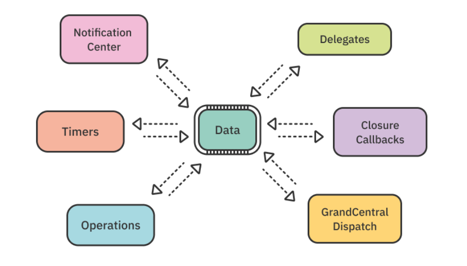


Combine introduces a common, high-level language to the Swift ecosystem to design and write asynchronous code.

Apple has integrated Combine into its other frameworks too, so Timer, NotificationCenter and core frameworks like Core Data already speak its language. Luckily, Combine is also very easy to integrate into your own code.

Finally, last but definitely not least, Apple designed their amazing UI framework, SwiftUI, to integrate easily with Combine as well.

To give you an idea of how committed Apple is to reactive programming with Combine, here's a simple diagram showing where Combine sits in the system hierarchy:

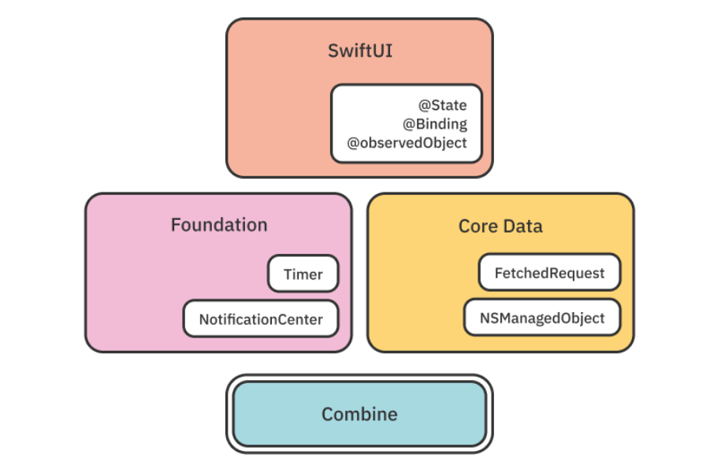


Various system frameworks, from Foundation all the way up to SwiftUI, depend on Combine and offer Combine integration as an alternative to their more "traditional" APIs.


### Swift's Modern Concurrency

Swift 5.5 introduces a range of APIs for developing asynchronous and concurrent code which, thanks to a new threading-pool model, allows your code to safely and quickly suspend and resume asynchronous work at will.

The modern concurrency APIs make many of the classic async problems fairly easy to solve - for example waiting on a network response, running multiple tasks in parallel, and more.

These APIs solve some of the same problems as Combine does, but Combine's strength lays in its rich set of operators. The operators that Combine offers for processing events over time make a lot of complex, common scenarios easy to address.

Reactive operators directly address a variety of common problems in networking, data processing, and handling UI events so for more complex applications there's a lot of benefit in developing with Combine.

And, speaking of Combine's strengths, let's have a quick look at reactive programming's excellent track so far.


### Foundation of Combine

Declarative, reactive programming isn't a new concept. It's been around for quite a while, but it's made a fairly noticeable comeback in the last decade.

The first "modern-day" reactive solution came in a big way in 2009 when a team at Microsoft launched a library called Reactive Extensions for .NET (Rx.NET).

Microsoft made that Rx.NET implementation open source in 2012, and since then, many different languages have started to use its concepts. Currently, there are many ports of the Rx standard like RxJS, RxKotlin, RxScala, RxPHP and more.

For Apple's platforms, there have been several third-party reactive frameworks like RxSwift, which implements the Rx standard; ReactiveSwift, directly inspired by Rx; Interstellar, which is a custom implementation and others.

Combine implements a standard that is different but similar to Rx, called Reactive Streams. Reactive Streams has a few key differences from Rx, but they both agree on most of the core concepts.

If you haven't previously used one or another of the frameworks mentioned above — don't worry. So far, reactive programming has been a rather niche concept for Apple's platforms, and especially with Swift.

In iOS 13/macOS Catalina, however, Apple brought reactive programming support to its ecosystem via the built-in system framework, Combine.

With that said, start by learning some of Combine's basics to see how it can help you write safe and solid asynchronous code.


### Combine basics

In broad strokes, the three key moving pieces in Combine are publishers, operators and subscribers. There are, of course, more players in the team, but without those three you can't achieve much.

You'll learn in detail about publishers and subscribers in Chapter 2, “Publishers & Subscribers,” and the complete second section of the book guides you through acquainting you with as many operators as humanly possible.

In this introductory chapter, however, you're going to get a simple crash course to give you a general idea of the purpose those types have in the code and what their responsibilities are.


#### Publishers

Publishers are types that can emit values over time to one or more interested parties, such as subscribers. Regardless of the internal logic of the publisher, which can be pretty much anything including math calculations, networking or handling user events, every publisher can emit multiple events of these three types:

1. An output value of the publisher's generic Output type.

2. A successful completion.

3. A completion with an error of the publisher's Failure type.


A publisher can emit zero or more output values, and if it ever completes, either successfully or due to a failure, it will not emit any other events.

Here's how a publisher emitting Int values could look like visualized on a timeline:

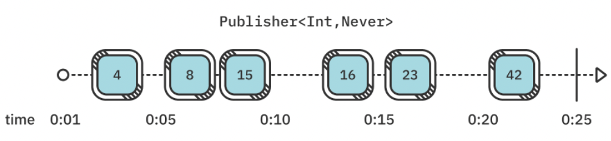


The blue boxes represent values that were emitted at a given time on the timeline, and the numbers represent the emitted values. A vertical line, like the one you see on the right-hand side of the diagram, represents a successful stream completion.

The simple contract of three possible events is so universal that it could represent any kind of dynamic data in your program. That's why you can address any task in your app using Combine publishers — regardless of whether it's about crunching numbers, making network calls, reacting to user gestures or displaying data on-screen.

Instead of always looking in your toolbox for the right tool to grab for the task at hand, be it adding a delegate or injecting a completion callback — you can just use a publisher instead.

One of the best features of publishers is that they come with error handling built in; error handling isn't something you add optionally at the end, if you feel like it.

The Publisher protocol is generic over two types, as you might have noticed in the diagram earlier:

- Publisher.Output is the type of the output values of the publisher. If it's an Int publisher, it can never emit a String or a Date value.

- Publisher.Failure is the type of error the publisher can throw if it fails. If the publisher can never fail, you specify that by using a Never failure type.

When you subscribe to a given publisher, you know what values to expect from it and which errors it could fail with.


#### Operators

Operators are methods declared on the Publisher protocol that return either the same or a new publisher. That's very useful because you can call a bunch of operators one after the other, effectively chaining them together.

Because these methods, called "operators", are highly decoupled and composable, they can be combined (aha!) to implement very complex logic over the execution of a single subscription.

It's fascinating how operators fit tightly together like puzzle pieces. They cannot be mistakenly put in the wrong order or fit together if one's output doesn't match the next one's input type:

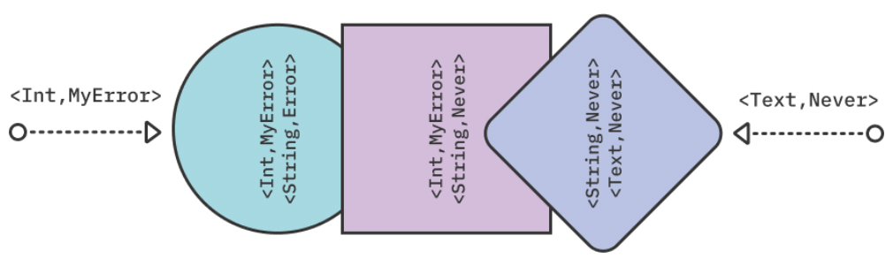


In a clear deterministic way, you can define the order of each of those asynchronous abstracted pieces of work alongside with the correct input/output types and built-in error handling. It's almost too good to be true!

As an added bonus, operators always have input and output, commonly referred to as upstream and downstream — this allows them to avoid shared state (one of the core issues we discussed earlier).

Operators focus on working with the data they receive from the previous operator and provide their output to the next one in the chain. This means that no other asynchronously-running piece of code can "jump in" and change the data you're working on.


#### Subscribers

Finally, you arrive at the end of the subscription chain: Every subscription ends with a subscriber. Subscribers generally do "something" with the emitted output or completion events.

Currently, Combine provides two built-in subscribers, which make working with data streams straightforward:

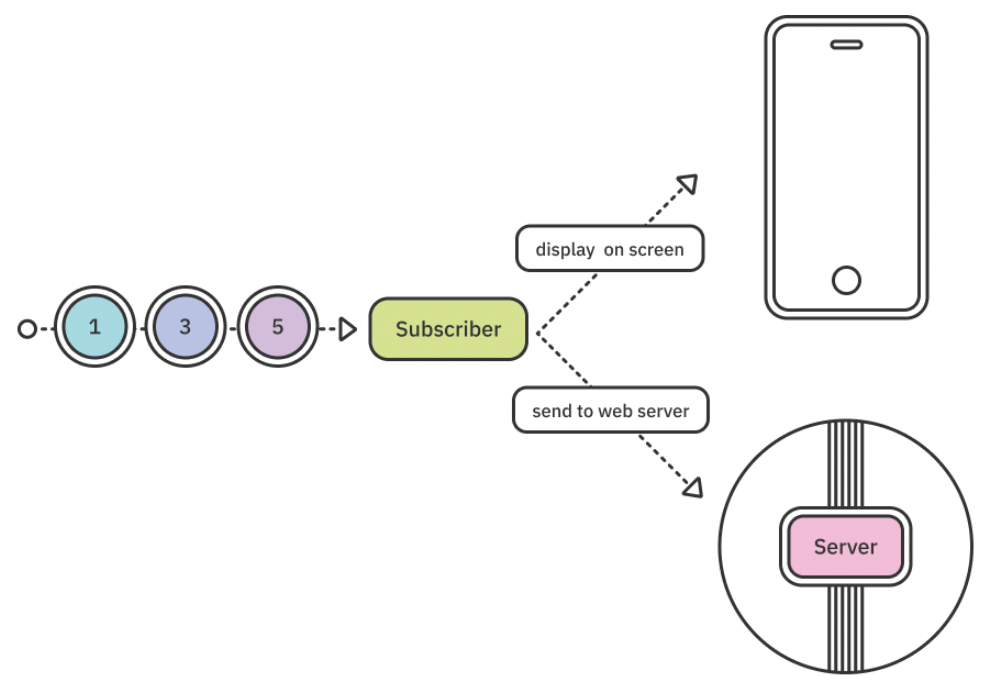


- The sink subscriber allows you to provide closures with your code that will receive output values and completions. From there, you can do anything your heart desires with the received events.

- The assign subscriber allows you to, without the need of custom code, bind the resulting output to some property on your data model or on a UI control to display the data directly on-screen via a key path.

Should you have other needs for your data, creating custom subscribers is even easier than creating publishers. Combine uses a set of very simple protocols that allow you to be able to build your own custom tools whenever the workshop doesn't offer the right one for your task.


#### Subscriptions

> Note: This book uses the term subscription to describe both Combine’s Subscription protocol and its conforming objects, as well as the complete chain of a publisher, operators and a subscriber.


When you add a subscriber at the end of a subscription, it "activates" the publisher all the way at the beginning of the chain. This is a curious but important detail to remember — publishers do not emit any values if there are no subscribers to potentially receive the output.

Subscriptions are a wonderful concept in that they allow you to declare a chain of asynchronous events with their own custom code and error handling only once, and then you never have to think about it again.

If you go full-Combine, you could describe your whole app's logic via subscriptions and once done, just let the system run everything without the need to push or pull data or call back this or that other object:

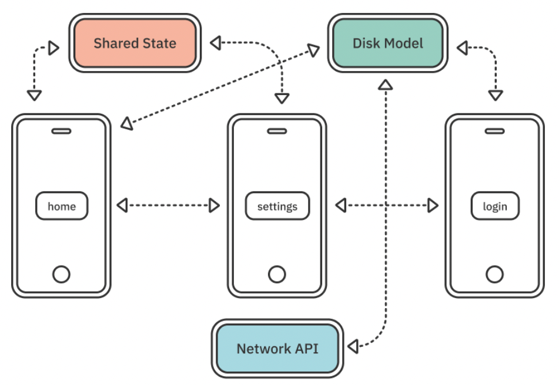


Once the subscription code compiles successfully and there are no logic issues in your custom code — you're done! The subscriptions, as designed, will asynchronously "fire" each time some event like a user gesture, a timer going off or something else awakes one of your publishers.

Even better, you don't need to specifically memory manage a subscription, thanks to a protocol provided by Combine called Cancellable.

Both system-provided subscribers conform to Cancellable, which means that your subscription code (e.g. the whole publisher, operators and subscriber call chain) returns a Cancellable object. Whenever you release that object from memory, it cancels the whole subscription and releases its resources from memory.

This means you can easily "bind" the lifespan of a subscription by storing it in a property on your view controller, for example. This way, any time the user dismisses the view controller from the view stack, that will deinitialize its properties and will also cancel your subscription.

Or to automate this process, you can just have an [AnyCancellable] collection property on your type and throw as many subscriptions inside it as you want. They'll all be automatically canceled and released when the property is released from memory.

As you see, there's plenty to learn, but it's all logical when explained in detail. And that's exactly what the plan is for the next chapters — to bring you slowly but steadily from zero to Combine hero by the end of this book.


### What's the benefit of Combine code over "standard" code?

You can, by all means, never use Combine and still create the best apps out there. There's no argument about that. You can also create the best apps without Core Data, URLSession, or even UIKit. But using those frameworks is more convenient, safe and efficient than building those abstractions yourself.

Combine (and other system frameworks) aim to add another abstraction to your async code. Another level of abstraction on the system level means tighter integration that's well tested and a safe-bet technology.

It's up to you to decide whether Combine is a great fit for your project or not, but here are just a few "pro" reasons you might not have considered yet:

- Combine is integrated on the system level. That means Combine itself uses language features that are not publicly available, offering you APIs that you couldn't build yourself.

- Combine abstracts many common operations as methods on the Publisher protocol and they're already well tested.

- When all of your asynchronous pieces of work use the same interface — Publisher — composition and reusability become extremely powerful.

- Combine's operators are highly composable. If you need to create a new one, that new operator will instantly plug-and-play with the rest of Combine.

- Combine'a asynchronous operators are already tested. All that's left for you to do is test your own business logic.


As you see, most of the benefits revolve around safety and convenience. Combined with the fact that the framework comes from Apple, investing in writing Combine code looks promising.


### App architecture

As this question is most likely already sounding alarms in your head, take a look at how using Combine will change your pre-existing code and app architecture.

Combine is not a framework that affects how you structure your apps. Combine deals with asynchronous data events and unified communication contract — it does not alter, for example, how you would separate responsibilities in your project.

You can use Combine in your MVC (Model-View-Controller) apps, you can use it in your MVVM (Model-View-ViewModel) code, in VIPER and so forth and so on.

This is one of the key aspects of adopting Combine that is important to understand early — you can add Combine code iteratively and selectively, using it only in the parts you wish to improve in your codebase. It's not an "all or nothing" choice you need to make.

You could start by converting your data models, or adapting your networking layer, or simply using Combine only in new code that you add to your app while keeping your existing functionality as-is.

It's a slightly different story if you're adopting Combine and SwiftUI at the same time. In that case, it really does make sense to drop the C from an MVC architecture. But that's thanks to using Combine and SwiftUI in tandem — those two are simply on fire when in the same room.

View controllers just don't have any chance against a Combine/SwiftUI team. When you use reactive programming all the way from your data model to your views, you don't need to have a special controller just to control your views:

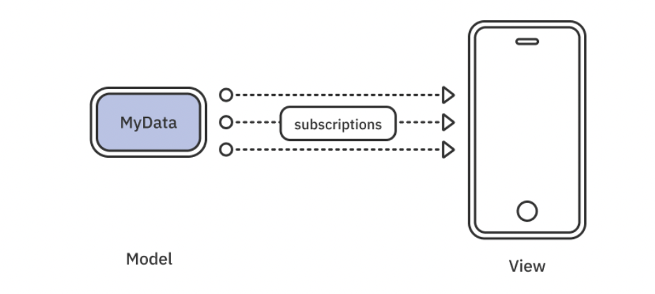


If that sounds interesting, you're in for a treat, as this book includes a solid introduction to using the two frameworks together in Chapter 15, “In Practice: Combine & SwiftUI.”


### Book projects

In this book, you'll start with the concepts first and move on to learning and trying out a multitude of operators.

Unlike other system frameworks, you can work pretty successfully with Combine in the isolated context of a playground.

Learning in an Xcode playground makes it easy to move forward and quickly experiment as you progress through a given chapter and to see instantly the results in Xcode's Console:

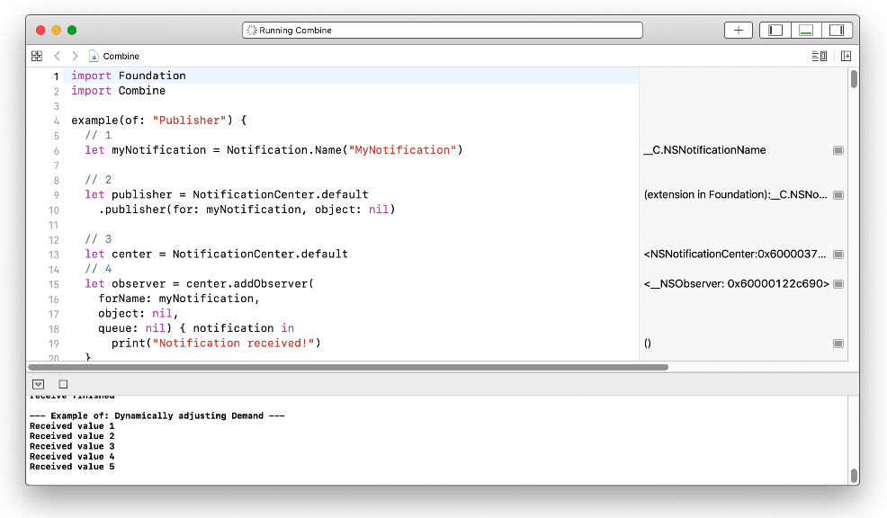

Combine does not require any third-party dependencies, so usually, a few simple helper files included with the starter playground code for each chapter will suffice to get you running. If Xcode ever gets stuck while you experiment in the playground, a quick restart will likely solve the issue.

Once you move to more complex concepts than playing with a single operator, you'll alternate between working in playgrounds and real Xcode projects like the Hacker News app, which is a newsreader that displays news in real time:

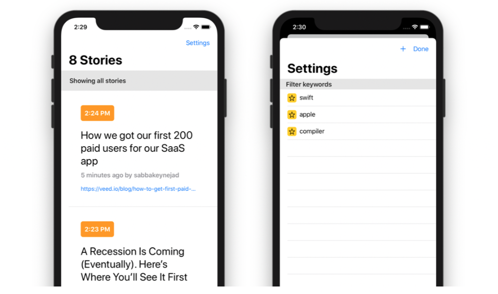


It's important that, for each chapter, you begin with the provided starter playground or project, as they might include some custom helper code which isn't relevant to learning Combine. These tidbits are pre-written so you don't distract yourself from the focus of that chapter.

In the last chapter, you’ll make use of all the skills you learned throughout the book as you finish developing a complete iOS app that relies heavily on Combine and Core Data. This will give you a final push on your road to building real-life applications with Combine!


### Key points

- Combine is a declarative, reactive framework for processing asynchronous events over time.

- It aims to solve existing problems, like unifying tools for asynchronous programming, dealing with mutable state and making error handling a starting team player.

- Combine revolves around three main types: publishers to emit events over time, operators to asynchronously process and manipulate upstream events and subscribers to consume the results and do something useful with them.


### Where to go from here?

Hopefully, this introductory chapter has been useful and has given you an initial understanding of the issues Combine addresses as well as a look at some of the tools it offers to make your asynchronous code safer and more reliable.

Another important takeaway from this chapter is what to expect from Combine and what is out of its scope. Now, you know what you're in for when we speak of reactive code or asynchronous events over time. And, of course, you don't expect using Combine to magically solve your app's problems with navigation or drawing on-screen.

Finally, having a taste of what's in store for you in the upcoming chapters has hopefully gotten you excited about Combine and reactive programming with Swift. Upwards and onwards, here we go!


## Chapter 2: Publishers & Subscribers

Now that you’ve learned some of the basic concepts of Combine, it’s time to jump in and play with two of Combine’s core components — publishers and subscribers.

In this chapter, you’ll experiment with various ways to create publishers and subscribe them so that you feel right at home when you need to do so throughout the book.

> Note: There are starter and final versions of the playgrounds and projects that you’ll use in each of the chapters in this book. The starter is ready for you to enter the code for each example and challenge. You can compare your work with the final version at the end or along the way if you get stuck.


### Getting started

For this chapter, you’ll use an Xcode playground with Combine imported. Open Starter.playground in the projects folder and you’ll see the following:

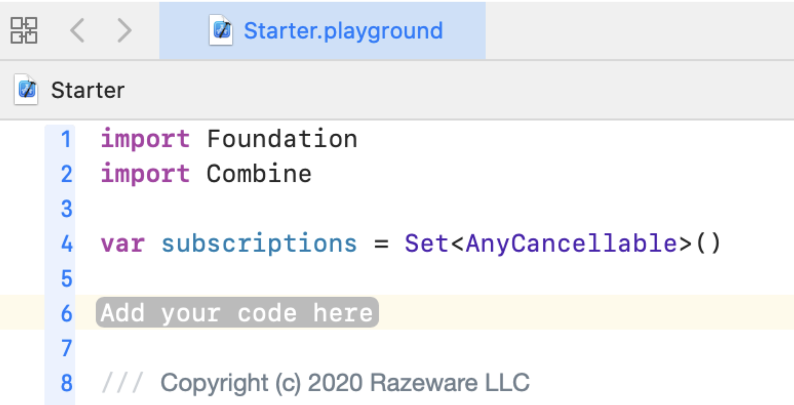


Open Sources in the Project navigator (View ▸ Navigators ▸ Show Project Navigator and twist down the Combine playground page), and select SupportCode.swift. It contains the following helper function example(of:):

```swift
public func example(of description: String,
                    action: () -> Void) {
  print("\n——— Example of:", description, "———")
  action()
}
```

You’ll use this function to encapsulate each example you’ll work on in a playground throughout the book.

However, before you begin playing with those examples, you first need to look at publishers, subscribers and subscriptions in a bit more detail. They form the foundation of Combine and enable you to send and receive data, typically asynchronously.


### Hello Publisher

At the heart of Combine is the Publisher protocol. This protocol defines the requirements for a type to be able to transmit a sequence of values over time to one or more subscribers. In other words, a publisher publishes or emits events that can include values of interest.

The idea of subscribing a publisher is similar to subscribing for a specific notification from NotificationCenter. With NotificationCenter you express interest in certain events and then you're notified asynchronously whenever a new event comes through.

In fact, they are so similar, that NotificationCenter has a method named `publisher(for:object:)` that provides a Publisher type that can publish notifications.

To check this out in practice, go back to the starter playground and replace the `Add your code here` placeholder with the following code:

```swift
example(of: "Publisher") {
    // 1
    let myNotification = Notification.Name("MyNotification")
    
    // 2
    let publisher = NotificationCenter.default
        .publisher(for: myNotification, object: nil)
}

```


In this code, you:

1. Create a notification name.

2. Access NotificationCenter’s default instance, call its `publisher(for:object:)` method and assign its return value to a local constant.

Option-click on `publisher(for:object:)`, and you’ll see that it returns a Publisher that emits an event when the default notification center broadcasts a notification.

So what’s the point of publishing notifications when a notification center is already capable of broadcasting its notifications without a publisher? Glad you asked!

You can think of these types of methods as a bridge from the older async APIs to the newer alternatives — a way to Combine-ify them, if you will.

A publisher emits two kinds of events:

Values, also referred to as elements.

A completion event.

A publisher can emit zero or more values but only one completion event, which can either be a normal completion event or an error. Once a publisher emits a completion event, it’s finished and can no longer emit any more events.

> Note: In that sense, a publisher is somewhat similar to a Swift iterator. One very valuable difference is that a Publisher's completion could be either successful or a failure, and also that you need to actively pull values from an iterator, while a Publisher pushes values to its consumers.


Next, you’ll wrap up the current example by using NotificationCenter to observe for and post a notification. You’ll also unregister that observer when you’re no longer interested in receiving that notification.

Append the following code to what you already have in the example's closure:

```swift
// 3
let center = NotificationCenter.default

// 4
let observer = center.addObserver(
    forName: myNotification,
    object: nil,
    queue: nil) { notification in
        print("Notification received!")
    }

// 5
center.post(name: myNotification, object: nil)

// 6
center.removeObserver(observer)
```

With this code, you:

3. Get a handle to the default notification center.

4. Create an observer to listen for the notification with the name you previously created.

5. Post a notification with that name.

6. Remove the observer from the notification center.

Run the playground. You’ll see this output printed to the console:

```
——— Example of: Publisher ———
Notification received!
```


The example's title is a little misleading because the output is not actually coming from a publisher. For that to happen, you need a subscriber.


### Hello Subscriber

Subscriber is a protocol that defines the requirements for a type to be able to receive input from a publisher. You’ll dive deeper into conforming to the Publisher and Subscriber protocols shortly; for now, you’ll focus on the basic flow.

Add a new example to the playground that begins like the previous one:

```swift
example(of: "Subscriber") {
    let myNotification = Notification.Name("MyNotification")
    let center = NotificationCenter.default
    
    let publisher = center.publisher(for: myNotification, object: nil)
    
}
```

If you were to post a notification now, the publisher wouldn’t emit it because there is no subscription to consume the notification yet.


#### Subscribing with `sink(_:_:)`

Continue in the previous example and add the following code:

```swift
// 1
let subscription = publisher
    .sink { _ in
        print("Notification received from a publisher!")
    }

// 2
center.post(name: myNotification, object: nil)
// 3
subscription.cancel()
```


With this code, you:

1. Create a subscription by calling `sink` on the publisher.

2. Post the notification.

3. Cancel the subscription.

Don’t let the obscurity of the `sink` method name give you a sinking feeling. Option-click on `sink` and you’ll see that it provides an easy way to attach a subscriber with closures to handle output from a publisher. In this example, you just print a message to indicate that a notification was received. You’ll learn more about canceling a subscription shortly.

Run the playground and you’ll see the following:

```
——— Example of: Publisher ———
Notification received from a publisher!
```


The sink operator will continue to receive as many values as the publisher emits - this is known as unlimited demand. And although you ignored them in the previous example, the sink operator actually provides two closures: one to handle receiving a completion event (a success or a failure), and one to handle receiving values.

To try those out, add this new example to your playground:

```swift
example(of: "Just") {
    // 1
    let just = Just("Hello world!")
    
    // 2
    _ = just
        .sink(
            receiveCompletion: {
                print("Received completion", $0)
            },
            receiveValue: {
                print("Received value", $0)
            })
}
```

Here, you:

1. Create a publisher using Just, which lets you create a publisher from a single value.

2. Create a subscription to the publisher and print a message for each received event.

Run the playground. You’ll see the following:

```
——— Example of: Just ———
Received value Hello world!
Received completion finished
```

Option-click on `Just` and the Quick Help explains that it’s a publisher that emits its output to each subscriber once and then finishes.

Try adding another subscriber by adding the following code to the end of your example:

```swift
_ = just
    .sink(
        receiveCompletion: {
            print("Received completion (another)", $0)
        },
        receiveValue: {
            print("Received value (another)", $0)
        })
```

Run the playground. True to its word, a Just happily emits its output to each new subscriber exactly once and then finishes.

```
Received value (another) Hello world!
Received completion (another) finished
```


#### Subscribing with `assign(to:on:)`

In addition to `sink`, the built-in `assign(to:on:)` operator enables you to assign the received value to a KVO-compliant property of an object.Add this example to see how this works:

```swift
example(of: "assign(to:on:)") {
    // 1
    class SomeObject {
        var value: String = "" {
            didSet {
                print(value)
            }
        }
    }
    
    // 2
    let object = SomeObject()
    
    // 3
    let publisher = ["Hello", "world!"].publisher
    
    // 4
    _ = publisher
        .assign(to: \.value, on: object)
}
```

From the top:

1. Define a class with a property that has a `didSet` property observer that prints the new value.

2. Create an instance of that class.

3. Create a publisher from an array of strings.

4. Subscribe to the publisher, assigning each value received to the `value` property of the object.

Run the playground and you will see printed:

```
——— Example of: assign(to:on:) ———
Hello
world!
```

> Note: In later chapters you'll see that `assign(to:on:)` is especially useful when working on UIKit or AppKit apps because you can assign values directly to labels, text views, checkboxes and other UI components.


#### Republishing with `assign(to:)`

There is a variation of the `assign` operator that you can use to republish values emitted by a publisher through another property marked with the `@Published` property wrapper. To try this add this new example to your playground:

```swift
example(of: "assign(to:)") {
    // 1
    class SomeObject {
        @Published var value = 0
    }
    
    let object = SomeObject()
    
    // 2
    object.$value
        .sink {
            print($0)
        }
    
    // 3
    (0..<10).publisher
        .assign(to: &object.$value)
}
```

With this code, you:

1. Define and create an instance of a class with a property annotated with the `@Published` property wrapper, which creates a publisher for value in addition to being accessible as a regular property.

2. Use the `$` prefix on the `@Published` property to gain access to its underlying publisher, subscribe to it, and print out each value received.

3. Create a publisher of numbers and assign each value it emits to the value publisher of `object`. Note the use of `&` to denote an inout reference to the property.


The `assign(to:)` operator doesn't return an `AnyCancellable` token, because it manages the lifecycle internally and cancels the subscription when the `@Published` property deinitializes.

You might wonder how is this useful compared to simply using `assign(to:on:)`? Consider the following example (you don't need to add this to the playground):

```swift
class MyObject {
    @Published var word: String = ""
    var subscriptions = Set<AnyCancellable>()
    
    init() {
        ["A", "B", "C"].publisher
            .assign(to: \.word, on: self)
            .store(in: &subscriptions)
    }
}
```

In this example, using `assign(to: \.word, on: self)` and storing the resulting `AnyCancellable` results in a strong reference cycle. Replacing `assign(to:on:)` with `assign(to: &$word)` prevents this problem.

You’ll focus on using the sink operator for now, but you’ll learn more about the use of `@Published` properties in Chapter 8, "In Practice: Project "Collage"," and in later chapters.


### Hello Cancellable

When a subscriber finishes its work and no longer wants to receive values from a publisher, it’s a good idea to cancel the subscription to free up resources and stop any corresponding activities from occurring, such as network calls.

Subscriptions return an instance of `AnyCancellable` as a "cancellation token," which makes it possible to cancel the subscription when you’re done with it. `AnyCancellable` conforms to the `Cancellable` protocol, which requires the `cancel() `method exactly for that purpose.

At the bottom of the Subscriber example earlier, you added the code `subscription.cancel()`. You're able to call `cancel()` on the subscription because the `Subscription` protocol inherits from `Cancellable`.

If you don’t explicitly call `cancel()` on a subscription, it will continue until the publisher completes, or until normal memory management causes a stored subscription to deinitialize. At that point it cancels the subscription for you.

> Note: It’s also fine to ignore the return value from a subscription in a playground (for example, `_ = just.sink...`). However, one caveat: if you don’t store a subscription in full projects, that subscription will cancel as soon as the program flow exits the scope in which it was created!

These are good examples to start with, but there’s a lot more going on behind the scenes. It’s time to lift the curtain and learn more about the roles of publishers, subscribers and subscriptions in Combine.


### Understanding what’s going on

They say a picture is worth a thousand words, so let’s kick things off with one to explain the interplay between publishers and subscribers:

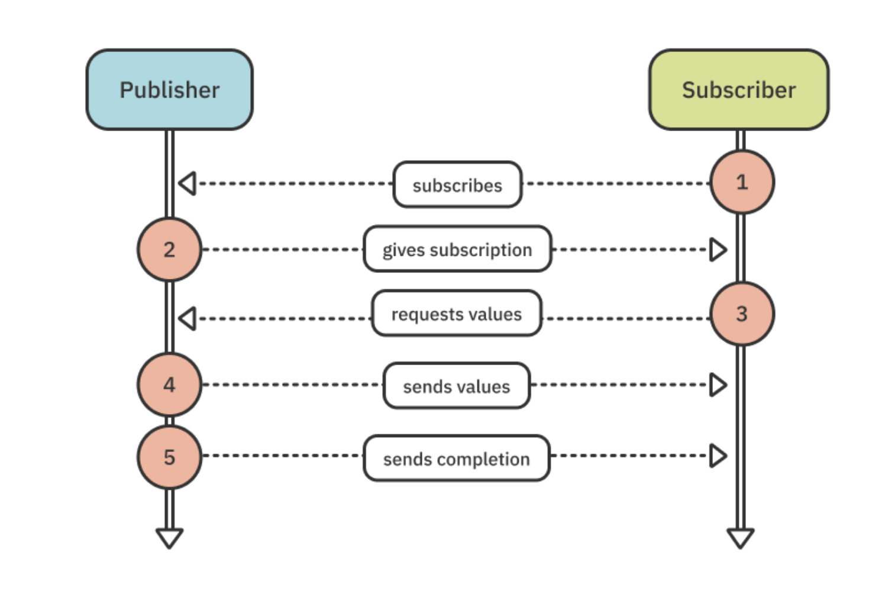

Walking through this UML diagram:

1. The subscriber subscribes to the publisher.

2. The publisher creates a subscription and gives it to the subscriber.

3. The subscriber requests values.

4. The publisher sends values.

5. The publisher sends a completion.

> Note: The above diagram provides a streamlined overview of what’s going on. Later, you’ll gain a deeper understanding of this process in Chapter 18, “Custom Publishers & Handling Backpressure.”


Take a look at the `Publisher` protocol and one of its most important extensions:

```swift
public protocol Publisher {
    // 1
    associatedtype Output
    
    // 2
    associatedtype Failure : Error
    
    // 4
    func receive<S>(subscriber: S)
    where S: Subscriber,
          Self.Failure == S.Failure,
          Self.Output == S.Input
}

extension Publisher {
    // 3
    public func subscribe<S>(_ subscriber: S)
    where S : Subscriber,
          Self.Failure == S.Failure,
          Self.Output == S.Input
}
```

Here’s a closer look:

1. The type of values that the publisher can produce.

2. The type of error a publisher may produce, or `Never` if the publisher is guaranteed to not produce an error.

3. A subscriber calls subscribe(_:) on a publisher to attach to it.

4. The implementation of subscribe(_:) will call receive(subscriber:) to attach the subscriber to the publisher, i.e., create a subscription.


The associated types are the publisher’s interface that a subscriber must match in order to create a subscription. Now, look at the Subscriber protocol:

```swift
public protocol Subscriber: CustomCombineIdentifierConvertible {
    // 1
    associatedtype Input
    
    // 2
    associatedtype Failure: Error
    
    // 3
    func receive(subscription: Subscription)
    
    // 4
    func receive(_ input: Self.Input) -> Subscribers.Demand
    
    // 5
    func receive(completion: Subscribers.Completion<Self.Failure>)
}
```

Here’s a closer look:

1. The type of values a subscriber can receive.

2. The type of error a subscriber can receive; or `Never` if the subscriber won’t receive an error.

3. The publisher calls `receive(subscription:)` on the subscriber to give it the subscription.

4. The publisher calls `receive(_:)` on the subscriber to send it a new value that it just published.

5. The publisher calls `receive(completion:)` on the subscriber to tell it that it has finished producing values, either normally or due to an error.

The connection between the publisher and the subscriber is the subscription. Here’s the Subscription protocol:

```swift
public protocol Subscription: Cancellable, CustomCombineIdentifierConvertible {
    func request(_ demand: Subscribers.Demand)
}
```

The subscriber calls `request(_:)` to indicate it is willing to receive more values, up to a max number or unlimited.

> Note: We call the concept of a subscriber stating how many values it’s willing to receive backpressure management. Without it, or some other strategy, a subscriber could get flooded with more values from the publisher than it can handle.


In Subscriber, notice that `receive(_:)` returns a `Demand`. Even though `subscription.request(_:)` sets the initial max number of values a subscriber is willing to receive, you can adjust that max each time a new value is received.

> Note: Adjusting max in `Subscriber.receive(_:)` is additive, i.e., the new max value is added to the current max. The max value must be positive, and passing a negative value will result in a fatalError. This means that you can increase the original max each time a new value is received, but you cannot decrease it.


Creating a custom subscriber

Time to put what you just learned to practice. Add this new example to your playground:

```swift
example(of: "Custom Subscriber") {
    // 1
    let publisher = (1...6).publisher
    
    // 2
    final class IntSubscriber: Subscriber {
        // 3
        typealias Input = Int
        typealias Failure = Never
        
        // 4
        func receive(subscription: Subscription) {
            subscription.request(.max(3))
        }
        
        // 5
        func receive(_ input: Int) -> Subscribers.Demand {
            print("Received value", input)
            return .none
        }
        
        // 6
        func receive(completion: Subscribers.Completion<Never>) {
            print("Received completion", completion)
        }
    }
}
```

What you do here is:

1. Create a publisher of integers via the range’s publisher property.

2. Define a custom subscriber, `IntSubscriber`.

3. Implement the type aliases to specify that this subscriber can receive integer inputs and will never receive errors.

4. Implement the required methods, beginning with `receive(subscription:)`, called by the publisher; and in that method, call `.request(_:)` on the subscription specifying that the subscriber is willing to receive up to three values upon subscription.
5. Print each value as it’s received and return`.none`, indicating that the subscriber will not adjust its demand; `.none` is equivalent to .max(0).

6. Print the completion event.

For the publisher to publish anything, it needs a subscriber. Add the following at the end of the example:

```swift
let subscriber = IntSubscriber()
publisher.subscribe(subscriber)
```


In this code, you create a subscriber that matches the Output and Failure types of the publisher. You then tell the publisher to subscribe, or attach, the subscriber.

Run the playground. You’ll see the following printed to the console:

```
——— Example of: Custom Subscriber ———
Received value 1
Received value 2
Received value 3
```

You did not receive a completion event. This is because the publisher has a finite number of values, and you specified a demand of `.max(3)`.

In your custom subscriber’s `receive(_:)`, try changing `.none` to `.unlimited`, so your `receive(_:)` method looks like this:

```swift
func receive(_ input: Int) -> Subscribers.Demand {
  	print("Received value", input)
  	return .unlimited
}
```

Run the playground again. This time you’ll see that the output contains all values, along with the completion event:

```
——— Example of: Custom Subscriber ———
Received value 1
Received value 2
Received value 3
Received value 4
Received value 5
Received value 6
Received completion finished
```


Try changing `.unlimited` to `.max(1)` and run the playground again.

You’ll see the same output as when you returned `.unlimited`, because each time you receive an event, you specify that you want to increase the max by 1.

Change `.max(1)` back to `.none`, and change the definition of publisher to an array of strings instead. Replace:

```swift
let publisher = (1...6).publisher
```

With:

```swift
let publisher = ["A", "B", "C", "D", "E", "F"].publisher
```

Run the playground. You get an error that the subscribe method requires types `String` and `IntSubscriber.Input` (i.e., `Int`) to be equivalent. You get this error because the `Output` and `Failure` associated types of a publisher must match the `Input` and `Failure` types of a subscriber in order to create a subscription between the two.

Change the publisher definition back to its original range of integers to resolve the error.


### Hello Future

Much like you can use `Just` to create a publisher that emits a single value to a subscriber and then complete, a `Future` can be used to asynchronously produce a single result and then complete. Add this new example to your playground:

```swift
example(of: "Future") {
    func futureIncrement(
        integer: Int,
        afterDelay delay: TimeInterval) -> Future<Int, Never> {
            
        }
}
```

Here, you create a factory function that returns a `future` of type `Int` and `Never`; meaning, it will emit an integer and never fail.

You also add a subscriptions set in which you’ll store the subscriptions to the `future` in the example. For long-running asynchronous operations, not storing the subscription will result in the cancelation of the subscription as soon as the current code scope ends. In the case of a Playground, that would be immediately.

Next, fill the function’s body to create the `future`:

```swift
Future<Int, Never> { promise in
    DispatchQueue.global().asyncAfter(deadline: .now() + delay) {
        promise(.success(integer + 1))
    }
}
```

This code defines the future, which creates a promise that you then execute using the values specified by the caller of the function to increment the integer after the delay.

A Future is a publisher that will eventually produce a single value and finish, or it will fail. It does this by invoking a closure when a value or error is available, and that closure is, in fact, the promise. Command-click on Future and choose Jump to Definition. You’ll see the following:

```swift
final public class Future<Output, Failure> : Publisher
  where Failure: Error {
  public typealias Promise = (Result<Output, Failure>) -> Void
  ...
}
```

Promise is a type alias to a closure that receives a `Result` containing either a single value published by the `Future`, or an error.

Head back to the main playground page, and add the following code after the definition of futureIncrement:

```swift
// 1
let future = futureIncrement(integer: 1, afterDelay: 3)

// 2
future
    .sink(receiveCompletion: { print($0) },
          receiveValue: { print($0) })
    .store(in: &subscriptions)
```

Here, you:

1. Create a future using the factory function you created earlier, specifying to increment the integer you passed after a three-second delay.

2. Subscribe to and print the received value and completion event, and store the resulting subscription in the subscriptions set. You’ll learn more about storing subscriptions in a collection later in this chapter, so don’t worry if you don’t entirely understand that portion of the example.

Run the playground. You’ll see the example title printed, followed by the output of the future after a three-second delay:

```
——— Example of: Future ———
2
finished
```


Add a second subscription to the future by entering the following code in the playground:

```swift
future
    .sink(receiveCompletion: { print("Second", $0) },
          receiveValue: { print("Second", $0) })
    .store(in: &subscriptions)
```

Before running the playground, insert the following print statement immediately before the DispatchQueue block in the futureIncrement function:

```swift
print("Original")
```

Run the playground. After the specified delay, the second subscription receives the same value. The future does not re-execute its promise; instead, it shares or replays its output.

```
——— Example of: Future ———
Original
2
finished
Second 2
Second finished
```

The code prints Original right away before the subscriptions occur. This happens because a `future` is greedy, meaning executes as soon as it's created. It does not require a subscriber like regular publishers that are lazy.

In the last few examples, you’ve been working with publishers that have a finite number of values to publish, which are sequentially and synchronously published.

The notification center example you started with is an example of a publisher that can keep on publishing values indefinitely and asynchronously, provided:

1. The underlying notification sender emits notifications.

2. There are subscribers to the specified notification.

What if there was a way that you could do the same thing in your own code? Well, it turns out, there is! Before moving on, comment out the entire "Future" example, so the future isn’t invoked every time you run the playground — otherwise its delayed output is printed after the last example.


### Hello Subject

You’ve already learned how to work with publishers and subscribers, and even how to create your own custom subscribers. Later in the book, you’ll learn how to create custom publishers. For now, though, there’s just a couple more things standing between you and a well-deserved <insert your favorite beverage> break. First is a `subjec`t.

A subject acts as a go-between to enable non-Combine imperative code to send values to Combine subscribers. That <favorite beverage> isn’t going to drink itself, so it’s time to get to work!

Add this new example to your playground:

```swift
example(of: "PassthroughSubject") {
    // 1
    enum MyError: Error {
        case test
    }
    
    // 2
    final class StringSubscriber: Subscriber {
        typealias Input = String
        typealias Failure = MyError
        
        
        func receive(subscription: Subscription) {
            subscription.request(.max(2))
        }
        
        func receive(_ input: String) -> Subscribers.Demand {
            print("Received value", input)
            // 3
            return input == "World" ? .max(1) : .none
        }
        
        func receive(completion: Subscribers.Completion<MyError>) {
            print("Received completion", completion)
        }
        
    }
    
    // 4
    let subscriber = StringSubscriber()
}
```

With this code, you:

1. Define a custom error type.

2. Define a custom subscriber that receives strings and `MyError` errors.

3. Adjust the demand based on the received value.

4. Create an instance of the custom subscriber.

Returning `.max(1)` in `receive(_:)` when the input is "World" results in the new max being set to 3 (the original max plus 1).

Other than defining a custom error type and pivoting on the received value to adjust demand, there’s nothing new here. Here comes the more interesting part.Add this code to the example:

```swift
// 5
let subject = PassthroughSubject<String, MyError>()

// 6
subject.subscribe(subscriber)

// 7
let subscription = subject
    .sink(
        receiveCompletion: { completion in
            print("Received completion (sink)", completion)
        },
        receiveValue: { value in
            print("Received value (sink)", value)
        }
    )
```

This code:

5. Creates an instance of a `PassthroughSubject` of type `String` and the custom error type you defined.

6. Subscribes the subscriber to the `subject`.

7. Creates another subscription using `sink`.

`Passthrough subjects` enable you to publish new values on demand. They will happily pass along those values and a completion event. As with any publisher, you must declare the type of values and errors it can emit in advance; subscribers must match those types to its input and failure types in order to subscribe to that passthrough subject.

Now that you’ve created a passthrough subject that can send values and subscriptions to receive them, it’s time to send some values. Add the following code to your example:

```swift
subject.send("Hello")
subject.send("World")
```


This sends two values (one at a time) using the subject’s send method.

Run the playground. You’ll see:

```
——— Example of: PassthroughSubject ———
Received value Hello
Received value (sink) Hello
Received value World
Received value (sink) World
```

Each subscriber receives the values as they’re published.

Add the following code:

```swift
// 8
subscription.cancel()

// 9
subject.send("Still there?")
```

Here, you:

8. Cancel the second subscription.

9. Send another value.


Run the playground. As you might have expected, only the first subscriber receives the value. This happens because you previously canceled the second subscriber’s subscription:

```
——— Example of: PassthroughSubject ———
Received value Hello
Received value (sink) Hello
Received value World
Received value (sink) World
Received value Still there?
```

Add this code to the example:

```swift
subject.send(completion: .finished)
subject.send("How about another one?")
```

Run the playground. The second subscriber does not receive the "How about another one?" value, because it received the completion event right before the subjects sends the value. The first subscriber does not receive the completion event or the value, because its subscription was previously canceled.

```
——— Example of: PassthroughSubject ———
Received value Hello
Received value (sink) Hello
Received value World
Received value (sink) World
Received value Still there?
Received completion finished
```

Add the following code immediately before the line that sends the completion event.

```
subject.send(completion: .failure(MyError.test))
```

Run the playground, again. You’ll see the following printed to the console:

```
——— Example of: PassthroughSubject ———
Received value Hello
Received value (sink) Hello
Received value World
Received value (sink) World
Received value Still there?
Received completion failure(...MyError.test)
```

> Note: The error type is abbreviated for readability.


The first subscriber receives the error, but not the completion event sent after the error. This demonstrates that once a publisher sends a single completion event — whether it’s a normal completion or an error — it’s done, as in fini, kaput! Passing through values with a `PassthroughSubject` is one way to bridge imperative code to the declarative world of Combine. Sometimes, however, you may also want to look at the current value of a publisher in your imperative code — for that, you have an aptly named subject: `CurrentValueSubject`.

Instead of storing each subscription as a value, you can store multiple subscriptions in a collection of `AnyCancellable`. The collection will then automatically cancel each subscription added to it shortly before the collection deinitializes.

Add this new example to your playground:

```swift
example(of: "CurrentValueSubject") {
    // 1
    var subscriptions = Set<AnyCancellable>()
    
    // 2
    let subject = CurrentValueSubject<Int, Never>(0)
    
    // 3
    subject
        .sink(receiveValue: { print($0) })
        .store(in: &subscriptions) // 4
}
```

Here’s what’s happening:

1. Create a subscriptions set.

2. Create a `CurrentValueSubject` of type `Int` and `Never`. This will publish integers and never publish an error, with an initial value of 0.

3. Create a subscription to the subject and print values received from it.

4. Store the subscription in the subscriptions set (passed as an inout parameter instead of a copy).

You must initialize current value subjects with an initial value; new subscribers immediately get that value or the latest value published by that subject. Run the playground to see this in action:

```
——— Example of: CurrentValueSubject ———
0
```

Now, add this code to send two new values:

```swift
subject.send(1)
subject.send(2)
```

Run the playground again. Those values are also received and printed to the console:

```
1
2
```

Unlike a passthrough subject, you can ask a current value subject for its value at any time. Add the following code to print out the subject’s current value:

```swift
print(subject.value)
```

As you might have inferred by the subject’s type name, you can get its current value by accessing its value property. Run the playground, and you’ll see 2 printed a second time.

```
——— Example of: CurrentValueSubject ———
0
1
2
2
```

Calling `send(_:)` on a current value subject is one way to send a new value. Another way is to assign a new value to its value property. Whoah, did we just go all imperative here or what? Add this code:

```swift
subject.value = 3
print(subject.value)
```


Run the playground. You’ll see 2 and 3 each printed twice — once by the receiving subscriber and once from printing the subject’s value after adding that value to the subject.

Next, at the end of this example, create a new subscription to the current value subject:

```swift
subject
    .sink(receiveValue: { print("Second subscription:", $0) })
    .store(in: &subscriptions)
```

Here, you create a subscription and print the received values. You also store that subscription in the subscriptions set.

You read a moment ago that the subscriptions set will automatically cancel the subscriptions added to it, but how can you verify this? You can use the `print()` operator, which will log all publishing events to the console.

Insert the print() operator in both subscriptions, between subject and sink. The beginning of each subscription should look like this:

```swift
subject
		.print()
  	.sink...
```

Run the playground again and you’ll see the following output for the entire example:

```
——— Example of: CurrentValueSubject ———
receive subscription: (CurrentValueSubject)
request unlimited
receive value: (0)
0
receive value: (1)
1
receive value: (2)
2
2
receive value: (3)
3
3
receive subscription: (CurrentValueSubject)
request unlimited
receive value: (3)
Second subscription: 3
receive cancel
```

The code prints each event along with the values printed in the subscription handlers, and when you printed the subject’s values. The receive cancel events appear because the subscriptions set is defined within the scope of this example, so it cancels the subscriptions it contains when deinitialized.

So, you may be wondering, can you also assign a completion event to the value property? Try it out by adding this code:

```swift
subject.value = .finished
```

Nope! That produces an error. A CurrentValueSubject’s value property is for just that: values. You still need to send completion events by using `send(_:)`. Change the erroneous line of code to the following:

```swift
subject.send(completion: .finished)
```

Run the playground again. This time you’ll see the following output at the bottom:

Both subscriptions receive the completion event instead of the cancel event. Since they've finished, you no longer need to cancel those.


### Dynamically adjusting demand

You learned earlier that adjusting demand in `Subscriber.receive(_:)` is additive. You’re now ready to take a closer look at how that works in a more elaborate example. Add this new example to the playground:

```swift
example(of: "Dynamically adjusting Demand") {
    final class IntSubscriber: Subscriber {
        typealias Input = Int
        typealias Failure = Never
        
        func receive(subscription: Subscription) {
            subscription.request(.max(2))
        }
        
        func receive(_ input: Int) -> Subscribers.Demand {
            print("Received value", input)
            
            switch input {
            case 1:
                return .max(2) // 1
            case 3:
                return .max(1) // 2
            default:
                return .none // 3
            }
        }
        
        func receive(completion: Subscribers.Completion<Never>) {
            print("Received completion", completion)
        }
    }
    
    let subscriber = IntSubscriber()
    
    let subject = PassthroughSubject<Int, Never>()
    
    subject.subscribe(subscriber)
    
    subject.send(1)
    subject.send(2)
    subject.send(3)
    subject.send(4)
    subject.send(5)
    sub
```


Most of this code is similar to example you’ve previously worked on in this chapter, so instead you’ll focus on the `receive(_:)` method. You continually adjust the demand from within your custom subscriber:

1. The new max is 4 (original max of 2 + new max of 2).

2. The new max is 5 (previous 4 + new 1).

3. max remains 5 (previous 4 + new 0).

Run the playground and you’ll see the following:

```
——— Example of: Dynamically adjusting Demand ———
Received value 1
Received value 2
Received value 3
Received value 4
Received value 5
```

As expected, the code emits five values but the sixth is not printed.

There is one more important thing you’ll want to know about before moving on: hiding details about a publisher from subscribers.


### Type erasure

There will be times when you want to let subscribers subscribe to receive events from a publisher without being able to access additional details about that publisher.

This would be best demonstrated with an example, so add this new one to your playground:

```swift
example(of: "Type erasure") {
    // 1
    let subject = PassthroughSubject<Int, Never>()

    // 2
    let publisher = subject.eraseToAnyPublisher()
    
    // 3
    publisher
        .sink(receiveValue: { print($0) })
        .store(in: &subscriptions)
    
    // 4
    subject.send(0)
}
```

With this code you:

1. Create a passthrough subject.

2. Create a type-erased publisher from that subject.

3. Subscribe to the type-erased publisher.

4. Send a new value through the passthrough subject.

Option-click on publisher and you’ll see that it is of type `AnyPublisher<Int, Never>`.

`AnyPublisher` is a type-erased struct that conforms the `Publisher` protocol. Type erasure allows you to hide details about the publisher that you may not want to expose to subscribers — or downstream publishers, which you’ll learn about in the next section.

Are you experiencing a little déjà vu right now? If so, that’s because you saw another case of type erasure earlier. AnyCancellable is a type-erased class that conforms to Cancellable, which lets callers cancel the subscription without being able to access the underlying subscription to do things like request more items.

One example of when you would want to use type erasure for a publisher is when you want to use a pair of public and private properties, to allow the owner of those properties to send values on the private publisher, and let outside callers only access the public publisher for subscribing but not be able to send values.

`AnyPublisher` does not have a `send(_:)` operator, so you cannot add new values to that publisher directly.

The `eraseToAnyPublisher()` operator wraps the provided publisher in an instance of `AnyPublisher`, hiding the fact that the publisher is actually a `PassthroughSubject`. This is also necessary because you cannot specialize the Publisher protocol, e.g., you cannot define the type as `Publisher<UIImage, Never>`.

To prove that publisher is type-erased and you cannot use it to send new values, add this code to the example.

```swift
publisher.send(1)
```

You get the error Value of type `AnyPublisher<Int, Never>` has no member `send`. Comment out that line of code before moving on.


### Bridging Combine publishers to async/await

Two great additions to the Combine framework in Swift 5.5, available in iOS 15 and macOS 12, help you effortlessly use Combine with the new async/await syntax in Swift.

In other words — all publishers, futures and subjects you learn about in this book can used from your modern Swift code at no cost.

Add one last example to your playground:

```swift
example(of: "async/await") {
    let subject = CurrentValueSubject<Int, Never>(0)
    
}
```

In this example you will use a CurrentValueSubject but as said the APIs are available on Future and any type that conforms to Publisher.

You will use subject to emit elements and a for loop to iterate over the asynchronous sequence of those elements.

You will subscribe for the values in a new asynchronous task. To do this, add:

Task creates a new asynchronous task — the closure code will run asynchronously to the rest of your code in this code example.

```swift
Task {
    for await element in subject.values {
        print("Element: \(element)")
    }
    print("Completed.")
}
```

Task creates a new asynchronous task — the closure code will run asynchronously to the rest of your code in this code example.

The key API in this code block is the values property on your subject. values returns an asynchronous sequence with the elements emitted by the subject or publisher. You can iterate that asynchronous sequence in a simple for loop like you do above.

Once the publisher completes, either successfully or with a failure, the loop ends and the execution continues on the next line.

Next, add also this code to the current example to emit some values:

```swift
subject.send(1)
subject.send(2)
subject.send(3)
subject.send(completion: .finished)
```

This will emit 1, 2 and 3 and then complete the subject.

That wraps nicely this example — sending the finished event will also end the loop in your asynchronous task. Run again the playground code and you will see this output:

```
——— Example of: async/await ———
Element: 0
Element: 1
Element: 2
Element: 3
Completed.
```

In the case of `Future` which emits a single element (if any) a values property wouldn't make so much sense. That's why `Future` has a `value` property which you can use with await to get the future's result asynchronously.

Fantastic job! You’ve learned a lot in this chapter, and you’ll put these new skills to work throughout the rest of this book and beyond. But not so fast! It’s time to practice what you just learned. So, grab yourself a <insert your favorite beverage> to enjoy while you work through the challenges for this chapter.


### Challenge

Completing challenges helps drive home what you learned in the chapter. There are starter and final versions of the challenge in the exercise files download.

#### Challenge: Create a Blackjack card dealer

Open Starter.playground in the challenge folder, and twist down the playground page and Sources in the Project navigator. Select SupportCode.swift.

Review the helper code for this challenge, including

- A cards array that contains 52 tuples representing a standard deck of cards.

- Two type aliases: Card is a tuple of String and Int, and Hand is an array of Cards.

- Two helper properties on Hand: cardString and points.

- A HandError error enumeration.

In the main playground page, add code immediately below the comment `// Add code to update dealtHand here` that evaluates the result returned from the hand’s points property. If the result is greater than 21, send the HandError.busted through the dealtHand subject. Otherwise, send the hand value.

Also in the main playground page, add code immediately after the comment `// Add subscription to dealtHand here` to subscribe to dealtHand and handle receiving both values and an error.

For received values, print a string containing the results of the hand’s cardString and points properties.

For an error, print it out. A tip though: You can receive either a .finished or a .failure in the receivedCompletion block, so you’ll want to distinguish whether that completion is a failure or not.

HandError conforms to CustomStringConvertible so printing it will result in a user-friendly error message. You can use it like this:

```swift
if case let .failure(error) = $0 {
  	print(error)
}
```

The call to `deal(_:)` currently passes 3, so you deal three cards each time you run the playground.

In a real game of Blackjack, you’re initially dealt two cards, and then you have to decide to take one or more additional cards, called hits, until you either hit 21 or bust. For this simple example, you're just getting three cards straight away.


#### Solution

How’d you do?  There were two things you needed to add to complete this challenge. The first was to update the dealtHand publisher in the deal function, checking the hand’s points and sending an error if it’s over 21:

```swift
// Add code to update dealtHand here
if hand.points > 21 {
  	dealtHand.send(completion: .failure(.busted))
} else {
  	dealtHand.send(hand)
}
```

Next, you needed to subscribe to dealtHand and print out the value received or the completion event if it was an error:

```swift
_ = dealtHand
		.sink(receiveCompletion: {
    		if case let .failure(error) = $0 {
      			print(error)
    		}
  	}, receiveValue: { hand in
    	print(hand.cardString, "for", hand.points, "points")
  	})
```

Each time you run the playground, you’ll get a new hand and output similar to the following:

```
——— Example of: Create a Blackjack card dealer ———
🃕🃆🃍 for 21 points
```


### Key points

- Publishers transmit a sequence of values over time to one or more subscribers, either synchronously or asynchronously.

- A subscriber can subscribe to a publisher to receive values; however, the subscriber’s input and failure types must match the publisher’s output and failure types.

- There are two built-in operators you can use to subscribe to publishers: `sink(_:_:)` and `assign(to:on:)`.

- A subscriber may increase the demand for values each time it receives a value, but it cannot decrease demand.

- To free up resources and prevent unwanted side effects, cancel each subscription when you’re done.

- You can also store a subscription in an instance or collection of `AnyCancellable` to receive automatic cancelation upon deinitialization.

- You use a `future` to receive a single value asynchronously at a later time.

- Subjects are publishers that enable outside callers to send multiple values asynchronously to subscribers, with or without a starting value.

- Type erasure prevents callers from being able to access additional details of the underlying type.

- Use the `print()` operator to log all publishing events to the console and see what’s going on.


### Where to go from here?

Congratulations! You’ve taken a huge step forward by completing this chapter. You learned how to work with publishers to send values and completion events, and how to use subscribers to receive those values and events. Up next, you’ll learn how to manipulate the values coming from a publisher to help filter, transform or combine them.

