# Section II Operator

If you think of Combine as a language, such as the English language, operators are its words. The more operators you know, the better you can articulate your intention and the logic of your app. Operators are a huge part of the Combine ecosystem which lets you manipulate values emitted from upstream publishers in meaningful and logical ways.

In this section, you'll learn the majority of operators Combine has to offer, divided into useful groups: transforming, filtering, combining, time manipulation and sequence. Once you've got your operator chops down, you'll wrap up this section with a hands-on project to practice your newly-acquired knowledge.


## Chapter 3: Transforming Operators

Having completed section 1, you’ve already learned a lot. You should feel pretty good about that accomplishment! You’ve laid a solid foundation on the fundamentals of Combine, and now you’re ready to build upon it.

In this chapter, you’re going to learn about one of the essential categories of operators in Combine: Transforming operators. You’ll use transforming operators all the time, to manipulate values coming from publishers into a format that is usable for your subscribers. As you’ll see, there are parallels between transforming operators in Combine and regular operators in the Swift standard library, such as map and flatMap.

By the end of this chapter, you’ll be transforming all the things!


### Getting started

Open the starter playground for this chapter, which already has Combine imported and is ready for you to start coding.

#### Operators are publishers

In Combine, we call methods that perform an operation on values coming from a publisher "operators".

Each Combine operator returns a publisher. Generally speaking, the publisher receives upstream events, manipulates them, and then sends the manipulated events downstream to consumers.

To simplify this concept, in this chapter you'll focus on using operators and working with their output. Unless an operator’s purpose is to handle upstream errors, it will just re-publish said errors downstream.

> Note: You’ll focus on transforming operators in this chapter, so error handling will not appear in each operator example. You’ll learn all about error handling in Chapter 16, “Error Handling.


### Collecting values

Publishers can emit individual values or collections of values. You'll frequently work with collections, for example when you want to populate list or grid views. You’ll learn how to do this later in the book.

**collect()**

The collect operator provides a convenient way to transform a stream of individual values from a publisher into a single array. To help understand how this and all other operators you’ll learn about in this book, you’ll use marble diagrams.

Marble diagrams help visualize how operators work. The top line is the upstream publisher. The box represents the operator. And the bottom line is the subscriber, or more specifically, what the subscriber will receive after the operator manipulates the values coming from the upstream publisher.

The bottom line could also be another operator that receives the output from the upstream publisher, performs its operation, and sends those values downstream.


This marble diagram depicts how collect buffers a stream of individual values until the upstream publisher completes. It then emits that array downstream.

Add this new example to your playground:

```swift
example(of: "collect") {
    ["A", "B", "C", "D", "E"].publisher
        .sink(receiveCompletion: { print($0) },
              receiveValue: { print($0) })
        .store(in: &subscriptions)
}
```

This code is not using the collect operator just yet. Run the playground, and you’ll see each value appears on a separate line followed by a completion event:

```
——— Example of: collect ———
A
B
C
D
E
finished
```

Now use collect just before calling sink. Your code should now look like this:

```swift
example(of: "collect") {
    ["A", "B", "C", "D", "E"].publisher
        .collect()
        .sink(receiveCompletion: { print($0) },
              receiveValue: { print($0) })
        .store(in: &subscriptions)
}
```

Run the playground again and you'll now see that sink receives a single array value, followed by the completion event:

```
——— Example of: collect ———
["A", "B", "C", "D", "E"]
finished
```

> Note: Be careful when working with collect() and other buffering operators that do not require specifying a count or limit. They will use an unbounded amount of memory to store received values as they won't emit before the upstream finishes.


There are a few variations of the collect operator. For example, you can specify that you only want to receive up to a certain number of values, effectively chopping the upstream into "batches".

Replace the following line:

```swift
.collect()
```

With:

```swift
.collect(2)
```

Run the playground, and you’ll see the following output:

```
——— Example of: collect ———
["A", "B"]
["C", "D"]
["E"]
finished
```

The last value, E, is also an array. That’s because the upstream publisher completed before collect filled its prescribed buffer, so it sent whatever it had left as an array.


### Mapping values

In addition to collecting values, you’ll often want to transform those values in some way. Combine offers several mapping operators for that purpose.

**map(_:)**

The first you’ll learn about is map, which works just like Swift’s standard map, except that it operates on values emitted from a publisher. In the marble diagram, map takes a closure that multiplies each value by 2.

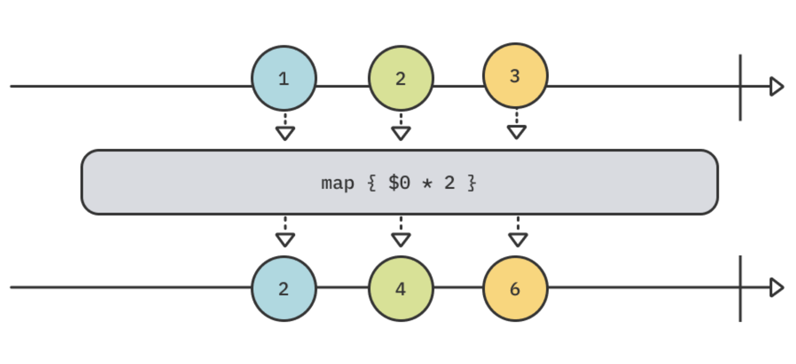

Notice how, unlike collect, this operator re-publishes values as soon as they are published by the upstream.

Add this new example to your playground:

```swift
example(of: "map") {
    // 1
    let formatter = NumberFormatter()
    formatter.numberStyle = .spellOut
    
    // 2
    [123, 4, 56].publisher
    // 3
        .map {
            formatter.string(for: NSNumber(integerLiteral: $0)) ?? ""
        }
        .sink(receiveValue: { print($0) })
        .store(in: &subscriptions)
}
```

Here’s the play-by-play:

1. Create a number formatter to spell out each number.

2. Create a publisher of integers.

3. Use map, passing a closure that gets upstream values and returns the result of using the formatter to return the number’s spelled out string.

Run the playground, and you will see this output:

```
——— Example of: map ———
one hundred twenty-three
four
fifty-six
```


#### Mapping key paths

The map family of operators also includes three versions that can map into one, two, or three properties of a value using key paths. Their signatures are as follows:

```swift
map<T>(_:)
map<T0, T1>(_:_:)
map<T0, T1, T2>(_:_:_:)
```

The T represents the type of values found at the given key paths.

In the next example, you’ll use the  Coordinate type and quadrantOf(x:y:) method defined in Sources/SupportCode.swift. Coordinate has two properties: x and y. quadrantOf(x:y:) takes x and y values as parameters and returns a string indicating the quadrant for the x and y values.

> Note: Quadrants are part of coordinate geometry. For more information you can visit mathworld.wolfram.com/Quadrant.html.


Feel free to review these definitions if you’re interested, otherwise just use map(_:_:) with the following example to your playground:

```swift
example(of: "mapping key paths") {
    // 1
    let publisher = PassthroughSubject<Coordinate, Never>()
    
    // 2
    publisher
    // 3
        .map(\.x, \.y)
        .sink(receiveValue: { x, y in
            // 4
            print(
                "The coordinate at (\(x), \(y)) is in quadrant",
                quadrantOf(x: x, y: y)
            )
        })
        .store(in: &subscriptions)
    
    // 5
    publisher.send(Coordinate(x: 10, y: -8))
    publisher.send(Coordinate(x: 0, y: 5))
}
```

In this example you’re using the version of map that maps into two properties via key paths.

Step-by-step, you:

1. Create a publisher of Coordinates that will never emit an error.

2. Begin a subscription to the publisher.

3. Map into the x and y properties of Coordinate using their key paths.

4. Print a statement that indicates the quadrant of the provide x and y values.

5. Send some coordinates through the publisher.

Run the playground and the output from this subscription will be the following:

```
——— Example of: mapping key paths ———
The coordinate at (10, -8) is in quadrant 4
The coordinate at (0, 5) is in quadrant boundary
```


**tryMap(_:)**

Several operators, including map, have a counterpart with a try prefix that takes a throwing closure. If you throw an error, the operator will emit that error downstream.

To try tryMap add this example to the playground:

```swift
example(of: "tryMap") {
    // 1
    Just("Directory name that does not exist")
    // 2
        .tryMap { try FileManager.default.contentsOfDirectory(atPath: $0) }
    // 3
        .sink(receiveCompletion: { print($0) },
              receiveValue: { print($0) })
        .store(in: &subscriptions)
}
```

Here’s what you just did, or at least tried to!

1. Create a publisher of a string representing a directory name that does not exist.

2. Use tryMap to attempt to get the contents of that nonexistent directory.

3. Receive and print out any values or completion events.

Notice that you still need to use the try keyword when calling a throwing method.

Run the playground and observe that tryMap outputs a failure completion event with the appropriate “folder doesn’t exist” error (output abbreviated):

```
——— Example of: tryMap ———
failure(..."The folder “Directory name that does not exist” doesn't exist."...)
```


### Flattening publishers

Though somewhat mysterious at first, the concept of flattening isn't too complex to understand. You'll learn everything about it by working through few select examples.

**flatMap(maxPublishers:_:)**

The flatMap operator flattens multiple upstream publishers into a single downstream publisher — or more specifically, flatten the emissions from those publishers.

The publisher returned by flatMap does not — and often will not — be of the same type as the upstream publishers it receives.

A common use case for flatMap in Combine is when you want to pass elements emitted by one publisher to a method that itself returns a publisher, and ultimately subscribe to the elements emitted by that second publisher.

Time to implement an example to see this in action. Add this new example:

```swift
example(of: "flatMap") {
    // 1
    func decode(_ codes: [Int]) -> AnyPublisher<String, Never> {
        // 2
        Just(
            codes
                .compactMap { code in
                    guard (32...255).contains(code) else { return nil }
                    return String(UnicodeScalar(code) ?? " ")
                }
            // 3
                .joined()
        )
        // 4
        .eraseToAnyPublisher()
    }
}
```

From the top, you:

1. Define a function that takes an array of integers, each representing an ASCII code, and returns a type-erased publisher of strings that never emits errors.

2. Create a Just publisher that converts the character code into a string if it’s within the range of 0.255, which includes standard and extended printable ASCII characters.

3. Join the strings together.

4. Type erase the publisher to match the return type for the fuction.

> Note: For more information about ASCII character codes, you can visit www.asciitable.com.


With that handiwork completed, add this code to your current example to put that function and the flatMap operator to work:

```swift
// 5
[72, 101, 108, 108, 111, 44, 32, 87, 111, 114, 108, 100, 33]
    .publisher
    .collect()
// 6
    .flatMap(decode)
// 7
    .sink(receiveValue: { print($0) })
    .store(in: &subscriptions)
```

With this code, you:

5. Create a secret message as an array of ASCII character codes, convert it to a publisher, and collect its emitted elements into a single array.

6. Use flatMap to pass the array element to your decoder function.

7. Subscribe to the elements emitted by the pubisher returned by decode(_:) and print out the values.

Run the playground, and you'll see the following:

```
——— Example of: flatMap ———
Hello, World!
```

Recall the definition from earlier: flatMap flattens the output from all received publishers into a single publisher. This can pose a memory concern, because it will buffer as many publishers as you send it to update the single publisher it emits downstream.

To understand how to manage this, take a look at this marble diagram of flatMap:


In the diagram, flatMap receives three publishers: P1, P2, and P3. Each of these publishers has a value property that is also a publisher. flatMap emits the value publishers’ values from P1 and P2, but ignores P3 because maxPublishers is set to 2. You’ll get more practice working with flatMap and its maxPublishers parameter in Chapter 19, "Testing."

You now have a handle on one of the most powerful operators in Combine. However, flatMap is not the only way to swap input with a different output. So, before wrapping up this chapter, you’ll learn a couple more useful operating for doing the ol’ switcheroo.


### Replacing upstream output

Earlier in the map example, you worked with Foundation’s Formatter.string(for:) method. It produces an optional string, and you used the nil-coalescing operator (??) to replace a nil value with a non-nil value. Combine also includes an operator that you can use when you want to always deliver a value.

**replaceNil(with:)**

As depicted in the following marble diagram, replaceNil will receive optional values and replace nils with the value you specify:

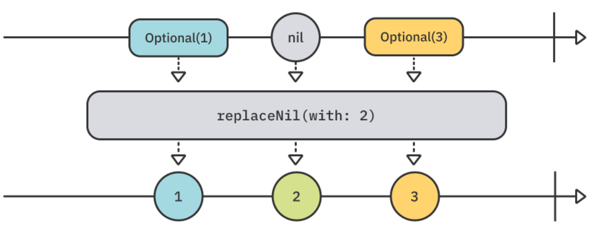

Add this new example to your playground:

```swift
example(of: "replaceNil") {
  // 1
  ["A", nil, "C"].publisher
    .eraseToAnyPublisher()
    .replaceNil(with: "-") // 2
    .sink(receiveValue: { print($0) }) // 3
    .store(in: &subscriptions)
}
```

What you just did:

1. Create a publisher from an array of optional strings.

2. Use `replaceNil(with:)` to replace nil values received from the upstream publisher with a new non-nil value.

3. Print out the value.

> Note: replaceNil(with:) has overloads which can confuse Swift into picking the wrong one for your use case. This results in the type remaining as Optional<String> instead of being fully unwrapped. The code above uses eraseToAnyPublisher() to work around that bug. You can learn more about this issue in the Swift forums: https://bit.ly/30M5Qv7

Run the playground, and you will see the following:

```
——— Example of: replaceNil ———
A
-
C
```

There is a subtle but important difference between using the nil-coalescing operator ?? and replaceNil. The ?? operator can still result in an nil result, while replaceNil cannot. Change the usage of replaceNil to the following, and you will see the error caused by the wrong operator overload:
.replaceNil(with: "-" as String?)
Revert that change before moving on. This example also demonstrates how you can chain together multiple operators in a compositional way. This allows you to manipulate the values coming from the origin publisher to the subscriber in a wide variety of ways.


**replaceEmpty(with:)**

You can use the replaceEmpty(with:) operator to replace — or really, insert — a value if a publisher completes without emitting a value.

In the following marble diagram, the publisher completes without emitting anything, and at that point the replaceEmpty(with:) operator inserts a value and publishes it downstream:

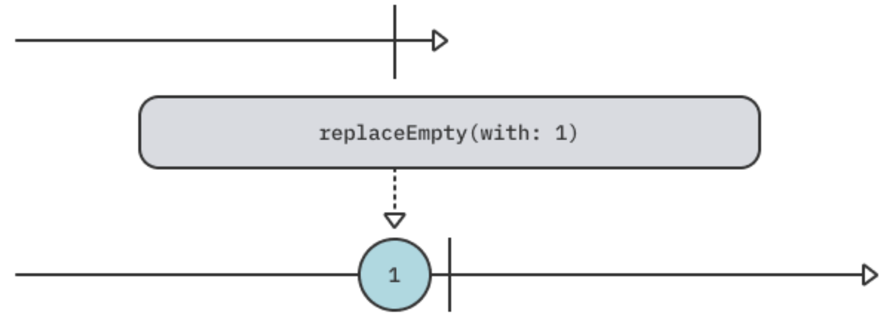

Add this new example to see it in action:

```swift
example(of: "replaceEmpty(with:)") {
    // 1
    let empty = Empty<Int, Never>()
    
    // 2
    empty
        .sink(receiveCompletion: { print($0) },
              receiveValue: { print($0) })
        .store(in: &subscriptions)
}
```

What you’re doing here:

1. Create an empty publisher that immediately emits a completion event.

2. Subscribe to it, and print received events.

Use the Empty publisher type to create a publisher that immediately emits a .finished completion event. You could also configure it to never emit anything by passing false to its completeImmediately parameter, which is true by default. This publisher is useful for demo or testing purposes, or when all you want to do is signal completion of some task to a subscriber. Run the playground and you'll see it successfully completes:

```
——— Example of: replaceEmpty ———
finished
```

Now, insert this line of code before calling sink:

```swift
.replaceEmpty(with: 1)
```

Run the playground again, and this time you get a 1 before the completion:

```
1
finished
```


### Incrementally transforming output

You’ve seen how Combine includes operators such as map that correspond and work similarly to higher-order functions found in the Swift standard library. However, Combine has a few more tricks up its sleeve that let you manipulate values received from an upstream publisher.

**`scan(_:_:)`**

A great example of this in the transforming category is scan. It will provide the current value emitted by an upstream publisher to a closure, along with the last value returned by that closure.

In the following marble diagram, scan begins by storing a starting value of 0. As it receives each value from the publisher, it adds it to the previously stored value, and then stores and emits the result:


> Note: If you are using the full project to enter and run this code, there’s no straightforward way to plot the output — as is possible in a playground. Instead, you can print the output by changing the sink code in the example below to .sink(receiveValue: { print($0) }).

For a practical example of how to use scan, add this new example to your playground:

```swift
example(of: "scan") {
    // 1
    var dailyGainLoss: Int { .random(in: -10...10) }
    
    // 2
    let august2019 = (0..<22)
        .map { _ in dailyGainLoss }
        .publisher
    
    // 3
    august2019
        .scan(50) { latest, current in
            max(0, latest + current)
        }
        .sink(receiveValue: { _ in })
        .store(in: &subscriptions)
}
```

In this example, you:

1. Create a computed property that generates a random integer between -10 and 10.

2. Use that generator to create a publisher from an array of random integers representing fictitious daily stock price changes for a month.

3. Use scan with a starting value of 50, and then add each daily change to the running stock price. The use of max keeps the price non-negative — thankfully stock prices can’t fall below zero!

This time, you did not print anything in the subscription. Run the playground, and then click the square Show Results button in the right results sidebar.

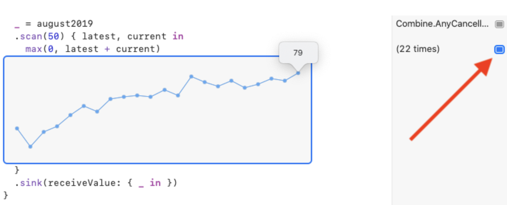

Talk about a bull run! How’d your stock do?

There’s also an error-throwing tryScan operator that works similarly. If the closure throws an error, tryScan fails with that error.


### Challenge

Practice makes permanent. Complete this challenge to ensure you’re good to go with transforming operators before moving on.

#### Challenge: Create a phone number lookup using transforming operators

Your goal for this challenge is to create a publisher that does two things:

1. Receives a string of ten numbers or letters.

2. Looks up that number in a contacts data structure.

The starter playground, in the challenge folder, includes a contacts dictionary and three functions. You’ll need to create a subscription to the input publisher using transforming operators and those functions. Insert your code right below the `Add your code here placeholder`, before the forEach blocks that will test your implementation.

> Tip: You can pass a function or closure directly to an operator as a parameter if the function signature matches. For example, map(convert).


Breaking down this challenge, you’ll need to:

1. Convert the input to numbers — use the convert function, which will return nil if it cannot convert the input to an integer.

2. If the previous operator returns nil, replace it with a 0.

3. Collect ten values at a time, which correspond to the three-digit area code and seven-digit phone number format used in the United States.

4. Format the collected string value to match the format of the phone numbers in the contacts dictionary — use the provided format function.
5. "Dial" the input received from the previous operator — use the provided dial function.


#### Solution

Did your code produce the expected results? Starting with a subscription to input, first you needed to convert the string input one character at a time into integers:

```swift
input
    .map(convert)
```

Next you needed to replace nil values returned from convert with 0s:

```swift
.replaceNil(with: 0)
```

To look up the result of the previous operations, you needed to collect those values, and then format them to match the phone number format used in the contacts dictionary:

```swift
.collect(10)
.map(format)
```

Finally, you needed to use the dial function to look up the formatted string input, and then subscribe:

```swift
.map(dial)
.sink(receiveValue: { print($0) })
```

Running the playground will produce the following:

```
——— Example of: Create a phone number lookup ———
Contact not found for 000-123-4567
Dialing Marin (408-555-4321)...
Dialing Shai (212-555-3434)...
```


Bonus points if you hook this up to a VoIP service!


### Key points

- You call methods that perform operations on output from publishers "operators".

- Operators are also publishers.

- Transforming operators convert input from an upstream publisher into output that is suitable for use downstream.

- Marble diagrams are a great way to visualize how each Combine operators work.

- Be careful when using any operators that buffer values such as collect or flatMap to avoid memory problems.

- Be mindful when applying existing knowledge of functions from Swift standard library. Some similarly-named Combine operators work the same while others work entirely differently.

- It's common chaining multiple operators together in a subscription to create complex and compound transformations on events emitted by a publisher.


### Where to go from here?

Way to go! You just transformed yourself into a transforming titan.

Now it’s time to learn how to use another essential collection of operators to filter what you get from an upstream publisher.


## Chapter 4: Filtering Operators

As you might have realized by now, operators are basically the vocabulary that you use to manipulate Combine publishers. The more "words" you know, the better your control of your data will be.

In the previous chapter, you learned how to consume values and transform them into other values — definitely one of the most useful operator categories for your daily work.

But what happens when you want to limit the values or events emitted by the publisher, and only consume some of them? This chapter is all about how to do this with a special group of operators: Filtering operators!

Luckily, many of these operators have parallels with the same names in the Swift standard library, so don’t be surprised if you’re able to filter some of this chapter’s content. :]

It’s time to dive right in.


### Getting started

You can find the starter playground for this chapter, Starter.playground, in the projects folder. As you progress through this chapter, you’ll write code in the playground and then run the playground. This will help you understand how different operators manipulate events emitted by your publisher.

Note: Most operators in this chapter have parallels with a try prefix, for example, filter vs. tryFilter. The only difference between them is that the latter provides a throwing closure. Any error you throw from within the closure will terminate the publisher with the thrown error. For brevity’s sake, this chapter will only cover the non-throwing variations, since they are virtually identical.


### Filtering basics

This first section will deal with the basics of filtering — consuming a publisher of values and conditionally deciding which of them to pass to the consumer.

The easiest way to do this is the aptly-named operator — filter, which takes a closure expectd to return a Bool. It'll only pass down values that match the provided predicate:

Add this new example to your playground:

```swift
example(of: "filter") {
    // 1
    let numbers = (1...10).publisher
    
    // 2
    numbers
        .filter { $0.isMultiple(of: 3) }
        .sink(receiveValue: { n in
            print("\(n) is a multiple of 3!")
        })
        .store(in: &subscriptions)
}
```

In the above example, you:

1. Create a new publisher, which will emit a finite number of values — 1 through 10, and then complete, using the publisher property on Sequence types.

2. Use the filter operator, passing in a predicate where you only allow through numbers that are multiples of three.

Run your playground. You should see the following in your console:

```
——— Example of: filter ———
3 is a multiple of 3!
6 is a multiple of 3!
9 is a multiple of 3!
```

Such an elegant way to cheat on your math homework, isn’t it? :]

Many times in the lifetime of your app, you’ll have publishers that emit identical values in a row that you might want to ignore. For example, if a user types "a" five times in a row and then types "b", you might want to disregard the excessive "a"s.

Combine provides the perfect operator for the task: removeDuplicates:


Notice how you don’t have to provide any arguments to this operator. removeDuplicates automatically works for any values conforming to Equatable, including String.

Add the following example of removeDuplicates() to your playground — and be sure to include a space before the ? in the words variable:

```swift
example(of: "removeDuplicates") {
    // 1
    let words = "hey hey there! want to listen to mister mister ?"
        .components(separatedBy: " ")
        .publisher
    // 2
    words
        .removeDuplicates()
        .sink(receiveValue: { print($0) })
        .store(in: &subscriptions)
}
```

This code isn’t too different from the last one. You:

1. Separate a sentence into an array of words (e.g., [String]) and then create a new publisher to emit these words.

2. Apply removeDuplicates() to your words publisher.

Run your playground and take a look at the debug console:

```
——— Example of: removeDuplicates ———
hey
there!
want
to
listen
to
mister
?
```

As you can see, you’ve skipped the second "hey" and the second "mister". Awesome!


Note: What about values that don’t conform to Equatable? Well, removeDuplicates has another overload that takes a closure with two values, from which you'll return a Bool to indicate whether the values are equal or not.


### Compacting and ignoring

Quite often, you’ll find yourself dealing with a publisher emitting Optional values. Or even more commonly, you’ll want to perform some operation on your values that might return nil, but who wants to handle all those nils ?!

If your spidey sense is tingling, thinking of a very well-known method on Sequence from the Swift standard library called compactMap that does that job, good news – there’s also an operator with the same name!


Add the following to your playground:

```swift
example(of: "compactMap") {
    // 1
    let strings = ["a", "1.24", "3",
                   "def", "45", "0.23"].publisher
    
    // 2
    strings
        .compactMap { Float($0) }
        .sink(receiveValue: {
            // 3
            print($0)
        })
        .store(in: &subscriptions)
}
```

Just as the diagram outlines, you:

1. Create a publisher that emits a finite list of strings.

2. Use compactMap to attempt to initialize a Float from each individual string. If Float’s initializer doesn’t know how to convert the provided string, it returns nil. Those nil values are automatically filtered out by the compactMap operator.

3. Only print strings that have been successfully converted to Floats.

Run the above example in your playground and you should see output similar to the diagram above:

```
——— Example of: compactMap ———
1.24
3.0
45.0
0.23
```

All right, why don’t you take a quick break from all these values... who cares about those, right? Sometimes, all you want to know is that the publisher has finished emitting values, disregarding the actual values. When such a scenario occurs, you can use the ignoreOutput operator:


As the diagram above shows, it doesn’t matter which values are emitted or how many of them, as they’re all ignored; you only push the completion event through to the consumer.

Experiment with this example by adding the following code to your playground:

```swift
example(of: "ignoreOutput") {
    // 1
    let numbers = (1...10_000).publisher
    
    // 2
    numbers
        .ignoreOutput()
        .sink(receiveCompletion: { print("Completed with: \($0)") },
              receiveValue: { print($0) })
        .store(in: &subscriptions)
}
```

In the above example, you:

1. Create a publisher emitting 10,000 values from 1 through 10,000.

2. Add the ignoreOutput operator, which omits all values and emits only the completion event to the consumer.

Can you guess what the output of this code will be?

If you guessed that no values will be printed, you’re right! Run your playground and check out the debug console:

```
——— Example of: ignoreOutput ———
Completed with: finished
```


### Finding values

In this section, you’ll learn about two operators that also have their origins in the Swift standard library: first(where:) and last(where:). As their names imply, you use them to find and emit only the first or the last value matching the provided predicate, respectively.

Time to check out a few examples, starting with first(where:).

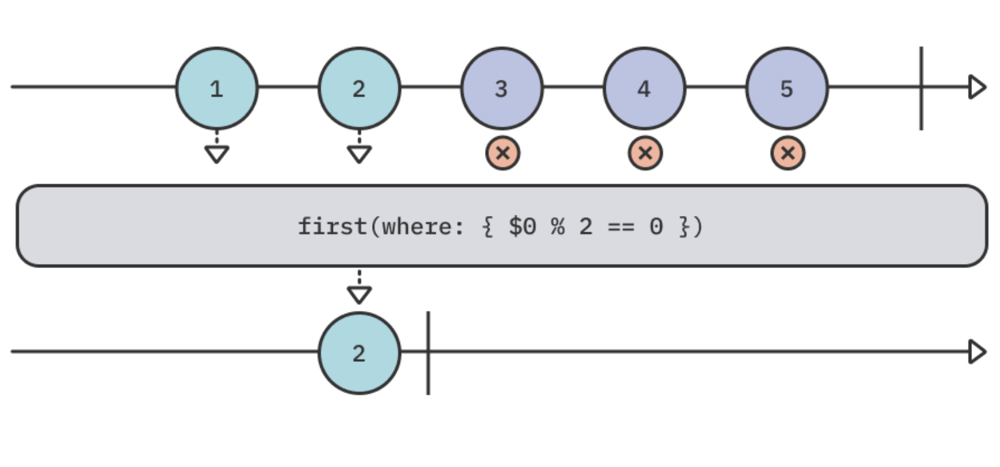

This operator is interesting because it’s lazy, meaning: It only takes as many values as it needs until it finds one matching the predicate you provided. As soon as it finds a match, it cancels the subscription and completes.

Add the following piece of code to your playground to see how this works:

```swift
example(of: "first(where:)") {
  // 1
  let numbers = (1...9).publisher

  // 2
  numbers
    .first(where: { $0 % 2 == 0 })
    .sink(receiveCompletion: { print("Completed with: \($0)") },
          receiveValue: { print($0) })
    .store(in: &subscriptions)
}
```

Here’s what the code you’ve just added does:

1. Creates a new publisher emitting numbers from 1 through 9.

2. Uses the first(where:) operator to find the first emitted even value.

Run this example in your playground and look at the console output:

```
——— Example of: first(where:) ———
2
Completed with: finished
```

It works exactly like you probably guessed it would. But wait, what about the subscription to the upstream, meaning the numbers publisher? Does it keep emitting its values even after it finds a matching even number? Test this theory by finding the following line:

```
numbers
```

Then add the print("numbers") operator immediately after that line, so it looks as follows:

```
numbers
  	.print("numbers")
```

> Note: You can use the print operator anywhere in your operator chain to see exactly what events occur at that point.

Run your playground again, and take a look at the console. Your output should like similar to the following:

```
——— Example of: first(where:) ———
numbers: receive subscription: (1...9)
numbers: request unlimited
numbers: receive value: (1)
numbers: receive value: (2)
numbers: receive cancel
2
Completed with: finished
```

This is very interesting!

As you can see, as soon as first(where:) finds a matching value, it sends a cancellation through the subscription, causing the upstream to stop emitting values. Very handy!

Now, you can move on to the opposite of this operator — last(where:), whose purpose is to find the last value matching a provided predicate.


As opposed to first(where:), this operator is greedy since it must wait for the publisher to complete emitting values to know whether a matching value has been found. For that reason, the upstream must be finite.

Add the following code to your playground:

```swift
example(of: "last(where:)") {
  // 1
  let numbers = (1...9).publisher

  // 2
  numbers
    .last(where: { $0 % 2 == 0 })
    .sink(receiveCompletion: { print("Completed with: \($0)") },
          receiveValue: { print($0) })
    .store(in: &subscriptions)
}
```

Much like the previous code example, you:

1. Create a publisher that emits numbers between 1 and 9.

2. Use the last(where:) operator to find the last emitted even value.

Did you guess what the output will be? Run your playground and find out:

```
——— Example of: last(where:) ———
8
Completed with: finished
```

Remember  I said earlier that the publisher must complete for this operator to work? Why is that?

Well, that’s because there’s no way for the operator to know if the publisher will emit a value that matches the criteria down the line, so the operator must know the full scope of the publisher before it can determine the last item matching the predicate.

To see this in action, replace the entire example with the following:

```swift
example(of: "last(where:)") {
    let numbers = PassthroughSubject<Int, Never>()
    
    numbers
        .last(where: { $0 % 2 == 0 })
        .sink(receiveCompletion: { print("Completed with: \($0)") },
              receiveValue: { print($0) })
        .store(in: &subscriptions)
    
    numbers.send(1)
    numbers.send(2)
    numbers.send(3)
    numbers.send(4)
    numbers.send(5)
}
```

In this example, you use a PassthroughSubject and manually send events through it.

Run your playground again, and you should see... absolutely nothing:

```
——— Example of: last(where:) ———
```

As expected, since the publisher never completes, there’s no way to determine the last value matching the criteria.

To fix this, add the following as the last line of the example to send a completion through the subject:

```swift
numbers.send(completion: .finished)
```

Run your playground again, and everything should now work as expected:

```
——— Example of: last(where:) ———
4
Completed with: finished
```


I guess that everything must come to an end... or completion, in this case.

> Note: You can also use the first() and last() operators to simply get either the first or last value ever emitted by the publisher. These are also lazy and greedy, accordingly.


### Dropping values

Dropping values is a useful capability you’ll often need to leverage when working with publishers. For example, you can use it when you want to ignore values from one publisher until a second one starts publishing, or if you want to ignore a specific amount of values at the start of the stream.

Three operators fall into this category, and you’ll start by learning about the simplest one first — dropFirst.

The dropFirst operator takes a count parameter — defaulting to 1 if omitted — and ignores the first count values emitted by the publisher. Only after skipping count values, the publisher will start passing values through.

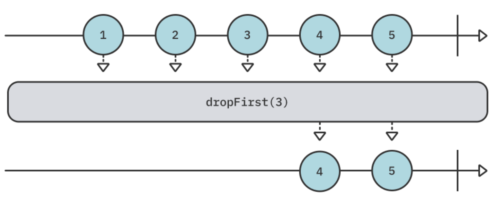


Add the following code to the end of your playground to try this operator:

```swift
example(of: "dropFirst") {
    // 1
    let numbers = (1...10).publisher
    
    // 2
    numbers
        .dropFirst(8)
        .sink(receiveValue: { print($0) })
        .store(in: &subscriptions)
}
```

As in the previous diagram, you:

1. Create a publisher that emits 10 numbers between 1 and 10.

2. Use dropFirst(8) to drop the first eight values, printing only 9 and 10.

Run your playground and you should see the following output:

```
——— Example of: dropFirst ———
9
10
```

Simple, right? Often, the most useful operators are!

Moving on to the next operator in the value dropping family – drop(while:). This is another extremely useful variation that takes a predicate closure and ignores any values emitted by the publisher until the first time that predicate is met. As soon as the predicate is met, values begin to flow through the operator:


Add the following example to your playground to see this in action:

```swift
example(of: "drop(while:)") {
    // 1
    let numbers = (1...10).publisher
    
    // 2
    numbers
        .drop(while: { $0 % 5 != 0 })
        .sink(receiveValue: { print($0) })
        .store(in: &subscriptions)
}
```

In the following code, you:

1. Create a publisher that emits numbers between 1 and 10.

2. Use drop(while:) to wait for the first value that is divisible by five. As soon as the condition is met, values will start flowing through the operator and won’t be dropped anymore.

Run your playground and look at the debug console:

```
——— Example of: drop(while:) ———
5
6
7
8
9
10
```

Excellent! As you can see, you’ve dropped the first four values. As soon as 5 arrives, the question "is this divisible by five?" is finally true, so it now emits 5 and all future values.

You might ask yourself – how is this operator different from filter? Both of them take a closure that controls which values are emitted based on the result of that closure.

The first difference is that filter lets values through if you return true in the closure, while drop(while:) skips values as long you return true from the closure.

The second, and more important difference is that filter never stops evaluating its condition for all values published by the upstream publisher. Even after the condition of filter evaluates to true, further values are still "questioned" and your closure must answer the question: "Do you want to let this value through?".

On the contrary, drop(while:)’s predicate closure will never be executed again after the condition is met. To confirm this, replace the following line:

```
.drop(while: { $0 % 5 != 0 })
```

With this piece of code:

```swift
.drop(while: {
  	print("x")
  	return $0 % 5 != 0
})
```

You added a print statement to print x to the debug console every time the closure is invoked. Run the playground and you should see the following output:

```
——— Example of: drop(while:) ———
x
x
x
x
x
5
6
7
8
9
10
```

As you might have noticed, x prints exactly five times. As soon as the condition is met (when 5 is emitted), the closure is never evaluated again.

Alrighty then. Two dropping operators down, one more to go.

The final and most elaborate operator of the filtering category is drop(untilOutputFrom:).

Imagine a scenario where you have a user tapping a button, but you want to ignore all taps until your isReady publisher emits some result. This operator is perfect for this sort of condition.

It skips any values emitted by a publisher until a second publisher starts emitting values, creating a relationship between them:

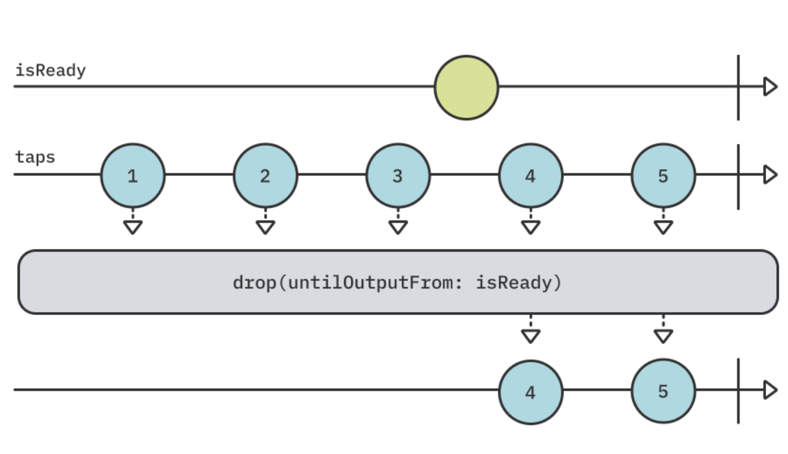

The top line represents the isReady stream and the second line represents taps by the user passing through drop(untilOutputFrom:), which takes isReady as an argument.

At the end of your playground, add the following code that reproduces this diagram:

```swift
example(of: "drop(untilOutputFrom:)") {
    // 1
    let isReady = PassthroughSubject<Void, Never>()
    let taps = PassthroughSubject<Int, Never>()
    
    // 2
    taps
        .drop(untilOutputFrom: isReady)
        .sink(receiveValue: { print($0) })
        .store(in: &subscriptions)
    
    // 3
    (1...5).forEach { n in
        taps.send(n)
        
        if n == 3 {
            isReady.send()
        }
    }
}
```

In this code, you:

1. Create two PassthroughSubjects that you can manually send values through. The first is isReady while the second represents taps by the user.
2. Use drop(untilOutputFrom: isReady) to ignore any taps from the user until isReady emits at least one value.
3. Send five "taps" through the subject, just like in the diagram above. After the third tap, you send isReady a value.

Run your playground, then take a look at your debug console. You will see the following output:

```
——— Example of: drop(untilOutputFrom:) ———
4
5
```

This output is the same as the diagram above:

- There are five taps from the user. The first three are ignored.

- After the third tap, isReady emits a value.

- All future taps by the user are passed through.

You’ve gained quite a mastery of getting rid of unwanted values! Now, it’s time for the final filtering operators group: Limiting values.


### Limiting values

In the previous section, you’ve learned how to drop — or skip — values until a certain condition is met. That condition could be either matching some static value, a predicate closure, or a dependency on a different publisher.

This section tackles the opposite need: receiving values until some condition is met, and then forcing the publisher to complete. For example, consider a request that may emit an unknown amount of values, but you only want a single emission and don’t care about the rest of them.

Combine solves this set of problems with the prefix family of operators. Even though the name isn’t entirely intuitive, the abilities these operators provide are useful for many real-life situations.

The prefix family of operators is similar to the drop family and provides  prefix(_:), prefix(while:) and prefix(untilOutputFrom:). However, instead of dropping values until some condition is met, the prefix operators take values until that condition is met.

Now, it’s time for you to dive into the final set of operators for this chapter, starting with prefix(_:).

As the opposite of dropFirst, prefix(_:) will take values only up to the provided amount and then complete:

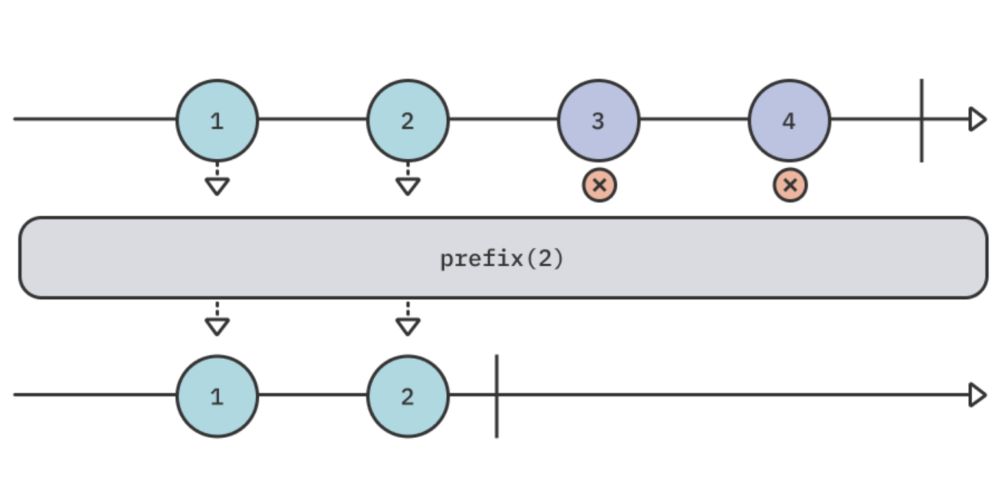

Add the following code to your playground to demonstrate this:

```swift
example(of: "prefix") {
    // 1
    let numbers = (1...10).publisher
    
    // 2
    numbers
        .prefix(2)
        .sink(receiveCompletion: { print("Completed with: \($0)") },
              receiveValue: { print($0) })
        .store(in: &subscriptions)
}
```

This code is quite similar to the drop code you used in the previous section. You:

1. Create a publisher that emits numbers from 1 through 10.

2. Use prefix(2) to allow the emission of only the first two values. As soon as two values are emitted, the publisher completes.

Run your playground and you’ll see the following output:

```
——— Example of: prefix ———
1
2
Completed with: finished
```

Just like first(where:), this operator is lazy, meaning it only takes up as many values as it needs and then terminates. This also prevents numbers from producing additional values beyond 1 and 2, since it also completes.

Next up is prefix(while:), which takes a predicate closure and lets values from the upstream publisher through as long as the result of that closure is true. As soon as the result is false, the publisher will complete:


Add the following example to your playground to try this:

```swift
example(of: "prefix(while:)") {
    // 1
    let numbers = (1...10).publisher
    
    // 2
    numbers
        .prefix(while: { $0 < 3 })
        .sink(receiveCompletion: { print("Completed with: \($0)") },
              receiveValue: { print($0) })
        .store(in: &subscriptions)
}
```

This example is mostly identical to the previous one, aside from using a closure to evaluate the prefixing condition. You:

1. Create a publisher that emits values between 1 and 10.

2. Use prefix(while:) to let values through as long as they’re smaller than 3. As soon as a value equal to or larger than 3 is emitted, the publisher completes.

Run the playground and check out the debug console; the output should be identical to the one from the previous operator:

```
——— Example of: prefix(while:) ———
1
2
Completed with: finished
```


With the first two prefix operators behind us, it’s time for the most complex one: prefix(untilOutputFrom:). Once again, as opposed to drop(untilOutputFrom:) which skips values until a second publisher emits, prefix(untilOutputFrom:) takes values until a second publisher emits.

Imagine a scenario where you have a button that the user can only tap twice. As soon as two taps occur, further tap events on the button should be omitted:


Add the final example for this chapter to the end of your playground:

```swift
example(of: "prefix(untilOutputFrom:)") {
  // 1
  let isReady = PassthroughSubject<Void, Never>()
  let taps = PassthroughSubject<Int, Never>()

  // 2
  taps
    .prefix(untilOutputFrom: isReady)
    .sink(receiveCompletion: { print("Completed with: \($0)") },
          receiveValue: { print($0) })
    .store(in: &subscriptions)

  // 3
  (1...5).forEach { n in
    taps.send(n)
    

    if n == 2 {
      isReady.send()
    }

  }
}
```

If you think back to the drop(untilOutputFrom:) example, you should find this easy to understand. You:

1. Create two PassthroughSubjects that you can manually send values through. The first is isReady while the second represents taps by the user.

2. Use prefix(untilOutputFrom: isReady) to let tap events through until isReady emits at least one value.

3. Send five "taps" through the subject, exactly as in the diagram above. After the second tap, you send isReady a value.

Run the playground. Looking at the console, you should see the following:

```
——— Example of: prefix(untilOutputFrom:) ———
1
2
Completed with: finished
```


### Challenge

You have quite a lot of filtering knowledge at your disposal now. Why not try a short challenge?

#### Challenge: Filter all the things

Create an example that publishes a collection of numbers from 1 through 100, and use filtering operators to:

1. Skip the first 50 values emitted by the upstream publisher.

2. Take the next 20 values after those first 50 values.
3. Only take even numbers.

The output of your example should produce the following numbers, one per line:

```
52 54 56 58 60 62 64 66 68 70
```

> Note: In this challenge, you’ll need to chain multiple operators together to produce the desired values.


You can find the full solution to this challenge in projects/challenge/Final.playground.


### Key points

In this chapter, you learned that:

- Filtering operators let you control which values emitted by the upstream publisher are sent downstream, to another operator or to the consumer.
- When you don’t care about the values themselves, and only want a completion event, ignoreOutput is your friend.
- Finding values is another sort of filtering, where you can find the first or last values to match a provided predicate using first(where:) and last(where:), respectively.
- First-style operators are lazy; they take only as many values as needed and then complete. Last-style operators are greedy and must know the full scope of the values before deciding which of the values is the last to fulfill the condition.
- You can control how many values emitted by the upstream publisher are ignored before sending values downstream by using the drop family of operators.
- Similarly, you can control how many values the upstream publisher may emit before completing by using the prefix family of operators.


### Where to go from here?

Wow, what a ride this chapter has been! You should rightfully feel like a master of filtering, ready to channel these upstream values in any way you desire.

With the knowledge of transforming and filtering operators already in your tool belt, it’s time for you to move to the next chapter and learn another extremely useful group of operators: Combining operators.


## Chapter 5: Combining Operators

Now that the transforming and filtering operator categories are in your tool belt, you have a substantial amount of knowledge. You’ve learned how operators work, how they manipulate the upstream and how to use them to construct logical publisher chains from your data.

In this chapter, you’ll learn about one of the more complex, yet useful, categories of operators: Combining operators. This set of operators lets you combine events emitted by different publishers and create meaningful combinations of data in your Combine code.

Why is combining useful? Think about a form with multiple inputs from the user — a username, a password and a checkbox. You’ll need to combine these different pieces of data to compose a single publisher with all of the information you need.

As you learn more about how each operator functions and how to select the right one for your needs, your code will become substantially more capable and your skills will allow you to unlock new levels of publisher composition.


### Getting started

You can find the starter playground for this chapter in the projects/Starter.playground folder. Throughout this chapter, you’ll add code to your playground and run it to see how various operators create different combinations of publishers and their events.


### Prepending

You’ll start slowly here with a group of operators that are all about prepending values at the beginning of your publisher. In other words, you’ll use them to add values that emit before any values from your original publisher.

In this section, you’ll learn about prepend(Output...), prepend(Sequence) and prepend(Publisher).

**prepend(Output...)**

This variation of prepend takes a variadic list of values using the ... syntax. This means it can take any number of values, as long as they’re of the same Output type as the original publisher.


Add the following code to your playground to experiment with the above example:

```swift
example(of: "prepend(Output...)") {
  // 1
  let publisher = [3, 4].publisher

  // 2
  publisher
    .prepend(1, 2)
    .sink(receiveValue: { print($0) })
    .store(in: &subscriptions)
}
```

In the above code, you:

1. Create a publisher that emits the numbers 3 4.

2. Use prepend to add the numbers 1 and 2 before the publisher’s own values.

Run your playground. You should see the following in your debug console:

```
——— Example of: prepend(Output...) ———
1
2
3
4
```

Pretty straightforward!

Hang on, do you remember how operators are chainable? That means you can easily add more than a single prepend, if you’d like.

Below the following line:

```swift
.prepend(1, 2)
```

Add the following:

```swift
.prepend(-1, 0)
```

Run your playground again. you should see the following output:

```
——— Example of: prepend(Output...) ———
-1
0
1
2
3
4
```

Notice that the order of operations is crucial here. The last prepend affects the upstream first, meaning -1 and 0 are prepended, then 1 and 2, and finally the original publisher’s values.


**`prepend(Sequence)`**

This variation of prepend is similar to the previous one, with the difference that it takes any Sequence-conforming object as an input. For example, it could take an Array or a Set.

Add the following code to your playground to experiment with this operator:

```swift
example(of: "prepend(Sequence)") {
    // 1
    let publisher = [5, 6, 7].publisher
    
    // 2
    publisher
        .prepend([3, 4])
        .prepend(Set(1...2))
        .sink(receiveValue: { print($0) })
        .store(in: &subscriptions)
}
```

In this code, you:

1. Create a publisher that emits the numbers 5, 6 and 7.

2. Chain prepend(Sequence) twice to the original publisher. Once to prepend values from an Array and a second time to prepend values from a Set.

Run the playground. Your output should be similar to the following:

```
——— Example of: prepend(Sequence) ———
1
2
3
4
5
6
7
```

Note: An important fact to remember about Sets, as opposed to Arrays, is that they are unordered, so the order in which the items emit is not guaranteed. This means the first two values in the above example could be either 1 and 2, or 2 and 1.


But wait, there’s more! Many types conform to Sequence in Swift, which lets you do some interesting things.

After the second prepend:

```swift
.prepend(Set(1...2))
```

Add the following line:

```swift
.prepend(stride(from: 6, to: 11, by: 2))
```

In this line of code, you create a Strideable which lets you stride between 6 and 11 in steps of 2. Since Strideable conforms to Sequence, you can use it in prepend(Sequence).

Run your playground one more time and take a look at the debug console:

```
——— Example of: prepend(Sequence) ———
6
8
10
1
2
3
4
5
6
7
```

As you can see, three new values are now prepended to the publisher before the previous output – 6, 8 and 10, the result of striding between 6 and 11 in steps of 2.


**`prepend(Publisher)`**

The two previous operators prepended lists of values to an existing publisher. But what if you have two different publishers and you want to glue their values together? You can use prepend(Publisher) to add values emitted by a second publisher before the original publisher’s values.


Try out the above example by adding the following to your playground:

```swift
example(of: "prepend(Publisher)") {
    // 1
    let publisher1 = [3, 4].publisher
    let publisher2 = [1, 2].publisher
    
    // 2
    publisher1
        .prepend(publisher2)
        .sink(receiveValue: { print($0) })
        .store(in: &subscriptions)
}
```

In this code, you:

1. Create two publishers. One emitting the numbers 3 and 4, and a second one emitting 1 and 2.

2. Prepend publisher2 to the beginning of publisher1. publisher1 will start performing its work and emit events only after publisher2 sends a .finished completion event.

If you run your playground, your debug console should present the following output:

```
——— Example of: prepend(Publisher) ———
1
2
3
4
```

As expected, the values 1 and 2 are emitted first from publisher2; only then are 3 and 4 emitted by publisher1.

There’s one more detail about this operator that you should be aware of, and it would be easiest to show with an example.

Add the following to the end of your playground:

```
example(of: "prepend(Publisher) #2") {
    // 1
    let publisher1 = [3, 4].publisher
    let publisher2 = PassthroughSubject<Int, Never>()
    
    // 2
    publisher1
        .prepend(publisher2)
        .sink(receiveValue: { print($0) })
        .store(in: &subscriptions)
    
    // 3
    publisher2.send(1)
    publisher2.send(2)
}
```

This example is similar to the previous one, except that publisher2 is now a PassthroughSubject that you can push values to manually.

In the following example, you:

1. Create two publishers. The first emits values 3, and 4 while the second is a PassthroughSubject that can accept values dynamically.

2. Prepend the subject before publisher1.

3. Send the values 1 and 2 through the subject publisher2.

Take a second and run through this code inside your head. What do you expect the output to be?

Now, run the playground again and take a look at the debug console. You should see the following:

```
——— Example of: prepend(Publisher) #2 ———
1
2
```

Wait, what? Why are there only two numbers emitted here from publisher2? You must be thinking... hey there, Shai, didn’t you just say values should prepend to the existing publisher?

Well, think about it — how can Combine know the prepended publisher, publisher2, has finished emitting values? It doesn’t, since it has emitted values, but no completion event. For that reason, a prepended publisher must complete so Combine knows it’s time to switch to the primary publisher.

After the following line:

```swift
publisher2.send(2)
```

Add this one:

```swift
publisher2.send(completion: .finished)
```

Combine now knows it can handle emissions from publisher1 since publisher2 has finished its work.

Run your playground again; you should see the expected output this time around:

```
——— Example of: prepend(Publisher) #2 ———
1
2
3
4
```


### Appending

This next set of operators deals with concatenating events emitted by publishers with other values. But in this case, you’ll deal with appending instead of prepending, using append(Output...), append(Sequence) and append(Publisher). These operators work similarly to their prepend counterparts.


**`append(Output...)`**

append(Output...) works similarly to its prepend counterpart: It also takes a variadic list of type Output but then appends its items after the original publisher has completed with a .finished event.


Add the following code to your playground to experiment with this operator:

```swift
example(of: "append(Output...)") {
    // 1
    let publisher = [1].publisher
    
    // 2
    publisher
        .append(2, 3)
        .append(4)
        .sink(receiveValue: { print($0) })
        .store(in: &subscriptions)
}
```

In the code above, you:

1. Create a publisher emitting only a single value: 1.

2. Use append twice, first to append 2 and 3 and then to append 4.

Think about this code for a minute — what do you think the output will be?

Run the playground and check out the output:

```
——— Example of: append(Output...) ———
1
2
3
4
```

Appending works exactly like you’d expect, where each append waits for the upstream to complete before adding its own work to it.

This means that the upstream must complete or appending would never occur since Combine couldn’t know the previous publisher has finished emitting all of its values.

To verify this behavior, add the following example:

```swift
example(of: "append(Output...) #2") {
    // 1
    let publisher = PassthroughSubject<Int, Never>()
    
    publisher
        .append(3, 4)
        .append(5)
        .sink(receiveValue: { print($0) })
        .store(in: &subscriptions)
    
    // 2
    publisher.send(1)
    publisher.send(2)
}
```

This example is identical to the previous one, with two differences:

1. publisher is now a PassthroughSubject, which lets you manually send values to it.

2. You send 1 and 2 to the PassthroughSubject.

Run your playground again and you’ll see that only the values sent to publisher are emitted:

```
——— Example of: append(Output...) #2 ———
1
2
```

Both append operators have no effect since they can’t possibly work until publisher completes. Add the following line at the very end of the example:

```swift
publisher.send(completion: .finished)
```

Run your playground again and you should see all values, as expected:

```
——— Example of: append(Output...) #2 ———
1
2
3
4
5
```

This behavior is identical for the entire family of append operators; no appending occurs unless the previous publisher sends a .finished completion event.


**`append(Publisher)`**

The last member of the append operators group is the variation that takes a Publisher and appends any values emitted by it to the end of the original publisher.

To try this example, add the following to your playground:

```swift
example(of: "append(Publisher)") {
  // 1
  let publisher1 = [1, 2].publisher
  let publisher2 = [3, 4].publisher

  // 2
  publisher1
    .append(publisher2)
    .sink(receiveValue: { print($0) })
    .store(in: &subscriptions)
}
```

In this code, you:

1. Create two publishers, where the first emits 1 and 2, and the second emits 3 and 4.

2. Append publisher2 to publisher1, so all values from publisher2 are appended at the end of publisher1 once it completes.

Run the playground and you should see the following output:

```
——— Example of: append(Publisher) ———
1
2
3
4
```


### Advanced combining

At this point, you know everything about appending and prepending values, sequences and even entire publishers.

This next section will dive into some of the more complex operators related to combining different publishers. Even though they’re relatively complex, they’re also some of the most useful operators for publisher composition. It’s worth taking the time to get comfortable with how they work.


**`switchToLatest`**

Since this section includes some of the more complex combining operators in Combine, why not start with the most complex one of the bunch?!

Joking aside, switchToLatest is complex but highly useful. It lets you switch entire publisher subscriptions on the fly while canceling the pending publisher subscription, thus switching to the latest one.

You can only use it on publishers that themselves emit publishers.

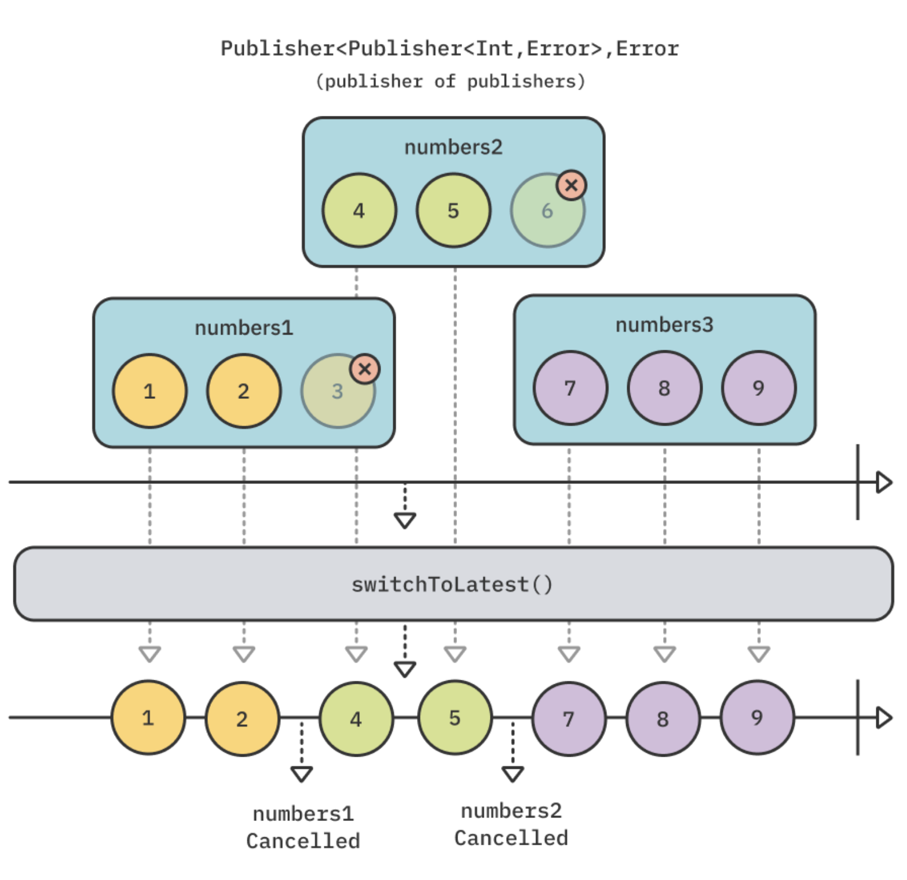

Add the following code to your playground to experiment with the example you see in the above diagram:

```swift
example(of: "switchToLatest") {
    // 1
    let publisher1 = PassthroughSubject<Int, Never>()
    let publisher2 = PassthroughSubject<Int, Never>()
    let publisher3 = PassthroughSubject<Int, Never>()
    
    // 2
    let publishers = PassthroughSubject<PassthroughSubject<Int, Never>, Never>()
    
    // 3
    publishers
        .switchToLatest()
        .sink(
            receiveCompletion: { _ in print("Completed!") },
            receiveValue: { print($0) }
        )
        .store(in: &subscriptions)
    
    // 4
    publishers.send(publisher1)
    publisher1.send(1)
    publisher1.send(2)
    
    // 5
    publishers.send(publisher2)
    publisher1.send(3)
    publisher2.send(4)
    publisher2.send(5)
    
    // 6
    publishers.send(publisher3)
    publisher2.send(6)
    publisher3.send(7)
    publisher3.send(8)
    publisher3.send(9)
    
    // 7
    publisher3.send(completion: .finished)
    publishers.send(completion: .finished)
}

```

Yikes, that’s a lot of code! But don’t worry, it’s simpler than it looks. Breaking it down, you:

1. Create three PassthroughSubjects that accept integers and no errors.

2. Create a second PassthroughSubject that accepts other PassthroughSubjects. For example, you can send publisher1, publisher2 or publisher3 through it.

3. Use switchToLatest on your publishers. Now, every time you send a different publisher through the publishers subject, you switch to the new one and cancel the previous subscription.

4. Send publisher1 to publishers and then send 1 and 2 to publisher1.

5. Send publisher2, which cancels the subscription to publisher1. You then send 3 to publisher1, but it’s ignored, and send 4 and 5 to publisher2, which are pushed through because there is an active subscription to publisher2.

6. Send publisher3, which cancels the subscription to publisher2. As before, you send 6 to publisher2 and it’s ignored, and then send 7, 8 and 9, which are pushed through the subscription to publisher3.

7. Finally, you send a completion event to the current publisher, publisher3, and another completion event to publishers. This completes all active subscriptions.

If you followed the above diagram, you might have already guessed the output of this example.

Run the playground and look at the debug console:

```
——— Example of: switchToLatest ———
1
2
4
5
7
8
9
Completed!
```

If you’re not sure why this is useful in a real-life app, consider the following scenario: Your user taps a button that triggers a network request. Immediately afterward, the user taps the button again, which triggers a second network request. But how do you get rid of the pending request, and only use the latest request? switchToLatest to the rescue!

Instead of just theorizing, why don’t you try out this example?

Add the following code to your playground:

```swift
example(of: "switchToLatest - Network Request") {
    let url = URL(string: "https://source.unsplash.com/random")!
    
    // 1
    func getImage() -> AnyPublisher<UIImage?, Never> {
        URLSession.shared
            .dataTaskPublisher(for: url)
            .map { data, _ in UIImage(data: data) }
            .print("image")
            .replaceError(with: nil)
            .eraseToAnyPublisher()
    }
    
    // 2
    let taps = PassthroughSubject<Void, Never>()
    
    taps
        .map { _ in getImage() } // 3
        .switchToLatest() // 4
        .sink(receiveValue: { _ in })
        .store(in: &subscriptions)
    
    // 5
    taps.send()
    
    DispatchQueue.main.asyncAfter(deadline: .now() + 3) {
        taps.send()
    }
    
    DispatchQueue.main.asyncAfter(deadline: .now() + 3.1) {
        taps.send()
    }
}
```

As in the previous example, this might look like a long and complicated piece of code, but it’s simple once you break it down.

In this code, you:

1. Define a function, getImage(), which performs a network request to fetch a random image from Unsplash’s public API. This uses URLSession.dataTaskPublisher, one of the many Combine extensions for Foundation. You’ll learn much more about this and others in Section 3, "Combine in Action."

2. Create a PassthroughSubject to simulate user taps on a button.

3. Upon a button tap, map the tap to a new network request for a random image by calling getImage(). This essentially transforms Publisher<Void, Never> into Publisher<Publisher<UIImage?, Never>, Never> — a publisher of publishers.

4. Use switchToLatest() exactly like in the previous example, since you have a publisher of publishers. This guarantees only one publisher will emit values, and will automatically cancel any leftover subscriptions.

5. Simulate three delayed button taps using a DispatchQueue. The first tap is immediate, the second tap comes after three seconds, and the last tap comes just a tenth of a second after the second tap.

Run the playground and take a look at the output below:

```
——— Example of: switchToLatest - Network Request ———
image: receive subscription: (DataTaskPublisher)
image: request unlimited
image: receive value: (Optional(<UIImage:0x600000364120 anonymous {1080, 720}>))
image: receive finished
image: receive subscription: (DataTaskPublisher)
image: request unlimited
image: receive cancel
image: receive subscription: (DataTaskPublisher)
image: request unlimited
image: receive value: (Optional(<UIImage:0x600000378d80 anonymous {1080, 1620}>))
image: receive finished
```

Before moving to the next operator, be sure to comment out this entire example to avoid running the asynchronous network requests every time you run your playground.


**`merge(with:)`**

Before you reach the end of this chapter, you’ll wrap up with three operators that focus on combining the emissions of different publishers. You’ll start with merge(with:).

This operator interleaves emissions from different publishers of the same type, like so:

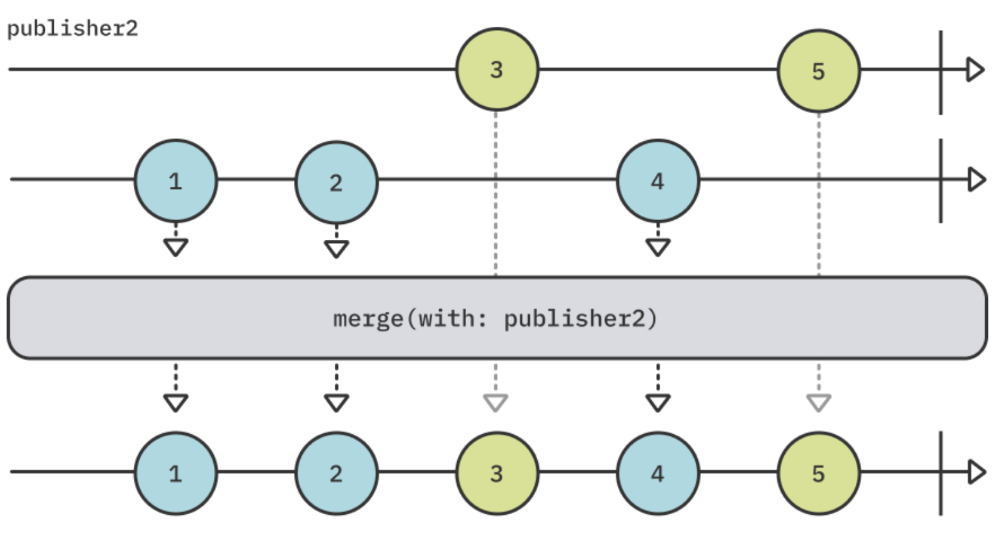

To try out this example, add the following code to your playground:

```swift
example(of: "merge(with:)") {
    // 1
    let publisher1 = PassthroughSubject<Int, Never>()
    let publisher2 = PassthroughSubject<Int, Never>()
    
    // 2
    publisher1
        .merge(with: publisher2)
        .sink(
            receiveCompletion: { _ in print("Completed") },
            receiveValue: { print($0) }
        )
        .store(in: &subscriptions)
    
    // 3
    publisher1.send(1)
    publisher1.send(2)
    
    publisher2.send(3)
    
    publisher1.send(4)
    
    publisher2.send(5)
    
    // 4
    publisher1.send(completion: .finished)
    publisher2.send(completion: .finished)
}
```

In this code, which correlates with the above diagram, you:

1. Create two PassthroughSubjects that accept and emit integer values and will not emit an error.

2. Merge publisher1 with publisher2, interleaving the emitted values from both. Combine offers overloads that let you merge up to eight different publishers.

3. You add 1 and 2 to publisher1, then add 3 to publisher2, then add 4 to publisher1 again and finally add 5 to publisher2.

4. You send a completion event to both publisher1 and publisher2.

Run your playground and you should see the following output, as expected:

```
——— Example of: merge(with:) ———
1
2
3
4
5
Completed
```


**combineLatest**

combineLatest is another operator that lets you combine different publishers. It also lets you combine publishers of different value types, which can be extremely useful. However, instead of interleaving the emissions of all publishers, it emits a tuple with the latest values of all publishers whenever any of them emit a value.

One catch though: The origin publisher and every publisher passed to combineLatest must emit at least one value before combineLatest itself will emit anything.

Add the following code to your playground to try out this operator:

```swift
example(of: "combineLatest") {
    // 1
    let publisher1 = PassthroughSubject<Int, Never>()
    let publisher2 = PassthroughSubject<String, Never>()
    
    // 2
    publisher1
        .combineLatest(publisher2)
        .sink(
            receiveCompletion: { _ in print("Completed") },
            receiveValue: { print("P1: \($0), P2: \($1)") }
        )
        .store(in: &subscriptions)
    
    // 3
    publisher1.send(1)
    publisher1.send(2)
    
    publisher2.send("a")
    publisher2.send("b")
    
    publisher1.send(3)
    
    publisher2.send("c")
    
    // 4
    publisher1.send(completion: .finished)
    publisher2.send(completion: .finished)
}
```

This code reproduces the above diagram. You:

1. Create two PassthroughSubjects. The first accepts integers with no errors, while the second accepts strings with no errors.

2. Combine the latest emissions of publisher2 with publisher1. You may combine up to four different publishers using different overloads of combineLatest.
3. Send 1 and 2 to publisher1, then "a" and "b" to publisher2, then 3 to publisher1 and finally "c" to publisher2.

Send a completion event to both publisher1 and publisher2.

Run the playground and take a look at the output in your console:

```
——— Example of: combineLatest ———
P1: 2, P2: a
P1: 2, P2: b
P1: 3, P2: b
P1: 3, P2: c
Completed
```

You might notice that the 1 emitted from publisher1 is never pushed through combineLatest. That’s because combineLatest only starts emitting combinations once every publisher emits at least one value. Here, that condition is true only after "a" emits, at which point the latest emitted value from publisher1 is 2. That’s why the first emission is (2, "a").


**`zip`**

You’ll finish with one final operator for this chapter: zip. You might recognize this one from the Swift standard library method with the same name on Sequence types.

This operator works similarly, emitting tuples of paired values in the same indexes. It waits for each publisher to emit an item, then emits a single tuple of items after all publishers have emitted an value at the current index.

This means that if you are zipping two publishers, you’ll get a single tuple emitted every time both publishers emit a new value.

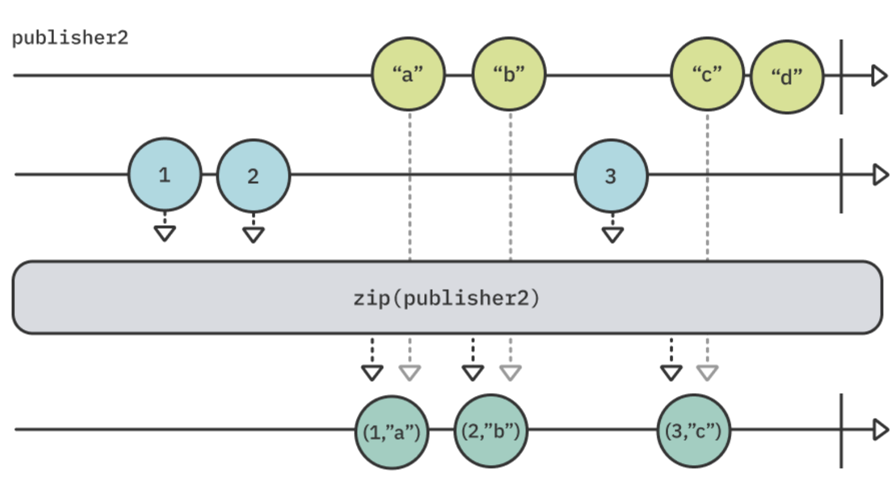

Add the following code to your playground to try this example:

```swift
example(of: "zip") {
    // 1
    let publisher1 = PassthroughSubject<Int, Never>()
    let publisher2 = PassthroughSubject<String, Never>()
    
    // 2
    publisher1
        .zip(publisher2)
        .sink(
            receiveCompletion: { _ in print("Completed") },
            receiveValue: { print("P1: \($0), P2: \($1)") }
        )
        .store(in: &subscriptions)
    
    // 3
    publisher1.send(1)
    publisher1.send(2)
    publisher2.send("a")
    publisher2.send("b")
    publisher1.send(3)
    publisher2.send("c")
    publisher2.send("d")
    
    // 4
    publisher1.send(completion: .finished)
    publisher2.send(completion: .finished)
}
```


In this final example, you:

1. Create two PassthroughSubjects, where the first accepts integers and the second accepts strings. Both cannot emit errors.
2. Zip publisher1 with publisher2, pairing their emissions once they each emit a new value.
3. Send 1 and 2 to publisher1, then "a" and "b" to publisher2, then 3 to publisher1 again, and finally "c" and "d" to publisher2.
4. Complete both publisher1 and publisher2.

Run your playground a final time and take a look at the debug console:

```
——— Example of: zip ———
P1: 1, P2: a
P1: 2, P2: b
P1: 3, P2: c
Completed
```


### Key points

In this chapter, you learned how to take different publishers and create meaningful combinations from them. More specifically, you learned that:

- You can use the prepend and append families of operators to add emissions from one publisher before or after a different publisher.
- While switchToLatest is relatively complex, it’s extremely useful. It takes a publisher that emits publishers, switches to the latest publisher and cancels the subscription to the previous publisher.
- merge(with:) lets you interleave values from multiple publishers.
- combineLatest emits the latest values of all combined publishers whenever any of them emit a value, once all of the combined publishers have emitted at least one value.
- zip pairs emissions from different publishers, emitting a tuple of pairs after all publishers have emitted an value.
- You can mix combination operators to create interesting and complex relationships between publishers and their emissions.


### Where to go from here?

This has been quite a long chapter, but it includes some of the most useful and involved operators Combine has to offer. Kudos to you for making it this far!

No challenges this time. Try to experiment with all of the operators you’ve learned thus far, there are plenty of use cases to play with.

You have two more groups of operators to learn about in the next two chapters: "Time Manipulation Operators" and "Sequence Operators," so move on to the next chapter!


## Chapter 6: Time Manipulation Operators

Timing is everything. The core idea behind reactive programming is to model asynchronous event flow over time. In this respect, the Combine framework provides a range of operators that allow you to deal with time. In particular, how sequences react to and transform values over time.

As you’ll see throughout this chapter, managing the time dimension of your sequence of values is easy and straightforward. It’s one of the great benefits of using a framework like Combine.


### Getting started

To learn about time manipulation operators, you’ll practice with an animated Xcode Playground that visualizes how data flows over time. This chapter comes with a starter playground you’ll find in the projects folder.

The playground is divided into several pages. You’ll use each page to exercise one or more related operators. It also includes some ready-made classes, functions and sample data that’ll come in handy to build the examples.

If you have the playground set to show rendered markup, at the bottom of each page there will be a Next link that you can click to go to the next page.

Note: To toggle showing rendered markup on and off, select Editor ▸ Show Rendered/Raw Markup from the menu.


You can also select the page you want from the Project navigator in the left sidebar or even the jump bar at the top of the page. There are lots of ways to get around in Xcode!

Look at Xcode, and you'll see the sidebar control at the top-left part of the window:

1. Make sure the left sidebar button is toggled so you can see the list of Playground pages:


2. Next, look at the top-right side of the window. You'll see the view controls:


Show the editor with Live View. This will display a live view of the sequences you build in code. This is where the real action will happen!

3. Showing the Debug area is important for most of the examples in this chapter. Toggle the Debug area using the following icon at the bottom-right of the window, or using the keyboard shortcut Command-Shift-Y:


**Playground not working?**

From time to time Xcode may “act up” and not run properly your playground. If this happens to you, open the Preferences dialog in Xcode and select the Locations tab. Click the arrow next to the Derived Data location, depicted by the red circled 1 in the screenshot below. It shows the DerivedData folder in the Finder.


Quit Xcode, move the DerivedData folder to trash then launch Xcode again. Your playground should now work properly!


### Shifting time

Every now and again you need time traveling. While Combine can’t help with fixing your past relationship mistakes, it can freeze time for a little while to let you wait until self-cloning is available.

The most basic time manipulation operator delays values from a publisher so that you see them later than they actually occur.

The `delay(for:tolerance:scheduler:options)` operator time-shifts a whole sequence of values: Every time the upstream publisher emits a value, delay keeps it for a while then emits it after the delay you asked for, on the scheduler you specified.

Open the Delay playground page. The first thing you’ll see is that you’re not only importing the Combine framework but also SwiftUI! This animated playground is built with SwiftUI and Combine. When you feel in an adventurous mood, it’ll be a good idea to peruse through the code in the Sources folder.

But first things first. Start by defining a couple of constants you’ll be able to tweak later:

```swift
let valuesPerSecond = 1.0
let delayInSeconds = 1.5
```


You’re going to create a publisher that emits one value every second, then delay it by 1.5 seconds and display both timelines simultaneously to compare them. Once you complete the code on this page, you’ll be able to adjust the constants and watch results in the timelines.

Next, create the publishers you need:

```swift
// 1
let sourcePublisher = PassthroughSubject<Date, Never>()

// 2
let delayedPublisher = sourcePublisher.delay(for: .seconds(delayInSeconds), scheduler: DispatchQueue.main)

// 3
let subscription = Timer
    .publish(every: 1.0 / valuesPerSecond, on: .main, in: .common)
    .autoconnect()
    .subscribe(sourcePublisher)
```

Breaking this code down:

1. sourcePublisher is a simple Subject which you’ll feed dates a Timer emits. The type of values is of little importance here. You only care about imaging when a publisher emits a value, and when the value shows up after a delay.

2. delayedPublisher will delay values from a sourcePublisher and emit them on the main scheduler. You’ll learn all about schedulers in Chapter 17, “Schedulers.” For now, specify that values must end up on the main queue, ready for display to consume them.

3. Create a timer that delivers one value per second on the main thread. Start it immediately with autoconnect() and feed the values it emits through the sourcePublisher subject.

> Note: This particular timer is a Combine extension on the Foundation Timer class. It takes a RunLoop and RunLoop.Mode, and not a DispatchQueue as you may expect. You’ll learn all about timers in Chapter 11, “Timers.” Also, timers are part of a class of publishers that are connectable. This means they need to be connected to before they start emitting values. You use autoconnect() which immediately connects upon the first subscription.

You’re getting to the part where you create the two views that will let you visualize events. Add this code to your playground:

```swift
// 4
let sourceTimeline = TimelineView(title: "Emitted values (\(valuesPerSecond) per sec.):")

// 5
let delayedTimeline = TimelineView(title: "Delayed values (with a \(delayInSeconds)s delay):")

// 6
let view = VStack(spacing: 50) {
    sourceTimeline
    delayedTimeline
}

// 7
PlaygroundPage.current.liveView = UIHostingController(rootView: view.frame(width: 375, height: 600))
```

In this code, you:

4. Create a TimelineView that will display values from the timer. TimelineView is a SwiftUI view, its code can be found at Sources/Views.swift.
5. Create another TimelineView to display delayed values.
6. Create a simple SwiftUI vertical stack to display both timelines one above the other.
7. Set up the live view for this playground page. The additional frame(widht:height:) modifier is just there to help set a fixed frame for Xcode‘s previews.

At this stage, you see two empty timelines on the screen. You now need to feed them with the values from each publisher! Add this final code to the playground:

```swift
sourcePublisher.displayEvents(in: sourceTimeline)
delayedPublisher.displayEvents(in: delayedTimeline)
```

In this last piece of code, you connect the source and delayed publishers to their respective timelines to display events.

Once you save these source changes, Xcode will recompile the playground code and... look at the Live View pane! Finally!

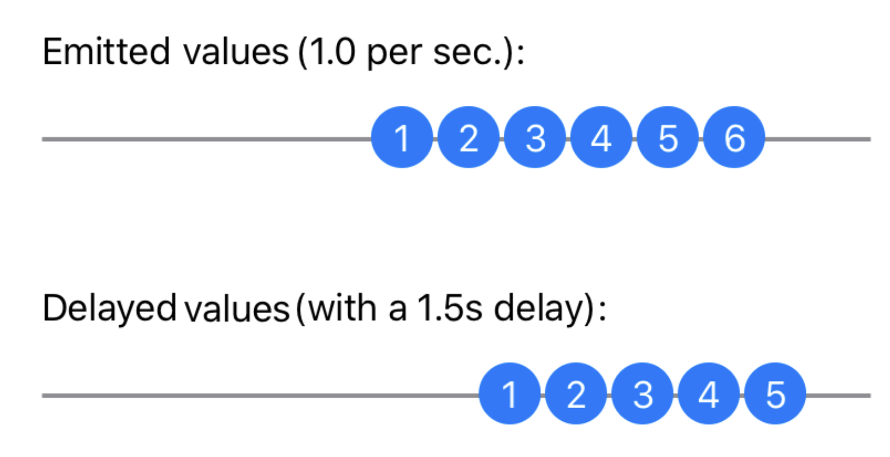

You’ll see two timelines. The top timeline shows values the timer emitted. The bottom timeline shows the same values, delayed. The numbers inside the circles reflect the count of values emitted, not their actual content.

> Note: As exciting as it is to see a live observable diagram, it might confuse at first. Static timelines usually have their values aligned to the left. But, if you think twice about it, they also have the most recent ones on the right side just as the animated diagrams you observe right now.


### Collecting values

In certain situations, you may need to collect values from a publisher at specified time intervals. This is a form of buffering that can be useful. For example, when you want to average a group of values over short periods of time and output the average.

Switch to the Collect page by clicking the Next link at the bottom, or by selecting it in the Project navigator or jump bar.

As in the previous example, you’ll begin with some constants:

```swift
let valuesPerSecond = 1.0
let collectTimeStride = 4
```

Of course, reading these constants gives you an idea of where this is all going. Create your publishers now:

```swift
// 1
let sourcePublisher = PassthroughSubject<Date, Never>()

// 2
let collectedPublisher = sourcePublisher
    .collect(.byTime(DispatchQueue.main, .seconds(collectTimeStride)))
```

Like in the previous example, you:

1. Set up a source publisher — a subject that will relay the values a timer emits.

2. Create a collectedPublisher which collects values it receives during strides of collectTimeStride using the collect operator. The operator emits these groups of values as arrays on the specified scheduler: DispatchQueue.main.

> Note: You might remember learning about the collect operator in Chapter 3, “Transforming Operators,” where you used a simple number to define how to group values together. This overload of collect accepts a strategy for grouping values; in this case, by time.


You’ll use a Timer again to emit values at regular intervals as you did for the delay operator:

```swift
let subscription = Timer
    .publish(every: 1.0 / valuesPerSecond, on: .main, in: .common)
    .autoconnect()
    .subscribe(sourcePublisher)
```

Next, create the timeline views like in the previous example. Then, set the playground’s live view to a vertical stack showing the source timeline and the timeline of collected values:

```swift
let sourceTimeline = TimelineView(title: "Emitted values:")
let collectedTimeline = TimelineView(title: "Collected values (every \(collectTimeStride)s):")

let view = VStack(spacing: 40) {
    sourceTimeline
    collectedTimeline
}

PlaygroundPage.current.liveView = UIHostingController(rootView: view.frame(width: 375, height: 600))
```

Finally, feed the timelines with events from both publishers:

```swift
sourcePublisher.displayEvents(in: sourceTimeline)
collectedPublisher.displayEvents(in: collectedTimeline)
```

You’re done! Now look at the live view for a while:


You see values appear at regular intervals on the Emitted values timeline. Below it, you see that every four seconds the Collected values timeline displays a single value. But what is it?

You may have guessed that the value is an array of values received during the last four seconds. You can improve the display to see what’s actually in it! Go back to the line where you created the collectedPublisher object. Add the use of the flatMap operator just below it, so it looks like this:

```swift
let collectedPublisher = sourcePublisher
    .collect(.byTime(DispatchQueue.main, .seconds(collectTimeStride)))
    .flatMap { dates in dates.publisher }
```

Do you remember your friend flatMap you learned about in Chapter 3, “Transforming Operators?” You’re putting it to good use here: Every time collect emits a group of values it collected, flatMap breaks it down again to individual values but emitted immediately one after the other. To this end, it uses the publisher extension of Collection that turns a sequence of values into a Publisher, emitting immediately all values in the sequence as individual values.

Now, look at the effect it has on the timeline:

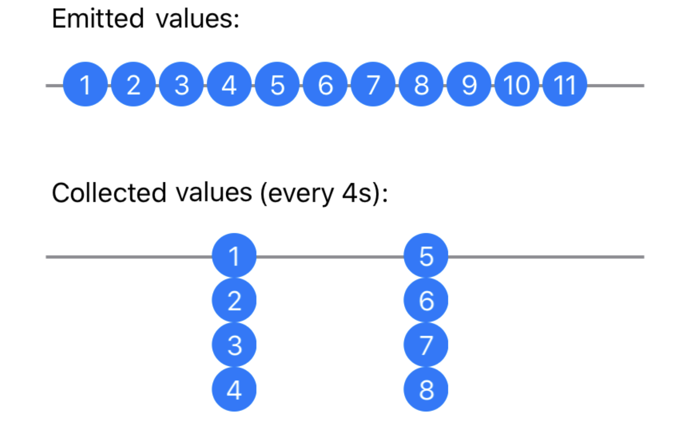

You can now see that, every four seconds, collect emits an array of values collected during the last time interval.


### Collecting values (part 2)

The second option the collect(_:options:) operator offers allows you to keep collecting values at regular intervals. It also allows you to limit the number of values collected.

Staying on the same Collect page, and add a new constant right below collectTimeStride at the top:

```swift
let collectMaxCount = 2
```

Next, create a new publisher after collectedPublisher:

```
let collectedPublisher2 = sourcePublisher
    .collect(.byTimeOrCount(DispatchQueue.main,
                            .seconds(collectTimeStride),
                            collectMaxCount))
    .flatMap { dates in dates.publisher }
```

This time, you are using the .byTimeOrCount(Context, Context.SchedulerTimeType.Stride, Int) variant to collect up to collectMaxCount values at a time. What does this mean? Keep adding code and you’ll find out!

Add a new TimelineView for the second collect publisher in between collectedTimeline and let view = VStack...

```swift
let collectedTimeline2 = TimelineView(title: "Collected values (at most \(collectMaxCount) every \(collectTimeStride)s):")

let view = VStack(spacing: 40) {
    sourceTimeline
    collectedTimeline
    collectedTimeline2
}
```

Finally, make sure it displays the events it emits in the timeline by adding the following at the end of your playground:

```swift
collectedPublisher2.displayEvents(in: collectedTimeline2)
```

Now, let this timeline run for a while so you can witness the difference:


You can see here that the second timeline is limiting its collection to two values at a time, as required by the collectMaxCount constant. It’s a useful tool to know about!


### Holding off on events

When coding user interfaces, you frequently deal with text fields. Wiring up text field contents to an action using Combine is a common task. For example, you may want to send a search URL request that returns a list of items matching what’s typed in the text field.

But of course, you don’t want to send a request every time your user types a single letter! You need some kind of mechanism to help pick up on typed text only when the user is done typing for a while.

Combine offers two operators that can help you here: debounce and throttle. Let’s explore them!


#### Debounce

Switch to the playground page named Debounce. Make sure that the Debug area is visible — View ▸ Debug Area ▸ Activate Console — so you can see the printouts of values debounce emits.

Start by creating a couple of publishers:

```swift
// 1
let subject = PassthroughSubject<String, Never>()

// 2
let debounced = subject
    .debounce(for: .seconds(1.0), scheduler: DispatchQueue.main)
// 3
    .share()
```

In this code, you:

1. Create a source publisher which will emit strings.
2. Use debounce to wait for one second on emissions from subject. Then, it will send the last value sent in that one-second interval, if any. This has the effect of allowing a max of one value per second to be sent.
3. You are going to subscribe multiple times to debounced. To guarantee consistency of the results, you use share() to create a single subscription point to debounce that will show the same results at the same time to all subscribers.

> Note: Diving into the share() operator is out of the scope of this chapter. Just remember that it is helpful when a single subscription to a publisher is required to deliver the same results to multiple subscribers. You’ll learn more about share() in Chapter 13, “Resource Management.”

For these next few examples, you will use a set of data to simulate a user typing text in a text field. Don’t type this in — it’s already been implemented in Sources/Data.swift for you:

```swift
public let typingHelloWorld: [(TimeInterval, String)] = [
    (0.0, "H"),
    (0.1, "He"),
    (0.2, "Hel"),
    (0.3, "Hell"),
    (0.5, "Hello"),
    (0.6, "Hello "),
    (2.0, "Hello W"),
    (2.1, "Hello Wo"),
    (2.2, "Hello Wor"),
    (2.4, "Hello Worl"),
    (2.5, "Hello World")
]
```

The simulated user starts typing at 0.0 seconds, pauses after 0.6 seconds, and resumes typing at 2.0 seconds.


Note: The time values you’ll see in the Debug area may be offset by one or two tenth of a second. Since you’ll be emitting values on the main queue using DispatchQueue.asyncAfter(), you are guaranteed a minimum time interval between values but maybe not exactly what you requested.


In the playground’s Debounce page, create two timelines to visualize events, and wire them up to the two publishers:

```swift
let subjectTimeline = TimelineView(title: "Emitted values")
let debouncedTimeline = TimelineView(title: "Debounced values")

let view = VStack(spacing: 100) {
    subjectTimeline
    debouncedTimeline
}

PlaygroundPage.current.liveView = UIHostingController(rootView: view.frame(width: 375, height: 600))

subject.displayEvents(in: subjectTimeline)
debounced.displayEvents(in: debouncedTimeline)
```

You are now familiar with this playground structure where you stack timelines on the screen and connect them to the publishers for event display.

This time, you’re going to do something more: Print values each publisher emits, along with the time (since start) at which they show up. This will help you figure out what’s happening.

Add this code:

```swift
let subscription1 = subject
    .sink { string in
        print("+\(deltaTime)s: Subject emitted: \(string)")
    }

let subscription2 = debounced
    .sink { string in
        print("+\(deltaTime)s: Debounced emitted: \(string)")
    }

```

Each subscription prints the values it receives, along with the time since start. deltaTime is a dynamic global variable defined in Sources/DeltaTime.swift which formats the time difference since the playground started running.

Now you need to feed your subject with data. This time you’re going to use a pre-made data source that simulates a user typing text. It’s all defined in Sources/Data.swift and you can modify it at will. Take a look, you’ll see that it’s a simulation of a user typing the words “Hello World”.

Add this code to the end of the playground page:

```swift
subject.feed(with: typingHelloWorld)
```

The feed(with:) method takes a data set and sends data to the given subject at pre-defined time intervals. A handy tool for simulations and mocking data input! You may want to keep this around when you write tests for your code because you will write tests, won’t you?

Now look at the result:


You see the emitted values at the top, there are 11 strings total being pushed to the sourcePublisher. You can see that the user paused between the two words. This is the time where debounce emitted the captured input.

You can confirm this by looking at the debug area where the prints show up:

```
+0.0s: Subject emitted: H
+0.1s: Subject emitted: He
+0.2s: Subject emitted: Hel
+0.3s: Subject emitted: Hell
+0.5s: Subject emitted: Hello
+0.6s: Subject emitted: Hello 
+1.6s: Debounced emitted: Hello 
+2.1s: Subject emitted: Hello W
+2.1s: Subject emitted: Hello Wo
+2.4s: Subject emitted: Hello Wor
+2.4s: Subject emitted: Hello Worl
+2.7s: Subject emitted: Hello World
+3.7s: Debounced emitted: Hello World
```

As you can see, at 0.6 seconds the user pauses and resumes typing only at 2.1 seconds. Meanwhile, you configured debounce to wait for a one-second pause. It obliges (at 1.6 seconds) and emits the latest received value.

Same around the end where typing ends at 2.7 seconds and debounce kicks in one second later at 3.7 seconds. Cool!

> Note: One thing to watch out for is the publisher’s completion. If your publisher completes right after the last value was emitted, but before the time configured for debounce elapses, you will never see the last value in the debounced publisher!


#### Throttle

The kind of holding-off pattern that debounce allows is so useful that Combine provides a close relative: throttle(for:scheduler:latest:). It’s very close to debounce, but the differences justify the need for two operators.

Switch to the Throttle page in the playground and get coding. First, you need a constant, as usual:

```swift
let throttleDelay = 1.0

// 1
let subject = PassthroughSubject<String, Never>()

// 2
let throttled = subject
    .throttle(for: .seconds(throttleDelay), scheduler: DispatchQueue.main, latest: false)
// 3
    .share()
```

Breaking down this code:

1. The source publisher will emit strings.
2. Your throttled subject will now only emit the first value it received from subject during each one-second interval because you set latest to false.
3. Like in the previous operator, debounce, adding the share() operator here guarantees that all subscribers see the same output at the same time from the throttled subject.

Create timelines to visualize events, and wire them up to the two publishers:

```swift
let subjectTimeline = TimelineView(title: "Emitted values")
let throttledTimeline = TimelineView(title: "Throttled values")

let view = VStack(spacing: 100) {
    subjectTimeline
    throttledTimeline
}

PlaygroundPage.current.liveView = UIHostingController(rootView: view.frame(width: 375, height: 600))

subject.displayEvents(in: subjectTimeline)
throttled.displayEvents(in: throttledTimeline)
```

Now you also want to print the values each publisher emits, to better understand what’s going on. Add this code:

```swift
let subscription1 = subject
    .sink { string in
        print("+\(deltaTime)s: Subject emitted: \(string)")
    }

let subscription2 = throttled
    .sink { string in
        print("+\(deltaTime)s: Throttled emitted: \(string)")
    }
```

Again, you‘re going to feed your source publisher with a simulated “Hello World” user input. Add this final line to your playground page:

```swift
subject.feed(with: typingHelloWorld)
```

Your playground is ready! You can now see what’s happening in the live view:


Isn’t this puzzling? It doesn’t look that much different from the previous debounce output! Well, it actually is.

First, look closely at both. You can see that the values emitted by throttle have slightly different timing.

Second, to get a better picture of what’s happening, look at the debug console:

```
+0.0s: Subject emitted: H
+0.0s: Throttled emitted: H
+0.1s: Subject emitted: He
+0.2s: Subject emitted: Hel
+0.3s: Subject emitted: Hell
+0.5s: Subject emitted: Hello
+0.6s: Subject emitted: Hello 
+1.0s: Throttled emitted: He
+2.2s: Subject emitted: Hello W
+2.2s: Subject emitted: Hello Wo
+2.2s: Subject emitted: Hello Wor
+2.4s: Subject emitted: Hello Worl
+2.7s: Subject emitted: Hello World
+3.0s: Throttled emitted: Hello W
```

This is clearly different! You can see a few interesting things here:

When the subject emits its first value, throttle immediately relays it. Then, it starts throttling the output.

At 1.0 second, throttle emits “He”. Remember you asked it to send you the first value (since the last) after one second.

At 2.2 seconds, typing resumes. You can see that at this time, throttle didn’t emit anything. This is because no new value had been received from the source publisher.

At 3.0 seconds, after typing completes, throttle kicks in again and outputs the first value again, i.e., the value at 2.2 seconds.

There you have the fundamental difference between debounce and throttle:

debounce waits for a pause in values it receives, then emits the latest one after the specified interval.

throttle waits for the specified interval, then emits either the first or the latest of the values it received during that interval. It doesn’t care about pauses.

To see what happens when you change latest to true, change your setup of the throttled publisher to the following:

```swift
let throttled = subject
    .throttle(for: .seconds(throttleDelay), scheduler: DispatchQueue.main, latest: true)
```

Now, observe the resulting output in the debug area:

```
+0.0s: Subject emitted: H
+0.0s: Throttled emitted: H
+0.1s: Subject emitted: He
+0.2s: Subject emitted: Hel
+0.3s: Subject emitted: Hell
+0.5s: Subject emitted: Hello
+0.6s: Subject emitted: Hello 
+1.0s: Throttled emitted: Hello
+2.0s: Subject emitted: Hello W
+2.3s: Subject emitted: Hello Wo
+2.3s: Subject emitted: Hello Wor
+2.6s: Subject emitted: Hello Worl
+2.6s: Subject emitted: Hello World
+3.0s: Throttled emitted: Hello World
```

The throttled output occurs at precisely 1.0 second and 3.0 seconds with the latest value in the time window instead of the earliest one. Compare this with the output from debounce from the earlier example:
...
+1.6s: Debounced emitted: Hello 
...
+3.7s: Debounced emitted: Hello World
The output is the same, but debounce is delayed from the pause.


### Timing out

Next in this roundup of time manipulation operators is a special one: timeout. Its primary purpose is to semantically distinguish an actual timer from a timeout condition. Therefore, when a timeout operator fires, it either completes the publisher or emits an error you specify. In both cases, the publisher terminates.

Switch to the Timeout playground page. Begin by adding this code:

```swift
let subject = PassthroughSubject<Void, Never>()

// 1
let timedOutSubject = subject.timeout(.seconds(5), scheduler: DispatchQueue.main)
```


The timedOutSubject publisher will time-out after five seconds without the upstream publisher emitting any value. This form of timeout forces a publisher completion without any failure.

You now need to add your timeline, as well as a button to let you trigger events:

```swift
let timeline = TimelineView(title: "Button taps")

let view = VStack(spacing: 100) {
    // 1
    Button(action: { subject.send() }) {
        Text("Press me within 5 seconds")
    }
    timeline
}

PlaygroundPage.current.liveView = UIHostingController(rootView: view.frame(width: 375, height: 600))

timedOutSubject.displayEvents(in: timeline)
```


This is a new one! You add a button above the timeline, which sends a new value through the source subject when pressed. The action closure will execute every time you press the button.

> Note: Have you noticed you’re using a subject that emits Void values? Yes, this is totally legitimate! It signals that something happened. But, there is no particular value to carry. So, you simply use Void as the value type. This is such a common case that Subject has an extension with a send() function that takes no parameter in case the Output type is Void. This saves you from writing the awkward subject.send(()) statement!


Your playground page is now complete. Watch it run and do nothing: the timeout will trigger after five seconds and complete the publisher.

Now, run it again. This time, keep pressing the button at less-than-five-seconds intervals. The publisher never completes because timeout doesn’t kick in.


Of course, the simple completion of a publisher is not what you want in many cases. Instead, you need the timeout publisher to send a failure so you can accurately take action in this case.

Go to the top of the playground page and define the error type you want:

```swift
enum TimeoutError: Error {
    case timedOut
}
```

Next, modify the definition of subject to change the error type from Never to TimeoutError. Your code should look like this:

```swift
let subject = PassthroughSubject<Void, TimeoutError>()
```

Now you need to modify the call to timeout. The complete signature for this operator is timeout(_:scheduler:options:customError:). Here is your chance to provide your custom error type!

Modify the line that creates the timedOutSubjectto this:

```
let timedOutSubject = subject.timeout(.seconds(5),
                                      scheduler: DispatchQueue.main,
                                      customError: { .timedOut })
```

Now when you run the playground and don’t press the button for five seconds, you can see that the timedOutSubject emits a failure.

Now that the time allocated to this operator ran out, let’s move to the last one in this section.


### Measuring time

To complete this roundup of time manipulation operators, you’ll look at one particular operator which doesn’t manipulate time but just measures it. The measureInterval(using:) operator is your tool when you need to find out the time that elapsed between two consecutive values a publisher emitted.

Switch to the MeasureInterval playground page. Begin by creating a pair of publishers:

```swift
let subject = PassthroughSubject<String, Never>()

// 1
let measureSubject = subject.measureInterval(using: DispatchQueue.main)
```

The measureSubject will emit measurements on the scheduler you specify. Here, the main queue.

Now as usual, add a couple of timelines:

```swift
let subjectTimeline = TimelineView(title: "Emitted values")
let measureTimeline = TimelineView(title: "Measured values")

let view = VStack(spacing: 100) {
  	subjectTimeline
  	measureTimeline
}

PlaygroundPage.current.liveView = UIHostingController(rootView: view.frame(width: 375, height: 600))

subject.displayEvents(in: subjectTimeline)
measureSubject.displayEvents(in: measureTimeline)
```

Finally, here comes the interesting part. Print out values both publishers emit, and then feed the subject:

```swift
let subscription1 = subject.sink {
    print("+\(deltaTime)s: Subject emitted: \($0)")
}

let subscription2 = measureSubject.sink {
    print("+\(deltaTime)s: Measure emitted: \($0)")
}
subject.feed(with: typingHelloWorld)
```

Run your playground and have a look at the debug area! This is where you see what measureInterval(using:) emits:

```
+0.0s: Subject emitted: H
+0.0s: Measure emitted: Stride(magnitude: 16818353)
+0.1s: Subject emitted: He
+0.1s: Measure emitted: Stride(magnitude: 87377323)
+0.2s: Subject emitted: Hel
+0.2s: Measure emitted: Stride(magnitude: 111515697)
+0.3s: Subject emitted: Hell
+0.3s: Measure emitted: Stride(magnitude: 105128640)
+0.5s: Subject emitted: Hello
+0.5s: Measure emitted: Stride(magnitude: 228804831)
+0.6s: Subject emitted: Hello 
+0.6s: Measure emitted: Stride(magnitude: 104349343)
+2.2s: Subject emitted: Hello W
+2.2s: Measure emitted: Stride(magnitude: 1533804859)
+2.2s: Subject emitted: Hello Wo
+2.2s: Measure emitted: Stride(magnitude: 154602)
+2.4s: Subject emitted: Hello Wor
+2.4s: Measure emitted: Stride(magnitude: 228888306)
+2.4s: Subject emitted: Hello Worl
+2.4s: Measure emitted: Stride(magnitude: 138241)
+2.7s: Subject emitted: Hello World
+2.7s: Measure emitted: Stride(magnitude: 333195273)
```

The values are a bit puzzling, aren’t they? It turns out that, as per the documentation, the type of the value measureInterval emits is “the time interval of the provided scheduler”. In the case of DispatchQueue, the TimeInterval is defined as “A DispatchTimeInterval created with the value of this type in nanoseconds.”.

What you are seeing here is a count, in nanoseconds, between each consecutive value received from the source subject. You can now fix the display to show more readable values. Modify the code that prints values from measureSubject like so:

```swift
let subscription2 = measureSubject.sink {
  print("+\(deltaTime)s: Measure emitted: \(Double($0.magnitude) / 1_000_000_000.0)")
}
```

Now, you’ll see values in seconds.

But what happens if you use a different scheduler? You can try it using a RunLoop instead of a DispatchQueue!


Note: You will explore the RunLoop and DispatchQueue schedulers in depth in Chapter 17, “Schedulers.”

Back to the top of the file, create a second subject that uses a RunLoop:

```swift
let measureSubject2 = subject.measureInterval(using: RunLoop.main)
```

You don’t need to bother wiring up a new timeline view, because what’s interesting is the debug output. Add this third subscription to your code:

```swift
let subscription3 = measureSubject2.sink {
  	print("+\(deltaTime)s: Measure2 emitted: \($0)")
}
```

Now, you’ll see the output from the RunLoop scheduler as well, with magnitudes directly expressed in seconds:

```
+0.0s: Subject emitted: H
+0.0s: Measure emitted: 0.016503769
+0.0s: Measure2 emitted: Stride(magnitude: 0.015684008598327637)
+0.1s: Subject emitted: He
+0.1s: Measure emitted: 0.087991755
+0.1s: Measure2 emitted: Stride(magnitude: 0.08793699741363525)
+0.2s: Subject emitted: Hel
+0.2s: Measure emitted: 0.115842671
+0.2s: Measure2 emitted: Stride(magnitude: 0.11583995819091797)
...
```

The scheduler you use for measurement is really up to your personal taste. It is generally a good idea to stick with DispatchQueue for everything. But that’s your personal choice!


### Challenge

#### Challenge: Data

If time allows, you may want to try a little challenge to put this new knowledge to good use!

Open the starter challenge playground in the projects/challenge folder. You see some code waiting for you:

- A subject that emits integers.

- A function call that feeds the subject with mysterious data.

In between those parts, your challenge is to:

- Group data by batches of 0.5 seconds.

- Turn the grouped data into a string.

- If there is a pause longer than 0.9 seconds in the feed, print the 👏 emoji. Hint: Create a second publisher for this step and merge it with the first publisher in your subscription.

- Print it.

> Note: To convert an Int to a Character, you can do something like Character(Unicode.Scalar(value)!).


If you code this challenge correctly, you’ll see a sentence printed in the Debug area. What is it?


#### Solution

You’ll find the solution to this challenge in the challenge/Final.playground Xcode playground.

Here’s the solution code:

```swift
// 1
let strings = subject
// 2
    .collect(.byTime(DispatchQueue.main, .seconds(0.5)))
// 3
    .map { array in
        String(array.map { Character(Unicode.Scalar($0)!) })
    }

// 4
let spaces = subject.measureInterval(using: DispatchQueue.main)
    .map { interval in
        // 5
        interval > 0.9 ? "👏" : ""
    }

// 6
let subscription = strings
    .merge(with: spaces)
// 7
    .filter { !$0.isEmpty }
    .sink {
        // 8
        print($0)
    }
```

From the top, you:

1. Create a first publisher derived from the subject which emits the strings.

2. Use collect() using the .byTime strategy to group data in 0.5 seconds batches.

3. Map each integer value to a Unicode scalar, then to a character and then turn the whole lot into a string using map.
4. Create a second publisher derived from the subject, which measures the intervals between each character.
5. If the interval is greater than 0.9 seconds, map the value to the 👏 emoji. Otherwise, map it to an empty string.
6. The final publisher is a merge of both strings and the 👏 emoji.
7. Filter out empty strings for better display.
8. Print the result!

Your solution might have been subtly different, and that’s OK. As long as you met the requirements, you get the W!

Running the playground with this solution will print the following output to the console:

```
Combine
👏
is
👏
cool!
```


### Key points

In this chapter, you looked at time from a different perspective. In particular, you learned that:

- Combine’s handling of asynchronous events extends to manipulating time itself.

- Even though it doesn’t provide time-traveling options, the framework has operators that let you abstract work over long periods of time, rather than just handling discrete events.

- Time can be shifted using the delay operator.

- You can manage the flow of values over time like a dam and release them by chunks using collect.

- Picking individual values over time is easy with debounce and throttle.

- Not letting time run out is the job of timeout.

Time can be measured with measureInterval.


### Where to go from here?

This was a lot to learn. To put events in their right order, move along to the next chapter and learn about sequence operators!


## Chapter 7: Sequence Operators

At this point, you know most of the operators that Combine has to offer! How great is that? There's still one more category for you to dig into, though: Sequence Operators.

Sequence operators are easiest to understand when you realize that publishers are just sequences themselves. Sequence operators work with a publisher’s values, much like an array or a set — which, of course, are just finite sequences!

With that in mind, sequence operators mostly deal with the publisher as a whole and not with individual values, as other operator categories do.

Many of the operators in this category have nearly identical names and behaviors as their counterparts in the Swift standard library.


### Getting started

You can find the starter playground for this chapter in projects/Starter.playground. Throughout this chapter, you’ll add code to your playground and run it to see how these different sequence operators manipulate your publisher. You’ll use the print operator to log all publishing events.


### Finding values

The first section of this chapter consists of operators that locate specific values the publisher emits based on different criteria. These are similar to the collection methods in the Swift standard library.

**min**

The min operator lets you find the minimum value emitted by a publisher. It's greedy, which means it must wait for the publisher to send a .finished completion event. Once the publisher completes, only the minimum value is emitted by the operator:

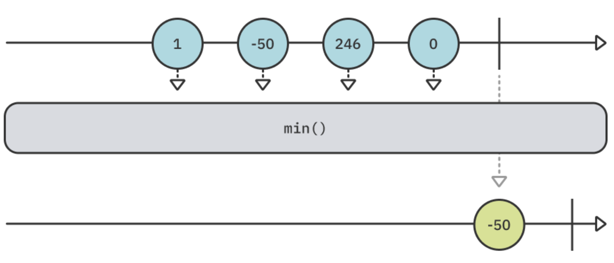

Add the following example to your playground to try min:

```swift
example(of: "min") {
    // 1
    let publisher = [1, -50, 246, 0].publisher
    
    // 2
    publisher
        .print("publisher")
        .min()
        .sink(receiveValue: { print("Lowest value is \($0)") })
        .store(in: &subscriptions)
}
```

In this code, you:

1. Create a publisher emitting four different numbers.

2. Use the min operator to find the minimum number emitted by the publisher and print that value.

Run your playground and you'll see the following output in the console:

```
——— Example of: min ———
publisher: receive subscription: ([1, -50, 246, 0])
publisher: request unlimited
publisher: receive value: (1)
publisher: receive value: (-50)
publisher: receive value: (246)
publisher: receive value: (0)
publisher: receive finished
Lowest value is -50
```

As you can see, the publisher emits all its values and finishes, then min finds the minimum and sends it downstream to sink to print it out.

But wait, how does Combine know which of these numbers is the minimum? Well, that's thanks to the fact numeric values conform to the Comparable protocol. You can use min() directly, without any arguments, on publishers that emit Comparable-conforming types.

But what happens if your values don't conform to Comparable? Luckily, you can provide your own comparator closure using the min(by:) operator.

Consider the following example, where your publisher emits many pieces of Data and you'd like to find the smallest one.

Add the following code to your playground:

```swift
example(of: "min non-Comparable") {
    // 1
    let publisher = ["12345",
                     "ab",
                     "hello world"]
        .map { Data($0.utf8) } // [Data]
        .publisher // Publisher<Data, Never>
    
    // 2
    publisher
        .print("publisher")
        .min(by: { $0.count < $1.count })
        .sink(receiveValue: { data in
            // 3
            let string = String(data: data, encoding: .utf8)!
            print("Smallest data is \(string), \(data.count) bytes")
        })
        .store(in: &subscriptions)
}
```


In the above code:

1. You create a publisher that emits three Data objects created from various strings.

2. Since Data doesn't conform to Comparable, you use the min(by:) operator to find the Data object with the smallest number of bytes.

3. You convert the smallest Data object back to a string and print it out.

Run your playground and you'll see the following in your console:

```
——— Example of: min non-Comparable ———
publisher: receive subscription: ([5 bytes, 2 bytes, 11 bytes])
publisher: request unlimited
publisher: receive value: (5 bytes)
publisher: receive value: (2 bytes)
publisher: receive value: (11 bytes)
publisher: receive finished
Smallest data is ab, 2 bytes
```

Like the previous example, the publisher emits all its Data objects and finishes, then min(by:) finds and emits the data with the smallest byte size and sink prints it out.


**max**

As you'd guess, max works exactly like min, except that it finds the maximum value emitted by a publisher:


Add the following code to your playground to try this example:

```swift
example(of: "max") {
    // 1
    let publisher = ["A", "F", "Z", "E"].publisher
    
    // 2
    publisher
        .print("publisher")
        .max()
        .sink(receiveValue: { print("Highest value is \($0)") })
        .store(in: &subscriptions)
}
```

In the following code, you:

1. Create a publisher that emits four different letters.

2. Use the max operator to find the letter with the highest value and print it.

Run your playground. You'll see the following output in your playground:

```
——— Example of: max ———
publisher: receive subscription: (["A", "F", "Z", "E"])
publisher: request unlimited
publisher: receive value: (A)
publisher: receive value: (F)
publisher: receive value: (Z)
publisher: receive value: (E)
publisher: receive finished
Highest value is Z
```


Exactly like min, max is greedy and must wait for the upstream publisher to finish emitting its values before it determines the maximum value. In this case, that value is Z.

> Note: Exactly like min, max also has a companion max(by:) operator that accepts a predicate to determine the maximum value emitted among non-Comparable values.


**first**

While the min and max operators deal with finding a published value at some unknown index, the rest of the operators in this section deal with finding emitted values at specific places, starting with the first operator.

The first operator is similar to Swift's first property on collections, except that it lets the first emitted value through and then completes. It's lazy, meaning it doesn't wait for the upstream publisher to finish, but instead will cancel the subscription when it receives the first value emitted.


Add the above example to your playground:

```swift
example(of: "first") {
    // 1
    let publisher = ["A", "B", "C"].publisher
    
    // 2
    publisher
        .print("publisher")
        .first()
        .sink(receiveValue: { print("First value is \($0)") })
        .store(in: &subscriptions)
}
```

In the above code, you:

1. Create a publisher emitting three letters.

2. Use first() to let only the first emitted value through and print it out.

Run your playground and take a look at the console:

```
——— Example of: first ———
publisher: receive subscription: (["A", "B", "C"])
publisher: request unlimited
publisher: receive value: (A)
publisher: receive cancel
First value is A
```

As soon as first() gets the publisher's first value, it cancels the subscription to the upstream publisher.

If you're looking for more granular control, you can also use first(where:). Just like its counterpart in the Swift standard library, it will emit the first value that matches a provided predicate — if there is one.

Add the following example to your playground:

```swift
example(of: "first(where:)") {
  // 1
  let publisher = ["J", "O", "H", "N"].publisher

  // 2
  publisher
    .print("publisher")
    .first(where: { "Hello World".contains($0) })
    .sink(receiveValue: { print("First match is \($0)") })
    .store(in: &subscriptions)
}
```

In this code, you:

Create a publisher that emits four letters.

Use the first(where:) operator to find the first letter contained in Hello World and then print it out.

Run the playground and you'll see the following output:

```swift
——— Example of: first(where:) ———
publisher: receive subscription: (["J", "O", "H", "N"])
publisher: request unlimited
publisher: receive value: (J)
publisher: receive value: (O)
publisher: receive value: (H)
publisher: receive cancel
First match is H
```


In the above example, the operator checks if Hello World contains the emitted letter until it finds the first match: H. Upon finding that much, it cancels the subscription and emits the letter for sink to print out.


**last**

Just as min has an opposite, max, first also has an opposite: last!

last works exactly like first, except it emits the last value that the publisher emits. This means it's also greedy and must wait for the upstream publisher to finish:

Add this example to your playground:

```swift
example(of: "last") {
    // 1
    let publisher = ["A", "B", "C"].publisher
    
    // 2
    publisher
        .print("publisher")
        .last()
        .sink(receiveValue: { print("Last value is \($0)") })
        .store(in: &subscriptions)
}
```

In this code, you:

1. Create a publisher that will emit three letters and finish.

2. Use the last operator to only emit the last value published and print it out.

Run the playground and you'll see the following output:

```
——— Example of: last ———
publisher: receive subscription: (["A", "B", "C"])
publisher: request unlimited
publisher: receive value: (A)
publisher: receive value: (B)
publisher: receive value: (C)
publisher: receive finished
Last value is C
```

last waits for the upstream publisher to send a .finished completion event, at which point it sends the last emitted value downstream to be printed out in sink.

> Note: Exactly like first, last also has a last(where:) overload, which emits the last value emitted by a publisher that matches a specified predicate.


**output(at:)**

The last two operators in this section don't have counterparts in the Swift standard library. The output operators will look for a value emitted by the upstream publisher at the specified index.

You'll start with output(at:), which emits only the value emitted at the specified index:

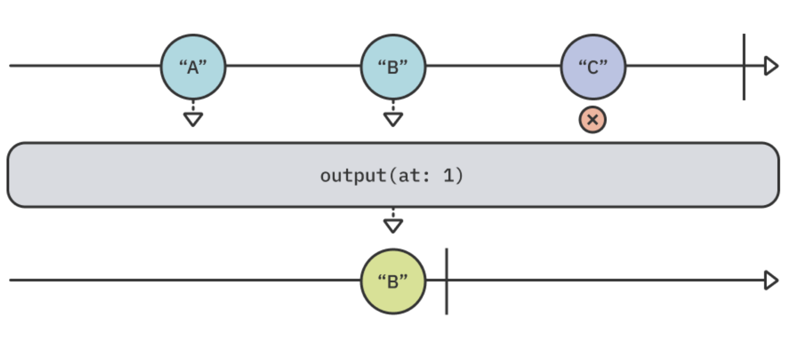

Add the following code to your playground to try this example:

```swift
example(of: "output(at:)") {
    // 1
    let publisher = ["A", "B", "C"].publisher
    
    // 2
    publisher
        .print("publisher")
        .output(at: 1)
        .sink(receiveValue: { print("Value at index 1 is \($0)") })
        .store(in: &subscriptions)
}
```

In the above code, you:

1. Create a publisher which emits three letters.

2. Use output(at:) to only let through the value emitted at index 1 — i.e., the second value.

Run the example in your playground and peek at your console:

```
——— Example of: output(at:) ———
publisher: receive subscription: (["A", "B", "C"])
publisher: request unlimited
publisher: receive value: (A)
publisher: request max: (1) (synchronous)
publisher: receive value: (B)
Value at index 1 is B
publisher: receive cancel
```

Here, the output indicates the value at index 1 is B. However, you might've noticed an additional interesting fact: The operator demands one more value after every emitted value, since it knows it's only looking for a single item. While this is an implementation detail of the specific operator, it provides interesting insight into how Apple designs some of their own built-in Combine operators to leverage backpressure.


**output(in:)**

You'll wrap up this section with the second overload of the output operator: output(in:).

While output(at:) emits a single value emitted at a specified index, output(in:) emits values whose indices are within a provided range:

To try this out, add the following example to your playground:

```swift
example(of: "output(in:)") {
    // 1
    let publisher = ["A", "B", "C", "D", "E"].publisher
    
    // 2
    publisher
        .output(in: 1...3)
        .sink(receiveCompletion: { print($0) },
              receiveValue: { print("Value in range: \($0)") })
        .store(in: &subscriptions)
}
```

In the previous code, you:

1. Create a publisher that emits five different letters.

2. Use the output(in:) operator to only let through values emitted in indices 1 through 3, then print out those values.

Can you guess what the output of this example will be? Run your playground and find out:

```
——— Example of: output(in:) ———
Value in range: B
Value in range: C
Value in range: D
finished
```

Well, did you guess correctly? The operator emits individual values within the range of indices, not a collection of them. The operator prints the values B, C and D as they're in indices 1, 2 and 3, respectively. Then, since all items within the range have been emitted, it cancels the subscription as soon as it receives all values within the provided range.


Querying the publisher

The following operators also deal with the entire set of values emitted by a publisher, but they don't produce any specific value that it emits. Instead, these operators emit a different value representing some query on the publisher as a whole. A good example of this is the count operator.


**count**

The count operator will emit a single value - the number of values were emitted by the upstream publisher, once the publisher sends a .finished completion event:

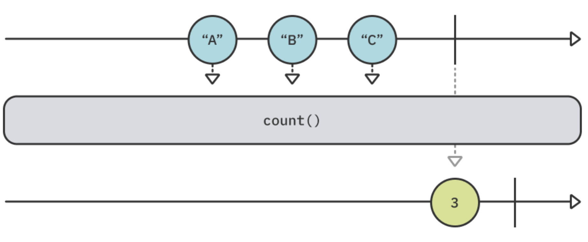

Add the following code to try this example:

```swift
example(of: "count") {
    // 1
    let publisher = ["A", "B", "C"].publisher
    
    // 2
    publisher
        .print("publisher")
        .count()
        .sink(receiveValue: { print("I have \($0) items") })
        .store(in: &subscriptions)
}
```

In the above code, you:

1. Create a publisher that emits three letters.

2. Use count() to emit a single value indicating the number of values emitted by the upstream publisher.

Run your playground and check your console. You'll see the following output:

```
——— Example of: count ———
publisher: receive subscription: (["A", "B", "C"])
publisher: request unlimited
publisher: receive value: (A)
publisher: receive value: (B)
publisher: receive value: (C)
publisher: receive finished
I have 3 items
```

As expected, the value 3 is only printed out once the upstream publisher sends a .finished completion event.


**contains**

Another useful operator is contains. You've probably used its counterpart in the Swift standard library more than once.

The contains operator will emit true and cancel the subscription if the specified value is emitted by the upstream publisher, or false if none of the emitted values are equal to the specified one:

Add the following to your playground to try contains:

```swift
example(of: "contains") {
    // 1
    let publisher = ["A", "B", "C", "D", "E"].publisher
    let letter = "C"
    
    // 2
    publisher
        .print("publisher")
        .contains(letter)
        .sink(receiveValue: { contains in
            // 3
            print(contains ? "Publisher emitted \(letter)!"
                  : "Publisher never emitted \(letter)!")
        })
        .store(in: &subscriptions)
}
```

In the previous code, you:

1. Create a publisher emitting five different letters — A through E — and create a letter value to use with contains.

2. Use contains to check if the upstream publisher emitted the value of letter: C.

3. Print an appropriate message based on whether or not the value was emitted.

Run your playground and check the console:

```
——— Example of: contains ———
publisher: receive subscription: (["A", "B", "C", "D", "E"])
publisher: request unlimited
publisher: receive value: (A)
publisher: receive value: (B)
publisher: receive value: (C)
publisher: receive cancel
Publisher emitted C!
```

Huzzah! You got a message indicating C was emitted by the publisher. You might have also noticed contains is lazy, as it only consumes as many upstream values as it needs to perform its work. Once C is found, it cancels the subscription and doesn't produce any further values.

Why don't you try another variation? Replace the following line:

```swift
let letter = "C"
```

With:

```swift
let letter = "F"
```

Next, run your playground again. You'll see the following output:

```
——— Example of: contains ———
publisher: receive subscription: (["A", "B", "C", "D", "E"])
publisher: request unlimited
publisher: receive value: (A)
publisher: receive value: (B)
publisher: receive value: (C)
publisher: receive value: (D)
publisher: receive value: (E)
publisher: receive finished
Publisher never emitted F!
```

In this case, contains waits for the publisher to emit F. However, the publisher finishes without emitting F, so contains emits false and you see the appropriate message printed out.

Finally, sometimes you want to look for a match for a predicate that you provide or check for the existence of an emitted value that doesn't conform to Comparable. For these specific cases, you have contains(where:).

Add the following example to your playground:

```swift
example(of: "contains(where:)") {
    // 1
    struct Person {
        let id: Int
        let name: String
    }
    
    // 2
    let people = [
        (123, "Shai Mishali"),
        (777, "Marin Todorov"),
        (214, "Florent Pillet")
    ]
        .map(Person.init)
        .publisher
    
    // 3
    people
        .contains(where: { $0.id == 800 })
        .sink(receiveValue: { contains in
            // 4
            print(contains ? "Criteria matches!"
                  : "Couldn't find a match for the criteria")
        })
        .store(in: &subscriptions)
}
```

The previous code is a bit more complex, but not by much. You:

1. Define a Person struct with an id and a name.
2. Create a publisher that emits three different instances of People.
3. Use contains to see if the id of any of them is 800.
4. Print an appropriate message based on the emitted result.

Run your playground and you'll see the following output:

```
——— Example of: contains(where:) ———
Couldn't find a match for the criteria
```

It didn't find any matches, as expected, because none of the emitted people have an id of 800.

Next, change the implementation of contains(where:):

```swift
.contains(where: { $0.id == 800 })
```

To the following:

```swift
.contains(where: { $0.id == 800 || $0.name == "Marin Todorov" })
```

Run the playground again and look at the console:

```
——— Example of: contains(where:) ———
Criteria matches!
```

This time it found a value matching the predicate, since Marin is indeed one of the people in your list. Awesome! :]


**allSatisfy**

A bunch of operators down, and only two to go! Both of them have counterpart collection methods in the Swift standard library.

You’ll start with allSatisfy, which takes a closure predicate and emits a Boolean indicating whether all values emitted by the upstream publisher match that predicate. It's greedy and will, therefore, wait until the upstream publisher emits a .finished completion event:

Add the following example to your playground to try this:

```swift
example(of: "allSatisfy") {
    // 1
    let publisher = stride(from: 0, to: 5, by: 2).publisher
    
    // 2
    publisher
        .print("publisher")
        .allSatisfy { $0 % 2 == 0 }
        .sink(receiveValue: { allEven in
            print(allEven ? "All numbers are even"
                  : "Something is odd...")
        })
        .store(in: &subscriptions)
}
```

In the above code, you:

1. Create a publisher that emits numbers between 0 to 5 in steps of 2 (i.e., 0, 2 and 4).

2. Use allSatisfy to check if all emitted values are even, then print an appropriate message based on the emitted result.

Run the code and check the console output:

```
——— Example of: allSatisfy ———
publisher: receive subscription: (Sequence)
publisher: request unlimited
publisher: receive value: (0)
publisher: receive value: (2)
publisher: receive value: (4)
publisher: receive finished
All numbers are even
```

Since all values are indeed even, the operator emits true after the upstream publisher sends a .finished completion, and the appropriate message is printed out.

However, if even a single value doesn't pass the predicate condition, the operator will emit false immediately and will cancel the subscription.

Replace the following line:

```swift
let publisher = stride(from: 0, to: 5, by: 2).publisher
```

With:

```swift
let publisher = stride(from: 0, to: 5, by: 1).publisher
```

You simply changed the stride to step between 0 and 5 by 1, instead of 2. Run the playground once again and take a look at the console:

```
——— Example of: allSatisfy ———
publisher: receive subscription: (Sequence)
publisher: request unlimited
publisher: receive value: (0)
publisher: receive value: (1)
publisher: receive cancel
```

Something is odd...
In this case, as soon as 1 is emitted, the predicate doesn't pass anymore, so allSatisfy emits false and cancels the subscription.


**reduce**

Well, here we are! The final operator for this rather packed chapter: reduce.

The reduce operator is a bit different from the rest of the operators covered in this chapter. It doesn't look for a specific value or query the publisher as a whole. Instead, it lets you iteratively accumulate a new value based on the emissions of the upstream publisher.

This might sound confusing at first, but you'll get it in a moment. The easiest way to start is with a diagram:


Combine's reduce operator works like its counterparts in the Swift standard library: reduce(_:_) and reduce(into:_:).

It lets you provide a seed value and an accumulator closure. That closure receives the accumulated value — starting with the seed value — and the current value. From that closure, you return a new accumulated value. Once the operator receives a .finished completion event, it emits the final accumulated value.

In the case of the above diagram, you can think of it this way :

```
Seed value is 0
Receives 1, 0 + 1 = 1
Receives 3, 1 + 3 = 4
Receives 7, 4 + 7 = 11
Emits 11
```

Time for you to try a quick example to get a better sense of this operator. Add the following to your playground:

```swift
example(of: "reduce") {
    // 1
    let publisher = ["Hel", "lo", " ", "Wor", "ld", "!"].publisher
    
    publisher
        .print("publisher")
        .reduce("") { accumulator, value in
            // 2
            accumulator + value
        }
        .sink(receiveValue: { print("Reduced into: \($0)") })
        .store(in: &subscriptions)
}
```

In this code, you:

1. Create a publisher that emits six Strings.

2. Use reduce with a seed of an empty string, appending the emitted values to it to create the final string result.

Run the playground and take a look at the console output:

```
——— Example of: reduce ———
publisher: receive subscription: (["Hel", "lo", " ", "Wor", "ld", "!"])
publisher: request unlimited
publisher: receive value: (Hel)
publisher: receive value: (lo)
publisher: receive value: ( )
publisher: receive value: (Wor)
publisher: receive value: (ld)
publisher: receive value: (!)
publisher: receive finished
Reduced into: Hello World!
```

Notice how the accumulated result — Hello World! — is only printed once the upstream publisher sent a .finished completion event.

The second argument for reduce is a closure that takes two values of some type and returns a value of that same type. In Swift, + is an also a function that matches that signature.

So as a final neat trick, you can reduce the syntax above. Replace the following code:

```swift
.reduce("") { accumulator, value in
  	// 3
  	return accumulator + value
}
```

With simply:

```swift
.reduce("", +)
```

If you run your playground again, it will work exactly the same as before, with a bit of a fancier syntax. ;]

> Note: Does this operator feel a bit familiar? Well, that might be because you learned about scan in Chapter 3, “Transforming Operators.” scan and reduce have the same functionality, with the main difference being that scan emits the accumulated value for every emitted value, while reduce emits a single accumulated value once the upstream publisher sends a .finished completion event. Feel free to change reduce to scan in the above example and try it out for yourself.


### Key points

- Publishers are actually sequences, as they produce values much like collections and sequences do.
- You can use min and max to emit the minimum or maximum value emitted by a publisher, respectively.
- first, last and output(at:) are useful when you want to find a value emitted at a specific index. Use output(in:) to find values emitted within a range of indices.
- first(where:) and last(where:) each take a predicate to determine which values it should let through.
- Operators such as count, contains and allSatisfy don't emit values emitted by the publisher. Rather, they emit a different value based on the emitted values.
- contains(where:) takes a predicate to determine if the publisher contains the given value.
- Use reduce to accumulate emitted values into a single value.


### Where to go from here?

Congrats on completing the last chapter on operators for this book! give yourself a quick pat on the back and high-five yourself while you're at it. :]

You'll wrap up this section by working on your first practical project, where you'll build a Collage app using Combine and many of the operators you've learned. Take a few deep breaths, grab a cup of coffee, and move on to the next chapter.


## Chapter 8: In Practice: Project "Collage"

In the past few chapters, you learned a lot about using publishers, subscribers and all kinds of different operators in the "safety" of a Swift playground. But now, it's time to put those new skills to work and get your hands dirty with a real iOS app.

To wrap up this section, you'll work on a project that includes real-life scenarios where you can apply your newly acquired Combine knowledge.

This project will take you through:

- Using Combine publishers in tandem with system frameworks like Photos.
- Handling user events with Combine.
- Using a variety of operators to create different subscriptions to drive your app's logic.
- Wrapping existing Cocoa APIs so you can conveniently use them in your Combine code.

The project is called Collage Neue and it's an iOS app which allows the user to create simple collages out of their photos, like this:


This project will get you some practical experience with Combine before you move on to learning about more operators, and is a nice break from theory-heavy chapters.

You will work through a number of loosely connected tasks where you will use techniques based on the materials you have covered so far in this book.

Additionally, you will get to use a few operators that will be introduced later on to help you power some of the advanced features of the app.

Without further ado — it's time to get coding!


### Getting started with "Collage Neue"

To get started with Collage Neue, open the starter project provided with this chapter's materials. The app's structure is rather simple — there is a main view to create and preview collages and an additional view where users select photos to add to their in-progress collage:


> Note: In this chapter, you will specifically excercise working with Combine. You'll get to try various ways of binding data but will not focus on working with Combine and SwiftUI specifically; you will look into how to use these two frameworks together in Chapter 15, In Practice: Combine & SwiftUI.

Currently, the project doesn't implement any logic. But, it does include some code you can leverage so you can focus only on Combine related code. Let's start by fleshing out the user interaction that adds photos to the current collage.

Open CollageNeueModel.swift and import the Combine framework at the top of the file:

```swift
import Combine
```

This will allow you to use Combine types in your model file. To get started, add two new private properties to the CollageNeueModel class:

```swift
private var subscriptions = Set<AnyCancellable>()
private let images = CurrentValueSubject<[UIImage], Never>([])
```

subscriptions is the collection where you will store any subscriptions tied to the lifecycle of the main view or the model itself. In case the model is released, or you manually reset subscriptions, all the ongoing subscriptions will be conveniently canceled.

> Note: As mentioned in Chapter 1, “Hello, Combine!,” subscribers return a Cancellable token to allow controlling the lifecycle of a subscription. AnyCancellable is a type-erased type to allow storing cancelables of different types in the same collection like in your code above.


You will use images to emit the user's currently selected photos for the current collage. When you bind data to UI controls, it's most often suitable to use a CurrentValueSubject instead of a PassthroughSubject. The former always guarantees that upon subscription at least one value will be sent and your UI will never have an undefined state.

Generally speaking, a CurrentValueSubject is a perfect fit to represent state, such as an array of photos or a loading state, while PassthroughSubject is more fitting to represent events, for example a user tapping a button, or simply indicating something has happened.

Next, to get some images added to the collage and test your code, append the following line to add():

```swift
images.value.append(UIImage(named: "IMG_1907")!)
```

Whenever the user taps the + button in the top-right navigation item, which is bound to CollageNeueModel.add(), you will add IMG_1907.jpg to the current images array and send that value through the subject.

You can find IMG_1907.jpg in the project's Asset Catalog — it's a nice photo I took near Barcelona some years ago.

Conveniently, CurrentValueSubject allows you to mutate its value directly, instead of emitting the new value with send(_:). The two are identical so you can use whichever syntax feels better - you can try send(_:) in the next paragraph.

To also be able to clear the currently selected photos, move over to clear(), in the same file, and add there:

```swift
images.send([])
```

This line sends an empty array as the latest value of images.

Lastly, you need to bind the images subject to a view on screen. There are different ways to do that but, to cover more ground in this practical chapter, you are going to use a @Published property for that.

Add a new property to your model like so:

```swift
@Published var imagePreview: UIImage?
```

@Published is a property wrapper that wraps a "vanilla" property into a publisher - how cool is that? Since your model conforms to ObservableObject, binding imagePreview to a view on screen becomes super simple.

Scroll to bindMainView() and add this code to bind the images subject to the image preview on-screen.

```swift
// 1
images
  // 2
  .map { photos in
    UIImage.collage(images: photos, size: Self.collageSize)
  }
  // 3
  .assign(to: &$imagePreview)
```

The play-by-play for this subscription is as follows:

1. You begin a subscription to the current collection of photos.

2. You use map to convert them to a single collage by calling into UIImage.collage(images:size:), a helper method defined in UIImage+Collage.swift.

3. You use the assign(to:) subscriber to bind the resulting collage image to imagePreview, which is the center screen image view. Using the assign(to:) subscriber automatically manages the subscription lifecycle.

Last, but not least, you need to display imagePreview in your view. Open MainView.swift and find the line Image(uiImage: UIImage()). Replace it with:

```swift
Image(uiImage: model.imagePreview ?? UIImage())
```

You use the latest preview, or an empty UIImage if a preview doens't exist.

Time to test that new subscription! Build and run the app and click the + button few times. You should see a collage preview, featuring one more copy of the same photo each time you click +:


You get the photos collection, convert it to a collage and assign it to an image view in a single subscription!

In a typical scenario, however, you will need to update not one UI control but several. Creating separate subscriptions for each of the bindings might be overkill. So, let's see how we can perform a number of updates as a single batch.

There is already a method included in MainView called updateUI(photosCount:), which does various UI updates: it'll disables the Save button when the current selection contains an odd number of photos, enable the Clear button whenever there is a collage in progress and more.

To call upateUI(photosCount:) every time the user adds a photo to the collage, you will use the handleEvents(...) operator. This is, as previously mentioned, the operator to use whenever you'd like to perform side effects like logging or others.

Usually, it's recommended to update UI from a `sink(...)` or `assign(to:on:)` but, in order to give it a try, in this section you'll do that in handleEvents.

Go back to CollageNeueModel.swift and add a new property:

```swift
let updateUISubject = PassthroughSubject<Int, Never>()
```

To exercise using subjects to communicate between different types (e.g. in this case you're using it so your model can "talk back" to your view) you add a new subject called the updateUISubject.

Via this new subject you will emit the number of currently selected photos so the view can observe the count and update its state accordingly.

In bindMainView(), insert this operator just before the line where you use map:

```swift
.handleEvents(receiveOutput: { [weak self] photos in
  self?.updateUISubject.send(photos.count)
})
```

Note: The handleEvents operator enables you to perform side effects when a publisher emits an event. You'll learn a lot more about it in Chapter 10, “Debugging.”


This will feed the current selection to updateUI(photosCount:) just before they are converted into a single collage image inside the map operator.

Now, to observe updateUISubject in MainView, open MainView.swift and a new modifier directly below .onAppear(...):

```swift
.onReceive(model.updateUISubject, perform: updateUI)
```

This modifier observes the given publisher and calls updateUI(photosCount:) for the lifetime of the view. If you're curious, scroll down to updateUI(photosCount:) and peak into the code.

Build and run the project and you will notice the two buttons below the preview are disabled, which is the correct initial state:


The buttons will keep changing state as you add more photos to the current collage. For example, when you select one or three photos the Save button will be disabled but Clear will be enabled, like so:


#### Presenting views

You saw how easy it is to route your UI's data through a subject and bind it to some controls on-screen. Next, you'll tackle another common task: Presenting a new view and getting some data back when the user is done using it.

The general idea of binding data remains the same. You just need more publishers, or subjects, to define the correct data flow.

Open PhotosView and you will see it already contains the code to load photos from the Camera Roll and display them in a collection view.

Your next task is to add the necessary Combine code to your model to allow the user to select some Camera Roll photos and add them to their collage.

Add the following subject in CollageNeueModel.swift:

```swift
private(set) var selectedPhotosSubject = PassthroughSubject<UIImage, Never>()
```

This code allows CollageNeueModel to replace the subject with a new one after the subject has completed but other types only have access to send or subscribe to receive events.

Speaking of that, let's hook up the collection view delegate method to that subject.

Scroll down to selectImage(asset:). The already-provided code fetches the given photo asset from the device library. Once the photo is ready, you should use the subject to send out the image to any subscribers.

Replace the // Send the selected image comment with:

```swift
self.selectedPhotosSubject.send(image)
```

Well, that was easy! However, since you're exposing the subject to other types, you'd like to explicitly send a completion event in case the view is being dismissed to tear down any external subscriptions.

Again, you can achieve this in a couple of different ways, but for this chapter, open PhotosView.swift and find the .onDisappear(...) modifier.

Add inside .onDisappear(...):

```swift
model.selectedPhotosSubject.send(completion: .finished)
```

This code will send a finished event when you navigate back from the presented view. To wrap up the current task, you still need to subscribe to the selected photos and display those in your main view.

Open CollageNeueModel.swift, find add(), and replace its body with:

```swift
let newPhotos = selectedPhotosSubject

newPhotos
  .map { [unowned self] newImage in
  // 1
    return self.images.value + [newImage]
  }
  // 2
  .assign(to: \.value, on: images)
  // 3
  .store(in: &subscriptions)
```

In the code above, you:

1. Get the current list of selected images and append any new images to it.

2. Use assign to send the updated images array through the images subject.

3. You store the new subscription in subscriptions. However, the subscription will end whenever the user dismisses the presented view controller.

With your new binding ready to test, the last step is to lift the flag that presents the photo picker view.

Open MainView.swift and find the + button action closure where you call model.add(). Add one more line to that closure:

```swift
isDisplayingPhotoPicker = true
```

The isDisplayingPhotoPicker state property is already wired to present PhotosView when set to true so you're ready to test!

Run the app and try out the newly added code. Tap on the + button and you will see the system photos access dialogue pop-up on-screen. Since this is your own app it's safe to tap Allow Access to All Photos to allow accessing the complete photo library on your Simulator from the Collage Neue app:

This will reload the collection view with the default photos included with the iOS Simulator, or your own photos if you're testing on your device:


Tap a few of those. They'll flash to indicate they've been added to the collage. Then, tap to go back to the main screen where you will see your new collage in full glory:

There is one loose end to take care of before moving on. If you navigate few times between the photo picker and the main view you will notice that you cannot add any more photos after the very first time.

Why is this happening?

The issue stems from how you're reusing selectedPhotosSubject each time you present the photo picker. The first time you close that view, you send a finished completion event and the subject is completed.

You can still you use it to create new subscriptions but those subscriptions complete as soon as you create them.

To fix this, create a new subject each time you present the photo picker. Scroll to add() and insert to its top:

```swift
selectedPhotosSubject = PassthroughSubject<UIImage, Never>()
```

This will create a new subject each time you present the photo picker. You should now be free to navigate back and forth between the views while still being able to add more photos to the collage.


### Wrapping a callback function as a future

In a playground, you might play with subjects and publishers and be able to design everything exactly as you like it, but in real apps, you will interact with various Cocoa APIs, such as accessing the Camera Roll, reading the device's sensors or interacting with some database.

Later in this book, you will learn how to create your own custom publishers. However, in many cases simply adding a subject to an existing Cocoa class is enough to plug its functionality in your Combine workflow.

In this part of the chapter, you will work on a new custom type called PhotoWriter which will allow you to save the user's collage to disk. You will use the callback-based Photos API to do the saving and use a Combine Future to allow other types to subscribe to the operation result.

> Note: If you need to refresh your knowledge on Future, revisit the "Hello Future" section in Chapter 2: Publishers & Subscribers.

Open Utility/PhotoWriter.swift, which contains an empty PhotoWriter class, and add the following static function to it:

```swift
static func save(_ image: UIImage) -> Future<String, PhotoWriter.Error> {
  Future { resolve in

  }
}
```

This function will try to asynchronously store the given image on disk and return a future that this API's consumers will subscribe to.

You'll use the closure-based Future initializer to return a ready-to-go future which will execute the code in the provided closure once initialized.

Let's start fleshing out the future's logic by inserting the following code inside the closure:

```swift
do {

} catch {
  resolve(.failure(.generic(error)))
}
```

This is a pretty good start. You will perform the saving inside the do block and, should it throw an error, you'll resolve the future with a failure.

Since you don't know the exact errors that could be thrown while saving the photo, you just take the thrown error and wrap it as a PhotoWriter.Error.generic error.

Now, for the real "meat" of the function: Insert the following inside the do body:

```swift
try PHPhotoLibrary.shared().performChangesAndWait {
  // 1
  let request = PHAssetChangeRequest.creationRequestForAsset(from: image)

  // 2
  guard let savedAssetID = 
    request.placeholderForCreatedAsset?.localIdentifier else {
    // 3
    return resolve(.failure(.couldNotSavePhoto))
  }

  // 4
  resolve(.success(savedAssetID))
}
```

Here, you use PHPhotoLibrary.performChangesAndWait(_) to access the Photos library synchronously. The future's closure is itself executed asynchronously, so don't worry about blocking the main thread. With this, you'll perform the following changes from within the closure:

1. First, you create a request to store image.
2. Then, you attempt to get the newly-created asset's identifier via request.placeholderForCreatedAsset?.localIdentifier.
3. If the creation has failed and you didn't get an identifier back, you resolve the future with a PhotoWriter.Error.couldNotSavePhoto error.
4. Finally, in case you got back a savedAssetID, you resolve the future with success.

That's everything you need to wrap a callback function, resolve with a failure if you get back an error or resolve with success in case you have some result to return!

Now, you can use PhotoWriter.save(_:) to save the current collage when the user taps Save. Open CollageNeueModel.swift and inside save() append:

```swift
guard let image = imagePreview else { return }

// 1
PhotoWriter.save(image)
  .sink(
    receiveCompletion: { [unowned self] completion in
      // 2
      if case .failure(let error) = completion {
        lastErrorMessage = error.localizedDescription
      }
      clear()
    },
    receiveValue: { [unowned self] id in
      // 3
      lastSavedPhotoID = id
    }
  )
  .store(in: &subscriptions)
```

In this code, you:

1. Subscribe the PhotoWriter.save(_:) future by using sink(receiveCompletion:receiveValue:).
2. In case of completion with a failure, you save the error message to lastErrorMessage
3. In case you get back a value — the new asset identifier — you store it in lastSavedPhotoID.

lastErrorMessage and lastSavedPhotoID are already wired in the SwiftUI code to present the user with the respective messages.

Run the app one more time, pick a couple of photos and tap Save. This will call into your shiny new publisher and, upon saving the collage, will display an alert like so:


### A note on memory management

Here is a good place for a quick side-note on memory management with Combine. As mentioned earlier, Combine code has to deal with a lot of asynchronously executed pieces of work and those are always a bit cumbersome to manage when dealing with classes.

When you write your own custom Combine code, you might be dealing predominantly with structs, so you won't need to explicitly specify capturing semantics in the closures you use with map, flatMap, filter, etc.

However, when you're dealing with UI code with UIKit/AppKit code (i.e. you have subclasses of UIViewController, UICollectionController, etc.) or when you have ObservableObjects for your SwiftUI views, you will need to pay attention to your memory management for all these classes.

When writing Combine code, standard rules apply, so you should use the same Swift capture semantics as always:

1. If you're capturing an object that could be released from memory, like the presented photos view controller earlier, you should use [weak self] or another variable than self if you capture another object.

2. If you're capturing an object that could not be released, like the main view controller in that Collage app, you can safely use [unowned self]. For example, one that you never pop-out of the navigation stack and is therefore always present.


### Sharing subscriptions

Looking back to the code in CollageNeueModel.add(), you could do a few more things with the images being selected by the user in PhotosView.

This poses an uneasy question: Should you subscribe multiple times to the same selectedPhotos publisher, or do something else?

Turns out, subscribing to the same publisher might have unwanted side effects. If you think about it, you don't know what the publisher is doing upon subscription, do you? It might be creating new resources, making network requests or other unexpected work.

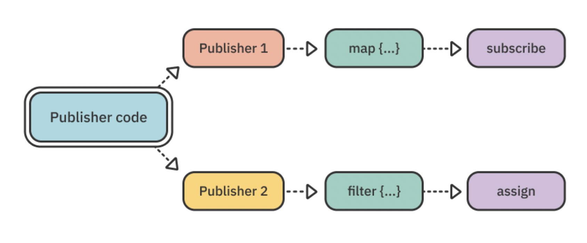

The correct way to go when creating multiple subscriptions to the same publisher is to share the original publisher using the share() operator. This wraps the publisher in a class and therefore it can safely emit to multiple subscribers without performing its underlying work again.

Still in CollageNeueModel.swift, find the line let newPhotos = selectedPhotos and replace it with:

```swift
let newPhotos = selectedPhotos.share()
```

Now, it's safe to create multiple subscriptions to newPhotos without being afraid that the publisher is performing side effects multiple times for each new subscriber:

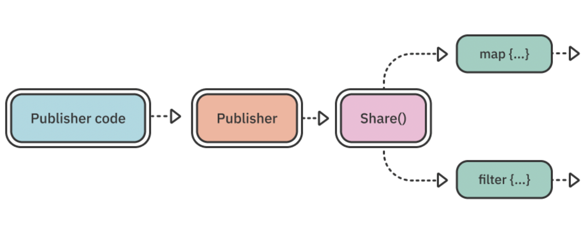

A caveat to keep in mind is that share() does not re-emit any values from the shared subscription, so you only get values that occur after you subscribe.

For example, if you have two subscriptions on a share()d publisher and the source publisher emits synchronously upon subscribing, only the first subscriber will get the value, since the second one wasn't subscribed when the value was actually emitted. If the source publisher emits asynchronously, that's less often an issue.


### Operators in practice

Now that you learned about a few useful reactive patterns, it's time to practice some of the operators you covered in previous chapters and see them in action.

Open CollageNeueModel.swift and replace the line where you share the selectedPhotos subscription let newPhotos = selectedPhotos.share() with:

```swift
let newPhotos = selectedPhotos
  .prefix(while: { [unowned self] _ in
    self.images.value.count < 6
  })
  .share()
```

You already learned about prefix(while:) as one of the powerful Combine filtering operators and here you get to use it in practice. The code above will keep the subscription to selectedPhotos alive as long as the total count of images selected is less than six. This will effectively allow the user to select up to six photos for their collage.

Adding prefix(while:) just before the call to share() allows you to filter the incoming values, not only on one subscription, but on all subscriptions that subscribe to newPhotos.

Run the app and try adding more than six photos. You will see that after the first six that the main view controller doesn't accept more.

In the same way, you can implement any logic you need by combining all the operators you already know and love like filter, dropFirst, map and so on.

And that's a wrap for this chapter! You did well and deserve a nice pat on the shoulder!


### Challenges

Congratulations on working through this tutorial-style chapter! If you'd like to work through one more optional task before moving on to more theory in the next chapter, keep reading below.

Open Utility/PHPhotoLibrary+Combine.swift and read the code that gets the Photos library authorization for the Collage Neue app from the user. You will certainly notice that the logic is quite straightforward and is based on a "standard" callback API.

This provides you with a great opportunity to wrap a Cocoa API as a future on your own. For this challenge, add a new static property to PHPhotoLibrary called isAuthorized, which is of type Future<Bool, Never> and allows other types to subscribe to the Photos library authorization status.

You've already done this a couple of times in this chapter and the existing fetchAuthorizationStatus(callback:) function should be pretty straight forward to use. Good luck! Should you experience any difficulties along the way, don't forget that you can always peak into the challenge folder provided for this chapter and have a look at the example solution.

Finally, don't forget to use the new isAuthorized publisher in PhotosView!

For bonus points, display an error message in case the user doesn't grant access to their photos and navigate back to the main view controller when they tap Close.

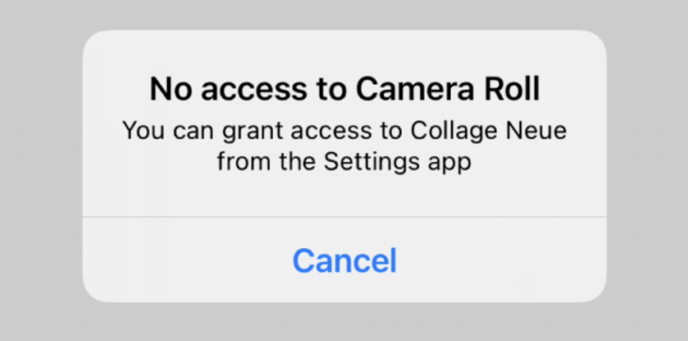

To play with different authorization states and test your code, open the Settings app on your Simulator or device and navigate to Privacy/Photos.

Change the authorization status of Collage to either "None" or "All Photos" to test how your code behaves in those states:


If you made it successfully on your own so far into the challenges, you really deserve an extra round of applause! Either way, one possible solution you can consult with at any time is provided in the challenges folder for this chapter.


### Key points

- In your day-to-day tasks, you'll most likely have to deal with callback or delegate-based APIs. Luckily, those are easily wrapped as futures or publishers by using a subject.

- Moving from various patterns like delegation and callbacks to a single Publisher/Subscriber pattern makes mundane tasks like presenting views and fetching back values a breeze.

- To avoid unwanted side-effects when subscribing a publisher multiple times, use a shared publisher via the share() operator.


### Where to go from here?

That's a wrap for Section II: "Operators" Starting with the next chapter, you will start looking more into the ways Combine integrates with the existing Foundation and UIKit/AppKit APIs.


