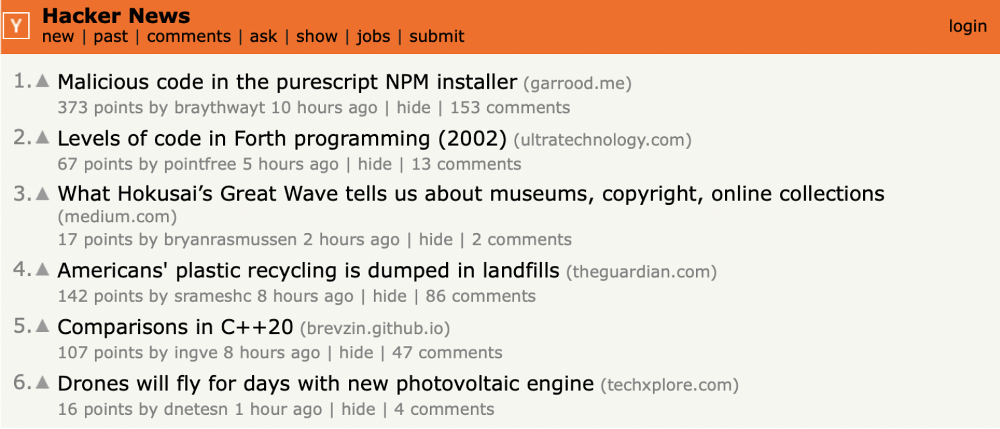
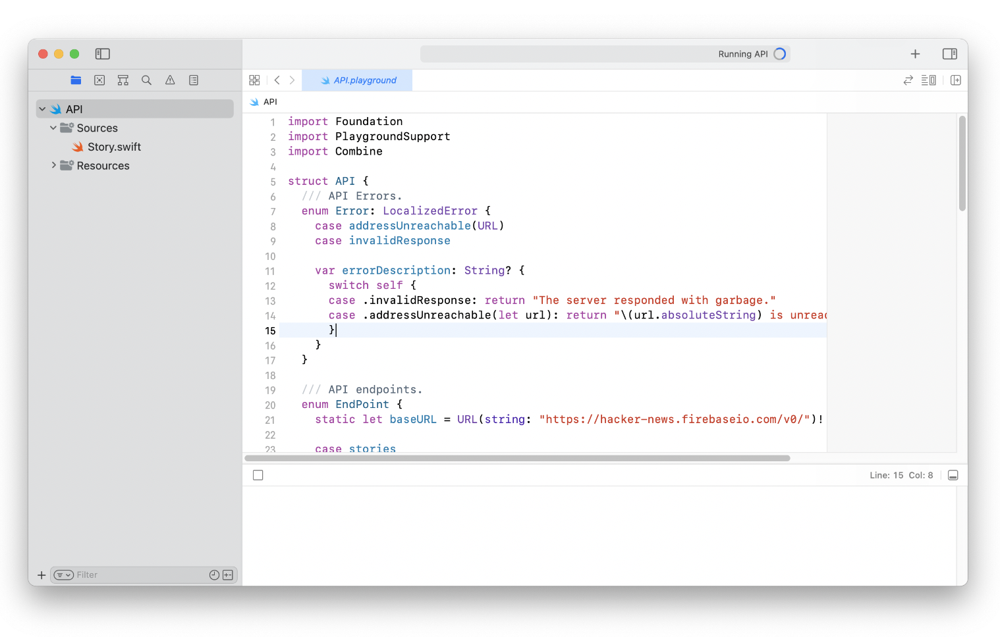
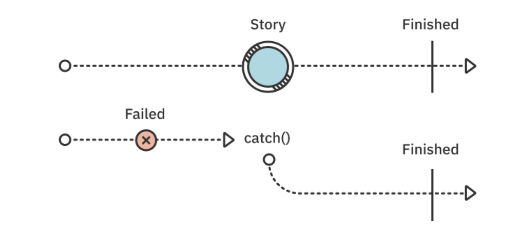
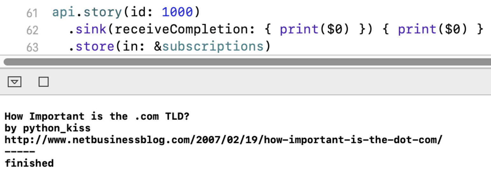
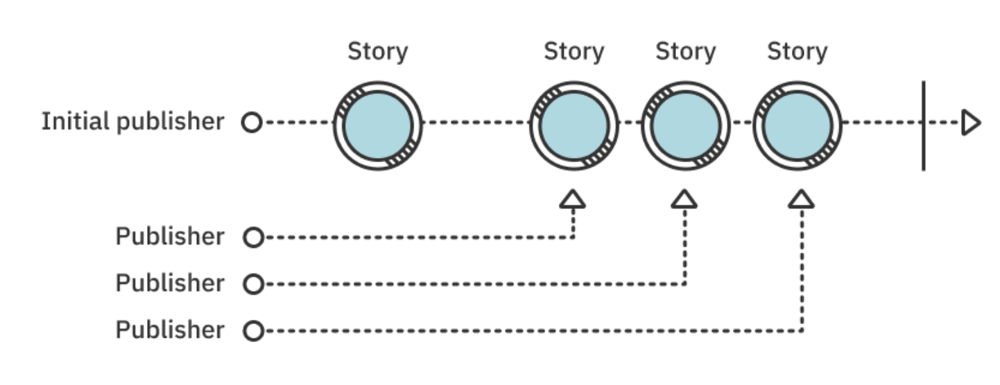
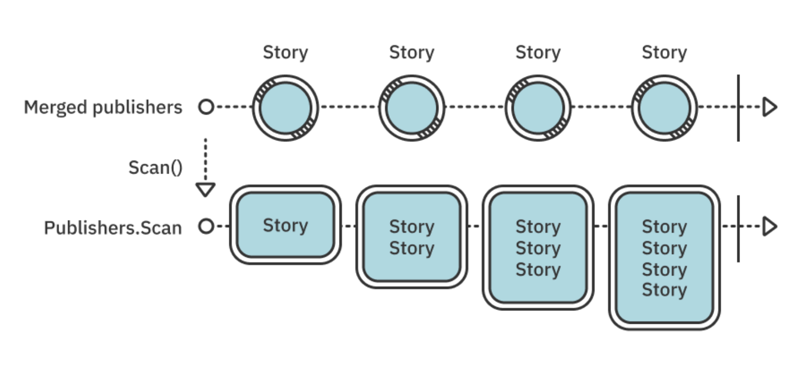
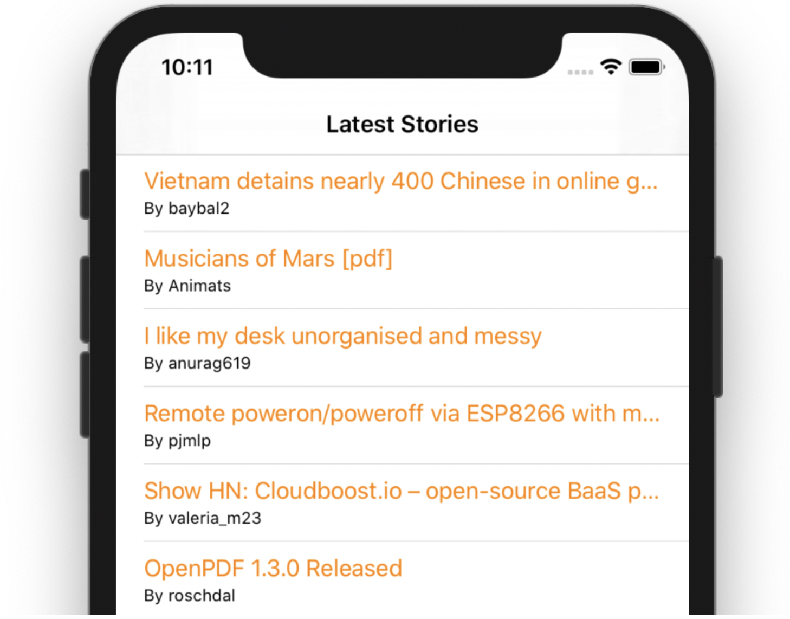

# Section III: Combine in Action

You now know most of Combine's basics. You learned how publishers, subscribers and subscriptions work and the intertwined relationship between these pieces, as well as how you can use operators to manipulate publishers and their emissions.

While theory is great and definitely useful, practical real-life knowledge is king!

This section is divided into five mini-chapters, each with its own focus on practical approaches for leveraging Combine for specific use-cases. You'll learn how to leverage Combine for networking, how to debug your combine publishers, how to use timers and observe KVO-compliant objects, as well as learn how resources work in Combine.

To wrap up this section, you'll get your hands dirty and build an entire Combine-backed network layer — how exciting!


## Chapter 9: Networking

As programmers, a lot of what we do revolves around networking. Communicating with a backend, fetching data, pushing updates, encoding and decoding JSON... this is the daily meat of the mobile developer.

Combine offers a few select APIs to help perform common tasks declaratively. These APIs revolve around two key components of modern applications:

1. Use URLSession to perform network requests.

2. Use the Codable protocol to encode and decode JSON data.


### URLSession extensions

URLSession is the standard way to perform network data transfer tasks. It offers a modern asynchronous API with powerful configuration options and fully transparent backgrounding support. It supports a variety of operations such as:

- Data transfer tasks to retrieve the content of a URL.

- Download tasks to retrieve the content of a URL and save it to a file.

- Upload tasks to upload files and data to a URL.

- Stream tasks to stream data between two parties.
- Websocket tasks to connect to websockets.

Out of these, only the first one, data transfer tasks, exposes a Combine publisher. Combine handles these tasks using a single API with two variants, taking a URLRequest or just a URL.

Here‘s a look at how you can use this API:

```swift
guard let url = URL(string: "https://mysite.com/mydata.json") else { 
  return 
}

// 1
let subscription = URLSession.shared
  // 2
  .dataTaskPublisher(for: url)
  .sink(receiveCompletion: { completion in
    // 3
    if case .failure(let err) = completion {
      print("Retrieving data failed with error \(err)")
    }
  }, receiveValue: { data, response in
    // 4
    print("Retrieved data of size \(data.count), response = \(response)")
  })
```

Here‘s what‘s happening with this code:

1. It‘s crucial that you keep the resulting subscription; otherwise, it gets immediately canceled and the request never executes.
2. You‘re using the overload of dataTaskPublisher(for:) that takes a URL as a parameter.
3. Make sure you always handle errors! Network connections are prone to failure.
4. The result is a tuple with both a Data object and a URLResponse.

As you can see, Combine provides a transparent bare-bones publisher abstraction on top of URLSession.dataTask, only exposing a publisher instead of a closure.


### Codable support

The Codable protocol is a modern, powerful and Swift-only encoding and decoding mechanism that you absolutely should know about. If you don‘t, please do yourself a favor and learn about it from Apple‘s documentation and tutorials on raywenderlich.com!

Foundation supports encoding to and decoding from JSON through JSONEncoder and JSONDecoder. You can also use PropertyListEncoder and PropertyListDecoder, but these are less useful in the context of network requests.

In the previous example, you downloaded some JSON. Of course, you could decode it with a JSONDecoder:

```swift
let subscription = URLSession.shared
  .dataTaskPublisher(for: url)
  .tryMap { data, _ in
    try JSONDecoder().decode(MyType.self, from: data)
  }
  .sink(receiveCompletion: { completion in
    if case .failure(let err) = completion {
      print("Retrieving data failed with error \(err)")
    }
  }, receiveValue: { object in
    print("Retrieved object \(object)")
  })
```

You decode the JSON inside a tryMap, which works, but Combine provides an operator to help reduce the boilerplate: decode(type:decoder:).

In the example above, replace the tryMap operator with the following lines:

```swift
.map(\.data)
.decode(type: MyType.self, decoder: JSONDecoder())
```

Unfortunately, since dataTaskPublisher(for:) emits a tuple, you can‘t directly use decode(type:decoder:) without first using a map(_:) that only emits the Data part of the result.

The only advantage is that you instantiate the JSONDecoder only once, when setting up the publisher, versus creating it every time in the tryMap(_:) closure.


### Publishing network data to multiple subscribers

Every time you subscribe to a publisher, it starts doing work. In the case of network requests, this means sending the same request multiple times if multiple subscribers need the result.

Combine, surprisingly, lacks operators to make this easy, as other frameworks have. You could use the share() operator, but that‘s tricky because you need to subscribe all your subscribers before the result comes back.

Besides using a caching mechanism, one solution is to use the multicast() operator, which creates a ConnectablePublisher that publishes values through a Subject. It allows you to subscribe multiple times to the subject, then call the publisher‘s connect() method when you‘re ready:

```swift
let url = URL(string: "https://www.raywenderlich.com")!
let publisher = URLSession.shared
// 1
  .dataTaskPublisher(for: url)
  .map(\.data)
  .multicast { PassthroughSubject<Data, URLError>() }

// 2
let subscription1 = publisher
  .sink(receiveCompletion: { completion in
    if case .failure(let err) = completion {
      print("Sink1 Retrieving data failed with error \(err)")
    }
  }, receiveValue: { object in
    print("Sink1 Retrieved object \(object)")
  })

// 3
let subscription2 = publisher
  .sink(receiveCompletion: { completion in
    if case .failure(let err) = completion {
      print("Sink2 Retrieving data failed with error \(err)")
    }
  }, receiveValue: { object in
    print("Sink2 Retrieved object \(object)")
  })

// 4
let subscription = publisher.connect()
```

In this code, you:

1. Create your DataTaskPublisher, map to its data and then multicast it. The closure you pass must return a subject of the appropriate type. Alternately, you can pass an existing subject to multicast(subject:). You‘ll learn more about multicast in Chapter 13, “Resource Management.”
2. Subscribe a first time to the publisher. Since it‘s a ConnectablePublisher it won‘t start working right away.
3. Subscribe a second time.
4. Connect the publisher, when you‘re ready. It will start working and pushing values to all of its subscribers.

With this code, you send the request one time and share the outcome with the two subscribers.

> Note: Make sure to store all of your Cancellables; otherwise, they would be deallocated and canceled when leaving the current code scope, which would be immediate in this specific case.


This process remains a bit convoluted, as Combine does not offer operators for this kind of scenario like other reactive frameworks do. In Chapter 18, “Custom Publishers & Handling Backpressure,” you‘ll explore crafting a better solution.


### Key points

- Combine offers a publisher-based abstraction for its dataTask(with:completionHandler:) method called dataTaskPublisher(for:).

- You can decode Codable-conforming models using the built-in decode operator on a publisher that emits Data values.

- While there‘s no operator to share a replay of a subscription with multiple subscribers, you can recreate this behavior using a ConnectablePublisher and the multicast operator.


### Where to go from here?

Great job on going through this chapter!

If you want to learn more about using Codable, you can check out the following resources:

- “Encoding and Decoding in Swift” at raywenderlich.com: https://www.raywenderlich.com/3418439-encoding-and-decoding-in-swift

- “Encoding and Decoding Custom Types” on Apple‘s official documentation: https://developer.apple.com/documentation/foundation/archives_and_serialization/encoding_and_decoding_custom_types


## Chapter 10: Debugging

Understanding the event flow in asynchronous code has always been a challenge. It is particularly the case in the context of Combine, as chains of operators in a publisher may not immediately emit events. For example, operators like throttle(for:scheduler:latest:) will not emit all events they receive, so you need to understand what’s going on. Combine provides a few operators to help with debugging your reactive flows. Knowing them will help you troubleshoot puzzling situations.


### Printing events

The print(_:to:) operator is the first one you should use when you’re unsure whether anything is going through your publishers. It’s a passthrough publisher which prints a lot of information about what’s happening.

Even with simple cases like this one:

```swift
let subscription = (1...3).publisher
  .print("publisher")
  .sink { _ in }
```

The output is very detailed:

```
publisher: receive subscription: (1...3)
publisher: request unlimited
publisher: receive value: (1)
publisher: receive value: (2)
publisher: receive value: (3)
publisher: receive finished
```

Here you see that the print(_:to:) operators shows a lot of information, as it:

- Prints when it receives a subscription and shows the description of its upstream publisher.

- Prints the subscriber‘s demand requests so you can see how many items are being requested.

- Prints every value the upstream publisher emits.

- Finally, prints the completion event.

There is an additional parameter that takes a TextOutputStream object. You can use this to redirect strings to print to a logger. You can also add information to the log, like the current date and time, etc. The possibilities are endless!

For example, you can create a simple logger that displays the time interval between each string so you can get a sense of how fast your publisher emits values:

```swift
class TimeLogger: TextOutputStream {
  private var previous = Date()
  private let formatter = NumberFormatter()

  init() {
    formatter.maximumFractionDigits = 5
    formatter.minimumFractionDigits = 5
  }

  func write(_ string: String) {
    let trimmed = string.trimmingCharacters(in: .whitespacesAndNewlines)
    guard !trimmed.isEmpty else { return }
    let now = Date()
    print("+\(formatter.string(for: now.timeIntervalSince(previous))!)s: \(string)")
    previous = now
  }
}
```

It’s very simple to use in your code:

```swift
let subscription = (1...3).publisher
  .print("publisher", to: TimeLogger())
  .sink { _ in }
```

And the result displays the time between each printed line:

```swift
+0.00111s: publisher: receive subscription: (1...3)
+0.03485s: publisher: request unlimited
+0.00035s: publisher: receive value: (1)
+0.00025s: publisher: receive value: (2)
+0.00027s: publisher: receive value: (3)
+0.00024s: publisher: receive finished
```

As mentioned above, the possibilities are quite endless here.

> Note: Depending on the computer and the version of Xcode you‘re running this code on, the interval printed above may vary slightly.


### Acting on events — performing side effects

Besides printing out information, it is often useful to perform actions upon specific events. We call this performing side effects, as actions you take “on the side” don’t directly impact further publishers down the stream, but can have an effect like modifying an external variable.

The handleEvents(receiveSubscription:receiveOutput:receiveCompletion:receiveCancel:receiveRequest:) (wow, what a signature!) lets you intercept any and all events in the lifecycle of a publisher and then take action at each step.

Imagine you‘re tracking an issue where a publisher must perform a network request, then emit some data. When you run it, it never receives any data. What’s happening? Is the request really working? Do you even listen to what comes back?

Consider this code:

```swift
let request = URLSession.shared
  .dataTaskPublisher(for: URL(string: "https://www.raywenderlich.com/")!)

request
  .sink(receiveCompletion: { completion in
    print("Sink received completion: \(completion)")
  }) { (data, _) in
    print("Sink received data: \(data)")
  }
```

You run it and never see anything print. Can you see the issue by looking at the code?

If not, use handleEvents to track what‘s happening. You can insert this operator between the publisher and sink:

```swift
.handleEvents(receiveSubscription: { _ in
  print("Network request will start")
}, receiveOutput: { _ in
  print("Network request data received")
}, receiveCancel: {
  print("Network request cancelled")
})
```

Then, run the code again. This time you see some debugging output:

```
Network request will start
Network request cancelled
```

There! You found it: You forgot to keep the Cancellable around. So, the subscription starts but gets canceled immediately. Now, you can fix your code by retaining the Cancellable:

```swift
let subscription = request
  .handleEvents...
```

Then, running your code again, you‘ll now see it behaving correctly:

```
Network request will start
Network request data received
Sink received data: 303094 bytes
Sink received completion: finished
```


### Using the debugger as a last resort

The last resort operator is one you pull in situations where you really need to introspect things at certain times in the debugger, because nothing else helped you figure out what’s wrong.

The first simple operator is breakpointOnError(). As the name suggests, when you use this operator, if any of the upstream publishers emits an error, Xcode will break in the debugger to let you look at the stack and, hopefully, find why and where your publisher errors out.

A more complete variant is breakpoint(receiveSubscription:receiveOutput:receiveCompletion:). It allows you to intercept all events and decide on a case-by-case basis whether you want to pause the debugger.

For example, you could break only if certain values pass through the publisher:

```swift
.breakpoint(receiveOutput: { value in
  return value > 10 && value < 15
})
```

Assuming the upstream publisher emits integer values, but values 11 to 14 should never happen, you can configure breakpoint to break only in this case and let you investigate! You can also conditionally break subscription and completion times, but cannot intercept cancelations like the handleEvents operator.

> Note: None of the breakpoint publishers will work in Xcode playgrounds. You will see an error stating that execution was interrupted, but it won‘t drop into the debugger since playgrounds generally don't support breakpoint debugging.


### Key points

- Track the lifecycle of a publisher with the print operator,

- Create your own TextOutputStream to customize the output strings,

- Use the handleEvents operator to intercept lifecycle events and perform actions,

- Use the breakpointOnError and breakpoint operators to break on specific events.


### Where to go from here?

You found out how to track what your publishers are doing, now it’s time... for timers! Move on to the next chapter to learn how to trigger events at regular intervals with Combine.


## Chapter 11: Timers

Repeating and non-repeating timers are always useful when coding. Besides executing code asynchronously, you often need to control when and how often a task should repeat.

Before the Dispatch framework was available, developers relied on RunLoop to asynchronously perform tasks and implement concurrency. You could use Timer to create repeating and non-repeating timers. Then, Apple released the Dispatch framework, including DispatchSourceTimer.

Although all of the above are capable of creating timers, not all timers are equal in Combine. Read on!


### Using RunLoop

The main thread and any thread you create, preferably using the Thread class, can have its own RunLoop. Just invoke RunLoop.current from the current thread: Foundation would create one for you if needed. Beware, unless you understand how run loops operate — in particular, that you need a loop that runs the run loop — you’ll be better off simply using the main RunLoop that runs the main thread of your application.

> Note: One important note and a red light warning in Apple’s documentation is that the RunLoop class is not thread-safe. You should only call RunLoop methods for the run loop of the current thread.

RunLoop implements the Scheduler protocol you’ll learn about in Chapter 17, “Schedulers.” It defines several methods which are relatively low-level, and the only one that lets you create cancellable timers:

```swift
let runLoop = RunLoop.main

let subscription = runLoop.schedule(
  after: runLoop.now,
  interval: .seconds(1),
  tolerance: .milliseconds(100)
) {
  print("Timer fired")
}
```

This timer does not pass any value and does not create a publisher. It starts at the date specified in the after: parameter with the specified interval and tolerance, and that’s about it. Its only usefulness in relation to Combine is that the Cancellable it returns lets you stop the timer after a while.

An example of this could be:

```swift
runLoop.schedule(after: .init(Date(timeIntervalSinceNow: 3.0))) {
  subscription.cancel()
}
```

But all things considered, RunLoop is not the best way to create a timer. You’ll be better off using the Timer class!


### Using the Timer class

Timer is the oldest timer that was available in the original Mac OS X, long before Apple renamed it “macOS.” It has always been tricky to use because of its delegation pattern and tight relationship with RunLoop. Combine brings a modern variant you can directly use as a publisher without all the setup boilerplate.

You can create a repeating timer publisher this way:

```swift
let publisher = Timer.publish(every: 1.0, on: .main, in: .common)
```

The two parameters on and in determine:

- On which RunLoop your timer attaches to. Here, the main thread‘s RunLoop.

- In which run loop mode(s) the timer runs. Here, the default run loop mode.

Unless you understand how a run loop operates, you should stick with these default values. Run loops are the basic mechanism for asynchronous event source processing in macOS, but their API is a bit cumbersome. You can get a RunLoop for any Thread that you create yourself or obtain from Foundation by calling RunLoop.current, so you could write the following as well:

```swift
let publisher = Timer.publish(every: 1.0, on: .current, in: .common)
```

> Note: Running this code on a Dispatch queue other than DispatchQueue.main may lead to unpredictable results. The Dispatch framework manages its threads without using run loops. Since a run loop requires one of its run methods to be called to process events, you would never see the timer fire on any queue other than the main one. Stay safe and target RunLoop.main for your Timers.

The publisher the timer returns is a ConnectablePublisher. It’s a special variant of Publisher that won’t start firing upon subscription until you explicitly call its connect() method. You can also use the autoconnect() operator which automatically connects when the first subscriber subscribes.

Note: You‘ll learn more about connectable publishers in Chapter 13, “Resource Management.”

Therefore, the best way to create a publisher that will start a timer upon subscription is to write:

```swift
let publisher = Timer
  .publish(every: 1.0, on: .main, in: .common)
  .autoconnect()
```

The timer repeatedly emits the current date, its Publisher.Output type being a Date. You can make a timer that emits increasing values by using the scan operator:

```swift
let subscription = Timer
  .publish(every: 1.0, on: .main, in: .common)
  .autoconnect()
  .scan(0) { counter, _ in counter + 1 }
  .sink { counter in
    print("Counter is \(counter)")
  }
```

There is an additional Timer.publish() parameter you didn’t see here: tolerance. It specifies the acceptable deviation from the duration you asked for, as a TimeInterval. But note that using a value lower than your RunLoop’s minimumTolerance value may not produce the expected results.


Using DispatchQueue

You can use a dispatch queue to generate timer events. While the Dispatch framework has a DispatchTimerSource event source, Combine surprisingly doesn’t provide a timer interface to it. Instead, you’re going to use an alternative method to generate timer events in your queue. This can be a bit convoluted, though:

```swift
let queue = DispatchQueue.main

// 1
let source = PassthroughSubject<Int, Never>()

// 2
var counter = 0

// 3
let cancellable = queue.schedule(
  after: queue.now,
  interval: .seconds(1)
) {
  source.send(counter)
  counter += 1
}

// 4
let subscription = source.sink {
  print("Timer emitted \($0)")
}
```

In the previous code, you:

1. Create a Subject you will send timer values to.
2. Prepare a counter. You‘ll increment it every time the timer fires.
3. Schedule a repeating action on the selected queue every second. The action starts immediately.
4. Subscribe to the subject to get the timer values.

As you can see, this is not pretty. It would help to move this code to a function and pass both the interval and the start time.


### Key points

- Create timers using good old RunLoop class if you have Objective-C code nostalgia.

- Use Timer.publish to obtain a publisher which generates values at given intervals on the specified RunLoop.

- Use DispatchQueue.schedule for modern timers emitting events on a dispatch queue.


### Where to go from here?

In Chapter 18, “Custom Publishers & Handling Backpressure,” you’ll learn how to write your own publishers, and you’ll create an alternative timer publisher using DispatchSourceTimer.

But don’t hurry! There is plenty to learn before that, starting with Key-Value Observing in the next chapter.


## Chapter 12: Key-Value Observing

Dealing with change is at the core of Combine. Publishers let you subscribe to them to handle asynchronous events. In earlier chapters, you learned about `assign(to:on:)` which enables you to update the value of an object‘s property every time a publisher emits a new value.

But, what about a mechanism to observe changes to single variables?

Combine ships with a few options around this:

- It provides a publisher for any property of an object that is KVO (Key-Value Observing)-compliant.

- The ObservableObject protocol handles cases where multiple variables could change.


### Introducing publisher(for:options:)

KVO has always been an essential component of Objective-C. A large number of properties from Foundation, UIKit and AppKit classes are KVO-compliant. Therefore, you can observe their changes using the KVO machinery.

It’s easy to observe KVO-compliant properties. Here is an example using an OperationQueue (a class from Foundation):

```swift
let queue = OperationQueue()

let subscription = queue.publisher(for: \.operationCount)
  .sink {
    print("Outstanding operations in queue: \($0)")
  }
```

Every time you add a new operation to the queue, its operationCount increments, and your sink receives the new count. When the queue has consumed an operation, the count decrements and again, your sink receives the updated count.

There are many other framework classes exposing KVO-compliant properties. Just use publisher(for:) with a key path to a KVO-compliant property, and voilà! You get a publisher capable of emitting value changes. You’ll learn more about this and available options later in this chapter.

> Note: Apple does not provide a central list of KVO-compliant properties throughout its frameworks. The documentation for each class usually indicates which properties are KVO-compliant. But sometimes the documentation can be sparse, and you’ll only find a quick note in the documentation for some of the properties, or even in the system headers themselves.


### Preparing and subscribing to your own KVO-compliant properties

You can also use Key-Value Observing in your own code, provided that:

1. Your objects are classes (not structs) and conform to NSObject,

2. You mark the properties to make observable with the @objc dynamic attributes.

Once you have done this, the objects and properties you marked become KVO-compliant and can be observed with Combine!

> Note: While the Swift language doesn’t directly support KVO, marking your properties @objc dynamic forces the compiler to generate hidden methods that trigger the KVO machinery. Describing this machinery is out of the scope of this book. Suffice to say the machinery heavily relies on specific methods from the NSObject protocol, which explains why your objects need to conform to it.

Try an example in a playground:

```swift
// 1
class TestObject: NSObject {
  // 2
  @objc dynamic var integerProperty: Int = 0
}

let obj = TestObject()

// 3
let subscription = obj.publisher(for: \.integerProperty)
  .sink {
    print("integerProperty changes to \($0)")
  }

// 4
obj.integerProperty = 100
obj.integerProperty = 200
```

In the above code, you:

1. Create a class that conforms to the NSObject protocol. This is required for KVO.

2. Mark any property you want to make observable as @objc dynamic.

3. Create and subscribe to a publisher observing the integerProperty property of obj.

4. Update the property a couple times.

When running this code in a playground, can you guess what the debug console displays?

You may be surprised, but here is the display you obtain:

```
integerProperty changes to 0
integerProperty changes to 100
integerProperty changes to 200
```

You first get the initial value of integerProperty, which is 0, then you receive the two changes. You can avoid this initial value if you‘re not interested in it — read on to find out how!

Did you notice that in TestObject you are using a plain Swift type (Int) and that KVO, which is an Objective-C feature, still works? KVO will work fine with any Objective-C type and with any Swift type bridged to Objective-C. This includes all the native Swift types as well as arrays and dictionaries, provided their values are all bridgeable to Objective-C.

Try it! Add a couple more properties to TestObject:

```swift
@objc dynamic var stringProperty: String = ""
@objc dynamic var arrayProperty: [Float] = []
```

As well as subscriptions to their publishers:

```swift
let subscription2 = obj.publisher(for: \.stringProperty)
  .sink {
    print("stringProperty changes to \($0)")
  }

let subscription3 = obj.publisher(for: \.arrayProperty)
  .sink {
    print("arrayProperty changes to \($0)")
  }
```

And finally, some property changes:

```
obj.stringProperty = "Hello"
obj.arrayProperty = [1.0]
obj.stringProperty = "World"
obj.arrayProperty = [1.0, 2.0]
```

You‘ll see both initial values and changes appear in your debug area. Nice!

If you ever use a pure-Swift type that isn‘t bridged to Objective-C though, you‘ll start running into trouble:

```swift
struct PureSwift {
  let a: (Int, Bool)
}
```

Then, add a property to TestObject:

```swift
@objc dynamic var structProperty: PureSwift = .init(a: (0,false))
```

You‘ll immediately see an error in Xcode, stating that “Property cannot be marked @objc because its type cannot be represented in Objective-C.” Here, you reached the limits of Key-Value Observing.

> Note: Be careful when observing changes to system frameworks objects. Make sure the documentation mentions the property is observable because you can‘t have a clue by just looking at a system object‘s property list. This is true for Foundation, UIKit, AppKit, etc. Historically, properties had to be made “KVO-aware” to be observable.


### Observation options

The full signature of the method you are calling to observe changes is publisher(for:options:). The options parameter is an option set with four values: .initial, .prior, .old and .new. The default is [.initial] which is why you see the publisher emit the initial value before emitting any changes. Here is a breakdown of the options:

- .initial emits the initial value.

- .prior emits both the previous and the new value when a change occurs.

- .old and .new are unused in this publisher, they both do nothing (just let the new value through).

If you don‘t want the initial value, you can simply write:

```swift
obj.publisher(for: \.stringProperty, options: [])
```

If you specify .prior, you‘ll get two separate values every time a change occurs. Modifying the integerProperty example:

```swift
let subscription = obj.publisher(for: \.integerProperty, options: [.prior])
```

You would now see the following in the debug console for the integerProperty subscription:

```
integerProperty changes to 0
integerProperty changes to 100
integerProperty changes to 100
integerProperty changes to 200
```

The property first changes from 0 to 100, so you get two values: 0 and 100. Then, it changes from 100 to 200 so you again get two values: 100 and 200.


### ObservableObject

Combine‘s ObservableObject protocol works on Swift objects, not just on objects deriving from NSObject. It teams up with the @Published property wrapper to help you create classes with a compiler-generated objectWillChange publisher.

It saves you from writing a lot of boilerplate and allows creating objects which self-monitor their own properties and notify when any of them will change.

Here is an example:

```swift
class MonitorObject: ObservableObject {
  @Published var someProperty = false
  @Published var someOtherProperty = ""
}

let object = MonitorObject()
let subscription = object.objectWillChange.sink {
  print("object will change")
}
object.someProperty = true
object.someOtherProperty = "Hello world"
```


The ObservableObject protocol conformance makes the compiler automatically generate the objectWillChange property. It‘s an ObservableObjectPublisher which emits Void items and Never fails.

You‘ll get objectWillChange firing every time one of the object‘s @Published variables change. Unfortunately, you can‘t know which property actually changed. This is designed to work very well with SwiftUI which coalesces events to streamline screen updates.


### Key points

- Key-Value Observing mostly relies on the Objective-C runtime and methods of the NSObject protocol.

- Many Objective-C classes in Apple frameworks offer some KVO-compliant properties.

- You can make your own properties observable, provided they are classes conforming to NSObject, and marked with the @objc dynamic attributes.

- You can also conform to ObservableObject and use @Published for your properties. The compiler-generated objectWillChange publisher triggers every time one of the @Published properties changes (but doesn’t tell you which one changed).


### Where to go from here?

Observing is a lot of fun, but sharing is caring! Keep reading to learn about Resources in Combine, and how you can save them by sharing them!


## Chapter 13: Resource Management

In previous chapters, you discovered that rather than duplicate your efforts, you sometimes want to share resources like network requests, image processing and file decoding. Anything resource-intensive that you can avoid repeating multiple times is worth looking into. In other words, you should share the outcome of a single resource – the values a publisher’s work produces – between multiple subscribers rather than duplicate that outcome.

Combine offers two operators for you to manage resources: The share() operator and the multicast(_:) operator.


### The share() operator

The purpose of this operator is to let you obtain a publisher by reference rather than by value. Publishers are usually structs: When you pass a publisher to a function or store it in several properties, Swift copies it several times. When you subscribe to each of the copies, the publisher can only do one thing: Start the work it’s designed to do and deliver the values.

The share() operator returns an instance of the Publishers.Share class. Often, publishers are implemented as structs, but in share()s case, as mentioned before, the operator obtains a reference to the Share publisher instead of using value semantics, which allows it to share the underlying publisher.

This new publisher “shares” the upstream publisher. It will subscribe to the upstream publisher once, with the first incoming subscriber. It will then relay the values it receives from the upstream publisher to this subscriber and to all those that subscribe after it.

> Note: New subscribers will only receive values the upstream publisher emits after they subscribe. There’s no buffering or replay involved. If a subscriber subscribes to a shared publisher after the upstream publisher has completed, that new subscriber only receives the completion event.


To put this concept into practice, imagine you’re performing a network request, like you learned how to do in Chapter 9, “Networking.” You want multiple subscribers to receive the result without requesting multiple times. Your code would look something like this:

```swift
let shared = URLSession.shared
  .dataTaskPublisher(for: URL(string: "https://www.raywenderlich.com")!)
  .map(\.data)
  .print("shared")
  .share()

print("subscribing first")

let subscription1 = shared.sink(
  receiveCompletion: { _ in },
  receiveValue: { print("subscription1 received: '\($0)'") }
)

print("subscribing second")

let subscription2 = shared.sink(
  receiveCompletion: { _ in },
  receiveValue: { print("subscription2 received: '\($0)'") }
)
```

The first subscriber triggers the “work” (in this case, performing the network request) of share()’s upstream publisher. The second subscriber will simply “connect” to it and receive values at the same time as the first.

Running this code in a playground, you’d see an output similar to:

```
subscribing first
shared: receive subscription: (DataTaskPublisher)
shared: request unlimited
subscribing second
shared: receive value: (303425 bytes)
subscription1 received: '303425 bytes'
subscription2 received: '303425 bytes'
shared: receive finished
```

Using the print(_:to:) operator‘s output, you can see that:

- The first subscription triggers a subscription to the DataTaskPublisher.

- The second subscription doesn’t change anything: The publisher keeps running. No second request goes out.

- When the request completes, the publisher emits the resulting data to both subscribers then completes.

To verify that the request is only sent once, you could comment out the share() line and the output would look similar to this:

```
subscribing first
shared: receive subscription: (DataTaskPublisher)
shared: request unlimited
subscribing second
shared: receive subscription: (DataTaskPublisher)
shared: request unlimited
shared: receive value: (303425 bytes)
subscription1 received: '303425 bytes'
shared: receive finished
shared: receive value: (303425 bytes)
subscription2 received: '303425 bytes'
shared: receive finished
```

You can clearly see that when the DataTaskPublisher is not shared, it receives two subscriptions! And in this case, the request runs twice, once for each subscription.

But there’s a problem: What if the second subscriber comes after the shared request has completed? You could simulate this case by delaying the second subscription.

Don’t forget to uncomment share() if you’re following along in a playground. Then, replace the subscription2 code with the following:

```swift
var subscription2: AnyCancellable? = nil

DispatchQueue.main.asyncAfter(deadline: .now() + 5) {
  print("subscribing second")

  subscription2 = shared.sink(
    receiveCompletion: { print("subscription2 completion \($0)") },
    receiveValue: { print("subscription2 received: '\($0)'") }
  )
}
```

Running this, you’d see that subscription2 receives nothing if the delay is longer than the time it takes for the request to complete:

```
subscribing first
shared: receive subscription: (DataTaskPublisher)
shared: request unlimited
subscribing second
shared: receive value: (303425 bytes)
subscription1 received: '303425 bytes'
shared: receive finished
subscribing second
subscription2 completion finished
```

By the time subscription2 is created, the request has already completed and the resulting data has been emitted. How can you make sure both subscriptions receive the request result?


### The multicast(_:) operator

To share a single subscription to a publisher and replay the values to new subscribers even after the upstream publisher has completed, you need something like a shareReplay() operator. Unfortunately, this operator is not part of Combine. However, you’ll learn how to create one in Chapter 18, “Custom Publishers & Handling Backpressure.”

In Chapter 9, “Networking,” you used multicast(_:). This operator builds on share() and uses a Subject of your choice to publish values to subscribers. The unique characteristic of multicast(_:) is that the publisher it returns is a ConnectablePublisher. What this means is it won’t subscribe to the upstream publisher until you call its connect() method. This leaves you ample time to set up all the subscribers you need before letting it connect to the upstream publisher and start the work.

To adjust the previous example to use multicast(_:) you could write:

```swift
// 1
let subject = PassthroughSubject<Data, URLError>()

// 2
let multicasted = URLSession.shared
  .dataTaskPublisher(for: URL(string: "https://www.raywenderlich.com")!)
  .map(\.data)
  .print("multicast")
  .multicast(subject: subject)

// 3
let subscription1 = multicasted
  .sink(
    receiveCompletion: { _ in },
    receiveValue: { print("subscription1 received: '\($0)'") }
  )

let subscription2 = multicasted
  .sink(
    receiveCompletion: { _ in },
    receiveValue: { print("subscription2 received: '\($0)'") }
  )

// 4
let cancellable = multicasted.connect()
```

Here’s what this code does:

1. Prepares a subject, which relays the values and completion event the upstream publisher emits.

2. Prepares the multicasted publisher, using the above subject.

3. Subscribes to the shared — i.e., multicasted — publisher, like earlier in this chapter.

4. Instructs the publisher to connect to the upstream publisher.

This effectively starts the work, but only after you’ve had time to set up all your subscriptions. This way, you make sure no subscriber will miss the downloaded data.

The resulting output, if you run this in a playground, would be:

```
multicast: receive subscription: (DataTaskPublisher)
multicast: request unlimited
multicast: receive value: (303425 bytes)
subscription1 received: '303425 bytes'
subscription2 received: '303425 bytes'
multicast: receive finished
```

Note: A multicast publisher, like all ConnectablePublishers, also provides an autoconnect() method, which makes it work like share(): The first time you subscribe to it, it connects to the upstream publisher and starts the work immediately. This is useful in scenarios where the upstream publisher emits a single value and you can use a CurrentValueSubject to share it with subscribers.


Sharing subscription work, in particular for resource-heavy processes such as networking, is a must for most modern apps. Not keeping an eye on this could result not only in memory issues, but also possibly bombarding your server with a ton of unnecessary network requests.


### Future

While share() and multicast(_:) give you full-blown publishers, Combine comes with one more way to let you share the result of a computation: Future, which you learned about in Chapter 2, “Publishers & Subscribers.”

You create a Future by handing it a closure which receives a Promise argument. You further fulfill the promise whenever you have a result available, either successful or failed. Look at an example to refresh your memory:

```swift
// 1
func performSomeWork() throws -> Int {
  print("Performing some work and returning a result")
  return 5
}

// 2
let future = Future<Int, Error> { fulfill in
  do {
    let result = try performSomeWork()
    // 3
    fulfill(.success(result))
  } catch {
    // 4
    fulfill(.failure(error))
  }
}

print("Subscribing to future...")

// 5
let subscription1 = future
  .sink(
    receiveCompletion: { _ in print("subscription1 completed") },
    receiveValue: { print("subscription1 received: '\($0)'") }
  )

// 6
let subscription2 = future
  .sink(
    receiveCompletion: { _ in print("subscription2 completed") },
    receiveValue: { print("subscription2 received: '\($0)'") }
  )
```

This code:

1. Provides a function simulating work (possibly asynchronous) performed by the Future.

2. Creates a new Future. Note that the work starts immediately without waiting for subscribers.

3. In case the work succeeds, it fulfills the Promise with the result.

4. If the work fails, it passes the error to the Promise.

5. Subscribes once to show that we receive the result.

6. Subscribes a second time to show that we receive the result too without performing the work twice.

What’s interesting from a resource perspective is that:

- Future is a class, not a struct.

- Upon creation, it immediately invokes your closure to start computing the result and fulfill the promise as soon as possible.

It stores the result of the fulfilled Promise and delivers it to current and future subscribers.

In practice, it means that Future is a convenient way to immediately start performing some work (without waiting for subscriptions) while performing work only once and delivering the result to any amount of subscribers. But it performs work and returns a single result, not a stream of results, so the use cases are narrower than full-blown publishers.

It‘s a good candidate to use for when you need to share the single result a network request produces!


Note: Even if you never subscribe to a Future, creating it will call your closure and perform the work. You cannot rely on Deferred to defer closure execution until a subscriber comes in, because Deferred is a struct and would cause a new Future to be created every time there is a new subscriber!


### Key points

- Sharing subscription work is critical when dealing with resource-heavy processes, such as networking.

- Use share() when you simply need to share a publisher with multiple subscribers.

- Use multicast(_:) when you need fine control over when the upstream publisher starts to work and how values propagate to subscribers.

- Use Future to share the single result of a computation to multiple subscribers.


### Where to go from here?

Congratulations for finishing the last theoretical mini-chapter for this section!

You‘ll wrap up this section by working on a hands-on project, where you’ll build a API client to interact with the Hacker News API. Time to move along!


## Chapter 14: In Practice: Project "News"

In the past few chapters, you learned about quite a few practical applications of the Combine integration in Foundation types. You learned how to use URLSession‘s data task publisher to make network calls, you saw how to observe KVO-compatible objects with Combine and more.

In this chapter, you will combine your solid knowledge about operators with some of the Foundation integrations you just discovered and will work through a series of tasks like in the previous “In Practice” chapter. This time around, you will work on building a Hacker News API client.

“Hacker News,” whose API you are going to be using in this chapter, is a social news website focused on computers and entrepreneurship. If you haven‘t already, you can check them out at: https://news.ycombinator.com.



In this chapter, you will work in an Xcode playground focusing only on the API client itself.

“In Chapter 15, “In Practice: Combine & SwiftUI,” you will take the completed API and use it to build a real Hacker News reader app by plugging the network layer into a SwiftUI-based user interface. Along the way, you will learn the basics of SwiftUI and how to make your Combine code work with the new declarative Apple framework for building amazing, reactive app UIs.

Without further ado, let‘s get started!


### Getting started with the Hacker News API

Open the included starter playground API.playground in projects/starter and peek inside. You will find some simple starter code included to help you hit the ground running and let you focus on Combine code only:




Inside the API type, you will find two nested helper types:

- An enum called Error which features two custom errors your API will throw in case it cannot reach the server or it cannot decode the server response.

- A second enum called EndPoint which contains the URLs of the two API endpoints your type is going to be connecting to.

Further down, you will find the maxStories property. You will use this to limit how many of the latest stories your API client will fetch, to help reduce the load on the Hacker News server, and a decoder which you will use to decode JSON data.

Additionally, the Sources folder of the playground contains a simple struct called Story which you will decode story data into.

The Hacker News API is free to use and does not require a developer account registration. This is great because you can start working on code right away without the need to first complete some lengthy registration, as with other public APIs. The Hacker News team wins a ton of karma points!


### Getting a single story

Your first task is to add a method to API which will contact the server using the EndPoint type to get the correct endpoint URL and will fetch the data about a single story. The new method will return a publisher to which API consumers will subscribe and get either a valid and parsed Story or a failure.

Scroll down the playground source code and find the comment saying // Add your API code here. Just below that line, insert a new method declaration:

```swift
func story(id: Int) -> AnyPublisher<Story, Error> {
  return Empty().eraseToAnyPublisher()
}
```

To avoid compilation errors in your playground, you return an Empty publisher which completes immediately. As you‘ll finish building the method body, you‘ll remove the expression and return your new subscription, instead.

As mentioned, this publisher‘s output is a Story and its failure is the custom API.Error type. As you will see later on, in case there are network errors or other mishaps, you will need to convert those into one of the API.Error cases to match the expected return type.

Start modeling the subscription by creating a network request to the single-story endpoint of the Hacker News API. Inside the new method, above the return statement, insert:

```swift
URLSession.shared
  .dataTaskPublisher(for: EndPoint.story(id).url)
```

You start by making a request to Endpoint.story(id).url. The url property of the endpoint contains the complete HTTP URL to request. The single story URL looks like this (with a matching ID): https://hacker-news.firebaseio.com/v0/item/12345.json (Visit https://bit.ly/2nL2ojS if you'd like to preview the API response.)

Next, to parse JSON on a background thread and keep the rest of the app responsive, let‘s create a new custom dispatch queue. Add a new property to API above the story(id:) method like so:

```swift
private let apiQueue = DispatchQueue(label: "API",
                                     qos: .default,
                                     attributes: .concurrent)
```

You will use this queue to process JSON responses and, therefore, you need to switch your network subscription to that queue. Back in story(id:), add the line below calling dataTaskPublisher(for:):

```swift
.receive(on: apiQueue)
```

Once you‘ve switched to the background queue, you need to fetch the JSON data out of the response. The dataTaskPublisher(for:) publisher returns an output of type (Data, URLResponse) as a tuple but for your subscription, you need only the data.

Add another line to the method to map the current output to only the data from the resulting tuple:

```swift
.map(\.data)
```

The output type of this operator is Data, which you can feed to a decode operator and try converting the response to a Story.

Append to the subscription:

```swift
.decode(type: Story.self, decoder: decoder)
```

In case it receives anything but a valid story JSON, decode(...) will throw an error and the publisher will complete with a failure.

You will learn about error handling in detail in Chapter 16, “Error Handling.” In the current chapter, you will use few operators and get a taste of a few different ways to handle errors but you will not go into the nitty-gritty of how things work.

For the current story(id:) method, you will return an empty publisher in case things go south for any reason. This is easy to do by using the catch operator. Add to the subscription:

```swift
.catch { _ in Empty<Story, Error>() }
```

You ignore the thrown error and return Empty(). This, as you hopefully still remember, is a publisher that completes immediately without emitting any output values like so:




Handling the upstream errors this way via catch(_) allows you to:

- Emit the value and complete if you get back a Story.

- Return an Empty publisher which completes successfully without emitting any values, in case of a failure.

Next, to wrap up the method code and return your neatly designed publisher, you need to replace the current subscription at the end. Add:

```swift
.eraseToAnyPublisher()
```

You can now remove the temporary Empty you‘ve added before. Find the following line and remove it:

```swift
return Empty().eraseToAnyPublisher()
```

Your code should now compile with no issues, but just to make sure you haven‘t missed a step in all the excitement, review your progress so far and make sure your completed code looks like this:

```swift
func story(id: Int) -> AnyPublisher<Story, Error> {
  URLSession.shared
    .dataTaskPublisher(for: EndPoint.story(id).url)
    .receive(on: apiQueue)
    .map(\.data)
    .decode(type: Story.self, decoder: decoder)
    .catch { _ in Empty<Story, Error>() }
    .eraseToAnyPublisher()
}
```

Even though your code compiles, this method still won‘t produce any output just yet. You‘re about to take care of that next.

Now you can instantiate API and try calling into the Hacker News server.

Scroll down just a bit and find the comment line // Call the API here. This is a good spot to make a test API call. Insert the following code:

```swift
let api = API()
var subscriptions = [AnyCancellable]()
api.story(id: 1000)
   .sink(receiveCompletion: { print($0) },
         receiveValue: { print($0) })
   .store(in: &subscriptions)
```

You create a new publisher by calling api.story(id: 1000) and subscribe to it via sink(...) which prints any output values or completion event. To keep the subscription alive until the request has completed you store it in subscriptions.

As soon as the playground runs again, it will make a network call to hacker-news.firebaseio.com and print the result in the console:



The returned JSON data from the server is a rather simple structure like this:

```
{
  "by":"python_kiss",
  "descendants":0,
  "id":1000,
  "score":4,
  "time":1172394646,
  "title":"How Important is the .com TLD?",
  "type":"story",
  "url":"http://www.netbusinessblog.com/2007/02/19/how-important-is-the-dot-com/"
}
```

The Codable conformance of Story parses and stores the values of the following properties: by, id, time, title and url.

Once the request completes successfully, you‘ll see the following output, or a similar output in case you changed the 1000 value in the request, in the console:

```
How Important is the .com TLD?
by python_kiss

http://www.netbusinessblog.com/2007/02/19/how-important-is-the-dot-com/
-----

finished
```

The Story type conforms to CustomDebugStringConvertible and it has a custom debugDescription that returns the title, author name and story URL neatly ordered, like above.

The output ends with a finished completion event. To try what happens in case of an error, replace the id 1000 with -5 and check the output in the console. You will only see finished printed because you caught the error and returned Empty().

Nice work! The first method of the API type is complete and you exercised some of the concepts you covered in previous chapters like calling the network and decoding JSON. Additionally you got a gentle introduction to basic dispatch queue switching and some easy error handling. You will cover these in more detail in future chapters.

Despite what an incredibly nice exercise this task was, you‘re probably hungry for more. So, in the next section, you will dig deeper and lay some serious code down.


### Multiple stories via merging publishers

Getting a single story out of the API server was a relatively straight forward task. Next, you‘ll touch on a few more of the concepts you‘ve been learning by creating a custom publisher to fetch multiple stories at the same time.

The new method mergedStories(ids:) will get a story publisher for each of the given story ids and merge them all together. Add this new method declaration to the API type after the story(id:) method you implemented earlier:

```swift
func mergedStories(ids storyIDs: [Int]) -> AnyPublisher<Story, Error> {

}
```

What this method will essentially do is call story(id:) for each of the given ids and then flatten the result into a single stream of output values.

First of all, to reduce the number of network calls during development, you will fetch only the first maxStories ids from the provided list. Start the new method by inserting the following code:

```swift
let storyIDs = Array(storyIDs.prefix(maxStories))
```

To get started, create the first publisher:

```swift
precondition(!storyIDs.isEmpty)

let initialPublisher = story(id: storyIDs[0])
let remainder = Array(storyIDs.dropFirst())
```

By using story(id:), you create the initialPublisher publisher that fetches the story with the first id in the list.

Next, you will use reduce(_:_:) from the Swift standard library on the remaining story ids to merge each next story publisher into the initial publisher like so:



To reduce the rest of the stories into the initial publisher add:

```swift
return remainder.reduce(initialPublisher) { combined, id in

}
```

reduce(_:_:) will start with the initial publisher and provide each of the ids in the remainder array to the closure to process. Insert this code to create a new publisher for the given story id in the empty closure, and merge it to the current combined result:

```swift
return combined
  .merge(with: story(id: id))
  .eraseToAnyPublisher()
```

The final result is a publisher which emits each successfully fetched story and ignores any errors that each of the single-story publishers might encounter.


Note: Congratulations, you just created a custom implementation of the MergeMany publisher. Working through the code yourself was not in vain though. You learned about operator composition and how to apply operators like merge and reduce in a real-world use case.

With the new API method completed, scroll down to this code and comment or delete it to speed up the execution of the playground while testing your newer code:

```swift
api.story(id: -5)
   .sink(receiveCompletion: { print($0) },
         receiveValue: { print($0) })
   .store(in: &subscriptions)
```

In place of the just deleted code, insert:

```swift
api.mergedStories(ids: [1000, 1001, 1002])
   .sink(receiveCompletion: { print($0) },
         receiveValue: { print($0) })
   .store(in: &subscriptions)
```

Let the playground run one more time with your latest code. This time, you should see in the console these three story summaries:

```
How Important is the .com TLD?
by python_kiss

http://www.netbusinessblog.com/2007/02/19/how-important-is-the-dot-com/
-----

Wireless: India's Hot, China's Not
by python_kiss

http://www.redherring.com/Article.aspx?a=21355
-----

The Battle for Mobile Search
by python_kiss

http://www.businessweek.com/technology/content/feb2007/tc20070220_828216.htm?campaign_id=rss_daily
-----

finished
```

Another glorious success along your path of learning Combine! In this section, you wrote a method that combines any number of publishers and reduces them to a single one. That‘s very helpful code to have around, as the built-in merge operator can merge only up to 8 publishers. Sometimes, however, you just don‘t know how many publishers you‘ll need in advance!


### Getting the latest stories

In this final chapter section, you will work on creating an API method that fetches the list of latest Hacker News stories.

This chapter is following a bit of a pattern. First, you reused your single story method to fetch multiple stories. Now, you are going to reuse the multiple stories method to fetch the list of latest stories.

Add the new empty method declaration to the API type as follows:

```swift
func stories() -> AnyPublisher<[Story], Error> {
  return Empty().eraseToAnyPublisher()
}
```

Like before, you return an Empty object to prevent any compilation errors while you construct your method body and publisher.

Unlike before, though, this time your returned publisher‘s output is a list of stories. You will design the publisher to fetch multiple stories and accumulate them in an array, emitting each intermediary state as the responses come in from the server.

This behavior will allow you to, in the next chapter, bind this new publisher directly to a List UI control that will automatically animate the stories live on-screen as they come in from the server.

Begin, as you did previously, by firing off a network request to the Hacker News API. Insert the following in your new method, above the return statement:

```swift
URLSession.shared
  .dataTaskPublisher(for: EndPoint.stories.url)
```

The stories endpoint lets you hit the following URL to get the latest story ids: https://hacker-news.firebaseio.com/v0/newstories.json.

Again, you need to grab the data component of the emitted result. So, map the output by adding:

```swift
.map(\.data)
```

The JSON response you will get from the server is a plain list like this:

```
[1000, 1001, 1002, 1003]
```

You need to parse the list as an array of integer numbers and, if that succeeds, you can use the ids to fetch the matching stories.

Append to the subscription:

```swift
.decode(type: [Int].self, decoder: decoder)
```

This will map the current subscription output to an [Int] and you will use it to fetch the corresponding stories one-by-one from the server.

Now is the moment, however, to go back to the topic of error handling for a moment. When fetching a single story, you just ignore any errors. But, in stories(), let‘s see how you can do a little more than that.

API.Error is the error type to which you will constrain the errors thrown from stories(). You have two errors defined as enumeration cases:

- invalidResponse: for when you cannot decode the server response into the expected type.

- addressUnreachable(URL): for when you cannot reach the endpoint URL.

Currently, your subscription code in stories() can throw two types of errors:

- dataTaskPublisher(for:) could throw different variations of a URLError when a network problem occurs.

- decode(type:decoder:) could throw a decoding error when the JSON doesn‘t match the expected type.

Your next task is to handle those various errors in a way that would map them to the single API.Error type to match the expected failure of the returned publisher.

You will jump the gun yet another time and get a “soft” introduction to another error handling operator. Append this code to your current subscription, after decode:

```swift
.mapError { error -> API.Error in
  switch error {
  case is URLError:
    return Error.addressUnreachable(EndPoint.stories.url)
  default:
    return Error.invalidResponse
  }
}
```

mapError handles any errors occurring upstream and allows you to map them into a single error type — similar to how you use map to change the type of the output.

In the code above, you switch over any errors and:

- In case error is of type URLError and therefore occurred while trying to reach the stories server endpoint, you return .addressUnreachable(_).

- Otherwise, you return .invalidResponse as the only other place where an error could occur. Once successfully fetched, the network response is decoding the JSON data.

With that, you matched the expected failure type in stories() and can leave it to the API consumers to handle errors downstream. You will use stories() in the next chapter. So, you will do a little more with error handling before you get to Chapter 16, “Error Handling,” and dive into the details.

So far, the current subscription fetches a list of ids from the JSON API but doesn‘t do much on top of that. Next, you will use a few operators to filter unwanted content and map the id list to the actual stories.

First, filter empty results — in case the API goes bonkers and returns an empty list for its latest stories. Append:

```swift
.filter { !$0.isEmpty }
```

This will guarantee that downstream operators receive a list of story ids with at least one element. This is very handy because, as you remember, mergedStories(ids:) has a precondition ensuring that its input parameter is not empty.

To use mergedStories(ids:) and fetch the story details, you will flatten all the story publishers by appending a flatMap operator:

```swift
.flatMap { storyIDs in
  return self.mergedStories(ids: storyIDs)
}
```

Merging all the publishers into a single downstream will produce a continuous stream of Story values. The publisher emits these downstream as soon as they are fetched from the network:


You could leave the current subscription as is right now but you‘d like to design the API to be easily bindable to a list UI control. This will allow the consumers to simply subscribe stories() and assign the result to an [Story] property in their view controller or SwiftUI view.

To achieve that, you will need to aggregate the emitted stories and map the subscription to return an ever-growing array — instead of single Story values.

It‘s time for some serious magic! Remember the scan operator from Chapter 3, “Transforming Operators” I know that was some time ago, but, this is the operator that will help you achieve your current task. So, if needed, jump back to that chapter and come back here when refreshed on scan.

Append to your current subscription:

```swift
.scan([]) { stories, story -> [Story] in
  return stories + [story]
}
```

You let scan(...) start emitting with an empty array. Each time a new story is being emitted, you append it to the current aggregated result via stories + [story].

This addition to the subscription code changes its behavior so that you get the — sort of — buffered contents each time you receive a new story from the batch you are working on:


Finally, it can‘t hurt to sort the stories before emitting output. Story conforms to Comparable so you don‘t need to implement any custom sorting. You just need to call sorted() on the result. Append:

```swift
.map { $0.sorted() }
```

Wrap up the current, rather long, subscription by type erasing the returned publisher. Append one last operator:

```swuft
.eraseToAnyPublisher()
```

At this point, you can find the following temporary return statement, and remove it:

```swift
return Empty().eraseToAnyPublisher()
```

Your playground should now finally compile with no errors. However, it still shows the test data from the previous chapter section. Find and comment out:

```swift
api.mergedStories(ids: [1000, 1001, 1002])
   .sink(receiveCompletion: { print($0) },
         receiveValue: { print($0) })
   .store(in: &subscriptions)
```

In its place, insert:

```swift
api.stories()
   .sink(receiveCompletion: { print($0) },
         receiveValue: { print($0) })
   .store(in: &subscriptions)
```

This code subscribes to api.stories() and prints any returned output and completion events.

Once you let the playground run one more time, you should see a dump of the latest Hacker News stories in the console. You print the list iteratively. Initially, you will see the story fetched first on its own:

```
[
More than 70% of America’s packaged food supply is ultra-processed
by xbeta
https://news.northwestern.edu/stories/2019/07/us-packaged-food-supply-is-ultra-processed/
-----]
```

Then, the same one accompanied by a second story:

```
[
More than 70% of America’s packaged food supply is ultra-processed
by xbeta
https://news.northwestern.edu/stories/2019/07/us-packaged-food-supply-is-ultra-processed/
-----, 
New AI project expects to map all the word’s reefs by end of next year
by Biba89
https://www.independent.co.uk/news/science/coral-bleaching-ai-reef-paul-allen-climate-a9022876.html
-----]
```

Then, a list of the same stories plus a third one and so on:

```
[
More than 70% of America’s packaged food supply is ultra-processed
by xbeta
https://news.northwestern.edu/stories/2019/07/us-packaged-food-supply-is-ultra-processed/
-----, 
New AI project expects to map all the word’s reefs by end of next year
by Biba89
https://www.independent.co.uk/news/science/coral-bleaching-ai-reef-paul-allen-climate-a9022876.html
-----, 
People forged judges’ signatures to trick Google into changing results
by lnguyen
https://arstechnica.com/tech-policy/2019/07/people-forged-judges-signatures-to-trick-google-into-changing-results/
-----]
```

Please note, since you‘re fetching live data from the Hacker News website the stories, what you see in your console will be different as more and more stories are added every few minutes. To see that you are indeed fetching live data, wait a few minutes and re-run the playground. You should see some new stories show up alongside the ones you already saw.

Nice effort working through this somewhat longer section of the chapter! You‘ve completed the development of the Hacker News API client and are ready to move on to the next chapter. There, you will use SwiftUI to build a proper Hacker News reader app.


### Challenges

There is nothing to add per se to the API client but you can still play around a little if you‘d like to put some more work into this chapter‘s project.


#### Challenge 1: Integrating the API client with UIKit

As already mentioned, in the next chapter, you will learn about SwiftUI and how to integrate it with your Combine code.

In this challenge, try to build an iOS app that uses your completed API client to display the latest stories in a table view. You can develop as many details as you want and add some styling or fun features but the main point to exercise in this challenge is subscribing the API.stories() and binding the result to a table view — much like the bindings you worked on in Chapter 8, “In Practice: Project ‘Collage’.”

In case you're not interested in working with UIKit - no worries, this challenge is just an excercise you can also skip and dive head first into Chapter 15, “In Practice: Combine & SwiftUI“.

If you successfully work through the challenge as described, you should see the latest stories “pour in” when you launch the app in the simulator, or on your device:



### Key points

- Foundation includes several publishers that mirror counterpart methods in the Swift standard library and you can even use them interchangeably as you did with reduce in this chapter.

- Many of the pre-existing APIs, such as Decodable, have also integrated Combine support. This lets you use one standard approach across all of your code.

- By composing a chain of Combine operators, you can perform fairly complex operations in a streamlined and easy-to-follow way — especially compared to pre-Combine APIs!


### Where to go from here?

Congratulations on completing the “Combine in Action” section! What a ride this was, wasn‘t it?

You‘ve learned most of what Combine‘s foundations has to offer, so it‘s now times to pull out the big guns in an entire section dedicated to advanced topics in the Combine framework, starting with building an app that uses both SwiftUI and Combine.


