# Section IV: Advanced Combine

With a huge portion of Combine foundations already in your tool belt, it's time to learn some of the more advanced concepts and topics Combine has to offer on your way to true mastery.

You'll start by learning how to use SwiftUI with Combine to build truly reactive and fluent UI experiences and switch to learn how to properly handle errors in your Combine apps. You'll then learn about schedulers, the core concept behind scheduling work in different execution contexts and follow up with how you can create your own custom publishers and handling the demand of subscribers by understanding backpressure.

Finally, having a slick code base is great, but it doesn't help much if it's not well tested, so you'll wrap up this section by learning how to properly test your new Combine code.


## Chapter 15: In Practice: Combine & SwiftUI

SwiftUI is Apple's latest technology for building app UIs declaratively. It's a big departure from the older UIKit and AppKit frameworks. It offers a very lean and easy to read and write syntax for building user interfaces.


Note: In case you're already well versed with SwiftUI, you can skip ahead directly to _Getting started with "News"_.

The SwiftUI syntax clearly represents the view hierarchy you'd like to build:

```swift
HStack(spacing: 10) {
  Text("My photo")
  Image("myphoto.png")
    .padding(20)
    .resizable()
}
```


You can easily visually parse the hierarchy. The HStack view — a horizontal stack — contains two child views: A Text view and an Image view.

Each view can have a list of modifiers — which are methods you call on the view. In the example above, you use the view modifier padding(20) to add 20 points of padding around the image. Additionally, you also use resizable() to enable resizing of the image content.

SwiftUI also unifies the approach to building cross-platform UIs. For example, a Picker control displays a new modal view in your iOS app allowing the user to pick an item from a list, but on macOS the same Picker control displays a dropbox.

A quick code example of a data form could be something like this:

```swift
VStack {
  TextField("Name", text: $name)
  TextField("Proffesion", text: $profession)
  Picker("Type", selection: $type) {
    Text("Freelance")
    Text("Hourly")
    Text("Employee")
  }
}
```

This code will create two separate views on iOS. The Type picker control will be a button taking the user to a separate screen with a list of options like so:

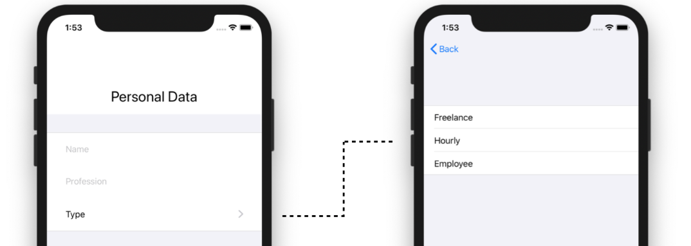

On macOS, however, SwiftUI will consider the abundant UI screen space on the mac and create a single form with a drop-down menu instead:

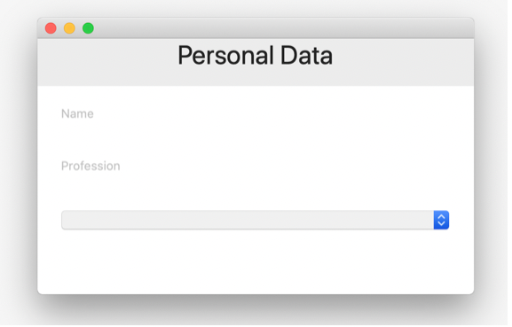

Finally, in SwiftUI, the user interface rendered on screen is a function of your state. You maintain a single copy of this state referred to as the "source of truth", and the UI is being derived dynamically from that state. Lucky for you, a Combine publisher can easily be plugged as a data source to SwiftUI views.


### Hello, SwiftUI!

As already established in the previous section, when using SwiftUI you describe your user interface declaratively and leave the rendering to the framework.

Each of the views you declare for your UI — text labels, images, shapes, etc. — conform to the View protocol. The only requirement of View is a property called body.

Any time you change your data model, SwiftUI asks each of your views for their current body representation. This might be changing according to your latest data model changes. Then, the framework builds the view hierarchy to render on-screen by calculating only the views affected by changes in your model, resulting in a highly optimized and effective drawing mechanism.

In effect, SwiftUI makes UI "snapshots" triggered by any changes of your data model like so:

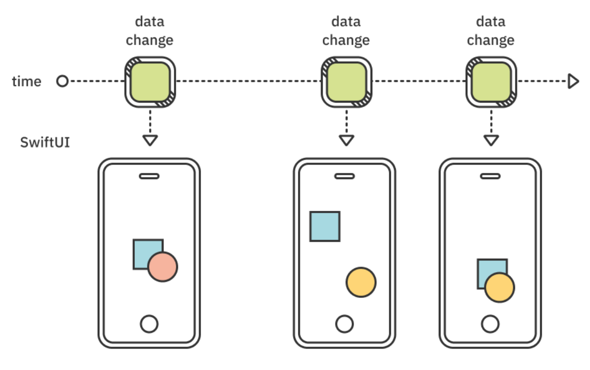

In this chapter, you will work through a number of tasks that cover both interoperations between Combine and SwiftUI along with some of the SwiftUI basics.


### Memory management

Believe it or not, a big part of what makes all of the above roll is a shift in how memory management works for your UI.


### No data duplication

Let's look at an example of what that means. When working with UIKit/AppKit you'd, in broad strokes, have your code separated between a data model, some kind of controller and a view:


Those three types can have several similar features. They include data storage, support mutability, can be reference types and more.

Let's say you want to display the current weather on-screen. For this example, let's say the model type is a struct called Weather and stores the current conditions in a text property called conditions. To display that information to the user, you need to create an instance of another type, namely UILabel, and copy the value of conditions into the text property of the label.

Now, you have two copies of the value you work with. One in your model type and the other stored in the UILabel, just for the purpose of displaying it on-screen:

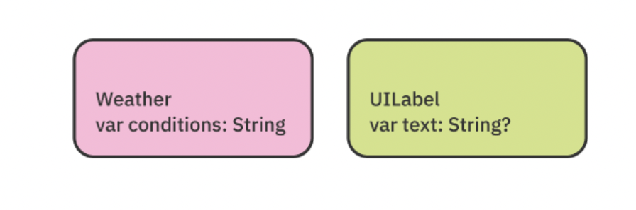

There is no connection or binding between text and conditions. You simply need to copy the String value everywhere you need it.

Now you've added a dependency to your UI. The freshness of the information on-screen depends on Weather.conditions. It's your responsibility to update the label's text property manually with a new copy of Weather.conditions whenever the conditions property changes.

SwiftUI removes the need for duplicating your data for the purpose of showing it on-screen. Being able to offload data storage out of your UI allows you to effectively manage the data in a single place in your model and never have your app's users see stale information on-screen.

**Less need to "control" your views**

As an additional bonus, removing the need for having "glue" code between your model and your view allows you to get rid of most of your view controller code as well!

In this chapter, you will learn:

- Briefly about the basics of SwiftUI syntax for building declarative UIs.

- How to declare various types of UI inputs and connect them to their "sources of truth."

- How to use Combine to build data models and pipe the data into SwiftUI.

> Note: If you'd like to learn more about SwiftUI, consider checking out SwiftUI by Tutorials (https://bit.ly/2L5wLLi) for an in-depth learning experience.


And now, for our feature presentation: Combine with SwiftUI!


### Getting started with "News

The starter project for this chapter already includes some code so that you can focus on writing code connecting Combine and SwiftUI.

The project also includes some folders where you will find the following:

- App contains the main app type.

- Network includes the completed Hacker News API from last chapter.

- Model is where you will find simple model types like Story, FilterKeyword and Settings. Additionally, this is where ReaderViewModel resides, which is the model type that the main newsreader view uses.

- View contains the app views and, inside View/Helpers, you will find some simple reusable components like buttons, badges, etc.

- Finally, in Util there is a helper type that allows you to easily read and write JSON files to/from disk.

The completed project will display a list of Hacker News stories and allow the user to manage a keyword filter:

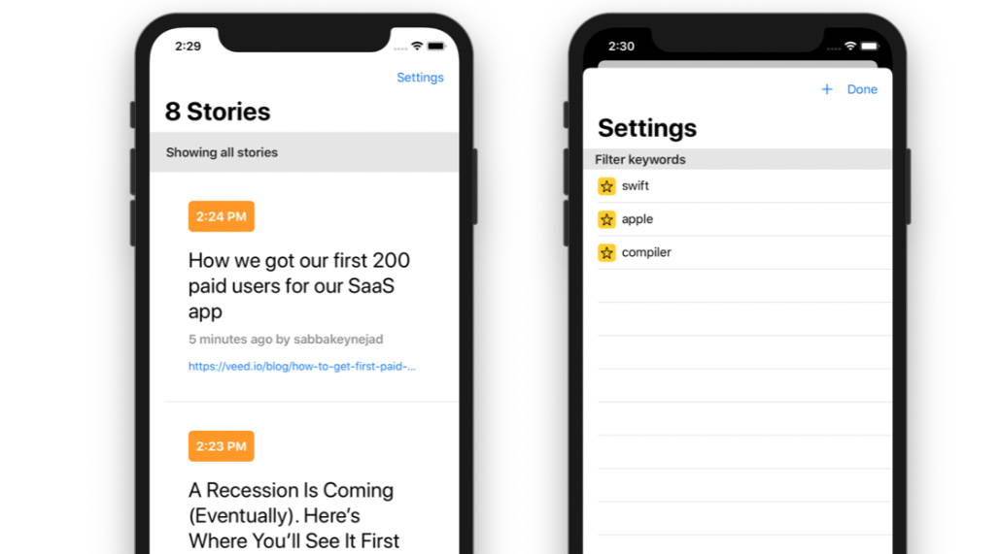


#### A first taste of managing view state

Build and run the starter project and you will see an empty table on screen and a single bar button titled "Settings":

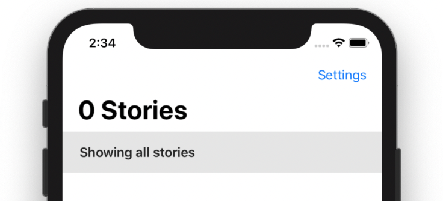

This is where you start. To get a taste of how interacting with the UI via changes to your data works, you'll make the Settings button present SettingsView when tapped.

Open View/ReaderView.swift which contains the ReaderView view displaying the main app interface.

The type already includes a property called presentingSettingsSheet which is a simple Boolean value. Changing this value will either present or dismiss the settings view. Scroll down through the source code and find the comment // Set presentingSettingsSheet to true here.

This comment is in the Settings button callback so that's the perfect place to present the Settings view. Replace the comment with:

```swift
self.presentingSettingsSheet = true
```

As soon as you add this line, you will see the following error:

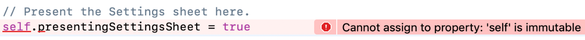

And indeed self is immutable because the view's body is a dynamic property and, therefore, cannot mutate ReaderView.

SwiftUI offers a number of built-in property wrappers to help you indicate that given properties are part of your state and any changes to those properties should trigger a new UI "snapshot."

Let's see what that means in practice. Adjust the plain old presentingSettingsSheet property so it looks as follows:

```swift
@State var presentingSettingsSheet = false
```

The @State property wrapper:

1. Moves the property storage out of the view, so modifying presentingSettingsSheet does not mutate self.

2. Marks the property as local storage. In other words, it denotes the piece of data is owned by the view.

3. Adds a publisher, somewhat like @Published does, to ReaderView called $presentingSettingsSheet which you can use to subscribe to the property or to bind it to UI controls or other views.

Once you add @State to presentingSettingsSheet, the error will clear as the compiler knows that you can modify this particular property from a non-mutating context.

Finally, to make use of presentingSettingsSheet, you need to declare how the new state affects the UI. In this case, you will add a sheet(...) view modifier to the view hierarchy and bind $presentingSettingsSheet to the sheet. Whenever you change presentingSettingsSheet, SwiftUI will take the current value and either present or dismiss your view, based on the boolean value.

Find the comment // Present the Settings sheet here and replace it with:

```swift
.sheet(isPresented: self.$presentingSettingsSheet, content: {
  SettingsView()
})
```

The sheet(isPresented:content:) modifier takes a Bool publisher and a view to render whenever the presentation publisher emits true.

Build and run the project. Tap Settings and your new presentation will display the target view:

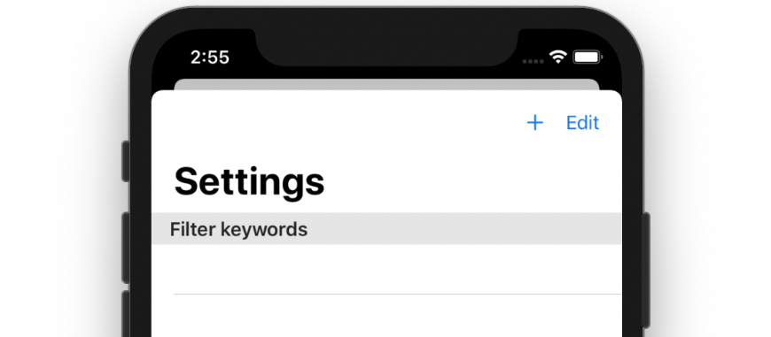


### Fetching the latest stories

Next, time for you to go back to some Combine code. In this section, you will Combine-ify the existing ReaderViewModel and connect it to the API networking type.

Open Model/ReaderViewModel.swift. At the top, insert:

```swift
import Combine
```

This code, naturally, will allow you to use Combine types in ReaderViewModel.swift. Now, add a new subscriptions property to ReaderViewModel to store all of your subscriptions:

```swift
private var subscriptions = Set<AnyCancellable>()
```

With all that solid prep work, now it's time to create a new method and engage the network API. Add the following empty method to ReaderViewModel:

```swift
func fetchStories() {

}
```

In this method, you will subscribe to API.stories() and store the server response in the model type. You should be familiar with this method from the previous chapter.

Add the following inside fetchStories():

```swift
api
  .stories()
  .receive(on: DispatchQueue.main)
```

You use the receive(on:) operator to receive any output on the main queue. Arguably, you could leave the thread management to the consumer of the API. However, since in ReaderViewModel's case that's certainly ReaderView, you optimize right here and switch to the main queue to prepare for committing changes to the UI.

Next, you will use a sink(...) subscriber to store the stories and any emitted errors in the model. Append:

```
.sink(receiveCompletion: { completion in
  if case .failure(let error) = completion {
    self.error = error
  }
}, receiveValue: { stories in
  self.allStories = stories
  self.error = nil
})
.store(in: &subscriptions)
```


First, you check if the completion was a failure. If so, you store the associated error in self.error. In case you receive values from the stories publisher, you store them in self.allStories.

This is all the logic you're going to add to the model in this section. The fetchStories() method is now complete and you can "start-up" your model as soon as you display ReaderView on screen.

To do that, open App/App.swift and add a new onAppear(...) view modifier to ReaderView, like so:

```swift
ReaderView(model: viewModel)
  .onAppear {
    viewModel.fetchStories()
  }
```

Right now, ReaderViewModel is not really hooked up to ReaderView so you will not see any change on-screen. However, to quickly verify that everything works as expected, do the following: Go back to Model/ReaderViewModel.swift and add a didSet handler to the allStories property:

```swift
private var allStories = [Story]() {
  didSet {
    print(allStories.count)
  }
}
```

Run the app and observe the Console. You should see a reassuring output like so:

```
1
2
3
4
...
```

You can remove the didSet handler you just added in case you don't want to see that output every time you run the app.


#### Using ObservableObject for model types

ObservableObject is a protocol that makes plain old data models observable and lets an observing SwiftUI View know the data has changed, so its able to rebuild any user interface that dependa on this data.

The protocol requires types to implement a publisher called objectWillChange which emits any time the type's state is about to change.

There is already a default implementation of that publisher in the protoocol so in most cases you won't have to add anything to your data model. When you add ObservableObject conformance to your type, the default protocol implementation will automatically emit any time any of your @Published properties emit!

Open ReaderViewModel.swift and add ObservableObject conformance to ReaderViewModel, so it looks like this:

```swift
class ReaderViewModel: ObservableObject {
```

Next, you need to consider which properties of the data model constitute its state. The two properties you currently update in your sink(...) subscriber are allStories and error. You will consider those state-change worthy.

> Note: There is also a third property called filter. Ignore it for the moment and you'll come back to it later on.

Adjust allStories to include the @Published property wrapper like so:

```swift
@Published private var allStories = [Story]()
```

Then, do the same for error:

```swift
@Published var error: API.Error? = nil
```

The final step in this section is, since ReaderViewModel now conforms to ObservableObject, to actually bind the data model to ReaderView.

Open View/ReaderView.swift and add the @ObservedObject property wrapper to the line var model: ReaderViewModel like so:

```swift
@ObservedObject var model: ReaderViewModel
```

You bind the model so that, any time its state changes, your view will receive the latest data and generate its new UI "snapshot".

The @ObservedObject wrapper does the following:

1. Removes the property storage from the view and uses a binding to the original model instead. In other words, it doesn't duplicate the data.

2. Marks the property as external storage. In other words, it denotes that the piece of data is not owned by the view.

3. Like @Published and @State, it adds a publisher to the property so you could subscribe to it and/or bind to it further down the view hierarchy.

By adding @ObservedObject, you've made model dynamic. This means it'll get all updates while your view model fetches stories from the Hacker News server. In fact, run the app right now and you will see the view refreshes itself as the model fetches stories:

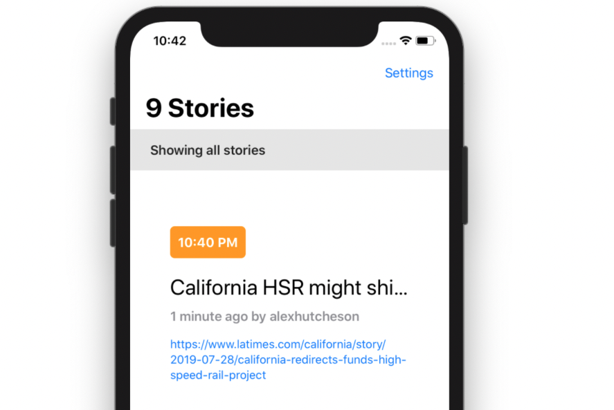


### Displaying errors

You will also display errors in the same way you display the fetched stories. At present, the view model stores any errors in its error property which you could bind to a UI alert on-screen.

Open View/ReaderView.swift and find the comment // Display errors here. Replace this comment with the following code to bind the model to an alert view:

```swift
.alert(item: self.$model.error) { error in
  Alert(
    title: Text("Network error"), 
    message: Text(error.localizedDescription),
    dismissButton: .cancel()
  )
}
```

The alert(item:) modifier controls an alert presentation on-screen. It takes a binding with an optional output called the item. Whenever that binding source emits a non-nil value, the UI presents the alert view.

The model's error property is nil by default and will only be set to a non-nil error value whenever the model experiences an error fetching stories from the server. This is an ideal scenario for presenting an alert as it allows you to bind error directly as alert(item:) input.

To test this, open Network/API.swift and modify the baseURL property to an invalid URL, for example, https://123hacker-news.firebaseio.com/v0/.

Run the app again and you will see the error alert show up as soon as the request to the stories endpoint fails:

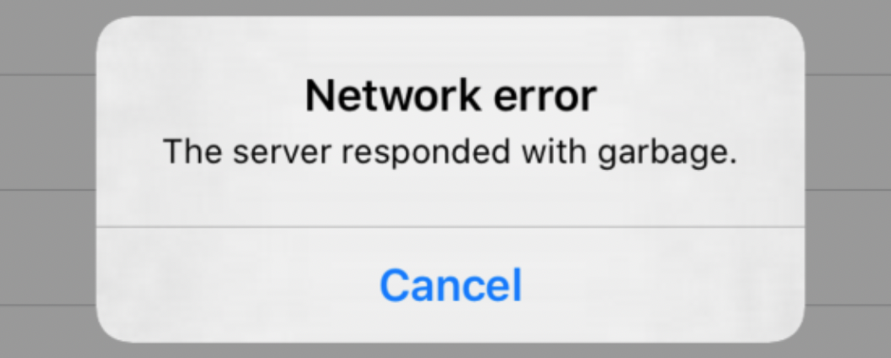

Before moving on and working through the next section, take a moment to revert your changes to baseURL so your app once again connects to the server successfully.


### Subscribing to an external publisher

Sometimes you don't want to go down the ObservableObject/ObservedObject route, because all you want to do is subscribe to a single publisher and receive its values in your SwiftUI view. For simpler situations like this, there is no need to create an extra type — you can simply use the onReceive(_) view modifier. It allows you to subscribe to a publisher directly from your view.

If you run the app right now, you will see that each of the stories has a relative time included alongside the name of the story author:

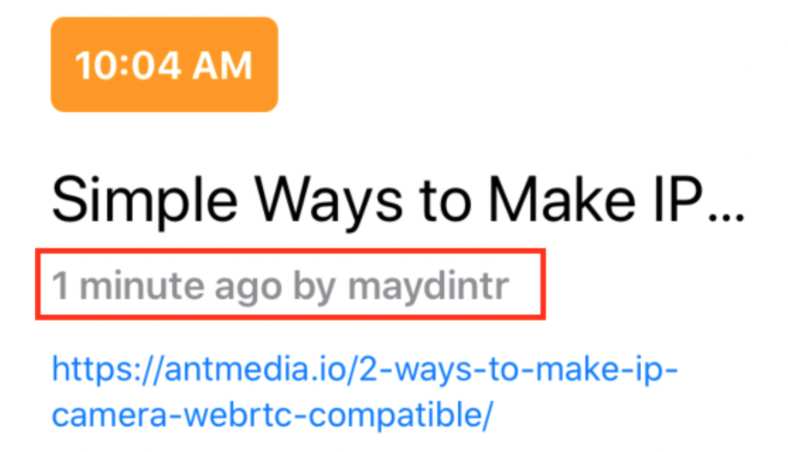

The relative time there is useful to instantly communicate the "freshness" of the story to the user. However, once rendered on-screen, the information becomes stale after a while. If the user has the app open for a long time, "1 minute ago" might be off by quite some time.

In this section, you will use a timer publisher to trigger UI updates at regular intervals so each row could recalculate and display correct times.

How the code works right now is as follows:

- ReaderView has a property called currentDate which is set once with the current date when the view is created.

- Each row in the stories list includes a PostedBy(time:user:currentDate:) view which compiles the author and time information by using currentDate's value.

To make the information on-screen "refresh" periodically, you will add a new timer publisher. Every time it emits, you will update currentDate. Additionally, as you might've guessed already, you will add currentDate to the view's state so it will trigger a new UI "snapshot" as it changes.

To work with publishers, start by adding towards the top of ReaderView.swift:

```swift
import Combine
```


Then, add a new publisher property to ReaderView which creates a new timer publisher ready to go as soon as anyone subscribes to it:

```swift
private let timer = Timer.publish(every: 10, on: .main, in: .common)
  .autoconnect()
  .eraseToAnyPublisher()
```

As you already learned earlier in the book, it returns a connectable publisher. This is a kind of "dormant" publisher that requires subscribers to connect to it to activate it. Above you use autoconnect() to instruct the publisher to automatically "awake" upon subscription.

What's left now is to update currentDate each time the timer emits. You will use a SwiftUI modifier called onReceive(_), which behaves much like the sink(receiveValue:) subscriber. Scroll just a tad down and find the comment // Add timer here and replace it with:

```swift
.onReceive(timer) {
  self.currentDate = $0
}
```

The timer emits the current date and time so you just take that value and assign it to currentDate. Doing that will produce a somewhat familiar error:

Naturally, this happens because you cannot mutate the property from a non-mutating context. Just as before, you'll solve this predicament by adding currentDate to the view's local storage state.

Add a @State property wrapper to the property like so:

```swift
@State var currentDate = Date()
```

This way, any update to currentDate will trigger a new UI "snapshot" and will force each row to recalculate the relative time of the story and update the text if necessary.

Run the app one more time and leave it open. Make a mental note of how long ago the top story was posted, here's what I had when I tried that:

Wait for at least one minute and you will see the visible rows update their information with the current time. The orange time badge will still show the time when the story was posted but the text below the title will update with the correct "... minutes ago" text:


Besides having the publisher a property on your view, you can also inject any publisher from your Combine model into the view via the view's initializer or the environment. Then, it's only a matter of using onReceive(...) in the same way as above.


### Initializing the app's settings

In this part of the chapter, you will move on to making the Settings view work. Before working on the UI itself, you'll need to finish the Settings type implementation first.

Open Model/Settings.swift and you'll see that, currently, the type is pretty much bare bones. It contains a single property holding a list of FilterKeyword values.

Now, open Model/FilterKeyword.swift. FilterKeyword is a helper model type that wraps a single keyword to use as a filter for the stories list in the main reader view. It conforms to Identifiable, which requires an id property that uniquely identifies each instance, such as when you use those types in your SwiftUI code. If you peruse the API.Error and Story definitions in Network/API.swift and Model/Story.swift, respectively, you'll see that these types also conform to Identifiable.

Let's go on the merry-go-round one more time. You need to turn the plain, old model Settings into a modern type to use with your Combine and SwiftUI code.

Get started by adding at the top of Model/Settings.swift:

```swift
import Combine
```

Then, add a publisher to keywords by adding the @Published property wrapper to it, so it looks as follow:

```swift
@Published var keywords = [FilterKeyword]()
```

Now, other types can subscribe to Settings's current keywords. You can also pipe in the keywords list to views that accept a binding.

Finally, to enable observation of Settings, make the type conform to ObservableObject like so:

```swift
final class Settings: ObservableObject {
```

There's no need to add anything else to make the ObservableObject conformance work. The default implementation will emit any time the $keywords publisher does.

This is how, in few easy steps, you turned Settings into a model type on steroids. Now, you can plug it into the rest of your reactive code in the app.

To bind the app's Settings, you'll instantiate it in your app. Open App/App.swift and add a new property to HNReader:

```swift
let userSettings = Settings()
```

As usual, you will also need a cancelable collection to store your subscriptions. Add one more property for that to HNReader:

```swift
private var subscriptions = Set<AnyCancellable>()
```

Now, you can bind Settings.keywords to ReaderViewModel.filter so that the main view will not only receive the initial list of keywords but also the update list each time the user edits the list of keywords.

You'll create that binding while intializing HNReader. Add a new initializer to that type:

```swift
init() {
  userSettings.$keywords
    .map { $0.map { $0.value } }
    .assign(to: \.filter, on: viewModel)
    .store(in: &subscriptions)
}
```

You subscribe to userSettings.$keywords, which outputs [FilterKeyword], and map it to [String] by getting each keyword's value property. Then, you assign the resulting value to viewModel.filter.

Now, whenever you alter the contents of Settings.keywords, the binding to the view model will ultimately cause the generation of a new UI "snapshot" of ReaderView because the view model is part of its state.

The binding so far works. However, you still have to add the filter property to be part of ReaderViewModel's state. You'll do this so that, each time you update the list of keywords, the new data is relayed onwards to the view.

To do that, open Model/ReaderViewModel.swift and add the @Published property wrapper to filter like so:

```swift
@Published var filter = [String]()
```

The complete binding from Settings to the view model and onwards to the view is now complete!

This is extremely handy because, in the next section, you will connect the Settings view to the Settings model and any change the user makes to the keyword list will trigger the whole chain of bindings and subscriptions to ultimately refresh the main app view story list like so:

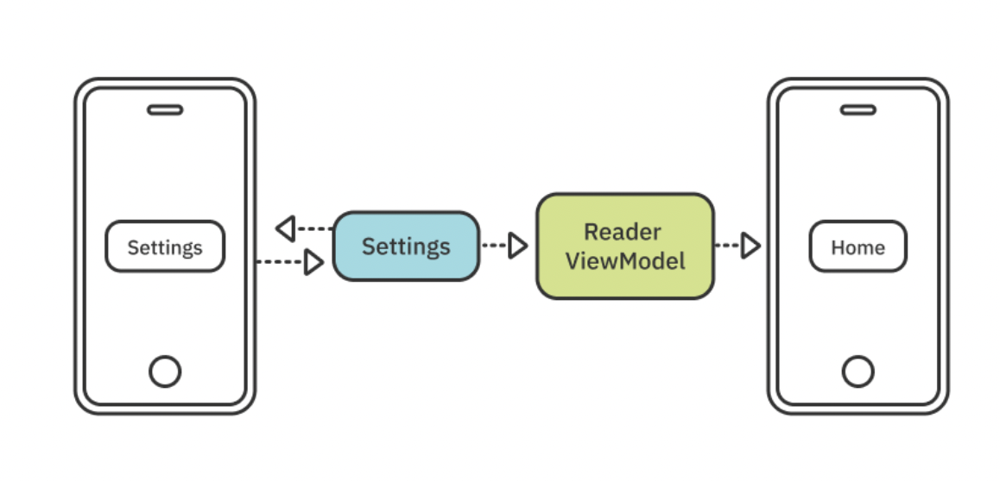


### Editing the keywords list

In this last part of the chapter, you will look into the SwiftUI environment. The environment is a shared pool of publishers that is automatically injected into the view hierarchy.


#### System environment

The environment contains publishers injected by the system, like the current calendar, the layout direction, the locale, the current time zone and others. As you see, those are all values that could change over time. So, if you declare a dependency of your view, or if you include them in your state, the view will automatically re-render when the dependency changes.

To try out observing one of the system settings, open View/ReaderView.swift and add a new property to ReaderView:

```swift
@Environment(\.colorScheme) var colorScheme: ColorScheme
```

You use the @Environment property wrapper, which defines which key of the environment should be bound to the colorScheme property. Now, this property is part of your view's state. Each time the system appearance mode changes between light and dark, and vice-versa, SwiftUI will re-render your view.

Additionally, you will have access to the latest color scheme in the view's body. So, you can render it differently in light and dark modes.

Scroll down and find the line setting the color of the story link .foregroundColor(Color.blue). Replace that line with:

```swift
.foregroundColor(self.colorScheme == .light ? .blue : .orange)
```

Now, depending on the current value of colorScheme, the link will be either blue or orange.

Try out this new miracle of code by changing the system appearance to dark. In Xcode, open Debug ► View Debugging ► Configure Environment Overrides... or tap the Environment Overrides button at Xcode's bottom toolbar. Then, toggle the switch next to Interface Style on.

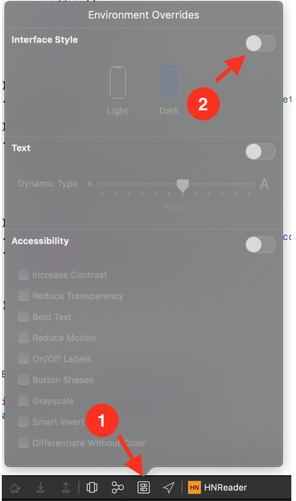


#### Custom environment objects

As cool as observing the system settings via @Environment(_) is, that's not all that the SwiftUI environment has to offer. You can, in fact, environment-ify your objects as well!

This is very handy. Especially when you have deeply nested view hierarchies. Inserting a model or another shared resource into the environment removes the need to dependency-inject through a multitude of views until you reach the deeply nested view that actually needs the data.

Objects you insert in a view's environment are available automatically to any child views of that view and all their child views too.

This sounds like a great opportunity for sharing your user's Settings with all views of the app so they can make use of the user's story filter.

The place to inject dependencies into all your views is the main app file. This is where you previously created the userSettings instance of Settings and bound its $keywords to the ReaderViewModel. Now, you will inject userSettings into the environment as well.

Open App/App.swift and add the environmentObject view modifier to ReaderView by adding below ReaderView(model: viewModel):

```swift
.environmentObject(userSettings)
```

The environmentObject modifier is a view modifier which inserts the given object in the view hierarchy. Since you already have an instance of Settings, you simply send that one off to the environment and you're done.

Next, you need to add the environment dependency to the views where you want to use your custom object. Open View/SettingsView.swift and add a new property with the @EnvironmentObject wrapper:

```swift
@EnvironmentObject var settings: Settings
```

The settings property will automatically be populated with the latest user settings from the environment.

For your own objects, you do not need to specify a key path like for the system environment. @EnvironmentObject will match the property type — in this case Settings — to the objects stored in the environment and find the right one.

Now, you can use settings.keywords like any of your other view states. You can either get the value directly, subscribe to it, or bind it to other views.

To complete the SettingsView functionality, you'll display the list of keywords and enable adding, editing and deleting keywords from the list.

Find the following line:

```swift
ForEach([FilterKeyword]()) { keyword in
```

And replace it with:

```swift
ForEach(settings.keywords) { keyword in
```

The updated code will use the filter keywords for the on-screen list. This will, however, still display an empty list as the user doesn't have a way to add new keywords.

The starter project includes a view for adding keywords. So, you simply need to present it when the user taps the + button. The + button action is set to addKeyword() in SettingsView.

Scroll to the private addKeyword() method and add inside it:

```swift
presentingAddKeywordSheet = true
```

presentingAddKeywordSheet is a published property, much like the one you already worked with earlier this chapter, to present an alert. You can see the presentation declaration slightly up in the source: .sheet(isPresented: $presentingAddKeywordSheet).

To try out how injecting objects manually to a given view works, switch to View/ReaderView.swift and find the spot where you present SettingsView — it's a single line where you just create a new instance like so: SettingsView().

The same way you injected the settings into ReaderView, you can inject them here as well. Add a new property to ReaderView:

```swift
@EnvironmentObject var settings: Settings
```

And then, add the .environmentObject modifier directly under SettingsView():

```swift
.environmentObject(self.settings)
```

Now, you declared a ReaderView dependency on Settings and you passed that dependency onwards to SettingsView via the environment. In this particular case, you could've just passed it as a parameter to the init of SettingsView as well.

Before moving on, run the app one more time. You should be able to tap Settings and see the SettingsView pop up.

Now, switch back to View/SettingsView.swift and complete the list editing actions as initially intended.

Inside sheet(isPresented: $presentingAddKeywordSheet), a new AddKeywordView is already created for you. It's a custom view included with the starter project, which allows the user to enter a new keyword and tap a button to add it to the list.

AddKeywordView takes a callback, which it will call when the user taps the button to add the new keyword. 

In the empty completion callback of AddKeywordView add:

```swift
let new = FilterKeyword(value: newKeyword.lowercased())
self.settings.keywords.append(new)
self.presentingAddKeywordSheet = false
```

You create a new keyword, add it to user settings, and finally dismiss the presented sheet.

Remember, adding the keyword to the list here will update the settings model object and in turn, will update the reader view model and refresh ReaderView as well. All automatically as declared in your code.

To wrap up with SettingsView, let's add deleting and moving keywords. Find // List editing actions and replace it with:

```swift
.onMove(perform: moveKeyword)
.onDelete(perform: deleteKeyword)
```

This code sets moveKeyword() as the handler when the user moves one of the keywords up or down the list and deleteKeyword() as the handler when the user swipes right to delete a keyword.

In the currently empty moveKeyword(from:to:) method, add:

```swift
guard let source = source.first,
      destination != settings.keywords.endIndex else { return }

settings.keywords
  .swapAt(source,
          source > destination ? destination : destination - 1)
```

And inside deleteKeyword(at:), add:

```swift
settings.keywords.remove(at: index.first!)
```

That's really all you need to enable editing in your list! Build and run the app one final time and you'll be able to fully manage the story filter including adding, moving and deleting keywords:
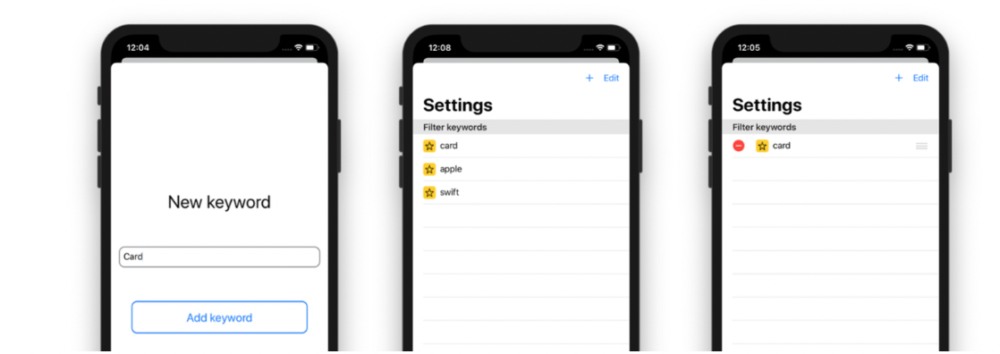


Additionally, when you navigate back to the story list, you will see that the settings are propagated along with your subscriptions and bindings across the application and the list displays only stories matching your filter. The title will display the number of matching stories as well:

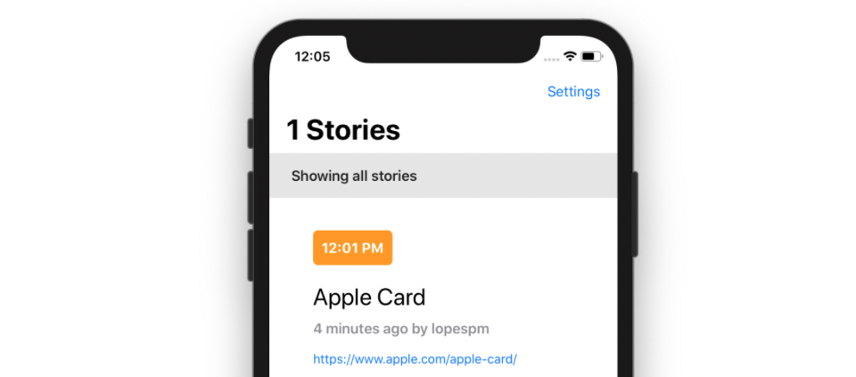


### Challenges

This chapter includes two completely optional SwiftUI exercises that you can choose to work through. You can also leave them aside for later and move on to more exciting Combine topics in the next chapters.

#### Challenge 1: Displaying the filter in the reader view

In the first challenge, you will insert a list of the filter's keywords in the story list header in ReaderView. Currently, the header always displays "Showing all stories". Change that text to display the list of keywords in case the user has added any, like so:

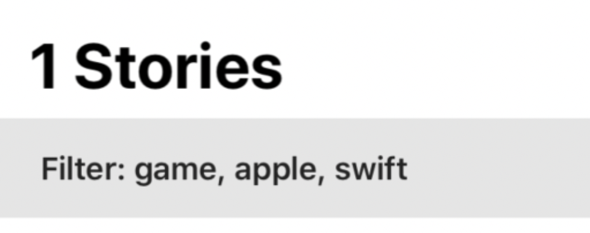

#### Challenge 2: Persisting the filter between app launches

The starter project includes a helper type called JSONFile which offers two methods: loadValue(named:) and save(value:named:).

Use this type to:

- Save the list of keywords on disk any time the user modifies the filter by adding a didSet handler to Settings.keywords.

- Load the keywords from disk in Settings.init().

This way, the user's filter will persist between app launches like in real apps.

If you're not sure about the solution to either of these challenges, or need some help, feel free to look into the finished project in the projects/challenge folder.


### Key points

- With SwiftUI, your UI is a function of your state. You cause your UI to render itself by committing changes to the data declared as the view's state, among other view dependencies. You learned various ways to manage state in SwiftUI:

- Use @State to add local state to a view and @ObservedObject to add a dependency on an external ObservableObject in your Combine code.

- Use onReceive view modifier to subscribe an external publisher directly.

- Use @Environment to add a dependency to one of the system-provided environment settings and @EnvironmentObject for your own custom environment objects.


### Where to go from here?

Congratulations on getting down and dirty with SwiftUI and Combine! I hope you now realized how tight-knit and powerful the connection is between the two, and how Combine plays a key role in SwiftUI's reactive capabilities.

Even though you should always aim to write error-free apps, the world is rarely this perfect. Which is exactly why you'll spend the next chapter learning about how you can handle errors in Combine.


## Chapter 16: Error Handling

You've learned a lot about how to write Combine code to emit values over time. One thing you might have noticed, though: Throughout most of the code you've written so far, you didn't deal with errors at all, and mostly handled the "happy path."

Unless you write error-free apps, this chapter is for you! :]

As you learned in Chapter 1, “Hello, Combine!,” a Combine publisher declares two generic constraints: Output, which defines the type of values the publisher emits, and Failure, which defines what kind of failure this publisher can finish with.

Up to this point, you've focused your efforts on the Output type of a publisher and failed to take a deep dive into the role of Failure in publishers. Well, don't worry, this chapter will change that!


### Getting started

Open the starter playground for this chapter in projects/Starter.playground. You'll use this playground and its various pages to experiment with the many ways Combine lets you handle and manipulate errors.

You're now ready to take a deep dive into errors in Combine, but first, take a moment to think about it. Errors are such a broad topic, where would you even start?

Well, how about starting with the absence of errors?


### Never

A publisher whose Failure is of type Never indicates that the publisher can never fail.

While this might seem a tad strange at first, it provides some extremely powerful guarantees about these publishers. A publisher with Never failure type lets you focus on consuming the publisher's values while being absolutely sure the publisher will never fail. It can only complete successfully once it's done.

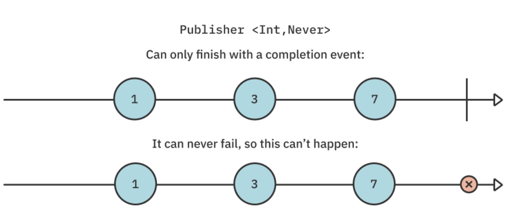

Open the Project Navigator in the starter playground by pressing Command-1, then select the Never playground page.

Add the following example to it:

```swift
example(of: "Never sink") {
  Just("Hello")
}
```

You create a Just with a string value of Hello. Just always declares a Failure of Never. To confirm this, Command-click the Just initializer and select Jump to Definition. Looking at the definition, you can see a type alias for Just's failure:

```swift
public typealias Failure = Never
```

Combine's no-failure guarantee for Never isn't just theoretical, but is deeply rooted in the framework and its various APIs.

Combine offers several operators that are only available when the publisher is guaranteed to never fail. The first one is a variation of sink to handle only values.

Go back to the Never playground page and update the above example so it looks like this:

```swift
example(of: "Never sink") {
  Just("Hello")
    .sink(receiveValue: { print($0) })
    .store(in: &subscriptions)
}
```

Run your playground and you'll see the Just's value printed out:

```
——— Example of: Never sink ———
Hello
```


In the above example, you use sink(receiveValue:). This specific overload of sink lets you ignore the publisher's completion event and only deal with its emitted values.

This overload is only available for infallible publishers. Combine is smart and safe when it comes to error handling, and forces you to deal with a completion event if an error may be thrown — i.e., for a non-failing publisher.

To see this in action, you'll want to turn your Never-failing publisher into one that may fail. There are a few ways to do this, and you'll start with the most popular one — the setFailureType operator.


**setFailureType**

The first way to turn an infallible publisher into a fallible one is to use setFailureType. This is another operator only available for publishers with a failure type of Never.

Add the following code and example to your playground page:

```swift
enum MyError: Error {
  case ohNo
}

example(of: "setFailureType") {
  Just("Hello")
}
```

You start by defining a MyError error type outside the scope of the example. You'll reuse this error type in a bit. You then start the example by creating a Just similar to the one you used before.

Now, you can use setFailureType to change the failure type of the publisher to MyError. Add the following line immediately after the Just:

```swift
.setFailureType(to: MyError.self)
```

To confirm this actually changed the publisher's failure type, start typing .eraseToAnyPublisher(), and the auto-completion will show you the erased publisher type:

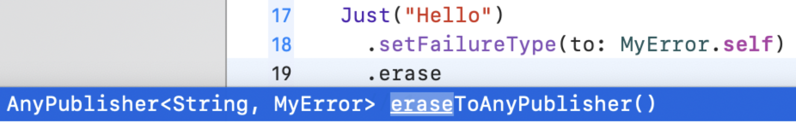

Delete the .erase... line you started typing before proceeding.

Now it's time to use sink to consume the publisher. Add the following code immediately after your last call to setFailureType:

```swift
// 1
.sink(
  receiveCompletion: { completion in
    switch completion {
    // 2
    case .failure(.ohNo):
      print("Finished with Oh No!")
    case .finished:
      print("Finished successfully!")
    }
  },
  receiveValue: { value in
    print("Got value: \(value)")
  }
)
.store(in: &subscriptions)
```

You might have noticed two interesting facts about the above code:

1. It's using sink(receiveCompletion:receiveValue:). The sink(receiveValue:) overload is no longer available since this publisher may complete with a failure event. Combine forces you to deal with the completion event for such publishers.

2. The failure type is strictly typed as MyError, which lets you target the .failure(.ohNo) case without unnecessary casting to deal with that specific error.

Run your playground, and you'll see the following output:

```
——— Example of: setFailureType ———
Got value: Hello
Finished successfully!
```

Of course, setFailureType's effect is only a type-system definition. Since the original publisher is a Just, no error is actually thrown.

You'll learn more about how to actually produce errors from your own publishers later in this chapter. But first, there are still a few more operators that are specific to never-failing publishers.


**assign(to_:on_:)**

The assign operator you learned about in Chapter 2, “Publishers & Subscribers,” only works on publishers that cannot fail, same as setFailureType. If you think about it, it makes total sense. Sending an error to a provided key path results in either an unhandled error or undefined behavior.

Add the following example to test this:

```swift
example(of: "assign(to:on:)") {
  // 1
  class Person {
    let id = UUID()
    var name = "Unknown"
  }

  // 2
  let person = Person()
  print("1", person.name)

  Just("Shai")
    .handleEvents( // 3
      receiveCompletion: { _ in print("2", person.name) }
    )
    .assign(to: \.name, on: person) // 4
    .store(in: &subscriptions)
}
```

In the above piece of code, you:

1. Define a Person class with id and name properties.

2. Create an instance of Person and immediately print its name.

3. Use handleEvents, which you learned about previously, to print the person's name again once the publisher sends a completion event.

4. Finish up by using assign to set the person's name to whatever the publisher emits.

Run your playground and look at the debug console:

```
——— Example of: assign(to:on:) ———
1 Unknown
2 Shai
```

As expected, assign updates the person's name as soon as Just emits its value, which works because Just cannot fail. In contrast, what do you think would happen if the publisher had a non-Never failure type?

Add the following line immediately below Just("Shai"):

```swift
.setFailureType(to: Error.self)
```

In this code, you've set the failure type to a standard Swift error. This means that instead of being a Publisher<String, Never>, it's now a Publisher<String, Error>.

Try to run your playground. Combine is very verbose about the issue at hand:

```
referencing instance method 'assign(to:on:)' on 'Publisher' requires the types 'Error' and 'Never' be equivalent
```

Remove the call to setFailureType you just added, and make sure your playground runs with no compilation errors.


**assign(to:)**

There is one tricky part about `assign(to:on:)` — It'll strongly capture the object provided to the on argument.

Let's explore why this is problematic.

Add the following code immediately after the previous example:

```swift
example(of: "assign(to:)") {
  class MyViewModel: ObservableObject {
    // 1
    @Published var currentDate = Date()

    init() {
      Timer.publish(every: 1, on: .main, in: .common) // 2
        .autoconnect() 
        .prefix(3) // 3
        .assign(to: \.currentDate, on: self) // 4
        .store(in: &subscriptions)
    }

  }

  // 5
  let vm = MyViewModel()
  vm.$currentDate
    .sink(receiveValue: { print($0) })
    .store(in: &subscriptions)
}
```

This code is a tad long, so let's break it down. You:

1. Define a @Published property inside a view model object. Its initial value is the current date.

2. Create a timer publisher which emits the current date every second.

3. Use the prefix operator to only accept 3 date updates.

4. Apply the `assign(to:on:)` operator to assign every date update to your @Published property.

5. Instantiate your view model, sink over the published publisher, and print out every value.

If you run your playground, you'll see output similar to the following:

```
——— Example of: assign(to:on:) strong capture ———
2021-08-21 12:43:32 +0000
2021-08-21 12:43:33 +0000
2021-08-21 12:43:34 +0000
2021-08-21 12:43:35 +0000
```

As expected, the code above prints the initial date assigned to the published property, and then 3 consecutive updated (limited by the prefix operator).

Seemingly, everything is working just fine, so what's actually wrong here?

The call to `assign(to:on:)` creates a subscription that strongly retains self. Essentially — self hangs on to the subscription, and the subscription hangs on to self, creating a retain cycle resulting in a memory leak.

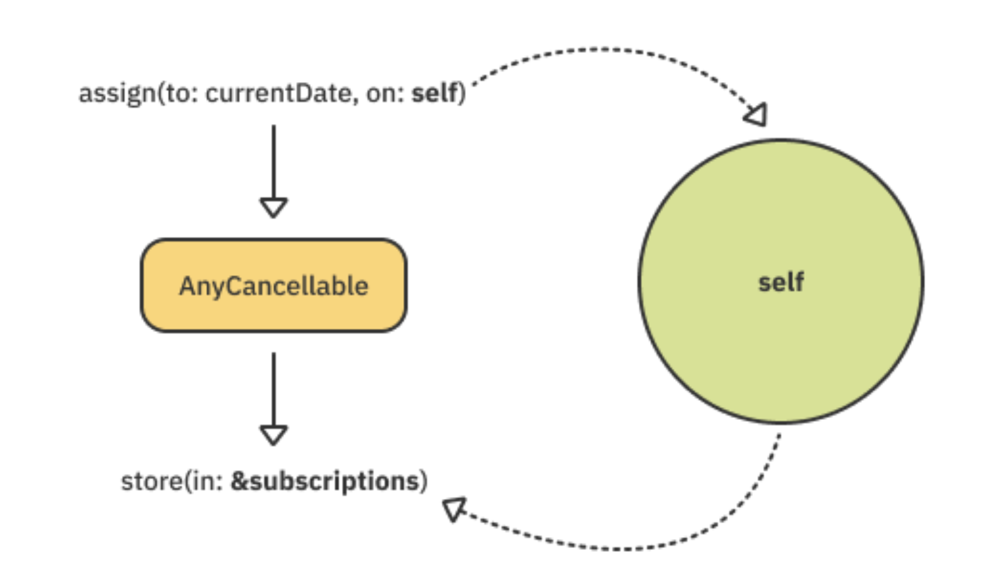

Fortunately, the good folks at Apple realized how problematic this is and introduced another overload of this operator - assign(to:).

This operator specifically deals with reassigning published values to a @Published property by providing an inout reference to its projected publisher.

Go back to the example code, find the following two lines:

```swift
.assign(to: \.currentDate, on: self) // 3
.store(in: &subscriptions)
```

And replace them with the following line:

```swift
.assign(to: &$currentDate)
```

Using the assign(to:) operator and passing it an inout reference to the projected publisher breaks the retain cycle and lets you easily deal with the problem presented above.

Also, it automatically takes care of memory management for the subscription internally, which lets you omit the store(in: &subscriptions) line.

> Note: Before moving on, it's recommended to comment out the previous example so the printed out timer events won't add unnecessary noise to your console output.


You're almost done with infallible publishers at this point. But before you start dealing with errors, there's one final operator related to infallible publishers you should know: assertNoFailure.


**assertNoFailure**

The assertNoFailure operator is useful when you want to protect yourself during development and confirm a publisher can't finish with a failure event. It doesn't prevent a failure event from being emitted by the upstream. However, it will crash with a fatalError if it detects an error, which gives you a good incentive to fix it in development.

Add the following example to your playground:

```swift
example(of: "assertNoFailure") {
  // 1
  Just("Hello")
    .setFailureType(to: MyError.self)
    .assertNoFailure() // 2
    .sink(receiveValue: { print("Got value: \($0) ")}) // 3
    .store(in: &subscriptions)
}
```

In the previous code, you:

1. Use Just to create an infallible publisher and set its failure type to MyError.

2. Use assertNoFailure to crash with a fatalError if the publisher completes with a failure event. This turns the publisher's failure type back to Never.

3. Print out any received values using sink. Notice that since assertNoFailure sets the failure type back to Never, the sink(receiveValue:) overload is at your disposal again.

Run your playground, and as expected it should work with no issues:

```
——— Example of: assertNoFailure ———
Got value: Hello 
```

Now, after setFailureType, add the following line:

```swift
.tryMap { _ in throw MyError.ohNo }
```

You just used tryMap to throw an error once Hello is pushed downstream. You'll learn more about try-prefixed operators later in this chapter.

Run your playground again and take a look at the console. You'll see output similar to the following:

```
Playground execution failed:

error: Execution was interrupted, reason: EXC_BAD_INSTRUCTION (code=EXC_I386_INVOP, subcode=0x0).

...

frame #0: 0x00007fff232fbbf2 Combine`Combine.Publishers.AssertNoFailure...
```

The playground crashes because a failure occurred in the publisher. In a way, you can think of assertFailure() as a guarding mechanism for your code. While not something you should use in production, it is extremely useful during development to "crash early and crash hard."

Comment out the call to tryMap before moving on to the next section.


### Dealing with failure

Wow, so far you've learned a lot about how to deal with publishers that can't fail at all... in an error-handling chapter! :] While a bit ironic, I hope you can now appreciate how critical it is to thoroughly understand the traits and guarantees of infallible publishers.

With that in mind, it's time for you to learn about some techniques and tools Combine provides to deal with publishers that actually fail. This includes both built-in publishers and your own publishers!

But first, how do you actually produce failure events? As mentioned in the previous section, there are several ways to do this. You just used tryMap, so why not learn more about how these try operators work?


#### try* operators

In Section II, "Operators," you learned about most of Combine's operators and how you can use them to manipulate the values and events your publishers emit. You also learned how to compose a logical chain of multiple operators to produce the output you want.

In these chapters, you learned that most operators have parallel operators prefixed with try, and that you'll "learn about them later in this book." Well, later is now!

Combine provides an interesting distinction between operators that may throw errors and ones that may not.

> Note: All try-prefixed operators in Combine behave the same way when it comes to errors. In the essence of time, you'll only experiment with the tryMap operator throughout this chapter.

First, select the try operators* playground page from the Project navigator. Add the following code to it:

```swift
example(of: "tryMap") {
  // 1
  enum NameError: Error {
    case tooShort(String)
    case unknown
  }

  // 2
  let names = ["Marin", "Shai", "Florent"].publisher

  names
    // 3
    .map { value in
      return value.count
    }
    .sink(
      receiveCompletion: { print("Completed with \($0)") },
      receiveValue: { print("Got value: \($0)") }
    )
}
```

In the above example, you:

1. Define a NameError error enum, which you'll use momentarily.

2. Create a publisher emitting three different strings.

3. Map each string to its length.

Run the example and check out the console output:

```
——— Example of: tryMap ———
Got value: 5
Got value: 4
Got value: 7
Completed with finished
```

All names are mapped with no issues, as expected. But then you receive a new product requirement: Your code should throw an error if it accepts a name shorter than 5 characters.

Replace the map in the above example with the following:

```swift
.map { value -> Int in
  // 1
  let length = value.count

  // 2
  guard length >= 5 else {
    throw NameError.tooShort(value)
  }

  // 3
  return value.count
}
```

In the above map, you check that the length of the string is greater or equal to 5. Otherwise, you try to throw an appropriate error.

However, as soon as you add the above code or attempt to run it, you'll see that the compiler produces an error:

```
Invalid conversion from throwing function of type '(_) throws -> _' to non-throwing function type '(String) -> _'
```

Since map is a non-throwing operator, you can't throw errors from within it. Luckily, the try* operators are made just for that purpose.

Replace map with tryMap and run your playground again. It will now compile and produce the following output (truncated):

```
——— Example of: tryMap ———
Got value: 5
Got value: 5
Completed with failure(...NameError.tooShort("Shai"))
```


#### Mapping errors

The differences between map and tryMap go beyond the fact that the latter allows throwing errors. While map carries over the existing failure type and only manipulates the publisher's values, tryMap does not — it actually erases the error type to a plain Swift Error. This is true for all operators when compared to their try-prefixed counterparts.

Switch to the Mapping errors playground page and add the following code to it:

```swift
example(of: "map vs tryMap") {
  // 1
  enum NameError: Error {
    case tooShort(String)
    case unknown
  }

  // 2
  Just("Hello")
    .setFailureType(to: NameError.self) // 3
    .map { $0 + " World!" } // 4
    .sink(
      receiveCompletion: { completion in
        // 5
        switch completion {
        case .finished:
          print("Done!")
        case .failure(.tooShort(let name)):
          print("\(name) is too short!")
        case .failure(.unknown):
          print("An unknown name error occurred")
        }
      },
      receiveValue: { print("Got value \($0)") }
    )
    .store(in: &subscriptions)
}
```

In the above example, you:

1. Define a NameError to use for this example.

2. Create a Just which only emits the string Hello.

3. Use setFailureType to set the failure type to NameError.

4. Append another string to the published string using map.

5. Finally, use sink's receiveCompletion to print out an appropriate message for every failure case of NameError.

Run the playground and you'll see the following output:

```
——— Example of: map vs tryMap ———
Got value Hello World!
Done!
```

Next, find the switch completion { line and Option-click on completion:

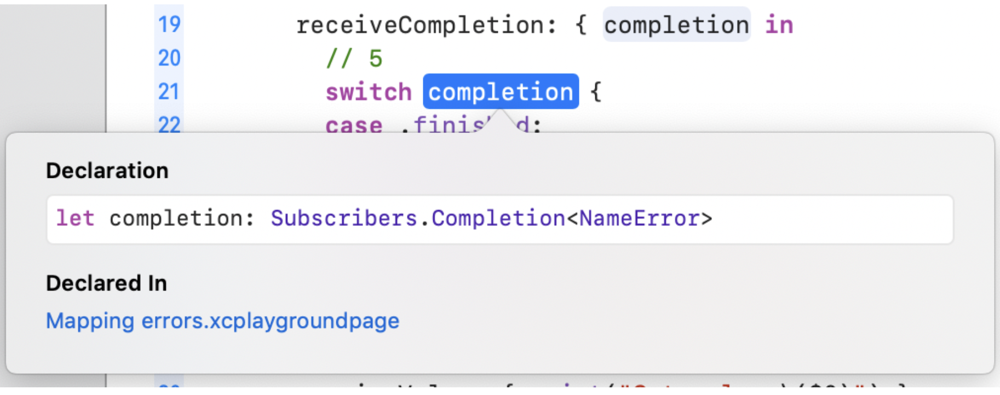

Notice that the Completion's failure type is NameError, which is exactly what you want. The setFailureType operator lets you specifically target NameError failures such as failure(.tooShort(let name)).

Next, change map to tryMap. You'll immediately notice the playground no longer compiles. Option-click on completion again:

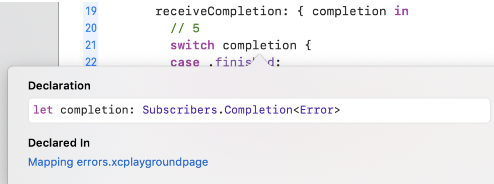

Very interesting! tryMap erased your strictly-typed error and replaced it with a general Swift.Error type. This happens even though you didn't actually throw an error from within tryMap — you simply used it! Why is that?

The reasoning is quite simple when you think about it: Swift doesn't support typed throws yet, even though discussions around this topic have been taking place in Swift Evolution since 2015. This means when you use try-prefixed operators, your error type will always be erased to the most common ancestor: Swift.Error.

So, what can you do about it? The entire point of a strictly-typed Failure for publishers is to let you deal with — in this example — NameError specifically, and not any other kind of error.

A naive approach would be to cast the generic error manually to a specific error type, but that's quite suboptimal. It breaks the entire purpose of having strictly-typed errors. Luckily, Combine provides a great solution to this problem, called mapError.

Immediately after the call to tryMap, add the following line:

```swift
.mapError { $0 as? NameError ?? .unknown }
```

mapError receives any error thrown from the upstream publisher and lets you map it to any error you want. In this case, you can utilize it to cast the error back to a NameError or fall back to a NameError.unknown error. You must provide a fallback error in this case, because the cast could theoretically fail — even though it won't here — and you have to return a NameError from this operator.

This restores Failure to its original type and turns your publisher back to a Publisher<String, NameError>.

Build and run the playground. It should finally compile and work as expected:

```
——— Example of: map vs tryMap ———
Got value Hello World!
Done!
```

Finally, replace the entire call to tryMap with:

```swift
.tryMap { throw NameError.tooShort($0) }
```

This call will immediately throw an error from within the tryMap. Check out the console output once again, and make sure you get the properly-typed NameError:

```
——— Example of: map vs tryMap ———
Hello is too short!
```


#### Designing your fallible APIs

When constructing your own Combine-based code and APIs, you'll often use APIs from other sources that return publishers that fail with various types. When creating your own APIs, you would usually want to provide your own errors around that API as well. It's easier to experiment with this instead of just theorizing, so you'll go ahead and dive into an example!

In this section, you'll build a quick API that lets you fetch somewhat-funny dad jokes from the icanhazdadjoke API, available at https://icanhazdadjoke.com/api.

Start by switching to the Designing your fallible APIs playground page and add the following code to it, which makes up the first portion of the next example:

```swift
example(of: "Joke API") {
  class DadJokes {
    // 1
    struct Joke: Codable {
      let id: String
      let joke: String
    }

    // 2
    func getJoke(id: String) -> AnyPublisher<Joke, Error> {
      let url = URL(string: "https://icanhazdadjoke.com/j/\(id)")!
      var request = URLRequest(url: url)
      request.allHTTPHeaderFields = ["Accept": "application/json"]
      
      // 3
      return URLSession.shared
        .dataTaskPublisher(for: request)
        .map(\.data)
        .decode(type: Joke.self, decoder: JSONDecoder())
        .eraseToAnyPublisher()
    }

  }
}
```

In the above code, you created the shell of your new DadJokes class by:

1. Defining a Joke struct. The API response will be decoded into an instance of Joke.

2. Providing a getJoke(id:) method, which currently returns a publisher that emits a Joke and can fail with a standard Swift.Error.

3. Using URLSession.dataTaskPublisher(for:) to call the icanhazdadjoke API and decode the resulting data into a Joke using a JSONDecoder and the decode operator. You might remember this technique from Chapter 9, “Networking.

Finally, you'll want to actually use your new API. Add the following directly below the DadJokes class, while still in the scope of the example:

```swift
// 4
let api = DadJokes()
let jokeID = "9prWnjyImyd"
let badJokeID = "123456"

// 5
api
  .getJoke(id: jokeID)
  .sink(receiveCompletion: { print($0) },
        receiveValue: { print("Got joke: \($0)") })
  .store(in: &subscriptions)
```

In this code, you:

4. Create an instance of DadJokes and define two constants with valid and invalid joke IDs.

5. Call DadJokes.getJoke(id:) with the valid joke ID and print any completion event or the decoded joke itself.

Run your playground and look at the console:

```
——— Example of: Joke API ———
Got joke: Joke(id: "9prWnjyImyd", joke: "Why do bears have hairy coats? Fur protection.")
finished
```

A polar bear on this book's cover and a bear joke inside? Ah, classic.

So your API currently deals with the happy path perfectly, but this is an error-handling chapter. When wrapping other publishers, you need to ask yourself: "What kinds of errors can result from this specific publisher?"

In this case:

- Calling dataTaskPublisher can fail with a URLError for various reasons, such as a bad connection or an invalid request.

- The provided joke ID might not exist.

- Decoding the JSON response might fail if the API response changes or its structure is incorrect.

- Any other unknown error! Errors are plenty and random, so it's impossible to think of every edge case. For this reason, you always want to have a case to cover an unknown or unhandled error.

With this list in mind, add the following piece of code inside the DadJokes class, immediately below the Joke struct:

```swift
enum Error: Swift.Error, CustomStringConvertible {
 // 1
  case network
  case jokeDoesntExist(id: String)
  case parsing
  case unknown

  // 2
  var description: String {
    switch self {
    case .network:
      return "Request to API Server failed"
    case .parsing:
      return "Failed parsing response from server"
    case .jokeDoesntExist(let id):
      return "Joke with ID \(id) doesn't exist"
    case .unknown:
      return "An unknown error occurred"
    }
  }
}
```

This error definition:

1. Outlines all the possible errors that can occur in the DadJokes API.

2. Conforms to CustomStringConvertible, which lets you provide a friendly description for each error case.

After adding the above Error type, your playground won't compile anymore. This is because getJoke(id:) returns a AnyPublisher<Joke, Error>. Before, Error referred to Swift.Error, but now it refers to DadJokes.Error — which is actually what you want, in this case.

So, how can you take the various possible and differently-typed errors and map them all into your DadJoke.Error? If you've been following this chapter, you've probably guessed the answer: mapError is your friend here.

Add the following to getJoke(id:), between the calls to decode and eraseToAnyPublisher():

```swift
.mapError { error -> DadJokes.Error in
  switch error {
  case is URLError:
    return .network
  case is DecodingError:
    return .parsing
  default:
    return .unknown
  }
}
```

That's it! This simple mapError uses a switch statement to replace any kind of error the publisher may throw with a DadJokes.Error. You might ask yourself: "Why should I wrap these errors?" The answer to this is two-fold:

1. Your publisher is now guaranteed to only fail with a DadJokes.Error, which is useful when consuming the API and dealing with its possible errors. You know exactly what you'll get from the type system.

2. You don't leak the implementation details of your API. Think about it, does the consumer of your API care if you use URLSession to perform a network request and a JSONDecoder to decode the response? Obviously not! The consumer only cares about what your API itself defines as errors — not about its internal dependencies.

There's still one more error you haven't dealt with: a non-existent joke ID. Try replacing the following line:

```swift
.getJoke(id: jokeID)
```

With:

```swift
.getJoke(id: badJokeID)
```

Run the playground again. This time, you'll get the following error:

```
failure(Failed parsing response from server)
```

Interestingly enough, icanhazdadjoke's API doesn't fail with an HTTP code of 404 (Not Found) when you send a non-existent ID — as would be expected of most APIs. Instead, it sends back a different but valid JSON response:

```
{
    message = "Joke with id \"123456\" not found";
    status = 404;
}
```

Dealing with this case requires a bit of hackery, but it's definitely nothing you can't handle!

Back in getJoke(id:), replace the call to map(\.data) with the following code:

```swift
.tryMap { data, _ -> Data in
  // 6
  guard let obj = try? JSONSerialization.jsonObject(with: data),
        let dict = obj as? [String: Any],
        dict["status"] as? Int == 404 else {
    return data
  }

  // 7
  throw DadJokes.Error.jokeDoesntExist(id: id)
}
```

In the above code, you use tryMap to perform additional validation before passing the raw data to the decode operator:

6. You use JSONSerialization to try and check if a status field exists and has a value of 404 — i.e., the joke doesn't exist. If that's not the case, you simply return the data so it's pushed downstream to the decode operator.

7. If you do find a 404 status code, you throw a .jokeDoesntExist(id:) error.

Run your playground again and you'll notice another tiny nitpick you need to solve:

```
——— Example of: Joke API ———
failure(An unknown error occurred)
```

The failure is actually treated as an unknown error, and not as a DadJokes.Error, because you didn't deal with that type inside mapError.

Inside your mapError, find the following line:

```swift
return .unknown
```

And replace it with:

```swift
return error as? DadJokes.Error ?? .unknown
```

If none of the other error types match, you attempt to cast it to a DadJokes.Error before giving up and falling back to an unknown error.

un your playground again and take a look at the console:

```
——— Example of: Joke API ———
failure(Joke with ID 123456 doesn't exist)
```

This time around, you receive the correct error, with the correct type! Awesome. :]

Before you wrap up this example, there's one final optimization you can make in getJoke(id:).

As you might have noticed, joke IDs consist of letters and numbers. In the case of our "Bad ID", you've sent only numbers. Instead of performing a network request, you can preemptively validate your ID and fail without wasting resources.

Add the following final piece of code at the beginning of getJoke(id:):

```swift
guard id.rangeOfCharacter(from: .letters) != nil else {
  return Fail<Joke, Error>(
    error: .jokeDoesntExist(id: id)
  )
  .eraseToAnyPublisher()
}
```

In this code, you start by making sure id contains at least one letter. If that's not the case, you immediately return a Fail.

Fail is a special kind of publisher that lets you immediately and imperatively fail with a provided error. It's perfect for these cases where you want to fail early based on some condition. You finish up by using eraseToAnyPublisher to get the expected AnyPublisher<Joke, DadJokes.Error> type.

That's it! Run your example again with the invalid ID and you'll get the same error message. However, it will post immediately and won't perform a network request. Great success!

Before moving on, revert your call to getJoke(id:) to use jokeID instead of badJokeId.

1. At this point, you can validate your error logic by manually "breaking" your code. After performing each of the following actions, undo your changes so you can try the next one:

2. When you create the URL above, add a random letter inside it to break the URL. Run the playground and you'll see: failure(Request to API Server failed).


Comment out the line that starts with request.allHttpHeaderFields and run the playground. Since the server response will no longer be JSON, but instead just be plain text, you'll see the output: failure(Failed parsing response from server).


Send a random ID to getJoke(id:), as you did before. Run the playground and you'll get: 

```
failure(Joke with ID {your ID} doesn't exist).
```

And that's it! You've just built your very own Combine-based, production-class API layer with its own errors. What more could a person want? :]


#### Catching and retrying

You learned a ton about error handling for your Combine code, but we've saved the best for last with two final topics: catching errors and retrying failed publishers.

The great thing about Publisher being a unified way to represent work is that you have many operators that let you do an incredible amount of work with very few lines of code.

Go ahead and dive right into the example.

Start by switching to the Catching and retrying page in the Project navigator. Expand the playground's Sources folder and open PhotoService.swift.

It includes a PhotoService with a fetchPhoto(quality:failingTimes:) method that you'll use in this section. PhotoService fetches a photo in either high or low quality using a custom publisher. For this example, asking for a high-quality image will always fail — so you can

experiment with the various techniques to retry and catch failures as they occur.

Head back to the Catching and retrying playground page and add this bare-bones example to your playground:

```swift
let photoService = PhotoService()

example(of: "Catching and retrying") {
  photoService
    .fetchPhoto(quality: .low)
    .sink(
      receiveCompletion: { print("\($0)") },
      receiveValue: { image in
        image
        print("Got image: \(image)")
      }
    )
    .store(in: &subscriptions)
}
```

The above code should be familiar by now. You instantiate a PhotoService and call fetchPhoto with a .low quality. Then you use sink to print out any completion event or the fetched image.

Notice that the instantiation of photoService is outside the scope of the example so that it doesn't get deallocated immediately.

Run your playground and wait for it to finish. You should see the following output:

```
——— Example of: Catching and retrying ———
Got image: <UIImage:0x600000790750 named(lq.jpg) {300, 300}>
finished
```

Tap the Show Result button next to the first line in receiveValue and you'll see a beautiful low-quality picture of... well, a combine.

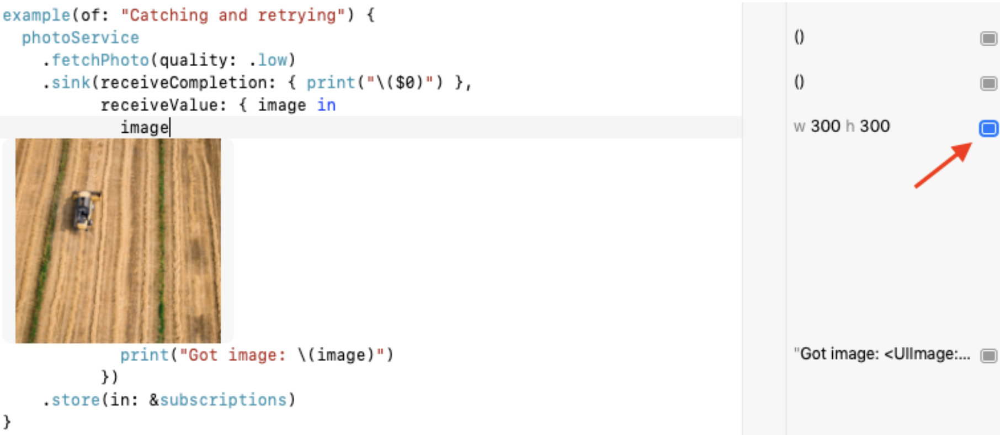

Next, change the quality from .low to .high and run the playground again. You'll see the following output:

```
——— Example of: Catching and retrying ———
failure(Failed fetching image with high quality)
```

As mentioned earlier, asking for a high-quality image will fail. This is your starting point! There are a few things that you could improve here. You'll start by retrying upon a failure.

Many times, when you request a resource or perform some computation, a failure might be a one-off occurrence resulting from a bad network connection or another unavailable resource.

In these cases, you'd usually write a big ol' mechanism to retry different pieces of work while tracking the number of attempts and deciding what to do if all attempts fail. Fortunately, Combine makes this much, much simpler.

Like all good things in Combine, there's an operator for that!

The retry operator accepts a number. If the publisher fails, it will resubscribe to the upstream and retry up to the number of times you specify. If all retries fail, it simply pushes the error downstream as it would without the retry operator.

It's time for you to try this. Below the line fetchPhoto(quality: .high), add the following line:

```swift
.retry(3)
```

Wait, is that it?! Yup. That's it.

You get a free retry mechanism for every piece of work wrapped in a publisher, and it's as easy as calling this simple retry operator.

Before running your playground, add this code between the calls to fetchPhoto and retry:

```swift
.handleEvents(
  receiveSubscription: { _ in print("Trying ...") },
  receiveCompletion: {
    guard case .failure(let error) = $0 else { return }
    print("Got error: \(error)")
  }
)
```

This code will help you see when retries occur — it prints out the subscriptions and failures that occur in fetchPhoto.

Now you're ready! Run your playground and wait for it to complete. You'll see the following output:

```swift
——— Example of: Catching and retrying ———
Trying ...
Got error: Failed fetching image with high quality
Trying ...
Got error: Failed fetching image with high quality
Trying ...
Got error: Failed fetching image with high quality
Trying ...
Got error: Failed fetching image with high quality
failure(Failed fetching image with high quality)
```

As you can see, there are four attempts. The initial attempt, plus three retries triggered by the retry operator. Because fetching a high-quality photo constantly fails, the operator exhausts all its retry attempts and pushes the error down to sink.

Replace the following call to fetchPhoto:

```swift
.fetchPhoto(quality: .high)
```

With:

```swift
.fetchPhoto(quality: .high, failingTimes: 2)
```

The faliingTimes parameter will limit the number of times that fetching a high-quality image will fail. In this case, it will fail the first two times you call it, then succeed.

Run your playground again, and take a look at the output:

```
——— Example of: Catching and retrying ———
Trying ...
Got error: Failed fetching image with high quality
Trying ...
Got error: Failed fetching image with high quality
Trying ...
Got image: <UIImage:0x600001268360 named(hq.jpg) {1835, 2446}>
finished
```

As you can see, this time there are three attempts, the initial one plus two more retries. The method fails for the first two attempts, and then succeeds and returns this gorgeous, high-quality photo of a combine in a field:

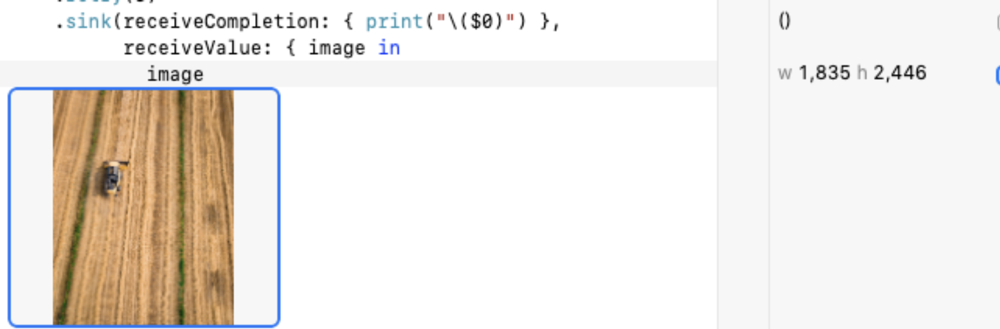

Awesome! But there's still one final feature you'll improve in this service call. Your product folks asked that you fall back to a low-quality image if fetching a high-quality image fails. If fetching a low-quality image fails as well, you should fall back to a hard-coded image.

You'll start with the latter of the two tasks. Combine includes a handy operator called replaceError(with:) that lets you fall back to a default value of the publisher's type if an error occurs. This also changes your publisher's Failure type to Never, since you replace every possible failure with a fallback value.

First, remove the failingTimes argument from fetchPhoto, so it constantly fails as it did before.

Then add the following line, immediately after the call to retry:

```swift
.replaceError(with: UIImage(named: "na.jpg")!)
```

Run your playground again and take a look at the image result this time around. After four attempts — i.e., the initial plus three retries  — you fall back to a hard-coded image on disk:

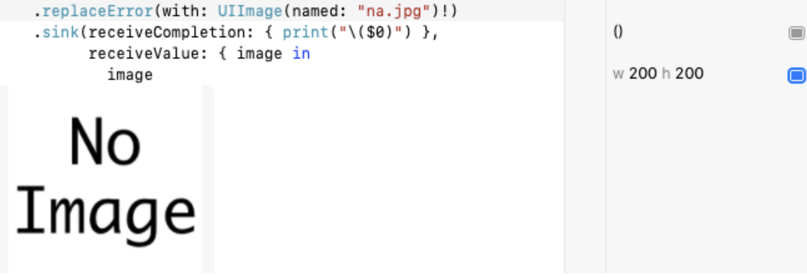

Also, looking at the console output reveals what you'd expect: There are four failed attempts, followed by the hard-coded fallback image:

```
——— Example of: Catching and retrying ———
Trying ...
Got error: Failed fetching image with high quality
Trying ...
Got error: Failed fetching image with high quality
Trying ...
Got error: Failed fetching image with high quality
Trying ...
Got error: Failed fetching image with high quality
Got image: <UIImage:0x6000020e9200 named(na.jpg) {200, 200}>
finished
```

Now, for the second task and final part of this chapter: Fall back to a low-quality image if the high-quality image fails. Combine provides the perfect operator for this task, called catch. It lets you catch a failure from a publisher and recover from it with a different publisher.

```swift
To see this in action, add the following code after retry, but before replaceError(with:):
.catch { error -> PhotoService.Publisher in
  print("Failed fetching high quality, falling back to low quality")
  return photoService.fetchPhoto(quality: .low)
}
```

Run your playground one final time and take a look at the console:

```
——— Example of: Catching and retrying ———
Trying ...
Got error: Failed fetching image with high quality
Trying ...
Got error: Failed fetching image with high quality
Trying ...
Got error: Failed fetching image with high quality
Trying ...
Got error: Failed fetching image with high quality
Failed fetching high quality, falling back to low quality
Got image: <UIImage:0x60000205c480 named(lq.jpg) {300, 300}>
finished
```

Like before, the initial attempt plus three retries to fetch the high-quality image fail. Once the operator has exhausted all retries, catch plays its role and subscribes to photoService.fetchPhoto, requesting a low-quality image. This results in a fallback from the failed high-quality request to the successful low-quality request.


### Key points

- Publishers with a Failure type of Never are guaranteed to not emit a failure completion event.

- Many operators only work with infallible publishers. For example: sink(receiveValue:), setFailureType, assertNoFailure and assign(to_:on_:).
- The try-prefixed operators let you throw errors from within them, while non-try operators do not.
- Since Swift doesn't support typed throws, calling try-prefixed operators erases the publisher's Failure to a plain Swift Error.
- Use mapError to map a publisher's Failure type, and unify all failure types in your publisher to a single type.
- When creating your own API based on other publishers with their own Failure types, wrap all possible errors into your own Error type to unify them and hide your API's implementation details.
- You can use the retry operator to resubscribe to a failed publisher for an additional number of times.
- replaceError(with:) is useful when you want to provide a default fallback value for your publisher, in case of failure.
- Finally, you may use catch to replace a failed publisher with a different fallback publisher.


### Where to go from here?

Congratulations on getting to the end of this chapter. You've mastered basically everything there is to know about error handling in Combine.

You only experimented with the tryMap operator in the try* operators section of this chapter. You can find a full list of try-prefixed operators in Apple's official documentation at https://apple.co/3233VRB.

With your mastery of error handling, it's time to learn about one of the lower-level, but most crucial topics in Combine: Schedulers. Continue to the next chapter to find out what schedulers are and how to use them.


## Chapter 17: Schedulers

As you’ve been progressing through this book, you’ve read about this or that operator taking a scheduler as a parameter. Most often you’d simply use DispatchQueue.main because it’s convenient, well understood and brings a reassuring feeling of safety. This is the comfort zone!

As a developer, you have at least a general idea of what a DispatchQueue is. Besides DispatchQueue.main, you most certainly already used either one of the global, concurrent queues, or created a serial dispatch queue to run actions serially on. Don’t worry if you haven’t or don’t remember the details. You’ll re-assess some important information about dispatch queues throughout this chapter.

But then, why does Combine need a new similar concept? It is now time for you to dive into the real nature, meaning and purpose of Combine schedulers!

In this chapter, you’ll learn why the concept of schedulers came about. You’ll explore how Combine makes asynchronous events and actions easy to work with and, of course, you’ll get to experiment with all the schedulers that Combine provides.


### An introduction to schedulers

Per Apple’s documentation, a scheduler is a protocol that defines when and how to execute a closure. Although the definition is correct, it’s only part of the story.

A scheduler provides the context to execute a future action, either as soon as possible or at a future date. The action is a closure as defined in the protocol itself. But the term closure can also hide the delivery of some value by a Publisher, performed on a particular scheduler.

Did you notice that this definition purposely avoids any reference to threading? This is because the concrete implementation is the one that defines where the “context” provided by the scheduler protocol executes!

The exact details of which thread your code will execute on therefore depends on the scheduler you pick.

Remember this important concept: A scheduler is not equal to a thread. You’ll get into the details of what this means for each scheduler later in this chapter.

Let’s look at the concept of schedulers from an event flow standpoint:

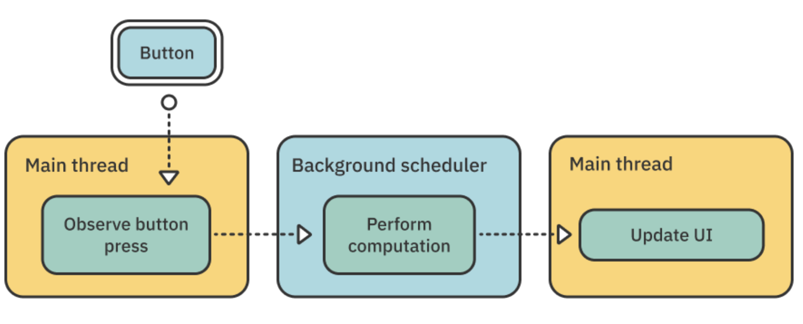

What you see in the figure above:

- A user action (button press) occurs on the main (UI) thread.

- It triggers some work to process on a background scheduler.

- Final data to display is delivered to subscribers on the main thread, so subscribers can update the app‘s UI.

You can see how the notion of scheduler is deeply rooted in the notions of foreground/background execution. Moreover, depending on the implementation you pick, work can be serialized or parallelized.

Therefore, to fully understand schedulers, you need to look at which classes conform to the Scheduler protocol.

But first, you need to learn about two important operators related to schedulers!

> Note: In the next section, you’ll primarily use DispatchQueue which conforms to Combine‘s Scheduler protocol.


### Operators for scheduling

The Combine framework provides two fundamental operators to work with schedulers:

- subscribe(on:) and subscribe(on:options:) creates the subscription (start the work) on the specified scheduler.
- receive(on:)and receive(on:options:) delivers values on the specified scheduler.

In addition, the following operators take a scheduler and scheduler options as parameters. You learned about them in Chapter 6, “Time Manipulation Operators:”

- debounce(for:scheduler:options:)

- delay(for:tolerance:scheduler:options:)

- measureInterval(using:options:)

- throttle(for:scheduler:latest:)

- timeout(_:scheduler:options:customError:)

Don’t hesitate to take a look back at Chapter 6 if you need to refresh your memory on these operators. Then you can look into the two new ones.


**Introducing subscribe(on:)**

Remember — a publisher is an inanimate entity until you subscribe to it. But what happens when you subscribe to a publisher? Several steps take place:

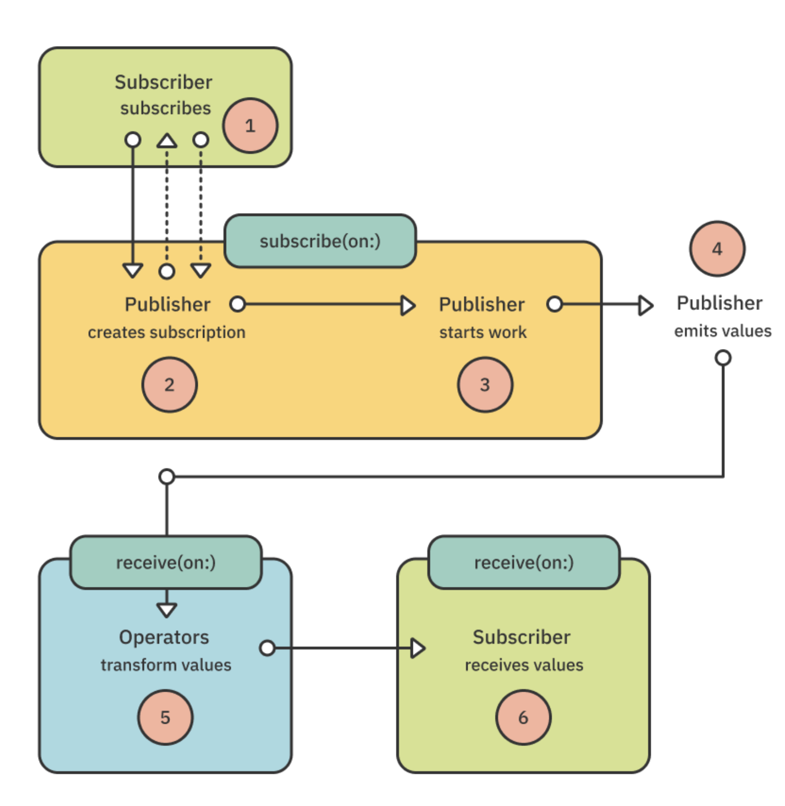

1. Publisher receives the subscriber and creates a Subscription.
2. Subscriber receives the subscription and requests values from the publisher (dotted lines).
3. Publisher starts work (via the Subscription).
4. Publisher emits values (via the Subscription).
5. Operators transform values.
6. Subscriber receives the final values.

Steps one, two and three usually happen on the thread that is current when your code subscribes to the publisher. But when you use the subscribe(on:) operator, all these operations run on the scheduler you specified.

> Note: You’ll come back to this diagram when looking at the receive(on:) operator. You’ll then understand the two boxes at the bottom with steps labeled five and six.


You may want a publisher to perform some expensive computation in the background to avoid blocking the main thread. The simple way to do this is to use subscribe(on:).

It’s time to look at an example!


Open Starter.playground in the projects folder and select the subscribeOn-receiveOn page. Make sure the Debug area is displayed, then start by adding the following code:

```swift
// 1
let computationPublisher = Publishers.ExpensiveComputation(duration: 3)

// 2
let queue = DispatchQueue(label: "serial queue")

// 3
let currentThread = Thread.current.number
print("Start computation publisher on thread \(currentThread)")
```

Here‘s a breakdown of the above code:

1. This playground defines a special publisher in Sources/Computation.swift called ExpensiveComputation, which simulates a long-running computation that emits a string after the specified duration.

2. A serial queue you’ll use to trigger the computation on a specific scheduler. As you learned above, DispatchQueue conforms to the Scheduler protocol.

3. You obtain the current execution thread number. In a playground, the main thread (thread number 1) is the default thread your code runs in. The number extension to the Thread class is defined in Sources/Thread.swift.

> Note: The details of how the ExpensiveComputation publisher is implemented do not matter for now. You will learn more about creating your own publishers in the next chapter, “Custom Publishers & Handling Backpressure.”


Back to the subscribeOn-receiveOn playground page, you’ll need to subscribe to computationPublisher and display the value it emits:

```swift
let subscription = computationPublisher
  .sink { value in
    let thread = Thread.current.number
    print("Received computation result on thread \(thread): '\(value)'")
  }
```

Execute the playground and look at the output:

```
Start computation publisher on thread 1
ExpensiveComputation subscriber received on thread 1
Beginning expensive computation on thread 1
Completed expensive computation on thread 1
Received computation result on thread 1 'Computation complete'
```

Let’s dig into the various steps to understand what happens:

- Your code is running on the main thread. From there, it subscribes to the computation publisher.

- The ExpensiveComputation publisher receives a subscriber.

- It creates a subscription, then starts the work.

- When work completes, publisher delivers the result through the subscription and completes.

You can see that all of this happen on thread 1 which is the main thread.

Now, change the publisher subscription to insert a subscribe(on:) call:

```swift
let subscription = computationPublisher
  .subscribe(on: queue)
  .sink { value in...
```

Execute the playground again to see output similar to the following:

```
Start computation publisher on thread 1
ExpensiveComputation subscriber received on thread 5
Beginning expensive computation from thread 5
Completed expensive computation on thread 5
Received computation result on thread 5 'Computation complete'
```

Ah! This is different! Now you can see that you’re still subscribing from the main thread, but Combine delegates to the queue you provided to perform the subscription effectively. The queue runs the code on one of its threads. Since the computation starts and completes on thread 5 and then emits the resulting value from this thread, your sink receives the value on this thread as well.

> Note: Due to the dynamic thread management nature of DispatchQueue, you may see different thread numbers in this log and further logs in this chapter. What matters is consistency: The same thread number should be shown at the same steps.


But what if you wanted to update some on-screen info? You would need to do something like DispatchQueue.main.async { ... } in your sink closure, just to make sure you’re performing UI updates from the main thread.

There is a more effective way to do this with Combine!


**Introducing receive(on:)**

The second important operator you want to know about is receive(on:). It lets you specify which scheduler should be used to deliver values to subscribers. But what does this mean?

Insert a call to receive(on:) just before your sink in the subscription:

```swift
let subscription = computationPublisher
  .subscribe(on: queue)
  .receive(on: DispatchQueue.main)
  .sink { value in
```

Then, execute the playground again. Now you see this output:

```
Start computation publisher on thread 1
ExpensiveComputation subscriber received on thread 4
Beginning expensive computation from thread 4
Completed expensive computation on thread 4
Received computation result on thread 1 'Computation complete'
```

> Note: You may see the second message (“ExpensiveComputation subscriber received...”) on a different thread than the two next steps. Due to internal plumbing in Combine, this step and the next may execute asynchronously on the same queue. Since Dispatch dynamically manages its own thread pool, you may see a different thread number for this line and the next, but you won’t see thread 1.

Success! Even though the computation works and emits results from a background thread, you are now guaranteed to always receive values on the main queue. This is what you need to perform your UI updates safely.

In this introduction to scheduling operators, you used DispatchQueue. Combine extends it to implement the Scheduler protocol, but it’s not the only one! It’s time to dive into schedulers!


### Scheduler implementations

Apple provides several concrete implementations of the Scheduler protocol:

- ImmediateScheduler: A simple scheduler that executes code immediately on the current thread, which is the default execution context unless modified using subscribe(on:), receive(on:) or any of the other operators which take a scheduler as parameter.
- RunLoop: Tied to Foundation’s Thread object.
- DispatchQueue: Can either be serial or concurrent.
- OperationQueue: A queue that regulates the execution of work items.

In the rest of this chapter, you’ll go over all of these and their specific details.

> Note: One glaring omission here is the lack of a TestScheduler, an indispensable part of the testing portion of any reactive programming framework. Without such a virtual, simulated scheduler, it’s challenging to test your Combine code thoroughly. You’ll explore more details about this particular kind of scheduler in Chapter 19, “Testing.”


#### ImmediateScheduler

The easiest entry in the scheduler category is also the simplest one the Combine framework provides: ImmediateScheduler. The name already spoils the details, so have a look at what it does!

Open the ImmediateScheduler page of the playground. You won’t need the debug area for this one, but make sure you make the Live View visible. If you’re not sure how to do that, see the beginning of Chapter 6, “Time Manipulation Operators.”

You’re going to use some fancy new tools built into this playground to follow your publisher values across schedulers!

Start by creating a simple timer as you did in previous chapters:

```swift
let source = Timer
  .publish(every: 1.0, on: .main, in: .common)
  .autoconnect()
  .scan(0) { counter, _ in counter + 1 }
```

Next, prepare a closure that creates a publisher. You’ll make use of a custom operator defined in the Sources/Record.swift: recordThread(using:). This operator records the thread that is current at the time the operator sees a value passing through, and can record multiple times from the publisher source to the final sink.

> Note: This recordThread(using:) operator is for testing purposes only, as the operator changes the type of data to an internal value type. The details of its implementation are beyond the scope of this chapter, but the adventurous reader may find it interesting to look into.


Add this code:

```swift
// 1
let setupPublisher = { recorder in
  source
    // 2
    .recordThread(using: recorder)
    // 3
    .receive(on: ImmediateScheduler.shared)
    // 4
    .recordThread(using: recorder)
    // 5
    .eraseToAnyPublisher()
}

// 6
let view = ThreadRecorderView(title: "Using ImmediateScheduler", setup: setupPublisher)
PlaygroundPage.current.liveView = UIHostingController(rootView: view)
```

In the above code, you:

1. Prepare a closure that returns a publisher, using the given recorder object to setup current thread recording via recordThread(using:).
2. At this stage, the timer emitted a value, so you record the current thread. Can you already guess which one it is?
3. Make sure the publisher delivers values on the shared ImmediateScheduler.
4. Record which thread you’re now on.
5. The closure must return an AnyPublisher type. This is mainly for convenience in the internal implementation.
6. Prepare and instantiate a ThreadRecorderView which displays the migration of a published value across threads at various record points.

Execute the playground page and look at the output after a few seconds:

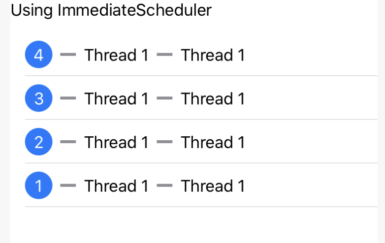

This representation shows each value the source publisher (the timer) emits. On each line, you see the threads the value is going through. Every time you add a recordThread(using:) operator, you see an additional thread number logged on the line.

Here you see that at the two recording points you added, the current thread was the main thread. This is because the ImmediateScheduler “schedules” immediately on the current thread.

To verify this, you can do a little experiment! Go back to your setupPublisher closure definition, and just before the first recordThread line, insert the following:

```swift
.receive(on: DispatchQueue.global())
```

This requests that values the source emits be further made available on the global concurrent queue. Is this going to yield interesting results? Execute the playground to find out:

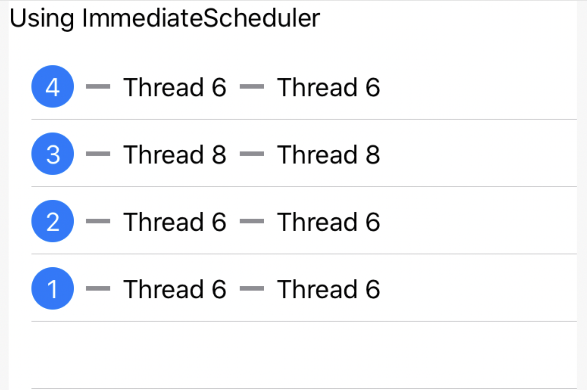

This is completely different! Can you guess why the thread changes all the time? You’ll learn more about this in the coverage of DispatchQueue in this chapter!


**ImmediateScheduler options**

With most of the operators accepting a Scheduler in their arguments, you can also find an options argument which accepts a SchedulerOptions value. In the case of ImmediateScheduler, this type is defined as Never so when using ImmediateScheduler, you should never pass a value for the options parameter of the operator.

**ImmediateScheduler pitfalls**

One specific thing about ImmediateScheduler is that it is immediate. You won’t be able to use any of the schedule(after:) variants of the Scheduler protocol, because the SchedulerTimeType you need to specify a delay has no public initializer and is meaningless for immediate scheduling.

Similar but different pitfalls exist for the second type of Scheduler you’ll learn about in this chapter: RunLoop.


#### RunLoop scheduler

Long-time iOS and macOS developers are familiar with RunLoop. Predating DispatchQueue, it is a way to manage input sources at the thread level, including in the Main (UI) thread. Your application’s main thread still has an associated RunLoop. You can also obtain one for any Foundation Thread by calling RunLoop.current from the current thread.

> Note: Nowadays RunLoop is a less useful class, as DispatchQueue is a sensible choice in most situations. This said, there are still some specific cases where run loops are useful. For example, Timer schedules itself on a RunLoop. UIKit and AppKit rely on RunLoop and its execution modes for handling various user input situations. Describing everything about RunLoop is outside the scope of this book.


To have a look at RunLoop, open the RunLoop page in the playground. The Timer source you used earlier is the same, so it’s already written for you. Add this code after it:

```swigt
let setupPublisher = { recorder in
  source
    // 1
    .receive(on: DispatchQueue.global())
    .recordThread(using: recorder)
    // 2
    .receive(on: RunLoop.current)
    .recordThread(using: recorder)
    .eraseToAnyPublisher()
}

let view = ThreadRecorderView(title: "Using RunLoop", setup: setupPublisher)
PlaygroundPage.current.liveView = UIHostingController(rootView: view)
```

1. As you previously did, you first make values go through the global concurrent queue. Why? Because it’s fun!
2. Then, you ask values to be received on RunLoop.current.

But what is RunLoop.current? It is the RunLoop associated with the thread that was current when the call was made. The closure is being called by ThreadRecorderView, from the main thread to set up the publisher and the recorder. Therefore, RunLoop.current is the main thread’s RunLoop.

Execute the playground to see what happens:

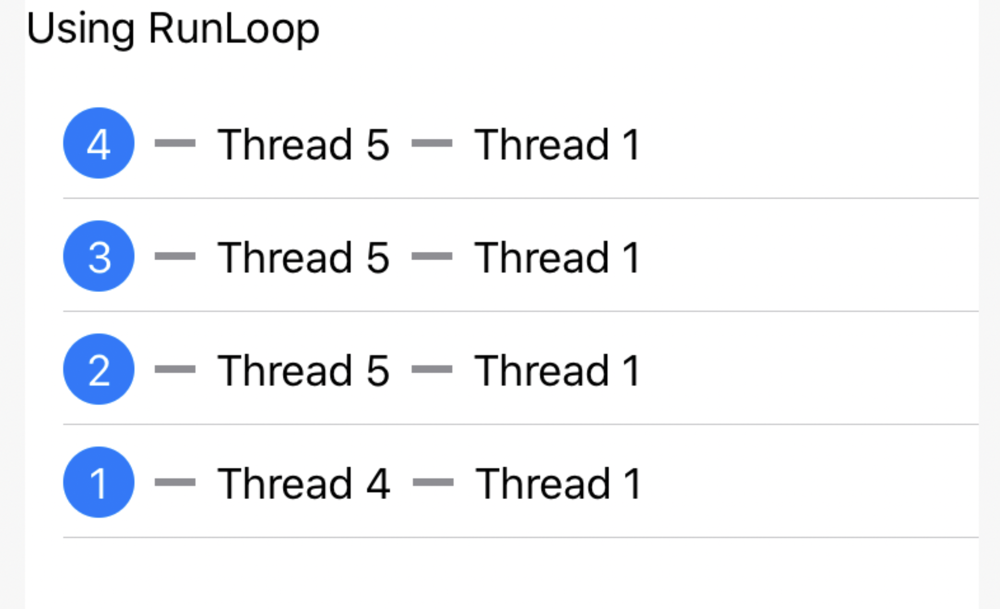

As you requested it, the first recordThread shows that each value goes through one of the global concurrent queue’s threads, then continues on the main thread.

**A little comprehension challenge**

What would happen if you had used subscribe(on: DispatchQueue.global()) instead of receive(on:) the first time? Try it!

You see that everything is recorded on thread one. It may not be obvious at first, but it is entirely logical. Yes, the publisher was subscribed to on the concurrent queue. But remember that you are using a Timer which is emitting its values... on the main RunLoop! Therefore, regardless of the scheduler you pick to subscribe to this publisher on, values will always begin their journey on the main thread.

**Scheduling code execution with RunLoop**

The Scheduler lets you schedule code that executes as soon as possible, or after a future date. While it was not possible to use the latter form with ImmediateScheduler, RunLoop is perfectly capable of deferred execution.

Each scheduler implementation defines its own SchedulerTimeType. It makes things a little complicated to grasp until you figure out what type of data to use. In the case of RunLoop, the SchedulerTimeType value is a Date.

You’ll schedule an action that will cancel the ThreadRecorderView’s subscription after a few seconds. It turns out the ThreadRecorder class has an optional Cancellable that can be used to stop its subscription to the publisher.

First, you need a variable to hold a reference to the ThreadRecorder. At the beginning of the page, add this line:

```swift
var threadRecorder: ThreadRecorder? = nil
```

Now you need to capture the thread recorder instance. The best place to do this is on the setupPublisher closure. But how? You could:

- Add explicit types to the closure, assign the threadRecorder variable and return the publisher. You’ll need to add explicit types because the poor Swift compiler will complain “may be unable to infer complex closure return type.
- Use some operator to capture the recorder at subscription time.

Go wild and do the latter!

Add this line in your setupPublisher closure before eraseToAnyPublisher():

```swift
.handleEvents(receiveSubscription: { _ in threadRecorder = recorder })
```

Interesting choice to capture the recorder!

> Note: You already learned about handleEvents in Chapter 10, “Debugging.” It has a long signature and lets you execute code at various points in the lifecycle of a publisher (in the reactive programming terminology this is called injecting side effects) without actually interacting with the values it emits. In this case, you’re intercepting the moment when the recorder subscribes to the publisher, so as to capture the recorder in your global variable. Not pretty, but it does the job in a fun way!

Now you’re all set and can schedule some action after a few seconds. Add this code at the end of the page:

```swift
RunLoop.current.schedule(
  after: .init(Date(timeIntervalSinceNow: 4.5)),
  tolerance: .milliseconds(500)) {
    threadRecorder?.subscription?.cancel()
  }
```


This schedule(after:tolerance:) lets you schedule when the provided closure should execute along with the tolerable drift in case the system can’t precisely execute the code at the selected time. You add 4.5 seconds to the current date to allow four values to be sent before the execution.

Run the playground. You can see that the list stops updating after the fourth item. This is your cancellation mechanism working!

> Note: If you only get three values, it might mean your Mac is running a little slow and cannot accommodate a half-second tolerance, so you can try bumping the dates out more, e.g., set timeIntervaleSinceNow to 5.0 and tolerance to 1.0.


**RunLoop options**

Like ImmediateScheduler, RunLoop does not offer any suitable options for the calls which take a SchedulerOptions parameter.

**RunLoop pitfalls**

Usages of RunLoop should be restricted to the main thread’s run loop, and to the RunLoop available in Foundation threads that you control if needed. That is, anything you started yourself using a Thread object.

One particular pitfall to avoid is using RunLoop.current in code executing on a DispatchQueue. This is because DispatchQueue threads can be ephemeral, which makes them nearly impossible to rely on with RunLoop.

You are now ready to learn about the most versatile and useful scheduler: DispatchQueue!


#### DispatchQueue scheduler

Throughout this chapter and previous chapters, you’ve been using DispatchQueue in various situations. It comes as no surprise that DispatchQueue conforms to the Scheduler protocol and is fully usable with all operators that take a Scheduler as a parameter.

But first, a quick refresher on dispatch queues. The Dispatch framework is a powerful component of Foundation that allows you to execute code concurrently on multicore hardware by submitting work to dispatch queues managed by the system.

A DispatchQueue can be either serial (the default) or concurrent. A serial queue executes all the work items you feed it, in sequence. A concurrent queue will start multiple work items in parallel, to maximize CPU usage. Both queue types have different usages:

- A serial queue is typically used to guarantee that some operations do not overlap. So, they can use shared resources without locking if all operations occur in the same queue.

- A concurrent queue will execute as many operations concurrently as possible. So, it is better suited for pure computation.


**Queues and threads**

The most familiar queue you work with all the time is DispatchQueue.main. It directly maps to the main (UI) thread, and all operations executing on this queue can freely update the user interface. UI updates are only permitted from the main thread.

All other queues, serial or concurrent, execute their code in a pool of threads managed by the system. Meaning you should never make any assumption about the current thread in code that runs in a queue. In particular, you should not schedule work using RunLoop.current because of the way DispatchQueue manages its threads.

All dispatch queues share the same pool of threads. A serial queue you give work to perform will use any available thread in that pool. A direct consequence is that two successive work items from the same queue may use different threads while still executing sequentially.

This is an important distinction: When using subscribe(on:), receive(on:) or any of the other operators taking a Scheduler parameter, you should never assume that the thread backing the scheduler is the same every time.


**Using DispatchQueue as a scheduler**

It’s time for you to experiment! As usual, you’re going to use a timer to emit values and watch them migrate across schedulers. But this time around, you’re going to create the timer using a Dispatch Queue timer.

Open the playground page named DispatchQueue. First, you‘ll create a couple queues to work with. Add this code to your playground:

```swift
let serialQueue = DispatchQueue(label: "Serial queue")
let sourceQueue = DispatchQueue.main
```

You’ll use sourceQueue to publish values from a timer, and later use serialQueue to experiment with switching schedulers.

Now add this code:

```swift
// 1
let source = PassthroughSubject<Void, Never>()

// 2
let subscription = sourceQueue.schedule(after: sourceQueue.now,
                                        interval: .seconds(1)) {
  source.send()
}
```

1. You’ll use a Subject to emit a value when the timer fires. You don’t care about the actual output type, so you just use Void.

2. As you learned in Chapter 11, “Timers,” queues are perfectly capable of generating timers, but there is no Publisher API for queue timers. It is a surprising omission from the API! You have to use the repeating variant of the schedule() method from the Schedulers protocol. It starts immediately and returns a Cancellable. Every time the timer fires, you‘ll send a Void value through the source subject.

> Note: Did you notice how you’re using the now property to specify the starting time of the timer? This is part of the Scheduler protocol and returns the current time expressed using the scheduler’s SchedulerTimeType. Each class implementing the Scheduler protocol defines its own type for this.

Now, you can start exercising scheduler hopping. Setup your Publisher by adding the following code:

```swift
let setupPublisher = { recorder in
  source
    .recordThread(using: recorder)
    .receive(on: serialQueue)
    .recordThread(using: recorder)
    .eraseToAnyPublisher()
}
```

Nothing new here, you’ve coded similar patterns several times in this chapter.

Then, as in your the previous examples, set up the display:

```swift
let view = ThreadRecorderView(title: "Using DispatchQueue",
                              setup: setupPublisher)
PlaygroundPage.current.liveView = UIHostingController(rootView: view)
```

Execute the playground. Easy enough, you see what was intended:

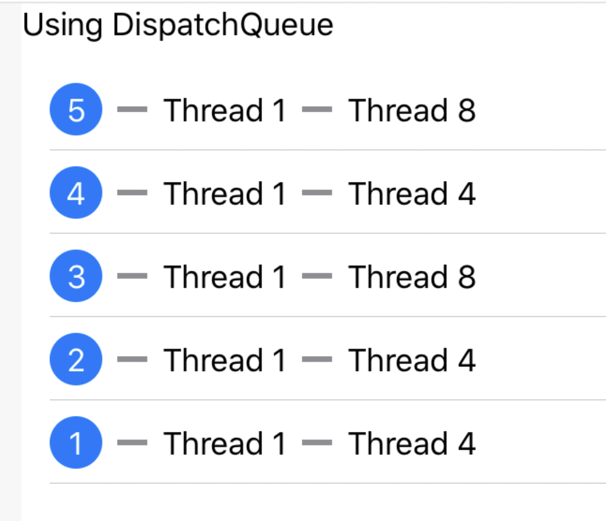

1. The timer fires on the main queue and sends Void values through the subject.

2. The publisher receive values on your serial queue.

Did you notice how the second recordThread(using:) records changes in the current thread after the receive(on:) operator? This is a perfect example of how DispatchQueue makes no guarantee over which thread each work item executes on. In the case of receive(on:), a work item is a value that hops from the current scheduler to another.

Now, what would happen if you emitted values from the serial queue and kept the same receive(on:) operator? Would values still change threads on the go?

Try it! Go back to the beginning of the code and change the sourceQueue definition to:

```swift
let sourceQueue = serialQueue
```

Now, execute the playground again:

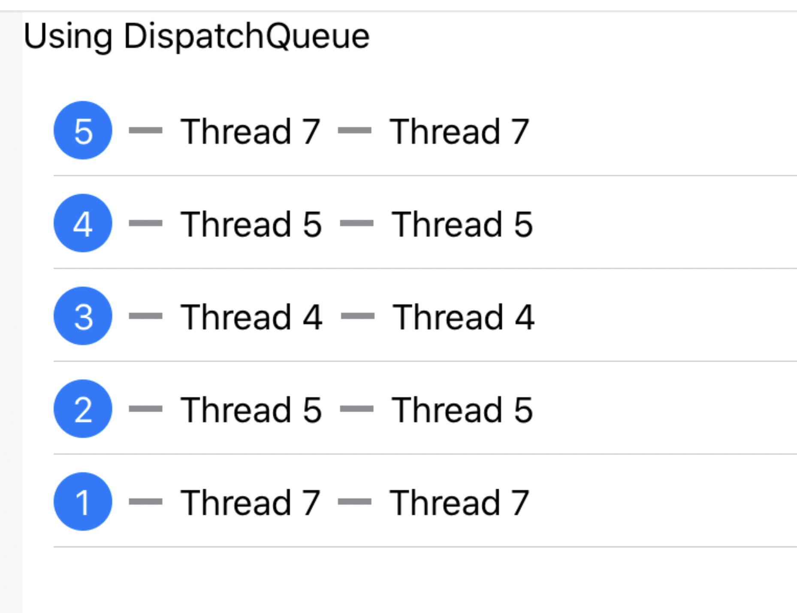


Interesting! Again you see the no-thread-guarantee effect of DispatchQueue, but you also see that the receive(on:) operator never switches threads! It looks like some optimization is internally happening to avoid extra switching. You’ll explore this in this chapter’s challenge!

**DispatchQueue options**

DispatchQueue is the only scheduler providing a set of options you can pass when operators take a SchedulerOptions argument. These options mainly revolve around specifying QoS (Quality of Service) values independently of those already set on the DispatchQueue. There are some additional flags for work items, but you won’t need them in the vast majority of situations.

To see how you would specify the QoS though, modify the receive(on:options:) in your setupPublisher to the following:

```swift
.receive(
  on: serialQueue,
  options: DispatchQueue.SchedulerOptions(qos: .userInteractive)
)
```

You pass an instance of DispatchQueue.SchedulerOptions to options that specifies the highest quality of service: .userInteractive. It instructs the OS to make its best effort to prioritize delivery of values over less important tasks. This is something you can use when you want to update the user interface as fast as possible.  To the contrary, if there is less pressure for speedy delivery, you could use the .background quality of service. In the context of this example you won’t see a real difference since it’s the only task running.

Using these options in real applications helps the OS deciding which task to schedule first in situations where you have many queues busy at the same time. It really is fine tuning your application performance!

You’re nearly done with schedulers! Hang on a little bit more. You have one last scheduler to learn about.


#### OperationQueue

The last scheduler you will learn about in this chapter is OperationQueue. The documentation describes it as a queue that regulates the execution of operations. It is a rich regulation mechanism that lets you create advanced operations with dependencies. But in the context of Combine, you will use none of these mechanisms.

Since OperationQueue uses Dispatch under the hood, there is little difference on the surface in using one of the other. Or is there?

Give it a go in a simple example. Open the OperationQueue playground page and start coding:

```
let queue = OperationQueue()

let subscription = (1...10).publisher
  .receive(on: queue)
  .sink { value in
    print("Received \(value)")
  }
```

You’re creating a simple publisher emitting numbers between 1 and 10, making sure values arrive on the OperationQueue you created. You then print the value in the sink.

Can you guess what happens? Expand the Debug area and execute the playground:

```
Received 4
Received 3
Received 2
Received 7
Received 5
Received 10
Received 6
Received 9
Received 1
Received 8
```

This is puzzling! Items are emitted in order but arrive out of order! How can this be? To find out, you can change the print line to display the current thread number:

```swift
print("Received \(value) on thread \(Thread.current.number)")
```

Execute the playground again:

```
Received 1 on thread 5
Received 2 on thread 4
Received 4 on thread 7
Received 7 on thread 8
Received 6 on thread 9
Received 10 on thread 10
Received 5 on thread 11
Received 9 on thread 12
Received 3 on thread 13
Received 8 on thread 14
```

Ah-ha! As you can see see, each value is received on a different thread! If you look up the documentation about OperationQueue, there is a note about threading which says that OperationQueue uses the Dispatch framework (hence DispatchQueue) to execute operations. It means it doesn‘t guarantee it’ll use the same underlying thread for each delivered value.

Moreover, there is one parameter in each OperationQueue that explains everything: It’s maxConcurrentOperationCount. It defaults to a system-defined number that allows an operation queue to execute a large number of operations concurrently. Since your publisher emits all its items at roughly the same time, they get dispatched to multiple threads by Dispatch’s concurrent queues!

Make a little modification to your code. After defining queue, add this line:

```swift
queue.maxConcurrentOperationCount = 1
```

Then run the page and look at the debug area:

```
Received 1 on thread 3
Received 2 on thread 3
Received 3 on thread 3
Received 4 on thread 3
Received 5 on thread 4
Received 6 on thread 3
Received 7 on thread 3
Received 8 on thread 3
Received 9 on thread 3
Received 10 on thread 3
```

This time, you get true sequential execution — setting maxConcurrentOperationCount to 1 is equivalent to using a serial queue — and your values arrive in order.

**OperationQueue options**

There is no usable SchedulerOptions for OperationQueue. It’s actually type aliased to RunLoop.SchedulerOptions, which itself provides no option.

**OperationQueue pitfalls**

You just saw that OperationQueue executes operations concurrently by default. You need to be very aware of this as it can cause you trouble: By default, an OperationQueue behaves like a concurrent DispatchQueue.

It can be a good tool, though, when you have significant work to perform every time a publisher emits a value. You can control the load by tuning the maxConcurrentOperationCount parameter.


### Challenges

Phew, this was a long and complex chapter! Congratulations on making it so far! Have some brainpower left for a couple of challenges? Let’s do it!

#### Challenge 1: Stop the timer

This is an easy one. In this chapter’s section about DispatchQueue you created a cancellable timer to feed your source publisher with values.

Devise two different ways of stopping the timer after 4 seconds. Hint: You’ll need to use DispatchQueue.SchedulerTimeType.advanced(by:).

Found the solutions? Compare them to the ones in the projects/challenge/challenge1/ final playground:

1. Use the serial queue’s scheduler protocol schedule(after:_:) method to schedule the execution of a closure which cancels the subscription.

2. Use serialQueue’s normal asyncAfter(_:_:) method (pre-Combine) to do the same thing.


#### Challenge 2: Discover optimization

Earlier in this chapter, you read about an intriguing question: Is Combine optimizing when you’re using the same scheduler in successive receive(on:) calls, or is it a Dispatch framework optimization?

To find out, you’ll want to turn over to challenge 2. Your challenge is to devise a method that will bring an answer to this question. It’s not very complicated, but it’s not trivial either.

Could you find a solution? Read on to compare yours!

In the Dispatch framework, the initializer for DispatchQueue takes an optional target parameter. It lets you specify a queue on which to execute your code. In other words, the queue you create is just a shadow while the real queue on which your code executes is the target queue.

So the idea to try and guess whether Combine or Dispatch is performing the optimization is to use two different queues having one targeting the other. So at the Dispatch framework level, code all executes on the same queue, but (hopefully) Combine doesn’t notice.

Therefore, if you do this and see all values being received on the same thread, it is most likely that Dispatch is performing the optimizations for you. The steps you take to code the solution are:

Create the second serial queue, targeting the first one.

1. Add a .receive(on:) for the second serial queue, as well as a .recordThread step.

2. The full solution is available in the projects/challenge/challenge2 final playground.


### Key points

- A Scheduler defines the execution context for a piece of work.
- Apple‘s operating systems offer a rich variety of tools to help you schedule code execution.
- Combine tops these schedulers with the Scheduler protocol to help you pick the best one for the job in any given situation.
- Every time you use receive(on:), further operators in your publisher execute on the specified scheduler. That is, unless they themselves take a Scheduler parameter!


### Where to go from here?

You‘ve learned a lot, and your brain must be melting with all this information! The next chapter is even more involved as it teaches you about creating your own publishers and dealing with backpressure. Make sure you schedule a much-deserved break now, and come back refreshed for the next chapter!


## Chapter 18: Custom Publishers & Handling Backpressure

At this point in your journey to learn Combine, you may feel like there are plenty of operators missing from the framework. This may be particularly true if you have experience with other reactive frameworks, which typically provide a rich ecosystem of operators, both built-in and third-party. Combine allows you to create your own publishers. The process can be mind-boggling at first, but rest assured, it’s entirely within your reach! This chapter will show you how.

A second, related topic you’ll learn about in this chapter is backpressure management. This will require some explanation: What is this backpressure thing? Is that some kind of back pain induced by too much leaning over your chair, scrutinizing Combine code? You’ll learn what backpressure is and how you can create publishers that handle it.


### Creating your own publishers

The complexity of implementing your own publishers varies from “easy” to “pretty involved.” For each operator you implement, you’ll reach for the simplest form of implementation to fulfill your goal. In this chapter, you’ll look at three different ways of crafting your own publishers:

- Using a simple extension method in the Publisher namespace.

- Implementing a type in the Publishers namespace with a Subscription that produces values.

- Same as above, but with a subscription that transforms values from an upstream publisher.

> Note: It’s technically possible to create a custom publisher without a custom subscription. If you do this, you lose the ability to cope with subscriber demands, which makes your publisher illegal in the Combine ecosystem. Early cancellation can also become an issue. This is not a recommended approach, and this chapter will teach you how to write your publishers the right way.


### Publishers as extension methods

Your first task is to implement a simple operator just by reusing existing operators. This is as simple as you can get.

To do it, you’ll add a new unwrap() operator, which unwraps optional values and ignores their nil values. It’s going to be a very simple exercise, as you can reuse the existing compactMap(_:) operator, which does just that, although it requires you to provide a closure.

Using your new unwrap() operator will make your code easier to read, and it will make what you’re doing very clear. The reader won’t even have to look at the contents of a closure.

You’ll add your operator in the Publisher namespace, as you do with all other operators.

Open the starter playground for this chapter, which can be found in projects/Starter.playground and open its Unwrap operator page from the Project Navigator.

Then, add the following code:

```swift
extension Publisher {
  // 1
  func unwrap<T>() -> Publishers.CompactMap<Self, T> where Output == Optional<T> {
    // 2
    compactMap { $0 }
  }
}
```

1. The most complicated part of writing a custom operator as a method is the signature. Read on for a detailed description.

2. Implementation is trivial: Simply use compactMap(_:) on self!

The method signature can be mind-boggling to craft. Break it down to see how it works:

```swift
func unwrap<T>()
```

Your first step is to make the operator generic, as its Output is the type the upstream publisher‘s optional type wraps.

```swift
-> Publishers.CompactMap<Self, T>
```

The implementation uses a single compactMap(_:), so the return type derives from this. If you look at Publishers.CompactMap, you see it’s a generic type: public struct CompactMap<Upstream, Output>. When implementing your custom operator, Upstream is Self (the publisher you’re extending) and Output is the wrapped type.

```swift
where Output == Optional<T> {
```

Finally, you constrain your operator to Optional types. You conveniently write it to match the wrapped type T with your method’s generic type... et voilà!

> Note: When developing more complex operators as methods, such as when using a chain of operators, the signature can quickly become very complicated. A good technique is to make your operators return an AnyPublisher<OutputType, FailureType>. In the method, you’ll return a publisher that ends with eraseToAnyPublisher() to type-erase the signature.


**Testing your custom operator**

Now you can test your new operator. Add this code below the extension:

```swift
let values: [Int?] = [1, 2, nil, 3, nil, 4]

values.publisher
  .unwrap()
  .sink {
    print("Received value: \($0)")
  }
```

Run the playground and, as expected, only the non-nil values are printed out to the debug console:

```
Received value: 1
Received value: 2
Received value: 3
Received value: 4
```

Now that you’ve learned about making simple operator methods, it’s time to dive into richer, more complicated publishers. You can group publishers like so:

- Publishers that act as "producers" and directly produce values themselves.

- Publishers that act as "transformers," transforming values produced by upstream publishers.

In this chapter, you’ll learn how to use both, but you first need to understand the details of what happens when you subscribe to a publisher.


### The subscription mechanism

Subscriptions are the unsung heroes of Combine: While you see publishers everywhere, they are mostly inanimate entities. When you subscribe to a publisher, it instantiates a subscription which is responsible for receiving demands from the subscribers and producing the events (for example, values and completion).

Here are the details of the lifecycle of a subscription:

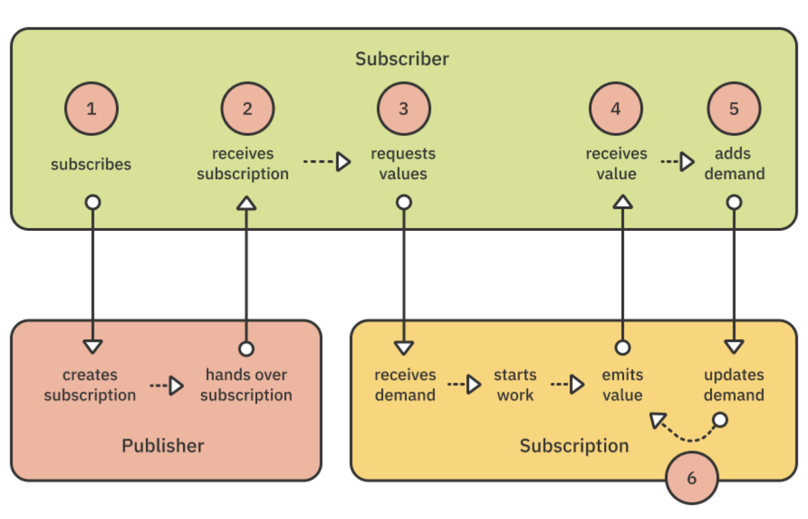

1. A subscriber subscribes to the publisher.
2. The publisher creates a Subscription then hands it over to the subscriber (calling receive(subscription:)).
3. The subscriber requests values from the subscription by sending it the number of values it wants (calling the subscription’s request(_:) method)._
4. The subscription begins the work and starts emitting values. It sends them one by one to the subscriber (calling the subscriber’s receive(_:) method).
5. Upon receiving a value, the subscriber returns a new Subscribers.Demand, which adds to the previous total demand.
6. The subscription keeps sending values until the number of values sent reaches the total requested number.

If the subscription has sent as many values as the subscriber has requested, it should wait for a new demand request before sending more. You can bypass this mechanism and keep sending values, but that breaks the contract between the subscriber and the subscription and can cause undefined behavior in your publisher tree based on Apple’s definition.

Finally, if there is an error or the subscription’s values source completes, the subscription calls the subscriber’s receive(completion:) method.


### Publishers emitting values

In Chapter 11, “Timers,” you learned about Timer.publish() but found that using Dispatch Queues for timers was somewhat uneasy. Why not develop your own timer based on Dispatch’s DispatchSourceTimer?

You’re going to do just that, checking out the details of the Subscription mechanism while you do.

To get started, open the DispatchTimer publisher page of the playground.

You’ll start by defining a configuration structure, which will make it easy to share the timer configuration between the subscriber and its subscription. Add this code to the playground:

```swift
struct DispatchTimerConfiguration {
  // 1
  let queue: DispatchQueue?
  // 2
  let interval: DispatchTimeInterval
  // 3
  let leeway: DispatchTimeInterval
  // 4
  let times: Subscribers.Demand
}
```

If you’ve ever used DispatchSourceTimer, some of these properties should look familiar to you:

1. You want your timer to be able to fire on a certain queue, but you also want to make the queue optional if you don’t care. In this case, the timer will fire on a queue of its choice.
2. The interval at which the timer fires, starting from the subscription time.
3. The leeway, which is the maximum amount of time after the deadline that the system may delay the delivery of the timer event.
4. The number of timer events you want to receive. Since you’re making your own timer, make it flexible and able to deliver a limited number of events before completing!


#### Adding the DispatchTimer publisher

You can now start creating your DispatchTimer publisher. It’s going to be straightforward because all the work occurs inside the subscription!

Add this code below your configuration:

```swift
extension Publishers {
  struct DispatchTimer: Publisher {
    // 5
    typealias Output = DispatchTime
    typealias Failure = Never
    // 6
    let configuration: DispatchTimerConfiguration
    

    init(configuration: DispatchTimerConfiguration) {
      self.configuration = configuration
    }

  }
}
```

5. Your timer emits the current time as a DispatchTime value. Of course, it never fails, so the publisher’s Failure type is Never.

6. Keeps a copy of the given configuration. You don’t use it right now, but you’ll need it when you receive a subscriber.

> Note: You’ll start seeing compiler errors as you write your code. Rest assured that you’ll remedy these by the time you’re done implementing the requirements.


Now, implement the Publisher protocol’s required receive(subscriber:) method by adding this code to the DispatchTimer definition, below your initializer:

```swift
// 7
func receive<S: Subscriber>(subscriber: S)
  where Failure == S.Failure,
        Output == S.Input {
  // 8
  let subscription = DispatchTimerSubscription(
    subscriber: subscriber,
    configuration: configuration
  )
  // 9
  subscriber.receive(subscription: subscription)
}
```

7. The function is a generic one; it needs a compile-time specialization to match the subscriber type.
8. The bulk of the action will happen inside the DispatchTimerSubscription that you’re going to define in a short while.
9. As you learned in Chapter 2, “Publishers & Subscribers,” a subscriber receives a Subscription, which it can then send requests for values to.

That’s really all there is to the publisher! The real work will happen inside the subscription itself.


#### Building your subscription

The subscription’s role is to:

- Accept the initial demand from the subscriber.

- Generate timer events on demand.

- Add to the demand count every time the subscriber receives a value and returns a demand.
- Make sure it doesn’t deliver more values than requested in the configuration.
- This may sound like a lot of code, but it’s not that complicated!

Start defining the subscription below the extension on Publishers:

```swift
private final class DispatchTimerSubscription
  <S: Subscriber>: Subscription where S.Input == DispatchTime {
}
```

The signature itself gives a lot of information:

- This subscription is not visible externally, only through the Subscription protocol, so you make it private.

- It’s a class because you want to pass it by reference. The subscriber may then add it to a Cancellable collection, but also keep it around and call cancel() independently.

- It caters to subscribers whose Input value type is DispatchTime, which is what this subscription emits.


#### Adding required properties to your subscription

Now add these properties to the subscription class’ definition:

```swift
// 10
let configuration: DispatchTimerConfiguration
// 11
var times: Subscribers.Demand
// 12
var requested: Subscribers.Demand = .none
// 13
var source: DispatchSourceTimer? = nil
// 14
var subscriber: S?
```

This code contains:

10. The configuration that the subscriber passed.
11. The maximum number of times the timer will fire, which you copied from the configuration. You’ll use it as a counter that you decrement every time you send a value.
12. The current demand; e.g., the number of values the subscriber requested — you decrement it every time you send a value.
13. The internal DispatchSourceTimer that will generate the timer events.
14. The subscriber. This makes it clear that the subscription is responsible for retaining the subscriber for as long as it doesn’t complete, fail or cancel.

> Note: This last point is crucial to understand the ownership mechanism in Combine. A subscription is the link between a subscriber and a publisher. It keeps the subscriber — for example, an object holding closures, like AnySubscriber or sink — around for as long as necessary. This explains why, if you don’t hold on to a subscription, your subscriber never seems to receive values: Everything stops as soon as the subscription is deallocated. Internal implementation may of course vary according to the specifics of the publisher you are coding.


#### Initializing and canceling your subscription

Now, add an initializer to your DispatchTimerSubscription definition:

```swift
init(subscriber: S,
     configuration: DispatchTimerConfiguration) {
  self.configuration = configuration
  self.subscriber = subscriber
  self.times = configuration.times
}
```

This is pretty straightforward. The initializer sets times to the maximum number of times the publisher should receive timer events, as the configuration specifies. Every time the publisher emits an event, this counter decrements. When it reaches zero, the timer completes with a finished event.

Now, implement cancel(), a required method that a Subscription must provide:

```swift
func cancel() {
  source = nil
  subscriber = nil
}
```

Setting DispatchSourceTimer to nil is enough to stop it from running. Setting the subscriber property to nil releases it from the subscription’s reach. Don’t forget to do this in your own subscriptions to make sure you don’t retain objects in memory that are no longer needed.

You can now start coding the core of the subscription: request(_:).


#### Letting your subscription request values

Do you remember what you learned in Chapter 2, “Publishers & Subscribers?” Once a subscriber obtains a subscription by subscribing to a publisher, it must request values from the subscription.

This is where all the magic happens. To implement it, add this method to the class, above the cancel method:

```swift
// 15
func request(_ demand: Subscribers.Demand) {
  // 16
  guard times > .none else {
    // 17
    subscriber?.receive(completion: .finished)
    return
  }
}
```

15. This required method receives demands from the subscriber. Demands are cumulative: They add up to form a total number of values that the subscriber requested.
16. Your first test is to verify whether you’ve already sent enough values to the subscriber, as specified in the configuration. That is, if you’ve sent the maximum number of expected values, independent of the demands your publisher received.
17. If this is the case, you can notify the subscriber that the publisher has finished sending values.

Continue the implementation of this method by adding this code after the guard statement:

```swift
// 18
requested += demand

// 19
if source == nil, requested > .none {

}
```

18. Increment the total number of values requested by adding the new demand.
19. Check whether the timer already exists. If not, and if requested values exist, then it’s time to start it.


#### Configuring your timer

Add this code to the body of this last if conditional:

```swift
// 20
let source = DispatchSource.makeTimerSource(queue: configuration.queue)
// 21
source.schedule(deadline: .now() + configuration.interval,
                repeating: configuration.interval,
                leeway: configuration.leeway)
```

20. Create the DispatchSourceTimer from the queue you configured.
21. Schedule the timer to fire after every configuration.interval seconds.

Once the timer has started, you’ll never stop it, even if you don’t use it to emit events to the subscriber. It will keep running until the subscriber cancels the subscription — or you deallocate the subscription.

You’re now ready to code the core of your timer, which emits events to the subscriber. Still inside the if body, add this code:

```swift
// 22
source.setEventHandler { [weak self] in
  // 23
  guard let self = self,
        self.requested > .none else { return }

  // 24
  self.requested -= .max(1)
  self.times -= .max(1)
  // 25
  _ = self.subscriber?.receive(.now())
  // 26
  if self.times == .none {
    self.subscriber?.receive(completion: .finished)
  }
}
```

22. Set the event handler for your timer. This is a simple closure the timer calls every time it fires. Make sure to keep a weak reference to self or the subscription will never deallocate.
23. Verify that there are currently requested values — the publisher could be paused with no current demand, as you’ll see later in this chapter when you learn about backpressure.
24. Decrement both counters now that you’re going to emit a value.
25. Send a value to the subscriber.
26. If the total number of values to send meets the maximum that the configuration specifies, you can deem the publisher finished and emit a completion event!


#### Activating your timer

Now that you’ve configured your source timer, store a reference to it and activate it by adding this code after setEventHandler:

```swift
self.source = source
source.activate()
```

That was a lot of steps, and it would be easy to inadvertently misplace some code along the way. This code should have cleared all the errors in the playground. If it hasn’t, you can double-check your work by reviewing the above steps or by comparing your code with the finished version of the playground in projects/Final.playground.

Last step: Add this extension after the entire definition of DispatchTimerSubscription, to define an operator that makes it easy to chain this publisher:

```swift
extension Publishers {
  static func timer(queue: DispatchQueue? = nil,
                    interval: DispatchTimeInterval,
                    leeway: DispatchTimeInterval = .nanoseconds(0),
                    times: Subscribers.Demand = .unlimited)
                    -> Publishers.DispatchTimer {
    return Publishers.DispatchTimer(
      configuration: .init(queue: queue,
                           interval: interval,
                           leeway: leeway,
                           times: times)
                      )
  }
}
```


#### Testing your timer

You’re now ready to test your new timer!

Most parameters of your new timer operator, except the interval, have a default value to make it easier to use in common use cases. These defaults create a timer that never stops, has minimal leeway and don’t specify which queue it wants to emit values on.

Add this code after the extension to test your timer:

```swift
// 27
var logger = TimeLogger(sinceOrigin: true)
// 28
let publisher = Publishers.timer(interval: .seconds(1),
                                 times: .max(6))
// 29
let subscription = publisher.sink { time in
  print("Timer emits: \(time)", to: &logger)
}
```

27. This playground defines a class, TimeLogger, that’s very similar to the one you learned to create in Chapter 10, “Debugging.” The only difference is this one can display either the time difference between two consecutive values, or the elapsed time since the timer was created. Here, you want to display the time since you started logging.
28. Your timer publisher will fire exactly six times, once every second.
29. Log each value you receive through your TimeLogger.

Run the playground and you‘ll see this nice output — or something similar, since the timing will vary slightly:

```
+1.02668s: Timer emits: DispatchTime(rawValue: 183177446790083)
+2.02508s: Timer emits: DispatchTime(rawValue: 183178445856469)
+3.02603s: Timer emits: DispatchTime(rawValue: 183179446800230)
+4.02509s: Timer emits: DispatchTime(rawValue: 183180445857620)
+5.02613s: Timer emits: DispatchTime(rawValue: 183181446885030)
+6.02617s: Timer emits: DispatchTime(rawValue: 183182446908654)
```

There’s a slight offset at setup — and there can also be some added delay coming from Playgrounds — and then the timer fires every second, six times.

You can also test canceling your timer, for example, after a few seconds. Add this code to do so:

```swift
DispatchQueue.main.asyncAfter(deadline: .now() + 3.5) {
  subscription.cancel()
}
```

Run the playground again. This time, you only see three values. It looks like your timer works just fine!

Although it’s barely visible in the Combine API, Subscription does the bulk of the work, as you just discovered.

Enjoy your success. You’ve got another deep dive coming up next!


### Publishers transforming values

You’ve made serious progress in building your Combine skills! You can now develop your own operators, even fairly complex ones. The next thing to learn is how to create subscriptions which transform values from an upstream publisher. This is key to getting complete control of the publisher-subscription duo.

In Chapter 9, “Networking,” you learned about how useful sharing a subscription is. When the underlying publisher is performing significant work, like requesting data from the network, you want to share the results with multiple subscribers. However, you want to avoid issuing the same request multiple times to retrieve the same data.

It can also be beneficial to replay the results to future subscribers if you don’t need to perform the work again.

Why not try and implement shareReplay(), which can do exactly what you need? This will be an interesting task! To write this operator, you’ll create a publisher that does the following:

- Subscribes to the upstream publisher upon the first subscriber.

- Replays the last N values to each new subscriber.

- Relays the completion event, if one emitted beforehand.

Beware that this will be far from trivial to implement, but you’ve definitely got this! You’ll take it step by step and, by the end, you’ll have a shareReplay() that you can use in your future Combine-driven projects.

Open the ShareReplay operator page in the playground to get started.


#### Implementing a ShareReplay operator

To implement shareReplay() you’ll need:

1. A type conforming to the Subscription protocol. This is the subscription each subscriber will receive. To make sure you can cope with each subscriber’s demands and cancellations, each one will receive a separate subscription.

2. A type conforming to the Publisher protocol. You’ll implement it as a class because all subscribers want to share the same instance.

Start by adding this code to create your subscription class:

```swift
// 1
fileprivate final class ShareReplaySubscription<Output, Failure: Error>: Subscription {
  // 2
  let capacity: Int
  // 3
  var subscriber: AnySubscriber<Output,Failure>? = nil
  // 4
  var demand: Subscribers.Demand = .none
  // 5
  var buffer: [Output]
  // 6
  var completion: Subscribers.Completion<Failure>? = nil
}
```

From the top:

1. You use a generic class, not a struct, to implement the subscription: Both the Publisher and the Subscriber need to access and mutate the subscription.
2. The replay buffer’s maximum capacity will be a constant that you set during initialization.
3. Keeps a reference to the subscriber for the duration of the subscription. Using the type-erased AnySubscriber saves you from fighting the type system. :]
4. Tracks the accumulated demands the publisher receives from the subscriber so that you can deliver exactly the requested number of values.
5. Stores pending values in a buffer until they are either delivered to the subscriber or thrown away.
6. This keeps the potential completion event around, so that it’s ready to deliver to new subscribers as soon as they begin requesting values.

> Note: If you feel that it’s unnecessary to keep the completion event around when you’ll just deliver it immediately, rest assured that’s not the case. The subscriber should receive its subscription first, then receive a completion event — if one was previously emitted — as soon as it is ready to accept values. The first request(_:) it makes signals this. The publisher doesn’t know when this request will happen, so it just hands the completion over to the subscription to deliver it at the right time.


#### Initializing your subscription

Next, add the initializer to the subscription definition:

```swift
init<S>(subscriber: S,
        replay: [Output],
        capacity: Int,
        completion: Subscribers.Completion<Failure>?)
        where S: Subscriber,
              Failure == S.Failure,
              Output == S.Input {
  // 7
  self.subscriber = AnySubscriber(subscriber)
  // 8
  self.buffer = replay
  self.capacity = capacity
  self.completion = completion
}
```

This initializer receives several values from the upstream publisher and sets them on this subscription instance. Specifically, it:

7. Stores a type-erased version of the subscriber.
8. Stores the upstream publisher’s current buffer, maximum capacity and completion event, if emitted.


#### Sending completion events and outstanding values to the subscriber

You’ll need a method which relays completion events to the subscriber. Add the following to the subscription class to satisfy that need:

```swift
private func complete(with completion: Subscribers.Completion<Failure>) {
  // 9
  guard let subscriber = subscriber else { return }
  self.subscriber = nil
  // 10
  self.completion = nil
  self.buffer.removeAll()
  // 11
  subscriber.receive(completion: completion)
}
```

This private method does the following:

9. Keeps the subscriber around for the duration of the method, but sets it to nil in the class. This defensive action ensures any call the subscriber may wrongly issue upon completion will be ignored.
10. Makes sure that completion is sent only once by also setting it to nil, then empties the buffer.
11. Relays the completion event to the subscriber.

You’ll also need a method that can emit outstanding values to the subscriber. Add this method to emit values as needed:

```swift
private func emitAsNeeded() {
  guard let subscriber = subscriber else { return }
  // 12
  while self.demand > .none && !buffer.isEmpty {
    // 13
    self.demand -= .max(1)
    // 14
    let nextDemand = subscriber.receive(buffer.removeFirst())
    // 15
    if nextDemand != .none {
      self.demand += nextDemand
    }
  }
  // 16
  if let completion = completion {
    complete(with: completion)
  }
}
```

First, this method ensures there is a subscriber. If there is, the method will:

12. Emit values only if it has some in the buffer and there’s an outstanding demand.
13. Decrement the outstanding demand by one.
14. Send the first outstanding value to the subscriber and receive a new demand in return.
15. Add that new demand to the outstanding total demand, but only if it’s not .none. Otherwise, you’ll get a crash, because Combine doesn’t treat Subscribers.Demand.none as zero and adding or subtracting .none will trigger an exception.
16. If a completion event is pending, send it now.

Things are shaping up! Now, implement Subscription’s all-important requirement:

```swift
func request(_ demand: Subscribers.Demand) {
  if demand != .none {
    self.demand += demand
  }
  emitAsNeeded()
}
```

That was an easy one. Remember to check for .none to avoid crashes — and to keep an eye out to see future versions of Combine fix this issue — and then proceed emitting.

Note: calling emitAsNeeded() even if the demand is .none guarantees that you properly relay a completion event that has already occurred.


#### Canceling your subscription

Canceling the subscription is even easier. Add this code:

```swift
func cancel() {
  complete(with: .finished)
}
```

As with a subscriber, you’ll need to implement both methods that accept values and a completion event. Start by adding this method to accept values:

```swift
func receive(_ input: Output) {
  guard subscriber != nil else { return }
  // 17
  buffer.append(input)
  if buffer.count > capacity {
    // 18
    buffer.removeFirst()
  }
  // 19
  emitAsNeeded()
}
```

After ensuring there is a subscriber, this method will:

17. Add the value to the outstanding buffer. You could optimize this for most common cases, such as unlimited demands, but this will do the job perfectly for now.
18. Make sure not to buffer more values than the requested capacity. You handle this on a rolling, first-in-first-out basis – as an already-full buffer receives each new value, the current first value is removed.
19. Deliver the results to the subscriber.


#### Wrapping up your subscription

Now, add the following method to accept completion events and your subscription class will be complete:

```swift
func receive(completion: Subscribers.Completion<Failure>) {
  guard let subscriber = subscriber else { return }
  self.subscriber = nil
  self.buffer.removeAll()
  subscriber.receive(completion: completion)
}
```

This method removes the subscriber, empties the buffer – because that’s just good memory management – and sends the completion downstream.

You’re done with the subscription! Isn’t this fun? Now, it’s time to code the publisher.


#### Coding your publisher

Publishers are usually value types (struct) in the Publishers namespace. Sometimes it makes sense to implement a publisher as a class like Publishers.Multicast, which multicast() returns, or Publishers.Share which share() returns. For this publisher, you'll need a class, similarly to share(). This is the exception to the rule, though, as most often you’ll use a struct.

Start by adding this code to define your publisher class after your subscription:

```swift
extension Publishers {
  // 20
  final class ShareReplay<Upstream: Publisher>: Publisher {
    // 21
    typealias Output = Upstream.Output
    typealias Failure = Upstream.Failure
  }
}
```


You want multiple subscribers to be able to share a single instance of this operator, so you use a class instead of a struct. It’s also generic, with the final type of the upstream publisher as a parameter.

This new publisher doesn’t change the output or failure types of the upstream publisher – it simply uses the upstream’s types.


#### Adding the publisher’s required properties

Now, add the properties your publisher will need to the definition of ShareReplay:

```swift
// 22
private let lock = NSRecursiveLock()
// 23
private let upstream: Upstream
// 24
private let capacity: Int
// 25
private var replay = [Output]()
// 26
private var subscriptions = [ShareReplaySubscription<Output, Failure>]()
// 27
private var completion: Subscribers.Completion<Failure>? = nil
```

What this code does:

22. Because you’re going to be feeding multiple subscribers at the same time, you’ll need a lock to guarantee exclusive access to your mutable variables.
23. Keeps a reference to the upstream publisher. You’ll need it at various points in the subscription lifecycle.
24. You specify the maximum recording capacity of your replay buffer during initialization.
25. Naturally, you’ll also need storage for the values you record.
26. You feed multiple subscribers, so you’ll need to keep them around to notify them of events. Each subscriber gets its values from a dedicated ShareReplaySubscription — you’re going to code this in a short while.
27. The operator can replay values even after completion, so you need to remember whether the upstream publisher completed.

Phew! By the look of it, there’s some more code to write! In the end, you’ll see it’s not that much, but there is housekeeping to do, like using proper locking, so that your operator will run smoothly under all conditions.


#### Initializing and relaying values to your publisher

Firstly, add the necessary initializer to your ShareReplay publisher:

```swift
init(upstream: Upstream, capacity: Int) {
  self.upstream = upstream
  self.capacity = capacity
}
```

Nothing fancy here, just storing the upstream publisher and the capacity. Next, you’ll add a couple of methods to help split the code into smaller chunks.

Add the method that relays incoming values from upstream to subscribers:

```swift
private func relay(_ value: Output) {
  // 28
  lock.lock()
  defer { lock.unlock() }

  // 29
  guard completion == nil else { return }

  // 30
  replay.append(value)
  if replay.count > capacity {
    replay.removeFirst()
  }
  // 31
  subscriptions.forEach {
    $0.receive(value)
  }
}
```

This code does the following:

28. Since multiple subscribers share this publisher, you must protect access to mutable variables with locks. Using defer here is not strictly needed, but it’s good practice just in case you later modify the method, add an early return statement and forget to unlock your lock.
29. Only relays values if the upstream hasn’t completed yet.
30. Adds the value to the rolling buffer and only keeps the latest values of capacity. These are the ones to replay to new subscribers.
31. Relays the buffered values to each connected subscriber.


#### Letting your publisher know when it’s done

Secondly, add this method to handle completion events:

```swift
private func complete(_ completion: Subscribers.Completion<Failure>) {
  lock.lock()
  defer { lock.unlock() }
  // 32
  self.completion = completion
  // 33
  subscriptions.forEach {
    $0.receive(completion: completion)
  }
}
```

With this code, you’re:

32. Saving the completion event for future subscribers.

33. Relaying it to each connected subscriber.

You are now ready to start coding the receive method that every publisher must implement. This method will receive a subscriber. Its duty is to create a new subscription and then hand it over to the subscriber.

Add this code to begin defining this method:

```swift
func receive<S: Subscriber>(subscriber: S)
  where Failure == S.Failure,
        Output == S.Input {
  lock.lock()
  defer { lock.unlock() }
}
```

This standard prototype for receive(subscriber:) specifies that the subscriber, whatever it is, must have Input and Failure types that match the publisher’s Output and Failure types. Remember this from Chapter 2, “Publishers & Subscribers?”


#### Creating your subscription

Next, add this code to the method to create the subscription and hand it over to the subscriber:

```swift
// 34
let subscription = ShareReplaySubscription(
  subscriber: subscriber,
  replay: replay,
  capacity: capacity,
  completion: completion)

// 35
subscriptions.append(subscription)
// 36
subscriber.receive(subscription: subscription)
```

34. The new subscription references the subscriber and receives the current replay buffer, the capacity, and any outstanding completion event.
35. You keep the subscription around to pass future events to it.
36. You send the subscription to the subscriber, which may — either now or later — start requesting values.


#### Subscribing to the upstream publisher and handling its inputs

You are now ready to subscribe to the upstream publisher. You only need to do it once: When you receive your first subscriber.

Add this code to receive(subscriber:) – note that you are intentionally not including the closing } because there’s more code to add:

```swift
// 37
guard subscriptions.count == 1 else { return }

let sink = AnySubscriber(
  // 38
  receiveSubscription: { subscription in
    subscription.request(.unlimited)
  },
  // 39
  receiveValue: { [weak self] (value: Output) -> Subscribers.Demand in
    self?.relay(value)
    return .none
  },
  // 40
  receiveCompletion: { [weak self] in
    self?.complete($0)
  }
)
```

With this code you:

37. Subscribe only once to the upstream publisher.
38. Use the handy AnySubscriber class which takes closures, and immediately request .unlimited values upon subscription to let the publisher run to completion.
39. Relay values you receive to downstream subscribers.
40. Complete your publisher with the completion event you get from upstream.

> Note: You could initially request .max(self.capacity) and receive just that, but remember that Combine is demand-driven! If you don’t request as many values as the publisher is capable of producing, you may never get a completion event!


To avoid retain cycles, you only keep a weak reference to self.

You’re nearly done! Now, all you need to do is subscribe AnySubscriber to the upstream publisher.

Finish off the definition of this method by adding this code:

```swift
upstream.subscribe(sink)
```

Once again, all errors in the playground should be clear now. Remember that you can double-check your work by comparing it with the finished version of the playground in projects/final.


#### Adding a convenience operator

Your publisher is complete! Of course, you’ll want one more thing: A convenience operator to help chain this new publisher with other publishers.

Add it as an extension to the Publishers namespace at the end of your playground:

```swift
extension Publisher {
  func shareReplay(capacity: Int = .max)
    -> Publishers.ShareReplay<Self> {
    return Publishers.ShareReplay(upstream: self,
                                  capacity: capacity)
  }
}
```

You now have a fully functional shareReplay(capacity:) operator. This was a lot of code, and now it’s time to try it out!


#### Testing your subscription

Add this code to the end of your playground to test your new operator:

```swift
// 41
var logger = TimeLogger(sinceOrigin: true)
// 42
let subject = PassthroughSubject<Int,Never>()
// 43
let publisher = subject.shareReplay(capacity: 2)
// 44
subject.send(0)
```

Here’s what this code does:

41. Use the handy TimeLogger object defined in this playground.

42. To simulate sending values at different times, you use a subject.

43. Share the subject and replay the last two values only.

44. Send an initial value through the subject. No subscriber has connected to the shared publisher, so you shouldn’t see any output.

Now, create your first subscription and send some more values:

```swift
let subscription1 = publisher.sink(
  receiveCompletion: {
    print("subscription1 completed: \($0)", to: &logger)
  },
  receiveValue: {
    print("subscription1 received \($0)", to: &logger)
  }
)
subject.send(1)
subject.send(2)
subject.send(3)
```


Next, create a second subscription and send a couple more values and then a completion event:

```swift
let subscription2 = publisher.sink(
  receiveCompletion: {
    print("subscription2 completed: \($0)", to: &logger)
  },
  receiveValue: {
    print("subscription2 received \($0)", to: &logger)
  }
)

subject.send(4)
subject.send(5)
subject.send(completion: .finished)
```


These two subscriptions display every event they receive, along with the time that’s elapsed since start.

Add one more subscription with a small delay to make sure it occurs after the publisher has completed:

```swift
var subscription3: Cancellable? = nil

DispatchQueue.main.asyncAfter(deadline: .now() + 1) {
  print("Subscribing to shareReplay after upstream completed")
  subscription3 = publisher.sink(
    receiveCompletion: {
      print("subscription3 completed: \($0)", to: &logger)
    },
    receiveValue: {
      print("subscription3 received \($0)", to: &logger)
    }
  )
}
```

Remember that a subscription terminates when it’s deallocated, so you’ll want to use a variable to keep the deferred one around. The one-second delay demonstrates how the publisher replays data in the future. You’re ready to test! Run the playground to see the following results in the debug console:

```
+0.02967s: subscription1 received 1
+0.03092s: subscription1 received 2
+0.03189s: subscription1 received 3
+0.03309s: subscription2 received 2
+0.03317s: subscription2 received 3
+0.03371s: subscription1 received 4
+0.03401s: subscription2 received 4
+0.03515s: subscription1 received 5
+0.03548s: subscription2 received 5
+0.03716s: subscription1 completed: finished
+0.03746s: subscription2 completed: finished
Subscribing to shareReplay after upstream completed
+1.12007s: subscription3 received 4
+1.12015s: subscription3 received 5
+1.12057s: subscription3 completed: finished
```

Your new operator is working beautifully:

- The 0 value never appears in the logs, because it was emitted before the first subscriber subscribed to the shared publisher.
- Every value propagates to current and future subscribers.
- You created subscription2 after three values have passed through the subject, so it only sees the last two (values 2 and 3)
- You created subscription3 after the subject has completed, but the subscription still received the last two values that the subject emitted.
- The completion event propagates correctly, even if the subscriber comes after the shared publisher has completed.


#### Verifying your subscription

Fantastic! This works exactly as you wanted. Or does it? How can you verify that the publisher is being subscribed to only once? By using the print(_:) operator, of course! You can try it by inserting it before shareReplay.

ind this code:

```swift
let publisher = subject.shareReplay(capacity: 2)
```

And change it to:

```
let publisher = subject
  .print("shareReplay")
  .shareReplay(capacity: 2)
```

Run the playground again and it will yield this output:

```
shareReplay: receive subscription: (PassthroughSubject)
shareReplay: request unlimited
shareReplay: receive value: (1)
+0.03004s: subscription1 received 1
shareReplay: receive value: (2)
+0.03146s: subscription1 received 2
shareReplay: receive value: (3)
+0.03239s: subscription1 received 3
+0.03364s: subscription2 received 2
+0.03374s: subscription2 received 3
shareReplay: receive value: (4)
+0.03439s: subscription1 received 4
+0.03471s: subscription2 received 4
shareReplay: receive value: (5)
+0.03577s: subscription1 received 5
+0.03609s: subscription2 received 5
shareReplay: receive finished
+0.03759s: subscription1 received completion: finished
+0.03788s: subscription2 received completion: finished
Subscribing to shareReplay after upstream completed
+1.11936s: subscription3 received 4
+1.11945s: subscription3 received 5
+1.11985s: subscription3 received completion: finished
```

All the lines beginning with shareReplay are logs showing what happens with the original subject. Now you are sure that it’s performing the work only once and sharing the results with all current and future subscribers. Job very well done!

This chapter taught you several techniques to create your own publishers. It’s been long and complex, as there was quite some code to write. You’re nearly done now, but there’s one last topic you’ll want to learn about before moving on.


### Handling backpressure

In fluid dynamics, backpressure is a resistance or force opposing the desired flow of fluid through pipes. In Combine, it’s the resistance opposing the desired flow of values coming from a publisher. But what is this resistance? Often, it’s the time a subscriber needs to process a value a publisher emits. Some examples are:

- Processing high-frequency data, like input from sensors.

- Performing large file transfers.

- Rendering complex UI upon data update.

- Waiting for user input.

- More generally, processing incoming data that the subscriber can’t keep up with at the rate it’s coming in.

The publisher-subscriber mechanism offered by Combine is flexible. It is a pull design, as opposed to a push one. It means that subscribers ask publishers to emit values and specify how many they want to receive. This request mechanism is adaptive: The demand updates every time the subscriber receives a new value. This allows subscribers to deal with backpressure by "closing the tap" when they don’t want to receive more data, and "opening it" later when they are ready for more.

> Note: Remember, you can only adjust demand in an additive way. You can increase demand each time the subscriber receives a new value, by returning a new .max(N) or .unlimited. Or you can return .none, which indicates that the demand should not increase. However, the subscriber is then "on the hook" to receive values at least up to the new max demand. For example, if the previous max demand was to receive three values and the subscriber has only received one, returning .none in the subscriber’s receive(_:) will not "close the tap." The subscriber will still receive at most two values when the publisher is ready to emit them.

What happens when more values are available is totally up to your design. You can:

- Control the flow by managing demand to prevent the publisher from sending more values than you can handle.

- Buffer values until you can handle them — with the risk of exhausting available memory.

- Drop values you can’t handle right away.

- Some combination of the above, according to your requirements.

Going through all possible combinations and implementations could take several chapters. In addition to the above, dealing with backpressure can take the form of:

- A publisher with a custom Subscription dealing with congestion.

- A subscriber delivering values at the end of a chain of publishers.

In this introduction to backpressure management, you’ll focus on implementing the latter. You’re going to create a pausable variant of the sink function, which you already know well.


#### Using a pausable sink to handle backpressure

To get started, switch to the PausableSink page of the playground.

As a first step, create a protocol that lets you resume from a pause:

```swift
protocol Pausable {
  var paused: Bool { get }
  func resume()
}
```

You don’t need a pause() method here, since you’ll determine whether or not to pause when you receive each value. Of course, a more elaborate pausable subscriber could have a pause() method you can call at any time! For now, you’ll keep the code as simple and straightforward as possible.

Next, add this code to start defining the pausable Subscriber:

```swift
// 1
final class PausableSubscriber<Input, Failure: Error>:
  Subscriber, Pausable, Cancellable {
  // 2
  let combineIdentifier = CombineIdentifier()
}
```

1. Your pausable subscriber is both Pausable and Cancellable. This is the object your pausableSink function will return. This is also why you implement it as a class and not as a struct: You don’t want an object to be copied, and you need mutability at certain points in its lifetime.

2. A subscriber must provide a unique identifier for Combine to manage and optimize its publisher streams.

Now add these additional properties:

```swift
// 3
let receiveValue: (Input) -> Bool
// 4
let receiveCompletion: (Subscribers.Completion<Failure>) -> Void

// 5
private var subscription: Subscription? = nil
// 6
var paused = false
```

3. The receiveValue closure returns a Bool: true indicates that it may receive more values and false indicates the subscription should pause.

4. The completion closure will be called upon receiving a completion event from the publisher.

5. Keep the subscription around so that it can request more values after a pause. You need to set this property to nil when you don’t need it anymore to avoid a retain cycle.

6. You expose the paused property as per the Pausable protocol.

Next, add the following code to PausableSubscriber to implement the initializer and to conform to the Cancellable protocol:

```swift
// 7
init(receiveValue: @escaping (Input) -> Bool,
     receiveCompletion: @escaping (Subscribers.Completion<Failure>) -> Void) {
  self.receiveValue = receiveValue
  self.receiveCompletion = receiveCompletion
}

// 8
func cancel() {
  subscription?.cancel()
  subscription = nil
}
```

7. The initializer accepts two closures, which the subscriber will call upon receiving a new value from the publisher and upon completion. The closures are like the ones you use with the sink function, with one exception: The receiveValue closure returns a Boolean to indicate whether the receiver is ready to take more values or whether you need to put the subscriptions on hold.

8. When canceling the subscription, don’t forget to set it to nil afterwards to avoid retain cycles.

Now add this code to satisfy Subscriber’s requirements:

```swift
func receive(subscription: Subscription) {
  // 9
  self.subscription = subscription
  // 10
  subscription.request(.max(1))
}

func receive(_ input: Input) -> Subscribers.Demand {
  // 11
  paused = receiveValue(input) == false
  // 12
  return paused ? .none : .max(1)
}

func receive(completion: Subscribers.Completion<Failure>) {
  // 13
  receiveCompletion(completion)
  subscription = nil
}
```

9. Upon receiving the subscription created by the publisher, store it for later so that you’ll be able to resume from a pause.

10. Immediately request one value. Your subscriber is pausable and you can’t predict when a pause will be needed. The strategy here is to request values one by one.
11. When receiving a new value, call receiveValue and update the paused status accordingly.
12. If the subscriber is paused, returning .none indicates that you don’t want more values right now — remember, you initially requested only one. Otherwise, request one more value to keep the cycle going.
13. Upon receiving a completion event, forward it to receiveCompletion then set the subscription to nil since you don’t need it anymore.

Finally, implement the rest of Pausable:

```swift
func resume() {
  guard paused else { return }

  paused = false
  // 14
  subscription?.request(.max(1))
}
```

If the publisher is "paused", request one value to start the cycle again.

Just as you did with previous publishers, you can now expose your new pausable sink in the Publishers namespace.

Add this code at the end of your playground:

```swift
extension Publisher {
  // 15
  func pausableSink(
    receiveCompletion: @escaping ((Subscribers.Completion<Failure>) -> Void),
    receiveValue: @escaping ((Output) -> Bool))
    -> Pausable & Cancellable {
    // 16
    let pausable = PausableSubscriber(
      receiveValue: receiveValue,
      receiveCompletion: receiveCompletion)
    self.subscribe(pausable)
    // 17
    return pausable
  }
}
```

15. Your pausableSink operator is very close to the sink operator. The only difference is the return type for the receiveValue closure: Bool.
16. Instantiate a new PausableSubscriber and subscribe it to self, the publisher.
17. The subscriber is the object you’ll use to resume and cancel the subscription.


#### Testing your new sink

You can now try your new sink! To make things simple, simulate cases where the publisher should stop sending values. Add this code:

```swift
let subscription = [1, 2, 3, 4, 5, 6]
  .publisher
  .pausableSink(receiveCompletion: { completion in
    print("Pausable subscription completed: \(completion)")
  }) { value -> Bool in
    print("Receive value: \(value)")
    if value % 2 == 1 {
      print("Pausing")
      return false
    }
    return true
}
```

An array’s publisher usually emits all its values sequentially, one right after the other. Using your pausable sink, this publisher will pause when values 1, 3 and 5 are received.

Run the playground and you’ll see:

```swift
Receive value: 1
Pausing
```

To resume the publisher, you need to call resume() asynchronously.  This is easy to do with a timer. Add this code to set up a timer:

```swift
let timer = Timer.publish(every: 1, on: .main, in: .common)
  .autoconnect()
  .sink { _ in
    guard subscription.paused else { return }
    print("Subscription is paused, resuming")
    subscription.resume()
  }
```

Run the playground again and you’ll see the pause/resume mechanism in action:

```
Receive value: 1
Pausing
Subscription is paused, resuming
Receive value: 2
Receive value: 3
Pausing
Subscription is paused, resuming
Receive value: 4
Receive value: 5
Pausing
Subscription is paused, resuming
Receive value: 6
Pausable subscription completed: finished
```

Congratulations! You now have a functional pausable sink and you’ve gotten a glimpse into handling backpressure in your code!

> Note: What if your publisher can’t hold values and wait for the subscriber to request them? In this situation, you’d want to buffer values using the buffer(size:prefetch:whenFull:) operator. This operator can buffer values up to the capacity you indicate in the size parameter and deliver them when the subscriber is ready to receive them. The other parameters determine how the buffer fills up  – either at once when subscribing, keeping the buffer full, or upon request from its subscriber – and what happens when the buffer is full – i.e., drop the last value(s) it received, drop the oldest one(s) or terminate with an error.


### Key points

Wow, this was a long and complex chapter! You learned a lot about publishers:

- A publisher can be a simple method that leverages other publishers for convenience.
- Writing a custom publisher usually involves creating an accompanying Subscription.
- The Subscription is the real link between a Subscriber and a Publisher.
- In most cases, the Subscription is the one that does all the work.
- A Subscriber can control the delivery of values by adjusting its Demand.
- The Subscription is responsible for respecting the subscriber’s Demand. Combine does not enforce it, but you definitely should respect it as a good citizen of the Combine ecosystem.


### Where to go from here?

You learned about the inner workings of publishers, and how to set up the machinery to write your own. Of course, any code you write — and publishers in particular! — should be thoroughly tested. Move on to the next chapter to learn all about testing Combine code!


## Chapter 19: Testing Combine Code

Studies show that there are two reasons why developers skip writing tests:

1. They write bug-free code.
2. Are you still reading this?

If you cannot say with a straight face that you always write bug-free code — and presuming you answered yes to number two — this chapter is for you. Thanks for sticking around!

Writing tests is a great way to ensure intended functionality in your app as you are developing new features and especially after the fact, to ensure your latest work did not introduce a regression in some previous code that worked fine.

This chapter will introduce you to writing unit tests against your Combine code, and you’ll have some fun along the way. You’ll write tests against this handy app:

ColorCalc was developed using Combine and SwiftUI. It’s got some issues though. If it only had some decent unit tests to help find and fix those issues. Good thing you’re here!


### Getting started

Open the starter project for this chapter in the projects/starter folder. This is designed to give you the red, green, blue, and opacity — aka alpha — values for the hex color code you enter in. It will also adjust the background color to match the current hex if possible and give the color’s name if available. If a color cannot be derived from the currently entered hex value, the background will be set to white instead. This is what it’s designed to do. But something is rotten in the state of Denmark — or more like some things.

Fortunately, you’ve got a thorough QA team that takes their time to find and document issues. It’s your job to streamline the development-QA process by not only fixing these issues but also writing some tests to verify correct functionality after the fix. Run the app and confirm the following issues reported by your QA team:

Issue 1

- Action: Launch the app.
- Expected: The name label should display aqua.
- Actual: The name label displays Optional(ColorCalc.ColorNam....

Issue 2

- Action: Tap the ← button.
- Expected: The last character is removed in the hex display.
- Actual: The last two characters are removed.

Issue 3

- Action: Tap the ← button.

- Expected: The background turns white.

- Actual: The background turns red.

Issue 4

- Action: Tap the ⊗ button.

- Expected: The hex value display clears to #.

- Actual: The hex value display does not change.

Issue 5

- Action: Enter hex value 006636.

- Expected: The red-green-blue-opacity display shows 0, 102, 54, 255.

- Actual: The red-green-blue-opacity display shows 0, 62, 32, 155.

You’ll get to the work on writing tests and fixing these issues shortly, but first, you’ll learn about testing Combine code by — wait for it — testing Combine’s actual code! Specifically, you’ll test a few operators.

> Note: The chapter presumes you have some familiarity with unit testing in iOS. If not, you can still follow along, and everything will work fine. However, this chapter will not delve into the details of test-driven development — aka TDD. If you are seeking to gain a more in-depth understanding of this topic, check out iOS Test-Driven Development by Tutorials from the raywenderlich.com library.


### Testing Combine operators

Throughout this chapter, you’ll employ the Given-When-Then pattern to organize your test logic:

- Given a condition.

- When an action is performed.
- Then an expected result occurs.

Still in the ColorCalc project, open ColorCalcTests/CombineOperatorsTests.swift.

To start things off, add a subscriptions property to store subscriptions in, and set it to an empty array in tearDown(). Your code should look like this:

```swift
var subscriptions = Set<AnyCancellable>()

override func tearDown() {
  subscriptions = []
}
```


#### Testing collect()

Your first test will be for the collect operator. Recall that this operator will buffer the values an upstream publisher emits, wait for it to complete, and then emit an array containing those values downstream.

Employing the Given — When — Then pattern, begin a new test method by adding this code below tearDown():

```swift
func test_collect() {
  // Given
  let values = [0, 1, 2]
  let publisher = values.publisher
}
```


With this code, you create an array of integers, and then a publisher from that array.

Now, add this code to the test:

```swift
// When
publisher
  .collect()
  .sink(receiveValue: {
    // Then
    XCTAssert(
     $0 == values,
     "Result was expected to be \(values) but was \($0)"
    )
  })
  .store(in: &subscriptions)
```

Here, you use the collect operator and then subscribe to its output, asserting that the output equals the values — and store the subscription.

You can run unit tests in Xcode in several ways:

1. To run a single test, click the diamond next to the method definition.
2. To run all the tests in a single test class, click the diamond next to the class definition.
3. To run all the tests in all test targets in a project, press Command-U. Keep in mind that each test target may contain multiple test classes, each potentially containing multiple tests.
4. You can also use the Product ▸ Perform Action ▸ Run “TestClassName” menu — which also has its own keyboard shortcut: Command-Control-Option-U.

Run this test by clicking the diamond next to test_collect(). The project will build and run in the simulator briefly while it executes the test, and then report if it succeeded or failed.

As expected, the test will pass and you’ll see the following:

The diamond next to the test definition will also turn green and contain a checkmark.

You can also show the Console via the View ▸ Debug Area ▸ Activate Console menu item or by pressing Command-Shift-Y to see details about the test results (results truncated here):

```
Test Suite 'Selected tests' passed at 2021-08-25 00:44:59.629.
     Executed 1 test, with 0 failures (0 unexpected) in 0.003 (0.007) seconds
```

To verify that this test is working correctly, change the assertion code to:

```swift
XCTAssert(
  $0 == values + [1],
  "Result was expected to be \(values + [1]) but was \($0)"
)
```

You added a 1 to the values array being compared to the array emitted by collect(), and to the interpolated value in the message.

Rerun the test, and you’ll see it fails, along with the message Result was expected to be [0, 1, 2, 1] but was [0, 1, 2]. You may need to click on the error to expand and see the full message or show the Console, and the full message will also print there.

Undo that last set of changes before moving on, and re-run the test to ensure it passes.


Note: In the interest of time and space, this chapter will focus on writing tests that test for positive conditions. However, you are encouraged to experiment by testing for negative results along the way if you’re interested. Just remember to return the test to the original passing state before continuing.


This was a fairly simple test. The next example will test a more intricate operator.


#### Testing flatMap(maxPublishers:)

As you learned in Chapter 3, “Transforming Operators,” the flatMap operator can be used to flatten multiple upstream publishers into a single publisher, and you can optionally specify the maximum number of publishers it will receive and flatten.

Add a new test method for flatMap by adding this code:

```swift
func test_flatMapWithMax2Publishers() {
  // Given
  // 1
  let intSubject1 = PassthroughSubject<Int, Never>()
  let intSubject2 = PassthroughSubject<Int, Never>()
  let intSubject3 = PassthroughSubject<Int, Never>()

  // 2
  let publisher = CurrentValueSubject<PassthroughSubject<Int, Never>, Never>(intSubject1)

  // 3
  let expected = [1, 2, 4]
  var results = [Int]()

  // 4
  publisher
    .flatMap(maxPublishers: .max(2)) { $0 }
    .sink(receiveValue: {
      results.append($0)
    })
    .store(in: &subscriptions)
}
```

You start this test by creating:

1. Three instances of a passthrough subject expecting integer values.
2. A current value subject that itself accepts and publishes integer passthrough subjects, initialized with the first integer subject.
3. Expected results and an array to hold actual results received.
4. A subscription to the publisher, using flatMap with a max of two publishers. In the handler, you append each value received to the results array.

That takes care of Given. Now add this code to your test to create the action:

```swift
// When
// 5
intSubject1.send(1)

// 6
publisher.send(intSubject2)
intSubject2.send(2)

// 7
publisher.send(intSubject3)
intSubject3.send(3)
intSubject2.send(4)

// 8
publisher.send(completion: .finished)
```

Because the publisher is a current value subject, it will replay the current value to new subscribers. So with the above code, you continue that publisher’s work and:

5. Send a new value to the first integer publisher.
6. Send the second integer subject through the current value subject and then send that subject a new value.
7. Repeat the previous step for the third integer subject, except passing it two values this time.
8. Send a completion event through the current value subject.

All that’s left to complete this test is to assert these actions will produce the expected results. Add this code to create this assertion:

```swift
// Then
XCTAssert(
  results == expected,
  "Results expected to be \(expected) but were \(results)"
)
```

Run the test by clicking the diamond next to its definition and you will see it passes with flying colors!

If you have previous experience with reactive programming, you may be familiar with using a test scheduler, which is a virtual time scheduler that gives you granular control over testing time-based operations.

At the time of this writing, Combine does not include a formal test scheduler. An open-source test scheduler called Entwine (https://github.com/tcldr/Entwine) is already available though, and it’s worth a look if a formal test scheduler is what you seek.

However, given that this book is focused on using Apple’s native Combine framework, when you want to test Combine code, then you can definitely use the built-in capabilities of XCTest. This will be demonstrated in your next test.


### Testing publish(every_:on_:in:)

In this next example, the system under test will be a Timer publisher.

As you might remember from Chapter 11, “Timers,” this publisher can be used to create a repeating timer without a lot of boilerplate setup code. To test this, you will use XCTest’s expectation APIs to wait for asynchronous operations to complete.

Start a new test by adding this code:

```swift
func test_timerPublish() {
  // Given
  // 1
  func normalized(_ ti: TimeInterval) -> TimeInterval {
    return Double(round(ti * 10) / 10)
  }

  // 2
  let now = Date().timeIntervalSinceReferenceDate
  // 3
  let expectation = self.expectation(description: #function)
  // 4
  let expected = [0.5, 1, 1.5]
  var results = [TimeInterval]()

  // 5
  let publisher = Timer
    .publish(every: 0.5, on: .main, in: .common)
    .autoconnect()
    .prefix(3)
}
```

In this setup code, you:

1. Define a helper function to normalize time intervals by rounding to one decimal place.
2. Store the current time interval.
3. Create an expectation that you will use to wait for an asynchronous operation to complete.
4. Define the expected results and an array to store actual results.
5. Create a timer publisher that auto-connects, and only take the first three values it emits. Refer back to Chapter 11, “Timers” for a refresher on the details of this operator.


Next, add this code to test this publisher:

```swift
// When
publisher
  .sink(
    receiveCompletion: { _ in expectation.fulfill() },
    receiveValue: {
      results.append(
        normalized($0.timeIntervalSinceReferenceDate - now)
      )
    }
  )
  .store(in: &subscriptions)
```

In the subscription handler above, you use the helper function to get a normalized version of each of the emitted dates’ time intervals and append then to the results array.

With that done, it’s time to wait for the publisher to do its work and complete and then do your verification.

Add this code to do so:

```swift
// Then
// 6
waitForExpectations(timeout: 2, handler: nil)

// 7
XCTAssert(
  results == expected,
  "Results expected to be \(expected) but were \(results)"
)
```

Here you:

6. Wait for a maximum of 2 seconds.

7. Assert that the actual results are equal to the expected results.


Run the test, and you’ll get another pass — +1 for the Combine team at Apple, everything here is working as advertised!

Speaking of which, so far you’ve tested operators built-in to Combine. Why not test a custom operator, such as the one you created in Chapter 18, “Custom Publishers & Handling Backpressure?


#### Testing shareReplay(capacity:)

This operator provides a commonly-needed capability: To share a publisher’s output with multiple subscribers while also replaying a buffer of the last N values to new subscribers. This operator takes a capacity parameter that specifies the size of the rolling buffer. Once again, refer back to Chapter 18, “Custom Publishers & Handling Backpressure” for additional details about this operator.

You’ll test both the share and replay components of this operator in the next test. Add this code to get started:

```swift
func test_shareReplay() {
  // Given
  // 1
  let subject = PassthroughSubject<Int, Never>()
  // 2
  let publisher = subject.shareReplay(capacity: 2)
  // 3
  let expected = [0, 1, 2, 1, 2, 3, 3]
  var results = [Int]()
}
```

Similar to previous tests, you:

1. Create a subject to send new integer values to.

2. Create a publisher from that subject, using shareReplay with a capacity of two.
3. Define the expected results and, create an array to store the actual output.

Next, add this code to trigger the actions that should produce the expected output:

```swift
// When
// 4
publisher
  .sink(receiveValue: { results.append($0) })
  .store(in: &subscriptions)

// 5
subject.send(0)
subject.send(1)
subject.send(2)

// 6
publisher
  .sink(receiveValue: { results.append($0) })
  .store(in: &subscriptions)

// 7
subject.send(3)
```

From the top, you:

4. Create a subscription to the publisher and store any emitted values.
5. Send some values through the subject that the publisher is share-replaying.
6. Create another subscription and also store any emitted values.
7. Send one more value through the subject.

With that done, all that’s left is to make sure this operator is up-to-snuff is create an assertion. Add this code to wrap up this test:

```swift
XCTAssert(
  results == expected,
  "Results expected to be \(expected) but were \(results)"
)
```

This is the same assertion code as the previous two tests.

Run this test and voilà, you have a bonafide member worthy of use in your Combine-driven projects!

By learning how to test this small variety of Combine operators, you’ve picked up the skills necessary to test almost anything Combine can throw at you. In the next section, you’ll put these skills to practice by testing the ColorCalc app you saw earlier.


### Testing production code

At the beginning of the chapter, you observed several issues with the ColorCalc app. It’s now time to do something about it.

The project is organized using the MVVM pattern, and all the logic you’ll need to test and fix is contained in the app’s only view model: CalculatorViewModel.


Note: Apps can have issues in other areas such as SwiftUI View files, however, UI testing is not the focus of this chapter. If you find yourself needing to write unit tests against your UI code, it could be a sign that your code should be reorganized to separate responsibilities. MVVM is a useful architectural design pattern for this purpose. If you’d like to learn more about MVVM with Combine, check out the tutorial [MVVM with Combine Tutorial for iOS](https://www.kodeco.com/4161005-mvvm-with-combine-tutorial-for-ios).


Open ColorCalcTests/ColorCalcTests.swift, and add the following two properties at the top of the ColorCalcTests class definition:

```swift
var viewModel: CalculatorViewModel!
var subscriptions = Set<AnyCancellable>()
```

You’ll reset both properties’ values for every test, viewModel right before and subscriptions right after each test. Change the setUp() and tearDown() methods to look like this:

```swift
override func setUp() {
  viewModel = CalculatorViewModel()
}

override func tearDown() {
  subscriptions = []
}
```


#### Issue 1: Incorrect name displayed

With that setup code in place, you can now write your first test against the view model. Add this code:

```swift
func test_correctNameReceived() {
  // Given
  // 1
  let expected = "rwGreen 66%"
  var result = ""

  // 2
  viewModel.$name
    .sink(receiveValue: { result = $0 })
    .store(in: &subscriptions)

  // When
  // 3
  viewModel.hexText = "006636AA"

  // Then
  // 4
  XCTAssert(
    result == expected,
    "Name expected to be \(expected) but was \(result)"
  )
}
```

Here’s what you did:

1. Store the expected name label text for this test.
2. Subscribe to the view model’s $name publisher and save the received value.
3. Perform the action that should trigger the expected result.
4. Assert that the actual result equals the expected one.

Run this test, and it will fail with this message: 

```
Name expected to be rwGreen 66% but was Optional(ColorCalc.ColorName.rwGreen)66%. 
```

Ah, the Optional bug bites once again!

Open View Models/CalculatorViewModel.swift. At the bottom of the class definition is a method called configure(). This method is called in the initializer, and it’s where all the view model’s subscriptions are set up. First, a hexTextShared publisher is created to, well, share the hexText publisher.

How’s that for self-documenting code? Right after that is the subscription that sets name:

```swift
hexTextShared
  .map {
    let name = ColorName(hex: $0)
    

    if name != nil {
      return String(describing: name) +
        String(describing: Color.opacityString(forHex: $0))
    } else {
      return "------------"
    }

  }
  .assign(to: &$name)
```

Review that code. Do you see what’s wrong? Instead of just checking that the local name instance of ColorName is not nil, it should use optional binding to unwrap non-nil values.

Change the entire map block of code to the following:

```swift
.map {
  if let name = ColorName(hex: $0) {
    return "\(name) \(Color.opacityString(forHex: $0))"
  } else {
    return "------------"
  }
}
```

Now return to ColorCalcTests/ColorCalcTests.swift and rerun test_correctNameReceived(). It passes!

Instead of fixing and rerunning the project once to verify the fix, you now have a test that will verify the code works as expected every time you run tests. You’ve helped to prevent a future regression that could be easy to overlook and make it into production. Have you ever seen an app in the App Store displaying Optional(something...)?

Nice job!


#### Issue 2: Tapping backspace deletes two characters

Still in ColorCalcTests.swift, add this new test:

```swift
func test_processBackspaceDeletesLastCharacter() {
  // Given
  // 1
  let expected = "#0080F"
  var result = ""

  // 2
  viewModel.$hexText
    .dropFirst()
    .sink(receiveValue: { result = $0 })
    .store(in: &subscriptions)

  // When
  // 3
  viewModel.process(CalculatorViewModel.Constant.backspace)

  // Then
  // 4
  XCTAssert(
    result == expected,
    "Hex was expected to be \(expected) but was \(result)"
  )
}
```

Similarly to the previous test, you:

1. Set the result you expect and create a variable to store the actual result.
2. Subscribe to viewModel.$hexText and save the value you get after dropping the first replayed value.
3. Call viewModel.process(_:) passing a constant string that represents the ← character.
4. Assert the actual and expected results are equal.


Run the test and, as you might expect, it fails. The message this time is Hex was expected to be #0080F but was #0080.

Head back to CalculatorViewModel and find the process(_:) method. Check out the switch case in that method that deals with the backspace:

```swift
case Constant.backspace:
  if hexText.count > 1 {
    hexText.removeLast(2)
  }
```

This must’ve been left behind by some manual testing during development. The fix couldn’t be more straightforward: Delete the 2 so that removeLast() is only removing the last character.

Return to ColorCalcTests, rerun test_processBackspaceDeletesLastCharacter(), and it passes!


#### Issue 3: Incorrect background color

Writing unit tests can very much be a rinse-and-repeat activity. This next test follows the same approach as the previous two. Add this new test to ColorCalcTests:

```swift
func test_correctColorReceived() {
  // Given
  let expected = Color(hex: ColorName.rwGreen.rawValue)!
  var result: Color = .clear

  viewModel.$color
    .sink(receiveValue: { result = $0 })
    .store(in: &subscriptions)

  // When
  viewModel.hexText = ColorName.rwGreen.rawValue

  // Then
  XCTAssert(
    result == expected,
    "Color expected to be \(expected) but was \(result)"
  )
}
```

You’re testing the view model’s $color publisher this time, expecting the color’s hex value to be rwGreen when viewModel.hexText is set to rwGreen. This may seem to be doing nothing at first, but remember that this is testing that the $color publisher outputs the correct value for the entered hex value.

Run the test, and it passes! Did you do something wrong? Absolutely not! Writing tests is meant to be proactive as much if not more reactive. You now have a test that verifies the correct color is received for the entered hex. So definitely keep that test to be alerted for possible future regressions.

Back to the drawing board on this issue though. Think about it. What’s causing the issue? Is it the hex value you entered, or is it... wait a minute, it’s that ← button again!

Add this test that verifies the correct color is received when the ← button is tapped:

```swift
func test_processBackspaceReceivesCorrectColor() {
  // Given
  // 1
  let expected = Color.white
  var result = Color.clear

  viewModel.$color
    .sink(receiveValue: { result = $0 })
    .store(in: &subscriptions)

  // When
  // 2
  viewModel.process(CalculatorViewModel.Constant.backspace)

  // Then
  // 3
  XCTAssert(
    result == expected,
    "Hex was expected to be \(expected) but was \(result)"
  )
}
```

From the top, you:

1. Create local values for the expected and actual results, and subscribe to viewModel.$color, the same as in the previous test.
2. Process a backspace input this time — instead of explicitly setting the hex text as in the previous test.
3. Verify the results are as expected.

Run this test and it fails with the message: 

```
Hex was expected to be white but was red. The last word here is the most important one: red.
```

You may need to open the Console to see the entire message.

Now you’re cooking with gas! Jump back to CalculatorViewModel and check out the subscription that sets the color in configure():

```swift
colorValuesShared
  .map { $0 != nil ? Color(values: $0!) : .red }
  .assign(to: &$color)
```

Maybe setting the background to red was another quick development-time test that was never replaced with the intended value? The design calls for the background to be white when a color cannot be derived from the current hex value. Make it so by changing the map implementation to:

```swift
.map { $0 != nil ? Color(values: $0!) : .white }
```

Return to ColorCalcTests, run test_processBackspaceReceivesCorrectColor(), and it passes.

So far your tests have focused on testing positive conditions. Next you’ll implement a test for a negative condition.


#### Testing for bad input

The UI for this app will prevent the user from being able to enter bad data for the hex value.

However, things can change. For example, maybe you change the hex Text to a TextField someday, to allow for pasting in values. So it would be a good idea to add a test now to verify the expected results for when bad data is input for the hex value.

Add this test to ColorCalcTests:

```swift
func test_whiteColorReceivedForBadData() {
  // Given
  let expected = Color.white
  var result = Color.clear

  viewModel.$color
    .sink(receiveValue: { result = $0 })
    .store(in: &subscriptions)

  // When
  viewModel.hexText = "abc"

  // Then
  XCTAssert(
    result == expected,
    "Color expected to be \(expected) but was \(result)"
  )
}
```

This test is almost identical to the previous one. The only difference is, this time, you pass bad data to hexText.

Run this test, and it will pass. However, if logic is ever added or changed such that bad data could be input for the hex value, your test will catch this issue before it makes it into the hands of your users.

There are still two more issues to test and fix. However, you’ve already acquired the skills to pay the bills here. So you’ll tackle the remaining issues in the challenges section below.

Before that, go ahead and run all your existing tests by using the Product ▸ Test menu or press Command-U and bask in the glory: They all pass!


### Challenges

Completing these challenges will help ensure you’ve achieved the learning goals for this chapter.

#### Challenge 1: Resolve Issue 4: Tapping clear does not clear hex display

Currently, tapping ⊗ has no effect. It’s supposed to clear the hex display to #. Write a test that fails because the hex display is not correctly updated, identify and fix the offending code, and then rerun your test and ensure it passes.

> Tip: The constant CalculatorViewModel.Constant.clear can be used for the ⊗ character.


**Solution**

This challenge’s solution will look almost identical to the test_processBackspaceDeletesLastCharacter() test you wrote earlier. The only difference is that the expected result is just #, and the action is to pass ⊗ instead of ←. Here’s what this test should look like:

```swift
func test_processClearSetsHexToHashtag() {
  // Given
  let expected = "#"
  var result = ""

  viewModel.$hexText
    .dropFirst()
    .sink(receiveValue: { result = $0 })
    .store(in: &subscriptions)

  // When
  viewModel.process(CalculatorViewModel.Constant.clear)

  // Then
  XCTAssert(
    result == expected,
    "Hex was expected to be \(expected) but was \"\(result)\""
  )
}
```

Following the same step-by-step process you’ve done numerous times already in this chapter, you would:

- Create local values to store the expected and actual results.
- Subscribe to the $hexText publisher.
- Perform the action that should produce the expected result.
- Assert that expected equals actual.

Running this test on the project as it stands will fail with the message Hex was expected to be # but was "".

Investigating the related code in the view model, you would’ve found the case that handles the Constant.clear input in process(_:) only had a break in it. Maybe the developer who wrote this code was itching to take a break?

The fix is to change break to hexText = "#". Then, the test will pass, and you’ll be guarded against future regressions in this area.


#### Challenge 2: Resolve Issue 5: Incorrect red-green-blue-opacity display for entered hex

Currently, the red-green-blue-opacity (RGBO) display is incorrect after you change the initial hex displayed on app launch to something else. This can be the sort of issue that gets a “could not reproduce” response from development because it “works fine on my device.” Luckily, your QA team provided the explicit instructions that the display is incorrect after entering in a value such as 006636, which should result in the RGBO display being set to 0, 102, 54, 170.

So the test you would create that will fail at first would look like this:

```swift
func test_correctRGBOTextReceived() {
  // Given
  let expected = "0, 102, 54, 170"
  var result = ""

  viewModel.$rgboText
    .sink(receiveValue: { result = $0 })
    .store(in: &subscriptions)

  // When
  viewModel.hexText = "#006636AA"

  // Then
  XCTAssert(
    result == expected,
    "RGBO text expected to be \(expected) but was \(result)"
  )
}
```

Narrowing down to the cause of this issue, you would find in CalculatorViewModel.configure() the subscription code that sets the RGBO display:

```swift
colorValuesShared
  .map { values -> String in
    if let values = values {
      return [values.0, values.1, values.2, values.3]
        .map { String(describing: Int($0 * 155)) }
        .joined(separator: ", ")
    } else {
      return "---, ---, ---, ---"
    }
  }
  .assign(to: &$rgboText)
```


This code currently uses the incorrect value to multiply each of the values returned in the emitted tuple. It should be 255, not 155, because each red, green, blue and opacity string should represent the underlying value from 0 to 255.

Changing 155 to 255 resolves the issue, and the test will subsequently pass.


### Key points

- Unit tests help ensure your code works as expected during initial development and that regressions are not introduced down the road.
- You should organize your code to separate the business logic you will unit test from the presentation logic you will UI test. MVVM is a very suitable pattern for this purpose.
- It helps to organize your test code using a pattern such as Given-When-Then.
- You can use expectations to test time-based asynchronous Combine code.
- It’s important to test both for positive as well as negative conditions.


### Where to go from here?

Excellent job! You’ve tackled testing several different Combine operators and brought law and order to a previously untested and unruly codebase.

One more chapter to go before you cross the finish line. You’ll finish developing a complete iOS app that draws on what you’ve learned throughout the book, including this chapter. Go for it!
