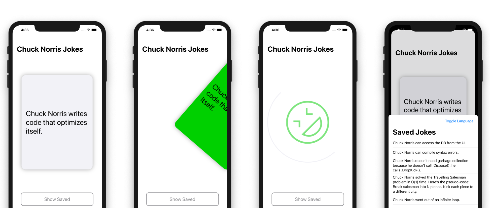
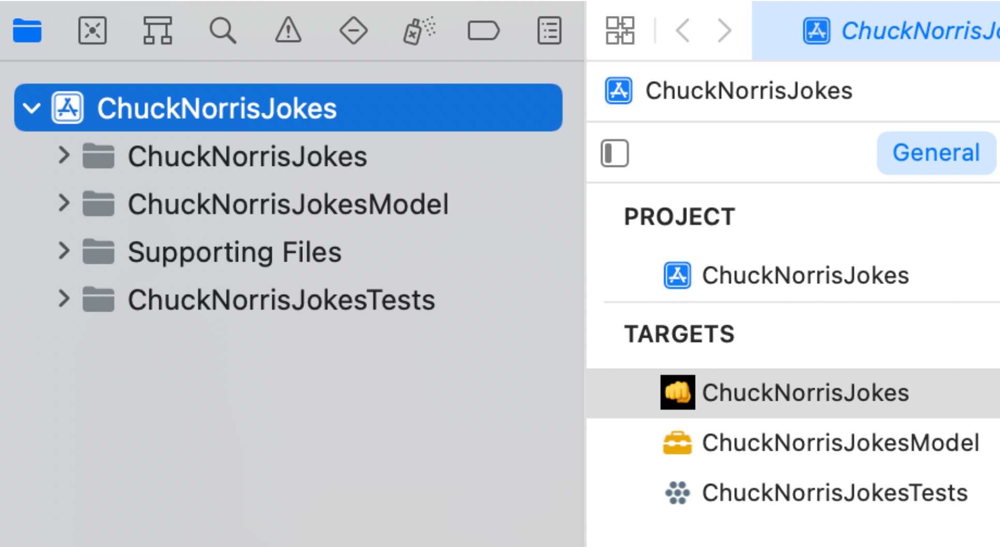
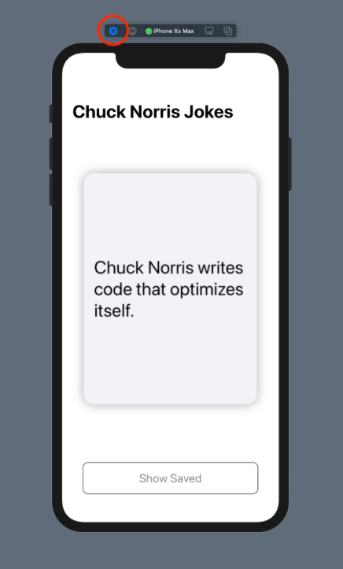
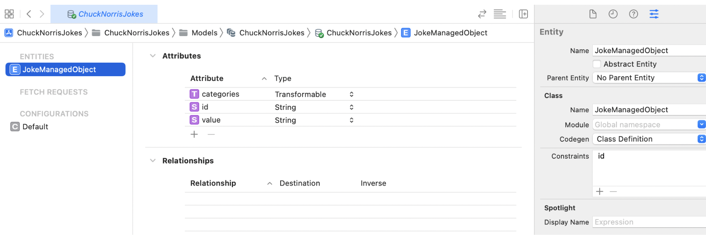

# Section V: Building a Complete App

Mastery takes practice, and practice you shall!

You've made it through this entire book, an amazing feat by all means. It's time to truly solidify the knowledge you've acquired throughout this chapter and build an entire app using Combine and SwiftUI.


## Chapter 20: In Practice: Building a Complete App

By introducing Combine and integrating it throughout their frameworks, Apple has made it clear: Declarative and reactive programming in Swift is a fantastic way to develop tomorrow’s greatest apps for their platforms.

In the last three sections, you acquired some awesome Combine skills. In this final chapter, you’ll use everything that you’ve learned to finish developing an app that lets you fetch Chuck Norris jokes. But wait, there's more! You’ll also see how to use Core Data with Combine to persist and retrieve your favorite jokes.



### Getting started

Open the starter project for this chapter. Before you start adding code to the project, take a moment to review what is already implemented in the starter project.


Note: Like with all projects in this book, you'll work with SwiftUI in this chapter too. If you’d like to learn more about it, check out SwiftUI by Tutorials from the raywenderlich.com library.


Select the ChuckNorrisJokes project at the top of the Project navigator:



The project has three targets:

1. ChuckNorrisJokes: The main target, which contains all your UI code.
2. ChuckNorrisJokesModel: You’ll define your models and services here. Separating the model into its own target is a great way to manage access for the main target while also allowing test targets to access methods with a relatively strict internal access level.
3. ChuckNorrisJokesTests: You’ll write some unit tests in this target.

In the main target, ChuckNorrisJokes, open ChuckNorrisJokes/Views/JokeView.swift. This is the main view of the app. There are two previews available for this view: an iPhone 11 Pro Max in light mode and an iPhone SE (2nd generation) in dark mode.

You can see previews by clicking the Adjust Editor Options button in the top-right corner of Xcode and checking Canvas.

If Xcode fails to render some of your in-progress code, it will stop updating the Canvas. You may have to periodically click the Resume button in the jump bar at the top to re-start the previews.

Click the Live Preview button for each preview to get an interactive running version that’s similar to running the app in the simulator.




Currently, you can swipe on the joke card view, and not much else. Not for long, though!

> Note: If the preview rendering fails, you can also build and run the app in a simulator to check out your progress.


Before getting to work on putting the finishing touches on this app’s development, you should set some goals.


### Setting goals

You’ve received several user stories that go like this: As a user, I want to:

1. See indicators when I swipe a joke card all the way to the left or right, to show that I have disliked or liked a joke.
2. Save liked jokes to peruse later.
3. See the background color of a joke card change to red or green as I swipe toward the left or right.
4. Fetch a new joke after I dislike or like the current joke.
5. See an indicator when fetching a new joke.
6. Display an indication if something goes wrong when fetching a joke.
7. Pull up a list of saved jokes.
8. Delete saved jokes.

These goals are your mission, should you choose to accept it. Can someone say Mission Possible?! It’s time to get started!

Every one of the above user stories relies on logic, so you’ll need to implement that logic before you can wire it up to the UI and start checking off that list.


### Implementing JokesViewModel

This app will use a single view model to manage the state that drives several UI components, and triggers fetching and saving a joke.

In the ChuckNorrisJokesModel target, open View Models/JokesViewModel.swift. You’ll see a bare-bones implementation that includes:

- Imports of Combine and SwiftUI.
- A DecisionState enum.
- A JSONDecoder instance.
- Two AnyCancellable collections.
- An empty initializer and several empty methods.

Time to fill in all those blanks!


#### Implementing state

SwiftUI uses several pieces of state to determine how to render your views. Add this code below the line that creates the decoder:

```swift
@Published public var fetching = false
@Published public var joke = Joke.starter
@Published public var backgroundColor = Color("Gray")
@Published public var decisionState = DecisionState.undecided
```

Here, you create several @Published properties, synthesizing a publisher for each of them. You can access the publishers for these properties with the $ prefix — e.g., $fetching. Their names and types give you a good indication of their purpose, but you’ll put them all to use soon enough and see exactly how to utilize them.

Before you can flesh out the rest of this view model, you’ll need to implement a few more things.


#### Implementing services

Open Services/JokesService.swift. You’ll use JokesService to fetch a random joke from the chucknorris.io database. It will also provide a publisher of the data returned from a fetch.

To be able to mock this service in unit tests later, you’ll need to finish defining a protocol outlining the publisher’s requirement. Open Protocols/JokeServiceDataPublisher.swift. Combine is already imported for you here, as it is in most of the files that need it throughout this chapter.

Change the protocol definition to the following:

```swift
public protocol JokeServiceDataPublisher {
  func publisher() -> AnyPublisher<Data, URLError>
}
```

Now, open Services/JokesService.swift and, similarly, implement its conformance to JokeServiceDataPublisher:

```swift
extension JokesService: JokeServiceDataPublisher {
  public func publisher() -> AnyPublisher<Data, URLError> {
    URLSession.shared
      .dataTaskPublisher(for: url)
      .map(\.data)
      .eraseToAnyPublisher()
  }
}
```

If you build your project’s test target at this point, you’ll get a compiler error. This error points to the stubbed implementation of a mock service in the test target. To silence this error, open ChuckNorrisJokesTests/Services/MockJokesService.swift and add this method to MockJokesService:

```swift
func publisher() -> AnyPublisher<Data, URLError> {
  // 1
  let publisher = CurrentValueSubject<Data, URLError>(data)

  // 2
  DispatchQueue.global().asyncAfter(deadline: .now() + 0.1) {
    if let error = error {
      publisher.send(completion: .failure(error))
    } else {
      publisher.send(data)
    }
  }

  // 3
  return publisher.eraseToAnyPublisher()
}
```

With this code, you:

1. Create a mock publisher that emits Data values and may fail with a URLError, initialized with the data property of the mocked service.

2. Send either the error if provided or the data value through the subject.

3. Return the type-erased publisher.

You use DispatchQueue.asyncAfter(deadline:) to simulate a slight delay in fetching the data, which you’ll need for a unit test later in this chapter.


#### Finish implementing JokesViewModel

With that boilerplate done, return to View Models/JokesViewModel.swift and add the following property after the @Published ones:

```swift
private let jokesService: JokeServiceDataPublisher
```

The view model uses the default implementation, while unit tests can use a mock version of this service.

Update the initializer to use the default implementation and set the service to its respective property:

```swift
public init(jokesService: JokeServiceDataPublisher = JokesService()) {
  self.jokesService = jokesService
}
```

Still in the initializer, add a subscription to the $joke publisher:

```swift
$joke
  .map { _ in false }
  .assign(to: &$fetching)
```

You’ll use the fetching published property to indicate when the app is fetching a joke.


#### Fetching jokes

Speaking of fetching, change the implementation of fetchJoke() to match this code:

```swift
public func fetchJoke() {
  // 1
  fetching = true

  // 2
  jokesService.publisher()
    // 3
    .retry(1)
    // 4
    .decode(type: Joke.self, decoder: Self.decoder)
     // 5
    .replaceError(with: Joke.error)
    // 6
    .receive(on: DispatchQueue.main)
     // 7
    .assign(to: &$joke)
}
```

From the top, you:

1. Set fetching to true.
2. Start a subscription to the joke service publisher.
3. Retry fetching one time if an error occurs.
4. Pass the data received from the publisher to the decode operator.
5. Replace an error with a Joke instance that displays an error message.
6. Receive the result on the main queue.
7. Assign the joke received to the joke @Published property.


#### Changing the background color

The updateBackgroundColorForTranslation(_:) method should update backgroundColor based on the position of the joke card view — aka, its translation. Change its implementation to the following to make that work:

```swift
public func updateBackgroundColorForTranslation(_ translation: Double) {
  switch translation {
  case ...(-0.5):
    backgroundColor = Color("Red")
  case 0.5...:
    backgroundColor = Color("Green")
  default:
    backgroundColor = Color("Gray")
  }
}
```

Here, you simply switch over the passed in translation and return a red color if it’s up to -0.5 (-50%), green if it’s 0.5+ (50%+), and gray if it’s in the middle. These colors are defined in the main target’s asset catalog in Supporting Files, in case you want to check them out.

You’ll also use the position of the joke card to determine whether or not the user liked the joke, so change the implementation of updateDecisionStateForTranslation(_:andPredictedEndLocationX:inBounds:) to:

```swift
public func updateDecisionStateForTranslation(
  _ translation: Double,
  andPredictedEndLocationX x: CGFloat,
  inBounds bounds: CGRect) {
  switch (translation, x) {
  case (...(-0.6), ..<0):
    decisionState = .disliked
  case (0.6..., bounds.width...):
    decisionState = .liked
  default:
    decisionState = .undecided
  }
}
```

This method’s signature seems more daunting than it actually is. Here, you switch over the translation and x values. If the percent is -/+ 60%, you consider that a definitive decision by the user. Otherwise, they’re still undecided.

You use the x and bounds.width values to prevent a decision state change if the user is hovering inside a decision state area. In other words, if there’s not enough velocity to predict an end location beyond these values, they haven’t made a decision yet — however, if there is enough velocity, it’s a good sign that they intend to complete that decision.


#### Preparing for the next joke

You have one more method to go. Change reset() to:

```swift
public func reset() {
  backgroundColor = Color("Gray")
}
```

When the user likes or dislikes a joke, the joke card will be reset so that it is ready for the next joke. The only part you need to manually handle is to reset its background color to gray.


#### Making the view model observable

There’s one more thing you’ll do in this view model before moving on: Make it conform to ObservableObject so that it can be observed throughout the app. Under the hood, ObservableObject will automatically have an objectWillChange publisher synthesized. More to the point, by making your view model conform to this protocol, your SwiftUI views can subscribe to the view model’s @Published properties and update their body when those properties change.

That took a lot more time to explain than it will to implement. Change the class definition to the following:

```swift
public final class JokesViewModel: ObservableObject {
```

You’ve finished implementing the view model — the brains of this whole operation!

> Note: At this point in a real setting, you’d probably write all your tests against this view model, ensure everything passes, check in your work, and go to lunch or home for the day. Instead, you’ll proceed with using the view model you just implemented to drive the app’s UI. You’ll circle back to writing the unit tests in the challenges section.


#### Wiring JokesViewModel up to the UI

There are two View components on the main screen of the app: a JokeView that’s essentially the background and a floating JokeCardView. Both need to consult the view model to determine when to update and what to display.

Open Views/JokeCardView.swift. The ChuckNorrisJokesModel module is already imported. To get a handle to the view model, add this property to the top of the JokeCardView definition:

```swift
@ObservedObject var viewModel: JokesViewModel
```

You annotated this property with the @ObservedObject property wrapper. Used in conjunction with the view model's adoption of ObservableObject, you now get the objectWillChange publisher. You get a compiler error in this file now, because the preview provider at the bottom is expecting the view model parameter from JokeCardView's initializer.

The error should point you right to it, but if not, locate the JokeCardView() initializer at the bottom — inside JokeCardView_Previews — and add a default initialization of the view model. The resulting struct implementation should look like this:

```swift
struct JokeCardView_Previews: PreviewProvider {
  static var previews: some View {
    JokeCardView(viewModel: JokesViewModel())
      .previewLayout(.sizeThatFits)
  }
}
```

You have a compiler error in JokeView to deal with now, but that’s also an easy fix.

Open Views/JokeView.swift and add the following at the top of the private properties, above showJokeView:

```swift
@ObservedObject private var viewModel = JokesViewModel()
```

Next, locate the jokeCardView computed property and change the JokeCardView() initialization to:

```swift
JokeCardView(viewModel: viewModel)
```

The error disappears. Now, switch back to Views/JokeCardView.swift. At the top of the body implementation, locate the line Text(ChuckNorrisJokesModel.Joke.starter.value) and change it to:

```swift
Text(viewModel.joke.value)
```

With this code, you switch from using the starter joke to the current value of the view model's joke publisher.


#### Setting the joke card’s background color

Now, head back to JokeView.swift. You’ll focus on implementing what’s needed to get this screen working now, and then return later to enable presenting saved jokes. Locate the private var jokeCardView property and change its .background(Color.white) modifier to:

```swift
.background(viewModel.backgroundColor)
```

The view model now determines the joke card view’s background color. As you may recall, the view model sets the color based on the card's translation.


#### Indicating if a joke was liked or disliked

Next, you’ll want to set a visual indication of whether the user liked or disliked a joke. Find the two uses of HUDView: One displays the .thumbDown image and the other displays the .rofl image. These image types are defined in HUDView.swift and correspond to images drawn using Core Graphics.

Change the two usages of the .opacity(0) modifier as follows:

- For HUDView(imageType: .thumbDown):

```swift
.opacity(viewModel.decisionState == .disliked ? hudOpacity : 0)
```


For HUDView(imageType: .rofl):

```swift
.opacity(viewModel.decisionState == .liked ? hudOpacity : 0)
```

This code lets you display the correct image for the .liked and .disliked states, and no image when the state is .undecided.


#### Handling decision state changes

Now, find updateDecisionStateForChange(_:) and change it to:

```
private func updateDecisionStateForChange(_ change: DragGesture.Value) {
  viewModel.updateDecisionStateForTranslation(
    translation,
    andPredictedEndLocationX: change.predictedEndLocation.x,
    inBounds: bounds
  )
}
```


This method calls through to the view model’s updateDecisionStateForTranslation(_:andPredictedEndLocationX:inBounds:) method, which you implemented earlier. It passes through the values obtained by the view based on user interaction with the joke card view.

Right below this method, change updateBackgroundColor() to:

```swift
private func updateBackgroundColor() {
  viewModel.updateBackgroundColorForTranslation(translation)
}
```

This method also calls through to a method on the view model, passing in the translation obtained by the view based on user interaction with the joke card view.


#### Handling when the user lifts their finger

One more method to implement, then you can take the app for a spin.

The handle(_:) method is responsible for handling when the user lifts their finger — i.e., touches up. If the user touches up while in an .undecided state, it resets the position of the joke view card. Otherwise, if the user touches up while in a decided state — .liked or .disliked — it directs the view model to reset and fetch a new joke.

Change the implementation of handle(_:) to the following:

```swift
private func handle(_ change: DragGesture.Value) {
  // 1
  let decisionState = viewModel.decisionState

  switch decisionState {
  // 2
  case .undecided:
    cardTranslation = .zero
    self.viewModel.reset()
  default:
    // 3
    let translation = change.translation
    let offset = (decisionState == .liked ? 2 : -2) * bounds.width
    cardTranslation = CGSize(
      width: translation.width + offset,
      height: translation.height
    )
    showJokeView = false
    

    // 4
    reset()

  }
}
```

Breaking down what you did with this code:

1. Create a local copy of the view model’s current decisionState and then switch over it.
2. If the decision state is .undecided, set the cardTranslation back to zero and tell the view model to reset — which will cause the background color to be reset to gray.
3. Otherwise, for .liked or .disliked states, determine the new offset and translation for the joke card view based on the state, and temporarily hide the joke card view.
4. Call reset(), which hides and then moves the joke card view back to its original position, tells the view model to fetch a new joke, and then shows the joke card view.

There are two things related to this code you haven’t touched yet:

- The cardTranslation property tracks the joke card’s current translation. Don’t confuse this with the translation property, which uses this value to calculate a translation based the screen’s current width, then passes the result to the view model in several areas.

- The joke card view’s initial y offset is -bounds.height. That is, it sits immediately above the visible view, ready to animate in from the top when showJokeView changes to true.

Finally, in the reset() method immediately below handle(_:), add the following two lines after setting cardTranslation to .zero:

```swift
self.viewModel.reset()
self.viewModel.fetchJoke()
```

Here, you ask the view model to fetch a new joke whenever reset() is called — i.e., when a joke is liked or disliked, or when the view appears.

That is all you need to do with JokeView for now.


#### Trying out your app

To check out your progress thus far, show the preview, click Resume if necessary, and click the Live Preview play button.

> Note: You can also build run the app in a simulator or on a device to check your progress.


You can swipe all the way left or right to dislike or like a joke, respectively. Doing so will also display the thumb down or ROFL image and the “fetching” animation. If you release the card while in an undecided state, the joke card will snap back to its original position.

If your app encounters an error, it will display the error joke. You’ll write a unit test to verify this later, but if you’d like to see the error joke now, temporarily shut off your Mac’s Wi-Fi, run the app and swipe left to fetch a new joke. You’ll see the error joke: "Houston we have a problem — no joke. Check your Internet connection and try again."

This is, no doubt, a minimal implementation. If you’re feeling ambitious, you can implement a more robust error-handling mechanism, applying what you learned in Chapter 16, ”Error Handling.“

Your progress so far

That takes care of the implementation side of these features:

✅ 1. See indicators when I swipe a joke card all the way to the left or right, to show that I have disliked or liked a joke.

✅ 3. See the background color of a joke card change to red or green as I swipe toward the left or right.

✅ 4. Fetch a new joke after I dislike or like the current joke.

✅ 5. See an indicator when a new joke is being fetched.

✅ 6. Display an indication if something goes wrong when fetching a joke.

Nice job! All that’s left is to:

2. Save liked jokes to peruse later.

8. Pull up a list of saved jokes.

9. Delete saved jokes.

Time to save some jokes!


### Implementing Core Data with Combine

The Core Data team has been hard at work these past few years. The process of setting up a Core Data stack couldn’t get much easier, and the newly-introduced integrations with Combine make it even more appealing as the first choice for persisting data in Combine and SwiftUI apps.


?Note: This chapter doesn’t delve into the details of using Core Data. It only walks you through the necessary steps to use it with Combine. If you’d like to learn more about Core Data, check out [Core Data by Tutorials](https://www.kodeco.com/books/core-data-by-tutorials) from the raywenderlich.com library.


#### Review the data model

The data model has already been created for you. To review it, open Models/ChuckNorrisJokes.xcdatamodeld and select JokeManagedObject in the ENTITIES section. You’ll see the following attributes have been defined, along with a unique constraint on the id attribute:




Core Data will auto-generate a class definition for JokeManagedObject. Next, you’ll create a couple of helper methods in extensions on JokeManagedObject and collections of JokeManagedObject to save and delete jokes.


#### Extending JokeManagedObject to save jokes

Right-click on the Models folder in the Project navigator for the main target and select New File.... Select Swift File, click Next, and save the file with name JokeManagedObject+.swift.

Replace the entire body of this file with the following piece of code:

```swift
// 1
import Foundation
import SwiftUI
import CoreData
import ChuckNorrisJokesModel

// 2
extension JokeManagedObject {
  // 3
  static func save(joke: Joke, inViewContext viewContext: NSManagedObjectContext) {
    // 4
    guard joke.id != "error" else { return }
    // 5
    let fetchRequest = NSFetchRequest<NSFetchRequestResult>(
      entityName: String(describing: JokeManagedObject.self))
    // 6
    fetchRequest.predicate = NSPredicate(format: "id = %@", joke.id)
    

    // 7
    if let results = try? viewContext.fetch(fetchRequest),
       let existing = results.first as? JokeManagedObject {
      existing.value = joke.value
      existing.categories = joke.categories as NSArray
    } else {
      // 8
      let newJoke = self.init(context: viewContext)
      newJoke.id = joke.id
      newJoke.value = joke.value
      newJoke.categories = joke.categories as NSArray
    }
    
    // 9
    do {
      try viewContext.save()
    } catch {
      fatalError("\(#file), \(#function), \(error.localizedDescription)")
    }

  }
}
```


Walking through the comments, here’s you do with this code:

1. Import Core Data, SwiftUI and your model module.
1. Extend your auto-generated JokeManagedObject class.
1. Add a static method to save the passed-in joke using the passed-in view context. If you’re unfamiliar with Core Data, you can think of the view context as Core Data’s scratchpad. It’s associated with the main queue.
1. The error joke used to indicate when a problem occurs has the ID error. There’s no reason to save that joke, so you guard against it being the error joke before proceeding.
1. Create a fetch request for the JokeManagedObject entity name.
1. Set the fetch request’s predicate to filter the fetch to jokes with the same ID as the passed-in joke.
1. Use viewContext to try to execute the fetch request. If it succeeds, that means the joke already exists, so update it with the values from the passed-in joke.

8. Otherwise, if the joke doesn't exist yet, create a new one with the values from the passed-in joke.
9. Attempt to save viewContext.

That takes care of saving.


#### Extending collections of JokeManagedObject to delete jokes

To also make deleting easier, add this extension on Collections of JokeManagedObject:

```swift
extension Collection where Element == JokeManagedObject, Index == Int {
  // 1
  func delete(at indices: IndexSet, inViewContext viewContext: NSManagedObjectContext) {
    // 2
    indices.forEach { index in
      viewContext.delete(self[index])
    }
    

    // 3
    do {
      try viewContext.save()
    } catch {
      fatalError("\(#file), \(#function), \(error.localizedDescription)")
    }

  }
}
```

In this extension, you:

1. Implement a method to delete objects at the passed-in indices using the passed-in view context.
2. Iterate over the indices and call delete(_:) on viewContext, passing each element of self — i.e., the collection of JokeManagedObjects.
3. Attempt to save the context.


#### Create the Core Data stack

There are several ways to set up a Core Data stack. In this chapter, you’ll take advantage of access control to create a stack that only the SceneDelegate can access.

Open App/SceneDelegate.swift and start by adding these imports at the top:

```swift
import Combine
import CoreData
```

Next, add the CoreDataStack definition at the bottom of the file:

```swift
// 1
private enum CoreDataStack {
  // 2
  static var viewContext: NSManagedObjectContext = {
    let container = NSPersistentContainer(name: "ChuckNorrisJokes")

    container.loadPersistentStores { _, error in
      guard error == nil else {
        fatalError("\(#file), \(#function), \(error!.localizedDescription)")
      }
    }
    
    return container.viewContext

  }()

  // 3
  static func save() {
    guard viewContext.hasChanges else { return }

    do {
      try viewContext.save()
    } catch {
      fatalError("\(#file), \(#function), \(error.localizedDescription)")
    }

  }
}
```

With this code, you:

1. Define a private enum called CoreDataStack. Using an case-less enum is useful here, since it can't be initialized. CoreDataStack only serves as a namespace — you don’t actually want to be able to create an instance of it.
2. Create a persistent container. This is the actual Core Data stack, encapsulating the managed object model, persistent store coordinator, and managed object context. Once you have a container, you return its view context. You’ll use SwiftUI’s Environment API in a moment to share this context across the app.
3. Create a static save method that only the scene delegate can use to save the context. It’s always a good idea to verify that the context has changed before you initiate a save operation.

Now that you have defined the Core Data stack, move up to the scene(_:willConnectTo:options:) method at the top and change let contentView = JokeView() to:

```swift
let contentView = JokeView()
  .environment(\.managedObjectContext, CoreDataStack.viewContext)
```


Here, you add the Core Data stack’s view context to the environment, making it globally available.

When the app is about to move to the background, you want to save the viewContext — otherwise, any work done in it will be lost. Locate the sceneDidEnterBackground(_:) method and add this code to the bottom of it:

```swift
CoreDataStack.save()
```

You now have a bona fide Core Data stack and can go about the business of putting it to good use.


#### Fetching jokes

Open Views/JokeView.swift and add this code right before the @ObservedObject private var viewModel property definition to get a handle to the viewContext from the environment:

```swift
@Environment(\.managedObjectContext) private var viewContext
```

Now, move to handle(_:) and, at the top of the default case, before let translation = change.translation, add this code:

```
if decisionState == .liked {
  JokeManagedObject.save(
    joke: viewModel.joke,
    inViewContext: viewContext
  )
}
```

With this code, you check if the user liked the joke. If so, you use the helper method you implemented a little while ago to save it, using the view context you retrieved from the environment.


#### Showing saved jokes

Next, find the LargeInlineButton block of code in JokeView’s body and change it to:

```swift
LargeInlineButton(title: "Show Saved") {
  self.presentSavedJokes = true
}
.padding(20)
```

Here, you change the state of presentSavedJokes to true. Next, you’ll use this to present saved jokes — imagine that!

Apply the sheet modifier to the end of the NavigationView block of code:

```swift
.sheet(isPresented: $presentSavedJokes) {
  SavedJokesView()
    .environment(\.managedObjectContext, self.viewContext)
}
```

This code is triggered whenever $presentSavedJokes emits a new value. When it’s true, the view will instantiate and present the saved jokes view, passing along the viewContext to it.

For your reference, the entire NavigationView should now look like this:

```swift
NavigationView {
  VStack {
    Spacer()
    

    LargeInlineButton(title: "Show Saved") {
      self.presentSavedJokes = true
    }
    .padding(20)

  }
  .navigationBarTitle("Chuck Norris Jokes")
}
.sheet(isPresented: $presentSavedJokes) {
  SavedJokesView()
    .environment(\.managedObjectContext, self.viewContext)
}
```

That’s it for JokeView.


#### Finishing the saved jokes view

Now, you need to finish implementing the saved jokes view, so open Views/SavedJokesView.swift. The model has already been imported for you.

First, add this property below the body property:

```swift
@Environment(\.managedObjectContext) private var viewContext
```

You’ve already set the viewContext a couple times — nothing new here.

Next, replace `private var jokes = [String]()` with the following:

```swift
@FetchRequest(
  sortDescriptors: [NSSortDescriptor(
                        keyPath: \JokeManagedObject.value,
                        ascending: true
                   )],
  animation: .default
) private var jokes: FetchedResults<JokeManagedObject>
```

You’ll immediately see a compiler error. You’ll fix it next while enabling the ability to delete jokes.

This gem of a property wrapper from SwiftUI does a lot for you. It:

- Takes an array of sort descriptors to sort fetched objects and updates the List that will display them with the given animation type.

- Automatically performs fetches for you whenever the persistent store changes, which you can then use to trigger the view to re-render itself with the updated data.

Variations of the underlying FetchRequest’s initializers allow you to pass a fetchRequest like the one you created earlier. However, in this case, you want all jokes, so the only thing you need to pass are instructions on how to sort the results.

Deleting jokes

Locate the ForEach(jokes, id: \.self) block of code, including the .onDelete block of code, and changing it to the following:

```swift
ForEach(jokes, id: \.self) { joke in
  // 1
  Text(joke.value ?? "N/A")
}
.onDelete { indices in
  // 2
  self.jokes.delete(
    at: indices,
    inViewContext: self.viewContext
  )
}
```

Here, you:

1. Show the joke text or "N/A" if there isn't a joke.

2. Enable swiping to delete a joke and call the delete(at:inViewContext:) method you defined earlier.

With that, SavedJokesView is now done!

Resume the app preview or build and run the app. Save a few jokes, then tap Show Saved to display your saved jokes. Try swiping left on a few jokes to delete them. Re-run the app and confirm that your saved jokes are, indeed, still there — and the ones you deleted are not!


### Challenge

You now have a great app, but your exceptional work ethic — and your manager — won’t allow you to check in your work without accompanying unit tests. So this chapter’s challenge section asks you to write unit tests to ensure your logic is sound, and to help prevent regressions down the road.

This is the final challenge of the book. Take it on and finish strong!


#### Challenge: Write unit tests against JokesViewModel

In the ChuckNorrisJokesTests target, open Tests/JokesViewModelTests.swift. You’ll see the following:

- Some preliminary setup code.
- A test that verifies the sample joke can be successfully created, called test_createJokesWithSampleJokeData.
- Five test stubs, which you’ll complete to exercise each of the responsibilities of the view model.

The ChuckNorrisJokesModel module has already been imported for you, giving you access to the view model — aka the system under test.

First, you’ll need to implement a factory method to vend new view models. It should take parameters to indicate if it should emit an error for "fetching" a joke. It should then return a new view model that uses the mock service you implemented earlier.

For an extra challenge, see if you can implement this yourself first, then check your work against this implementation:

```swift
private func viewModel(withJokeError jokeError: Bool = false) -> JokesViewModel {
  JokesViewModel(jokesService: mockJokesService(withError: jokeError))
}
```

With that method in place, you’re ready to go about filling in each test stub. You don’t need any new knowledge to write these tests — you learned everything you need to know in the last chapter.

Some tests are fairly straightforward. Others require a slightly more advanced implementation, such as using an expectation to wait for asynchronous operations to complete.

Take your time, and good luck — you’ve got this!

When you’re done — or if you get stuck on anything along the way — you can check your work against the solution in projects/challenge/final. The tests in this solution demonstrate one approach — i.e., they’re not etched in stone as the only way. The most important thing is that your tests pass when the system works as it’s supposed to, and fail when it does not.


### Key points

Here are some of the main things you learned in this chapter:

- Use @ObservedObject in conjunction with @Published to drive SwiftUI views with Combine publishers.

- Use @FetchRequest to automatically execute a Core Data fetch when the persistent store has changed, and to drive UI based on the updated data.


### Where to go from here?

Bravo! Finishing a book of this magnitude is no small accomplishment. We hope you feel extremely proud of yourself and are excited to put your newly-acquired skills into action!

In software development, the possibilities are endless. Developers who keep their skills sharp and up-to-date will create tomorrow’s apps that are truly adored by their users. You are one such developer.

You may already have an app or an idea that you want to use Combine to develop. If so, there’s no better experience than real-world experience — and no one ever learned to swim from a book alone. So dive in!

Not ready to jump into your own project with Combine yet? No worries, there are several ways you can improve the app you developed in this chapter and further hone your Combine chops — including, but not limited to, these enhancements:

1. Add the ability to sort saved jokes.

2. Add the ability to search saved jokes.

3. Add the ability to share a joke via social media, or even with other users.

4. Implement a more robust error-management system that provides different messages based on the various errors a user might receive.

5. Implement displaying saved jokes in a different way, such as in a LazyVGrid.

Additionally, you can visit the forum for this book at bit.ly/combineBookForum if you have any questions, discover errata, or just want to see if you can help fellow Combiners.

Whatever you decide to do with your Combine skills, we wish you good luck — and don’t hesitate to reach out to us to say hello or to share your accomplishments.
