# 第二部分：Operator

如果你将Combine 视为一种语言，例如英语，那么操作符(Operator)就是它的单词。 你知道的操作符越多，你就越能清楚地表达你的意图和应用程序的逻辑。 Operator 是 Combine 生态系统的重要组成部分，它允许你以有意义和合乎逻辑的方式操纵上游发布者发出的值。

在本部分中，你将学习 Combine 提供的大多数操作符，它们分为：转换、过滤、组合、时间操作和序列。 本部分最后将用一个动手项目来结束，以练习新获得的知识。


## 第 3 节：转换操作符

完成第一部分后，你已经学到了很多东西。你已经在 Combine 上打下了坚实的基础。在本章中，你将了解 Combine 中操作符的基本类别之一：转换操作符。 你将一直使用转换操作符，将来自发布者的值操作为可供订阅者使用的格式。正如你将看到的，Combine 中的转换操作符和 Swift 标准库中的常规操作符(例如 map 和 flatMap)之间存在相似之处。


### 入门

打开本章的 playground，它已经导入了 Combine，可以开始编码了。

#### Operator 是 Publisher 

Combine 的每个操作符都返回一个发布者。 一般来说，发布者接收上游事件，对其进行操作，然后将操作后的事件向下游发送给消费者。

为了简化这个概念，在本章中，你将专注于使用操作符并处理它们的输出。 除非操作符的目的是处理上游错误，否则它只会在下游重新发布所述错误。

> 注意：本章将重点介绍转换操作符，因此错误处理不会出现在每个操作符示例中。 你将在后续了解有关错误处理的内容。


### 收集值(Collecting values)

发布者可以发出单个值或值集合。你将经常使用集合，例如当你想要填充列表或网格视图时。 你将在后面学习如何做到这一点。

**collect()**

collect 操作符提供了一种方便的方法来将来自发布者的单值流转换为单个数组。

弹珠图有助于可视化操作符的工作方式。 最上面一行是上游发布者。方框代表操作符，最下方的是订阅者。最下方也可以是另一个操作符，它接收来自上游发布者的输出，执行其操作，并将这些值发送到下游。


这个弹珠图图描述了 collect 如何缓冲单值的流，直到上游发布者完成。 然后它向下游发出该数组。

将这个新示例添加到你的 Playground：

```swift
example(of: "collect") {
    ["A", "B", "C", "D", "E"].publisher
        .sink(receiveCompletion: { print($0) },
              receiveValue: { print($0) })
        .store(in: &subscriptions)
}
```

此代码尚未使用 collect 操作符。 运行 Playground，你会看到每个值都出现在单独的行上，后面跟着一个完成事件：

```
——— Example of: collect ———
A
B
C
D
E
finished
```

现在在调用 sink 之前使用 collect。 你的代码现在应该如下所示：

```swift
example(of: "collect") {
    ["A", "B", "C", "D", "E"].publisher
        .collect()
        .sink(receiveCompletion: { print($0) },
              receiveValue: { print($0) })
        .store(in: &subscriptions)
}
```

再次运行 Playground，你现在将看到 sink 接收到单个数组值，然后是完成事件：

```
——— Example of: collect ———
["A", "B", "C", "D", "E"]
finished
```

> 注意：在使用 collect() 和其他不需要指定计数或限制的缓冲操作符时要小心。 它们将使用无限量的内存来存储接收到的值，因为它们不会在上游完成之前发出。


collect 操作符有一些变体。例如你可以指定你只希望接收最多一定数量的值，从而有效地将上游切割成“批次”，将 `.collect()` 替换为：

```swift
.collect(2)
```

运行 Playground，你将看到以下输出：

```
——— Example of: collect ———
["A", "B"]
["C", "D"]
["E"]
finished
```

最后一个值 E 也是一个数组。这是因为上游发布者在 collect 填满其规定的缓冲区之前就完成了，所以它将剩余的所有内容作为数组发送。


### 映射值(Mapping values)

除了收集值之外，你通常还希望以某种方式转换这些值。 为此，Combine 提供了几个映射操作符。

**`map(_:)`**

首先要了解的是 map，它的工作方式与 Swift 的标准 map 类似，不同之处在于它对发布者发出的值进行操作。 在弹珠图中，map 采用将每个值乘以 2 的闭包。


请注意，与 collect 不同，此操作符如何在上游发布值后立即重新发布值。

将这个新示例添加到你的 Playground：

```swift
example(of: "map") {
    // 1
    let formatter = NumberFormatter()
    formatter.numberStyle = .spellOut
    
    // 2
    [123, 4, 56].publisher
    // 3
        .map {
            formatter.string(for: NSNumber(integerLiteral: $0)) ?? ""
        }
        .sink(receiveValue: { print($0) })
        .store(in: &subscriptions)
}
```

下面是具体操作：

1. 创建一个数字格式化程序来拼出每个数字。

2. 创建整数发布者。

3. 使用 map，传递一个获取上游值的闭包，并返回使用格式化程序返回数字的拼写字符串的结果。

运行 Playground，你将看到以下输出：

```
——— Example of: map ———
one hundred twenty-three
four
fifty-six
```

#### 映射 KeyPath

map 操作符还包括三个版本，它们可以使用 key path 映射到值的一个、两个或三个属性。 他们的签名如下：

```swift
map<T>(_:)
map<T0, T1>(_:_:)
map<T0, T1, T2>(_:_:_:)
```

T 表示在给定 KeyPath 中找到的值的类型。

在下一个示例中，你将使用 `Sources/SupportCode.swift` 中定义的 `Coordinate` 类型和 `quadrantOf(x:y:)` 方法。 坐标有两个属性：x 和 y。 `quadrantOf(x:y:)` 将 x 和 y 值作为参数，并返回一个字符串，指示 x 和 y 值的象限。


如果你有兴趣，请随意查看这些定义，否则只需将 `map(_:_:)` 与以下示例一起用于你的 Playground：

```swift
example(of: "mapping key paths") {
    // 1
    let publisher = PassthroughSubject<Coordinate, Never>()
    
    // 2
    publisher
    // 3
        .map(\.x, \.y)
        .sink(receiveValue: { x, y in
            // 4
            print(
                "The coordinate at (\(x), \(y)) is in quadrant",
                quadrantOf(x: x, y: y)
            )
        })
        .store(in: &subscriptions)
    
    // 5
    publisher.send(Coordinate(x: 10, y: -8))
    publisher.send(Coordinate(x: 0, y: 5))
}
```

在此示例中，你使用 KeyPath 映射到两个属性：

1. 创建一个永远不会发出错误的坐标发布者。

2. 开始订阅发布者。

3. 使用它们的关键路径映射到 Coordinate 的 x 和 y 属性。

4. 打印一条语句，指出提供 x 和 y 值的象限。

5. 通过发布者发送一些坐标。

运行 Playground，此订阅的输出将如下所示：

```
——— Example of: mapping key paths ———
The coordinate at (10, -8) is in quadrant 4
The coordinate at (0, 5) is in quadrant boundary

```


**`tryMap(_:)`**

包括 map 在内的几个操作符都有一个带有 try 前缀的对应项，该前缀接受一个抛出的闭包。 如果你抛出错误，操作符将在下游发出该错误。

要尝试 tryMap，请将此示例添加到 Playground：

```swift
example(of: "tryMap") {
    // 1
    Just("Directory name that does not exist")
    // 2
        .tryMap { try FileManager.default.contentsOfDirectory(atPath: $0) }
    // 3
        .sink(receiveCompletion: { print($0) },
              receiveValue: { print($0) })
        .store(in: &subscriptions)
}
```

这是你刚刚做的：

1. 创建表示不存在的目录名称的字符串的发布者。

2. 使用 tryMap 尝试获取该不存在目录的内容。

3. 接收并打印出任何值或完成事件。

请注意，在调用抛出方法时仍需要使用 try 关键字。

运行 Playground 并观察 tryMap 输出失败完成事件：

```
——— Example of: tryMap ———
failure(..."The folder “Directory name that does not exist” doesn't exist."...)
```


### 展平发布者(Flattening publishers)

展平的概念并不太复杂。 通过几个精选示例，你将了解有关它的所有内容。

**`flatMap(maxPublishers:_:)`**

flatMap 操作符将多个上游发布者展平为一个下游发布者。flatMap 返回的发布者与它接收的上游发布者的类型不同，而且通常都是不同的。

在 Combine 中 flatMap 的一个常见用例是，当你想要将一个发布者发出的元素传递给一个本身返回一个发布者的方法，并最终订阅第二个发布者发出的元素时。

添加这个新示例：

```swift
example(of: "flatMap") {
    // 1
    func decode(_ codes: [Int]) -> AnyPublisher<String, Never> {
        // 2
        Just(
            codes
                .compactMap { code in
                    guard (32...255).contains(code) else { return nil }
                    return String(UnicodeScalar(code) ?? " ")
                }
            // 3
                .joined()
        )
        // 4
        .eraseToAnyPublisher()
    }
}
```

1. 定义一个函数，该函数接受一个整数数组，每个整数表示一个 ASCII 码，并返回一个类型擦除的字符串发布者，该发布者从不发出错误。

2. 如果字符代码在 0.255 范围内，则创建一个将其转换为字符串的 Just 发布者，其中包括标准和扩展的可打印 ASCII 字符。

3. 使用 Join 将字符串连接在一起。

4. 擦除发布者类型，匹配函数的返回类型。

> 注意：有关 ASCII 字符代码的更多信息，你可以访问 www.asciitable.com。

继续将此代码添加到你当前的示例中：

```swift
// 5
[72, 101, 108, 108, 111, 44, 32, 87, 111, 114, 108, 100, 33]
    .publisher
    .collect()
// 6
    .flatMap(decode)
// 7
    .sink(receiveValue: { print($0) })
    .store(in: &subscriptions)
```

使用此代码：

5. 将 ASCII 字符代码数组转换为发布者，并将其发出的元素收集到单个数组中。

6. 使用 `flatMap` 将数组元素传递给你的 `decode` 函数。

7. 订阅由 `decode(_:)` 返回的发布者发出的元素并打印出这些值。


运行 Playground，你会看到：

```
——— Example of: flatMap ———
Hello, World!
```

回想一下之前的定义：`flatMap` 将所有接收到的发布者的输出展平为一个新发布者。这可能会引起内存问题，因为它会缓冲与你发送它一样多的发布者，以更新它在下游发出的单个发布者。

要了解如何管理它，请看一下 flatMap 的弹珠图：


在图中，flatMap 接收三个发布者：P1、P2 和 P3。 这些发布者中的每一个都有一个 value 属性，它也是发布者。 flatMap 从 P1 和 P2 发出值，但忽略 P3，因为 maxPublishers 设置为 2。你将后面的章节中获得更多使用 flatMap 及其 maxPublishers 参数的练习。

你现在掌握了 Combine 中最强大的操作符之一。 但是，flatMap 并不是将输入与不同输出交换的唯一方法。


### 替换上游输出

在前面的地图示例中，你使用了 Foundation 的 Formatter.string(for:) 方法。 它生成一个可选字符串，并且你使用 nil-coalescing 操作符 (??) 将 nil 值替换为非 nil 值。 Combine 还包括一个操作符，当你希望始终提供价值时可以使用该操作符。

**replaceNil(with:)**

如下图所示，replaceNil 将接收可选值并将 nils 替换为你指定的值：


将这个新示例添加到你的 Playground：

```swift
example(of: "replaceNil") {
    // 1
    ["A", nil, "C"].publisher
        .eraseToAnyPublisher()
        .replaceNil(with: "-") // 2
        .sink(receiveValue: { print($0) }) // 3
        .store(in: &subscriptions)
}
```

你刚刚做了：

1. 从可选字符串数组创建发布者。

2. 使用 `replaceNil(with:)` 将来自上游发布者的 nil 值替换为新的非 nil 值。

3. 打印出数值。

> 注意：replaceNil(with:) 有重载，这会使 Swift 为用例类型进行错误的猜测。这导致类型保留为 Optional<String> 而不是完全展开。 上面的代码使用 eraseToAnyPublisher() 来解决该错误。 你可以在 Swift 论坛中了解有关此问题的更多信息：https://bit.ly/30M5Qv7

运行 Playground，你将看到以下内容：

```
——— Example of: replaceNil ———
A
-
C
```


**replaceEmpty(with:)**

如果发布者完成了但没有发出一个值，你可以使用 `replaceEmpty(with:)` 操作符来替换——或者插入一个值。

在下面的弹珠图中，发布者完成时没有发出任何内容，此时 `replaceEmpty(with:)` 操作符插入一个值并将其发布到下游：


添加这个新示例以查看它的实际效果：

```swift
example(of: "replaceEmpty(with:)") {
    // 1
    let empty = Empty<Int, Never>()
    
    // 2
    empty
        .sink(receiveCompletion: { print($0) },
              receiveValue: { print($0) })
        .store(in: &subscriptions)
}
```

你在这里：

1. 创建一个立即发出完成事件的空发布者。

2. 订阅它，并打印收到的事件。

使用 `Empty` 发布者类型创建立即发出 `.finished` 完成事件的发布者。 你还可以通过将 `false` 传递给其 `completeImmediately` 参数来将其配置为从不发出任何内容，默认情况下为 `true`。 此发布者可用于演示或测试目的，或者当你只想向订阅者发送完成某些任务的信号时。 运行 Playground，你会看到它成功完成：

```
——— Example of: replaceEmpty ———
finished
```

现在，在调用 sink 之前插入这行代码：

```swift
.replaceEmpty(with: 1)
```

再次运行 Playground，这次你在完成前得到 1：

```
1
finished
```


### 增量转换输出

你已经看到了 Combine 如何包含诸如 map 之类的操作符，这些操作符与 Swift 标准库中的高阶函数相对应且工作方式相似。 但是，Combine 还有一些技巧可以让你操纵从上游发布者接收到的值。

**`scan(_:_:)`**

转换类别中的一个很好的例子是 scan。 它将上游发布者发出的当前值提供给闭包，以及该闭包返回的最后一个值。

在下面的弹珠图中，扫描从存储起始值 0 开始。当它从发布者接收每个值时，它将其添加到先前存储的值中，然后存储并发出结果：

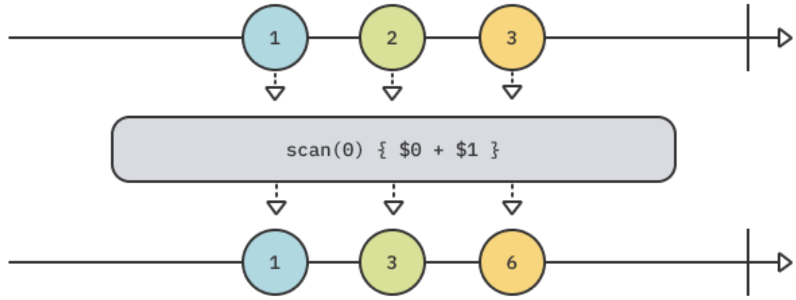

> 注意：和 Playground 相比，如果使用完整的项目来输入和运行此代码，则没有直接的方法来绘制图像。 你可以通过将下面示例中的接收器代码更改为 .sink(receiveValue: { print($0) }) 来打印输出。

请将这个新示例添加到你的 Playground：

```swift
example(of: "scan") {
    // 1
    var dailyGainLoss: Int { .random(in: -10...10) }
    
    // 2
    let august2019 = (0..<22)
        .map { _ in dailyGainLoss }
        .publisher
    
    // 3
    august2019
        .scan(50) { latest, current in
            max(0, latest + current)
        }
        .sink(receiveValue: { _ in })
        .store(in: &subscriptions)
}
```

这一次，你没有在订阅中打印任何内容。 运行 Playground，然后单击右侧结果边栏中的方形 Show Results 按钮。


还有一个抛出错误的 tryScan 操作符，其工作方式类似。 如果闭包抛出错误，则 tryScan 会因该错误而失败。


### 挑战

#### 挑战：使用转换操作符创建电话号码查找

创建一个可以做两件事的发布者：

1. 接收一串十个数字或字母。

2. 在联系人数据结构中查找该号码。

挑战文件夹中的 Playground 包括一个联系人字典和三个函数。你需要使用转换操作符和这些函数创建对输入发布者的订阅。在将测试你的实现的 forEach 块之前，将你的代码插入到 `Add your code here placeholder` 的正下方。

> 提示：如果函数签名匹配，你可以将函数或闭包作为参数直接传递给操作符。例如，map(convert。


打破这一挑战，你需要：

1. 将输入转换为数字——使用 convert 函数，如果它不能将输入转换为整数，它将返回 nil。

2. 如果前一个操作符返回 nil，则将其替换为 0。

3. 一次采集十个值，对应美国使用的三位数区号和七位数电话号码格式。

4. 格式化收集的字符串值以匹配联系人字典中电话号码的格式——使用提供的格式化函数。

5. 拨打从前一个操作符那里收到的输入。


#### 解决方案

首先你需要将字符串一次输入一个字符转换为整数：

```swift
input
    .map(convert)
```

接下来，你需要用 0 替换从 convert 返回的 nil 值：

```swift
.replaceNil(with: 0)
```

要查找前面操作的结果，你需要收集这些值，然后将它们格式化以匹配联系人字典中使用的电话号码格式：

```swift
.collect(10)
.map(format)
```

最后，你需要使用 dial 函数查找格式化的字符串输入，然后订阅：

```swift
.map(dial)
.sink(receiveValue: { print($0) })
```

运行 Playground 将产生以下结果：

```
——— Example of: Create a phone number lookup ———
Contact not found for 000-123-4567
Dialing Marin (408-555-4321)...
Dialing Shai (212-555-3434)...
```


### 关键点

- 你调用对发布者“操作员”的输出执行操作的方法。

- 运营商也是出版商。

- 转换操作符将来自上游发布者的输入转换为适合下游使用的输出。

- 大理石图是可视化每个组合操作员如何工作的好方法。

- 使用任何缓冲值的操作符（如 collect 或 flatMap）时要小心，以避免内存问题。

- 在应用 Swift 标准库中的现有函数知识时要注意。一些名称相似的 Combine 操作符的工作方式相同，而另一些则完全不同。

- 在订阅中将多个操作符链接在一起以对发布者发出的事件创建复杂且复合的转换是很常见的。


### 接下来去哪？

现在是时候学习如何使用另一个重要的操作符符集合来过滤你从上游发布者那里获得的内容。


## 第 4 节：过滤操作符

正如你现在可能已经意识到的那样，操作符基本上是你用来操作 Combine 发布者的词汇。你知道的“单词”越多，你对数据的控制就越好。

在上一章中，你学习了如何使用值并将它们转换为其他值——这是日常工作中最有用的操作符类别之一。

但是，当你想要限制发布者发出的值或事件，并且只使用其中的一部分时，将如何操作？本章都是关于如何使用一组特殊的操作符来做到这一点：过滤操作符！

幸运的是，这些操作符中有许多与 Swift 标准库中的同名操作符有相似之处。


### 入门

你可以在项目文件夹中找到本章的 Playground。随着本章的深入，你将在 Playground 中编写代码，然后运行 Playground。这将帮助你了解不同的操作符如何操纵发布者发出的事件。

> 注意：本章中的大多数操作符都与 try 前缀有相似之处，例如 filter 与 tryFilter。 它们之间的唯一区别是后者提供了一个抛出的闭包。 你从闭包中抛出的任何错误都会以抛出的错误终止发布者。 为简洁起见，本章将只介绍非抛出的变化，它们实际上是相同的。


### 基础值(Filtering values)

第一部分将了解过滤的基础——消费发布者的值，并有条件地决定将其中的哪些传递给消费者。

最简单的方法是使用恰当命名的操作符 — filter，它采用返回 Bool 的闭包，只会传递与提供的条件匹配的值：

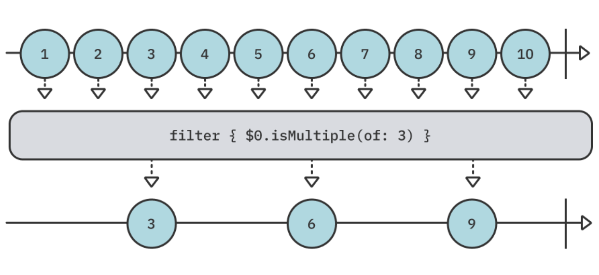

将这个新示例添加到 Playground：

```swift
example(of: "filter") {
    // 1
    let numbers = (1...10).publisher
    
    // 2
    numbers
        .filter { $0.isMultiple(of: 3) }
        .sink(receiveValue: { n in
            print("\(n) is a multiple of 3!")
        })
        .store(in: &subscriptions)
}
```

在上面的示例中：

1. 创建一个新的发布者，它将发出有限数量的值——从 1 到 10，然后使用序列类型的发布者属性完成。

2. 使用过滤器操作符，传入一个谓词，在该谓词中，你只允许通过是三的倍数的数字。

运行 Playground，你应该在控制台中看到以下内容：

```
——— Example of: filter ———
3 is a multiple of 3!
6 is a multiple of 3!
9 is a multiple of 3!
```

在你的应用程序的生命周期中，很多时候你可能会遇到发布者在一行中发出相同的值，你可能希望忽略这些值。 例如，如果用户连续输入“a”五次，然后输入“b”，你可能希望忽略过多的“a”。

Combine 为该任务提供了完美的操作符：removeDuplicates：

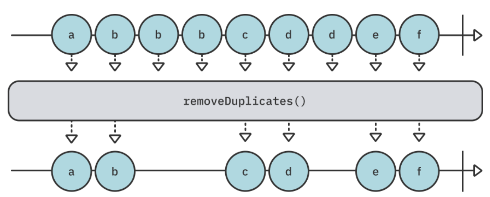

请注意，你不必为此操作符提供任何参数。 removeDuplicates 自动适用于任何符合 Equatable 的值，包括 String。

将以下 removeDuplicates() 示例添加到你的 Playground:

```swift
example(of: "removeDuplicates") {
    // 1
    let words = "hey hey there! want to listen to mister mister ?"
        .components(separatedBy: " ")
        .publisher
    // 2
    words
        .removeDuplicates()
        .sink(receiveValue: { print($0) })
        .store(in: &subscriptions)
}
```


此代码与上一个代码没有太大区别：

1. 将一个句子分成一个单词数组，然后创建一个新的发布者来发出这些单词。

2. 将 removeDuplicates() 应用于你的发布者。

运行你的 Playground 并查看调试控制台：

```
——— Example of: removeDuplicates ———
hey
there!
want
to
listen
to
mister
?
```

如你所见，你跳过了第二个“hey”和第二个“mister”。

> 注意：不符合 Equatable 的值怎么办？ removeDuplicates 有另一个重载，它接受一个带有两个值的闭包，你将从中返回一个 Bool 来指示值是否相等。


### 移去 nil 值(Compacting values)和忽略(Ignoring values)

很多时候，你会发现自己与发布可选值的发布者打交道。 或者更常见的是，你会想要对你的值执行一些可能返回 nil 的操作，但是谁想要处理所有这些 nil 呢？

Swift 标准库中的一个非常著名的 Sequence 方法，叫做 compactMap——还有一个同名的操作符！

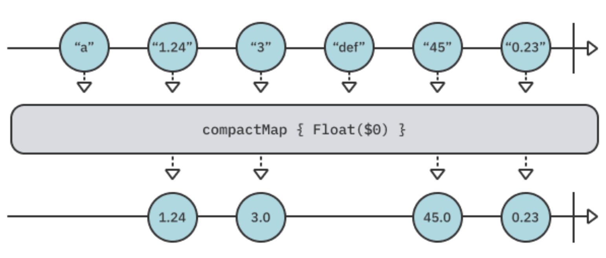

将以下内容添加到你的 Playground：

```swift
example(of: "compactMap") {
    // 1
    let strings = ["a", "1.24", "3",
                   "def", "45", "0.23"].publisher
    
    // 2
    strings
        .compactMap { Float($0) }
        .sink(receiveValue: {
            // 3
            print($0)
        })
        .store(in: &subscriptions)
}
```

正如图表概述的那样：

1. 创建一个发布有限字符串列表的发布者。

2. 使用 compactMap 尝试从每个单独的字符串初始化一个 Float。 如果失败，则返回 nil。 这些 nil 值会被 compactMap 操作符自动过滤掉。

3. 只打印成功转换为浮点数的字符串。

在你的 Playground 中运行上面的示例，你应该会看到类似于上图的输出：

```
——— Example of: compactMap ———
1.24
3.0
45.0
0.23
```


有时，你只想知道发布者完成值的发送，而忽略实际值。当这种情况发生时，你可以使用 ignoreOutput 操作符：

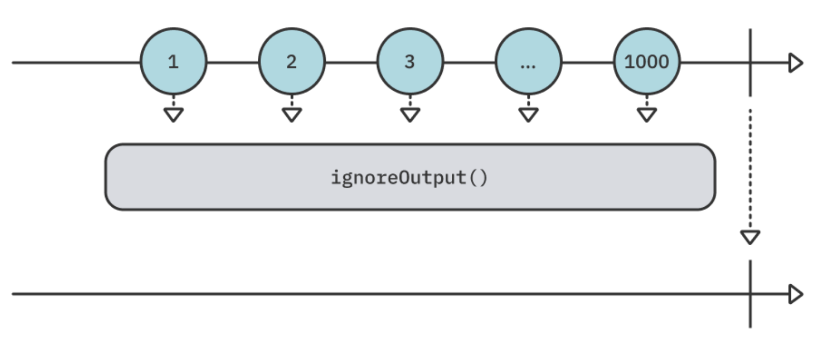

如上图所示，发出哪些值或发出多少个值并不重要，因为它们都被忽略了； 你只需将完成事件推送给消费者。

通过将以下代码添加到你的 Playground 来试验此示例：

```swift
example(of: "ignoreOutput") {
    // 1
    let numbers = (1...10_000).publisher
    
    // 2
    numbers
        .ignoreOutput()
        .sink(receiveCompletion: { print("Completed with: \($0)") },
              receiveValue: { print($0) })
        .store(in: &subscriptions)
}
```

在上面的示例中，你：

1. 创建一个发布者，从 1 到 10,000 发出 10,000 个值。

2. 添加 ignoreOutput 操作符，它会忽略所有值，只向消费者发出完成事件。

 运行你的 Playground 并查看调试控制台：

```
——— Example of: ignoreOutput ———
Completed with: finished
```


### 寻找值(Finding values)

在本节中，你将了解两个同样起源于 Swift 标准库的操作符：first(where:) 和 last(where:)。 正如它们的名字所暗示的那样，你可以使用它们分别仅查找和发出与提供的描述匹配的第一个或最后一个值。

是时候看看几个例子了，从 first(where:) 开始：


这个操作符很有趣，因为它是 lazy 的，意思是：它只取所需的值，直到找到与你提供的谓词匹配的值。 一旦找到匹配项，它就会取消订阅并完成。

将以下代码添加到你的 Playground 以查看其工作原理：

```swift
example(of: "first(where:)") {
    // 1
    let numbers = (1...9).publisher
    
    // 2
    numbers
        .first(where: { $0 % 2 == 0 })
        .sink(receiveCompletion: { print("Completed with: \($0)") },
              receiveValue: { print($0) })
        .store(in: &subscriptions)
}
```

这是你刚刚添加的代码的作用：

1. 创建一个新的发布者，发布从 1 到 9 的数字。

2. 使用 first(where:) 操作符查找第一个发出的偶数值。

在你的 Playground 中运行此示例并查看控制台输出：

```
——— Example of: first(where:) ———
2
Completed with: finished
```

它的工作方式与你可能猜到的完全一样。 但是等等，对上游的订阅，也就是数字发布者呢？ 即使找到匹配的偶数，它是否仍会继续发出其值？ 通过找到以下行来测试这个理论：

在 `numbers` 之后立即添加 print("numbers") 操作符，如下所示：

```
numbers
  	.print("numbers")
```

> 注意：你可以在操作符链中的任何位置使用 print 操作符，以准确查看在该点发生的事件。

再次运行你的 Playground，并查看控制台。 你的输出应类似于以下内容：

```
——— Example of: first(where:) ———
numbers: receive subscription: (1...9)
numbers: request unlimited
numbers: receive value: (1)
numbers: receive value: (2)
numbers: receive cancel
2
Completed with: finished
```

如你所见，一旦 first(where:) 找到匹配的值，它就会通过订阅发送取消，上游停止发出值。 

转到此操作符的反面 — last(where:)，其目的是找到与提供的描述匹配的最后一个值。


与 first(where:) 不同，此操作符是贪婪的，因为它必须等待发布者完成发出值才能知道是否找到了匹配值。 因此，上游必须是有限的。

将以下代码添加到你的 Playground：

```swift
example(of: "last(where:)") {
    // 1
    let numbers = (1...9).publisher
    
    // 2
    numbers
        .last(where: { $0 % 2 == 0 })
        .sink(receiveCompletion: { print("Completed with: \($0)") },
              receiveValue: { print($0) })
        .store(in: &subscriptions)
}
```

与前面的代码示例非常相似：

1. 创建一个发出 1 到 9 之间数字的发布者。

2. 使用 last(where:) 操作符查找最后发出的偶数值。

运行你的 Playground并找出：

```
——— Example of: last(where:) ———
8
Completed with: finished
```

因为操作符无法知道发布者是否会发出与下一行的条件匹配的值，因此操作符必须知道发布者的全部范围，然后才能确定与条件匹配的最后一个项目。

要查看此操作，请将整个示例替换为以下内容：

```swift
example(of: "last(where:)") {
    let numbers = PassthroughSubject<Int, Never>()
    
    numbers
        .last(where: { $0 % 2 == 0 })
        .sink(receiveCompletion: { print("Completed with: \($0)") },
              receiveValue: { print($0) })
        .store(in: &subscriptions)
    
    numbers.send(1)
    numbers.send(2)
    numbers.send(3)
    numbers.send(4)
    numbers.send(5)
}
```

在此示例中，你使用 PassthroughSubject ，通过它手动发送事件。

再次运行你的 Playground：

```
——— Example of: last(where:) ———
```

正如预期的那样，由于发布者永远不会完成，因此无法确定匹配条件的最后一个值。

要解决此问题，请将以下内容添加为示例的最后一行，PassthroughSubject 发送完成：

```
numbers.send(completion: .finished)
```

再次运行你的 Playground，现在一切都应该按预期工作：

```swift
——— Example of: last(where:) ———
4
Completed with: finished
```

> 注意：你还可以使用 first() 和 last() 操作符来简单地获取发布者发出的第一个或最后一个值。 这些人也分别是 lazy 和贪婪的。


### 删除值(Dropping values)

删除值是你在与发布者合作时经常需要的功能。例如，当你想忽略来自一个发布者的值直到第二个发布者开始发布时，或者如果你想在流开始时忽略特定数量的值。

三个操作符属于这一类，你将首先了解最简单的一个 -`dropFirst`。

`dropFirst` 操作符采用 `count` 参数（如果省略，则默认为 1）并忽略发布者发出的第一个计数值。 只有在跳过计数值之后，发布者才会开始传递值。


将以下代码添加到 Playground 的末尾：

```swift
example(of: "dropFirst") {
    // 1
    let numbers = (1...10).publisher
    
    // 2
    numbers
        .dropFirst(8)
        .sink(receiveValue: { print($0) })
        .store(in: &subscriptions)
}
```

如上图所示：

1. 创建一个发布者，它发出 10 个介于 1 和 10 之间的数字。

2. 使用 `dropFirst(8)` 删除前八个值，只打印 9 和 10。

运行你的 Playground，你应该会看到以下输出：

```
——— Example of: dropFirst ———
9
10
```

继续讨论值下下一个操作符 - drop(while:)。 这是另一个非常有用的变体，它采用条件闭包并忽略发布者发出的任何值，直到第一次满足该条件。 一旦满足条件，值就开始流经操作符：


将以下示例添加到你的 Playground 以查看其实际效果：

```swift
example(of: "drop(while:)") {
    // 1
    let numbers = (1...10).publisher
    
    // 2
    numbers
        .drop(while: { $0 % 5 != 0 })
        .sink(receiveValue: { print($0) })
        .store(in: &subscriptions)
}
```

在代码中：

1. 创建一个发出 1 到 10 之间数字的发布者。

2. 使用 drop(while:) 等待可以被 5 整除的第一个值。 一旦满足条件，值将开始流经操作符并且不会再被删除。

运行你的 Playground 并查看调试控制台：

```
——— Example of: drop(while:) ———
5
6
7
8
9
10
```

如你所见，你已经删除了前四个值。 一旦 5 到来，问题是“这能被 5 整除吗？” 最后是真的，所以它现在发出 5 和所有未来值。

你可能会问自己——这个操作符和过滤器有什么不同？ 它们都采用一个闭包，该闭包根据该闭包的结果控制发出哪些值。

第一个区别是，如果你在闭包中返回 true，filter 会让值通过，而只要你从闭包中返回 true，drop(while:) 就会跳过值。

第二个也是更重要的区别是过滤器永远不会停止评估上游发布者发布的所有值的条件。 即使在 filter 的条件评估为 true 之后，仍然会“质疑”下一个值，并且你的闭包必须回答这个问题：“你想让这个值通过吗？”。

相反，drop(while:) 的谓词闭包在满足条件后将不再执行。要确认这一点，请替换以下行：

```swift
.drop(while: { $0 % 5 != 0 })
```

为：

```swift
.drop(while: {
  	print("x")
  	return $0 % 5 != 0
})
```

每次调用闭包时，你添加了一条打印语句以将 x 打印到调试控制台。 运行 Playground，你应该会看到以下输出：

```
——— Example of: drop(while:) ———
x
x
x
x
x
5
6
7
8
9
10
```

你可能已经注意到，x 正好打印了五次。 一旦满足条件（发出 5 时），就不再评估闭包。


过滤类别的最后一个也是最精细的操作符是 drop(untilOutputFrom:)。

想象一个场景，你有一个用户点击一个按钮，但你想忽略所有的点击，直到你的 isReady 发布者发出一些结果。 该操作符非常适合这种情况。

它会跳过发布者发出的任何值，直到第二个发布者开始发出值，从而在它们之间创建关系：


第一行表示 isReady 流，第二行表示用户通过 drop(untilOutputFrom:) 进行的点击，它以 isReady 作为参数。

在你的 Playground 末尾，添加以下代码：

```swift
example(of: "drop(untilOutputFrom:)") {
    // 1
    let isReady = PassthroughSubject<Void, Never>()
    let taps = PassthroughSubject<Int, Never>()
    
    // 2
    taps
        .drop(untilOutputFrom: isReady)
        .sink(receiveValue: { print($0) })
        .store(in: &subscriptions)
    
    // 3
    (1...5).forEach { n in
        taps.send(n)
        
        if n == 3 {
            isReady.send()
        }
    }
}
```

在此代码中，你：

1. 创建两个你可以手动发送值的 PassthroughSubjects。 第一个是 isReady 而第二个代表用户的点击。
2. 使用 drop(untilOutputFrom: isReady) 忽略用户的任何点击，直到 isReady 发出至少一个值。
3. 通过 subject 发送五个“点击”，就像上图一样。 第三次点击后，你发送 isReady 一个值。

运行你的 Playground，然后看看你的调试控制台。 你将看到以下输出：

```
——— Example of: drop(untilOutputFrom:) ———
4
5
```

此输出与上图相同：

- 用户点击五次。 前三个被忽略。

- 第三次点击后，isReady 发出一个值。

- 用户未来的所有点击都会通过。


### 限制值(Limiting values)

在上一节中，你已经学习了如何删除（或跳过）值，直到满足特定条件。该条件可能匹配某个静态值、谓词闭包或对不同发布者的依赖。

本节解决相反的需求：接收值直到满足某些条件，然后强制发布者完成。例如，考虑一个可能发出未知数量的值的请求，但你只想要一次发出而不关心其余的值。

结合使用前缀系列操作符解决了这组问题。 尽管名称并不完全直观，但这些操作符提供的功能对于许多现实生活中的情况都很有用。

前缀族类操作符似于 drop，提供 prefix(_:)、 prefix(while:) 和 prefix(untilOutputFrom:)。 但是，前缀操作符不会在满足某些条件之前删除值，而是在满足该条件之前获取值。

现在，是时候深入研究本章的最后一组操作符了，从 prefix(_:) 开始。

与 dropFirst 相反，prefix(_:) 将只取所提供的数量的值，然后完成：


将以下代码添加到你的 Playground 以演示这一点：

```swift
example(of: "prefix") {
    // 1
    let numbers = (1...10).publisher
    
    // 2
    numbers
        .prefix(2)
        .sink(receiveCompletion: { print("Completed with: \($0)") },
              receiveValue: { print($0) })
        .store(in: &subscriptions)
}
```

此代码与你在上一节中使用的放置代码非常相似：

1. 创建一个发布者，它发出从 1 到 10 的数字。

2. 使用 prefix(2) 只允许发射前两个值。 一旦发出两个值，发布者就完成了。

运行你的 Playground，你会看到以下输出：

```
——— Example of: prefix ———
1
2
Completed with: finished
```

就像 first(where:) 一样，这个操作符是 lazy 的，这意味着它只占用它需要的值，然后终止，这也可以防止数字产生超出 1 和 2 的其他值，因为它完成了。

接下来是 prefix(while:)，它接受一个条件闭包，只要该闭包的结果为真，就让来自上游发布者的值通过。 一旦结果为假，发布者将完成：

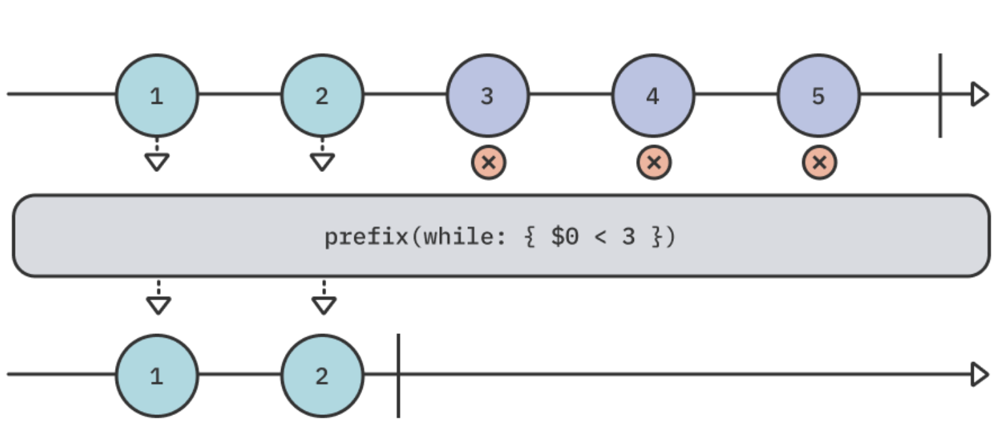

将以下示例添加到你的 Playground 以尝试此操作：

```swift
example(of: "prefix(while:)") {
    // 1
    let numbers = (1...10).publisher
    
    // 2
    numbers
        .prefix(while: { $0 < 3 })
        .sink(receiveCompletion: { print("Completed with: \($0)") },
              receiveValue: { print($0) })
        .store(in: &subscriptions)
}
```

除了使用闭包来评估前缀条件之外，此示例与前一个示例基本相同。 你：

1. 创建一个发出 1 到 10 之间值的发布者。

2. 使用 prefix(while:) 让小于 3 的值通过。一旦发出等于或大于 3 的值，发布者就完成了。

运行 Playground 并检查调试控制台； 输出应该与前一个操作符的输出相同：

```
——— Example of: prefix(while:) ———
1
2
Completed with: finished
```

前面两个前缀操作符已经过去，是时候使用最复杂的一个了：prefix(untilOutputFrom:)。 再一次，与 drop(untilOutputFrom:) 跳过值直到第二个发布者发出，prefix(untilOutputFrom:) 取值直到第二个发布者发出。

想象一个场景，你有一个用户只能点击两次的按钮。 一旦发生两次点击，按钮上的进一步点击事件应该被省略：

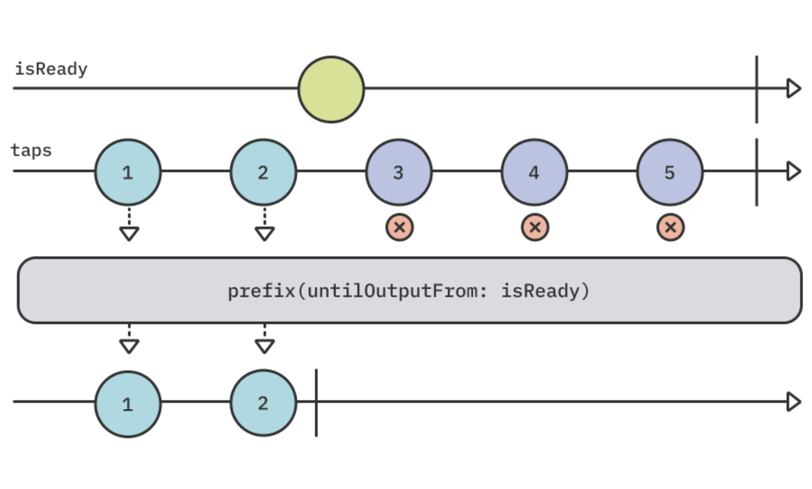

将本章的最后一个示例添加到 Playground 的末尾：

```swift
example(of: "prefix(untilOutputFrom:)") {
  // 1
  let isReady = PassthroughSubject<Void, Never>()
  let taps = PassthroughSubject<Int, Never>()

  // 2
  taps
    .prefix(untilOutputFrom: isReady)
    .sink(receiveCompletion: { print("Completed with: \($0)") },
          receiveValue: { print($0) })
    .store(in: &subscriptions)

  // 3
  (1...5).forEach { n in
    taps.send(n)
    

    if n == 2 {
      isReady.send()
    }

  }
}
```

如果你回想一下 drop(untilOutputFrom:) 示例，你应该会发现这很容易理解：

1. 创建两个你可以手动发送值的 PassthroughSubjects。 第一个是 isReady 而第二个代表用户的点击。

2. 使用 prefix(untilOutputFrom: isReady) 让点击事件通过，直到 isReady 发出至少一个值。

3. 通过 subject 发送五个“点击”，与上图完全相同。 第二次点击后，你发送 isReady 一个值。

运行 Playground，查看控制台，你应该看到以下内容：

```
——— Example of: prefix(untilOutputFrom:) ———
1
2
Completed with: finished
```


### 挑战

#### 挑战：过滤所有东西

创建一个发布从 1 到 100 的数字集合的示例，并使用过滤操作符：

1. 跳过上游发布者发出的前 50 个值。

2. 在前 50 个值之后取接下来的 20 个值。
3. 只取偶数。

你的示例的输出应产生以下数字，每行一个：

```
52 54 56 58 60 62 64 66 68 70
```

> 注意：在这个挑战中，你需要将多个操作符链接在一起以产生所需的值。


你可以在 projects/challenge/Final.playground 中找到该挑战的解决方案。


### 关键点

在本章中，你了解到：

- 过滤操作符让你可以控制上游发布者发出的哪些值被发送到下游、另一个操作符或消费者。
- 当你不关心值本身，只想要一个完成事件时，ignoreOutput 是你的朋友。
- 查找值是另一种过滤，你可以分别使用 first(where:) 和 last(where:) 找到第一个或最后一个值以匹配提供的调整。
- First 类型的操作符是 lazy 的；它们只取所需数量的值，然后发送完成。 Last 类型的操作符是贪婪的，在决定哪个值是最后一个满足条件之前，必须知道值的全部范围。
- 你可以使用 drop 系列操作符控制上游发布者发出的值在向下游发送值之前被忽略的数量。
- 同样，你可以使用前缀系列操作符控制上游发布者在完成之前可以发出多少值。


### 接下来去哪？

了解了转换和过滤操作符的知识后，你就可以进入下一章并学习另一组非常有用的操作符：组合操作符。


## 第 5 节：组合操作符

在本章中，你将了解一种更复杂但有用的操作类别：组合操作符。这组操作符允许你组合不同发布者发出的事件，并在你的组合代码中创建有意义的数据组合。

考虑一个包含多个用户输入的表单——一个用户名、一个密码和一个复选框。你需要将这些不同的数据组合起来，组成一个包含你需要的所有信息的发布者。

随着你更多地了解每个操作符的运作方式以及如何根据你的需求选择合适的操作符，你的代码将变得更加强大，你的技能将使你能够解锁新的发布者组合。


### 入门

你可以在项目 /Starter.playground 文件夹中找到本章的 Playground，你将向 Playground 添加代码并运行它，以了解各种操作符如何创建发布者及其事件的不同组合。


### 前置(Prepending)

你将在这里开始使用一组操作符，这些操作符都是关于在发布者开头添加值的。换句话说，你将使用它们在原始发布者发出任何值之前添加值。

在本节中，你将了解 `prepend(Output...)`、`prepend(Sequence)` 和 `prepend(Publisher)`。

**`prepend(Output...)`**

使用 `...` 语法采用可变参数列表。 这意味着它可以采用任意数量的值，只要它们与原始发布者的输出类型相同。

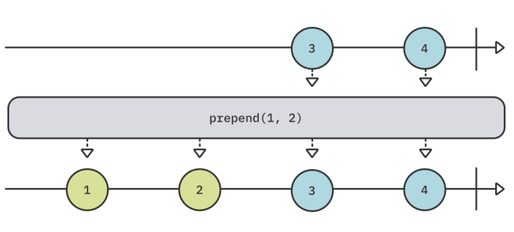

将以下代码添加到你的 Playground 以试验上述示例：

```swift
example(of: "prepend(Output...)") {
  // 1
  let publisher = [3, 4].publisher

  // 2
  publisher
    .prepend(1, 2)
    .sink(receiveValue: { print($0) })
    .store(in: &subscriptions)
}
```

在上面的代码中：

1. 创建一个发布数字 3 4 的发布者。

2. 使用 prepend 在发布者自己的值之前添加数字 1 和 2。

运行 Playground，你应该在调试控制台中看到以下内容：

```
——— Example of: prepend(Output...) ———
1
2
3
4
```

你还记得操作符是如何可链接的吗？ 这意味着你可以轻松添加多个前置。

在以下行下方：

```swift
.prepend(1, 2)
```

添加：

```swift
.prepend(-1, 0)
```

再次运行你的 Playground。你应该看到以下输出：

```swift
——— Example of: prepend(Output...) ———
-1
0
1
2
3
4
```

请注意，此处的操作顺序至关重要 -1 和 0 被前置到最前方，然后是 1 和 2，最后是原始发布者的值。


**`prepend(Sequence)`**

prepend 的这种变体与前一种类似，不同之处在于它将任何符合序列的对象作为输入。 例如，它可以采用 Array 或 Set。

将以下代码添加到你的 Playground：

```swift
example(of: "prepend(Sequence)") {
    // 1
    let publisher = [5, 6, 7].publisher
    
    // 2
    publisher
        .prepend([3, 4])
        .prepend(Set(1...2))
        .sink(receiveValue: { print($0) })
        .store(in: &subscriptions)
}
```


在此代码中：

1. 创建一个发布数字 5、6 和 7 的发布者。

2. 链接 `prepend(Sequence`) 两次到原始发布者。 一次从数组中添加值，第二次从集合中添加值。

运行 Playground，你的输出应类似于以下内容：

```
——— Example of: prepend(Sequence) ———
1
2
3
4
5
6
7
```

> 注意：与数组相反，要记住关于 Set 的一个重要事实是它们是无序的，因此不能保证项目发出的顺序。 这意味着上例中的前两个值可以是 1 和 2，也可以是 2 和 1。


许多类型都符合 Swift 中的 Sequence，它可以让你做一些有趣的事情。

在第二个 prepend 后：

```
.prepend(Set(1...2))
```

添加：

```swift
.prepend(stride(from: 6, to: 11, by: 2))
```

在这行代码中，你创建了一个 Strideable，它允许你以 2 为步长在 6 和 11 之间跨步。由于 Strideable 符合 Sequence，你可以在 prepend(Sequence) 中使用它。

再次运行你的 Playground 并查看调试控制台：

```
——— Example of: prepend(Sequence) ———
6
8
10
1
2
3
4
5
6
7
```

如你所见，现在在前一个输出之前向发布者添加了三个新值——6、8 和 10，这是以 2 为步长在 6 和 11 之间移动的结果。


**`prepend(Publisher)`**

前两个操作符将值列表添加到现有发布者。 但是，如果你有两个不同的发布者，并且你想将他们的值观合在一起怎么办？ 你可以使用 prepend(Publisher) 在原始发布者的值之前添加第二个发布者发出的值。

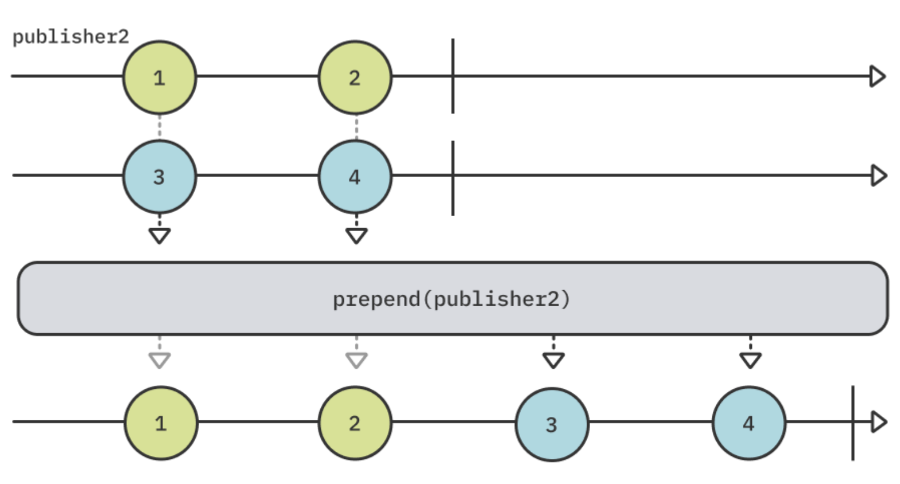

通过将以下内容添加到你的 Playground 来尝试上面的示例：

```swift
example(of: "prepend(Publisher)") {
    // 1
    let publisher1 = [3, 4].publisher
    let publisher2 = [1, 2].publisher
    
    // 2
    publisher1
        .prepend(publisher2)
        .sink(receiveValue: { print($0) })
        .store(in: &subscriptions)
}
```

在此代码中：

1. 创建两个发布者。 一个发出数字 3 和 4，第二个发出 1 和 2。

2. 将 publisher2 添加到 publisher1 的开头。 只有在 publisher2 发送 .finished 完成事件后，publisher1 才会开始执行其工作并发出事件。

如果你运行 Playground，你的调试控制台应显示以下输出：

```
——— Example of: prepend(Publisher) ———
1
2
3
4
```

正如预期的那样，值 1 和 2 首先从 publisher2 发出； 只有这样 3 和 4 才由发布者 1 发出。

你应该了解有关此操作符的更多细节，将以下内容添加到 Playground 的末尾：

```swift
example(of: "prepend(Publisher) #2") {
    // 1
    let publisher1 = [3, 4].publisher
    let publisher2 = PassthroughSubject<Int, Never>()
    
    // 2
    publisher1
        .prepend(publisher2)
        .sink(receiveValue: { print($0) })
        .store(in: &subscriptions)
    
    // 3
    publisher2.send(1)
    publisher2.send(2)
}
```

此示例与上一个示例类似，不同之处在于 publisher2 现在是一个 PassthroughSubject，你可以手动将值推送到它。

在示例中：

1. 创建两个发布者。 第一个发出值 3 和 4，而第二个是可以动态接受值的 PassthroughSubject。

2. 在 publisher1 之前添加主题。

3. 通过主题 publisher2 发送值 1 和 2。

花点时间在你的脑海中运行这段代码。 你期望输出是什么？

现在，再次运行 Playground 并查看调试控制台。 你应该看到以下内容：

```
——— Example of: prepend(Publisher) #2 ———
1
2
```

 为什么 publisher2 在这里只发出两个数字？ 想想看——Combine 怎么知道前置发布者 publisher2 完成值的发送？ 它没有，因为它发出了值，但没有完成事件。 因此，前置发布者必须完成，以便 Combine 知道是时候切换到主发布者了。

在以下行之后：

```swift
publisher2.send(2)
```

添加：

```
publisher2.send(completion: .finished)
```

Combine 现在知道它可以处理来自 publisher1 的值，因为 publisher2 已经完成了它的工作。

再次运行你的 Playground，这次你应该会看到预期的输出：

```
——— Example of: prepend(Publisher) #2 ———
1
2
3
4
```


### 追加(Appending)

下一组操作符处理将发布者发出的事件与其他值连接起来。 但在这种情况下，你将使用 `append(Output...)`、`append(Sequence)` 和 `append(Publisher)` 处理追加而不是前置。 这些操作符的工作方式与它们的前置操作符类似。


**`append(Output...)`**

`append(Output...)` 的工作方式与它的 prepend 对应的类似：它也接受一个 Output 类型的可变参数列表，然后在原始发布者完成 `.finished` 事件后，附加在 `.finished` 前。

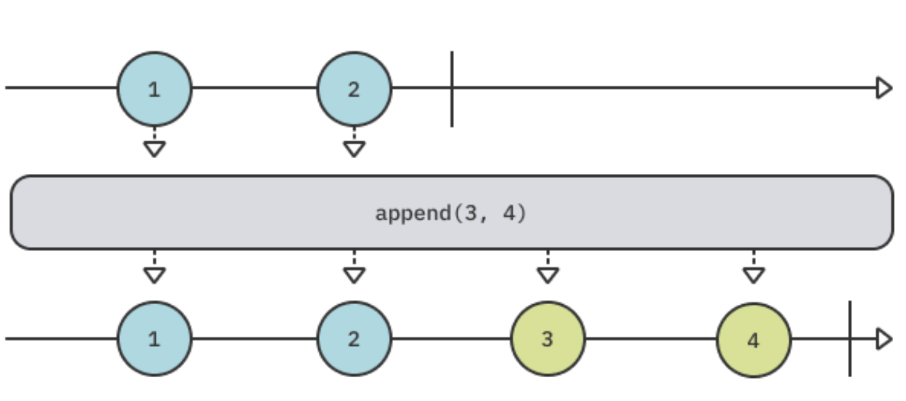

将以下代码添加到 Playground：

```swift
example(of: "append(Output...)") {
    // 1
    let publisher = [1].publisher
    
    // 2
    publisher
        .append(2, 3)
        .append(4)
        .sink(receiveValue: { print($0) })
        .store(in: &subscriptions)
}
```

在上面的代码中：

1. 创建一个只发出一个值的发布者：1。

2. 使用 append 两次，第一次追加 2 和 3，然后追加 4。

运行 Playground 并检查输出：

```
——— Example of: append(Output...) ———
1
2
3
4
```

追加的工作方式与你期望的完全一样，每个追加都等待上游完成，然后再添加自己的工作。

这意味着上游必须完成，否则追加永远不会发生，因为 Combine 无法知道先前的发布者已经完成了其所有值的发送。

要验证此行为，请添加以下示例：

```swift
example(of: "append(Output...) #2") {
    // 1
    let publisher = PassthroughSubject<Int, Never>()
    
    publisher
        .append(3, 4)
        .append(5)
        .sink(receiveValue: { print($0) })
        .store(in: &subscriptions)
    
    // 2
    publisher.send(1)
    publisher.send(2)
}
```

此示例与上一个示例相同，但有两个不同之处：

1. publisher 现在是一个 PassthroughSubject，它允许你手动向它发送值。

2. 你将 1 和 2 发送到 PassthroughSubject。

再次运行你的 Playground，你会看到只有发送给发布者的值被发出：

```
——— Example of: append(Output...) #2 ———
1
2
```

两个追加操作符都无效，因为它们可能在发布者完成之前无法工作。 在示例的最后添加以下行：

```swift
publisher.send(completion: .finished)
```

再次运行你的 Playground，你应该会看到所有值，如预期的那样：

```
——— Example of: append(Output...) #2 ———
1
2
3
4
5
```

对于整个追加操作符系列，此行为是相同的； 除非前一个发布者发送 `.finished` 完成事件，否则不会发生追加。


**`append(Publisher)`**

附加操作符组的最后一个变体，它接受一个发布者并将其发出的任何值附加到原始发布者的末尾。

要尝试此示例，请将以下内容添加到你的 Playground：

```swift
example(of: "append(Publisher)") {
    // 1
    let publisher1 = [1, 2].publisher
    let publisher2 = [3, 4].publisher
    
    // 2
    publisher1
        .append(publisher2)
        .sink(receiveValue: { print($0) })
        .store(in: &subscriptions)
}
```

在此代码中，你：

1. 创建两个发布者，第一个发出 1 和 2，第二个发出 3 和 4。

2. 将 publisher2 附加到 publisher1，因此 publisher2 中的所有值一旦完成就会附加在publisher1 的末尾。

运行 Playground，你应该会看到以下输出：

```
——— Example of: append(Publisher) ———
1
2
3
4
```


### 高级组合

我们将深入探讨组合不同发布者相关的一些更复杂的操作符。 尽管它们相对复杂，但它们也是发布者组合最有用的一些操作符。花时间熟悉它们的工作方式是值得的。


**`switchToLatest`**

switchToLatest 很复杂，但非常有用。它使你可以在取消挂起的发布者订阅的同时即时切换整个发布者订阅，从而切换到最新的发布者订阅。

你只能在自己发出发布者的发布者上使用它。


将以下代码添加到你的 Playground 以试验你在上图中看到的示例：

```swift
example(of: "switchToLatest") {
    // 1
    let publisher1 = PassthroughSubject<Int, Never>()
    let publisher2 = PassthroughSubject<Int, Never>()
    let publisher3 = PassthroughSubject<Int, Never>()
    
    // 2
    let publishers = PassthroughSubject<PassthroughSubject<Int, Never>, Never>()
    
    // 3
    publishers
        .switchToLatest()
        .sink(
            receiveCompletion: { _ in print("Completed!") },
            receiveValue: { print($0) }
        )
        .store(in: &subscriptions)
    
    // 4
    publishers.send(publisher1)
    publisher1.send(1)
    publisher1.send(2)
    
    // 5
    publishers.send(publisher2)
    publisher1.send(3)
    publisher2.send(4)
    publisher2.send(5)
    
    // 6
    publishers.send(publisher3)
    publisher2.send(6)
    publisher3.send(7)
    publisher3.send(8)
    publisher3.send(9)
    
    // 7
    publisher3.send(completion: .finished)
    publishers.send(completion: .finished)
}

```

在上面代码中：

1. 创建三个接受整数且没有错误的 PassthroughSubject。

2. 再创建一个 PassthroughSubject 接受其他 PassthroughSubject。你可以通过它发送 publisher1、publisher2 或 publisher3。

3. 在你的发布者上使用 switchToLatest。现在，每次你通过发布者主题发送不同的发布者时，你都会切换到新的发布者并取消之前的订阅。

4. 将 publisher1 发送给 publishers，然后将 1 和 2 发送给 publisher1。

5. 发送 publisher2，取消对 publisher1的订阅。然后，你将 3 发送到 publisher1，但它被忽略了，然后将 4 和 5 发送到 publisher2，因为存在对 publisher2 的活动订阅，所以它们被推送。

6. 发送 publisher3，取消对 publisher2 的订阅。和之前一样，你发送 6 到 publisher2 并被忽略，然后发送 7、8 和 9，它们通过订阅推送到 publisher3。

7. 最后，你将完成事件发送给当前发布者，publisher3，并将另一个完成事件发送给发布者。这样就完成了所有活动订阅。

如果你按照上图进行操作，你可能已经猜到了这个示例的输出。

运行 Playground 并查看调试控制台：

```
——— Example of: switchToLatest ———
1
2
4
5
7
8
9
Completed!
```

如果你不确定为什么这在实际应用中很有用，请考虑以下场景：你的用户点击触发网络请求的按钮。 紧接着，用户再次点击按钮，触发第二个网络请求。 但是你如何摆脱挂起的请求，只使用最新的请求呢？ switchToLatest ！将以下代码添加到你的 Playground：

```swift
example(of: "switchToLatest - Network Request") {
    let url = URL(string: "https://source.unsplash.com/random")!
    
    // 1
    func getImage() -> AnyPublisher<UIImage?, Never> {
        URLSession.shared
            .dataTaskPublisher(for: url)
            .map { data, _ in UIImage(data: data) }
            .print("image")
            .replaceError(with: nil)
            .eraseToAnyPublisher()
    }
    
    // 2
    let taps = PassthroughSubject<Void, Never>()
    
    taps
        .map { _ in getImage() } // 3
        .switchToLatest() // 4
        .sink(receiveValue: { _ in })
        .store(in: &subscriptions)
    
    // 5
    taps.send()
    
    DispatchQueue.main.asyncAfter(deadline: .now() + 3) {
        taps.send()
    }
    
    DispatchQueue.main.asyncAfter(deadline: .now() + 3.1) {
        taps.send()
    }
}
```

在此代码中：

1. 定义一个函数 `getImage()`，它执行网络请求获取随机图像。这使用 `URLSession.dataTaskPublisher`，它是 Foundation 的众多 Combine 扩展之一。

2. 创建一个 `PassthroughSubject` 来模拟用户对按钮的点击。

3. 在点击按钮后，通过调用 `getImage()` 将点击映射到随机图像的新网络请求。这实质上将 `Publisher<Void, Never>` 转换为 `Publisher<Publisher<UIImage?, Never>, Never>` — 发布者的发布者。

4. 使用 `switchToLatest()` 就像在前面的例子中一样，因为你有一个发布者的发布者。这保证只有一个发布者会发出值，并会自动取消任何剩余的订阅。

5. 使用 `DispatchQueue` 模拟三个延迟的按钮点击。第一次点击是立即的，第二次点击是在三秒后出现的，最后一次点击是在第二次点击之后的十分之一秒后出现的。

运行 Playground 并查看以下输出：

```
——— Example of: switchToLatest - Network Request ———
image: receive subscription: (DataTaskPublisher)
image: request unlimited
image: receive value: (Optional(<UIImage:0x600000364120 anonymous {1080, 720}>))
image: receive finished
image: receive subscription: (DataTaskPublisher)
image: request unlimited
image: receive cancel
image: receive subscription: (DataTaskPublisher)
image: request unlimited
image: receive value: (Optional(<UIImage:0x600000378d80 anonymous {1080, 1620}>))
image: receive finished
```

在转到下一个操作符之前，请务必注释掉整个示例，以避免每次运行 Playground 时都运行异步网络请求。


**`merge(with:)`**

你将了解三个专注于组合不同发布者的值的操作符。 你将从 merge(with:) 开始。

此操作符将来自同一类型的不同发布者的排放交错，如下所示：


要试用此示例，请将以下代码添加到你的 Playground：

```swift
example(of: "merge(with:)") {
    // 1
    let publisher1 = PassthroughSubject<Int, Never>()
    let publisher2 = PassthroughSubject<Int, Never>()
    
    // 2
    publisher1
        .merge(with: publisher2)
        .sink(
            receiveCompletion: { _ in print("Completed") },
            receiveValue: { print($0) }
        )
        .store(in: &subscriptions)
    
    // 3
    publisher1.send(1)
    publisher1.send(2)
    
    publisher2.send(3)
    
    publisher1.send(4)
    
    publisher2.send(5)
    
    // 4
    publisher1.send(completion: .finished)
    publisher2.send(completion: .finished)
}
```

在与上图相关的这段代码中，你：

1. 创建两个 PassthroughSubjects 接受和发出整数值并且不会发出错误。

2. 将 publisher1 与 publisher2 合并，将两者发出的值交错。 组合提供重载，可让你合并多达八个不同的发布者。

3. 将 1 和 2 添加到 publisher1，然后将 3 添加到 publisher2，然后再次将 4 添加到 publisher1，最后将 5 添加到 publisher2。

4. 你向发布者 1 和发布者 2 发送完成事件。

运行你的 Playground，你应该会看到以下输出，如预期的那样：

```
——— Example of: merge(with:) ———
1
2
3
4
5
Completed
```


**`combineLatest`**

combineLatest 是另一个允许你组合不同发布者的操作符。 它还允许你组合不同价值类型的发布者，这非常有用。 但是，它不是交错所有发布者的排放，而是在所有发布者发出值时发出一个包含所有发布者的最新值的元组。

但是有一个问题：原始发布者和传递给 combineLatest 的每个发布者必须至少发出一个值，然后 combineLatest 本身才会发出任何内容。

将以下代码添加到你的 Playground 以试用此操作符：

```swift
example(of: "combineLatest") {
    // 1
    let publisher1 = PassthroughSubject<Int, Never>()
    let publisher2 = PassthroughSubject<String, Never>()
    
    // 2
    publisher1
        .combineLatest(publisher2)
        .sink(
            receiveCompletion: { _ in print("Completed") },
            receiveValue: { print("P1: \($0), P2: \($1)") }
        )
        .store(in: &subscriptions)
    
    // 3
    publisher1.send(1)
    publisher1.send(2)
    
    publisher2.send("a")
    publisher2.send("b")
    
    publisher1.send(3)
    
    publisher2.send("c")
    
    // 4
    publisher1.send(completion: .finished)
    publisher2.send(completion: .finished)
}
```

在上述代码中：

1. 创建两个 PassthroughSubjects。 第一个接受没有错误的整数，而第二个接受没有错误的字符串。

2. 将 publisher2 的最新排放量与 publisher1 结合起来。 你可以使用不同的 combineLatest 重载组合最多四个不同的发布者。

3. 将 1 和 2 发送到 publisher1，然后将“a”和“b”发送到 publisher2，然后将 3 发送到 publisher1，最后将“c”发送到 publisher2。

向 publisher1 和 publisher2 发送完成事件。

运行 Playground 并查看控制台中的输出：

```
——— Example of: combineLatest ———
P1: 2, P2: a
P1: 2, P2: b
P1: 3, P2: b
P1: 3, P2: c
Completed
```

你可能会注意到从 publisher1 发出的 1 永远不会通过 combineLatest 推送。 这是因为 combineLatest 只有在每个发布者发出至少一个值时才开始发出组合。在这里，这个条件只有在 "a" 发射后才成立，此时来自 publisher1 的最新发射值是 2。这就是为什么第一个发射是 (2, "a")。


**`zip`**

你将使用本章的最后一个操作符：zip。 你可能会从 Swift 标准库方法中识别出这一方法，在序列类型上具有相同的名称。

该操作符的工作方式类似，在相同索引中发出成对值的元组。 它等待每个发布者发出一个项目，然后在所有发布者在当前索引处发出一个值后发出一个项目元组。

这意味着如果你压缩两个发布者，每次两个发布者发出一个新值时，你都会得到一个元组。


将以下代码添加到你的 Playground 以尝试此示例：

```swift
example(of: "zip") {
    // 1
    let publisher1 = PassthroughSubject<Int, Never>()
    let publisher2 = PassthroughSubject<String, Never>()
    
    // 2
    publisher1
        .zip(publisher2)
        .sink(
            receiveCompletion: { _ in print("Completed") },
            receiveValue: { print("P1: \($0), P2: \($1)") }
        )
        .store(in: &subscriptions)
    
    // 3
    publisher1.send(1)
    publisher1.send(2)
    publisher2.send("a")
    publisher2.send("b")
    publisher1.send(3)
    publisher2.send("c")
    publisher2.send("d")
    
    // 4
    publisher1.send(completion: .finished)
    publisher2.send(completion: .finished)
}
```

在最后一个示例中：

1. 创建两个 PassthroughSubject，第一个接受整数，第二个接受字符串。 两者都不能发出错误。
2. 将 publisher1 与 publisher2 压缩，一旦它们各自发出一个新值，就将它们的发射配对。
3. 将 1 和 2 发送到 publisher1，然后将“a”和“b”发送到 publisher2，然后将 3 再次发送到 publisher1，最后将“c”和“d”发送到 publisher2。
4. 完成 publisher1 和 publisher2。

最后一次运行你的 Playground 并查看调试控制台：

```
——— Example of: zip ———
P1: 1, P2: a
P1: 2, P2: b
P1: 3, P2: c
Completed
```


### 关键点

在本章中，你学习了如何使用不同的发布者并从中创建有意义的组合。

- 你可以使用前置和附加操作符系列在不同的发布者之前或之后添加来自一个发布者的值。
- 虽然 switchToLatest 相对复杂，但它非常有用。它需要一个发布者发出发布者，切换到最新发布者并取消对先前发布者的订阅。
- merge(with:) 允许你交错来自多个发布者的值。
- 一旦所有组合发布者都发出至少一个值，只要它们中的任何一个发出值，combineLatest 发出所有组合发布者的最新值。
- 来自不同发布者的 zip 对，在所有发布者都发出一个值之后发出一个对的元组。
- 你可以混合组合操作符以在发布者及其值之间创建有趣且复杂的关系。


### 接下来去哪？

这是一个相当长的章节，但它包含了一些最有用和最复杂的操作符。

在接下来的两章中，你还有两组操作符要学习：“时间操纵操作符”和“序列操作符”。


## 第 6 节：时间操纵操作符

反应式编程背后的核心思想是随着时间的推移对异步事件流进行建模。在这方面，Combine 框架提供了一系列允许你处理时间的操作符。特别是序列如何随着时间的推移对值做出反应和转换。

管理值序列的时间维度简单直接，这是使用 Combine 这样的框架的一大好处。


### 入门

要了解时间操作操作符，你将使用动画 Xcode Playground 进行练习，该 Playground 可视化数据如何随时间流动。本章附带一个 Playground，你可以在项目文件夹中找到。

Playground 分为几个页面。你将使用每个页面来练习一个或多个相关操作符。它还包括一些现成的类、函数和示例数据，可用于构建示例。

如果你将 Playground 设置为显示渲染标记，则在每个页面的底部都会有一个 Next 链接，你可以单击该链接转到下一页。

> 注意：要打开和关闭显示渲染标记，请从菜单中选择 Editor ▸ Show Rendered/Raw Markup。


你还可以从左侧边栏中的项目导航器甚至页面顶部的跳转栏中选择所需的页面。

查看 Xcode，你会在窗口的左上角看到侧边栏控件：

1. 确保左侧边栏按钮已切换，以便你可以看到 Playground 页面列表：

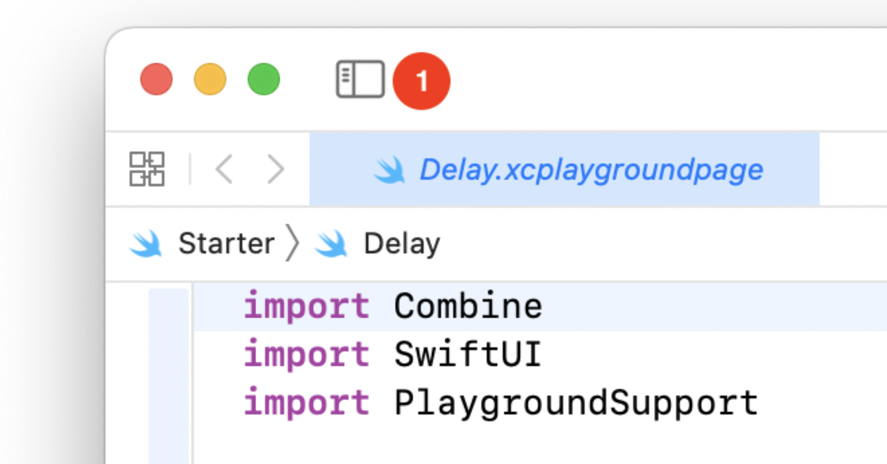

2. 接下来，查看窗口的右上角。 你将看到视图控件：

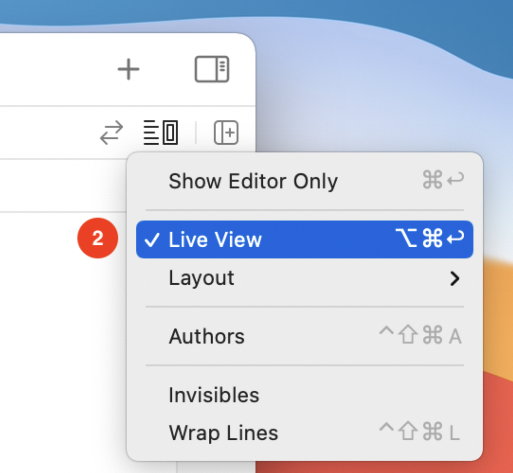


使用 Live View 显示 editor。 这将显示你在代码中构建的序列的实时视图。

3. 显示调试区域对于本章中的大多数示例都很重要。 使用窗口右下角的以下图标或使用键盘快捷键 Command-Shift-Y 切换调试区域：

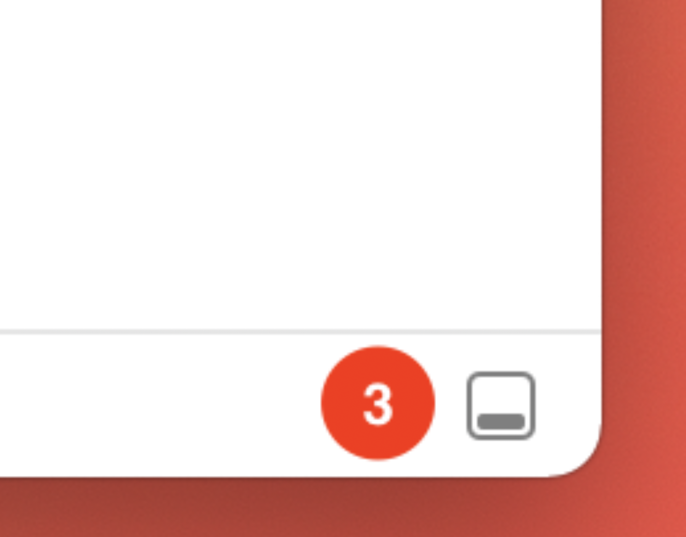


**Playground 不工作？**

有时 Xcode 可能会无法正常运行你的 Playground。 如果你遇到这种情况，请在 Xcode 中打开 Preferences 对话框并选择 Locations 选项卡。 单击 Derived Data 位置旁边的箭头，在下面的屏幕截图中用红色圆圈 1 表示。 它在 Finder 中显示 DerivedData 文件夹。

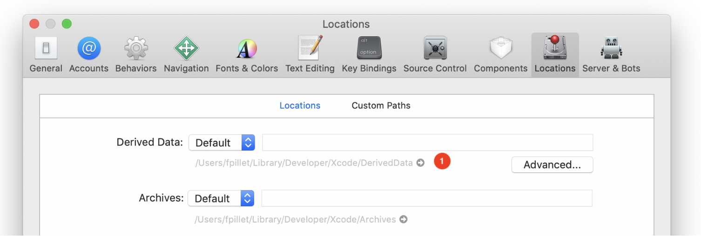

退出 Xcode，将 DerivedData 文件夹移至垃圾箱，然后再次启动 Xcode。你的 Playground 现在应该可以正常工作了！


### 移动时间(Shifting time)

最基本的时间操纵操作符会延迟来自发布者的值，以便你看到它们比它们实际出现的时间晚。

`delay(for:tolerance:scheduler:options)` 操作符对整个值序列进行时移：每次上游发布者发出一个值时，延迟都会将其保留一段时间，然后在你要求的延迟后在你的调度程序上发出它指定的。

打开 delay Playground 页面。你将看到的第一件事是，你不仅导入了 Combine 框架，还导入了 SwiftUI！这个动画游乐场是使用 SwiftUI 和 Combine 构建的。当你想探索时，最好仔细阅读 Sources 文件夹中的代码。

但首先要做的事情。首先定义几个常量，稍后你可以对其进行调整：

```swift
let valuesPerSecond = 1.0
let delayInSeconds = 1.5
```

你将创建一个每秒发出一个值的发布者，然后将其延迟 1.5 秒并同时显示两个时间线以进行比较。 完成此页面上的代码后，你将能够调整常量并在时间轴中查看结果。

接下来，创建你需要的发布者：

```swift
// 1
let sourcePublisher = PassthroughSubject<Date, Never>()

// 2
let delayedPublisher = sourcePublisher.delay(for: .seconds(delayInSeconds), scheduler: DispatchQueue.main)

// 3
let subscription = Timer
    .publish(every: 1.0 / valuesPerSecond, on: .main, in: .common)
    .autoconnect()
    .subscribe(sourcePublisher)
```

分解这段代码：

1. sourcePublisher 是一个 PassthroughSubject，你将提供 Timer 发出的 Date。 值的类型在这里并不重要。 你只关心发布者发出值时以及延迟后显示值时的映像。

2. delayPublisher 将延迟来自 sourcePublisher 的值并将它们发送到主调度程序。你将后文了解所有关于调度器的知识。 现在，指定值必须在主队列中结束，准备好显示以使用它们。

3. 创建一个在主线程上每秒传递一个值的计时器。 立即使用 `autoconnect()` 启动它，并通过 sourcePublisher 提供它发出的值。

> 注意：这个 Timer 是 Foundation Timer类的组合扩展。 它需要一个 RunLoop 和 RunLoop.Mode，而不是你可能期望的 DispatchQueue。 你将在后文了解有 Timer 的信息。 此外，Timer 是可连接的发布者类的一部分。 这意味着它们需要在开始发出值之前被连接。你使用 autoconnect() 在第一次订阅时立即连接。

你将创建两个视图，这两个视图将让你可视化事件。 将此代码添加到你的 Playground：

```swift
// 4
let sourceTimeline = TimelineView(title: "Emitted values (\(valuesPerSecond) per sec.):")

// 5
let delayedTimeline = TimelineView(title: "Delayed values (with a \(delayInSeconds)s delay):")

// 6
let view = VStack(spacing: 50) {
    sourceTimeline
    delayedTimeline
}

// 7
PlaygroundPage.current.liveView = UIHostingController(rootView: view.frame(width: 375, height: 600))
```

在此代码中：

4. 创建一个将显示来自 Timer 的值的 TimelineView。 TimelineView 是一个 SwiftUI 视图，它的代码可以在 Sources/Views.swift 找到。
5. 创建另一个 TimelineView 来显示延迟值。
6. 创建一个简单的 SwiftUI 垂直堆栈，以将两个时间线一个接一个地显示。
7. 设置此 Playground 页面的实时视图。 `frame(widht:height:)` 修饰符只是用来帮助为 Xcode 的预览设置一个固定的框架。

在这个阶段，你会在屏幕上看到两条空的时间线。 你现在需要向他们提供来自每个发布者的值！ 将此最终代码添加到操场：

```swift
sourcePublisher.displayEvents(in: sourceTimeline)
delayedPublisher.displayEvents(in: delayedTimeline)
```

在最后一段代码中，你将源发布者和延迟发布者连接到各自的时间线以显示事件。

保存这些源代码更改后，Xcode 将重新编译 Playground，查看实时视图窗格。


你会看到两个时间线。 顶部时间线显示 Timer 发出的值。 底部时间线显示相同的延迟的值。 圆圈内的数字反映了发出的值的数量，而不是它们的实际内容。


### 收集值(Collecting values)

在某些情况下，你可能需要以指定的时间间隔从发布者那里收集值。这是一种很有用的缓冲形式。 例如，当你想要在短时间内平均一组值并输出平均值时。

通过单击底部的 Next 链接或在 Project navigator 或跳转栏中选择它来切换到 Collect 页面。

与前面的示例一样，你将从一些常量开始：

```swift
let valuesPerSecond = 1.0
let collectTimeStride = 4
```

当然，阅读这些常量可以让你了解这一切的发展方向。 立即创建你的发布者：

```swift
// 1
let sourcePublisher = PassthroughSubject<Date, Never>()

// 2
let collectedPublisher = sourcePublisher
    .collect(.byTime(DispatchQueue.main, .seconds(collectTimeStride)))
```

与前面的示例一样：

1. 设置源发布者——一个将传递 Timer 发出的值的 `PassthroughSubject`。

2. 创建一个 `collectedPublisher`，它使用 `collect` 操作符收集它在 `collectTimeStride` 跨步期间接收到的值。 操作符将这些值组作为数组发送到指定的调度程序：`DispatchQueue.main`。

> 注意：你可能还记得在第 3 节“转换操作符”中学习了 collect 操作符，在那里你使用了一个简单的数字来定义如何将值组合在一起。 collect 的这种重载接受了对值进行分组的策略； 在这种情况下，按时间。


你将再次使用 Timer 定期发出值，就像你对延迟操作符所做的那样：

```swift
let subscription = Timer
    .publish(every: 1.0 / valuesPerSecond, on: .main, in: .common)
    .autoconnect()
    .subscribe(sourcePublisher)
```

接下来，像前面的示例一样创建时间线视图。 然后将 Playground 的实时视图设置为垂直堆栈，显示源时间轴和收集值的时间轴：

```swift
let sourceTimeline = TimelineView(title: "Emitted values:")
let collectedTimeline = TimelineView(title: "Collected values (every \(collectTimeStride)s):")

let view = VStack(spacing: 40) {
    sourceTimeline
    collectedTimeline
}

PlaygroundPage.current.liveView = UIHostingController(rootView: view.frame(width: 375, height: 600))
```

最后，将来自两个发布者的事件提供给时间线：

```swift
sourcePublisher.displayEvents(in: sourceTimeline)
collectedPublisher.displayEvents(in:collectedTimeline)
```

 现在看一下实时视图：

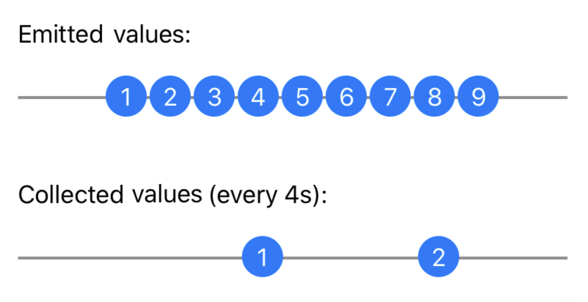

你会看到值定期出现在 Emitted values 时间轴上。 在它下方，你会看到收集的值时间线每四秒显示一个值。 但它是什么？

你可能已经猜到，该值是最近四秒内收到的一组值。 你可以改进显示以查看其中的实际内容！ 返回到创建 `collectedPublisher` 对象的行。 在其下方添加对 flatMap 操作符的使用，如下所示：

```swift
let collectedPublisher = sourcePublisher
    .collect(.byTime(DispatchQueue.main, .seconds(collectTimeStride)))
    .flatMap { dates in dates.publisher }
```

你还记得你在第 3 节“转换操作符”中学到的 flatMap 吗？ 你在这里很好地利用了它：每次 collect 发出一组它收集的值时，flatMap 再次将其分解为单个值，但会立即一个接一个地发出。 它使用 Collection 的 publisher extension，将一系列值转换为发布者，立即将序列中的所有值作为单独的值发出。

现在，看看它对时间轴的影响：


你现在可以看到，每四秒 collect 会发出一个在最后一个时间间隔内收集的值数组。


`collect(_:options:)` 操作符提供的第二个选项允许你定期收集值。它还允许你限制收集的值的数量。

留在同一个收集页面上，并在顶部的 collectTimeStride 正下方添加一个新常量：

```swift
let collectMaxCount = 2
```

接下来，在collectedPublisher之后创建一个新的发布者：

```swift
let collectedPublisher2 = sourcePublisher
    .collect(.byTimeOrCount(DispatchQueue.main,
                            .seconds(collectTimeStride),
                            collectMaxCount))
    .flatMap { dates in dates.publisher }
```

这一次，你使用 `.byTimeOrCount(Context, Context.SchedulerTimeType.Stride, Int)` 变体一次最多收集 collectMaxCount 值。

在collectedTimeline 之间为第二个collect 发布者添加一个新的 TimelineView 和 VStack：

```swift
let collectedTimeline2 = TimelineView(title: "Collected values (at most \(collectMaxCount) every \(collectTimeStride)s):")

let view = VStack(spacing: 40) {
    sourceTimeline
    collectedTimeline
    collectedTimeline2
}
```

最后，通过在 Playground 末尾添加以下内容，确保它在时间轴中显示它发出的事件：

```swift
collectedPublisher2.displayEvents(in:collectedTimeline2)
```

现在，让这个时间线运行一段时间，这样你就可以看到不同之处：

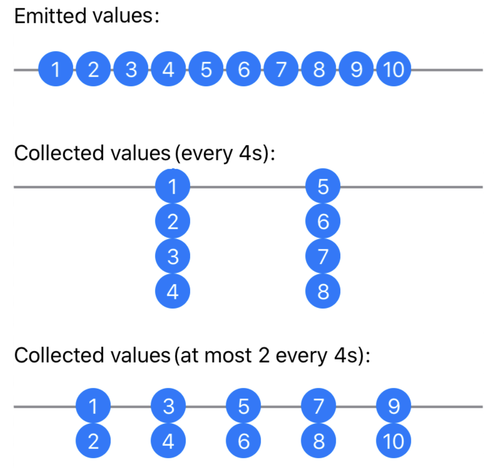

你可以在此处看到第二个时间线将其集合一次限制为两个值，这是 collectMaxCount 常量所要求的。


### 推迟事件

在编码用户界面时，你经常处理文本字段。使用组合将文本字段内容连接到操作是一项常见任务。 例如，你可能希望发送一个搜索 URL 请求，该请求返回与在文本字段中键入的内容匹配的项目列表。

但是，当然，你不希望每次用户输入一个字母时都发送请求！ 你需要某种机制来帮助仅在用户完成一段时间的输入时才能够识别输入的文本。

Combine 提供了两个可以在这里为你提供帮助的操作符：防抖(Debounce)和节流(Throttle)。


#### 防抖(Debounce)

切换到名为 Debounce 的 Playground 页面。 首先创建几个发布者：

```swift
// 1
let subject = PassthroughSubject<String, Never>()

// 2
let debounced = subject
    .debounce(for: .seconds(1.0), scheduler: DispatchQueue.main)
// 3
    .share()
```

在此代码中：

1. 创建一个发出字符串的发布者。
2. 使用 debounce 等待对象发射一秒钟。 然后，它将发送在该一秒间隔内发送的最后一个值（如果有）。 这具有允许每秒最多发送一个值的效果。
3. 你将多次订阅 debounced。 为了保证结果的一致性，你使用 share() 创建单个订阅点，这将同时向所有订阅者显示相同的结果。

> 注意：深入探讨 share() 操作符超出了本章的范围。请记住，当需要对发布者的单个订阅来向多个订阅者提供相同的结果时，它会很有帮助。 你将在后文“资源管理”中了解有关 share() 的更多信息。

对于接下来的几个示例，你将使用一组数据来模拟用户在文本字段中键入文本。 不要输入这个——它已经在 Sources/Data.swift 中为你实现了：

```swift
public let typingHelloWorld: [(TimeInterval, String)] = [
    (0.0, "H"),
    (0.1, "He"),
    (0.2, "Hel"),
    (0.3, "Hell"),
    (0.5, "Hello"),
    (0.6, "Hello "),
    (2.0, "Hello W"),
    (2.1, "Hello Wo"),
    (2.2, "Hello Wor"),
    (2.4, "Hello Worl"),
    (2.5, "Hello World")
]
```

模拟用户在 0.0 秒开始打字，在 0.6 秒后暂停，在 2.0 秒恢复打字。

> 注意：你将在 Debug 区域中看到的时间值可能会偏移 0.1 或 0.2 秒。 由于你将使用 DispatchQueue.asyncAfter() 在主队列上发出值，因此可以保证值之间的最小时间间隔，但可能不完全符合你的要求。

在 Playground 的 Debounce 页面中，创建两个时间线来可视化事件，并将它们连接到两个发布者：

```swift
let subjectTimeline = TimelineView(title: "Emitted values")
let debouncedTimeline = TimelineView(title: "Debounced values")

let view = VStack(spacing: 100) {
    subjectTimeline
    debouncedTimeline
}

PlaygroundPage.current.liveView = UIHostingController(rootView: view.frame(width: 375, height: 600))

subject.displayEvents(in: subjectTimeline)
debounced.displayEvents(in: debouncedTimeline)
```

你现在已经熟悉了这个 Playground 结构，你可以在屏幕上堆叠时间线并将它们连接到发布者以进行事件显示。

这一次，你将做更多的事情：打印每个发布者发出的值，以及它们出现的时间（自开始以来）。 这将帮助你弄清楚发生了什么。

添加此代码：

```swift
let subscription1 = subject
    .sink { string in
        print("+\(deltaTime)s: Subject emitted: \(string)")
    }

let subscription2 = debounced
    .sink { string in
        print("+\(deltaTime)s: Debounced emitted: \(string)")
    }
```

每个订阅都会打印它收到的值以及自开始以来的时间。 deltaTime 是在 Sources/DeltaTime.swift 中定义的动态全局变量，它格式化自 Playground 开始运行以来的时间差。

现在你需要为你的主题提供数据。 这一次，你将使用模拟用户键入文本的预制数据源。 全部在 Sources/Data.swift 中定义，你可以随意修改。 看一看，你会发现它是一个模拟用户输入“Hello World”这个词。

将此代码添加到 Playground 页面的末尾：

```swift
subject.feed(with: typingHelloWorld)
```

feed(with:) 方法获取一个数据集并以预定义的时间间隔将数据发送到给定的主题。 用于模拟和模拟数据输入的便捷工具！ 当你为代码编写测试时，你可能希望保留这一点，因为你将编写测试，不是吗？

现在看看结果：

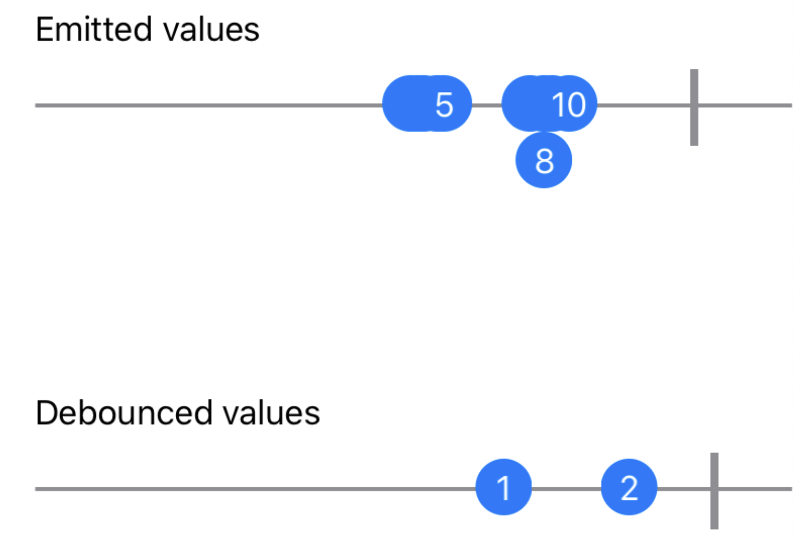

你会在顶部看到发出的值，总共有 11 个字符串被推送到 sourcePublisher。 你可以看到用户在这两个词之间停顿了一下。 这是 debounce 发出捕获的内容的时间。

你可以通过查看显示打印的调试区域来确认这一点：

```
+0.0s: Subject emitted: H
+0.1s: Subject emitted: He
+0.2s: Subject emitted: Hel
+0.3s: Subject emitted: Hell
+0.5s: Subject emitted: Hello
+0.6s: Subject emitted: Hello 
+1.6s: Debounced emitted: Hello 
+2.1s: Subject emitted: Hello W
+2.1s: Subject emitted: Hello Wo
+2.4s: Subject emitted: Hello Wor
+2.4s: Subject emitted: Hello Worl
+2.7s: Subject emitted: Hello World
+3.7s: Debounced emitted: Hello World
```

用户在 0.6 秒时暂停并仅在 2.1 秒时恢复输入。它在 1.6 秒时，发出最新接收到的值。在 2.7 秒打字结束，在一秒后的 3.7 秒结束时发出最新接收到的值。

> 注意：要注意的一件事是发布者的完成事件。如果你的发布者在发出最后一个值之后立即完成，且在为防抖配置的时间之前，你将永远不会看到去抖动发布者中的最后一个值！


#### 节流(Throttle)

debounce 允许的延迟模式非常有用，Combine 提供了一个相关的操作：`throttle(for:scheduler:latest:)`。 它非常接近防抖。

切换到 Playground 中的 Throttle 页面并开始编码。 首先，你需要一个常量，像往常一样：

```swift
let throttleDelay = 1.0

// 1
let subject = PassthroughSubject<String, Never>()

// 2
let throttled = subject
    .throttle(for: .seconds(throttleDelay), scheduler: DispatchQueue.main, latest: false)
// 3
    .share()
```

分解这段代码：

1. 源发布者将发出字符串。
2. 由于你将 latest 设置为 false，因此你的 throttled subject 现在将仅在每个一秒间隔内发出从 subject 接收到的第一个值。
3. 和之前的操作符 debounce 一样，在此处添加 share() 操作符可以保证所有订阅者同时从节流主题看到相同的输出。

创建时间线以可视化事件，并将它们连接到两个发布者：

```swift
let subjectTimeline = TimelineView(title: "Emitted values")
let throttledTimeline = TimelineView(title: "Throttled values")

let view = VStack(spacing: 100) {
    subjectTimeline
    throttledTimeline
}

PlaygroundPage.current.liveView = UIHostingController(rootView: view.frame(width: 375, height: 600))

subject.displayEvents(in: subjectTimeline)
throttled.displayEvents(in: throttledTimeline)
```

现在你还想打印每个发布者发出的值，以更好地了解发生了什么。 添加此代码：

```swift
let subscription1 = subject
    .sink { string in
        print("+\(deltaTime)s: Subject emitted: \(string)")
    }

let subscription2 = throttled
    .sink { string in
        print("+\(deltaTime)s: Throttled emitted: \(string)")
    }
```

同样，你将向源发布者提供模拟的“Hello World”用户输入。 将最后一行添加到你的 Playground 页面：

```swift
subject.feed(with: typingHelloWorld)
```

你现在可以在实时视图中看到正在发生的事情：

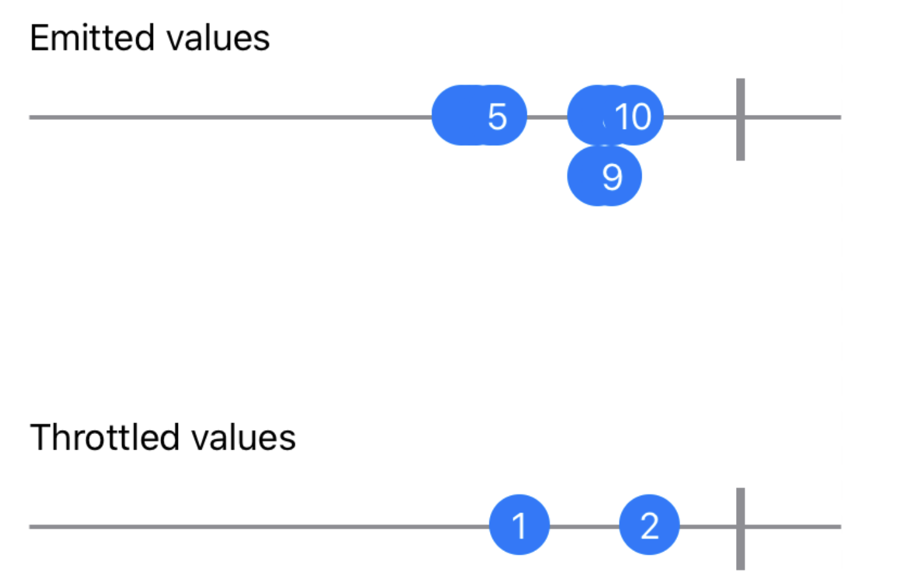

它看起来与之前的 debounce 输出没有太大区别。首先，仔细观察两者。可以看到，throttle 发出的值在时间上略有不同。其次，为了更好地了解正在发生的事情，请查看调试控制台：

```
+0.0s: Subject emitted: H
+0.0s: Throttled emitted: H
+0.1s: Subject emitted: He
+0.2s: Subject emitted: Hel
+0.3s: Subject emitted: Hell
+0.5s: Subject emitted: Hello
+0.6s: Subject emitted: Hello 
+1.0s: Throttled emitted: He
+2.2s: Subject emitted: Hello W
+2.2s: Subject emitted: Hello Wo
+2.2s: Subject emitted: Hello Wor
+2.4s: Subject emitted: Hello Worl
+2.7s: Subject emitted: Hello World
+3.0s: Throttled emitted: Hello W
```

这明显不一样！你可以在这里看到一些有趣的事情：

- 当对象发出它的第一个值时，Throttle 立即转发它。然后，它开始限制输出。

- 在 1.0 秒时，Throttle 发出“He”。请记住，你要求它在一秒钟后向你发送第一个值（自最后一个值）。

- 在 2.2 秒时，键入恢复。可以看到此时，throttle 没有发出任何东西。这是因为没有从源发布者那里收到新值。

- 在 3.0 秒，输入完成后，Throttle 再次启动并再次输出第一个值，即 2.2 秒的值。

在那里你有防抖动和油门节流的根本区别：

- 防抖等待它接收到的值暂停，然后在指定的时间间隔后发出最新的值。

- 节流等待指定的时间间隔，然后发出它在该时间间隔内收到的第一个或最新的值。它不关心暂停。

要查看将 latest 更改为 true 时会发生什么，请将受限制的发布者的设置更改为以下内容：

```swift
let throttled = subject
    .throttle(for: .seconds(throttleDelay), scheduler: DispatchQueue.main, latest: true)
```

现在，在调试区域观察结果输出：

```
+0.0s: Subject emitted: H
+0.0s: Throttled emitted: H
+0.1s: Subject emitted: He
+0.2s: Subject emitted: Hel
+0.3s: Subject emitted: Hell
+0.5s: Subject emitted: Hello
+0.6s: Subject emitted: Hello 
+1.0s: Throttled emitted: Hello
+2.0s: Subject emitted: Hello W
+2.3s: Subject emitted: Hello Wo
+2.3s: Subject emitted: Hello Wor
+2.6s: Subject emitted: Hello Worl
+2.6s: Subject emitted: Hello World
+3.0s: Throttled emitted: Hello World
```

节流输出恰好发生在 1.0 秒和 3.0 秒，时间窗口中的最新值而不是最早的值。 将此与前面示例中 debounce 的输出进行比较：
...
+1.6s: Debounced emitted: Hello 
...
+3.7s: Debounced emitted: Hello World
输出是一样的，但是 debounce 是在暂停后延迟的。


### 超时(Timing out)

在本次时间操纵操作符综述中，下一个是一个特殊的操作符：超时。其主要目的是在语义上区分实际计时和超时条件。 因此，当超时操作符触发时，它要么完成发布者，要么发出你指定的错误。 在这两种情况下，发布者都会终止。

切换到 Timeout Playground 页面。 首先添加以下代码：

```swift
let subject = PassthroughSubject<Void, Never>()

// 1
let timedOutSubject = subject.timeout(.seconds(5), scheduler: DispatchQueue.main)
```


timedOutSubject 发布者将在 5 秒后超时，上游发布者不会发出任何值。 这种形式的超时强制发布者完成而没有任何失败。

你现在需要添加你的时间线，以及一个让你触发事件的按钮：

```swift
let timeline = TimelineView(title: "Button taps")

let view = VStack(spacing: 100) {
    // 1
    Button(action: { subject.send() }) {
        Text("Press me within 5 seconds")
    }
    timeline
}

PlaygroundPage.current.liveView = UIHostingController(rootView: view.frame(width: 375, height: 600))

timedOutSubject.displayEvents(in: timeline)
```

你在时间线上方添加一个按钮，按下该按钮会通过源主题发送一个新值。 每次按下按钮时，action 闭包都会执行。

> 注意：你是否注意到你正在使用发出 Void 值的 subject？ 是的，这是完全合法的！ 它表明发生了什么事。 但是，没有特别的价值可以携带。 因此，你只需使用 Void 作为值类型。 这是很常见的情况，Subject 有一个带有 send() 函数的扩展，如果输出类型为 Void，则该函数不接受任何参数。 这使你免于编写笨拙的 subject.send(()) 语句！


你的 Playground 页面现已完成。 看着它运行，什么都不做：超时将在五秒后触发并完成发布者。

现在，再次运行它。 这一次，以少于五秒的间隔持续按下按钮。 发布者永远不会完成，因为没有超时。

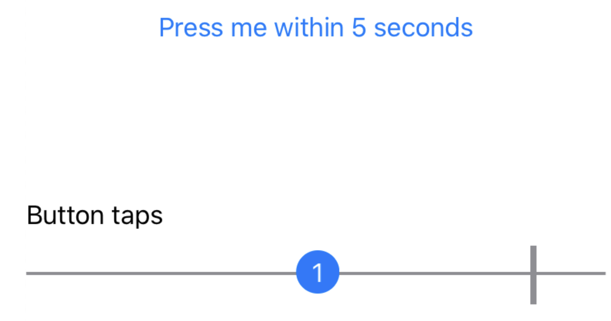

当然，在很多情况下，简单的完成一个发布者并不是你想要的。 相反，你需要超时发布者发送失败消息，以便在这种情况下准确地采取措施。

转到 Playground 页面的顶部并定义你想要的错误类型：

```swift
enum TimeoutError: Error {
    case timedOut
}
```

接下来，修改 subject 的定义，将错误类型从 Never 更改为 TimeoutError。你的代码应如下所示：

```swift
let subject = PassthroughSubject<Void, TimeoutError>()
```

现在你需要将调用修改为 `.timeout`。此操作符的完整签名是 `timeout(_:scheduler:options:customError:)`。这是你提供自定义错误类型的机会！

将创建 timedOutSubject 的行修改为：

```swift
let timedOutSubject = subject.timeout(.seconds(5),
                                      scheduler: DispatchQueue.main,
                                      customError: { .timedOut })
```

现在，当你运行 Playground 并且五秒钟内没有按下按钮时，你可以看到 timedOutSubject 发出了失败。

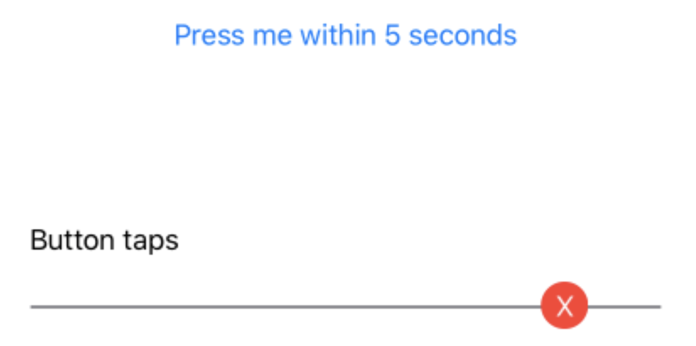

### 测量时间(Measuring time)

为了完成时间操纵操作符的汇总，你将查看一个不操纵时间而只是测量时间的特定操作符。当你需要找出发布者发出的两个连续值之间经过的时间时，`measureInterval(using:)` 操作符是你的工具。

切换到 MeasureInterval Playground 页面。首先创建一对发布者：

```swift
let subject = PassthroughSubject<String, Never>()

// 1
let measureSubject = subject.measureInterval(using: DispatchQueue.main)
```

measureSubject 将在你指定的调度程序上发出测量值。

现在像往常一样，添加几个时间线：

```swift
let subjectTimeline = TimelineView(title: "Emitted values")
let measureTimeline = TimelineView(title: "Measured values")

let view = VStack(spacing: 100) {
  subjectTimeline
  measureTimeline
}

PlaygroundPage.current.liveView = UIHostingController(rootView: view.frame(width: 375, height: 600))

subject.displayEvents(in: subjectTimeline)
measureSubject.displayEvents(in: measureTimeline)
```

最后，有趣的部分来了。 打印出两个发布者发出的值：

```swift
let subscription1 = subject.sink {
    print("+\(deltaTime)s: Subject emitted: \($0)")
}

let subscription2 = measureSubject.sink {
    print("+\(deltaTime)s: Measure emitted: \($0)")
}
subject.feed(with: typingHelloWorld)
```

运行你的 Playground 并查看调试区域！ 在这里你可以看到 `measureInterval(using:)` 发出的度量值：

```
+0.0s: Subject emitted: H
+0.0s: Measure emitted: Stride(magnitude: 16818353)
+0.1s: Subject emitted: He
+0.1s: Measure emitted: Stride(magnitude: 87377323)
+0.2s: Subject emitted: Hel
+0.2s: Measure emitted: Stride(magnitude: 111515697)
+0.3s: Subject emitted: Hell
+0.3s: Measure emitted: Stride(magnitude: 105128640)
+0.5s: Subject emitted: Hello
+0.5s: Measure emitted: Stride(magnitude: 228804831)
+0.6s: Subject emitted: Hello 
+0.6s: Measure emitted: Stride(magnitude: 104349343)
+2.2s: Subject emitted: Hello W
+2.2s: Measure emitted: Stride(magnitude: 1533804859)
+2.2s: Subject emitted: Hello Wo
+2.2s: Measure emitted: Stride(magnitude: 154602)
+2.4s: Subject emitted: Hello Wor
+2.4s: Measure emitted: Stride(magnitude: 228888306)
+2.4s: Subject emitted: Hello Worl
+2.4s: Measure emitted: Stride(magnitude: 138241)
+2.7s: Subject emitted: Hello World
+2.7s: Measure emitted: Stride(magnitude: 333195273)
```

这些值有点令人费解。根据文档，measureInterval 发出的值的类型是“提供的调度程序的时间间隔”。 在 DispatchQueue 的情况下，TimeInterval 定义为“使用此类型的值创建的 DispatchTimeInterval，以纳秒为单位。”。

你在这里看到的是从源主题接收到的每个连续值之间的计数（以纳秒为单位）。 你现在可以修复显示以显示更具可读性的值。 修改从 measureSubject 打印值的代码，如下所示：

```swift
let subscription2 = measureSubject.sink {
  print("+\(deltaTime)s: Measure emitted: \(Double($0.magnitude) / 1_000_000_000.0)")
}
```

现在，你将在几秒钟内看到值。

但是如果你使用不同的调度器会发生什么呢？ 你可以使用 RunLoop 而不是 DispatchQueue 进行尝试！

> 注意：你将在后文深入探索 RunLoop 和 DispatchQueue 调度程序。

回到文件顶部，创建第二个使用 RunLoop 的主题：

```swift
let measureSubject2 = subject.measureInterval(using: RunLoop.main)
```

你无需费心连接新的时间线视图，因为有趣的是调试输出。将第三个订阅添加到你的代码中：

```swift
let subscription3 = measureSubject2.sink {
  	print("+\(deltaTime)s: Measure2 emitted: \($0)")
}
```

现在，你还将看到 RunLoop 调度程序的输出，其幅度直接以秒表示：

```
+0.0s: Subject emitted: H
+0.0s: Measure emitted: 0.016503769
+0.0s: Measure2 emitted: Stride(magnitude: 0.015684008598327637)
+0.1s: Subject emitted: He
+0.1s: Measure emitted: 0.087991755
+0.1s: Measure2 emitted: Stride(magnitude: 0.08793699741363525)
+0.2s: Subject emitted: Hel
+0.2s: Measure emitted: 0.115842671
+0.2s: Measure2 emitted: Stride(magnitude: 0.11583995819091797)
...
```

你用于测量的调度程序实际上取决于你的个人喜好。对所有事情都坚持使用 DispatchQueue 通常是一个好主意。 但这是你个人的选择！


### 挑战

#### 挑战：Data

如果时间允许，你可能想尝试一点挑战来充分利用这些新知识！

打开项目/挑战文件夹中的 Playground。你会看到一些代码在等着你：

- 发出整数的 subject。

- 向 subject 提供神秘数据的函数调用。

在这些部分之间，你的挑战是：

- 以 0.5 秒为单位对数据进行分组。

- 将分组数据转换为字符串。

- 如果提暂停时间超过 0.9 秒，请打印 👏 表情符号。提示：为此步骤创建第二个发布者并将其与订阅中的第一个发布者合并。

- 打印它。

> 注意：要将 Int 转换为 Character，你可以执行 Character(Unicode.Scalar(value)!) 之类的操作。


如果你正确地编码了这个挑战，你会在 Debug 区域看到一个打印的句子。它是什么？


### 解决方案

你将在 challenge/Final.playground中找到该挑战的解决方案。

这是解决方案代码：

```swift
// 1
let strings = subject
// 2
    .collect(.byTime(DispatchQueue.main, .seconds(0.5)))
// 3
    .map { array in
        String(array.map { Character(Unicode.Scalar($0)!) })
    }

// 4
let spaces = subject.measureInterval(using: DispatchQueue.main)
    .map { interval in
        // 5
        interval > 0.9 ? "👏" : ""
    }

// 6
let subscription = strings
    .merge(with: spaces)
// 7
    .filter { !$0.isEmpty }
    .sink {
        // 8
        print($0)
    }
```

上述代码：

1. 创建从发出字符串的 subject 派生的第一个发布者。

2. 使用 collect() 使用 .byTime 策略以 0.5 秒的批次对数据进行分组。

3. 将每个整数值映射到 Unicode Scalar，然后映射到字符，然后使用 map 将整个整数值转换为字符串。
4. 创建从 subject 派生的第二个发布者，它测量每个字符之间的间隔。
5. 如果间隔大于0.9秒，将值映射到👏表情符号。否则，将其映射到一个空字符串。
6. 最终发布者是字符串和👏表情符号的合并。
7. 过滤掉空字符串以获得更好的显示。
8. 打印结果！

你的解决方案可能略有不同，这没关系。只要满足要求即可！

使用此解决方案运行 Playground 会将以下输出打印到控制台：

```
结合
👏
是
👏
凉爽的！
```


### 关键点

在本章中，你从不同的角度看待时间。特别是，你了解到：

- Combine 对异步事件的处理扩展到操纵时间本身。
- 该框架具有允许你在很长一段时间内抽象工作的操作符，而不仅仅是处理离散事件。
- 可以使用 delay 操作符来移动时间。

- 你可以使用 collect 分块收集它们。

- 使用防抖和节流选择单个值。

- 不让时间用完是 timeout 的工作。

- 时间可以用 measureInterval 来测量。


### 接下来去哪？

这需要学习很多东西。要将事件按正确的顺序排列，请转到下一章并了解序列操作符！


## 第 7 节：序列操作符

至此，你已经了解了 Combine 提供的大多数操作符！不过，还有一个类别可供你深入研究：序列操作符。

当你意识到发布者本身就是序列时，序列操作符最容易理解。序列操作符与发布者的值一起使用，就像数组或集合一样——当然，它们只是有限序列！

考虑到这一点，序列操作符主要将发布者作为一个整体来处理，而不是像其他操作符类别那样处理单个值。

此类中的许多操作符的名称和行为与 Swift 标准库中的对应操作符几乎相同。


### 入门

你可以在 projects/Starter.playground 中找到本章的 Playground。在本章中，你将向 Playground 添加代码并运行它，以查看这些不同的序列操作符如何操纵你的发布者。你将使用 print 操作符记录所有发布事件。


### 寻找值

本节的第一部分，由根据不同的标准定位发布者发出的特定值的操作符组成。这些类似于 Swift 标准库中的 collection 方法。

**`min`**

min 操作符可让你找到发布者发出的最小值。 它是贪婪的，这意味着它必须等待发布者发送一个 .finished 完成事件。 一旦发布者完成，操作者只会发出最小值：


将以下示例添加到你的 Playground 以尝试 min：

```swift
example(of: "min") {
    // 1
    let publisher = [1, -50, 246, 0].publisher
    
    // 2
    publisher
        .print("publisher")
        .min()
        .sink(receiveValue: { print("Lowest value is \($0)") })
        .store(in: &subscriptions)
}
```

在此代码中：

1. 创建一个发布四个不同数字的发布者。

2. 使用 min 操作符查找发布者发出的最小数量并打印该值。

运行你的 Playground，你将在控制台中看到以下输出：

```
——— Example of: min ———
publisher: receive subscription: ([1, -50, 246, 0])
publisher: request unlimited
publisher: receive value: (1)
publisher: receive value: (-50)
publisher: receive value: (246)
publisher: receive value: (0)
publisher: receive finished
Lowest value is -50
```

如你所见，发布者发出其所有值并完成，然后 min 找到最小值并将其发送到下游接收器以将其打印出来。

但是等等，Combine 怎么知道这些数字中的哪一个是最小值？ 嗯，这要归功于数值符合 Comparable 协议。你可以在发出 Comparable-conforming 类型的发布者上直接使用 min() ，无需任何参数。

但是，如果你的值不符合 Comparable 会发生什么？ 幸运的是，你可以使用 min(by:) 操作符提供自己的比较器闭包。

考虑以下示例，你的发布者发出许多数据，而你希望找到最小的数据。

将以下代码添加到你的 Playground：

```swift
example(of: "min non-Comparable") {
    // 1
    let publisher = ["12345",
                     "ab",
                     "hello world"]
        .map { Data($0.utf8) } // [Data]
        .publisher // Publisher<Data, Never>
    
    // 2
    publisher
        .print("publisher")
        .min(by: { $0.count < $1.count })
        .sink(receiveValue: { data in
            // 3
            let string = String(data: data, encoding: .utf8)!
            print("Smallest data is \(string), \(data.count) bytes")
        })
        .store(in: &subscriptions)
}
```

在上面的代码中：

1. 你创建一个发布者，该发布者发出三个从各种字符串创建的 Data 对象。

2. 由于 Data 不符合 Comparable，因此使用 min(by:) 操作符查找字节数最少的 Data 对象。

3. 将最小的 Data 对象转换回字符串并打印出来。

运行你的 Playground，你将在控制台中看到以下内容：

```
——— Example of: min non-Comparable ———
publisher: receive subscription: ([5 bytes, 2 bytes, 11 bytes])
publisher: request unlimited
publisher: receive value: (5 bytes)
publisher: receive value: (2 bytes)
publisher: receive value: (11 bytes)
publisher: receive finished
Smallest data is ab, 2 bytes
```

与前面的示例一样，发布者发出其所有 Data 对象并完成，然后 min(by:) 找到并发出具有最小字节大小的数据，并且接收器将其打印出来。


**`max`**

正如你所猜测的，max 的工作方式与 min 完全相同，只是它找到了发布者发出的最大值：

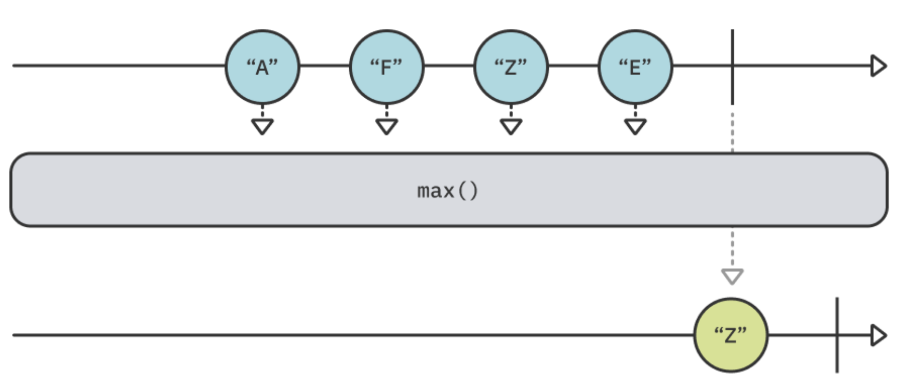

将以下代码添加到你的 Playground 以尝试此示例：

```swift
example(of: "max") {
    // 1
    let publisher = ["A", "F", "Z", "E"].publisher
    
    // 2
    publisher
        .print("publisher")
        .max()
        .sink(receiveValue: { print("Highest value is \($0)") })
        .store(in: &subscriptions)
}
```

在以下代码中，你：

1. 创建一个发出四个不同字母的发布者。

2. 使用 max 操作符找出数值最高的字母并打印出来。

运行 Playground。你将在 Playground 中看到以下输出：

```
——— Example of: max ———
publisher: receive subscription: (["A", "F", "Z", "E"])
publisher: request unlimited
publisher: receive value: (A)
publisher: receive value: (F)
publisher: receive value: (Z)
publisher: receive value: (E)
publisher: receive finished
Highest value is Z
```

与 min 完全一样，max 是贪婪的，必须等待上游发布者完成其值的发送，然后才能确定最大值。 在这种情况下，该值为 Z。

> 注意：与 min 完全一样，max 也有一个伴随的 max(by:) 操作符，它接受一个谓词来确定在 non-Comparable 值中发出的最大值。


**`first`**

虽然 min 和 max 操作符处理在某个未知索引处查找发布的值，但本节中的其余操作符处理在特定位置查找发出的值，从 first 操作符符开始。

第一个操作符类似于 Swift 的 collection 的 first 属性，它让第一个发出的值通过然后完成。它是惰性的，这意味着它不会等待上游发布者完成，而是会在接收到发出的第一个值时取消订阅。

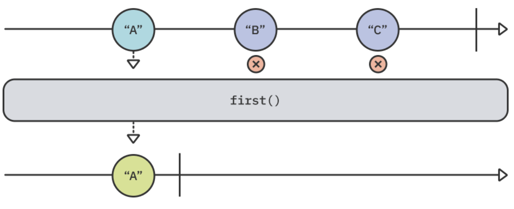

将上面的示例添加到你的 Playground：

```swift
example(of: "first") {
    // 1
    let publisher = ["A", "B", "C"].publisher
    
    // 2
    publisher
        .print("publisher")
        .first()
        .sink(receiveValue: { print("First value is \($0)") })
        .store(in: &subscriptions)
}
```

在上面的代码中，你：

1. 创建一个发出三个字母的发布者。

2. 使用 first() 只让第一个发出的值通过并打印出来。

运行你的 Playground 并查看控制台：

```
——— Example of: first ———
publisher: receive subscription: (["A", "B", "C"])
publisher: request unlimited
publisher: receive value: (A)
publisher: receive cancel
First value is A
```

一旦 first() 获得发布者的第一个值，它就会取消对上游发布者的订阅。

如果你正在寻找更精细的控制，你也可以使用 first(where:)。 就像它在 Swift 标准库中的对应物一样，它将发出与提供的条件匹配的第一个值——如果有的话。

将以下示例添加到你的 Playground：

```swift
example(of: "first(where:)") {
  // 1
  let publisher = ["J", "O", "H", "N"].publisher

  // 2
  publisher
    .print("publisher")
    .first(where: { "Hello World".contains($0) })
    .sink(receiveValue: { print("First match is \($0)") })
    .store(in: &subscriptions)
}
```

在此代码中：

1. 创建一个发出四个字母的发布者。

2. 使用 first(where:) 操作符查找 Hello World 中包含的第一个字母，然后将其打印出来。

运行 Playground，你将看到以下输出：

```
——— Example of: first(where:) ———
publisher: receive subscription: (["J", "O", "H", "N"])
publisher: request unlimited
publisher: receive value: (J)
publisher: receive value: (O)
publisher: receive value: (H)
publisher: receive cancel
First match is H
```

在上面的示例中，操作符检查 Hello World 是否包含发出的字母，直到找到第一个匹配项：H。找到那么多后，它会取消订阅并发出字母让 sink 打印出来。


**`last`**

正如 min 有一个对立面，max，first 也有一个对应的操作符：last！

last 的工作方式与 first 完全相同，只是它发出发布者发出的最后一个值。 这意味着它也是贪婪的，必须等待上游发布者完成：

将此示例添加到你的 Playground：

```swift
example(of: "last") {
    // 1
    let publisher = ["A", "B", "C"].publisher
    
    // 2
    publisher
        .print("publisher")
        .last()
        .sink(receiveValue: { print("Last value is \($0)") })
        .store(in: &subscriptions)
}
```

在此代码中：

1. 创建一个将发出三个字母并完成的发布者。

2. 使用 last 操作符只发出最后发布的值并打印出来。

运行 Playground，你将看到以下输出：

```
——— Example of: last ———
publisher: receive subscription: (["A", "B", "C"])
publisher: request unlimited
publisher: receive value: (A)
publisher: receive value: (B)
publisher: receive value: (C)
publisher: receive finished
Last value is C
```

last 等待上游发布者发送一个 `.finished` 完成事件，此时它向下游发送最后一个发出的值，以便在接收器中打印出来。

> 注意：与 first 完全一样，last 也有一个 `last(where:)` 重载，它发出匹配指定条件的发布者发出的最后一个值。


**`output(at:)`**

本节中的最后两个操作符在 Swift 标准库中没有对应的操作符。 output 操作符将查找上游发布者在指定索引处发出的值。

你将从 output(at:) 开始，它只发出在指定索引处发出的值：


将以下代码添加到你的 Playground 以尝试此示例：

```swift
example(of: "output(at:)") {
    // 1
    let publisher = ["A", "B", "C"].publisher
    
    // 2
    publisher
        .print("publisher")
        .output(at: 1)
        .sink(receiveValue: { print("Value at index 1 is \($0)") })
        .store(in: &subscriptions)
}
```

在上面的代码中：

1. 创建一个发出三个字母的发布者。

2. 使用 output(at:) 只允许在索引 1 处发出的值——即第二个值。

在你的 Playground 中运行该示例并查看你的控制台：

```
——— Example of: output(at:) ———
publisher: receive subscription: (["A", "B", "C"])
publisher: request unlimited
publisher: receive value: (A)
publisher: request max: (1) (synchronous)
publisher: receive value: (B)
Value at index 1 is B
publisher: receive cancel
```

在这里，输出表明索引 1 处的值是 B。但是，你可能已经注意到另一个有趣的事实：操作符在每个发出的值之后都需要一个值，因为它知道它只是在寻找单个项目。虽然这是特定操作符的实现细节，但它提供了有关 Apple 如何设计一些自己的内置 Combine 操作符以利用背压的有趣见解。


**`output(in:)`**

你将使用 output 操作符的第二个重载：`output(in:)`。当 output(at:) 发出在指定索引处发出的单个值时， output(in:) 发出其索引在给定范围内的值：

要尝试这一点，请将以下示例添加到你的 Playground：

```swift
example(of: "output(in:)") {
    // 1
    let publisher = ["A", "B", "C", "D", "E"].publisher
    
    // 2
    publisher
        .output(in: 1...3)
        .sink(receiveCompletion: { print($0) },
              receiveValue: { print("Value in range: \($0)") })
        .store(in: &subscriptions)
}
```

在前面的代码中：

1. 创建一个发出五个不同字母的发布者。

2. 使用 `output(in:)` 操作符只允许在索引 1 到 3 中发出的值通过，然后打印出这些值。

运行你的 Playground：

```
——— Example of: output(in:) ———
Value in range: B
Value in range: C
Value in range: D
finished
```

操作符发出索引范围内的单个值，而不是它们的集合。 操作符打印值 B、C 和 D，因为它们分别位于索引 1、2 和 3 中。 然后，由于该范围内的所有项目都已发出，因此它会在收到所提供范围内的所有值后立即取消订阅。


### 查询发布者

以下操作符还处理发布者发出的整个值集，但它们不会产生它发出的任何特定值。 相反，这些操作符发出一个不同的值，表示对整个发布者的某些查询。 count 操作符就是一个很好的例子。


**`count`**

count 操作符将发出单个值 - 一旦发布者发送 .finished 完成事件，上游发布者发出的值的数量：


添加以下代码以尝试此示例：

```swift
example(of: "count") {
    // 1
    let publisher = ["A", "B", "C"].publisher
    
    // 2
    publisher
        .print("publisher")
        .count()
        .sink(receiveValue: { print("I have \($0) items") })
        .store(in: &subscriptions)
}
```

在上面的代码中：

1. 创建一个发出三个字母的发布者。

2. 使用 count() 发出单个值，指示上游发布者发出的值的数量。

运行你的 Playground 并检查你的控制台。 你将看到以下输出：

```
——— Example of: count ———
publisher: receive subscription: (["A", "B", "C"])
publisher: request unlimited
publisher: receive value: (A)
publisher: receive value: (B)
publisher: receive value: (C)
publisher: receive finished
I have 3 items
```

正如预期的那样，只有在上游发布者发送 .finished 完成事件后才会打印出值 3。


**`contains`**

另一个有用的操作符是 contains。 你可能不止一次地在 Swift 标准库中使用过它。

如果上游发布者发出指定的值，则 contains 操作符将发出 true 并取消订阅，如果发出的值都不等于指定的值，则返回 false：

将以下内容添加到你的 Playground 以尝试包含：

```swift
example(of: "contains") {
    // 1
    let publisher = ["A", "B", "C", "D", "E"].publisher
    let letter = "C"
    
    // 2
    publisher
        .print("publisher")
        .contains(letter)
        .sink(receiveValue: { contains in
            // 3
            print(contains ? "Publisher emitted \(letter)!"
                  : "Publisher never emitted \(letter)!")
        })
        .store(in: &subscriptions)
}
```

在前面的代码中：

1. 创建一个发出五个不同字母（A 到 E）的发布者，并创建一个与 contains 一起使用的字母值。

2. 使用 contains 检查上游发布者是否发出了 letter: C 的值。

3. 根据是否发出值打印适当的消息。

运行你的 Playground 并检查控制台：

```
——— Example of: contains ———
publisher: receive subscription: (["A", "B", "C", "D", "E"])
publisher: request unlimited
publisher: receive value: (A)
publisher: receive value: (B)
publisher: receive value: (C)
publisher: receive cancel
Publisher emitted C!
```

你收到一条消息，表明 C 是由发布者发出的。你可能还注意到 contains 是惰性的，因为它只消耗执行其工作所需的上游值。一旦找到 C，它就会取消订阅并且不会产生任何进一步的值。

你为什么不尝试另一种变化？替换以下行：

```swift
let letter = "C"
```

为：

```swift
let letter = "F"
```

接下来，再次运行你的游乐场。你将看到以下输出：

```
——— Example of: contains ———
publisher: receive subscription: (["A", "B", "C", "D", "E"])
publisher: request unlimited
publisher: receive value: (A)
publisher: receive value: (B)
publisher: receive value: (C)
publisher: receive value: (D)
publisher: receive value: (E)
publisher: receive finished
Publisher never emitted F!
```

在这种情况下， contains 等待发布者发出 F。但是，发布者在没有发出 F 的情况下完成，因此 contains 发出 false 并且你会看到打印出的相应消息。

最后，有时你想为你提供的条件查找匹配项，或检查是否存在不符合 Comparable 的发出值。对于这些特定情况，你有 contains(where:)。

将以下示例添加到你的 Playground：

```swift
example(of: "contains(where:)") {
    // 1
    struct Person {
        let id: Int
        let name: String
    }
    
    // 2
    let people = [
        (123, "Shai Mishali"),
        (777, "Marin Todorov"),
        (214, "Florent Pillet")
    ]
        .map(Person.init)
        .publisher
    
    // 3
    people
        .contains(where: { $0.id == 800 })
        .sink(receiveValue: { contains in
            // 4
            print(contains ? "Criteria matches!"
                  : "Couldn't find a match for the criteria")
        })
        .store(in: &subscriptions)
}
```

前面的代码有点复杂，但不是很多：

1. 定义一个带有 id 和 name 的 Person 结构体。
2. 创建发布人的三个不同实例的发布者。
3.使用contains查看其中任何一个的 id 是否为 800。
4. 根据发出的结果打印适当的消息。

运行你的 Playground，你会看到以下输出：

```
——— Example of: contains(where:) ———
Couldn't find a match for the criteria
```

正如预期的那样，它没有找到任何匹配项，因为没有一个发出的人的 id 为 800。

接下来，更改 contains(where:) 的实现：

```swift
.contains(where: { $0.id == 800 })
```

为：

```swift
.contains(where: { $0.id == 800 || $0.name == "Marin Todorov" })
```

再次运行 Playground 并查看控制台：

```
——— Example of: contains(where:) ———
Criteria matches!
```

这次它找到了与条件匹配的值，因为 Marin 确实是你列表中的人之一。 


**`allSatisfy`**

 allSatisfy 接受一个闭包条件并发出一个布尔值，指示上游发布者发出的所有值是否与该谓词匹配。 它是贪婪的，因此会等到上游发布者发出 .finished 完成事件：

将以下示例添加到你的 Playground 以尝试此操作：

```swift
example(of: "allSatisfy") {
    // 1
    let publisher = stride(from: 0, to: 5, by: 2).publisher
    
    // 2
    publisher
        .print("publisher")
        .allSatisfy { $0 % 2 == 0 }
        .sink(receiveValue: { allEven in
            print(allEven ? "All numbers are even"
                  : "Something is odd...")
        })
        .store(in: &subscriptions)
}
```

在上面的代码中：

1. 创建一个以 2 为步长（即 0、2 和 4）发出 0 到 5 之间的数字的发布者。

2. 使用 allSatisfy 检查是否所有发出的值都是偶数，然后根据发出的结果打印适当的消息。

运行代码并检查控制台输出：

```
——— Example of: allSatisfy ———
publisher: receive subscription: (Sequence)
publisher: request unlimited
publisher: receive value: (0)
publisher: receive value: (2)
publisher: receive value: (4)
publisher: receive finished
All numbers are even
```

由于所有值确实是偶数，因此在上游发布者发送 .finished 完成后，操作符会发出 true ，并打印出适当的消息。

但是，即使单个值没有通过谓词条件，操作符也会立即发出 false 并取消订阅。

替换以下行：

```swift
let publisher = stride(from: 0, to: 5, by: 2).publisher
```

为：

```swift
let publisher = stride(from: 0, to: 5, by: 1).publisher
```

你只需将步幅更改为 1，而不是 2，在 0 和 5 之间步进。再次运行 Playground 并查看控制台：

```
——— Example of: allSatisfy ———
publisher: receive subscription: (Sequence)
publisher: request unlimited
publisher: receive value: (0)
publisher: receive value: (1)
publisher: receive cancel
```

在这种情况下，一旦发出 1，条件就不再通过，所以 allSatisfy 发出 false 并取消订阅。


**`reduce`**

reduce 操作符与本章介绍的其他操作符有些不同。它不查找特定值或查询整个发布者。 相反，它允许你根据上游发布者的排放迭代地累积一个新值。

起初这听起来可能令人困惑，但你马上就会明白。 最简单的方法是使用图表：

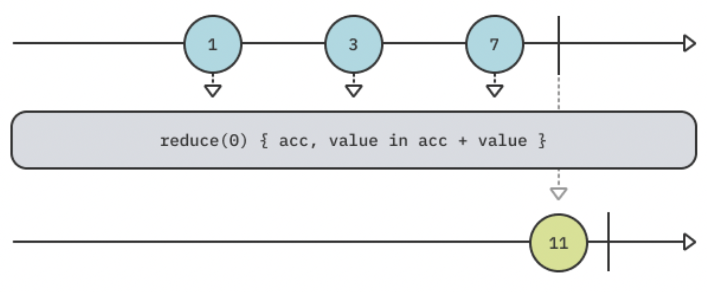

Combine 的 reduce 操作符与 Swift 标准库中的对应操作符类似：`reduce(_:_)` 和 `reduce(into:_:)`。

它允许你提供种子值和累加器闭包。 该闭包接收累积值（从种子值开始）和当前值。 从该闭包中，你返回一个新的累积值。 一旦操作员收到 .finished 完成事件，它就会发出最终的累积值。

在上图的情况下，你可以这样想：

```
Seed value is 0
Receives 1, 0 + 1 = 1
Receives 3, 1 + 3 = 4
Receives 7, 4 + 7 = 11
Emits 11
```

是时候尝试一个简单的例子来更好地理解这个操作符了。将以下内容添加到你的 Playground：

```swift
example(of: "reduce") {
    // 1
    let publisher = ["Hel", "lo", " ", "Wor", "ld", "!"].publisher
    
    publisher
        .print("publisher")
        .reduce("") { accumulator, value in
            // 2
            accumulator + value
        }
        .sink(receiveValue: { print("Reduced into: \($0)") })
        .store(in: &subscriptions)
}
```

在此代码中：

1. 创建一个发出六个字符串的发布者。

2. 将 reduce 与空字符串一起使用，将发出的值附加到它以创建最终的字符串结果。

运行 Playground 并查看控制台输出：

```
——— Example of: reduce ———
publisher: receive subscription: (["Hel", "lo", " ", "Wor", "ld", "!"])
publisher: request unlimited
publisher: receive value: (Hel)
publisher: receive value: (lo)
publisher: receive value: ( )
publisher: receive value: (Wor)
publisher: receive value: (ld)
publisher: receive value: (!)
publisher: receive finished
Reduced into: Hello World!
```

注意累积的结果——Hello World！ — 仅在上游发布者发送 .finished 完成事件后打印。

reduce 的第二个参数是一个闭包，它接受两个某种类型的值并返回一个相同类型的值。 在 Swift 中，+ 也是一个匹配该签名的函数。

因此，作为最后一个巧妙的技巧，你可以减少上面的语法。 替换以下代码：

```swift
.reduce("") { accumulator, value in
  	// 3
  	return accumulator + value
}
```

为：

```swift
.reduce("", +)
```

如果你再次运行你的 Playground，它的工作方式会和以前完全一样，只是语法有点花哨。 ;]

> 备注：这个操作符是不是感觉有点眼熟？ 嗯，这可能是因为你在第 3 节“转换操作符”中了解了扫描。 scan 和 reduce 具有相同的功能，主要区别在于 scan 为每个发出的值发出累积值，而 reduce 在上游发布者发送 .finished 完成事件后发出单个累积值。 在上面的示例中随意将 reduce 更改为 scan 并自己尝试一下。


### 关键点

- 发布者实际上是序列，因为它们产生的值很像集合和序列。
- 你可以使用 min 和 max 分别发出发布者发出的最小值或最大值。
- 当你想要查找在特定索引处发出的值时，first、last 和 output(at:) 很有用。使用 output(in:) 查找在索引范围内发出的值。
- first(where:) 和 last(where:) 都采用一个条件来确定它应该让哪些值通过。
- count、contains 和 allSatisfy 等操作符不会发出发布者发出的值。相反，它们会根据发出的值发出不同的值。
- contains(where:) 采用谓词来确定发布者是否包含给定值。
- 使用 reduce 将发出的值累积为单个值。


### 接下来去哪？

恭喜你完成了本书的最后一章操作符你将通过处理你的第一个实际项目来结束本节，在该项目中，你将使用 Combine 和你学习的许多操作符构建一个 Collage 应用程序。深吸一口气，喝杯咖啡，然后继续下一节。


## 第 8 节：实践：“Collage”项目

在过去的几章中，你学到了很多关于在 Swift  Playground 中使用发布者、订阅者和各种不同的操作符的知识。但是现在，是时候让这些新技能发挥作用，并使用真正的 iOS 应用程序来动手了。

为了结束本节，你将处理一个包含真实场景的项目，你可以在其中应用新获得的组合知识。

本项目将带你完成：

- 将 Combine 发布者与照片等系统框架结合使用。
- 使用 Combine 处理用户事件。
- 使用各种操作符创建不同的订阅来驱动你的应用程序的逻辑。
- 包装现有的 Cocoa API，以便你可以方便地在你的组合代码中使用它们。

该项目名为 Collage Neue，它是一个 iOS 应用程序，允许用户从他们的照片中创建简单的拼贴画，如下所示：


在你继续学习更多操作符之前，该项目将为你提供一些使用 Combine 的实践经验，并且是一个很好的突破理论繁重的章节。

你将完成许多松散连接的任务，在这些任务中，你将使用基于你在本书中所涵盖的材料的技术。

此外，你将使用一些稍后将介绍的操作符来帮助你为应用程序的一些高级功能提供支持。

事不宜迟——是时候开始编码了！


### “Collage Neue”入门

要开始使用 Collage Neue，请打开本章材料提供的启动项目。该应用程序的结构相当简单——有一个用于创建和预览拼贴画的主视图和一个附加视图，用户可以在其中选择照片以添加到他们正在进行的拼贴画中：


> 注意：在本章中，你将专门练习使用 Combine。你将尝试各种绑定数据的方式，但不会专注于专门使用 Combine 和 SwiftUI；你将在后文中了解如何同时使用这两个框架：Combine & SwiftUI。

目前，该项目没有实现任何逻辑。 但是，它确实包含一些你可以利用的代码，因此你可以只关注组合相关的代码。 让我们首先充实将照片添加到当前拼贴画的用户交互。

打开 `CollageNeueModel.swift` 并在文件顶部导入 Combine 框架：

```swift
import Combine
```

这将允许你在 model 文件中使用 Combine 类型。 首先，向 `CollageNeueModel` 类添加两个新的私有属性：

```swift
private var subscriptions = Set<AnyCancellable>()
private let images = CurrentValueSubject<[UIImage], Never>([])
```

`subscriptions` 是一个集合，你将在其中存储与主视图或模型本身的生命周期相关的任何订阅。如果模型发布，或者你手动重置订阅，所有正在进行的订阅将被方便地取消。

> 注意：如前文所述，订阅者返回一个 Cancellable token 以允许控制 subscription 的生命周期。AnyCancellable 是一种类型擦除类型，允许将不同类型的 Cancellable 项存储在同一个集合中，就像上面的代码一样。


你将使用图像为当前拼贴发出用户当前选择的照片。将数据绑定到 UI 控件时，最适合使用 `CurrentValueSubject` 而不是 `PassthroughSubject`。前者始终保证在订阅时至少会发送一个值，并且你的 UI 永远不会有未定义的状态。

一般来说，`CurrentValueSubject` 非常适合表示状态，例如照片数组或加载状态，而 `PassthroughSubject` 更适合表示事件，例如用户点击按钮或简单地指示发生了某事。

接下来，要将一些图像添加到拼贴中并测试你的代码，请将以下行附加到 add() 中：

```swift
images.value.append(UIImage(named: "IMG_1907")!)
```

每当用户点击绑定到 `CollageNeueModel.add()` 的右上角导航项中的 + 按钮时，你将添加 IMG_1907.jpg 到当前图像数组并通过 subject 发送该值。

你可以在项目的资产目录中找到 IMG_1907.jpg — 这是几年前我在巴塞罗那附近拍摄的一张漂亮照片。

方便的是，`CurrentValueSubject` 允许你直接改变它的值，而不是使用 `send(_:)` 发出新值。两者是相同的，因此你可以使用感觉更好的语法 - 你可以在下一段中尝试 `send(_:) `。

为了还能够清除当前选定的照片，请移至同一个文件中的 clear()，并在其中添加：

```swift
images.send([])
```

此行发送一个空数组作为图像的最新值。

最后，你需要将 images subjec t绑定到屏幕上的视图。有不同的方法可以做到这一点，但为了在本实用章节中涵盖更多内容，你将为此使用 @Published 属性。

像这样向你的 model 添加一个新属性：

```swift
@Published var imagePreview: UIImage?
```

@Published 是一个属性包装器，由于你的模型符合 `ObservableObject`，因此将 `imagePreview` 绑定到屏幕上的视图变得非常简单。

滚动到 `bindMainView()` 并添加此代码以将图像绑定到屏幕上的图像预览。

```swift
// 1
images
  // 2
  .map { photos in
    UIImage.collage(images: photos, size: Self.collageSize)
  }
  // 3
  .assign(to: &$imagePreview)
```

上述代码：

1. 你开始订阅当前的照片集 images。

2. 你可以通过调用 `UIImage.collage(images:size:)` 来使用 `map` 将它们转换为单个拼贴，这是一个在 `UIImage+Collage.swift` 中定义的帮助方法。

3. 你使用 `assign(to:)` 订阅者将生成的拼贴图像绑定到 `imagePreview`，这是中心屏幕图像视图。 使用 `assign(to:)` 订阅者自动管理订阅生命周期。

最后但同样重要的是，你需要在视图中显示 `imagePreview`。 打开 `MainView.swift` 并找到 `Image(uiImage: UIImage())` 行。 将其替换为：

```swift
Image(uiImage: model.imagePreview ?? UIImage())
```

你使用最新的预览，如果预览不存在，则使用空的 UIImage。

是时候测试新订阅了！ 构建并运行应用程序并单击 + 按钮几次。 你应该会看到拼贴预览，每次单击 + 时都会显示同一张照片的多个副本：


你将获得照片集，将其转换为 collage 并将其分配给 subscription 中的图像视图！

但是，通常你需要更新的不是一个 UI 控件，而是多个。为每个绑定创建单独的订阅可能是矫枉过正。那么，让我们看看如何将多个更新作为一个批次执行。

`MainView` 中已经包含一个名为 `updateUI(photosCount:)` 的方法，它会执行各种 UI 更新：当当前选择包含奇数张照片时，它会禁用保存按钮，当拼贴正在进行时启用清除按钮和更多。

要在用户每次向拼贴添加照片时调用 `upateUI(photosCount:)`，你将使用 `handleEvents(...)` 操作符。如前所述，这是在你想要执行诸如日志记录或其他方面的副作用时使用的操作符。

通常，建议从 `sink(...)` 或 `assign(to:on:)` 更新 UI，但为了尝试一下，在本节中，你将在 handleEvents 中执行此操作。

回到 CollageNeueModel.swift 并添加一个新属性：

```swift
let updateUISubject = PassthroughSubject<Int, Never>()
```

要练习使用 subject 在不同类型之间进行通信（例如在这种情况下，你正在使用它以便你的 model 可以“回复”你的视图），你可以添加一个名为 `updateUISubject` 的新 subject。

通过这个新 subject，你将发出当前所选照片的数量，以便视图可以观察计数并相应地更新其状态。

在 `bindMainView()` 中，将此操作符插入到使用 map 的行之前：

```swift
.handleEvents(receiveOutput: { [weak self] photos in
  self?.updateUISubject.send(photos.count)
})
```

> 注意：`handleEvents` 操作符使你能够在发布者发出事件时执行副作用。你将在后文了解更多相关信息。


这会将当前选择提供给 `updateUI(photosCount:)` 在它们被转换为 map 操作符内的单个拼贴图像之前。

现在，在 `MainView` 中观察 `updateUISubject`，打开 `MainView.swift` 和 `.onAppear(...)` 正下方的新修饰符：

```swift
.onReceive(model.updateUISubject, perform: updateUI)
```

此修饰符观察给定的发布者并在视图的生命周期内调用 `updateUI(photosCount:)`。如果你好奇，向下滚动到 `updateUI(photosCount:)` 并进入代码。

构建并运行项目，你会注意到预览下方的两个按钮被禁用，这是正确的初始状态：


当你向当前拼贴添加更多照片时，这些按钮将不断改变状态。例如，当你选择一张或三张照片时，保存按钮将被禁用，但清除按钮将被启用，如下所示：


### 选择相册照片

你看到了通过 subject 传递 UI 数据并将其绑定到屏幕上的某些控件是多么容易。接下来，你将处理另一项常见任务：呈现一个新视图并在用户使用完毕后取回一些数据。

绑定数据的总体思路保持不变。你只需要更多的发布者或 subject 来定义正确的数据流。

打开 `PhotosView`，你会看到它已经包含了从相册加载照片并将它们显示在 collection view 中的代码。

你的下一个任务是将必要的 Combine 代码添加到你的 model 中，以允许用户选择一些相册照片并将它们添加到他们的 collage 中。

在 `CollageNeueModel.swift` 中添加以下 subject：

```swift
private(set) var selectedPhotosSubject = PassthroughSubject<UIImage, Never>()
```

此代码允许 `CollageNeueModel` 在 subject 完成后将 subject 替换为新 subject，但其他类型只能访问发送或订阅接收事件。让我们将集合视图委托方法连接到该 subject。

向下滚动到 `selectImage(asset:)`。已经提供的代码从设备库中获取给定的照片 asset。照片准备好后，你应该使用 subject 将图像发送给任何订阅者。

将 // Send the selected image 注释替换为：

```swift
self.selectedPhotosSubject.send(image)
```

嗯，这很容易！但是，由于你将 subject 暴露给其他类型，因此你希望显式发送完成事件，以防视图被关闭以拆除任何外部订阅。

同样，你可以通过几种不同的方式实现这一点，但对于本章，打开 `PhotosView.swift` 并找到 `.onDisappear(...)` 修饰符。

在 `.onDisappear(...)` 中添加：

```swift
model.selectedPhotosSubject.send(completion: .finished)
```

当你从呈现的视图返回时，此代码将发送一个完成的事件。要结束当前任务，你仍然需要订阅所选照片并将其显示在主视图中。

打开 `CollageNeueModel.swift`，找到 `add()`，并将其正文替换为：

```swift
let newPhotos = selectedPhotosSubject

newPhotos
  .map { [unowned self] newImage in
  // 1
    return self.images.value + [newImage]
  }
  // 2
  .assign(to: \.value, on: images)
  // 3
  .store(in: &subscriptions)
```

在上面的代码中，你：

1. 获取所选图像的当前列表，并将任何新图像附加到其中。

2. 使用 assign 通过图像主题发送更新的图像数组。

3. 你将新 subscription 存储在 subscriptions 中。但是，只要用户关闭呈现的视图控制器，订阅就会结束。

准备好测试新绑定后，最后一步是抬起显示照片选择器视图的标志。

打开 `MainView.swift` 并找到调用 `model.add()` 的 + 按钮操作闭包。在该闭包中再添加一行：

```swift
isDisplayingPhotoPicker = true
```

`isDisplayingPhotoPicker` 状态属性在设置为 `true` 时，显示 PhotosView，你已准备好进行测试！

运行应用程序并尝试新添加的代码。点击 + 按钮，你将在屏幕上看到系统照片访问对话框。由于这是你自己的应用程序，因此可以安全地点击允许访问所有照片以允许从 Collage Neue 应用程序访问你模拟器上的完整照片库：

这将使用 iOS 模拟器中包含的默认照片或你自己的照片（如果你在设备上进行测试）重新加载集合视图：


点击其中的几个。 它们会闪烁以表明它们已被添加到拼贴画中。 然后，点击返回主屏幕，你将在其中看到你的新拼贴画：


在继续之前，有一个未解决的问题需要处理。 如果你在照片选择器和主视图之间导航几次，你会注意到在第一次之后你无法再添加任何照片。

为什么会这样？

问题源于你每次展示照片选择器时如何重用 `selectedPhotosSubject`。 第一次关闭该视图时，你发送完成的完成事件并且 subject 完成。

你仍然可以使用它来创建新订阅，但这些订阅会在你创建后立即完成。

要解决此问题，请在每次展示照片选择器时创建一个新主题。 滚动到 add() 并插入到它的顶部：

```swift
selectedPhotosSubject = PassthroughSubject<UIImage, Never>()
```

这将在你每次展示照片选择器时创建一个新 subject。 你现在应该可以自由地在视图之间来回导航，同时仍然可以向拼贴添加更多照片。


### 将回调函数包装为 future

在 Playground 中，你可能会与 subject 和发布者一起玩，并且能够完全按照自己的喜好设计一切，但在实际应用程序中，你将与各种 Cocoa API 进行交互，例如访问相机胶卷、读取设备的传感器或与一些数据库。

在本书后面，你将学习如何创建自己的自定义发布者。但是，在许多情况下，只需将 subject 添加到现有的 Cocoa 类就足以将其功能插入到你的组合工作流程中。

在本章的这一部分中，你将使用一种称为 `PhotoWriter` 的新自定义类型，它允许你将用户的 collage 保存到磁盘。你将使用基于回调的 Photos API 进行保存，并使用 Combine Future 来允许其他类型订阅操作结果。

打开 `Utility/PhotoWriter.swift`，其中包含一个空的 `PhotoWriter` 类，并在其中添加以下静态函数：

```swift
static func save(_ image: UIImage) -> Future<String, PhotoWriter.Error> {
  Future { resolve in

  }
}
```

此函数将尝试将给定图像异步存储在磁盘上，并返回订阅的 Future 给此 API 的使用者。

你将使用基于闭包的 Future 初始化程序返回一个随时可用的 Future，一旦初始化，它将执行提供的闭包中的代码。

让我们通过在闭包中插入以下代码来充实 Future 的逻辑：

```swift
do {

} catch {
  resolve(.failure(.generic(error)))
}
```

这是一个很好的开始。 你将在 do 块内执行保存，如果它抛出错误，你将通过失败 resolve future。

由于你不知道保存照片时可能引发的确切错误，因此你只需获取引发的错误并将其包装为 `PhotoWriter.Error.generic` 错误。

现在，对于函数的真正内容：在 do 主体中插入以下内容：

```swift
try PHPhotoLibrary.shared().performChangesAndWait {
  // 1
  let request = PHAssetChangeRequest.creationRequestForAsset(from: image)

  // 2
  guard let savedAssetID = 
    request.placeholderForCreatedAsset?.localIdentifier else {
    // 3
    return resolve(.failure(.couldNotSavePhoto))
  }

  // 4
  resolve(.success(savedAssetID))
}
```

在这里，你使用 `PHPhotoLibrary.performChangesAndWait(_)` 同步访问照片库。 future 的闭包本身是异步执行的，所以不用担心阻塞主线程。 有了这个，你将在闭包中执行以下更改：

1. 首先，你创建一个存储图像的请求。

2. 然后，你尝试通过 `request.placeholderForCreatedAsset?.localIdentifier` 获取新创建资产的标识符。
3. 如果创建失败并且你没有返回标识符，则使用 `PhotoWriter.Error.couldNotSavePhoto` 错误 resolve future。
4. 最后，如果你取回了一个已保存的 `AssetID`，你就成功地 resolve future。

这就是包装回调函数所需的一切，如果你返回错误则以失败解决，或者如果你有一些结果要返回，则以成功解决！

现在，你可以在用户点击保存时使用 `PhotoWriter.save(_:)` 保存当前拼贴。 打开 `CollageNeueModel.swift` 并在 `save()` 中追加：

```swift
guard let image = imagePreview else { return }

// 1
PhotoWriter.save(image)
  .sink(
    receiveCompletion: { [unowned self] completion in
      // 2
      if case .failure(let error) = completion {
        lastErrorMessage = error.localizedDescription
      }
      clear()
    },
    receiveValue: { [unowned self] id in
      // 3
      lastSavedPhotoID = id
    }
  )
  .store(in: &subscriptions)
```

在此代码中，你：

1. 使用 `sink(receiveCompletion:receiveValue:)` 订阅 `PhotoWriter.save(_:)` 的 future。
2. 如果完成失败，将错误消息保存到 `lastErrorMessage`。
3. 如果你得到一个值——新的资产标识符——你将它存储在 `lastSavedPhotoID` 中。

`lastErrorMessage` 和 `lastSavedPhotoID` 已经连接到 SwiftUI 代码中，以向用户展示各自的消息。

再次运行该应用程序，选择几张照片，然后点击保存。这将调用你闪亮的新发布者，并在保存拼贴画后，将显示如下提示：


### 关于内存管理的说明

这是一个关于使用 Combine 进行内存管理的快速旁注的好地方。如前所述，Combine 代码必须处理大量异步执行的工作，并且在处理类时管理起来总是有点麻烦。

当你编写自己的自定义组合代码时，你可能主要处理结构，因此你不需要在用于 map、flatMap、filter 等的闭包中显式指定捕获语义。

但是，当你使用 UIKit/AppKit 代码处理 UI 代码时（即你有 UIViewController、UICollectionController 等的子类）或者当你的 SwiftUI 视图有 ObservableObjects 时，你需要注意所有的内存管理。

在编写 Combine 代码时，标准规则适用，因此你应该一如既往地使用相同的 Swift 捕获语义：

1. 如果你正在捕获一个可以从内存中释放的对象，例如前面展示的照片视图控制器，你应该使用 `[weak self]` 或其他变量而不是 self 如果你捕获另一个对象。

2. 如果你正在捕获一个无法释放的对象，例如该 Collage 应用程序中的主视图控制器，你可以安全地使用 `[unowned self]`。例如，你永远不会从导航堆栈中弹出，因此始终存在。


### 共享 subscription

回顾 `CollageNeueModel.add()` 中的代码，你可以对用户在 PhotosView 中选择的图像做更多的事情。

这提出了一个令人不安的问题：你应该多次订阅同一个 selectedPhotos 发布者，还是做其他事情？

事实证明，订阅同一个发布者可能会产生不必要的副作用。如果你考虑一下，你不知道发布者在订阅时在做什么，它可能正在创建新资源、发出网络请求或其他意外工作。


为同一个发布者创建多个订阅时，正确的方法是使用 `share()` 操作符共享原始发布者。这将发布者包装在一个类中，因此它可以安全地发送给多个订阅者，而无需再次执行其底层工作。

仍然在 `CollageNeueModel.swift` 中，找到 `let newPhotos = selectedPhotos` 行并将其替换为：

```swift
let newPhotos = selectedPhotos.share()
```

现在，为 newPhotos 创建多个订阅是安全的，而不必担心发布者会为每个新订阅者多次执行副作用：


需要记住的一点是 share() 不会从共享订阅中重新发出任何值，因此你只会获得订阅后出现的值。

例如，如果你在 share() 发布者上有两个订阅，并且源发布者在订阅时同步发出，则只有第一个订阅者会获得该值，因为第二个订阅者在实际发出该值时没有订阅。


### 练习 Operator

现在你已经了解了一些有用的响应式模式，是时候练习你在前几章中介绍的一些操作符并查看它们的实际效果了。

打开` CollageNeueModel.swift` 并将  `selectedPhotos` 订阅的行替换为 `let newPhotos = selectedPhotos.share()` ：

```swift
let newPhotos = selectedPhotos
  .prefix(while: { [unowned self] _ in
    self.images.value.count < 6
  })
  .share()
```

你已经了解了 `prefix(while:)` 作为强大的组合过滤操作符之一，在这里你可以在实践中使用它。 只要所选图像的总数少于六个，上面的代码就会保持对 selectedPhotos 的订阅。 这将有效地允许用户为他们的拼贴选择多达六张照片。

在调用 `share()` 之前添加 `prefix(while:)` 允许你过滤传入的值，不仅在一个订阅上，而且在订阅 `newPhotos` 的所有订阅上。

运行应用程序并尝试添加超过六张照片。 你会看到在前六个之后主视图控制器不再接受更多。

同样，你可以通过组合你已经知道和喜爱的所有操作符（如 filter、dropFirst、map 等）来实现你需要的任何逻辑。


### 挑战

恭喜你完成了本教程式的章节！如果你想在下一章继续学习更多理论之前完成一个可选任务，请继续阅读下文。

打开 Utility/PHPhotoLibrary+Combine.swift 并阅读从用户那里获取 Collage Neue 应用程序的照片库授权的代码。你肯定会注意到逻辑非常简单，并且基于“标准”回调 API。

这为你提供了一个很好的机会来将 Cocoa API 包装为你自己的未来。对于这个挑战，向 `PHPhotoLibrary` 添加一个名为 `isAuthorized` 的新静态属性，其类型为 `Future<Bool, Never>`，并允许其他类型订阅照片库授权状态。

在本章中你已经做过几次了，现有的 `fetchAuthorizationStatus(callback:)` 函数应该很容易使用。祝你好运！如果你在此过程中遇到任何困难，请不要忘记你可以随时进入本章提供的挑战文件夹并查看示例解决方案。

最后，别忘了在 PhotosView 中使用新的 isAuthorized 发布者！

显示错误消息以防用户在点击关闭时未授予对其照片的访问权限并导航回主视图控制器。


要使用不同的授权状态并测试你的代码，请在你的模拟器或设备上打开设置应用程序并导航到隐私/照片。

将 Collage 的授权状态更改为“无”或“所有照片”以测试你的代码在这些状态下的行为：

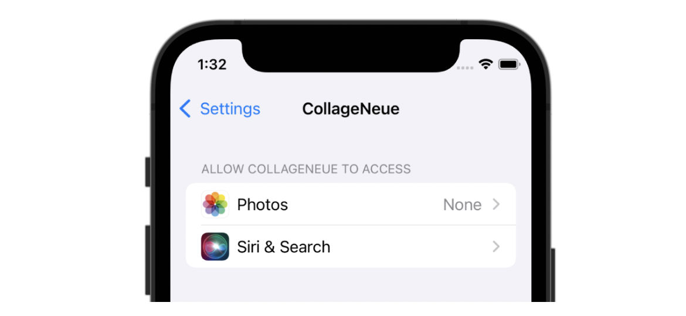

如果到目前为止，你是靠自己成功完成挑战的，那么你真的应该得到掌声！ 无论哪种方式，本章的挑战文件夹中都提供了一种你可以随时参考的可能解决方案。


### 关键点

- 在你的日常任务中，你很可能必须处理基于回调或委托的 API。 幸运的是，这些很容易通过使用 subject 包装为 future 或 publisher。
- 从委托和回调等各种模式转变为单一的发布者/订阅者模式，使得呈现视图和取回值等日常任务变得轻而易举。
- 为避免在多次订阅发布者时产生不必要的副作用，请通过 share() 操作符使用共享发布者。


### 接下来去哪？

从下一章开始，你将开始更多地研究 Combine 与现有 Foundation 和 UIKit/AppKit API 集成的方式。
