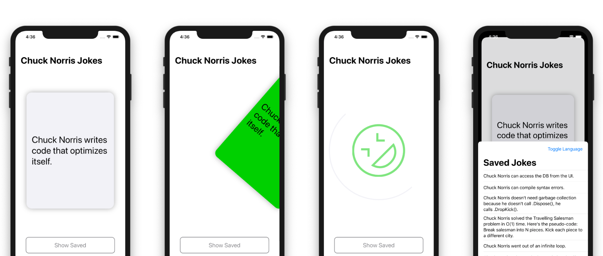
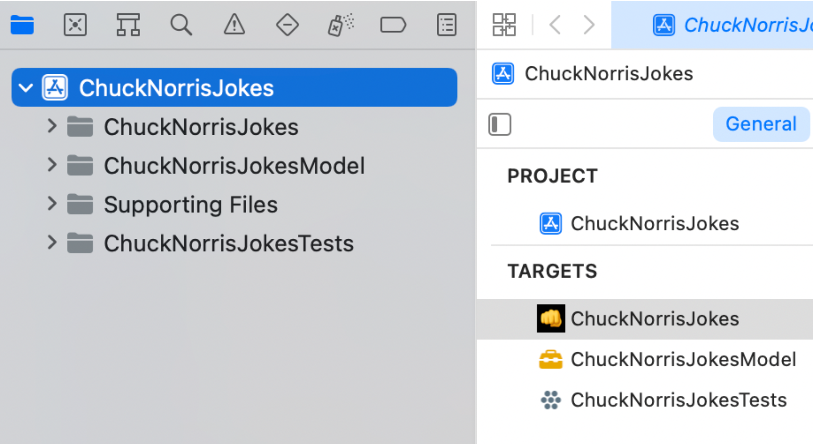
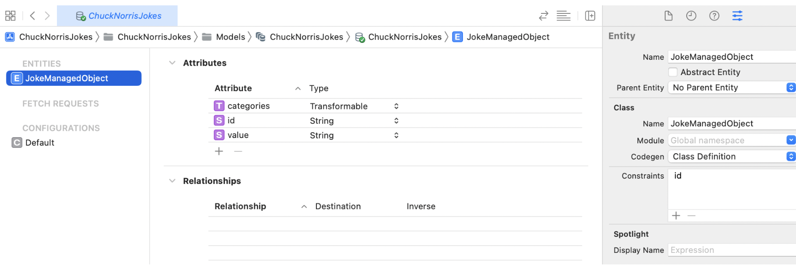

# 第五部分：构建一个完整的 App

精通需要练习，你应该练习！

你已经完成了整本书，无论如何都是一项了不起的壮举。 是时候真正巩固你在本章中获得的知识并使用 Combine 和 SwiftUI 构建一个完整的应用程序了。


## 第 20 章：实践：构建完整的应用程序

通过引入 Combine 并将其集成到他们的框架中，Apple 明确表示：Swift 中的声明式和反应式编程是为其平台开发未来最伟大应用程序的绝佳方式。

在最后三个部分中，您获得了一些很棒的 Combine 技能。在这最后一部分中，您将使用所学的一切来完成开发一个可以让您获取 Chuck Norris 笑话的 App。您还将看到如何使用 Core Data 和 Combine 来保存和检索您最喜欢的笑话。



### 入门

打开本章的起始项目。在开始向项目添加代码之前，请花点时间查看在启动项目中已经实现的内容。

> 注意：与本书中的所有项目一样，您也将在本章中使用 SwiftUI。如果您想了解更多相关信息，请查看 raywenderlich.com 库中的 SwiftUI by Tutorials。


选择项目导航器顶部的 ChuckNorrisJokes 项目：



该项目有三个 target：

1. ChuckNorrisJokes：主要目标，包含你所有的 UI 代码。
2. ChuckNorrisJokesModel：您将在这里定义您的模型和服务。将模型分离到自己的目标中是管理对 main target 的访问的好方法，同时还允许测试 target 访问具有相对严格的内部访问级别的方法。
3. ChuckNorrisJokesTests：您将在此目标中编写一些单元测试。

在 main target ChuckNorrisJokes 中，打开 ChuckNorrisJokes/Views/JokeView.swift。这是应用程序的主视图。此视图有两个预览：浅色模式下的 iPhone 11 Pro Max 和深色模式下的 iPhone SE（第 2 代）。

您可以通过单击 Xcode 右上角的 Adjust Editor Options 按钮并检查 Canvas 来查看预览。

如果 Xcode 无法渲染一些正在进行的代码，它将停止更新 Canvas。您可能需要定期单击顶部跳转栏中的“恢复”按钮以重新开始预览。

单击每个预览的实时预览按钮，以获得类似于在模拟器中运行应用程序的交互式运行版本。


目前，您可以在笑话卡视图上滑动，仅此而已。不过，时间不长！

> 注意：如果预览渲染失败，您也可以在模拟器中构建并运行应用程序以检查您的进度。


在着手完成此应用程序的开发之前，您应该设定一些目标。

### 设定目标

您收到了几个类似这样的用户故事： 作为用户，我想：

当我将笑话卡一直向左或向右滑动时，请查看指示器，以表明我不喜欢或喜欢笑话。

1. 保存喜欢的笑话以备后用。
2. 当我向左或向右滑动时，可以看到笑话卡的背景颜色变为红色或绿色。
3. 在我不喜欢或喜欢当前的笑话之后再找一个新的笑话。
4. 获取新笑话时查看指示器。
5. 如果在取笑话时出现问题，则显示指示。
6. 拉出保存的笑话列表。
7. 删除已保存的笑话。

上述每个用户故事都依赖于逻辑，因此您需要先实现该逻辑，然后才能将其连接到 UI 并开始检查该列表。


### 实现 JokesViewModel

这个应用程序将使用单个视图模型来管理驱动多个 UI 组件的状态，并触发获取和保存笑话。

在 ChuckNorrisJokesModel 目标中，打开 View Models/JokesViewModel.swift。您将看到一个简单的实现，其中包括：

- Combine 和 SwiftUI 的导入。
- 一个DecisionState 枚举。
- 一个 JSONDecoder 实例。
- 两个 AnyCancellable 集合。
- 一个空的初始化器和几个空的方法。

是时候填补所有这些空白了！


#### 实现 state

SwiftUI 使用多个状态来确定如何呈现视图。在创建解码器的行下方添加此代码：

```swift
@Published public var fetching = false
@Published public var joke = Joke.starter
@Published public var backgroundColor = Color("Gray")
@Published public var decisionState = DecisionState.undecided
```

在这里，您创建了几个 @Published 属性，为每个属性综合了一个发布者。您可以使用 $ 前缀访问这些属性的发布者，例如 $fetching。它们的名称和类型可以很好地表明它们的用途，但您很快就会将它们全部投入使用，并确切了解如何使用它们。

在你充实这个视图模型的其余部分之前，你需要实现更多的东西。


#### 实现 service

打开服务/JokesService.swift。您将使用 JokesService 从 chucknorris.io 数据库中获取一个随机笑话。它还将提供从 fetch 返回的数据的发布者。

为了以后能够在单元测试中模拟此服务，您需要完成定义一个概述发布者要求的协议。打开协议/JokeServiceDataPublisher.swift。在这里已经为您导入了 combine，因为它在本章中需要它的大多数文件中都有。

将协议定义更改为以下内容：

```swift
public protocol JokeServiceDataPublisher {
  func publisher() -> AnyPublisher<Data, URLError>
}
```

现在，打开 Services/JokesService.swift 并类似地实现其对 JokeServiceDataPublisher 的一致性：

```swift
extension JokesService: JokeServiceDataPublisher {
  public func publisher() -> AnyPublisher<Data, URLError> {
    URLSession.shared
      .dataTaskPublisher(for: url)
      .map(\.data)
      .eraseToAnyPublisher()
  }
}
```

如果此时构建项目的测试目标，则会出现编译器错误。 此错误指向测试目标中模拟服务的存根实现。 要消除此错误，请打开 ChuckNorrisJokesTests/Services/MockJokesService.swift 并将此方法添加到 MockJokesService：

```swift
func publisher() -> AnyPublisher<Data, URLError> {
  // 1
  let publisher = CurrentValueSubject<Data, URLError>(data)

  // 2
  DispatchQueue.global().asyncAfter(deadline: .now() + 0.1) {
    if let error = error {
      publisher.send(completion: .failure(error))
    } else {
      publisher.send(data)
    }
  }

  // 3
  return publisher.eraseToAnyPublisher()
}
```

使用此代码，您可以：

1. 创建一个模拟发布者，它发出 Data 值并且可能会因 URLError 而失败，并使用模拟服务的 data 属性进行初始化。

2. 通过 Subject 发送错误（如果提供）或数据值。

3. 返回类型擦除的发布者。

你使用 DispatchQueue.asyncAfter(deadline:) 来模拟获取数据的轻微延迟，本节稍后的单元测试将需要这个延迟。


#### 完成 JokesViewModel 的实现

完成模版文件后，返回 View Models/JokesViewModel.swift 并在 @Published 之后添加以下属性：

```swift
private let jokesService: JokeServiceDataPublisher
```

视图模型使用默认实现，而单元测试可以使用此服务的模拟版本。

更新初始化程序以使用默认实现并将服务设置为其各自的属性：

```swift
public init(jokesService: JokeServiceDataPublisher = JokesService()) {
  self.jokesService = jokesService
}
```

仍然在初始化程序中，添加对 $joke 发布者的订阅：

```swift
$joke
  .map { _ in false }
  .assign(to: &$fetching)
```

您将使用 fetching 属性来指示 App 何时获取 Joke。


#### 获取 Joke

说到获取，更改 fetchJoke() 的实现以匹配以下代码：

```swift
public func fetchJoke() {
  // 1
  fetching = true

  // 2
  jokesService.publisher()
    // 3
    .retry(1)
    // 4
    .decode(type: Joke.self, decoder: Self.decoder)
     // 5
    .replaceError(with: Joke.error)
    // 6
    .receive(on: DispatchQueue.main)
     // 7
    .assign(to: &$joke)
}
```

从顶部：

1. 将 fetching 设置为 true。
2. 开始订阅 jokesService 发布者。
3. 如果出现错误，重试一次。
4. 将从发布者收到的数据传递给 decode 操作符。
5. 将错误替换为显示错误消息的 Jock 实例。
6. 在主队列上接收结果。
7. 将收到的笑话分配给笑话@Published 属性。


#### 更改背景颜色

updateBackgroundColorForTranslation(_:) 方法应该根据笑话卡片视图的位置更新背景颜色——也就是它的翻译。 将其实现更改为以下内容以使其正常工作：

```swift
public func updateBackgroundColorForTranslation(_ translation: Double) {
  switch translation {
  case ...(-0.5):
    backgroundColor = Color("Red")
  case 0.5...:
    backgroundColor = Color("Green")
  default:
    backgroundColor = Color("Gray")
  }
}
```

在这里，您只需切换传入的翻译，如果达到 -0.5 (-50%)，则返回红色，如果达到 -0.5+ (50%+)，则返回绿色，如果在中间则返回灰色。 这些颜色在支持文件中的主要目标资产目录中定义，以防您想检查它们。

您还将使用 Joke 卡片的位置来确定用户是否喜欢该笑话，因此将 updateDecisionStateForTranslation(_:andPredictedEndLocationX:inBounds:) 的实现更改为：

```swift
public func updateDecisionStateForTranslation(
  _ translation: Double,
  andPredictedEndLocationX x: CGFloat,
  inBounds bounds: CGRect) {
  switch (translation, x) {
  case (...(-0.6), ..<0):
    decisionState = .disliked
  case (0.6..., bounds.width...):
    decisionState = .liked
  default:
    decisionState = .undecided
  }
}
```

这种方法的签名似乎比实际更令人生畏。 在这里，您可以切换平移和 x 值。 如果百分比为 -/+ 60%，则您认为这是用户的明确决定。 否则，他们仍然没有决定。

如果用户悬停在决策状态区域内，您可以使用 x 和 bounds.width 值来防止决策状态更改。 换句话说，如果没有足够的速度来预测超出这些值的终点位置，他们还没有做出决定——但是，如果有足够的速度，这是他们打算完成该决定的好兆头。


#### 准备下一个 Joke

你还有另一种方法可以走。 将 reset() 更改为：

```swift
public func reset() {
  backgroundColor = Color("Gray")
}
```

当用户喜欢或不喜欢一个 Joke 时，Joke 卡将被重置，以便为下一个 Joke 做好准备。 您需要手动处理的唯一部分是将其背景颜色重置为灰色。


#### 使视图模型可观察

在继续之前，您还要在此视图模型中做一件事：使其符合 ObservableObject 以便在整个应用程序中都可以观察到它。在底层，ObservableObject 将自动合成一个 objectWillChange 发布者。更重要的是，通过使您的视图模型符合此协议，您的 SwiftUI 视图可以订阅视图模型的 @Published 属性并在这些属性更改时更新其主体。

这需要更多的时间来解释而不是实施。将类定义更改为以下内容：

```swift
public final class JokesViewModel: ObservableObject {
```

你已经完成了视图模型的实现——整个操作的大脑！

> 注意：此时在真实环境中，您可能会针对此视图模型编写所有测试，确保一切顺利，检查您的工作，然后去吃午饭或回家休息。相反，您将继续使用刚刚实现的视图模型来驱动应用程序的 UI。您将回到挑战部分中编写单元测试。


#### 将 JokesViewModel 连接到 UI

应用程序的主屏幕上有两个 View 组件：一个本质上是背景的 JokeView 和一个浮动的 JokeCardView。两者都需要查阅视图模型来确定何时更新和显示什么。

打开 Views/JokeCardView.swift。 ChuckNorrisJokesModel 模块已经导入。要获取视图模型的句柄，请将此属性添加到 JokeCardView 定义的顶部：

```swift
@ObservedObject var viewModel: JokesViewModel
```

您使用 @ObservedObject 属性包装器注释了此属性。与视图模型对 ObservableObject 的采用结合使用，您现在可以获得 objectWillChange 发布者。你现在在这个文件中得到一个编译器错误，因为底部的预览提供者期望来自 JokeCardView 的初始化程序的视图模型参数。

错误应该指向它，但如果不是，请在底部找到 JokeCardView() 初始化程序 - 在 JokeCardView_Previews 内 - 并添加视图模型的默认初始化。生成的结构实现应如下所示：

```swift
struct JokeCardView_Previews: PreviewProvider {
  static var previews: some View {
    JokeCardView(viewModel: JokesViewModel())
      .previewLayout(.sizeThatFits)
  }
}
```

您现在在 JokeView 中有一个编译器错误需要处理，但这也是一个简单的修复。

打开 Views/JokeView.swift 并在私有属性顶部添加以下内容，在 showJokeView 上方：

```swift
@ObservedObject private var viewModel = JokesViewModel()
```

接下来，找到 jokeCardView 计算属性并将 JokeCardView() 初始化更改为：

```swift
JokeCardView(viewModel: viewModel)
```

错误消失。现在，切换回 Views/JokeCardView.swift。在主体实现的顶部，找到 Text(ChuckNorrisJokesModel.Joke.starter.value) 行并将其更改为：

```swift
Text(viewModel.joke.value)
```

使用此代码，您可以从使用起始 Jock 切换到视图模型的 Jock 发布者的当前值。


#### 设置 Jock 卡的背景颜色

现在，回到 JokeView.swift。您将专注于实现现在使该屏幕正常工作所需的内容，然后稍后返回以启用显示已保存的笑话。找到私有 var jokeCardView 属性并将其 .background(Color.white) 修饰符更改为：

```swift
.background(viewModel.backgroundColor)
```

视图模型现在确定 Jock 卡片视图的背景颜色。您可能还记得，视图模型根据卡片的平移设置颜色。


#### 指示一个 是喜欢还是不喜欢

接下来，您需要设置用户喜欢或不喜欢笑话的视觉指示。找到 HUDView 的两种用途：一种显示 .thumbDown 图像，另一种显示 .rofl 图像。这些图像类型在 HUDView.swift 中定义，对应于使用 Core Graphics 绘制的图像。

更改 .opacity(0) 修饰符的两种用法，如下所示：

- 对于 HUDView(imageType: .thumbDown):

```swift
.opacity(viewModel.decisionState == .disliked ? hudOpacity : 0)
```

- 对于 HUDView(imageType: .rofl):

```swift
.opacity(viewModel.decisionState == .liked ? hudOpacity : 0)
```

此代码可让您显示 .liked 和 .disliked 状态的正确图像，而当状态为 .undecided 时不显示图像。


#### 处理决策状态变化

现在，找到 updateDecisionStateForChange(_:) 并将其更改为：_

```swift
private func updateDecisionStateForChange(_ change: DragGesture.Value) {
  viewModel.updateDecisionStateForTranslation(
    translation,
    andPredictedEndLocationX: change.predictedEndLocation.x,
    inBounds: bounds
  )
}
```

此方法调用您之前实现的视图模型的 updateDecisionStateForTranslation(_:andPredictedEndLocationX:inBounds:) 方法。它通过基于用户与 Jock 卡片视图交互的视图获得的值。

在此方法正下方，将 updateBackgroundColor() 更改为：

```swift
private func updateBackgroundColor() {
  viewModel.updateBackgroundColorForTranslation(translation)
}
```

该方法还调用视图模型上的一个方法，传递视图根据用户与 Jock 卡片视图的交互获得的翻译。


#### 用户抬起手指时的处理

还有一种实现方法，然后您可以试一试该应用程序。

handle(_:) 方法负责处理用户何时抬起手指——即触摸。如果用户在 .undecided 状态下触摸，它会重置 Jock 视图卡的位置。否则，如果用户在决定状态（.liked 或 .disliked）中进行触摸，它会指示视图模型重置并获取新笑话。

将 handle(_:) 的实现更改为以下内容：

```swift
private func handle(_ change: DragGesture.Value) {
  // 1
  let decisionState = viewModel.decisionState

  switch decisionState {
  // 2
  case .undecided:
    cardTranslation = .zero
    self.viewModel.reset()
  default:
    // 3
    let translation = change.translation
    let offset = (decisionState == .liked ? 2 : -2) * bounds.width
    cardTranslation = CGSize(
      width: translation.width + offset,
      height: translation.height
    )
    showJokeView = false
    

    // 4
    reset()

  }
}
```

分解你对这段代码所做的事情：

1. 创建视图模型当前决策状态的本地副本，然后切换它。
2. 如果决策状态是 .undecided，则将 cardTranslation 设置回零并告诉视图模型重置——这将导致背景颜色重置为灰色。
3. 否则，对于 .liked 或 .disliked 状态，根据状态确定笑话卡片视图的新偏移和平移，并暂时隐藏笑话卡片视图。
4. 调用 reset()，它隐藏笑话卡片视图并将其移回其原始位置，告诉视图模型获取一个新笑话，然后显示笑话卡片视图。

与这段代码相关的两件事你还没有接触过：

- cardTranslation 属性跟踪 card 卡的当前平移。不要将其与 translation 属性混淆，它使用此值根据屏幕的当前宽度计算平移，然后将结果传递给多个区域的视图模型。

- Jock 卡片视图的初始 y 偏移量是 -bounds.height。也就是说，它位于可见视图的正上方，准备好在 showJokeView 更改为 true 时从顶部进入动画。

最后，在 handle(_:) 正下方的 reset() 方法中，在将 cardTranslation 设置为 .zero 之后添加以下两行：

```swift
self.viewModel.reset()
self.viewModel.fetchJoke()
```

在这里，每当调用 reset() 时，您都要求视图模型获取一个新笑话——即，当一个笑话被喜欢或不喜欢时，或者当视图出现时。

这就是你现在需要用 JokeView 做的所有事情。


#### 试用您的应用

要查看到目前为止的进度，请显示预览，如有必要，单击恢复，然后单击实时预览播放按钮。

> 注意：您还可以在模拟器或设备上构建运行应用程序以检查您的进度。


您可以一直向左或向右滑动以分别不喜欢或喜欢一个笑话。这样做还会显示拇指向下或 ROFL 图像和“获取”动画。如果您在未决定状态下释放卡片，则笑话卡片将弹回其原始位置。

如果您的应用程序遇到错误，它将显示错误笑话。稍后您将编写一个单元测试来验证这一点，但如果您现在想查看错误笑话，请暂时关闭 Mac 的 Wi-Fi，运行应用程序并向左滑动以获取新笑话。您会看到错误笑话：“休斯顿我们有问题 - 不是开玩笑。检查您的 Internet 连接，然后再试一次。”

毫无疑问，这是一个最小的实现。如果你有雄心壮志，你可以应用你在第 16节章“错误处理”中学到的知识，实现更健壮的错误处理机制。

你到目前为止的进展

这负责这些功能的实现方面：

✅ 1. 当我将笑话卡一直向左或向右滑动时，会看到指示器，以表明我不喜欢或喜欢笑话。

✅ 3. 当我向左或向右滑动时，看到笑话卡的背景颜色变为红色或绿色。

✅ 4. 在我不喜欢或喜欢当前笑话后，再取一个新笑话。

✅ 5. 在获取新笑话时查看指示器。

✅ 6. 在取笑话时显示是否出现问题的指示。

不错的工作！剩下的就是：

2. 保存喜欢的笑话以备后用。

8. 拉出已保存笑话的列表。

9. 删除已保存的笑话。

是时候保存一些 Jock 了！


### 使用 combine 实现  Core Data

过去几年，Core Data 团队一直在努力工作。 设置 Core Data 的过程再简单不过了，新引入的与 Combine 的集成使其成为在 Combine 和 SwiftUI 应用程序中持久化数据的首选。

> 注意：本章不深入研究使用 Core Data 的细节。 它只会引导您完成将其与 Combine 一起使用的必要步骤。 如果您想了解有关 Core Data 的更多信息，请查看 raywenderlich.com 库中的 [Core Data by Tutorials](https://www.kodeco.com/books/core-data-by-tutorials)。


#### 查看数据模型

已经为您创建了数据模型。 要查看它，请打开 Models/ChuckNorrisJokes.xcdatamodeld 并在 ENTITIES 部分中选择 JokeManagedObject。 您将看到已定义以下属性，以及对 id 属性的唯一约束：




Core Data 将为 JokeManagedObject 自动生成一个类定义。 接下来，您将在 JokeManagedObject 的扩展和 JokeManagedObject 的集合中创建几个帮助方法来保存和删除 Jock。


#### 扩展 JokeManagedObject 以保存 Joke

右键单击主目标的项目导航器中的 Models 文件夹，然后选择 New File.... 选择 Swift File，单击 Next，然后保存名为 JokeManagedObject+.swift 的文件。

将此文件的整个正文替换为以下代码：

```swift
// 1
import Foundation
import SwiftUI
import CoreData
import ChuckNorrisJokesModel

// 2
extension JokeManagedObject {
  // 3
  static func save(joke: Joke, inViewContext viewContext: NSManagedObjectContext) {
    // 4
    guard joke.id != "error" else { return }
    // 5
    let fetchRequest = NSFetchRequest<NSFetchRequestResult>(
      entityName: String(describing: JokeManagedObject.self))
    // 6
    fetchRequest.predicate = NSPredicate(format: "id = %@", joke.id)
    

    // 7
    if let results = try? viewContext.fetch(fetchRequest),
       let existing = results.first as? JokeManagedObject {
      existing.value = joke.value
      existing.categories = joke.categories as NSArray
    } else {
      // 8
      let newJoke = self.init(context: viewContext)
      newJoke.id = joke.id
      newJoke.value = joke.value
      newJoke.categories = joke.categories as NSArray
    }
    
    // 9
    do {
      try viewContext.save()
    } catch {
      fatalError("\(#file), \(#function), \(error.localizedDescription)")
    }

  }
}
```

浏览评论，您可以使用以下代码：

1. 导入 Core Data、SwiftUI 和你的模型模块。
2. 扩展您自动生成的 JokeManagedObject 类。
3. 添加一个静态方法，使用传入的视图上下文保存传入的 Jock。 如果您不熟悉 Core Data，您可以将视图上下文视为 Core Data 的暂存器。 它与主队列相关联。
4. 出现问题时用来表示错误的 Joke 有ID错误。 没有理由保存那个 Joke，所以在继续之前你要小心它是错误的 Joke。
5. 为 JokeManagedObject 实体名称创建一个获取请求。
6. 设置获取请求的谓词以过滤获取与传入笑话具有相同 ID 的笑话。
7. 使用 viewContext 尝试执行 fetch 请求。 如果成功，则意味着笑话已经存在，因此使用传入的笑话中的值对其进行更新。

8. 否则，如果 Joke 还不存在，则使用传入的笑话中的值创建一个新 Joke。
9. 尝试保存 viewContext。


#### 扩展 JokeManagedObject 的集合以删除 Joke

为了使删除更容易，请在 JokeManagedObject 的集合上添加此扩展：

```swift
extension Collection where Element == JokeManagedObject, Index == Int {
  // 1
  func delete(at indices: IndexSet, inViewContext viewContext: NSManagedObjectContext) {
    // 2
    indices.forEach { index in
      viewContext.delete(self[index])
    }
    

    // 3
    do {
      try viewContext.save()
    } catch {
      fatalError("\(#file), \(#function), \(error.localizedDescription)")
    }

  }
}
```

在此扩展程序中：

1. 使用传入的视图上下文实现一个方法来删除传入索引处的对象。
2. 遍历索引并在 viewContext 上调用 delete(_:)，传递 self 的每个元素——即 JokeManagedObjects 的集合。
3. 尝试保存上下文。


#### 创建 Core Data stack

有几种方法可以设置  Core Data stack。在本节中，您将利用访问控制来创建只有 SceneDelegate 可以访问的堆栈。

打开 App/SceneDelegate.swift 并首先在顶部添加这些导入：

```swift
import Combine
import CoreData
```

接下来，在文件底部添加 CoreDataStack 定义：

```swift
// 1
private enum CoreDataStack {
  // 2
  static var viewContext: NSManagedObjectContext = {
    let container = NSPersistentContainer(name: "ChuckNorrisJokes")

    container.loadPersistentStores { _, error in
      guard error == nil else {
        fatalError("\(#file), \(#function), \(error!.localizedDescription)")
      }
    }
    
    return container.viewContext

  }()

  // 3
  static func save() {
    guard viewContext.hasChanges else { return }

    do {
      try viewContext.save()
    } catch {
      fatalError("\(#file), \(#function), \(error.localizedDescription)")
    }

  }
}
```

使用此代码，您可以：

1. 定义一个名为 CoreDataStack 的私有枚举。在这里使用无大小写枚举很有用，因为它不能被初始化。 CoreDataStack 仅用作命名空间——您实际上并不希望能够创建它的实例。
2. 创建一个持久化容器。这是实际的核心数据堆栈，封装了托管对象模型、持久存储协调器和托管对象上下文。一旦你有了一个容器，你就返回它的视图上下文。稍后您将使用 SwiftUI 的 Environment API 在整个应用程序中共享此上下文。
3. 创建一个只有场景委托才能用来保存上下文的静态保存方法。在启动保存操作之前验证上下文是否已更改总是一个好主意。

现在您已经定义了 Core Data 堆栈，向上移动到顶部的 scene(_:willConnectTo:options:) 方法并将 let contentView = JokeView() 更改为：

```swift
let contentView = JokeView()
  .environment(\.managedObjectContext, CoreDataStack.viewContext)
```

在这里，您将  CoreDataStack 的视图上下文添加到环境中，使其全局可用。

当应用程序即将移至后台时，您希望保存 viewContext ——否则，在其中完成的任何工作都将丢失。找到 sceneDidEnterBackground(_:) 方法并将以下代码添加到它的底部：

```swift
CoreDataStack.save()
```

你现在有了一个真正的 Core Data 堆栈，并且可以开始好好利用它。


#### 取 Joke

打开 Views/JokeView.swift 并在 @ObservedObject private var viewModel 属性定义之前添加此代码，以从环境中获取 viewContext 的句柄：

```swift
@Environment(\.managedObjectContext) private var viewContext
```

现在，移动到 handle(_:) 并在默认情况的顶部，在 let translation = change.translation 之前，添加以下代码：

```swift
if decisionState == .liked {
  JokeManagedObject.save(
    joke: viewModel.joke,
    inViewContext: viewContext
  )
}
```

使用此代码，您可以检查用户是否喜欢这个笑话。如果是这样，您使用您不久前实现的帮助器方法来保存它，使用您从环境中检索到的视图上下文。


#### 显示已保存的 Joke

接下来，在 JokeView 的正文中找到 LargeInlineButton 代码块并将其更改为：

```swift
LargeInlineButton(title: "Show Saved") {
  self.presentSavedJokes = true
}
.padding(20)
```

在这里，您将 presentSavedJokes 的状态更改为 true。接下来，您将使用它来展示已保存的笑话——想象一下！

将工作表修饰符应用到 NavigationView 代码块的末尾：

```swift
.sheet(isPresented: $presentSavedJokes) {
  SavedJokesView()
    .environment(\.managedObjectContext, self.viewContext)
}
```

每当 $presentSavedJokes 发出一个新值时，就会触发此代码。当它为真时，视图将实例化并呈现保存的笑话视图，并将 viewContext 传递给它。

供您参考，整个 NavigationView 现在应该如下所示：

```swift
NavigationView {
  VStack {
    Spacer()
    

    LargeInlineButton(title: "Show Saved") {
      self.presentSavedJokes = true
    }
    .padding(20)

  }
  .navigationBarTitle("Chuck Norris Jokes")
}
.sheet(isPresented: $presentSavedJokes) {
  SavedJokesView()
    .environment(\.managedObjectContext, self.viewContext)
}
```

这就是 JokeView 的内容。


#### 完成保存的 Joke 视图

现在，您需要完成保存的笑话视图的实现，因此打开 Views/SavedJokesView.swift。模型已经为您导入。

首先，在 body 属性下面添加这个属性：

```swift
@Environment(\.managedObjectContext) private var viewContext
```

您已经设置了几次 viewContext ——这里没有什么新东西。

接下来，将 `private var joys = [String]()` 替换为以下内容：

```swift
@FetchRequest(
  sortDescriptors: [NSSortDescriptor(
                        keyPath: \JokeManagedObject.value,
                        ascending: true
                   )],
  animation: .default
) private var jokes: FetchedResults<JokeManagedObject>
```

您将立即看到编译器错误。接下来您将修复它，同时启用删除 Joke 的功能。

这个来自 SwiftUI 的属性包装器的瑰宝为您做了很多。它：

- 采用一个排序描述符数组对获取的对象进行排序，并更新将使用给定动画类型显示它们的 List。

- 每当持久存储发生更改时，自动为您执行提取，然后您可以使用它来触发视图以使用更新的数据重新呈现自身。

底层 FetchRequest 初始化器的变体允许您传递一个 fetchRequest，就像您之前创建的那样。但是，在这种情况下，您需要所有笑话，因此您唯一需要传递的是有关如何对结果进行排序的说明。


#### 删除 Joke

找到 ForEach(jokes, id: \.self) 代码块，包括 .onDelete 代码块，并将其更改为以下内容：

```swift
ForEach(jokes, id: \.self) { joke in
  // 1
  Text(joke.value ?? "N/A")
}
.onDelete { indices in
  // 2
  self.jokes.delete(
    at: indices,
    inViewContext: self.viewContext
  )
}
```

在这里，你：

1. 如果没有笑话，则显示笑话文本或“N/A”。

2. 启用滑动以删除笑话并调用您之前定义的 delete(at:inViewContext:) 方法。

至此，SavedJokesView 就完成了！

恢复应用预览或构建并运行应用。保存一些笑话，然后点击显示已保存以显示您保存的笑话。尝试在几个笑话上向左滑动以删除它们。重新运行该应用程序并确认您保存的笑话确实仍然存在 - 而您删除的那些则不存在！


### 挑战

你现在拥有了一个很棒的应用程序，但是你非凡的职业道德——以及你的经理——不允许你在没有伴随单元测试的情况下检查你的工作。因此，本章的挑战部分要求您编写单元测试以确保您的逻辑是合理的，并帮助防止以后出现回归。

这是本书的最后一个挑战。接受它并坚强地完成！

#### 挑战：针对 JokesViewModel 编写单元测试

在 ChuckNorrisJokesTests 目标中，打开 Tests/JokesViewModelTests.swift。您将看到以下内容：

- 一些初步的设置代码。
- 可以成功创建验证示例笑话的测试，称为 test_createJokesWithSampleJokeData。
- 五个测试存根，您将完成它们以行使视图模型的每个职责。

ChuckNorrisJokesModel 模块已经为您导入，让您可以访问视图模型——也就是被测系统。

首先，您需要实现一个工厂方法来销售新的视图模型。它应该接受参数来指示它是否应该为“获取”笑话而发出错误。然后它应该返回一个使用您之前实现的模拟服务的新视图模型。

对于一个额外的挑战，看看你是否可以先自己实现，然后对照这个实现检查你的工作：

```swift
private func viewModel(withJokeError jokeError: Bool = false) -> JokesViewModel {
  JokesViewModel(jokesService: mockJokesService(withError: jokeError))
}
```

使用该方法，您就可以开始填写每个测试存根了。你不需要任何新知识来编写这些测试——你在上一章学到了所有你需要知道的东西。

有些测试相当简单。其他的则需要稍微高级一点的实现，例如使用期望等待异步操作完成。

慢慢来，祝你好运——你有这个！

当你完成后——或者如果你在过程中遇到任何问题——你可以对照项目/挑战/决赛中的解决方案检查你的工作。该解决方案中的测试展示了一种方法——即，它们并不是唯一的方法。最重要的是，当系统按预期工作时，您的测试通过，而当系统不按预期工作时，您的测试会失败。


### 关键点

以下是您在本章中学到的一些主要内容：

- 将 @ObservedObject 与 @Published 结合使用，通过组合发布者驱动 SwiftUI 视图。

- 使用 @FetchRequest 在持久存储发生更改时自动执行核心数据获取，并根据更新的数据驱动 UI。


### 接下来去哪儿？

太棒了！完成如此规模的一本书是不小的成就。我们希望您为自己感到非常自豪，并为将您新获得的技能付诸实践而感到兴奋！

在软件开发中，可能性是无穷无尽的。保持技能敏锐和最新的开发人员将创建明天真正受到用户喜爱的应用程序。您就是这样的开发人员之一。

您可能已经有了想要使用 Combine 开发的应用程序或想法。如果是这样，没有比现实世界更好的体验了——而且没有人仅仅从一本书中学会游泳。所以需要更深入！

还没准备好使用 Combine 进入您自己的项目？不用担心，您可以通过多种方式改进您在本章中开发的应用程序并进一步磨练您的 Combline——包括但不限于以下增强功能：

- 添加对保存的笑话进行排序的功能。

- 添加搜索已保存笑话的功能。

- 添加通过社交媒体甚至与其他用户分享笑话的功能。

- 实施更强大的错误管理系统，根据用户可能收到的各种错误提供不同的消息。
- 以不同的方式实现显示已保存的笑话，例如在 LazyVGrid 中。

此外，如果您有任何问题、发现勘误表或只是想看看您是否可以帮助其他 Oombiner，您可以访问本书的[论坛](bit.ly/combineBookForum)。

无论您决定使用您的 Combine 技能做什么，我们都祝您好运 - 欢迎与我们分享您的成就。


