# Chapter 1: Your First Core Data App

Welcome to Core Data!

In this chapter, you’ll write your very first Core Data app. You’ll see how easy it is to get started with all the resources provided in Xcode, from starter code templates to the Data Model editor.

You’re going to hit the ground running right from the start. By the end of the chapter you’ll know how to:

- Model data using Xcode’s model editor

- Add new records to Core Data

- Fetch a set of records from Core Data

- Display the fetched records using a table view

You’ll also get a sense of what Core Data is doing behind the scenes, and how you can interact with the various moving pieces. This will put you well on your way to understanding the next two chapters, which continue the introduction to Core Data with more advanced models and data validation.


## Getting started

Open Xcode and create a new iOS project based on the App template. Name the app HitList and change the interface from SwiftUI to Storyboard. All the sample projects in the book use Interface Builder and UIKit. Finally, make sure Use Core Data is checked. Make sure Host in CloudKit and Include Tests are not checked.

Checking the Use Core Data box will cause Xcode to generate boilerplate code for what’s known as an NSPersistentContainer in AppDelegate.swift.

The NSPersistentContainer consists of a set of objects that facilitate saving and retrieving information from Core Data. Inside this container is an object to manage the Core Data state as a whole, an object representing the Data Model, and so on.

You’ll learn about each of these pieces in the first few chapters. Later, you’ll even have the chance to write your own Core Data stack! The standard stack works well for most apps, but depending on your your app and its data requirements, you can customize the stack to be more efficient.

The idea for this sample app is simple: There will be a table view with a list of names for your very own “hit list”. You’ll be able to add names to this list, and eventually, use Core Data to make sure the data is stored between sessions.

We don’t condone violence in this book, so you can think of this app as a favorites list to keep track of your friends too, of course!

Click on Main.storyboard to open it in Interface Builder. Select the view controller on the canvas and embed it inside a navigation controller. From Xcode’s Editor menu, select Embed In… ▸ Navigation Controller.


Next, drag a Table View from the object library into the view controller, then resize it so it covers the entire view.

If not already open, use the icon located in the lower left corner of your canvas to open Interface Builder’s document outline.

Ctrl-drag from the Table View in the document outline to its parent view and select the Leading Space to Safe Area constraint:


Do this three more times, selecting the constraints Trailing Space to Safe Area, Top Space to Safe Area and finally, Bottom Space to Safe Area. Adding those four constraints will make the table view fill its parent view.

> Note: Make sure Interface Builder creates the constraints with a constant of 0 points, which means flush against every side of the screen. If this was not the case, you can open the Size Inspector on the right side and correct the spacing.


Next, drag a Bar Button Item and place it on the view controller’s navigation bar. Finally, select the bar button item and change its system item to Add.

Your canvas should look similar to the following screenshot:


Every time you tap the Add button, an alert controller containing a text field will appear. From there, you’ll be able to type someone’s name into the text field. Tapping Save will save the name, dismiss the alert controller and refresh the table view, displaying all the names you’ve entered.

But first, you need to make the view controller the table view’s data source. In the canvas, Ctrl-drag from the table view to the yellow view controller icon above the navigation bar, as shown below, and click on dataSource:
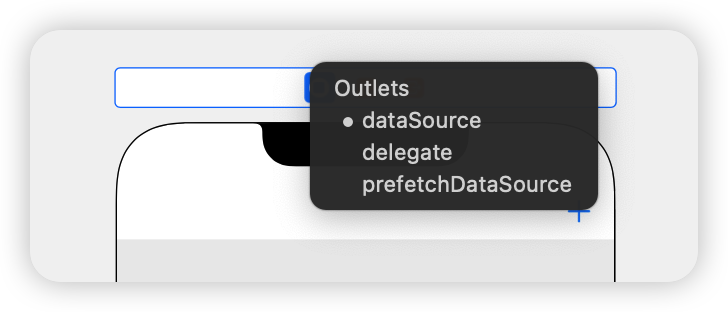


In case you’re wondering, you don’t need to set up the table view’s delegate since tapping on the cells won’t trigger any action. It doesn’t get simpler than this!

Open the assistant editor by pressing Control-Command-Option-Enter or by selecting the adjust editors button in the top right of the Storyboard scene and choosing Assistant as shown below.


Ctrl-drag from the table view onto ViewController.swift inside the class definition to create an IBOutlet.

Next, name the new IBOutlet property tableView, resulting in the following line:

```swift
@IBOutlet weak var tableView: UITableView!
```

Next, Ctrl-drag from the Add button into ViewController.swift just below your viewDidLoad() definition. This time, create an action instead of an outlet, naming the method addName, with a type UIBarButtonItem:

```swift
@IBAction func addName(_ sender: UIBarButtonItem) {

}
```

You can now refer to the table view and the bar button item’s action in code.

Next, you’ll set up the model for the table view. Add the following property to ViewController.swift below the tableView IBOutlet:

```swift
var names: [String] = []
```

names is a mutable array holding string values displayed by the table view. Next, replace the implementation of viewDidLoad() with the following:

```swift
override func viewDidLoad() {
  super.viewDidLoad()

  title = "The List"
  tableView.register(UITableViewCell.self,
                     forCellReuseIdentifier: "Cell")
}
```

This will set a title on the navigation bar and register the UITableViewCell class with the table view.

> Note: register(_:forCellReuseIdentifier:) guarantees your table view will return a cell of the correct type when the Cell reuseIdentifier is provided to the dequeue method.


Next, still in ViewController.swift, add the following UITableViewDataSource extension below your class definition for ViewController:

```swift
// MARK: - UITableViewDataSource
extension ViewController: UITableViewDataSource {

  func tableView(_ tableView: UITableView,
                 numberOfRowsInSection section: Int) -> Int {
    return names.count
  }

  func tableView(_ tableView: UITableView,
                 cellForRowAt indexPath: IndexPath)
                 -> UITableViewCell {

    let cell =
      tableView.dequeueReusableCell(withIdentifier: "Cell",
                                    for: indexPath)
    cell.textLabel?.text = names[indexPath.row]
    return cell

  }
}
```


If you’ve ever worked with UITableView, this code should look very familiar. First you returnthe number of rows in the table as the number of items in your names array.

Next, tableView(_:cellForRowAt:) dequeues table view cells and populates them with the corresponding string from the names array.

Next, you need a way to add new names so the table view can display them. Implement the addName IBAction method you Ctrl-dragged into your code earlier:

```swift
// Implement the addName IBAction
@IBAction func addName(_ sender: UIBarButtonItem) {

  let alert = UIAlertController(title: "New Name",
                                message: "Add a new name",
                                preferredStyle: .alert)

  let saveAction = UIAlertAction(title: "Save",
                                 style: .default) {
    [unowned self] action in
                                  

    guard let textField = alert.textFields?.first,
      let nameToSave = textField.text else {
        return
    }
    
    self.names.append(nameToSave)
    self.tableView.reloadData()

  }

  let cancelAction = UIAlertAction(title: "Cancel",
                                   style: .cancel)

  alert.addTextField()

  alert.addAction(saveAction)
  alert.addAction(cancelAction)

  present(alert, animated: true)
}
```


Every time you tap the Add button, this method will present a UIAlertController with a text field and two buttons: Save and Cancel.

Save inserts the text fields current text into the names array then reloads the table view. Since the names array is the model backing the table view, whatever you type into the text field will appear in the table view.

Finally, build and run your app for the first time. Next, tap the Add button. The alert controller will look like this:

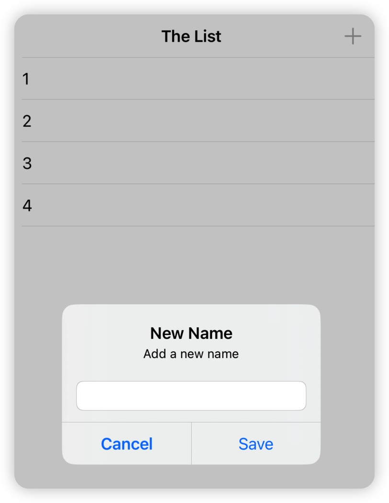

Add four or five names to the list. You should see something similar to below:


Your table view will display the data and your array will store the names, but the big thing missing here is persistence. The array is in memory but if you force quit the app or reboot your device, your hit list will be wiped out. Core Data provides persistence, meaning it can store data in a more durable state so it can outlive an app re-launch or a device reboot.

You haven’t added any Core Data elements yet, so nothing should persist after you navigate away from the app. Let’s test this out. Press the Home button if you’re using a physical device or the equivalent (Shift + ⌘ + H) if you’re using the Simulator. This will take you back to the familiar app grid on the home screen.

From the home screen, tap the HitList icon to bring the app back to the foreground. The names are still on the screen. What happened?

When you tap the Home button, the app currently in the foreground goes to the background. When this happens, the operating system flash-freezes everything currently in memory, including the strings in the names array. Similarly, when it’s time to wake up and return to the foreground, the operating system restores what used to be in memory as if you’d never left.

Apple introduced these advances in multitasking back in iOS 4. They create a seamless experience for iOS users but add a wrinkle to the definition of persistence for iOS developers. Are the names really persisted?

No, not really. If you had completely killed the app in the fast app switcher or turned off your phone, those names would be gone. You can verify this as well. With the app in the foreground, enter the fast app switcher.

You can do this by either double tapping the Home button if your device has one or slowly dragging upwards from the bottom of the screen if you’re on an iPhone X or later.

From here, flick the HitList app snapshot upwards to terminate the app. After you remove the app from the app switcher, there should be no trace of HitList in living memory (no pun intended). Verify the names are gone by returning to the home screen and tapping on the HitList icon to trigger a fresh launch.

The difference between flash-freezing and persistence may be obvious if you’ve worked with iOS for some time and are familiar with the way multitasking works. In a user’s mind, however, there is no difference. The user doesn’t care why the names are still there, whether the app went into the background and came back, or because the app saved and reloaded them. All that matters is the names are still there when the app comes back!

So the real test of persistence is whether your data is still there after a fresh app launch.


## Modeling your data

Now you know how to check for persistence, you can dive into Core Data. Your goal for the HitList app is simple: persist the names you enter so they’re available for viewing after a fresh app launch.

Up to this point, you’ve been using plain old Swift strings to store the names in memory. In this section, you’ll replace these strings with Core Data objects. The first step is to create a managed object model, which describes the way Core Data represents data on disk.

By default, Core Data uses a SQLite database as the persistent store, so you can think of the Data Model as the database schema.

> Note: You’ll come across the word managed quite a bit in this book. If you see “managed” in the name of a class, such as in NSManagedObjectContext, chances are you are dealing with a Core Data class. “Managed” refers to Core Data’s management of the life cycle of Core Data objects.
>
> However, don’t assume all Core Data classes contain the word “managed”. Most don’t. For a comprehensive list of Core Data classes, check out the Core Data framework reference in the documentation browser.

Since you’ve elected to use Core Data, Xcode automatically created a Data Model file for you and named it HitList.xcdatamodeld.

Open HitList.xcdatamodeld. As you can see, Xcode has a powerful Data Model editor:


The Data Model editor has a lot of features you’ll explore in later chapters. For now, let’s focus on creating a single Core Data entity.

Click on Add Entity on the lower-left to create a new entity. Double-click the new entity and change its name to Person, like so:


You may be wondering why the model editor uses the term Entity. Weren’t you simply defining a new class? As you’ll see shortly, Core Data comes with its own vocabulary. Here’s a quick rundown of some terms you’ll commonly encounter:

- An entity is a class definition in Core Data. The classic example is an Employee or a Company. In a relational database, an entity corresponds to a table.

- An attribute is a piece of information attached to a particular entity. For example, an Employee entity could have attributes for the employee’s name, position and salary. In a database, an attribute corresponds to a particular field in a table.

- A relationship is a link between multiple entities. In Core Data, relationships between two entities are called to-one relationships, while those between one and many entities are called to-many relationships. For example, a Manager can have a to-many relationship with a set of employees, whereas an individual Employee will usually have a to-one relationship with his manager.

Now you know what an attribute is, you can add an attribute to Person object created earlier. Still in HitList.xcdatamodeld, select Person on the left-hand side and click the plus sign (+) under Attributes.

Set the new attribute’s name to, er, name and change its type to String:


In Core Data, an attribute can be of one of several data types. You’ll learn about these in the next few chapters.


## Saving to Core Data

Open ViewController.swift, add the following Core Data module import below import UIKit:

```swift
import CoreData
```

This import is all you need to start using the Core Data API in your code.

Next, replace the names property definition with the following:

```swift
var people: [NSManagedObject] = []
```

You’ll store Person entities rather than string names, so you rename the array serving as the table view’s data model to people. It now holds instances of NSManagedObject rather than simple strings.

NSManagedObject represents a single object stored in Core Data; you must use it to create, edit, save and delete from your Core Data persistent store. As you’ll see shortly, NSManagedObject is a shape-shifter. It can take the form of any entity in your Data Model, appropriating whatever attributes and relationships you defined.

Since you’re changing the table view’s model, you must also replace both data source methods implemented earlier. Replace your UITableViewDataSource extension with the following:

```swift
// MARK: - UITableViewDataSource
extension ViewController: UITableViewDataSource {
  func tableView(_ tableView: UITableView,
                 numberOfRowsInSection section: Int) -> Int {
    return people.count
  }

  func tableView(_ tableView: UITableView,
                 cellForRowAt indexPath: IndexPath)
                 -> UITableViewCell {

    let person = people[indexPath.row]
    let cell =
      tableView.dequeueReusableCell(withIdentifier: "Cell",
                                    for: indexPath)
    cell.textLabel?.text =
      person.value(forKeyPath: "name") as? String
    return cell

  }
}
```

The most significant change to these methods occurs in tableView(_:cellForRowAt:). Instead of matching cells with the corresponding string in the model array, you now match cells with the corresponding NSManagedObject. Note how you grab the name attribute from the NSManagedObject. It happens here:

```swift
cell.textLabel?.text =
  person.value(forKeyPath: "name") as? String
```


Why do you have to do this? As it turns out, NSManagedObject doesn’t know about the name attribute you defined in your data model, so there’s no way of accessing it directly with a property. The only way Core Data provides to read the value is key-value coding, commonly referred to as KVC.

> Note: KVC is a mechanism in Foundation for accessing an object’s properties indirectly using strings. In this case, KVC makes NSMangedObject behave somewhat like a dictionary at runtime.
>
> Key-value coding is available to all classes inheriting from NSObject, including NSManagedObject. You can’t access properties using KVC on a Swift object that doesn’t descend from NSObject.

Next, find addName(\_:) and replace the save UIAlertAction with the following:

```swift
let saveAction = UIAlertAction(title: "Save", style: .default) {
  [unowned self] action in

  guard let textField = alert.textFields?.first,
    let nameToSave = textField.text else {
      return
  }

  self.save(name: nameToSave)
  self.tableView.reloadData()
}
```

This takes the text in the text field and passes it over to a new method named save(name:). Xcode complains because save(name:) doesn’t exist yet. Add the following implementation below addName(_:):

```swift
func save(name: String) {

  guard let appDelegate =
    UIApplication.shared.delegate as? AppDelegate else {
    return
  }

  // 1
  let managedContext =
    appDelegate.persistentContainer.viewContext

  // 2
  let entity =
    NSEntityDescription.entity(forEntityName: "Person",
                               in: managedContext)!

  let person = NSManagedObject(entity: entity,
                               insertInto: managedContext)

  // 3
  person.setValue(name, forKeyPath: "name")

  // 4
  do {
    try managedContext.save()
    people.append(person)
  } catch let error as NSError {
    print("Could not save. \(error), \(error.userInfo)")
  }
}
```

This is where Core Data kicks in! Here’s what the code does:

1. Before you can save or retrieve anything from your Core Data store, you first need to get your hands on an NSManagedObjectContext. You can consider a managed object context as an in-memory “scratchpad” for working with managed objects.

   Think of saving a new managed object to Core Data as a two-step process: first, you insert a new managed object into a managed object context; once you’re happy, you “commit” the changes in your managed object context to save it to disk.

   Xcode has already generated a managed object context as part of the new project’s template. Remember, this only happens if you check the Use Core Data checkbox at the beginning. This default managed object context lives as a property of the NSPersistentContainer in the application delegate. To access it, you first get a reference to the app delegate.

2. You create a new managed object and insert it into the managed object context. You can do this in one step with NSManagedObject’s static method: entity(forEntityName:in:).

   You may be wondering what an NSEntityDescription is all about. Recall earlier, NSManagedObject was called a shape-shifter class because it can represent any entity. An entity description is the piece linking the entity definition from your Data Model with an instance of NSManagedObject at runtime.

3. With an NSManagedObject in hand, you set the name attribute using key-value coding. You must spell the KVC key (name in this case) exactly as it appears in your data model, otherwise, your app will crash at runtime.

4. You commit your changes to person and save to disk by calling save on the managed object context. Note save can throw an error, which is why you call it using the try keyword within a do-catch block. Finally, insert the new managed object into the people array so it shows up when the table view reloads.


That’s a little more complicated than using an array of strings, but not too bad. Some of the code here, such as getting the managed object context and entity, could be done just once in your own init() or viewDidLoad() then reused later. For simplicity, you’re doing it all in the same method.

Build and run the app, and add a few names to the table view:

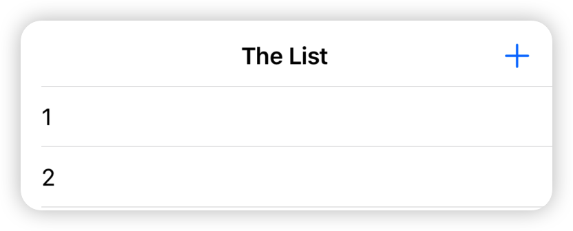

If the names are actually stored in Core Data, the HitList app should pass the persistence test. With the app in the foreground, go to the fast app switcher and then terminate it.

From Springboard, tap the HitList app to trigger a fresh launch. Wait, what happened? The table view is empty:


You saved to Core Data, but after a fresh app launch, the people array is empty! That’s because the data is sitting on disk waiting for you, but you’re not showing it yet.


## Fetching from Core Data

To get data from your persistent store into the managed object context, you have to fetch it. Open ViewController.swift and add the following below viewDidLoad():

```swift
override func viewWillAppear(_ animated: Bool) {
  super.viewWillAppear(animated)

  //1
  guard let appDelegate =
    UIApplication.shared.delegate as? AppDelegate else {
      return
  }

  let managedContext =
    appDelegate.persistentContainer.viewContext

  //2
  let fetchRequest =
    NSFetchRequest<NSManagedObject>(entityName: "Person")

  //3
  do {
    people = try managedContext.fetch(fetchRequest)
  } catch let error as NSError {
    print("Could not fetch. \(error), \(error.userInfo)")
  }
}
```

Step by step, this is what the code does:

1. Before you can do anything with Core Data, you need a managed object context. Fetching is no different! Like before, you pull up the application delegate and grab a reference to its persistent container to get your hands on its NSManagedObjectContext.

2. As the name suggests, NSFetchRequest is the class responsible for fetching from Core Data. Fetch requests are both powerful and flexible. You can use fetch requests to fetch a set of objects meeting the provided criteria (i.e. give me all employees living in Wisconsin and have been with the company at least three years), individual values (i.e., give me the longest name in the database) and more.

   Fetch requests have several qualifiers used to refine the set of results returned. You’ll learn more about these qualifiers in Chapter 4, “Intermediate Fetching”; for now, you should know NSEntityDescription is one of these required qualifiers.

   Setting a fetch request’s entity property, or alternatively initializing it with init(entityName:), fetches all objects of a particular entity. This is what you do here to fetch all Person entities. Also note NSFetchRequest is a generic type. This use of generics specifies a fetch request’s expected return type, in this case NSManagedObject.

3. You hand the fetch request over to the managed object context to do the heavy lifting. fetch(\_:) returns an array of managed objects meeting the criteria specified by the fetch request.

> Note: Like save(), fetch(_:) can also throw an error so you have to use it within a do block. If an error occurred during the fetch, you can inspect the error inside the catch block and respond appropriately.

Build and run the application. Immediately, you should see the list of names you added earlier:


Great! They’re back from the dead (pun intended). Add a few more names to the list and restart the app to verify saving and fetching are working. Short of deleting the app, resetting the Simulator or throwing your phone off a tall building, the names will appear in the table view no matter what.

> Note: There were a few rough edges in this sample app: you had to get the managed object context from the app delegate each time, and you used KVC to access an entity’s attributes rather than a more natural object-style person.name.

There are better ways to save and fetch data from Core Data, which you’ll explore in future chapters. The purpose of doing it the “long way” here is to learn what’s going on behind the scenes!


## Key points

- Core Data provides on-disk persistence, which means your data will be accessible even after terminating your app or shutting down your device. This is different from in-memory persistence, which will only save your data as long as your app is in memory, either in the foreground or in the background.

- Xcode comes with a powerful Data Model editor, which you can use to create your managed object model.

- A managed object model is made up of entities, attributes and relationships

- An entity is a class definition in Core Data.

- An attribute is a piece of information attached to an entity.

- A relationship is a link between multiple entities.

- An NSManagedObject is a run-time representation of a Core Data entity. You can read and1 write to its attributes using Key-Value Coding.

- You need an NSManagedObjectContext to save() or fetch(_:) data to and from Core Data.


# Chapter 2: NSManagedObject Subclasses

You got your feet wet with a simple Core Data app in Chapter 1; now it’s time to explore more of what Core Data has to offer!

At the core of this chapter is the subclassing of NSManagedObject to make your own classes for each data entity. This creates a direct one-to-one mapping between entities in the data model editor and classes in your code. This means in some parts of your code, you can work with objects and properties without worrying too much about the Core Data side of things.

Along the way, you’ll learn about all the data types available in Core Data entities, including a few outside the usual string and number types. And with all the data type options available, you’ll also learn about validating data to automatically check values before saving.


## Getting started

Head over to the files accompanying this book and open the sample project named BowTies in the starter folder. Like HitList, this project uses Xcode’s Core Data-enabled template. Like before, this means Xcode generated its own ready-to-use Core Data stack located in AppDelegate.swift.

Open Main.storyboard. Here you’ll find the sample project’s single-page UI:


As you can probably guess, BowTies is a lightweight bow tie management application. You can switch between the different colors of bow ties you own — the app assumes one of each — using the topmost segmented control. Tap “R” for red, “O” for orange and so on.

Tapping on a particular color pulls up an image of the tie and populates several labels on the screen with specific information about the tie. This includes:

- The name of the bow tie (so you can tell similarly-colored ones apart)

- The number of times you’ve worn the tie

- The date you last wore the tie

- Whether the tie is a favorite of yours

The Wear button on the bottom-left increments the number of times you’ve worn that particular tie and sets the last worn date to today.

Orange is not your color? Not to worry. The Rate button on the bottom-right changes a bow tie’s rating. This particular rating system uses a scale from 0 to 5, allowing for decimal values.

That’s what the application is supposed to do in its final state. Open ViewController.swift to see what it currently does:

```swift
import UIKit

class ViewController: UIViewController {

  // MARK: - IBOutlets
  @IBOutlet weak var segmentedControl: UISegmentedControl!
  @IBOutlet weak var imageView: UIImageView!
  @IBOutlet weak var nameLabel: UILabel!
  @IBOutlet weak var ratingLabel: UILabel!
  @IBOutlet weak var timesWornLabel: UILabel!
  @IBOutlet weak var lastWornLabel: UILabel!
  @IBOutlet weak var favoriteLabel: UILabel!
  @IBOutlet weak var wearButton: UIButton!
  @IBOutlet weak var rateButton: UIButton!

  // MARK: - View Life Cycle
  override func viewDidLoad() {
    super.viewDidLoad()
  }

  // MARK: - IBActions
  @IBAction func segmentedControl(
    _ sender: UISegmentedControl) {

  }

  @IBAction func wear(_ sender: UIButton) {

  }

  @IBAction func rate(_ sender: UIButton) {

  }
}
```

The bad news is in its current state, BowTies doesn’t do anything. The good news is you don’t need to do any Ctrl-dragging!

The segmented control and all the labels on the user interface are already connected to IBOutlets in code. In addition, the segmented control, Wear and Rate button all have corresponding IBActions.

It looks like you have everything you need to get started adding some Core Data — but wait, what are you going to display onscreen? There’s no input method to speak of, so the app must ship with sample data.That’s exactly right. BowTies includes a property list called SampleData.plist containing the information for seven sample ties, one for each color of the rainbow.


Furthermore, the application’s asset catalog Assets.xcassets contains seven images corresponding to the seven bow ties in SampleData.plist.

What you have to do now is take this sample data, store it in Core Data and use it to implement the bow tie management functionality.


## Modeling your data

In the previous chapter, you learned one of the first things you have to do when starting a new Core Data project is create your data model.

Open BowTies.xcdatamodeld and click Add Entity on the lower-left to create a new entity. Double-click on the new entity and change its name to BowTie, like so:


In the previous chapter, you created a simple Person entity with a single string attribute to hold the person’s name. Core Data supports several other data types, and you’ll use most of them for the new BowTie entity.

An attribute’s data type determines what kind of data you can store in it and how much space it will occupy on disk. In Core Data, an attribute’s data type begins as Undefined so you’ll have to change it to something else.

If you remember from SampleData.plist, each bow tie has ten associated pieces of information. This means the BowTie entity will end up with at least ten attributes in the model editor.

Select BowTie on the left-hand side and click the plus sign (+) under Attributes. Change the new attribute’s name to name and set its type to String:


Repeat this process seven more times to add the following attributes:

- A Boolean named isFavorite

- A Date named lastWorn

- A Double named rating

- A String named searchKey

- An Integer 32 named timesWorn

- A UUID named id

- A URI named url

Most of these data types are common in everyday programming. If you haven’t heard of a UUID before, it’s short for universally unique identifier and it’s commonly used to uniquely identify information.

URI stands for uniform resource identifier and it’s used to name and identify different resources like files and web pages. In fact, all URLs are URIs!

When you’re finished, your Attributes section should look similar to the following:


Don’t worry if the order of the attributes is different — all that matters is the attribute names and types are correct.

> Note: You may have noticed you have three options for the timesWorn integer attribute: Integer 16, Integer 32 or Integer 64.

16, 32 and 64 refer to the number of bits representing the integer. This is important for two reasons: the number of bits reflects how much space an integer takes up on disk as well as how many values it can represent, also known as its range. Here are the ranges for the three types of integers:

Range for 16-bit integer: -32768 to 32767

Range for 32-bit integer: –2147483648 to 2147483647

Range for 64-bit integer: –9223372036854775808 to 9223372036854775807

How do you choose? The source of your data will dictate the best type of integer. You’re assuming your users really like bow ties, so a 32-bit integer should offer enough storage for a lifetime of bow tie wear.


Each bow tie has an associated image. How will you store it in Core Data? Add one more attribute to the BowTie entity, name it photoData and change its data type to Binary Data:

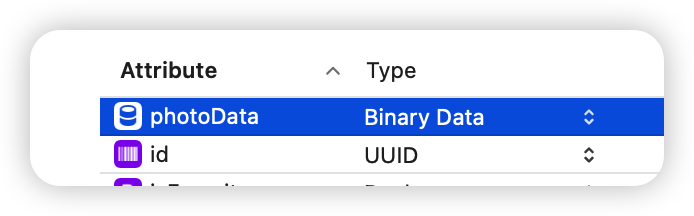

Core Data provides the option of storing arbitrary blobs of binary data directly in your data model. These could be anything from images, to PDF files, to anything that can be serialized into zeroes and ones.

As you can imagine, this convenience can come at a steep cost. Storing a large amount of binary data in the same SQLite database as your other attributes will likely impact your app’s performance. That means a giant binary blob would be loaded into memory each time you access an entity, even if you only need to access its name!

Luckily, Core Data anticipates this problem. With the photoData attribute selected, open the Attributes Inspector and check the Allows External Storage option.


When you enable Allows External Storage, Core Data heuristically decides on a per-value basis if it should save the data directly in the database or store a URI that points to a separate file.

> Note: The Allows External Storage option is only available for the binary data attribute type. In addition, if you turn it on, you won’t be able to query Core Data using this attribute.

In summary, besides Strings, Integers, Doubles, Booleans and Dates, Core Data can also save Binary Data, and it can do so efficiently and intelligently.


## Storing non-standard data types in Core Data

Still, there are many other types of data you may want to save. For example, what would you do if you had to store an instance of UIColor?

With the options presented so far, you’d have to deconstruct the color into its individual components and save them as integers (e.g., red: 255, green: 101, blue: 155). Then, after fetching these components, you’d have to reconstitute your color at runtime.

Alternatively, you could serialize the UIColor instance to Data and save it as binary data. Then again, you’d also have to “add water” afterward to reconstitute the binary data back to the UIColor object you wanted in the first place.

Once again, Core Data has your back. If you took a close look at SampleData.plist, you probably noticed each bow tie has an associated color. Select the BowTie entity in the model editor and add a new attribute named tintColor of type Transformable.

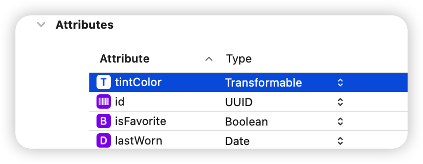

Transformable attributes persist data types that are not listed in Xcode’s Data Model Inspector. These include types that Apple ships in their frameworks such as UIColor and CLLocationCoordinate2D as well as your own types.

Transformable attributes are extremely powerful and flexible but you need to do some work up front to tell iOS how to convert these types to and from Data. You have to meet three requirements to make an attribute Transformable:

1. Add NSSecureCoding protocol conformance to the backing data type.

2. Create and register an NSSecureUnarchiveFromDataTransformer subclass.

3. Associate the custom data transformer subclass with the Transformable attribute in the Data Model Editor.

Since you’re dealing with UIColor, the good news is it already conforms to NSSecureCoding. Most data types in Apple’s frameworks do. Hooray!

To fulfill the second requirement, click on File\New\File... and create a file from the Cocoa Touch template. Name the file ColorAttributeTransformer and make it a subclass of NSSecureUnarchiveFromDataTransformer. Click Next and save the file within your project.


Next, replace the contents of the new file with the following implementation.

```swift
import UIKit

class ColorAttributeTransformer:
  NSSecureUnarchiveFromDataTransformer {

  //1
  override static var allowedTopLevelClasses: [AnyClass] {
    [UIColor.self]
  }

  //2
  static func register() {
    let className =
      String(describing: ColorAttributeTransformer.self)
    let name = NSValueTransformerName(className)

    let transformer = ColorAttributeTransformer()
    ValueTransformer.setValueTransformer(
      transformer, forName: name)

  }
}
```

Here’s what this code does:

1. Override allowedTopLevelClasses to return a list of classes this data transformer can decode. We want to persist and retrieve instances of UIColor, so here you return an array that contains only that class.

2. Like the name implies, the static function register() helps you register your subclass with ValueTransformer. But why do you need to do this? ValueTransformer maintains a key-value mapping where the key is a name you provide using NSValueTransformerName and the value is an instance of the corresponding transformer. You will need this mapping later in the Data Model Editor.


Next, open AppDelegate.swift and replace application(\_:didFinishLaunchingWithOptions:) with the following implementation:

```swift
func application(_ application: UIApplication,
                 didFinishLaunchingWithOptions
  launchOptions: [UIApplication.LaunchOptionsKey: Any]?)
                 -> Bool {

  ColorAttributeTransformer.register()

  return true
}
```

Here you register your data transformer with the static method you implemented earlier. Registration can happen at any point before your application sets up the Core Data stack.

Next, go back to BowTies.xcdatamodeld, select the tintColor attribute and open the Data Model Inspector. Change the value of Transformer to ColorAttributeTransformer and set the Custom Class to UIColor.


Your data model is now complete. The BowTie entity has the ten attributes it needs to store all the information in SampleData.plist.


## Managed object subclasses

In the sample project from the last chapter, you used key-value coding to access the attributes on the Person entity. It looked similar to the following:

```swift
// Set the name
person.setValue(aName, forKeyPath: "name")

// Get the name
let name = person.value(forKeyPath: "name")
```

Even though you can do everything directly on NSManagedObject using key-value coding, that doesn’t mean you should!

The biggest problem with key-value coding is you’re accessing data using strings instead of strongly-typed classes. This is often jokingly referred to as writing stringly typed code.

As you probably know from experience, stringly typed code is vulnerable to silly human errors such as mistyping and misspelling. Key-value coding also doesn’t take full advantage of Swift’s type-checking and Xcode’s auto-completion. “There must be another way!” you may be thinking, and you’re right.

The best alternative to key-value coding is to create NSManagedObject subclasses for each entity in your data model. That means there will be a BowTie class with correct types for each property.

Xcode can generate the subclass for you either manually or automatically. Why would you want Xcode to do it for you? It can be a bit of a hassle having to generate these subclass files and have them clutter up your project if you never have to look at them or change them. Since Xcode 8, you can choose, on a per-entity basis, to have Xcode automatically generate and update these files, and store them in the derived data folder for your project.

This setting is in the Codegen field of the Data Model inspector when using the model editor. Because you’re learning about Core Data in this book, you’re not going to use automatic code generation because it helps a lot to be able to easily see the files that have been generated for you.

Make sure you still have BowTies.xcdatamodeld open, select the BowTie entity and open the Data Model inspector. Set the Codegen dropdown to Manual/None, as shown below:


> Note: Make sure you change this code generation setting before your first compilation, after you add the BowTie entity to the model.
>
> If you set the code generation setting after your first compilation, you’ll have two versions of the managed object subclass: one in derived data, and a second one in your source code. If this happens, you’ll run into problems when you try to compile again.


Next, go to Editor\Create NSManagedObject Subclass…. Select the data model and then the BowTie entity in the next two dialog boxes. Click Create to save the file.

Xcode generated two Swift files for you, one called BowTie+CoreDataClass.swift and a second called BowTie+CoreDataProperties.swift. Open BowTie+CoreDataClass.swift. It should look similar to the following:

```swift
import Foundation
import CoreData

@objc(BowTie)
public class BowTie: NSManagedObject {

}
```

Next, open BowTie+CoreDataProperties.swift. Your generated properties may not be in the same order as shown here, but the file should look similar to the following:

```swift
import Foundation
import CoreData

extension BowTie {

  @nonobjc public class func fetchRequest() 
    -> NSFetchRequest<BowTie> {
    

    return NSFetchRequest<BowTie>(entityName: "BowTie")

  }

  @NSManaged public var name: String?
  @NSManaged public var isFavorite: Bool
  @NSManaged public var lastWorn: Date?
  @NSManaged public var rating: Double
  @NSManaged public var searchKey: String?
  @NSManaged public var timesWorn: Int32
  @NSManaged public var id: UUID?
  @NSManaged public var url: URL?
  @NSManaged public var photoData: Data?
  @NSManaged public var tintColor: UIColor?
}

extension BowTie : Identifiable {

}
```

In object-oriented parlance, an object is a set of values along with a set of operations defined on those values. In this case, Xcode separates these two things into two separate files. The values (i.e. the properties that correspond to the BowTie attributes in your data model) are in BowTie+CoreDataProperties.swift, whereas the operations are in the currently empty BowTie+CoreDataClass.swift.

> Note: You might be wondering why two separate files are generated. It's quite common to add custom code to your NSManagedObject subclass. You wouldn't want to lose that code if you updated the BowTie entity in the model editor and went to Editor\Create NSManagedObject Subclass... again. Code creation is smart - if the BowTie+CoreDataClass.swift already exists, it will only create BowTie+CoreDataProperties.swift, keeping all your custom code. This is the primary reason why Core Data generates two files, instead of generating one as it used to do in previous versions of Xcode.


Xcode has created a class with a property for each attribute in your data model. Since it has created a property of UIColor you'll need to add the following import UIKit below import CoreData to fix the error.

There is a corresponding class in Foundation or in the Swift standard library for every attribute type in the model editor. Here’s the full mapping of attribute types to runtime classes:

- String maps to String?

- Integer 16 maps to Int16

- Integer 32 maps to Int32
- Integer 64 maps to Int64
- Float maps to Float
- Double maps to Double
- Boolean maps to Bool
- Decimal maps to NSDecimalNumber?
- Date maps to Date?
- URI maps to URL?
- UUID maps to UUID?
- Binary data maps to Data?
- Transformable maps to NSObject?

> Note: Similar to @dynamic in Objective-C, the @NSManaged attribute informs the Swift compiler that the backing store and implementation of a property will be provided at runtime instead of compile time.

The normal pattern is for a property to be backed by an instance variable in memory. A property on a managed object is different: It’s backed by the managed object context, so the source of the data is not known at compile time.

Note since you’ve provided a Custom Class of UIColor for the tintColor property, Core Data has generated that property using UIColor? instead of NSObject?.


Congratulations, you’ve just made your first managed object subclass in Swift!

Compared with key-value coding, this is a much better way of working with Core Data entities and has two main benefits:

1. Managed object subclasses unleash the syntactic power of Swift properties. By accessing attributes using properties instead of key-value coding, you befriend Xcode and the compiler.

2. You gain the ability to override existing methods or to add your own. Note there are some NSManagedObject methods you must never override. Check Apple’s documentation of NSManagedObject for a complete list.

To make sure everything is hooked up correctly between the data model and your new managed object subclass, you’ll perform a small test.

Open AppDelegate.swift and replace application(_:didFinishLaunchingWithOptions:) with the following implementation:

```swift
func application(_ application: UIApplication,
                 didFinishLaunchingWithOptions
  launchOptions: [UIApplication.LaunchOptionsKey: Any]?)
                 -> Bool {

  ColorAttributeTransformer.register()

  // Save test bow tie
  let bowtie = NSEntityDescription.insertNewObject(
    forEntityName: "BowTie",
    into: self.persistentContainer.viewContext) as! BowTie
  bowtie.name = "My bow tie"
  bowtie.lastWorn = Date()
  saveContext()

  // Retrieve test bow tie
  let request: NSFetchRequest<BowTie> = BowTie.fetchRequest()

  if let ties =
    try? self.persistentContainer.viewContext.fetch(request),
    let testName = ties.first?.name,
    let testLastWorn = ties.first?.lastWorn {
    print("Name: \(testName), Worn: \(testLastWorn)")
  } else {
    print("Test failed.")
  }

  return true
}
```

On app launch, this test creates a bow tie and sets its name and lastWorn properties before saving the managed object context. Immediately after that, it fetches all BowTie entities and prints the name and the lastWorn date of the first one to the console; there should only be one at this point. Build and run the application and pay close attention to the console:

```swift
Name: My bow tie, Worn: 2022-11-15 18:24:39 +0000
```

If you’ve been following along carefully, name and lastWorn print to the console as expected. This means you were able to save and fetch a BowTie managed object subclass successfully. With this new knowledge under your belt, it’s time to implement the entire sample app.


## Propagating a managed context

Open ViewController.swift and add the following below import UIKit:

```swift
import CoreData
```

Next, add the following below the last IBOutlet property:

```swift
// MARK: - Properties
var managedContext: NSManagedObjectContext!
```

To reiterate, before you can do anything in Core Data, you first have to get an NSManagedObjectContext to work with. Knowing how to propagate a managed object context to different parts of your app is an important aspect of Core Data programming.

Open AppDelegate.swift and replace application(\_:didFinishLaunchingWithOptions:), which currently contains the test code, with its previous implementation:

```swift
func application(_ application: UIApplication,
                  didFinishLaunchingWithOptions
  launchOptions: [UIApplication.LaunchOptionsKey: Any]?)
  -> Bool {
  ColorAttributeTransformer.register()
  return true
}
```

You’ve got seven bow ties dying to enter your Core Data store. Open ViewController.swift and add the following method below rate(_:):

```swift
// Insert sample data
func insertSampleData() {

  let fetch: NSFetchRequest<BowTie> = BowTie.fetchRequest()
  fetch.predicate = NSPredicate(format: "searchKey != nil")

  let tieCount = (try? managedContext.count(for: fetch)) ?? 0

  if tieCount > 0 {
    // SampleData.plist data already in Core Data
    return
  }

  let path = Bundle.main.path(forResource: "SampleData",
                              ofType: "plist")
  let dataArray = NSArray(contentsOfFile: path!)!

  for dict in dataArray {
    let entity = NSEntityDescription.entity(
      forEntityName: "BowTie",
      in: managedContext)!
    let bowtie = BowTie(entity: entity,
                        insertInto: managedContext)
    let btDict = dict as! [String: Any]

    bowtie.id = UUID(uuidString: btDict["id"] as! String)
    bowtie.name = btDict["name"] as? String
    bowtie.searchKey = btDict["searchKey"] as? String
    bowtie.rating = btDict["rating"] as! Double
    let colorDict = btDict["tintColor"] as! [String: Any]
    bowtie.tintColor = UIColor.color(dict: colorDict)
    
    let imageName = btDict["imageName"] as? String
    let image = UIImage(named: imageName!)
    bowtie.photoData = image?.pngData()
    bowtie.lastWorn = btDict["lastWorn"] as? Date
    
    let timesNumber = btDict["timesWorn"] as! NSNumber
    bowtie.timesWorn = timesNumber.int32Value
    bowtie.isFavorite = btDict["isFavorite"] as! Bool
    bowtie.url = URL(string: btDict["url"] as! String)

  }
  try? managedContext.save()
}
```

Xcode will complain about a missing method declaration on UIColor. To fix this, add the following private UIColor extension to the end of the file below the last curly brace.

```swift
private extension UIColor {

  static func color(dict: [String: Any]) -> UIColor? {
    guard 
      let red = dict["red"] as? NSNumber,
      let green = dict["green"] as? NSNumber,
      let blue = dict["blue"] as? NSNumber else {
        return nil
    }
    

    return UIColor(
      red: CGFloat(truncating: red) / 255.0,
      green: CGFloat(truncating: green) / 255.0,
      blue: CGFloat(truncating: blue) / 255.0,
      alpha: 1)

  }
}
```

That’s quite a bit of code, but it’s all relatively straightforward. The first method, insertSampleData, checks for any bow ties; you’ll learn how this works later. If none are present, it grabs the bow tie information in SampleData.plist, iterates through each bow tie dictionary and inserts a new BowTie entity into your Core Data store. At the end of this iteration, it saves the managed object context property to commit these changes to disk.

The color(dict:) method you added to UIColor via private extension is also simple. SampleData.plist stores colors in a dictionary containing three keys: red, green and blue. This static method takes in this dictionary and returns a bona fide UIColor.

There are two things here to make special note of:

1. The way you store images in Core Data. The property list contains a file name for each bow tie, not the file image — the actual images are in the project’s asset catalog. With this file name, you instantiate the UIImage and immediately convert it into Data by means of pngData() before storing it in the imageData property.

2. The way you store the color. Even though the color is stored in a transformable attribute, it doesn’t require any special treatment before you store it in tintColor. You simply set the property and you’re good to go.

The previous methods insert all the bow tie data you had in SampleData.plist into Core Data. Now you need to access the data from somewhere!

Next, replace viewDidLoad() with the following implementation:

```swift
// MARK: - View Life Cycle
override func viewDidLoad() {
  super.viewDidLoad()

  let appDelegate = 
    UIApplication.shared.delegate as? AppDelegate
  managedContext = appDelegate?.persistentContainer.viewContext

  //1
  insertSampleData()

  //2
  let request: NSFetchRequest<BowTie> = BowTie.fetchRequest()
  let firstTitle = segmentedControl.titleForSegment(at: 0) ?? ""
  request.predicate = NSPredicate(
    format: "%K = %@",
    argumentArray: [#keyPath(BowTie.searchKey), firstTitle])

  do {
    //3
    let results = try managedContext.fetch(request)

    //4
    if let tie = results.first {
      populate(bowtie: tie)
    }

  } catch let error as NSError {
    print("Could not fetch \(error), \(error.userInfo)")
  }
}
```

This is where you fetch the bow ties from Core Data and populate the UI.

Step by step, here’s what you’re doing with this code:

1. You call insertSampleData(), which you implemented earlier. Since viewDidLoad() can be called every time the app is launched, insertSampleData() performs a fetch to make sure it isn’t inserting the sample data into Core Data multiple times.

2. You create a fetch request for the purpose of fetching the newly inserted BowTie entities. The segmented control has tabs to filter by color, so the predicate adds the condition to find the bow ties matching the selected color. Predicates are both very flexible and very powerful — you’ll read more about them in Chapter 4, “Intermediate Fetching.”

   For now, know this particular predicate is looking for bow ties with their searchKey property set to the segmented control’s first button title: in this case, R.

3. As always, the managed object context does the heavy lifting for you. It executes the fetch request you crafted moments earlier and returns an array of BowTie objects.

4. You populate the user interface with the first bow tie in the results array. If there was an error, print the error to the console.

You haven’t defined the populate method yet, so Xcode is throwing a warning. Add the following implementation below insertSampleData():

```swift
func populate(bowtie: BowTie) {

  guard let imageData = bowtie.photoData as Data?,
    let lastWorn = bowtie.lastWorn as Date?,
    let tintColor = bowtie.tintColor else {
      return
  }

  imageView.image = UIImage(data: imageData)
  nameLabel.text = bowtie.name
  ratingLabel.text = "Rating: \(bowtie.rating)/5"

  timesWornLabel.text = "# times worn: \(bowtie.timesWorn)"

  let dateFormatter = DateFormatter()
  dateFormatter.dateStyle = .short
  dateFormatter.timeStyle = .none

  lastWornLabel.text =
    "Last worn: " + dateFormatter.string(from: lastWorn)

  favoriteLabel.isHidden = !bowtie.isFavorite
  view.tintColor = tintColor
}
```

There’s a UI element for most attributes defined in a bow tie. Since Core Data only stores the image as a blob of binary data, it’s your job to reconstitute it back into an image so the view controller’s image view can use it.

Similarly, you can’t use the lastWorn date attribute directly. You first need to create a date formatter to turn the date into a string humans can understand.

Finally, the tintColor transformable attribute that stores your bow tie’s color changes the color of not one, but all the elements on the screen. Simply set the tint color on the view controller’s view and voilà! Everything is now tinted the same color.

> Note: Xcode generates some NSManagedObject subclass properties as optional types. That’s why inside the populate method, you unwrap some of the Core Data properties on BowTie using a guard statement at the beginning of the method.


Build and run the app. The red bow tie appears on the screen, like so:


The Wear and Rate buttons do nothing at the moment. Tapping on the different parts of the segmented controls also does nothing. You’ve still got work to do!

First, you need to keep track of the currently selected bow tie so you can reference it from anywhere in your class. Still in ViewController.swift, add the following property below managedContext to do this:

```swift
var currentBowTie: BowTie!
```

Next, find the call to populate(bowtie:) in the do-catch statement in viewDidLoad() and add the following line above it to set the initial value of currentBowTie:

```swift
currentBowTie = tie
```

Keeping track of the currently selected bow tie is necessary to implement the Wear and Rate buttons since these actions only affect the current bow tie.

Every time the user taps on Wear, the button executes the wear(\_:) action method. But wear(\_:) is empty at the moment. Replace the wear(\_:) implementation with the following:

```swift
@IBAction func wear(_ sender: UIButton) {  
  currentBowTie.timesWorn += 1
  currentBowTie.lastWorn = Date()

  do {
    try managedContext.save()
    populate(bowtie: currentBowTie)    
  } catch let error as NSError {    
    print("Could not fetch \(error), \(error.userInfo)")
  }
}
```

This method takes the currently selected bow tie and increments its timesWorn attribute by one. Next, you change the lastWorn date to today and save the managed object context to commit these changes to disk. Finally, you populate the user interface to visualize these changes.

Build and run the application and tap Wear as many times as you’d like. It looks like you thoroughly enjoy the timeless elegance of a red bow tie!

Similarly, every time the user taps on Rate, it executes the rate(\_:) action method in your code. rate(\_:) is currently empty. Replace the implementation of rate(\_:) with the following:

```swift
@IBAction func rate(_ sender: UIButton) {

  let alert = UIAlertController(title: "New Rating",
                                message: "Rate this bow tie",
                                preferredStyle: .alert)

  alert.addTextField { textField in
    textField.keyboardType = .decimalPad
  }

  let cancelAction = UIAlertAction(title: "Cancel",
                                   style: .cancel)

  let saveAction = UIAlertAction(
    title: "Save",
    style: .default
    ) { [unowned self] _ in
      if let textField = alert.textFields?.first {
        self.update(rating: textField.text)
      }
    }

  alert.addAction(cancelAction)
  alert.addAction(saveAction)

  present(alert, animated: true)
}
```

Tapping on Rate now brings up an alert view controller with a single text field, a cancel button and a save button. Tapping the save button calls update(rating:), which...

Whoops, you haven’t defined that method yet. Appease Xcode by adding the following implementation below populate(bowtie:):

```
func update(rating: String?) {

  guard let ratingString = rating,
    let rating = Double(ratingString) else {
      return
  }

  do {
    currentBowTie.rating = rating
    try managedContext.save()
    populate(bowtie: currentBowTie)
  } catch let error as NSError {    
    print("Could not save \(error), \(error.userInfo)")
  }
}
```

You convert the text from the alert view’s text field into a Double and use it to update the current bow ties rating property. Finally, you commit your changes as usual by saving the managed object context and refresh the UI to see your changes in real time.

Try it out. Build and run the app and tap Rate:


Enter any decimal number from 0 to 5 and tap Save. As you’d expect, the rating label updates to the new value you entered. Now tap Rate one more time. Remember the timeless elegance of a red bow tie? Let’s say you like it so much you decide to rate it a 6 out of 5. Tap Save to refresh the user interface:


While you may absolutely love the color red, this is neither the time nor the place for hyperbole. Your app let you save a 6 for a value that’s only supposed to go up to 5. You’ve got invalid data on your hands.


## Data validation in Core Data

Your first instinct may be to write client-side validation—something like, “Only save the new rating if the value is greater than 0 and less than 5.” Fortunately, you don’t have to write this code yourself. Core Data supports validation for most attribute types out of the box.

Open BowTies.xcdatamodeld, select the rating attribute and open the data model inspector.

Next to Validation, type 0 for minimum and 5 for maximum. That’s it! No need to write any Swift to reject invalid data.

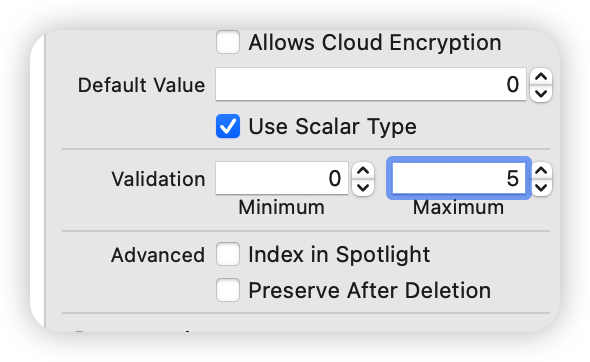

> Note: Normally, you have to version your data model if you want to change it after you’ve shipped your app. You’ll learn more about this in Chapter 6, “Versioning and Migration.”

Attribute validation is one of the few exceptions. If you add it to your app after shipping, you don’t have to version your data model. Lucky you!


But what does this do, exactly?

Validation kicks in immediately after you call save() on your managed object context. The managed object context checks with the model to see if any of the new values conflict with the validation rules you’ve put in place.

If there’s a validation error, the save fails. Remember that NSError in the do-catch block wrapping the save method? Up until now, you’ve had no reason to do anything special if there’s an error other than log it to the console. Validation changes that.

Build and run the app once more. Give the red bowtie a rating of 6 out of 5 and save. A rather cryptic error message will spill out onto your console:

```
Could not save Error Domain=NSCocoaErrorDomain Code=1610 "rating is too large." UserInfo={NSValidationErrorObject=<BowTie: 0x6000038c2da0> (entity: BowTie; id: 0xac775ff23f190c42 <x-coredata://67543601-368D-464C-B976-957548F4AF71/BowTie/p3>; data: {
    id = "800C3526-E83A-44AC-B718-D36934708921";
    isFavorite = 0;
    lastWorn = "2014-06-19 18:15:24 +0000";
    name = "Red Bow Tie";
    photoData = "{length = 50, bytes = 0x89504e47 0d0a1a0a 0000000d 49484452 ... aece1ce9 00000078 }";
    rating = 6;
    searchKey = R;
    timesWorn = 4;
    tintColor = "UIExtendedSRGBColorSpace 0.937255 0.188235 0.141176 1";
    url = "https://en.wikipedia.org/wiki/Bow_tie";
}), NSLocalizedDescription=rating is too large., NSValidationErrorKey=rating, NSValidationErrorValue=6}, ["NSValidationErrorObject": <BowTie: 0x6000038c2da0> (entity: BowTie; id: 0xac775ff23f190c42 <x-coredata://67543601-368D-464C-B976-957548F4AF71/BowTie/p3>; data: {
    id = "800C3526-E83A-44AC-B718-D36934708921";
    isFavorite = 0;
    lastWorn = "2014-06-19 18:15:24 +0000";
    name = "Red Bow Tie";
    photoData = "{length = 50, bytes = 0x89504e47 0d0a1a0a 0000000d 49484452 ... aece1ce9 00000078 }";
    rating = 6;
    searchKey = R;
    timesWorn = 4;
    tintColor = "UIExtendedSRGBColorSpace 0.937255 0.188235 0.141176 1";
    url = "https://en.wikipedia.org/wiki/Bow_tie";
}), "NSLocalizedDescription": rating is too large., "NSValidationErrorValue": 6, "NSValidationErrorKey": rating]
```

The userInfo dictionary that comes with the error contains all kinds of useful information about why Core Data aborted your save operation. It even has a localized error message you can show your users, under the key NSLocalizedDescription: rating is too large.

What you do with this error, however, is entirely up to you. Open ViewController.swift and replace update(rating:) with the following to handle the error appropriately:

```swift
func update(rating: String?) {

  guard let ratingString = rating,
    let rating = Double(ratingString) else {
      return
  }

  do {

    currentBowTie.rating = rating
    try managedContext.save()
    populate(bowtie: currentBowTie)

  } catch let error as NSError {

    if error.domain == NSCocoaErrorDomain &&
      (error.code == NSValidationNumberTooLargeError ||
        error.code == NSValidationNumberTooSmallError) {
      rate(rateButton)
    } else {
      print("Could not save \(error), \(error.userInfo)")
    }

  }
}
```

If there’s an error that occurred because the new rating was either too large or too small, then you present the alert view again.

Otherwise, you populate the user interface with the new rating as before.

But wait… Where did NSValidationNumberTooLargeError and NSValidationNumberTooSmallError come from? Go back to the previous console reading and look closely at the first line:

```
Could not save Error Domain=NSCocoaErrorDomain Code=1610 "rating is too large."
```

NSValidationNumberTooLargeError is an error code that maps to the integer 1610.

For a full list of Core Data errors and code definitions, you can consult CoreDataErrors.h in Xcode by Cmd-clicking on NSValidationNumberTooLargeError.

> Note: When an NSError is involved, it’s standard practice to check the domain and code for the error to determine what went wrong. You can read more about this in Apple’s Error Handling Programming Guide:https://developer.apple.com/library/archive/documentation/Cocoa/Conceptual/ErrorHandlingCocoa/CreateCustomizeNSError/CreateCustomizeNSError.html

Build and run the app. Verify the new validation rules work properly by once again showing the red tie some love.

If you enter any value above 5 and try to save, the app rejects your rating and asks you to try again with a new alert view. Success!


## Tying everything up

The Wear and Rate buttons are working properly, but the app can only display one tie. Tapping the different values on the segmented control is supposed to switch ties. You’ll finish up this sample project by implementing that feature.

Every time the user taps the segmented control, it executes the segmentedControl(\_:) action method in your code. Replace the implementation of segmentedControl(\_:) with the following:

```swift
@IBAction func segmentedControl(_ sender: UISegmentedControl) {
  guard let selectedValue = sender.titleForSegment(
    at: sender.selectedSegmentIndex) else {
      return
  }

  let request: NSFetchRequest<BowTie> = BowTie.fetchRequest()
  request.predicate = NSPredicate(
    format: "%K = %@",
    argumentArray: [#keyPath(BowTie.searchKey), selectedValue])

  do {
    let results = try managedContext.fetch(request)
    currentBowTie = results.first
    populate(bowtie: currentBowTie)
  } catch let error as NSError {
    print("Could not fetch \(error), \(error.userInfo)")
  }
}
```


The title of each segment in the segmented control corresponds to a particular tie’s searchKey attribute. Grab the title of the currently selected segment and fetch the appropriate bow tie using a well-crafted NSPredicate.

Then, use the first bow tie in the array of results (there should only be one per searchKey) to populate the user interface.

Build and run the app. Tap different letters on the segmented control for a psychedelic treat.

You did it! With this bow tie app under your belt, you’re well on your way to becoming a Core Data master.


## Key points

- Core Data supports different attribute data types, which determines the kind of data you can store in your entities and how much space they will occupy on disk. Some common attribute data types are String, Date, and Double.
- The Binary Data attribute data type gives you the option of storing arbitrary amounts of binary data in your data model.
- The Transformable attribute data type lets you store any object that conforms to NSSecureCoding in your data model.
- Using an NSManagedObject subclass is a better way to work with a Core Data entity. You can either generate the subclass manually or let Xcode do it automatically.
- You can refine the set entities fetched by NSFetchRequest using an NSPredicate.
- You can set validation rules (e.g. maximum value and minimum value) to most attribute data types directly in the data model editor. The managed object context will throw an error if you try to save invalid data.


# Chapter 3: The Core Data Stack

Until now, you’ve been relying on Xcode’s Core Data template. There’s nothing wrong with getting help from Xcode (that’s what it’s there for!). But if you really want to know how Core Data works, building your own Core Data stack is a must.

The stack is made up of four Core Data classes:

- NSManagedObjectModel

- NSPersistentStore

- NSPersistentStoreCoordinator

- NSManagedObjectContext

Of these four classes, you’ve only encountered NSManagedObjectContext so far in this book. But the other three were there behind the scenes the whole time, supporting your managed context.

In this chapter, you’ll learn the details of what these four classes do. Rather than rely on the default starter template, you’ll build your own Core Data stack; a customizable wrapper around these classes.


## Getting started

The sample project for this chapter is a simple dog-walking app. This application lets you save the date and time of your dog walks in a simple table view. Use this app regularly and your pooch (and his bladder) will love you.

You’ll find the sample project DogWalk in the resources accompanying this book. Open DogWalk.xcodeproj, then build and run the starter project.


As you can see, the sample app is already a fully-working (albeit simple) prototype. Tapping on the plus (+) button on the top-right adds a new entry to the list of walks. The image represents the dog you’re currently walking, but otherwise does nothing.

The app has all the functionality it needs, except for one important feature: The list of walks doesn’t persist. If you terminate DogWalk and re-launch, your entire history is gone. How will you remember if you walked your pooch this morning?

Your task in this chapter is to save the list of walks in Core Data. If that sounds like something you’ve already done in Chapters 1 and 2, here’s the twist; you’ll be writing your own Core Data stack to understand what’s really going on under the hood!


## Rolling your own Core Data stack

Knowing how the Core Data stack works is more than a nice to know. If you’re working with a more advanced setup, such as migrating data from an old persistent store, digging into the stack is essential.

Before you jump into the code, let’s consider what each of the four classes in the Core Data stack — NSManagedObjectModel, NSPersistentStore, NSPersistentStoreCoordinator and NSManagedObjectContext — does in detail.

“Note: This is one of the few parts of the book where you’ll read about the theory before using the concepts in practice. It’s almost impossible to separate one component from the rest of the stack and use it in isolation.


### The managed object model

The NSManagedObjectModel represents each object type in your app’s data model, the properties they can have, and the relationships between them. Other parts of the Core Data stack use the model to create objects, store properties and save data.

As mentioned earlier in the book, it can be helpful to think about NSManagedObjectModel as a database schema. If your Core Data stack uses SQLite under the hood, NSManagedObjectModel represents the schema for the database.

However, SQLite is only one of many persistent store types you can use in Core Data (more on this later), so it’s better to think of the managed object model in more general terms.

> Note: You may be wondering how NSManagedObjectModel relates to the data model editor you’ve been using all along. Good question!
>
> The visual editor creates and edits an xcdatamodel file. There’s a special compiler, momc, that compiles the model file into a set of files in a momd folder.
>
> Just as your Swift code is compiled and optimized so it can run on a device, the compiled model can be accessed efficiently at runtime. Core Data uses the compiled contents of the momd folder to initialize an NSManagedObjectModel at runtime.


### The persistent store

NSPersistentStore reads and writes data to whichever storage method you’ve decided to use. Core Data provides four types of NSPersistentStore out of the box: three atomic and one non-atomic.

An atomic persistent store needs to be completely deserialized and loaded into memory before you can make any read or write operations. In contrast, a non-atomic persistent store can load chunks of itself onto memory as needed.

Here’s a brief overview of the four built-in Core Data store types:

1. NSSQLiteStoreType is backed by an SQLite database. It’s the only non-atomic store type Core Data supports out of the box, giving it a lightweight and efficient memory footprint. This makes it the best choice for most iOS projects. Xcode’s Core Data template uses this store type by default.

2. NSXMLStoreType is backed by an XML file, making it the most human-readable of all the store types. This store type is atomic, so it can have a large memory footprint. NSXMLStoreType is only available on OS X.

3. NSBinaryStoreType is backed by a binary data file. Like NSXMLStoreType, it’s also an atomic store, so the entire binary file must be loaded onto memory before you can do anything with it. You’ll rarely find this type of persistent store in real-world applications.

4. NSInMemoryStoreType is the in-memory persistent store type. In a way, this store type is not really persistent. Terminate the app or turn off your phone, and the data stored in an in-memory store type disappears into thin air. Although this may seem to defeat the purpose of Core Data, in-memory persistent stores can be helpful for unit testing and some types of caching.

> Note: Were you holding your breath for a persistent store type backed by a JSON file or a CSV file? Bummer. The good news is you can create your own type of persistent store by subclassing NSIncrementalStore.
>
> Refer to Apple’s Incremental Store Programming Guide if you’re curious about this option:
>
> https://developer.apple.com/library/archive/documentation/DataManagement/Conceptual/IncrementalStorePG/Introduction/Introduction.html


### The persistent store coordinator

NSPersistentStoreCoordinator is the bridge between the managed object model and the persistent store. It’s responsible for using the model and the persistent stores to do most of the hard work in Core Data. It understands the NSManagedObjectModel and knows how to send information to, and fetch information from, the NSPersistentStore.

NSPersistentStoreCoordinator also hides the implementation details of how your persistent store or stores are configured. This is useful for two reasons:

1. NSManagedObjectContext (coming next!) doesn’t have to know if it’s saving to an SQLite database, XML file or even a custom incremental store.

2. If you have multiple persistent stores, the persistent store coordinator presents a unified interface to the managed context. As far as the managed context is concerned, it always interacts with a single, aggregate persistent store.


### The managed object context

On a day-to-day basis, you’ll work with NSManagedObjectContext the most out of the four stack components. You’ll probably only see the other three components when you need to do something more advanced with Core Data.

Since working with NSManagedObjectContext is so common, understanding how contexts work is very important! Here are some things you may have already picked up from the book so far:

- A context is an in-memory scratchpad for working with your managed objects.

- You do all of the work with your Core Data objects within a managed object context.

- Any changes you make won’t affect the underlying data on disk until you call save() on the context.

Now here are five things about contexts not mentioned before. A few of them are very important for later chapters, so pay close attention:

1. The context manages the lifecycle of the objects it creates or fetches. This lifecycle management includes powerful features such as faulting, inverse relationship handling and validation.

2. A managed object cannot exist without an associated context. In fact, a managed object and its context are so tightly coupled that every managed object keeps a reference to its context, which can be accessed like so:

```swift
let managedContext = employee.managedObjectContext
```

3. Contexts are very territorial; once a managed object has been associated with a particular context, it will remain associated with the same context for the duration of its lifecycle.

4. An application can use more than one context — most non-trivial Core Data applications fall into this category. Since a context is an in-memory scratch pad for what’s on disk, you can actually load the same Core Data object onto two different contexts simultaneously.


A context is not thread-safe. The same goes for a managed object: You can only interact with contexts and managed objects on the same thread in which they were created.


Apple has provided many ways to work with contexts in multithreaded applications. You’ll read all about different concurrency models in Chapter 9, “Multiple Managed Object Contexts.”


### The persistent store container

If you thought there were only four pieces to the Core Data stack, you’re in for a surprise! As of iOS 10, there's a new class to orchestrate all four Core Data stack classes: the managed model, the store coordinator, the persistent store and the managed context.

The name of this class is NSPersistentContainer and as its name implies, it’s a container that holds everything together. Instead of wasting your time writing boilerplate code to wire up all four stack components together, you can simply initialize an NSPersistentContainer, load its persistent stores, and you’re good to go.


## Creating your stack object

Now you know what each component does, it’s time to return to DogWalk and implement your own Core Data stack.

As you know from previous chapters, Xcode creates its Core Data stack in the app delegate. You’re going to do it differently. Instead of mixing app delegate code with Core Data code, you’ll create a separate class to encapsulate the stack.

Go to File ▸ New ▸ File…, select the iOS ▸ Source ▸ Swift File template and click Next. Name the file CoreDataStack and click Create to save the file.

Go to the newly created CoreDataStack.swift. You’ll be creating this file piece-by-piece. Start by replacing the contents of the file with the following:

```swift
import Foundation
import CoreData

class CoreDataStack {
  private let modelName: String

  init(modelName: String) {
    self.modelName = modelName
  }

  private lazy var storeContainer: NSPersistentContainer = {

    let container = NSPersistentContainer(name: self.modelName)
    container.loadPersistentStores { _, error in
      if let error = error as NSError? {
        print("Unresolved error \(error), \(error.userInfo)")
      }
    }
    return container

  }()
}
```

You start by importing the Foundation and  CoreData modules. Next, create a private property to store the modelName. Next, create an initializer to save modelName into private property.

Next, you set up a lazily instantiated NSPersistentContainer, passing the modelName you stored during initialization. The only other thing you need to do is call loadPersistentStores(completionHandler:) on the persistent container (despite the appearance of the completion handler, this method doesn’t run asynchronously by default). Finally, add the following lazily instantiated property below modelName:

```swift
lazy var managedContext: NSManagedObjectContext = {
  return self.storeContainer.viewContext
}()
```

Even though NSPersistentContainer has public accessors for its managed context, the managed model, the store coordinator and the persistent stores (via [NSPersistentStoreDescription]), CoreDataStack works a bit differently.

For instance, the only publicly accessible part of CoreDataStack is the NSManagedObjectContext because of the lazy property you just added. Everything else is marked private. Why is this?

The managed context is the only entry point required to access the rest of the stack. The persistent store coordinator is a public property on the NSManagedObjectContext. Similarly, both the managed object model and the array of persistent stores are public properties on the NSPersistentStoreCoordinator.

Finally, add the following method below the storeContainer property:

```swift
func saveContext () {
  guard managedContext.hasChanges else { return }

  do {
    try managedContext.save()
  } catch let error as NSError {
    print("Unresolved error \(error), \(error.userInfo)")
  }
}
```

This is a convenience method to save the stack’s managed object context and handle any resulting errors.

Open ViewController.swift and make the following changes. First, import the Core Data module. Add the following below import UIKit:

```swift
import CoreData
```

Next, add the following property below dateFormatter to hold the Core Data stack:

```swift
lazy var coreDataStack = CoreDataStack(modelName: "DogWalk")
```


## Modeling your data

Now your shiny new Core Data stack is securely fastened to the main view controller, it’s time to create your data model.

Head over to your Project Navigator and... Wait a second. There’s no data model file! That’s right. Since I generated this sample application without enabling the option to use Core Data, there’s no .xcdatamodeld file.

No worries. Go to File ▸ New ▸ File..., select the iOS ▸ Core Data ▸ Data Model template and click Next.

Name the file DogWalk.xcdatamodeld and click Create to save the file.

> Note: You’ll have problems later on if you don’t name your data model file precisely DogWalk.xcdatamodeld. This is because CoreDataStack.swift expects to find the compiled version at DogWalk.momd.


Open the data model file and create a new entity named Dog. You should be able to do this on your own by now, but in case you forgot how, click the Add Entity button on the bottom left.

Add an attribute named name of type String. Your data model should look like this:


You also want to keep track of the walks for a particular dog. After all, that’s the whole point of the app!

Define another entity and name it Walk. Then add an attribute named date and set its type to Date.


Go back to the Dog entity. You might think you need to add a new attribute of type Array to hold the walks, but there is no array type in Core Data. Instead, the way to do this is to model it as a relationship. Add a new relationship and name it walks. Set the destination to Walk:


You can think of the destination as the receiving end of a relationship. Every relationship begins as a to-one relationship by default, which means you can only track one walk per dog at the moment. Unless you don’t plan on keeping your dog for very long, you probably want to track more than one walk.

To fix this, with the walks relationship selected, open the Data Model Inspector:


Click on the Type dropdown, select To Many and check Ordered. This means one dog can have many walks and the order of the walks matters, since you’ll be displaying the walks sorted by date.

Select the Walk entity and create an inverse relationship back to Dog. Set the destination as dog and the inverse as walks.

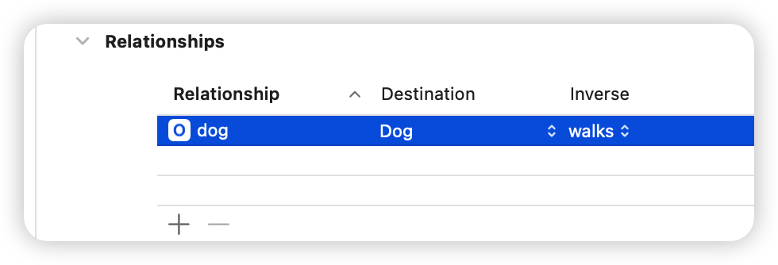

It’s OK to leave this relationship as a to-one relationship. A dog can have many walks, but a walk can only belong to one dog — for the purposes of this app, at least.

The inverse lets the model know how to find its way back, so to speak. Given a walk record, you can follow the relationship to the dog. Thanks to the inverse, the model knows to follow the walks relationship to get back to the walk record.

This is a good time to let you know the data model editor has another view style. This entire time you’ve been looking at the table editor style.

Toggle the segmented control on the bottom-right to switch to the graph editor style:


The graph editor is a great tool to visualize the relationships between your Core Data entities. Here the to-many relationship from Dog to Walk is represented with a double arrow. Walk points back to Dog with a single arrow, indicating a to-one relationship.

Feel free to switch back and forth between the two editor styles. You might find it easier to use the table style to add and remove entities and attributes, and the graph style to see the big picture of your data model.


## Adding managed object subclasses

In the previous chapter, you learned how to create custom managed object subclasses for your Core Data entities. It’s more convenient to work this way, so this is what you’ll do for Dog and Walk as well.

Like in the previous chapter, you're going to generate custom managed object subclasses manually instead of letting Xcode do it for you so you can see what's going on behind the scenes. Open DogWalk.xcdatamodeld, select the Dog entity and set the Codegen dropdown in the Data Model inspector to Manual/None. Repeat the same process for the Walk entity.

Then, go to Editor ▸ Create NSManagedObject Subclass… and choose the DogWalk model, and then both the Dog and Walk entities. Click Create on the next screen to create the files.

As you saw in Chapter 2, doing this creates two files per entity: one for the Core Data properties you defined in the model editor and one for any future functionality you may add to your managed object subclass.

Dog+CoreDataProperties.swift should look like this:

```swift
import Foundation
import CoreData

extension Dog {

  @objc(insertObject:inWalksAtIndex:)
  @NSManaged public func insertIntoWalks(_ value: Walk,
                                         at idx: Int)

  @objc(removeObjectFromWalksAtIndex:)
  @NSManaged public func removeFromWalks(at idx: Int)

  @objc(insertWalks:atIndexes:)
  @NSManaged public func insertIntoWalks(_ values: [Walk],
                                         at indexes: NSIndexSet)

  @objc(removeWalksAtIndexes:)
  @NSManaged public func removeFromWalks(at indexes: NSIndexSet)
  @objc(replaceObjectInWalksAtIndex:withObject:)
  @NSManaged public func replaceWalks(at idx: Int,
                                      with value: Walk)

  @objc(replaceWalksAtIndexes:withWalks:)
  @NSManaged public func replaceWalks(at indexes: NSIndexSet,
                                      with values: [Walk])

  @objc(addWalksObject:)
  @NSManaged public func addToWalks(_ value: Walk)

  @objc(removeWalksObject:)
  @NSManaged public func removeFromWalks(_ value: Walk)

  @objc(addWalks:)
  @NSManaged public func addToWalks(_ values: NSOrderedSet)

  @objc(removeWalks:)
  @NSManaged public func removeFromWalks(_ values: NSOrderedSet)
}

extension Dog : Identifiable {

}
```

Like before, the name attribute is a String optional. But what about the walks relationship? Core Data represents to-many relationships using sets, not arrays. Because you made the walks relationship ordered, you’ve got an NSOrderedSet.

> Note: NSSet seems like an odd choice, doesn’t it? Unlike arrays, sets don’t allow accessing their members by index. In fact, there’s no ordering at all! Core Data uses NSSet because a set forces uniqueness among its members. The same object can’t feature more than once in a to-many relationship.

If you need to access individual objects by index, you can check the Ordered checkbox in the visual editor, as you’ve done here. Core Data will then represent the relationship as an NSOrderedSet.

Similarly, Walk+CoreDataProperties.swift should look like this:

```swift
import Foundation
import CoreData

extension Walk {

  @nonobjc public class func fetchRequest()
    -> NSFetchRequest<Walk> {
    return NSFetchRequest<Walk>(entityName: "Walk")
  }

  @NSManaged public var date: Date?
  @NSManaged public var dog: Dog?
}

extension Walk : Identifiable {

}
```


The inverse relationship back to Dog is simply a property of type Dog. Easy as pie.

> Note: Sometimes Xcode will create relationship properties with the generic NSManagedObject type instead of the specific class, especially if you’re making lots of subclasses at the same time. If this happens, just correct the type yourself or generate the specific file again.


## A walk down persistence lane

Now your setup is complete; your Core Data stack, your data model and your managed object subclasses. It’s time to convert DogWalk to use Core Data. You’ve done this several times before, so this should be an easy section for you.

Pretend for a moment this application will at some point support tracking multiple dogs. The first step is to track the currently selected dog.

Open ViewController.swift and replace the walks array with the following property. Ignore the errors for now, you'll fix those in a minute:

```swift
var currentDog: Dog?
```

Next, add the following code to the end of viewDidLoad():

```swift
let dogName = "Fido"
let dogFetch: NSFetchRequest<Dog> = Dog.fetchRequest()
dogFetch.predicate = NSPredicate(format: "%K == %@",
                                 #keyPath(Dog.name), dogName)

do {
  let results = try coreDataStack.managedContext.fetch(dogFetch)
  if results.isEmpty {
    // Fido not found, create Fido
    currentDog = Dog(context: coreDataStack.managedContext)
    currentDog?.name = dogName
    coreDataStack.saveContext()
  } else {
    // Fido found, use Fido
    currentDog = results.first
  }
} catch let error as NSError {
  print("Fetch error: \(error) description: \(error.userInfo)")
}
```

First, you fetch all Dog entities with names of "Fido" from Core Data. You’ll learn more about fancy fetch requests like this in the next chapter.

If the fetch request came back with results, you set the first entity (there should only be one) as the currently selected dog.

If the fetch request comes back with zero results, this probably means it’s the user’s first time opening the app. If this is the case, you insert a new dog, name it “Fido”, and set it as the currently selected dog.

> Note: You’ve just implemented what’s often referred to as the Find or Create pattern. The purpose of this pattern is to manipulate an object stored in Core Data without running the risk of adding a duplicate object in the process. In iOS 9, Apple introduced the ability to specify unique constraints on your Core Data entities. With unique constraints, you can specify in your data model which attributes must always be unique on an entity to avoid adding duplicates.

Next, replace the implementation of tableView(\_:numberOfRowsInSection:) with the following:

```swift
func tableView(_ tableView: UITableView,
               numberOfRowsInSection section: Int) -> Int {
  currentDog?.walks?.count ?? 0
}
```


As you can probably guess, this ties the number of rows in the table view to the number of walks set in the currently selected dog. If there is no currently selected dog, return 0.

Next, replace tableView(\_:cellForRowAt:) with the following:

```swift
func tableView(
  _ tableView: UITableView,
  cellForRowAt indexPath: IndexPath
  ) -> UITableViewCell {
  let cell = tableView.dequeueReusableCell(
    withIdentifier: "Cell", for: indexPath)

  guard let walk = currentDog?.walks?[indexPath.row] as? Walk,
    let walkDate = walk.date as Date? else {
      return cell
  }

  cell.textLabel?.text = dateFormatter.string(from: walkDate)
  return cell
}
```

Only two lines of code have changed. Now, you take the date of each walk and display it in the corresponding table view cell.

The add(\_:) method still has a reference to the old walks array. Comment it out for now; you’ll re-implement this method in the next step:

```swift
@IBAction func add(_ sender: UIBarButtonItem) {
  // walks.append(Date())
  tableView.reloadData()
}
```

Build and run to make sure you have everything hooked up correctly.

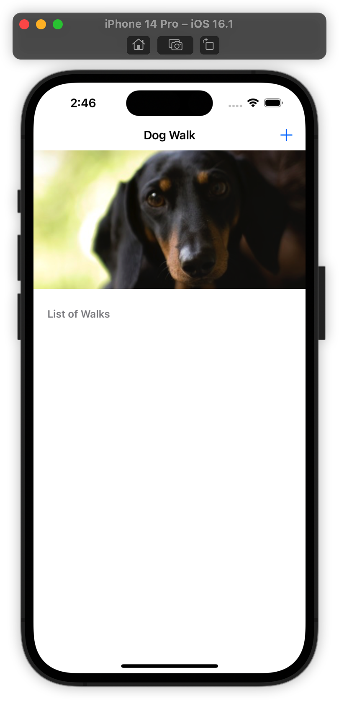

Hooray! If you’ve gotten this far, you’ve just inserted a dog into Core Data and are currently populating the table view with his list of walks. This list doesn’t have any walks at the moment, so the table doesn’t look very exciting.

Tap the plus (+) button, and it understandably does nothing. You haven’t implemented anything underneath this control yet! Before transitioning to Core Data, add(\_:) simply added a Date to an array and reloaded the table view. Re-implement it as shown below:

```swift
@IBAction func add(_ sender: UIBarButtonItem) {
  // Insert a new Walk entity into Core Data
  let walk = Walk(context: coreDataStack.managedContext)
  walk.date = Date()

  // Insert the new Walk into the Dog's walks set
  if let dog = currentDog,
    let walks = dog.walks?.mutableCopy()
      as? NSMutableOrderedSet {
      walks.add(walk)
      dog.walks = walks
  }

  // Save the managed object context
  coreDataStack.saveContext()

  // Reload table view
  tableView.reloadData()
}
```

The Core Data version of this method is much more complicated. First, you have to create a new Walk entity and set its date attribute to now. Next, you have to insert this walk into the currently selected dog’s list of walks.

However, the walks attribute is of type NSOrderedSet. NSOrderedSet is immutable, so you first have to create a mutable copy (NSMutableOrderedSet), insert the new walk and then reset an immutable copy of this mutable ordered set back on the dog.


Note: Is adding a new object into a to-many relationship making your head spin? Many people can sympathize, which is why Dog+CoreDataProperties contains generated accessors to the walks ordered set that will handle all of this for you.

For example, you can replace the entire if-let statement in the last code snippet with the following:

```swift
currentDog?.addToWalks(walk)
```

Give it a try!


Core Data can make things easier for you, though. If the relationship weren’t ordered, you’d just be able to set the one side of the relationship (e.g., walk.dog = currentDog) rather than the many side and Core Data would use the inverse relationship defined in the model editor to add the walk to the dog’s set of walks.

inally, you commit your changes to the persistent store by calling saveContext() on the Core Data stack and you reload the table view.

Build and run the app, and tap the plus (+) button a few times.

Great! The list of walks should now be saved in Core Data. Verify this by terminating the app in the fast app switcher and re-launching from scratch.


## Deleting objects from Core Data

Let’s say you were too trigger-friendly and tapped the plus (+) button when you didn’t mean to. You didn’t actually walk your dog, so you want to delete the walk you just added.

You’ve added objects to Core Data, you’ve fetched them, modified them and saved them again. What you haven’t done yet is delete them — but you’re about to do that next.

First, open ViewController.swift and add the following method to the UITableViewDataSource extension:

```swift
func tableView(_ tableView: UITableView,
               canEditRowAt indexPath: IndexPath) -> Bool {
  true
}
```

You’re going to use UITableView’s default behavior for deleting items: swipe left to reveal the red Delete button, then tap on it to delete.

The table view calls this UITableViewDataSource method to ask if a particular cell is editable, and returning true means all the cells should be editable.

Next, add the following method to the same UITableViewDataSource extension:

```swift
func tableView(
  _ tableView: UITableView,
  commit editingStyle: UITableViewCell.EditingStyle,
  forRowAt indexPath: IndexPath
) {

  //1
  guard let walkToRemove =
    currentDog?.walks?[indexPath.row] as? Walk,
    editingStyle == .delete else {
      return
  }

  //2
  coreDataStack.managedContext.delete(walkToRemove)

  //3
  coreDataStack.saveContext()

  //4
  tableView.deleteRows(at: [indexPath], with: .automatic)
}
```

This table view data source method is called when you tap the red Delete button. Let’s go through the code step-by-step:

1. First, you get a reference to the walk you want to delete.

2. Remove the walk from Core Data by calling NSManagedObjectContext’s delete() method. Core Data also takes care of removing the deleted walk from the current dog’s walks relationship.

3. No changes are final until you save your managed object context — not even deletions!

4. Finally, if the save operation succeeds, you animate the table view to tell the user about the deletion.

Build and run the app one more time. You should have several walks from previous runs. Pick any and swipe to the left.

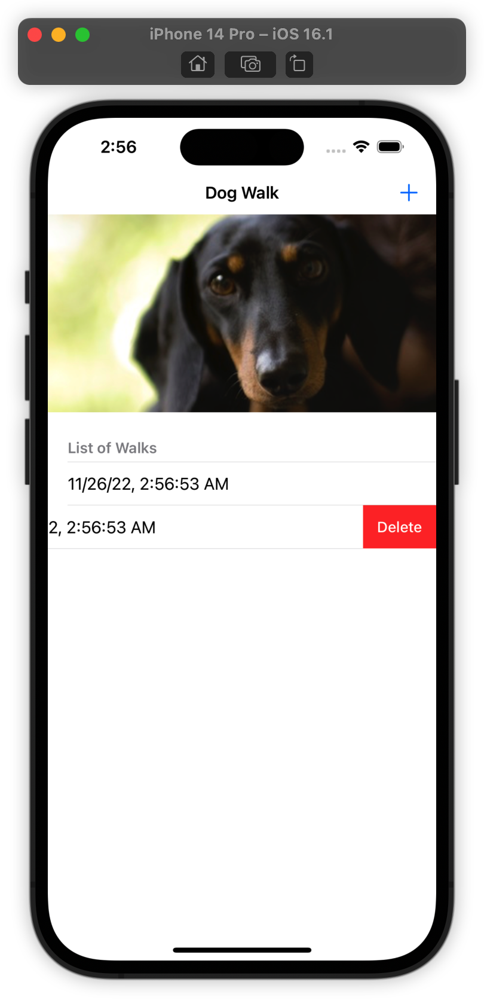

Tap on the Delete button to remove the walk. Verify that the walk is actually gone by terminating the app and re-launching from scratch. The walk you just removed is gone for good. Core Data giveth and Core Data taketh away.

> Note: Deleting used to be one of the most “dangerous” Core Data operations. Why is this? When you remove something from Core Data, you have to delete both the record on disk as well as any outstanding references in code.

Trying to access an NSManagedObject that had no Core Data backing store resulted in the the much-feared inaccessible fault Core Data crash.

Starting with iOS 9, deletion is safer than ever. Apple introduced the property shouldDeleteInaccessibleFaults on NSManagedObjectContext, which is turned on by default. This marks bad faults as deleted and treats missing data as NULL/nil/0.


## Key points

- The Core Data stack is made up of five classes: NSManagedObjectModel, NSPersistentStore, NSPersistentStoreCoordinator, NSManagedObjectContext and the NSPersistentContainer that holds everything together.

- The managed object model represents each object type in your app's data model, the properties they can have, and the relationship between them.

- A persistent store can be backed by a SQLite database (the default), XML, a binary file or in-memory store. You can also provide your own backing store with the incremental store API.

- The persistent store coordinator hides the implementation details of how your persistent stores are configured and presents a simple interface for your managed object context.

- The managed object context manages the lifecycles of the managed objects it creates or fetches. They are responsible for fetching, editing and deleting managed objects, as well as more powerful features such as validation, faulting and inverse relationship handling.


# Chapter 4: Intermediate Fetching

In the first three chapters of this book, you began to explore the foundations of Core Data, including very basic methods of saving and fetching data within the Core Data persistent store.

To this point, you’ve mostly performed simple, unrefined fetches such as “fetch all BowTie entities.” Sometimes this is all you need to do. Often, you’ll want to exert more control over how you retrieve information from Core Data.

Building on what you’ve learned so far, this chapter dives deep into the topic of fetching. Fetching is a large topic in Core Data, and you have many tools at your disposal. By the end of this chapter, you’ll know how to:

- Fetch only what you need to

- Refine your fetched results using predicates

- Fetch in the background to avoid blocking the UI

- Avoid unnecessary fetching by updating objects directly in the persistent store

This chapter is a toolbox sampler; its aim is to expose you to many fetching techniques, so when the time comes, you’ll know what tool to use.


## NSFetchRequest: the star of the show

As you’ve learned in previous chapters, you fetch records from Core Data by creating an instance of NSFetchRequest, configuring it as you like and handing it over to NSManagedObjectContext to do the heavy lifting.

Seems simple enough, but there are actually five different ways to get hold of a fetch request. Some are more popular than others, but you’ll likely encounter all of them at some point as a Core Data developer.

Before jumping to the starter project for this chapter, here are the five different ways to set up a fetch request so you’re not caught by surprise:

```swift
// 1
let fetchRequest1 = NSFetchRequest<Venue>()
let entity = 
  NSEntityDescription.entity(forEntityName: "Venue",
                             in: managedContext)!
fetchRequest1.entity = entity

// 2
let fetchRequest2 = NSFetchRequest<Venue>(entityName: "Venue")

// 3
let fetchRequest3: NSFetchRequest<Venue> = Venue.fetchRequest()

// 4
let fetchRequest4 = 
  managedObjectModel.fetchRequestTemplate(forName: "venueFR")

// 5
let fetchRequest5 =
  managedObjectModel.fetchRequestFromTemplate(
    withName: "venueFR",
    substitutionVariables: ["NAME" : "Vivi Bubble Tea"])
```

Going through each in turn:

1. You initialize an instance of NSFetchRequest as generic type: NSFetchReques\<Venue\>. At a minimum, you must specify a NSEntityDescription for the fetch request. In this case, the entity is Venue. You initialize an instance of NSEntityDescription and use it to set the fetch request’s entity property.

2. Here you use NSFetchRequest’s convenience initializer. It initializes a new fetch request and sets its entity property in one step. You simply need to provide a string for the entity name rather than a full-fledged NSEntityDescription.

3. Just as the second example was a contraction of the first, the third is a contraction of the second. When you generate an NSManagedObject subclass, this step also generates a class method that returns an NSFetchRequest already set up to fetch corresponding entity types. This is where Venue.fetchRequest() comes from. This code lives in Venue+CoreDataProperties.swift.

4. In the fourth example, you retrieve your fetch request from your NSManagedObjectModel. You can configure and store commonly used fetch requests in Xcode’s data model editor. You’ll learn how to do this later in the chapter.

5. The last case is similar to the fourth. Retrieve a fetch request from your managed object model, but this time, you pass in some extra variables. These “substitution” variables are used in a predicate to refine your fetched results.

The first three examples are the simple cases you’ve already seen. You’ll see even more of these simple cases in the rest of this chapter, in addition to stored fetch requests and other tricks of NSFetchRequest!

>  Note: If you’re not already familiar with it, NSFetchRequest is a generic type. If you inspect NSFetchRequest's initializer, you'll notice it takes in type as a parameter <ResultType : NSFetchRequestResult>.
>
> ResultType specifies the type of objects you expect as a result of the fetch request. For example, if you're expecting an array of Venue objects, the result of the fetch request is now going to be [Venue] instead of [Any]. This is helpful because you don't have to cast down to [Venue] anymore.


## Introducing the BubbleTea app

This chapter’s sample project is a bubble tea app. For those of you who don’t know about bubble tea (also known as “boba tea”), it's a Taiwanese tea-based drink containing large tapioca pearls. It’s very yummy!

You can think of this bubble tea app as an ultra-niche Yelp. Using the app, you can find locations near you selling your favorite Taiwanese drink.

For this chapter, you’ll only be working with static venue data from Foursquare: that's about 30 locations in New York City that sell bubble tea. You’ll use this data to build the filter/sort screen to arrange the list of static venues as you see fit.

Go to this chapter’s files and open BubbleTeaFinder.xcodeproj. Build and run the starter project.

You’ll see the following:


The sample app consists of a number of table view cells with static information. Although the sample project isn’t very exciting at the moment, there’s a lot of setup already done for you.

Open the project navigator and take a look at the full list of files in the starter project:


It turns out most of the Core Data setup you had to do in the first section of the book comes ready for you to use. Below is a quick overview of the components you get in the starter project, grouped into categories:

- Seed data: seed.json is a JSON file containing real-world venue data for venues in New York City serving bubble tea. Since this is real data coming from Foursquare, the structure is more complex than previous seed data used in this book.

- Data model: Click on BubbleTeaFinder.xcdatamodeld to open Xcode’s model editor. The most important entity is Venue. It contains attributes for a venue’s name, phone number and the number of specials it’s offering at the moment.

  Since the JSON data is rather complex, the data model breaks down a venue’s information into other entities. These are Category, Location, PriceInfo and Stats. For example, Location has attributes for city, state, country, and others.

- Managed object subclasses: All the entities in your data model also have corresponding NSManagedObject subclasses. These are Venue+CoreDataClass.swift, Location+CoreDataClass.swift, PriceInfo+CoreDataClass.swift, Category+CoreDataClass.swift and Stats+CoreDataClass.swift. You can find these in the NSManagedObject group along with their accompanying EntityName+CoreDataProperties.swift file.

- CoreDataStack: As in previous chapters, this object wraps an NSPersistentContainer object, which itself contains the cadre of Core Data objects known as the “stack”; the context, the model, the persistent store and the persistent store coordinator. No need to set this up — it comes ready-to-use.

- View Controllers: The initial view controller that shows you the list of venues is ViewController.swift. On first launch, the initial view controller reads from seed.json, creates corresponding Core Data objects and saves them to the persistent store. Tapping the Filter button on the top-right brings up FilterViewController.swift. There’s not much going on here at the moment. You’ll add code to these two files throughout this chapter.

When you first launched the sample app, you saw only static information. However, your app delegate had already read the seed data from seed.json, parsed it into Core Data objects and saved them into the persistent store.

Your first task will be to fetch this data and display it in the table view. This time, you’ll do it with a twist.


## Stored fetch requests

As previously mentioned, you can store frequently used fetch requests right in the data model. Not only does this make them easier to access, but you also get the benefit of using a GUI-based tool to set up the fetch request parameters.

Open BubbleTeaFinder.xcdatamodeld and long-click the Add Entity button:

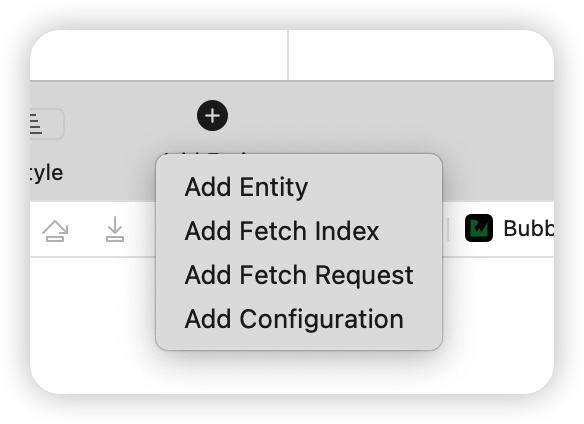

Select Add Fetch Request from the menu. This will create a new fetch request on the left-side bar and take you to a special fetch request editor:


> Note: You can click on the newly created fetch request on the left-hand sidebar to change its name.


You can make your fetch request as general or as specific as you want using the visual tool in Xcode’s data model editor. To start, create a fetch request that retrieves all Venue objects from the persistent store.

You only need to make one change here: click the dropdown menu next to Fetch all and select Venue.

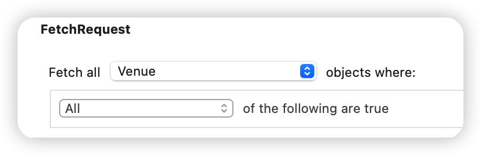

That’s all you need to do. If you wanted to refine your fetch request with an additional predicate, you could also add conditions from the fetch request editor.

Time to take your newly created fetch request out for a spin. Open ViewController.swift and add the following two properties below coreDataStack:

```swift
var fetchRequest: NSFetchRequest<Venue>?
var venues: [Venue] = []
```

The first property will hold your fetch request. The second property is the array of Venue objects you’ll use to populate the table view.

Next, add the following to the end of viewDidLoad():

```swift
guard let model = 
  coreDataStack.managedContext
    .persistentStoreCoordinator?.managedObjectModel,
  let fetchRequest = model
    .fetchRequestTemplate(forName: "FetchRequest")
    as? NSFetchRequest<Venue> else {
      return
}
self.fetchRequest = fetchRequest
fetchAndReload()
```

Doing this connects the fetchRequest property you just set up to the one you created using Xcode’s data model editor. There are three things to remember here:

1. Unlike other ways of getting a fetch request, this one involves the managed object model. This is why you must go through the coreDataStack property to retrieve your fetch request.

2. As you saw in the previous chapter, you constructed CoreDataStack so only the managed context is public. To retrieve the managed object model, you have to go through the managed context’s persistent store coordinator.

3. NSManagedObjectModel’s fetchRequestTemplate(forName:) takes a string identifier. This identifier must exactly match the name you chose for your fetch request in the model editor. Otherwise, your app will throw an exception and crash.

The last line calls a method you haven’t defined yet, so Xcode will complain about it. To fix that, add the following extension above the UITableViewDataSource extension:

```swift
// MARK: - Helper methods
extension ViewController {

  func fetchAndReload() {

    guard let fetchRequest = fetchRequest else {
      return
    }
    
    do {
      venues =
        try coreDataStack.managedContext.fetch(fetchRequest)
      tableView.reloadData()
    } catch let error as NSError {
      print("Could not fetch \(error), \(error.userInfo)")
    }

  }
}
```

As its name suggests, fetchAndReload() executes the fetch request and reloads the table view. Other methods in this class will need to see the fetched objects, so you store the fetched results in the venues property you defined earlier.

There’s one more thing you have to do before you can run the sample project: hook up the table view’s data source with the fetched Venue objects.

In the UITableViewDataSource extension, replace the placeholder implementations of tableView(\_:numberOfRowsInSection:) and tableView(\_:cellForRowAt:) with the following:

```swift
func tableView(_ tableView: UITableView,
               numberOfRowsInSection section: Int) -> Int {
  venues.count
}

func tableView(_ tableView: UITableView,
               cellForRowAt indexPath: IndexPath)
               -> UITableViewCell {

  let cell =
    tableView.dequeueReusableCell(
      withIdentifier: venueCellIdentifier, for: indexPath)

  let venue = venues[indexPath.row]
  cell.textLabel?.text = venue.name
  cell.detailTextLabel?.text = venue.priceInfo?.priceCategory  
  return cell
}
```

You’ve implemented these methods many times in this book, so you’re probably familiar with what they do. The first method, tableView(_:numberOfRowsInSection:), matches the number of cells in the table view with the number of fetched objects in the venues array.

The second method, tableView(_:cellForRowAt:), dequeues a cell for a given index path and populates it with the information of the corresponding Venue in the venues array. In this case, the main label gets the venue’s name and the detail label gets a price category that is one of three possible values: $, $$ or $$$.

Build and run the project, and you’ll see the following:


Scroll down the list of bubble tea venues. These are all real places in New York City that sell the delicious drink.

> Note: When should you store fetch requests in your data model?
>
> If you know you’ll be making the same fetch over and over in different parts of your app, you can use this feature to save you from writing the same code multiple times. A drawback of stored fetch requests is that there is no way to specify a sort order for the results. Therefore, the list of venues you saw may have been in a different order than in the book.


## Fetching different result types

All this time, you’ve probably been thinking of NSFetchRequest as a fairly simple tool. You give it some instructions and you get some objects in return. What else is there to it?

If this is the case, you’ve been underestimating this class. NSFetchRequest is the multi-function Swiss army knife of the Core Data framework!

You can use it to fetch individual values, compute statistics on your data such as the average, minimum, maximum, and more.

How is this possible, you ask? NSFetchRequest has a property named resultType. So far, you’ve only used the default value, .managedObjectResultType. Here are all the possible values for a fetch request’s resultType:

- .managedObjectResultType: Returns managed objects (default value).

- .countResultType: Returns the count of the objects matching the fetch request.

- .dictionaryResultType: This is a catch-all return type for returning the results of different calculations.

- .managedObjectIDResultType: Returns unique identifiers instead of full-fledged managed objects.

Let’s go back to the sample project and apply these concepts in practice.

With the sample project running, tap Filter in the top-right corner to bring up the UI for the filter screen.

You won’t implement the actual filters or sorts right now. Instead, you’ll focus on the following four labels:


The filter screen is divided into three sections: Price, Most Popular and Sort By. That last section is not technically made up of “filters”, but sorting usually goes hand-in-hand with filters, so you’ll leave it like that.

Below each price filter is space for the total number of venues that fall into that price category. Similarly, there’s a spot for the total number of deals across all venues. You’ll implement these next.

### Returning a count

Open FilterViewController.swift and add the following below import UIKit:

```swift
import CoreData
```

Next, add the following property below the last @IBOutlet property:

```swift
// MARK: - Properties
var coreDataStack: CoreDataStack!
```

This will hold a reference to the CoreDataStack object you’ve been using in ViewController.swift.

Next, open ViewController.swift and replace the prepare(for:sender:) implementation with the following:

```swift
override func prepare(for segue: UIStoryboardSegue,
                      sender: Any?) {

  guard segue.identifier == filterViewControllerSegueIdentifier,
    let navController = segue.destination
      as? UINavigationController,
    let filterVC = navController.topViewController
      as? FilterViewController else {
        return
  }

  filterVC.coreDataStack = coreDataStack
}
```

The new line of code propagates the CoreDataStack object from ViewController to FilterViewController. The filter screen is now ready to use Core Data.

Open FilterViewController.swift and add the following lazy property below coreDataStack:

```swift
lazy var cheapVenuePredicate: NSPredicate = {
  return NSPredicate(format: "%K == %@", 
    #keyPath(Venue.priceInfo.priceCategory), "$")
}()
```

You’ll use this lazily-instantiated NSPredicate to calculate the number of venues in the lowest price category.

> Note: NSPredicate supports string-based key paths. This is why you can drill down from the Venue entity into the PriceInfo entity using priceInfo.priceCategory, and use the #keyPath keyword to get safe, compile-time checked values for the key path.

As of this writing, NSPredicate does not support Swift 4 style key paths such as \Venue.priceInfo.priceCategory.


Next, add the following extension below the UITableViewDelegate extension:

```swift
// MARK: - Helper methods
extension FilterViewController {

  func populateCheapVenueCountLabel() {

    let fetchRequest =
      NSFetchRequest<NSNumber>(entityName: "Venue")
    fetchRequest.resultType = .countResultType
    fetchRequest.predicate = cheapVenuePredicate
      
    do {
      let countResult =
        try coreDataStack.managedContext.fetch(fetchRequest)
    
      let count = countResult.first?.intValue ?? 0
      let pluralized = count == 1 ? "place" : "places"
      firstPriceCategoryLabel.text = 
        "\(count) bubble tea \(pluralized)"
    } catch let error as NSError {
      print("count not fetched \(error), \(error.userInfo)")
    }

  }
}
```


This extension provides populateCheapVenueCountLabel() which creates a fetch request to fetch Venue entities. You then set the result type to .countResultType and set the fetch request’s predicate to cheapVenuePredicate. Notice that for this to work correctly, the fetch request's type parameter has to be NSNumber, not Venue.

When you set a fetch result’s result type to .countResultType, the return value becomes a Swift array containing a single NSNumber. The integer inside the NSNumber is the total count you’re looking for.

Once again, you execute the fetch request against CoreDataStack’s NSManagedObjectContext property. Then you extract the integer from the resulting NSNumber and use it to populate firstPriceCategoryLabel.

Before you run the sample app, add the following to the bottom of viewDidLoad():

```swift
populateCheapVenueCountLabel()
```

Now build and run to test if these changes took effect. Tap Filter to bring up the filter/sort menu:


The label under the first price filter now says “27 bubble tea places.” Hooray! You’ve successfully used NSFetchRequest to calculate a count.

> Note: You may be thinking that you could have just as easily fetched the actual Venue objects and gotten the count from the array’s count property. That’s true. Fetching counts instead of objects is mainly a performance optimization. For example, if you had census data for New York City and wanted to know how many people lived in its metropolitan area, would you prefer Core Data gave you the number 8,300,000 (an integer) or an array of 8,300,000 records?

Obviously, getting the count directly is more memory-efficient. There’s a whole chapter devoted to Core Data performance. If you want to learn more about performance optimization in Core Data, check out Chapter 8, “Measuring and Boosting Performance.”

Now that you’re acquainted with the count result type, you can quickly implement the count for the second price category filter. Add the following lazy property below cheapVenuePredicate:

```swift
lazy var moderateVenuePredicate: NSPredicate = {
  return NSPredicate(format: "%K == %@", 
    #keyPath(Venue.priceInfo.priceCategory), "$$")
}()
```

This NSPredicate is almost identical to the cheap venue predicate, except this one matches against $$ instead of $. Similarly, add the following method below populateCheapVenueCountLabel():

```swift
func populateModerateVenueCountLabel() {

  let fetchRequest = 
    NSFetchRequest<NSNumber>(entityName: "Venue")
  fetchRequest.resultType = .countResultType
  fetchRequest.predicate = moderateVenuePredicate

  do {
    

    let countResult = 
      try coreDataStack.managedContext.fetch(fetchRequest)
    
    let count = countResult.first?.intValue ?? 0
    let pluralized = count == 1 ? "place" : "places"
    secondPriceCategoryLabel.text = 
      "\(count) bubble tea \(pluralized)"

  } catch let error as NSError {
    print("count not fetched \(error), \(error.userInfo)")
  }
}
```

Finally, add the following line to the bottom of viewDidLoad() to invoke your newly defined method:

```swift
populateModerateVenueCountLabel()
```

Build and run the sample project. As before, tap Filter on the top right to reach the filter/sort screen:


Great news for bubble tea lovers! Only two places are moderately expensive. Bubble tea as a whole seems to be quite accessible.


### An alternate way to fetch a count

Now that you’re familiar with .countResultType, it’s a good time to mention that there’s an alternate API for fetching a count directly from Core Data.

Since there’s one more price category count to implement, you'll use this alternate API now.

Add the follow lazy property below moderateVenuePredicate:

```swift
lazy var expensiveVenuePredicate: NSPredicate = {
  return NSPredicate(format: "%K == %@", 
    #keyPath(Venue.priceInfo.priceCategory), "$$$")
}()
```

Next, implement the following method below populateModerateVenueCountLabel():

```swift
func populateExpensiveVenueCountLabel() {

  let fetchRequest: NSFetchRequest<Venue> = Venue.fetchRequest()
  fetchRequest.predicate = expensiveVenuePredicate

  do {
    let count =
      try coreDataStack.managedContext.count(for: fetchRequest)
    let pluralized = count == 1 ? "place" : "places"
    thirdPriceCategoryLabel.text = 
      "\(count) bubble tea \(pluralized)"
  } catch let error as NSError {
    print("count not fetched \(error), \(error.userInfo)")
  }
}
```

Like the previous two scenarios, you create a fetch request for retrieving Venue objects.

Next, you set the predicate that you defined as a lazy property earlier: expensiveVenuePredicate.

The difference between this scenario and the last two is that here, you don’t set the result type to .countResultType. Rather than the usual fetch(_:), you use NSManagedObjectContext’s method count(for:) instead.

The return value for count(for:) is an integer that you can use directly to populate the third price category label. Finally, add the following line to the bottom of viewDidLoad() to invoke your newly defined method:

```swift
populateExpensiveVenueCountLabel()
```

Build and run to see if your latest changes took effect.

The filter/sort screen should look like this:


There’s only one bubble tea venue that falls into the $$$ category. Maybe they use real pearls instead of tapioca?


## Performing calculations with fetch requests

All three price category labels are populated with the number of venues that fall into each category. The next step is to populate the label under “Offering a deal.” It currently says “0 total deals.” That can’t be right!

Where exactly does this information come from? Venue has a specialCount attribute that captures the number of deals the venue is currently offering. Unlike the labels under the price category, you now need to know the total sum of deals across all venues since a particularly savvy venue could have many deals at once.

The naïve approach would be to load all venues into memory and sum their deals using a for loop. If you’re hoping for a better way, you’re in luck: Core Data has built-in support for a number of different functions such as average, sum, min and max.

Open FilterViewController.swift, and add the following method below populateExpensiveVenueCountLabel():

```swift
func populateDealsCountLabel() {

  // 1
  let fetchRequest = 
    NSFetchRequest<NSDictionary>(entityName: "Venue")
  fetchRequest.resultType = .dictionaryResultType

  // 2
  let sumExpressionDesc = NSExpressionDescription()
  sumExpressionDesc.name = "sumDeals"

  // 3
  let specialCountExp = 
    NSExpression(forKeyPath: #keyPath(Venue.specialCount))
  sumExpressionDesc.expression = 
    NSExpression(forFunction: "sum:",
                 arguments: [specialCountExp])
  sumExpressionDesc.expressionResultType =
    .integer32AttributeType

  // 4
  fetchRequest.propertiesToFetch = [sumExpressionDesc]

  // 5
  do {

    let results = 
      try coreDataStack.managedContext.fetch(fetchRequest)
    
    let resultDict = results.first
    let numDeals = resultDict?["sumDeals"] as? Int ?? 0
    let pluralized = numDeals == 1 ?  "deal" : "deals"
    numDealsLabel.text = "\(numDeals) \(pluralized)"

  } catch let error as NSError {
    print("count not fetched \(error), \(error.userInfo)")
  }
}
```

This method contains a few classes you’ve not encountered in the book before, so here is each explained in turn:

1. You begin by creating your typical fetch request for retrieving Venue objects. Next, you specify the result type to be .dictionaryResultType.

2. You create an NSExpressionDescription to request the sum, and give it the name sumDeals so you can read its result out of the result dictionary you’ll get back from the fetch request.

3. You give the expression description an NSExpression to specify you want the sum function. Next, give that expression another NSExpression to specify what property you want to sum over — in this case, specialCount. Finally, you have to set the return data type of your expression description, so you set it to integer32AttributeType.

4. You tell your original fetch request to fetch the sum by setting its propertiesToFetch property to the expression description you just created.

5. Finally, execute the fetch request in the usual do-catch statement. The result type is an NSDictionary array, so you retrieve the result of your expression using your expression description’s name (sumDeals) and you’re done!

> Note: What other functions does Core Data support? To name a few: count, min, max, average, median, mode, absolute value and many more. For a comprehensive list, check out Apple’s documentation for NSExpression.

Fetching a calculated value from Core Data requires you to follow many, often unintuitive steps, so make sure you have a good reason for using this technique, such as performance considerations. Finally, add the following line to the bottom of viewDidLoad():

```swift
populateDealsCountLabel()
```

Build the sample project and open the filter/sort screen to verify your changes.


Great! There are 12 deals across all venues stored in Core Data.

You’ve now used three of the four supported NSFetchRequest result types: .managedObjectResultType, .countResultType and .dictionaryResultType.

The remaining result type is .managedObjectIDResultType. When you fetch with this type, the result is an array of NSManagedObjectID objects rather the actual managed objects they represent. An NSManagedObjectID is a compact universal identifier for a managed object. It works like the primary key in the database!

Prior to iOS 5, fetching by ID was popular because NSManagedObjectID was thread-safe and using it helped developers implement the thread confinement concurrency model.

Now that thread confinement has been deprecated in favor of more modern concurrency models, there’s little reason to fetch by object ID anymore.

> Note: You can set up multiple managed object contexts to run concurrent operations and keep long-running operations off the main thread. For more information, check out Chapter 9, “Multiple Managed Object Contexts.”


You’ve gotten a taste of all the things a fetch request can do for you. But just as important as the information a fetch request returns, is the information it doesn’t return. For practical reasons, you have to cap the incoming data at some point.

Why? Imagine a perfectly connected object graph, one where each Core Data object is connected to every other object through a series of relationships. If Core Data didn’t put limits on the information a fetch request returned, you’d be fetching the entire object graph every single time! That’s not memory efficient.

You can manually limit the information you get back from a fetch request. For example, NSFetchRequest supports fetching batches. You can use the properties fetchBatchSize, fetchLimit and fetchOffset to control the batching behavior.

Core Data also tries to minimize its memory consumption for you by using a technique called faulting. A fault is a placeholder object representing a managed object that hasn’t yet been fully brought into memory.

Another way to limit your object graph is to use predicates, as you’ve done to populate the venue count labels above. Let’s add the filters to the sample app using predicates.

Open FilterViewController.swift, and add the following protocol declaration above your class definition:

```swift
protocol FilterViewControllerDelegate: class {
  func filterViewController(
    filter: FilterViewController,
    didSelectPredicate predicate: NSPredicate?,
    sortDescriptor: NSSortDescriptor?)
}
```

This protocol defines a delegate method that will notify the delegate when the user selects a new sort/filter combination.

Next, add the following three properties below coreDataStack:

```swift
weak var delegate: FilterViewControllerDelegate?
var selectedSortDescriptor: NSSortDescriptor?
var selectedPredicate: NSPredicate?
```

This first property will hold a reference to FilterViewController’s delegate. It's a weak property instead of a strongly-retained property in order to avoid retain cycles. The second and third properties will hold references to the currently selected NSSortDescriptor and NSPredicate, respectively.

Next, implement search(\_:) as shown below:

```swift
@IBAction func search(_ sender: UIBarButtonItem) {
  delegate?.filterViewController(
    filter: self,
    didSelectPredicate: selectedPredicate,
    sortDescriptor: selectedSortDescriptor)

  dismiss(animated: true)
}
```

This means every time you tap Search in the top-right corner of the filter/sort screen, you’ll notify the delegate of your selection and dismiss the filter/sort screen to reveal the list of venues behind it.

You need to make one more change in this file. Find tableView(\_:didSelectRowAt:) and implement it as shown below:

```swift
override func tableView(_ tableView: UITableView,
                        didSelectRowAt indexPath: IndexPath) {

  guard let cell = tableView.cellForRow(at: indexPath) else {
    return
  }

  // Price section
  switch cell {
  case cheapVenueCell:
    selectedPredicate = cheapVenuePredicate
  case moderateVenueCell:
    selectedPredicate = moderateVenuePredicate
  case expensiveVenueCell:
    selectedPredicate = expensiveVenuePredicate
  default: break
  }

  cell.accessoryType = .checkmark
}
```

When the user taps on any of the first three price category cells, this method will map the selected cell to the appropriate predicate. You store a reference to this predicate in selectedPredicate so it's ready when you notify the delegate of the user’s selection.

Next, open ViewController.swift and add the following extension to conform to the FilterViewControllerDelegate protocol:

```swift
// MARK: - FilterViewControllerDelegate
extension ViewController: FilterViewControllerDelegate {

  func filterViewController(
    filter: FilterViewController,
    didSelectPredicate predicate: NSPredicate?,
    sortDescriptor: NSSortDescriptor?) {

    guard let fetchRequest = fetchRequest else {
      return
    }
    
    fetchRequest.predicate = nil
    fetchRequest.sortDescriptors = nil
    
    fetchRequest.predicate = predicate
    
    if let sort = sortDescriptor {
      fetchRequest.sortDescriptors = [sort]
    }
    
    fetchAndReload()

  }
}
```

Adding the FilterViewControllerDelegate Swift extension tells the compiler that this class will conform to this protocol. This delegate method fires every time the user selects a new filter/sort combination.

Here, you reset your fetch request’s predicate and sortDescriptors, then set the predicate and sort descriptor passed into the method and reload the data.

There’s one more thing you need to do before you can test your price category filters. Find prepare(for:sender:) and add the following line to the end of the method:

```swift
filterVC.delegate = self
```

This formally sets ViewController as FilterViewController’s delegate.

Build and run the sample project. Go to the Filter screen, tap the first price category cell ($) and then tap Search in the top-right corner.

Your app crashes with the following error message in the console:

```
*** Terminating app due to uncaught exception 'NSInternalInconsistencyException', reason: 'Can't modify a named fetch request in an immutable model.'
```

What happened? Earlier in the chapter, you defined your fetch request in the data model. It turns out if you use that technique, the fetch request becomes immutable. You can’t change its predicate at runtime, or else you'll crash spectacularly. If you want to modify the fetch request in any way, you have to do it in the data model editor in advance.

Open ViewController.swift, and replace viewDidLoad() with the following:

```swift
override func viewDidLoad() {
  super.viewDidLoad()

  importJSONSeedDataIfNeeded()

  fetchRequest = Venue.fetchRequest()
  fetchAndReload()
}
```

You removed the lines that retrieves the fetch request from the template in the managed object model. Instead, you get an instance of NSFetchRequest directly from the Venue entity.

Build and run the sample app one more time. Go to the Filter screen, tap the second price category cell ($$) and then tap Search in the top-right corner.

This is the result:


As expected, there are only two venues in this category. Test the first ($) and third ($$$) price category filters as well, making sure the filtered list contains the correct number of venues for each.

You'll practice writing a few more predicates for the remaining filters. The process is similar to what you’ve done already, so this time you’ll do it with less explanation.

Open FilterViewController.swift and add these three lazy properties below expensiveVenuePredicate:

```swift
lazy var offeringDealPredicate: NSPredicate = {
  return NSPredicate(format: "%K > 0",
    #keyPath(Venue.specialCount))
}()

lazy var walkingDistancePredicate: NSPredicate = {
  return NSPredicate(format: "%K < 500",
    #keyPath(Venue.location.distance))
}()

lazy var hasUserTipsPredicate: NSPredicate = {
  return NSPredicate(format: "%K > 0",
    #keyPath(Venue.stats.tipCount))
}()
```

The first predicate specifies venues currently offering one or more deals, the second predicate specifies venues less than 500 meters away from your current location and the third predicate specifies venues that have at least one user tip.

> Note: So far in the book, you’ve written predicates with a single condition. You should also know that you can write predicates that check two conditions instead of one by using compound predicate operators such as AND, OR and NOT.
>
> Alternatively, you can string two simple predicates into one compound predicate by using the class NSCompoundPredicate.
>
> NSPredicate isn’t technically part of Core Data (it’s part of Foundation) so this book won’t cover it in depth, but you can seriously improve your Core Data chops by learning the ins and outs of this nifty class. For more information, make sure to check out Apple’s Predicate Programming Guide:
>
> https://developer.apple.com/library/archive/documentation/Cocoa/Conceptual/Predicates/Articles/pUsing.html

Next, scroll down to tableView(\_:didSelectRowAt:). You’re going to add three more cases to the switch statement you added earlier:

```swift
override func tableView(_ tableView: UITableView, didSelectRowAt indexPath: IndexPath) {

  guard let cell = tableView.cellForRow(at: indexPath) else {
    return
  }

  switch cell {
  // Price section
  case cheapVenueCell:
    selectedPredicate = cheapVenuePredicate
  case moderateVenueCell:
    selectedPredicate = moderateVenuePredicate
  case expensiveVenueCell:
    selectedPredicate = expensiveVenuePredicate
    
  // Most Popular section
  case offeringDealCell:
    selectedPredicate = offeringDealPredicate
  case walkingDistanceCell:
    selectedPredicate = walkingDistancePredicate
  case userTipsCell:
    selectedPredicate = hasUserTipsPredicate
  default: break
  }

  cell.accessoryType = .checkmark
}
```

Above, you added cases for offeringDealCell, walkingDistanceCell and userTipsCell. These are the three new filters for which you’re now adding support.

That’s all you need to do. Build and run the sample app. Go to the Filters page, select the Offering a deal filter and tap Search:


You’ll see a total of six venues. Note that since you didn’t specify a sort descriptor, your list of venues may be in a different order than the venues in the screenshot. You can verify these venues have specials by looking them up in seed.json. For example, City Wing Cafe is currently offering four specials. Woo-hoo!


## Sorting fetched results

Another powerful feature of NSFetchRequest is its ability to sort fetched results for you. It does this by using yet another handy Foundation class, NSSortDescriptor. These sorts happen at the SQLite level, not in memory. This makes sorting in Core Data fast and efficient.

In this section, you’ll implement four different sorts to complete the filter/sort screen.

Open FilterViewController.swift and add the following three lazy properties below hasUserTipsPredicate:

```swift
lazy var nameSortDescriptor: NSSortDescriptor = {
  let compareSelector =
    #selector(NSString.localizedStandardCompare(_:))
  return NSSortDescriptor(key: #keyPath(Venue.name),
                          ascending: true,
                          selector: compareSelector)
}()

lazy var distanceSortDescriptor: NSSortDescriptor = {
  return NSSortDescriptor(
    key: #keyPath(Venue.location.distance),
    ascending: true)
}()

lazy var priceSortDescriptor: NSSortDescriptor = {
  return NSSortDescriptor(
    key: #keyPath(Venue.priceInfo.priceCategory),
    ascending: true)
}()
```

The way to add sort descriptors is very similar to the way you added filters. Each sort descriptor maps to one of these three lazy NSSortDescriptor properties.

To initialize an instance of NSSortDescriptor you need three things: a key path to specify the attribute which you want to sort, a specification of whether the sort is ascending or descending and an optional selector to perform the comparison operation.

> Note: If you’ve worked with NSSortDescriptor before, then you probably know there’s a block-based API that takes a comparator instead of a selector. Unfortunately, Core Data doesn’t support this method of defining a sort descriptor.
>
> The same thing goes for the block-based method of defining a NSPredicate. Core Data doesn’t support this either. The reason is filtering and sorting happens in the SQLite database, so the predicate/sort descriptor has to match nicely to something that can be written as an SQL statement.

The three sort descriptors are going to sort by name, distance and price category, respectively, in ascending order. Before moving on, take a closer look at the first sort descriptor, nameSortDescriptor. The initializer takes in an optional selector, NSString.localizedStandardCompare(_:). What is that?

Any time you’re sorting user-facing strings, Apple recommends that you pass in NSString.localizedStandardCompare(_:) to sort according to the language rules of the current locale. This means sort will “just work” and do the right thing for languages with special characters. It’s the little things that matter, bien sûr!

Next, find tableView(_:didSelectRowAt:) and add the following cases to the end of the switch statement above the default case:

```swift
// Sort By section
case nameAZSortCell:
  selectedSortDescriptor = nameSortDescriptor
case nameZASortCell:
  selectedSortDescriptor =
    nameSortDescriptor.reversedSortDescriptor
    as? NSSortDescriptor
case distanceSortCell:
  selectedSortDescriptor = distanceSortDescriptor
case priceSortCell:
  selectedSortDescriptor = priceSortDescriptor
```

Like before, this switch statement matches the user tapped cell with the appropriate sort descriptor, so it’s ready to pass to the delegate when the user taps Search.

The only wrinkle is the nameZA sort descriptor. Rather than creating a separate sort descriptor, you can reuse the one for A-Z and simply call the method reversedSortDescriptor. How handy!

Everything else is hooked up for you to test the sorts you just implemented. Build and run the sample app and go to the Filter screen. Tap the Name (Z-A) sort and then tap Search. You’ll see search results ordered like so:


No, you’re not seeing double. There really are seven Vivi Bubble Tea venues in the data set — it’s a popular bubble tea chain in New York City.

As you scroll down the table view, you’ll see the app has indeed sorted the venues alphabetically from Z to A.

You’ve now completed your Filter screen, setting it up so the user can combine any one filter with any one sort. Try different combinations to see what you get. The venue cell doesn’t show much information, so if you need to verify a sort, you can go straight to the source and consult seed.json.


## Asynchronous fetching

If you’ve reached this point, there’s both good news and bad news (and then more good news). The good news is you’ve learned a lot about what you can do with a plain NSFetchRequest. The bad news is that every fetch request you’ve executed so far has blocked the main thread while you waited for the results to come back.

When you block the main thread, it makes the screen unresponsive to incoming touches and creates a slew of other problems. You haven’t felt this blocking of the main thread because you’ve made simple fetch requests fetching a few objects at a time.

Since the beginning of Core Data, the framework has given developers several techniques to perform fetches in the background. As of iOS 8, Core Data has an API for performing long-running fetch requests in the background and getting a completion callback when the fetch completes.

Let’s see this new API in action. Open ViewController.swift and add the following property below venues:

```swift
var asyncFetchRequest: NSAsynchronousFetchRequest<Venue>?
```

There you have it. The class responsible for this asynchronous magic is aptly called NSAsynchronousFetchRequest. Don’t be fooled by its name, though. It's not directly related to NSFetchRequest; it’s actually a subclass of NSPersistentStoreRequest.

Next, replace the contents of viewDidLoad() with the following:

```swift
override func viewDidLoad() {
  super.viewDidLoad()

  importJSONSeedDataIfNeeded()

  // 1
  let venueFetchRequest: NSFetchRequest<Venue> = 
    Venue.fetchRequest()
  fetchRequest = venueFetchRequest

  // 2
  asyncFetchRequest =
    NSAsynchronousFetchRequest<Venue>(
    fetchRequest: venueFetchRequest) {
      [unowned self] (result: NSAsynchronousFetchResult) in

      guard let venues = result.finalResult else {
        return
      }
    
      self.venues = venues
      self.tableView.reloadData()

  }

  // 3
  do {
    guard let asyncFetchRequest = asyncFetchRequest else {
      return
    }
    try coreDataStack.managedContext.execute(asyncFetchRequest)
    // Returns immediately, cancel here if you want
  } catch let error as NSError {
    print("Could not fetch \(error), \(error.userInfo)")
  }
}
```

There’s a lot you haven’t seen before, so let’s cover it step by step:

1. Notice here that an asynchronous fetch request doesn’t replace the regular fetch request. Rather, you can think of an asynchronous fetch request as a wrapper around the fetch request you already had.

2. To create an NSAsynchronousFetchRequest you need two things: a plain old NSFetchRequest and a completion handler. Your fetched venues are contained in NSAsynchronousFetchResult’s finalResult property. Within the completion handler, you update the venues property and reload the table view.

3. Specifying the completion handler is not enough! You still have to execute the asynchronous fetch request. Once again, CoreDataStack’s managedContext property handles the heavy lifting for you. However, notice the method you use is different — this time, it’s execute(\_:) instead of the usual fetch(\_:).

execute(\_:) returns immediately. You don’t need to do anything with the return value since you’re going to update the table view from within the completion block. The return type is NSAsynchronousFetchResult.

> Note: As an added bonus to this API, you can cancel the fetch request with NSAsynchronousFetchResult’s cancel() method.


Time to see if your asynchronous fetch delivers as promised. If everything goes well, you shouldn’t notice any difference in the user interface.

Build and run the sample app, and you should see the list of venues as before:


Hooray! You’ve mastered asynchronous fetching. The filters and sorts will also work, except they still use a plain NSFetchRequest to reload the table view.


## Batch updates: no fetching required

Sometimes the only reason you fetch objects from Core Data is to change a single attribute. Then, after you make your changes, you have to commit the Core Data objects back to the persistent store and call it a day. This is the normal process you’ve been following all along.

But what if you want to update a hundred thousand records all at once? It would take a lot of time and a lot of memory to fetch all of those objects just to update one attribute. No amount of tweaking your fetch request would save your user from having to stare at a spinner for a long, long time.

Luckily, as of iOS 8 there has been new way to update Core Data objects without having to fetch anything into memory: batch updates. This new technique greatly reduces the amount of time and memory required to make those huge kinds of updates.

The new technique bypasses the NSManagedObjectContext and goes straight to the persistent store. The classic use case for batch updates is the “Mark all as read” feature in a messaging application or e-mail client. For this sample app, you’re going to do something more fun. Since you love bubble tea so much, you’re going to mark every Venue in Core Data as your favorite.

Let’s see this in practice. Open ViewController.swift and add the following to viewDidLoad() below the importJSONSeedDataIfNeeded() call:

```swift
let batchUpdate = NSBatchUpdateRequest(entityName: "Venue")
batchUpdate.propertiesToUpdate = 
  [#keyPath(Venue.favorite): true]

batchUpdate.affectedStores = 
  coreDataStack.managedContext
    .persistentStoreCoordinator?.persistentStores

batchUpdate.resultType = .updatedObjectsCountResultType

do {
  let batchResult = 
    try coreDataStack.managedContext.execute(batchUpdate)
      as? NSBatchUpdateResult
  print("Records updated \(String(describing: batchResult?.result))")
} catch let error as NSError {
  print("Could not update \(error), \(error.userInfo)")
}
```

You create an instance of NSBatchUpdateRequest with the entity you want to update, Venue in this case.

Next, you set up your batch update request by setting propertiesToUpdate to a dictionary that contains the key path of the attribute you want to update, favorite, and its new value, true. Then you set affectedStores to your persistent store coordinator’s persistentStores array.

Finally, you the result type to return a count and execute your batch update request.

Build and run your sample app. If everything works properly, you’ll see the following printed to your console log:

```
Records updated Optional(30)
```

Great! You’ve surreptitiously marked every bubble tea venue in New York City as your favorite.

Now you know how to update your Core Data objects without loading them into memory. Is there another use case where you may want to bypass the managed context and change your Core Data objects directly in the persistent store?

Of course there is — batch deletion!

You shouldn’t have to to load objects into memory just to delete them, particularly if you’re handling a large number of them. As of iOS 9, you’ve had NSBatchDeleteRequest for this purpose.

As the name suggests, a batch delete request can efficiently delete a large number Core Data objects in one go.

Like NSBatchUpdateRequest, NSBatchDeleteRequest is also a subclass of NSPersistentStoreRequest. Both types of batch request behave similarly since they both operate directly on the persistent store.

> **Note**: Since you’re sidestepping your NSManagedObjectContext, you won’t get any validation if you use a batch update request or a batch delete request. Your changes also won’t be reflected in your managed context.
>
> Make sure you’re sanitizing and validating your data properly before using a persistent store request!


## Key points

- NSFetchRequest is a **generic type**. It takes a type parameter that specifies the type of objects you expect to get as the result of the fetch request.
- If you expect to reuse the same type of fetch in different parts of your app, consider using the **Data Model Editor** to store an **immutable** fetch request directly in your data model.
- Use NSFetchRequest’s **count** result type to efficiently compute and return counts from SQLite.
- Use NSFetchRequest’s **dictionary** result type to efficiently compute and return averages, sums and other common calculations from SQLite.
- A fetch request uses different techniques such as using **batch sizes**, **batch limits** and **faulting** to limit the amount of information returned.
- Add a **sort description** to your fetch request to efficiently sort your fetched results.
- Fetching large amounts of information can block the main thread. Use NSAsynchronousFetchRequest to offload some of this work to a background thread.
- NSBatchUpdateRequest and NSBatchDeleteRequest reduce the amount of time and memory required to update or delete a large number of records in Core Data.


# Chapter 5: NSFetchedResultsController

If you followed the previous chapters closely, you probably noticed that most of the sample projects use table views. That’s because Core Data fits nicely with table views. Set up your fetch request, fetch an array of managed objects and plug the result into the table view’s data source. This is a common, everyday scenario.

If you see a tight relationship between Core Data and UITableView, you’re in good company. The authors of the Core Data framework at Apple thought the same way! In fact, they saw so much potential for a close connection between UITableView and Core Data they penned a class to formalize this bond: NSFetchedResultsController.

As the name suggests, NSFetchedResultsController is a controller, but it’s not a view controller. It has no user interface. Its purpose is to make developers’ lives easier by abstracting away much of the code needed to synchronize a table view with a data source backed by Core Data.

Set up an NSFetchedResultsController correctly, and your table will “magically” mimic its data source without you have to write more than a few lines of code. In this chapter, you’ll learn the ins and outs of this class. You’ll also learn when to use it and when not to use it. Are you ready?


## Introducing the World Cup app

This chapter’s sample project is a World Cup scoreboard app for iOS. On startup, the one-page application will list all the teams contesting for the World Cup. Tapping on a country’s cell will increase the country’s wins by one. In this simplified version of the World Cup, the country with the most taps wins the tournament. This ranking simplifies the real elimination rules quite a bit, but it’s good enough for demonstration purposes.

Go to this chapter’s files and find the starter folder. Open WorldCup.xcodeproj. Build and run the starter project:


The sample application consists of 20 static cells in a table view. Those bright blue boxes are where the teams’ flags should be. Instead of real names, you see “Team Name.“ Although the sample project isn’t too exciting, it actually does a lot of the setup for you.

Open the project navigator and take a look at the full list of files in the starter project:


Before jumping into the code, let’s briefly go over what each class does for you out of the box. You’ll find a lot of the setup you did manually in previous chapters comes already implemented for you. Hooray!

- CoreDataStack: As in previous chapters, this object wraps an instance of NSPersistentContainer, which in turn contains the cadre of Core Data objects known as the “stack”; the context, the model, the persistent store and the persistent store coordinator. No need to set this up. It comes ready-to-use.

- ViewController: The sample project is a one-page application, and this file represents that one page. On first launch, the view controller reads from seed.json, creates corresponding Core Data objects and saves them to the persistent store. If you’re curious about its UI elements, head over to Main.storyboard. There’s a table, a navigation bar and a single prototype cell.

- Team+CoreDataClass & Team+CoreDataProperties: These files represent a country’s team. It’s an NSManagedObject subclass with properties for each of its four attributes: teamName, qualifyingZone, imageName and wins. If you’re curious about its entity definition, head over to WorldCup.xcdatamodel.

- Assets.xcassets: The sample project’s asset catalog contains a flag image for every country in seed.json.

The first three chapters of this book covered the Core Data concepts mentioned above. If “managed object subclass” doesn’t ring a bell or if you’re unsure what a Core Data stack is supposed to do, you may want to go back and reread the relevant chapters. NSFetchedResultsController will be here when you return.

Otherwise, if you’re ready to proceed, you’ll begin implementing the World Cup application. You probably already know who won the World Cup last time, but this is your chance to rewrite history for the country of your choice, with just a few taps!


## It all begins with a fetch request...

At its core, NSFetchedResultsController is a wrapper around the results of a NSFetchRequest. Right now, the sample project contains static information. You’re going to create a fetched results controller to display the list of teams from Core Data in the table view.

Open ViewController.swift and add a lazy property to hold your fetched results controller below coreDataStack:

```swift
lazy var fetchedResultsController:
  NSFetchedResultsController<Team> = {
  // 1
  let fetchRequest: NSFetchRequest<Team> = Team.fetchRequest()

  // 2
  let fetchedResultsController = NSFetchedResultsController(
    fetchRequest: fetchRequest,
    managedObjectContext: coreDataStack.managedContext,
    sectionNameKeyPath: nil,
    cacheName: nil)

  return fetchedResultsController
}()
```

Like NSFetchRequest, NSFetchedResultsController requires a generic type parameter, Team in this case, to specify the type of entity you expect to be working with. Let’s go step-by-step through the process:

1. The fetched results controller handles the coordination between Core Data and your table view, but it still needs you to provide an NSFetchRequest. Remember the NSFetchRequest class is highly customizable. It can take sort descriptors, predicates, etc.

   In this example, you get your NSFetchRequest directly from the Team class because you want to fetch all Team objects.

2. The initializer method for a fetched results controller takes four parameters: first up, the fetch request you just created.

   The second parameter is an instance of NSManagedObjectContext. Like NSFetchRequest, the fetched results controller class needs a managed object context to execute the fetch. It can’t actually fetch anything by itself.

The other two parameters are optional: sectionNameKeyPath and cacheName. Leave them blank for now; you’ll read more about them later in the chapter.

Next, add the following code to the end of viewDidLoad() to actually do the fetching:

```swift
do {
  try fetchedResultsController.performFetch()
} catch let error as NSError {
  print("Fetching error: \(error), \(error.userInfo)")
}
```


Here you execute the fetch request. If there’s an error, you log the error to the console.

But wait a minute... where are your fetched results? While fetching with NSFetchRequest returns an array of results, fetching with NSFetchedResultsController doesn’t return anything.

NSFetchedResultsController is both a wrapper around a fetch request and a container for its fetched results. You can get them either with the fetchedObjects property or the object(at:) method.

Next, you’ll connect the fetched results controller to the usual table view data source methods. The fetched results determine both the number of sections and the number of rows per section.

With this in mind, reimplement numberOfSections(in:) and tableView(_:numberOfRowsInSection:), as shown below:

```swift
func numberOfSections(in tableView: UITableView) -> Int {
  fetchedResultsController.sections?.count ?? 0
}

func tableView(_ tableView: UITableView,
               numberOfRowsInSection section: Int)
               -> Int {
  guard let sectionInfo = 
    fetchedResultsController.sections?[section] else {
      return 0
  }

  return sectionInfo.numberOfObjects
}
```

The number of sections in the table view corresponds to the number of sections in the fetched results controller. You may be wondering how this table view can have more than one section. Aren’t you simply fetching and displaying all teams?

That’s correct. You will only have one section this time around, but keep in mind that NSFetchedResultsController can split up your data into sections. You’ll see an example of this later in the chapter.

Furthermore, the number of rows in each table view section corresponds to the number of objects in each fetched results controller section. You can query information about a fetched results controller section through its sections property.

> Note: The sections array contains opaque objects that implement the NSFetchedResultsSectionInfo protocol. This lightweight protocol provides information about a section, such as its title and number of objects.


Implementing tableView(_:cellForRowAt:) would typically be the next step.

A quick look at the method, however, reveals it’s already vending TeamCell cells as necessary. What you need to change is the helper method that populates the cell.

Find configure(cell:for:) and replace it with the following:

```swift
func configure(cell: UITableViewCell,
               for indexPath: IndexPath) {
  guard let cell = cell as? TeamCell else {
      return
  }

  let team = fetchedResultsController.object(at: indexPath)
  cell.teamLabel.text = team.teamName
  cell.scoreLabel.text = "Wins: \(team.wins)"

  if let imageName = team.imageName {
    cell.flagImageView.image = UIImage(named: imageName)
  } else {
    cell.flagImageView.image = nil
  }
}
```

This method takes in a table view cell and an index path. You use this index path to grab the corresponding Team object from the fetched results controller.

Next, you use the Team object to populate the cell’s flag image, team name and score label.

Notice again there’s no array variable holding your teams. They’re all stored inside the fetched results controller and you access them via object(at:).

It’s time to test your creation. Build and run the app. Ready, set and... crash?

```
Terminating app due to uncaught exception 'NSInvalidArgumentException', reason: 'An instance of NSFetchedResultsController requires a fetch request with sort descriptors'
```

What happened? NSFetchedResultsController is helping you out here, though it may not feel like it!

If you want to use it to populate a table view and have it know which managed object should appear at which index path, you can’t just throw it a basic fetch request.

Its minimum requirement is you set an entity description, and it will fetch all objects of that entity type. NSFetchedResultsController, however, requires at least one sort descriptor. Otherwise, how would it know the right order for your table view?

Go back to the fetchedResultsController lazy property and add the following lines after let fetchRequest: 

```swift
let sort = NSSortDescriptor(
  key: #keyPath(Team.teamName),
  ascending: true)
fetchRequest.sortDescriptors = [sort]
```

Adding this sort descriptor will show the teams in alphabetical order from A to Z and fix the earlier crash. Build and run the application.


Success! The full list of World Cup participants is on your device or iOS Simulator. Notice, however, that every country has zero wins and there’s no way to increment the score. Some people say soccer is a low-scoring sport, but this is absurd!


### Modifying data

Let’s fix everyone’s zero score and add some code to increment the number of wins. Still in ViewController.swift, replace the currently empty implementation of the table view delegate method tableView(\_:didSelectRowAt:) with the following:

```swift
func tableView(_ tableView: UITableView,
               didSelectRowAt indexPath: IndexPath) {

  let team = fetchedResultsController.object(at: indexPath)
  team.wins += 1
  coreDataStack.saveContext()
}
```

When the user taps a row, you grab the Team corresponding to the selected index path, increment its number of wins and commit the change to Core Data’s persistent store.

You might think a fetched results controller is only good for fetching results from Core Data, but the Team objects you get back are the same old managed object subclasses. You can update their values and save just as you’ve always done.

Build and run once again, and tap on the first country on the list (Algeria) some times:

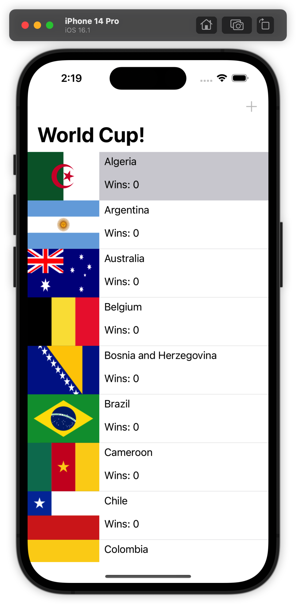

What’s going on here? You’re tapping away, but the number of wins isn’t going up. You’re updating Algeria’s number of wins in Core Data’s underlying persistent store, but you aren’t triggering a UI refresh. Go back to Xcode, stop the app, and build and run again.


Just as you suspected, re-launching the app from scratch forced a UI refresh, showing Algeria’s real score of 6. NSFetchedResultsController has a nice solution to this problem, but for now, let’s use the brute force solution.

Add the follow line to the end of tableView(_:didSelectRowAt:):

```swift
tableView.reloadData()
```

In addition to incrementing a team’s number of wins, tapping a cell now reloads the entire table view. This approach is heavy-handed, but it does the job for now. Build and run the app one more time.

Tap as many countries as you want, as many times as you want. Verify that the UI is always up to date.


There you go. You’ve got a fetched results controller up and running. Excited?

If this were all NSFetchedResultsController could do, you would probably feel a little disappointed. After all, you can accomplish the same thing using an NSFetchRequest and a simple array.

The real magic comes in the remaining sections of this chapter. NSFetchedResultsController earns its keep in the Cocoa Touch frameworks with features such as section handling and change monitoring, which you’ll cover next.


## Grouping results into sections

There are six qualifying zones in the World Cup: Africa, Asia, Oceania, Europe, South America and North/Central America. The Team entity has a string attribute named qualifyingZone storing this information.

In this section, you’ll split up the list of countries into their respective qualifying zones. NSFetchedResultsController makes this very simple.

Let’s see it in action. Go back to the lazy property that instantiates your NSFetchedResultsController and make the following change to the fetched results controller’s initializer:

```swift
let fetchedResultsController = NSFetchedResultsController(
  fetchRequest: fetchRequest,
  managedObjectContext: coreDataStack.managedContext,
  sectionNameKeyPath: #keyPath(Team.qualifyingZone),
  cacheName: nil)
```

The difference here is you’re passing in a value for the optional sectionNameKeyPath parameter. You can use this parameter to specify an attribute the fetched results controller should use to group the results and generate sections.

How exactly are these sections generated? Each unique attribute value becomes a section. NSFetchedResultsController then groups its fetched results into these sections. In this case, it will generate sections for each unique value of qualifyingZone such as “Africa”, “Asia”, “Oceania“ and so on. This is exactly what you want!

> Note: sectionNameKeyPath takes a keyPath string. It can take the form of an attribute name such as qualifyingZone or teamName, or it can drill deep into a Core Data relationship, such as employee.address.street. Use the #keyPath syntax to defend against typos and stringly typed code.

The fetched results controller will now report the sections and rows to the table view, but the current UI won’t look any different. To fix this problem, add the following method to the UITableViewDataSource extension:

```swift
func tableView(_ tableView: UITableView,
               titleForHeaderInSection section: Int)
               -> String? {
  let sectionInfo = fetchedResultsController.sections?[section]
  return sectionInfo?.name
}
```

Implementing this data source method adds section headers to the table view, making it easy to see where one section ends and another one begins. In this case, the section gets its title from the qualifying zone. Like before, this information comes directly from the NSFetchedResultsSectionInfo protocol.

Build and run the application. Your app will look something like the following:


Scroll down the page. There’s good news and bad news. The good news is the app accounts for all six sections. Hooray! The bad news is the world is upside down.

Take a closer look at the sections. You’ll see Argentina in Africa, Cameroon in Asia and Russia in South America. How did this happen? It’s not a problem with the data; you can open seed.json and verify each team lists the correct qualifying zone.

Have you figured it out? The list of countries is still shown alphabetically and the fetched results controller is simply splitting up the table into sections as if all teams of the same qualifying zone were grouped together.

Go back to your lazily-instantiated NSFetchedResultsController property and make the following change to fix the problem.

Replace the existing code that creates and sets the sort descriptor on the fetch request with the following:

```swift
let zoneSort = NSSortDescriptor(
  key: #keyPath(Team.qualifyingZone), 
  ascending: true)
let scoreSort = NSSortDescriptor(
  key: #keyPath(Team.wins), 
  ascending: false)
let nameSort = NSSortDescriptor(
  key: #keyPath(Team.teamName), 
  ascending: true)

fetchRequest.sortDescriptors = [zoneSort, scoreSort, nameSort]
```

The problem was the sort descriptor. This is another NSFetchedResultsController “gotcha” to keep in mind. If you want to separate fetched results using a section keyPath, the first sort descriptor’s attribute must match the key path’s attribute.

The documentation for NSFetchedResultsController makes this point emphatically, and with good reason! You saw what happened when the sort descriptor doesn’t match the key path — there’s no sense to your data.

Build and run one more time to verify this change fixed the problem:

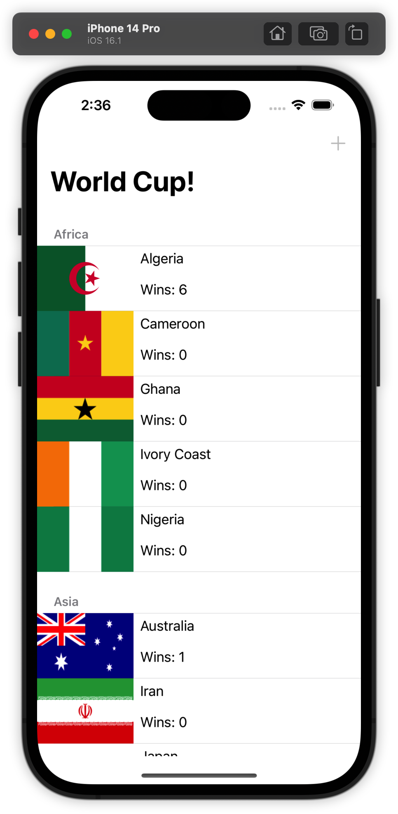

Indeed it did. Changing the sort descriptor restored the geopolitical balance in your sample application. African teams are in Africa, European teams are in Europe and so on.

> Note: The only team that may still raise eyebrows is Australia, which appears under Asia’s qualifying zone. This is how FIFA categorizes Australia. If you don’t like it, you can file a bug report with them!

Notice that within each qualifying zone, teams are sorted by number of wins from highest to lowest, then by name. This is because in the previous code snippet, you added three sort descriptors: first sort by qualifying zone, then by number of wins, then finally by name.

Before moving on, take a moment to think of what you would have needed to do to separate the teams by qualifying zone without the fetched results controller. First, you would have had to create a dictionary and iterate over the teams to find unique qualifying zones.

As you traversed the array of teams, you would have had to associate each team with the correct qualifying zone. Once you had the list of teams by zone, you’d then would have had to sort the data.

Of course it’s not impossible to do this yourself, but it’s tedious. This is what NSFetchedResultsController saved you from doing. You can take the rest of the day off and go to the beach or watch some old World Cup matches. Thank you, NSFetchedResultsController!


## "Cache" the ball

As you can probably imagine, grouping teams into sections is not a cheap operation. There’s no way to avoid iterating over every team.

It’s not a performance problem in this case, because there are only 32 teams to consider. But imagine what would happen if your data set were much larger. What if your task were to iterate over 3 million census records and separate them by state or province?

“I’d just throw that on a background thread!” might be your first thought. The table view, however, can’t populate itself until all sections are available. You might save yourself from blocking the main thread, but you’d still be left looking at a spinner. There’s no denying that this operation is expensive. At a bare minimum, you should only pay the cost once: figure out the section grouping a single time, and reuse your result every time after that.

The authors of NSFetchedResultsController thought about this problem and came up with a solution: caching. You don’t have to do much to turn it on.

Head back to your lazily instantiated NSFetchedResultsController and make the following modification to the fetched results controller initialization, adding a value to the cacheName parameter:

```swift
let fetchedResultsController = NSFetchedResultsController(
  fetchRequest: fetchRequest,
  managedObjectContext: coreDataStack.managedContext,
  sectionNameKeyPath: #keyPath(Team.qualifyingZone),
  cacheName: "worldCup")
```

You specify a cache name to turn on NSFetchedResultsController’s on-disk section cache. That’s all you need to do! Keep in mind that this section cache is completely separate from Core Data’s persistent store, where you persist the teams.

> Note: NSFetchedResultsController’s section cache is very sensitive to changes in its fetch request. As you can imagine, any changes — such as a different entity description or different sort descriptors — would give you a completely different set of fetched objects, invalidating the cache completely. If you make changes like this, you must delete the existing cache using deleteCache(withName:) or use a different cache name.


Build and run the application a few times. The second launch should be a little bit faster than the first. This is not the author’s power of suggestion (psst, say “fast” five times in a row); it’s NSFetchedResultsController’s cache system at work!

On the second launch, NSFetchedResultsController reads directly from your cache. This saves a round trip to Core Data’s persistent store, as well as the time needed to compute those sections. Hooray!

You’ll learn about measuring performance and seeing if your code changes really did make things faster in Chapter 8, “Measuring and Boosting Performance”.

In your own apps, consider using NSFetchedResultsController’s cache if you’re grouping results into sections and either have a very large data set or are targeting older devices.


## Monitoring changes

This chapter has already covered two of the three main benefits of using NSFetchedResultsController: sections and caching. The third and last benefit is somewhat of a double-edged sword: it’s powerful but also easy to misuse.

Earlier in the chapter, when you implemented the tap to increment the number of wins, you added a line of code to reload the table view to show the updated score. This was a brute force solution, but it worked.

Sure, you could have reloaded only the selected cell by being smart about the UITableView API, but that wouldn’t have solved the root problem.

Not to get too philosophical, but the root problem is change. Something changed in the underlying data and you had to be explicit about reloading the user interface.

Imagine what a second version of the World Cup app would look like. Maybe there’s a detail screen for every team where you can change the score.

Maybe the app calls an API endpoint and gets new score information from the web service. It would be your job to refresh the table view for every code path that updates the underlying data.

Doing it explicitly is error-prone, not to mention a little boring. Isn’t there a better way? Yes, there is. Once again, fetched results controller comes to the rescue.

NSFetchedResultsController can listen for changes in its result set and notify its delegate, NSFetchedResultsControllerDelegate. You can use this delegate to refresh the table view as needed any time the underlying data changes.

What does it mean a fetched results controller can monitor changes in its “result set”? It means it can monitor changes in all objects, old and new, it would have fetched, in addition to objects it has already fetched. This distinction will become clearer later in this section.

Let’s see this in practice. Still in ViewController.swift, add the following extension to the bottom of the file:

```swift
// MARK: - NSFetchedResultsControllerDelegate
extension ViewController: NSFetchedResultsControllerDelegate {

}
```

This simply tells the compiler the ViewController class will implement some of the fetched results controller’s delegate methods.

Next, go back to your lazy NSFetchedResultsController property and set the view controller as the fetched results controller’s delegate before returning. Add the following line of code after you initialize the fetched results controller:

```swift
fetchedResultsController.delegate = self
```

That’s all you need to start monitoring changes! Of course, the next step is to do something when those change reports come in. You’ll do that next.

> Note: A fetched results controller can only monitor changes made via the managed object context specified in its initializer. If you create a separate NSManagedObjectContext somewhere else in your app and start making changes there, your delegate method won’t run until those changes have been saved and merged with the fetched results controller’s context.


## Responding to changes

First, remove the reloadData() call from tableView(_:didSelectRowAt:). As mentioned before, this was the brute force approach that you’re now going to replace.

NSFetchedResultsControllerDelegate has four methods that come in varying degrees of granularity. To start out, implement the broadest delegate method, the one that says: “Hey, something just changed!”

Add the following method inside the NSFetchedResultsControllerDelegate extension:

```swift
func controllerDidChangeContent(_ controller: 
  NSFetchedResultsController<NSFetchRequestResult>) {
    tableView.reloadData()
}
```

The change may seem small, but implementing this method means that any change whatsoever, no matter the source, will refresh the table view. Build and run the application. Verify that the table view’s cells still update correctly by tapping on a few cells:


The score labels update as before, but there’s something else happening. When one country has more points than another country in the same qualifying zone, that country will “jump” up a level. This is the fetched results controller noticing a change in the sort order of its fetched results and readjusting the table view’s data source accordingly.

When the cells do move around, it’s pretty jumpy... almost as if you were completely reloading the table every time something changed.

Next, you’ll go from reloading the entire table to refreshing only what needs to change. The fetched results controller delegate can tell you if a specific index path needs to be moved, inserted or deleted due to a change in the fetched results controller’s result set.

Replace the contents of the NSFetchedResultsControllerDelegate extension, with the following three delegate methods to see this in action:

```swift
func controllerWillChangeContent(_ controller:
  NSFetchedResultsController<NSFetchRequestResult>) {
    tableView.beginUpdates()
}

func controller(_ controller:
  NSFetchedResultsController<NSFetchRequestResult>,
  didChange anObject: Any,
  at indexPath: IndexPath?,
  for type: NSFetchedResultsChangeType,
  newIndexPath: IndexPath?) {

  switch type {
  case .insert:
    tableView.insertRows(at: [newIndexPath!], with: .automatic)
  case .delete:
    tableView.deleteRows(at: [indexPath!], with: .automatic)
  case .update:
    let cell = tableView.cellForRow(at: indexPath!) as! TeamCell
    configure(cell: cell, for: indexPath!)
  case .move:
    tableView.deleteRows(at: [indexPath!], with: .automatic)
    tableView.insertRows(at: [newIndexPath!], with: .automatic)
  @unknown default:
    print("Unexpected NSFetchedResultsChangeType")
  }
}

func controllerDidChangeContent(_ controller:
  NSFetchedResultsController<NSFetchRequestResult>) {
    tableView.endUpdates()
}
```

Whew! That’s a wall of code. Fortunately, it’s mostly boilerplate and easy to understand. Let’s briefly go over all three methods you just added or modified.

- controllerWillChangeContent(_:): This delegate method notifies you that changes are about to occur. You ready your table view using beginUpdates().

- controller(_:didChange:at:for:newIndexPath:): This method is quite a mouthful. And with good reason — it tells you exactly which objects changed, what type of change occurred (insertion, deletion, update or reordering) and what the affected index paths are.

  This middle method is the proverbial glue that synchronizes your table view with Core Data. No matter how much the underlying data changes, your table view will stay true to what’s going on in the persistent store.

- controllerDidChangeContent(_:): The delegate method you had originally implemented to refresh the UI turned out to be the third of three delegate methods that notify you of changes. Rather than refreshing the entire table view, you just need to call endUpdates() to apply the changes.

> Note: What you end up doing with the change notifications depends on your individual app. The implementation you see above is an example Apple provided in the NSFetchedResultsControllerDelegate documentation.


Note the order and nature of the methods ties in very neatly to the “begin updates, make changes, end updates” pattern used to update table views. This is not a coincidence!

Build and run to see your work in action. Right off the bat, each qualifying zone lists teams by the number of wins. Tap on different countries a few times. You’ll see the cells animate smoothly to maintain this order.

There is one more NSFetchedResultsControllerDelegate method to explore in this section. Add it to the extension:

```swift
func controller(_ controller: 
  NSFetchedResultsController<NSFetchRequestResult>,
  didChange sectionInfo: NSFetchedResultsSectionInfo,
  atSectionIndex sectionIndex: Int,
  for type: NSFetchedResultsChangeType) {

  let indexSet = IndexSet(integer: sectionIndex)

  switch type {
  case .insert:
    tableView.insertSections(indexSet, with: .automatic)
  case .delete:
    tableView.deleteSections(indexSet, with: .automatic)
  default: break
  }
}
```

This delegate method is similar to controllerDidChangeContent(_:) but notifies you of changes to sections rather than to individual objects. Here, you handle the cases where changes in the underlying data trigger the creation or deletion of an entire section.

Take a moment and think about what kind of change would trigger these notifications. Maybe if a new team entered the World Cup from a completely new qualifying zone, the fetched results controller would pick up on the uniqueness of this value and notify its delegate about the new section.

This would never happen in a standard-issue World Cup. Once the 32 qualifying teams are in the system, there’s no way to add a new team. Or is there?


## Inserting an underdog

For the sake of demonstrating what happens to the table view when there’s an insertion in the result set, let’s assume there is a way to add a new team.

If you were paying close attention, you may have noticed the + bar button item on the top-right. It’s been disabled all this time.

Let’s implement this now. In ViewController.swift add the following method below viewDidLoad():

```swift
override func motionEnded(
  _ motion: UIEvent.EventSubtype,
  with event: UIEvent?) {
  if motion == .motionShake {
    addButton.isEnabled = true
  }
}
```

You override motionEnded(_:with:) so shaking the device enables the + bar button item. This will be your secret way in. The addButton property held a reference to this bar button item all along!

Next, add the following extension above the extension marked with // MARK: - Internal:

```swift
// MARK: - IBActions
extension ViewController {
  @IBAction func addTeam(_ sender: Any) {
    let alertController = UIAlertController(
      title: "Secret Team",
      message: "Add a new team",
      preferredStyle: .alert)

    alertController.addTextField { textField in
      textField.placeholder = "Team Name"
    }
    
    alertController.addTextField { textField in
      textField.placeholder = "Qualifying Zone"
    }
    
    let saveAction = UIAlertAction(
      title: "Save",
      style: .default
    ) { [unowned self] _ in
    
      guard 
        let nameTextField = alertController.textFields?.first,
        let zoneTextField = alertController.textFields?.last
        else {
          return
      }
    
      let team = Team(
        context: self.coreDataStack.managedContext)
    
      team.teamName = nameTextField.text
      team.qualifyingZone = zoneTextField.text
      team.imageName = "wenderland-flag"
      self.coreDataStack.saveContext()
    }
    
    alertController.addAction(saveAction)
    alertController.addAction(UIAlertAction(title: "Cancel",
                                            style: .cancel))
    
    present(alertController, animated: true)

  }
}
This is a fairly
```

This **is** a fairly long but easy-to-understand method. When the user taps the Add button, it presents an alert controller prompting the user to enter a new team.

The alert view has two text fields: one for entering a team name and another for entering the qualifying zone. Tapping Save commits the change and inserts the new team into Core Data’s persistent store.

The action is already connected in the storyboard, so there’s nothing more for you to do. Build and run the app one more time.

If you’re running on a device, shake it. If you’re running on the Simulator, press Command + Control + Z to simulate a shake event.


Open sesame! After much negotiation, both parties decided to “shake on it” and the Add button is now active!

The World Cup is officially accepting one new team. Scroll down the table to the end of the European qualifying zone and the beginning of the North, Central America & Caribbean qualifying zone. You’ll see why in a moment.

Before moving on, take a few seconds to take this in. You’re going to change history by adding another team to the World Cup. Are you ready?

Tap the + button on the top right. You’ll be greeted by an alert view asking for the new team’s details.


Enter the fictitious (yet thriving) nation of Wenderland as the new team. Type Internets for qualifying zone and tap Save. After a quick animation, your user interface should look like the following:


Since “Internets” is a new value for the fetched results controller’s sectionNameKeyPath, this operation created both a new section and added a new team to the fetched results controller result set.

That handles the data side of things. Additionally, since you implemented the fetched results controller delegate methods appropriately, the table view responded by inserting a new section with one new row.

That’s the beauty of NSFetchedResultsControllerDelegate. You can set it once and forget it. The underlying data source and your table view will always be synchronized.

As for how the Wenderland flag made it into the app: Hey, we’re developers! We need to plan for all kinds of possibilities.


## Diffable data sources

In iOS 13, Apple introduced a new way to implement table views and collection views: diffable data sources. Instead of implementing the usual data source methods like numberOfSections(in:) and tableView(_:cellForRowAt:) to vend section information and cells, with diffable data sources you can set up your table sections and cells in advance using snapshots.

Along with diffable data sources, there is also a new way of using NSFetchedResultsController to monitor changes in a fetch request’s result set.

Let’s start by removing the existing data source implementation from the sample project. Go ahead and delete the entire ViewController extension that conforms to UITableViewDataSource. The comment // MARK: - UITableViewDataSource marks the beginning.

Then, scroll to the top of ViewController and add the following property:

```swift
var dataSource: UITableViewDiffableDataSource<String, NSManagedObjectID>?
```

UITableViewDiffableDataSource is generic for two types — String to represent section identifiers and NSManagedObjectID to represent the managed object identifiers of the different teams.

Next, add the following new method below configure(cell:for):

```swift
func setupDataSource()
  -> UITableViewDiffableDataSource<String, NSManagedObjectID> {
    UITableViewDiffableDataSource(
    tableView: tableView
    ) { [unowned self] (tableView, indexPath, managedObjectID) 
      -> UITableViewCell? in

      let cell = tableView.dequeueReusableCell(
        withIdentifier: self.teamCellIdentifier,
        for: indexPath)
    
      if let team =
          try? coreDataStack.managedContext.existingObject(
            with: managedObjectID) as? Team {
        self.configure(cell: cell, for: team)
      }
      return cell
    }

}
```

This method creates your diffable data source. When creating a data source like this, it automatically adds itself as the table view's data source. Notice that you pass in a closure for configuring cells, instead of having a separate method.

Since the data source is generic for NSManagedObjectID you use existingObject(with:) to turn identifiers into corresponding Team objects to configure each cell.

Since you resolve the Team objects in the datasource closure you need to reimplement configure(cell:for). Replace its implementation with the following:

```swift
  func configure(cell: UITableViewCell,
                 for team: Team) {

    guard let cell = cell as? TeamCell else {
        return
    }
    
    cell.teamLabel.text = team.teamName
    cell.scoreLabel.text = "Wins: \(team.wins)"
    
    if let imageName = team.imageName {
      cell.flagImageView.image = UIImage(named: imageName)
    } else {
      cell.flagImageView.image = nil
    }

  }
```

Next, add the following to in viewDidLoad() after importJSONSeedDataIfNeeded()

```swift
dataSource = setupDataSource()
```

In the previous setup, the table view's data source was the view controller. The table view data source is now the diffable data source object that you set up earlier.

Now find the NSFetchedResultsControllerDelegate implementation and delete all four delegate methods that you set up in the previous section:

- controllerWillChangeContent(_:)

- controller(_:didChangeContentWith:)

- controllerDidChangeContent(_:)

- controller(didChange:atSectionIndex:for:)

In their place, implement the following delegate method:

```swift
func controller(
  _ controller: NSFetchedResultsController<NSFetchRequestResult>,
  didChangeContentWith
  snapshot: NSDiffableDataSourceSnapshotReference) {

  let snapshot = snapshot
    as NSDiffableDataSourceSnapshot<String, NSManagedObjectID>
  dataSource?.apply(snapshot)
}
```

The old delegate methods you deleted told you when the changes were about to happen, what the changes were, and when the changes completed.

These delegate calls lined up nicely with methods in UITableView such as beginUpdates() and endUpdates(), which you no longer need to call because you made the switch to diffable data sources.

Instead, the new delegate method gives you a summary of any changes to the fetched result set and passes you a pre-computed snapshot that you can apply directly to your table view. So much simpler!

Build and run to see where you are at with the new diffable snapshots:


Great! It seems like most things worked, but there are two problems. First, the console is warning you that the table view is laying out its cells before it's on screen, and the second is that the teams seem to be grouped by qualifying zone but the section headers are gone.

The console warning is happening because things are happening in a different order now. When the view controller was the data source of the table, and you were implementing the old fetched results controller delegate methods, then the table wasn't asking for any information until it was loaded and added to the screen. Now you're using a diffable data source, and the first change happens when you call performFetch() on the results controller, which in turn calls controller(_: didChangeContentWith:), which "adds" in all of the rows from the first fetch. You call performFetch() in viewDidLoad(), which happens before the view is added to the window. Phew!

To fix this, you need to perform the first fetch later on. Remove the do / catch statement from viewDidLoad(), since that's now happening too early in the lifecycle. Implement viewDidAppear(_:), which is called after the view is added to the window:

```swift
override func viewDidAppear(_ animated: Bool) {
  super.viewDidAppear(animated)
  UIView.performWithoutAnimation {
    do {
      try fetchedResultsController.performFetch()
    } catch let error as NSError {
      print("Fetching error: \(error), \(error.userInfo)")
    }
  }
}
```

Build and run, and the console warning is gone. Now to fix the section headers.

Why have they disappeared? Earlier, when you removed the implementation of UITableViewDataSource, you also removed tableView(_:titleForHeaderInSection:). This method provided the strings to populate the section headers, and without those strings the headers disappeared.

There is no way to turn these headers back on with UITableViewDiffableDataSource so you'll take an alternate route. Find the section that implements UITableViewDelegate methods and implement these two:

```swift
func tableView(_ tableView: UITableView,
               viewForHeaderInSection section: Int) -> UIView? {

  let sectionInfo = fetchedResultsController.sections?[section]

  let titleLabel = UILabel()
  titleLabel.backgroundColor = .white
  titleLabel.text = sectionInfo?.name

  return titleLabel
}

func tableView(_ tableView: UITableView,
               heightForHeaderInSection section: Int)
  -> CGFloat {
  20
}
```

Instead of just returning the title the populate the section headers, these two delegate methods create and return the UILabel to display along with the height of the section header.

Build and run to see if that brought back the missing headers:

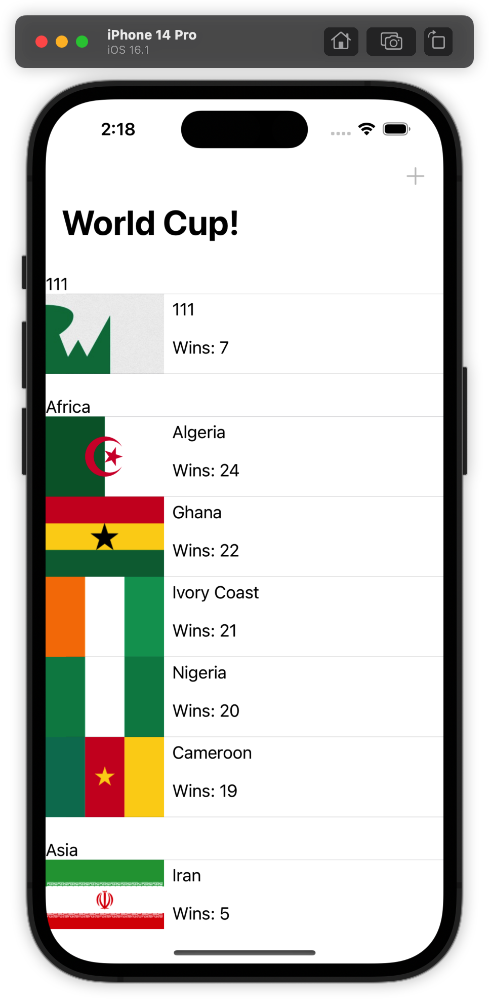

The section headers are back, but if you tap on any team cell you'll notice that the number of wins does not go up anymore. The diffable data source is only thinking about which object IDs are in which order in which section. Even if your team moves up in the section because its wins have increased, the data source will just move the existing cell rather than reconfiguring it. You'll only see the new score when the cell moves off screen and back on again.

To fix this, find tableView(_:didSelectRowAt:) in the UITableViewDelegate section and add the following code before the call to saveContext():

```swift
if var snapshot = dataSource?.snapshot() {
  snapshot.reloadItems([team.objectID])
  dataSource?.apply(snapshot, animatingDifferences: false)
}
```

Here, you get the existing snapshot, tell it that your team needs reloading, then apply the updated snapshot back to the data source. The data source will then reload the cell for your team. When you save the context, that will trigger the fetched results controller's delegate method, which will apply any reordering that needs to happen. Build and run again and confirm that everything works as advertised.

If you got this far, pat yourself on the back. Not only did you re-implement the sample project with diffable data sources, but you also modernized how you monitor changes with the new fetched results controller delegate method. Along the way, you also removed a lot of boilerplate that was previously required.

> Note: If you are monitoring changes to manage the state of views that don’t support diffable data sources, you should keep in mind there is another NSFetchedResultsControllerDelegate method that gives you a summary of all changes to the fetched results in one shot, but uses CollectionDifference<NSManagedObjectID> to return the results.


## Key points

- NSFetchedResultsController abstracts away most of the code needed to synchronize a table view with a Core Data store.

- At its core, NSFetchedResultsController is a wrapper around an NSFetchRequest and a container for its fetched results.

- A fetched results controller requires setting at least one sort descriptor on its fetch request. If you forget the sort descriptor, your app will crash.

- You can set a fetched result’s controller sectionNameKeyPath to specify an attribute to group the results into table view sections. Each unique value corresponds to a different table view section.

- Grouping a set of fetched results into sections is an expensive operation. Avoid having to compute sections multiple times by specifying a cache name on your fetched results controller.

- A fetched results controller can listen for changes in its result set and notify its delegate, NSFetchedResultsControllerDelegate, to respond to these changes.

- NSFetchedResultsControllerDelegate monitors changes in individual Core Data records (whether they were inserted, deleted or modified) as well as changes to entire sections.

- Diffable data sources make working with fetched results controllers and table views easier.


## Where to go from here?

You’ve seen how powerful and useful NSFetchedResultsController can be, and you’ve learned how well it works together with a table view. Table views are so common in iOS apps and you’ve seen first hand how the fetched results controller can save you a lot of time and code!

With some adaptation to the delegate methods, you can also use a fetched results controller to drive a collection view — the main difference being that collection views don’t bracket their updates with begin and end calls, so it’s necessary to store up the changes and apply them all in a batch at the end.

There are a few things you should bear in mind before using fetched results controllers in other contexts. Be mindful of how you implement the fetched results controller delegate methods. Even the slightest change in the underlying data will fire those change notifications, so avoid performing any expensive operations that you’re not comfortable performing over and over.

It’s not every day that a single class gets an entire chapter in a book; that honor is reserved for the select few. NSFetchedResultsController is one of them. As you’ve seen in this chapter, the reason this class exists is to save you time.

NSFetchedResultsController is important for another reason: it fills a gap that iOS developers have faced compared to their macOS developer counterparts. Unlike iOS, macOS has Cocoa bindings, which provide a way to tightly couple a view with its underlying data model. Sound familiar?

If you ever find yourself writing complex logic to compute sections or breaking a sweat trying to get your table view to play nicely with Core Data, think back to this chapter!
