# 第 1 节：你的第一个 Core Data App

欢迎来到 Core Data！

在本章中，你将编写你的第一个 Core Data 应用程序。你将看到开始使用 Xcode 中提供的所有资源是多么容易，从入门代码模板到 Data Model 编辑器。

你将从一开始就立即行动起来。到本章结束时，你将知道如何：

- 使用 Xcode 的 Model Editor 建模数据

- 向 Core Data 添加新记录

- 从 Core Data 中获取一组记录

- 使用 TableView 显示获取的记录

你还将了解 Core Data 在幕后做了什么，以及你如何与各种移动的部分进行交互。这将使你很好地理解接下来的两节，这些章节继续介绍 Core Data 以及更高级的模型和数据验证。


## 入门

打开 Xcode 并根据 App 模板创建一个新的 iOS 项目。将应用程序命名为 HitList，并将界面从 SwiftUI 更改为 Storyboard。本书中的所有示例项目都使用了 Interface Builder 和 UIKit。最后，确保选中使用 Core Data。确保未选中 Host in CloudKit 和 Include Tests。

选中 Use Core Data 框， Xcode 为 AppDelegate.swift 中的 NSPersistentContainer 生成模版代码。

NSPersistentContainer 由一组对象组成，这些对象有助于从 Core Data 中保存和检索信息。在这个容器中是一个整体管理 Core Data 状态的对象，一个表示数据模型的对象，等等。

你将在前几节中了解其中的每一部分。稍后，你有机会编写自己的 Core Data stack！标准 stack 适用于大多数应用程序，但根据你的应用程序及其数据要求，你可以自定义堆栈以提高效率。

这个示例应用程序的想法很简单：将有一个 TableView，其中包含你自己的“hit list”的列表。你将能够向此列表添加 name，并最终使用 Core Data 确保数据在 session 之间存储。

单击 Main.storyboard 在 Interface Builder 中打开它。在画布上选择 view controller 并将其嵌入到 navigation controller 中。从 Xcode 的编辑器菜单中，选择 Embed In… ▸   Navigation Controller。


接下来，将 object library 中的 Table View 拖到 view controller 中，然后调整它的大小，使其覆盖整个视图。

按住 Ctrl 键从 document outline 中的 Table View 拖动到其父视图，然后选择 Leading Space to Safe Area 约束：

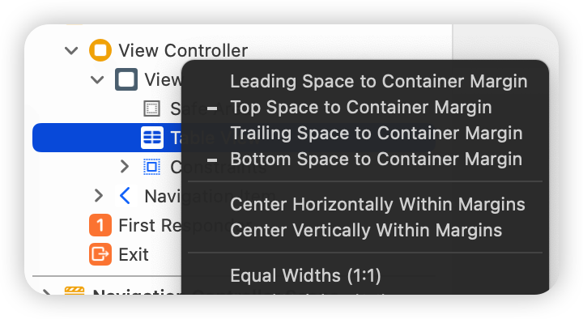

再重复三次，选择约束 Trailing Space to Safe Area、Top Space to Safe Area，最后选择 Bottom Space to Safe Area。 添加这四个约束将使 Table View 填充其父视图。

> 注意：确保 Interface Builder 使用 0 点的常量创建约束，这意味着与屏幕的每一侧齐平。 如果不是这种情况，你可以打开右侧的 Size Inspector 并更正间距。


接下来，拖动一个 Bar Button Item 并将其放置在 view controller 的 navigation bar 上。 最后，选择栏按钮项并将其 system item 更改为 Add。

你的画布应类似于以下屏幕截图：


每次点击 Add button 时，都会出现一个包含文本字段的 alert controller。在那里，你将能够在文本字段中输入某人的姓名。点击 Save 将保存名称，关闭 alert controller 并刷新table view，显示你输入的所有名称。

但首先，你需要使 view controller 成为  table view 的 data source。在画布中，从 table view 中按住 Ctrl 键拖动到导航栏上方的黄色 view controller 器图标，如下图，然后点击dataSource：


如果你想知道，你不需要设置表视图的委托，因为点击单元格不会触发任何操作。 没有比这更简单的了！

通过按下 Control-Command-Option-Enter 或选择  Storyboard scene 右上角的调整编辑器按钮并选择 Assistant 来打开 assistant editor，如下所示。


按住 Ctrl 从表视图拖动到类定义内的 `ViewController.swift` 上，以创建一个 IBOutlet。

接下来，将新的 IBOutlet 属性命名为 tableView，产生以下行：

```swift
@IBOutlet weak var tableView: UITableView!
```

接下来，按住 Ctrl 键从添加按钮拖动到 ViewController.swift 中，就在你的 viewDidLoad() 定义下方。 这一次，创建一个 Action 而不是 Outlet，将方法命名为 addName，类型为 UIBarButtonItem：

```swift
@IBAction func addName(_ sender: UIBarButtonItem) {

}
```

你现在可以在代码中引用表视图和栏按钮项的操作。

接下来，你将为 table view 设置 model。 将以下属性添加到 tableView IBOutlet 下方的 ViewController.swift 中：

```swift
var names: [String] = []
```

names 是一个可变数组，其中包含 table view 显示的字符串值。 接下来，将 viewDidLoad() 的实现替换为以下内容：

```swift
override func viewDidLoad() {
  super.viewDidLoad()

  title = "The List"
  tableView.register(UITableViewCell.self,
                     forCellReuseIdentifier: "Cell")
}
```

这将在 navigation bar 上设置一个标题，并将 UITableViewCell 类注册到表视图。

> 注意：register(_:forCellReuseIdentifier:) 保证在将 Cell reuseIdentifier 提供给 dequeue 方法时，你的表视图将返回正确类型的单元格。


接下来，仍然在 ViewController.swift 中，在 ViewController 的类定义下方添加以下 UITableViewDataSource 扩展：

```swift
// MARK: - UITableViewDataSource
extension ViewController: UITableViewDataSource {

  func tableView(_ tableView: UITableView,
                 numberOfRowsInSection section: Int) -> Int {
    return names.count
  }

  func tableView(_ tableView: UITableView,
                 cellForRowAt indexPath: IndexPath)
                 -> UITableViewCell {

    let cell =
      tableView.dequeueReusableCell(withIdentifier: "Cell",
                                    for: indexPath)
    cell.textLabel?.text = names[indexPath.row]
    return cell

  }
}
```

如果你曾经使用过 UITableView，这段代码应该看起来很熟悉。 首先，你将表中的行数作为名称数组中的项目数返回。

接下来，tableView(_:cellForRowAt:) 将表视图单元格出队，并用名称数组中的相应字符串填充它们。

接下来，你需要一种添加新 name 的方法，以便表视图可以显示它们。 实现你之前按 Ctrl 键拖动到代码中的 addName IBAction 方法：

```swift
// Implement the addName IBAction
@IBAction func addName(_ sender: UIBarButtonItem) {

  let alert = UIAlertController(title: "New Name",
                                message: "Add a new name",
                                preferredStyle: .alert)

  let saveAction = UIAlertAction(title: "Save",
                                 style: .default) {
    [unowned self] action in
                                  

    guard let textField = alert.textFields?.first,
      let nameToSave = textField.text else {
        return
    }
    
    self.names.append(nameToSave)
    self.tableView.reloadData()

  }

  let cancelAction = UIAlertAction(title: "Cancel",
                                   style: .cancel)

  alert.addTextField()

  alert.addAction(saveAction)
  alert.addAction(cancelAction)

  present(alert, animated: true)
}
```

每次点击 Add 按钮时，此方法都会显示一个带有文本字段和两个按钮的 UIAlertController：Save 和 Cancel。

Save 将文本字段当前文本插入到名称数组中，然后重新加载 table view。由于 name 数组是 table view 的 model，因此你在文本字段中输入的任何内容都会出现在表格视图中。

最后，首次构建并运行你的应用程序。接下来，点击添加按钮。 alert controller 将如下所示：


将四五个 name 添加到列表中。你应该会看到类似于下面的内容：


你的 table view 将显示数据，而你的数组将存储 name，但这里缺少的重要内容是持久化。该数组在内存中，但如果你强制退出应用程序或重新启动设备，你的 hit list 将被清除。 Core Data 提供持久化，这意味着它可以以更持久的状态存储数据，因此它可以比应用程序重新启动或设备重新启动更长寿。

你还没有添加任何 Core Data 元素，因此在你离开应用程序后应该不会保留任何内容。 让我们测试一下。 如果你使用的是物理设备，请按 Home 按钮；如果你使用的是模拟器，请按 Shift + ⌘ + H。这将带你回到主屏幕上。

在主屏幕上，点击 HitList 图标以将应用程序带回前台。名字还在屏幕上。发生了什么？

当你点击主页按钮时，当前位于前台的应用程序会转到后台。操作系统会闪存冻结当前内存中的所有内容，包括 names 数组中的字符串。同样，当需要醒来并返回前台时，操作系统会恢复内存中曾经存在的内容，就好像你从未离开过一样。

Apple 在 iOS 4 中引入了多任务处理方面的这些进步。它们为 iOS 用户创造了无缝体验，但增加了 iOS 开发人员对持久性的定义。名字真的保留了吗？

不，不是真的。如果你在快速应用程序切换器中完全杀死了该应用程序或关闭了手机，那么这些名称就会消失。你也可以验证这一点。将应用程序置于前台，进入快速应用程序切换器。

如果你的设备有主屏幕按钮，你可以双击主屏幕按钮；如果你使用的是 iPhone X 或更高版本，你可以从屏幕底部慢慢向上拖动。

从这里，向上轻弹 HitList 应用程序快照以终止应用程序。从应用程序切换器中删除应用程序后，内存中没有了 HitList 的痕迹。通过返回主屏幕并点击 HitList 图标以触发新的启动，验证名称已消失。

如果你已经使用 iOS 一段时间并且熟悉多任务处理的工作方式，那么快速冻结和持久性之间的区别可能会很明显。但是，在用户看来，没有区别。用户不关心为什么名称仍然存在，无论应用程序进入后台并返回，还是因为应用程序保存并重新加载它们。重要的是当应用程序返回时名称仍然存在！

因此，持久化的真正考验是在新的应用程序启动后你的数据是否仍然存在。


## 构造数据

现在你知道了如何检查持久性，你可以深入研究 Core Data。 HitList 应用程序的目标很简单：保留你输入的 name，以便在新的应用程序启动后可以查看它们。

到目前为止，你一直在使用普通的旧 Swift 字符串将 names 存储在内存中。在本节中，你将用 Core Data 对象替换这些字符串。第一步是创建一个 managed object model，它描述了 Core Data 在磁盘上表示数据的方式。

默认情况下，Core Data 使用 SQLite 数据库作为持久存储，因此你可以将 Data Model 视为 database schema。

> 注意：你会在本书中多次遇到 managed 这个词。如果你在一个类的名字中看到“managed”，比如在 NSManagedObjectContext 中，你很可能正在处理一个 Core Data 类。 “managed”是指 Core Data 对 Core Data object 生命周期的管理。
>
> 但是，不要假设所有 Core Data 类都包含“managed”一词。大多数没有。有关 Core Data 类的完整列表，请查看 Apple 文档中的 Core Data framework。

由于你已选择使用 Core Data，Xcode 会自动为你创建一个 Data Model 文件并将其命名为 HitList.xcdatamodeld。

打开 HitList.xcdatamodeld。如你所见，Xcode 有一个强大的 Data Model editor：


 Data Model editor 有很多特性，你将在后面的章节中探索。现在，让我们专注于创建单个 Core Data entity。

单击左下角的添加实体以创建新实体。双击新实体并将其名称更改为 Person，如下所示：

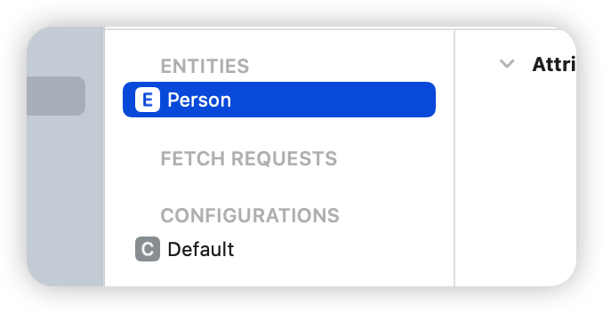

你可能想知道为什么 model editor 使用术语 Entity。你不是简单地定义了一个新类吗？正如你很快就会看到的，Core Data 有自己的词汇表。以下是你经常遇到的一些术语的简要说明：

- Entity 是 Core Data 中的类定义。典型的例子是员工或公司。在关系数据库中，一个Entity 对应一个表。

- Attribute 是附加到特定 Entity 的一条信息。例如，Employee 实体可以具有员工 name、position 和 salary 的属性。在数据库中，属性对应于表中的特定字段。

- Relationship 是多个 Entity 之间的链接。在 Core Data 中，两个 Entity 之间的关系称为一对一关系，而一个和多个 Entity 之间的关系称为一对多关系。例如，经理可以与一组员工建立一对多关系，而单个员工通常与其经理建立一对一关系。

现在你知道 Attribute 是什么了，你可以给之前创建的 Person 对象添加一个属性。还是在 HitList.xcdatamodeld 中，选择左侧的 Person 并单击 Attributes 下的加号 (+)。

将新属性的名称设置为 name 并将其类型更改为 String：


在 Core Data 中，Attribute 可以是多种数据类型之一。你将在接下来的几节中了解这些内容。


## 保存到 Core Data

打开 ViewController.swift，在 import UIKit 下添加以下 Core Data 模块导入：

```swift
import CoreData
```

接下来，将 names 属性定义替换为以下内容：

```swift
var people: [NSManagedObject] = []
```

你将存储 Person entity 而不是 String names，因此将 table view 的 data model 的数组重命名为 people。它现在包含 NSManagedObject 的实例而不是简单的字符串。

NSManagedObject 表示存储在 Core Data 中的单个对象；你必须使用它来创建、编辑、保存和从你的 Core Data 持久存储中删除。你很快就会看到，NSManagedObject 是一个“变形器(shape-shifter)”。它可以是 Data Model entity 的形式，用做你定义的任何属性和关系。

由于你正在更改表格视图的模型，因此你还必须替换之前实现的两个数据源方法。将你的 UITableViewDataSource 扩展替换为以下内容：

```swift
// MARK: - UITableViewDataSource
extension ViewController: UITableViewDataSource {
  func tableView(_ tableView: UITableView,
                 numberOfRowsInSection section: Int) -> Int {
    return people.count
  }

  func tableView(_ tableView: UITableView,
                 cellForRowAt indexPath: IndexPath)
                 -> UITableViewCell {

    let person = people[indexPath.row]
    let cell =
      tableView.dequeueReusableCell(withIdentifier: "Cell",
                                    for: indexPath)
    cell.textLabel?.text =
      person.value(forKeyPath: "name") as? String
    return cell

  }
}
```

这些方法最显着的变化发生在 tableView(_:cellForRowAt:) 中。现在，你不再将单元格与模型数组中的相应字符串匹配，而是将单元格与相应的 NSManagedObject 匹配。请注意如何从 NSManagedObject 中获取名称属性。它发生在这里：

```swift
cell.textLabel?.text =
  person.value(forKeyPath: "name") as? String
```

为什么你必须这样做？事实证明，NSManagedObject 不知道你在 data model 中定义的name attribute，因此无法通过属性直接访问它。 Core Data 提供读取值的唯一方法是 key-value coding(KVC)。

> 注意：KVC 是 Foundation 中使用字符串间接访问对象属性的一种机制。在这种情况下，KVC 使 NSMangedObject 在运行时表现得有点像字典。
>
> KVC 可用于从 NSObject 继承的所有类，包括 NSManagedObject。你不能使用 KVC 访问不是从 NSObject 继承的 Swift 对象上的属性。

接下来，找到 addName(\_:) 并将 save UIAlertAction 替换为以下内容：

```swift
let saveAction = UIAlertAction(title: "Save", style: .default) {
  [unowned self] action in

  guard let textField = alert.textFields?.first,
    let nameToSave = textField.text else {
      return
  }

  self.save(name: nameToSave)
  self.tableView.reloadData()
}
```

这将获取文本字段中的文本并将其传递给名为 save(name:) 的新方法。save(name:) 还不存在。在 addName(_:) 下添加以下实现：

```swift
func save(name: String) {

  guard let appDelegate =
    UIApplication.shared.delegate as? AppDelegate else {
    return
  }

  // 1
  let managedContext =
    appDelegate.persistentContainer.viewContext

  // 2
  let entity =
    NSEntityDescription.entity(forEntityName: "Person",
                               in: managedContext)!

  let person = NSManagedObject(entity: entity,
                               insertInto: managedContext)

  // 3
  person.setValue(name, forKeyPath: "name")

  // 4
  do {
    try managedContext.save()
    people.append(person)
  } catch let error as NSError {
    print("Could not save. \(error), \(error.userInfo)")
  }
}
```

这就是 Core Data 发挥作用的地方！下面是代码的作用：

1. 在你可以从你的 Core Data store 中保存或检索任何内容之前，你首先需要获得一个 NSManagedObjectContext。 你可以将 managed object context 视为用于处理 managed objects 的内存中“便签本”。

   将一个新的 managed object 保存到 Core Data 中作为一个两步过程：首先，将一个新的 managed object 插入到 managed object context 中；接着你就可以“commit” managed object context 的更改以将其保存到磁盘。

   Xcode 已经生成了一个 managed object context 作为新项目模板的一部分。请记住，只有在开始时选中 Use Core Data 复选框时才会发生这种情况。此默认 managed object context 为 NSPersistentContainer 的属性，存在于 application delegate 中。要访问它，你首先要获得对 application delegate 引用。

2. 你创建一个新的 managed object 并将其插入到 managed object context。你可以使用 NSManagedObject 的静态方法一步完成：entity(forEntityName:in:)。

   你可能想知道 NSEntityDescription 到底是什么。回想一下，NSManagedObject 被称为 shape-shifter 类，因为它可以表示任何实体。Entity description 是将 Data Model 中的 Entity 定义与运行时的 NSManagedObject 实例联系起来的部分。

3. 有了 NSManagedObject，你可以使用 KVO 设置名称属性。你必须准确拼写 KVC key，否则你的应用程序将在运行时崩溃。

4. 你可以通过在  managed object context  上调用 save 来将更改提交给 person 并保存到磁盘。注意 save 可能会引发错误，这就是为什么你在 do-catch 块中使用 try 关键字调用它的原因。最后，将新的 managed object 插入到 people 数组中，以便在重新加载 table view 时显示出来。

这比使用字符串数组要复杂一些，但也不算太糟。这里的一些代码，例如  managed object context  和 entity，可以在你自己的 init() 或 viewDidLoad() 中只完成一次，然后再重用。为简单起见，你使用相同的方法完成所有操作。

构建并运行应用程序，并在 table view 中添加一些 name：


如果 name 实际上存储在 Core Data 中，则 HitList 应用程序应该通过持久性测试。将应用程序置于前台，转到快速应用程序切换器，然后终止它。点击 HitList 应用程序以触发新启动。 等等，表视图是空的：


你已保存到 Core Data，但在应用启动后，people 数组为空！ 那是因为数据在磁盘上等着你，但你还没有显示它。


## 从 Core Data 中获取

要从持久存储中获取数据到托管对象上下文中，你必须获取它。打开 ViewController.swift 并在 viewDidLoad() 下面添加以下内容：

```swift
override func viewWillAppear(_ animated: Bool) {
  super.viewWillAppear(animated)

  //1
  guard let appDelegate =
    UIApplication.shared.delegate as? AppDelegate else {
      return
  }

  let managedContext =
    appDelegate.persistentContainer.viewContext

  //2
  let fetchRequest =
    NSFetchRequest<NSManagedObject>(entityName: "Person")

  //3
  do {
    people = try managedContext.fetch(fetchRequest)
  } catch let error as NSError {
    print("Could not fetch. \(error), \(error.userInfo)")
  }
}
```

这就是代码的作用：

1. 在你可以使用 Core Data 做任何事情之前，你需要一个 managed object context。像以前一样，你获取 application delegate 并获取对其 persistent container 的引用以获取其 NSManagedObjectContext。

2. 顾名思义，NSFetchRequest 是负责从 Core Data 中获取数据的类。获取请求既强大又灵活。你可以使用提取请求来提取一组满足所提供标准的对象。

   NSFetchRequest 有几个限定符用于优化返回的结果集。你将后文了解有关这些限定符的更多信息；现在，你应该知道 NSEntityDescription 是这些必需的限定符之一。

   设置 fetchRequest 的 entity 属性，或者使用 init(entityName:) 对其进行初始化，获取特定实体的所有对象。这就是你在此处获取所有 Person entity 所执行的操作。另请注意 NSFetchRequest 是一种通用类型。这种泛型的使用指定了获取请求的预期返回类型，在本例中为 NSManagedObject。

3. 你将提取请求交给 managed object context 来完成繁重的工作。 fetch(\_:) 返回满足获取请求指定条件的托管对象数组。

> 注意：与 save() 一样，fetch(_:) 也可能抛出错误，因此你必须在 do 块中使用它。如果在获取过程中发生错误，你可以在 catch 块中检查错误并做出适当的响应。

构建并运行应用程序。你应该立即看到你之前添加的名称列表：

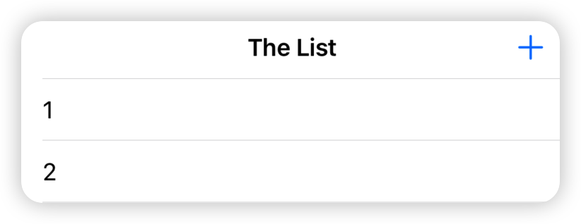

向列表中添加更多名称并重新启动应用程序以验证保存和提取是否正常。只要不删除应用程序、重置模拟器或将手机从高楼上扔下去，无论如何，名字都会出现在表格视图中。

> 注意：此示例应用程序中有一些粗糙的边缘：你每次都必须从应用程序委托中获取托管对象上下文，并且你使用 KVC 来访问实体的属性，而不是更自然的对象样式的 person.name。

有更好的方法来保存和从 Core Data 中获取数据，你将在以后的章节中探讨这些方法。


## 关键点

- Core Data 提供磁盘持久化，这意味着即使在终止你的应用程序或关闭你的设备后，你的数据仍可访问。这与内存中持久性不同，后者只会在你的应用程序在内存中时保存你的数据，无论是在前台还是在后台。

- Xcode 带有一个强大的 Data Model editor，你可以使用它来创建你的 managed object model。

- Managed object model 由 entities、 attributes 和 relationships 组成。

- Entity 是 Core Data 中的类定义。

- Attribute 是附加到 Entity 的一条信息。

- Relationship 是多个 Entity 之间的链接。

NSManagedObject 是 Core Data Entity 的运行时表示。你可以使用 KVC 读取和写入其属性。

- 你需要一个 NSManagedObjectContext 来 save() 或 fetch(_:) Core Data 的数据。


# 第 2 节：NSManagedObject 子类

在第 1 节中，您接触了一个简单的 Core Data 应用程序；现在是探索 Core Data 提供的更多内容的时候了！

本章的核心是 NSManagedObject 的子类化，为每个 Data Entity 创建自己的类。这会在 data model editor 中的 Entity 与代码中的类之间创建直接的一对一映射。这意味着在代码的某些部分，您可以使用对象和属性，而不必过多担心  Core Data 方面的事情。

在此过程中，您将了解 Core Data Entitiy 中可用的所有数据类型，包括一些常见的字符串和数字类型等其他的类型。使用所有可用的数据类型，您还将了解如何验证数据以在保存前自动检查值。


## 入门

转到本书随附的文件并打开起始文件夹中名为 BowTies 的示例项目。与 HitList 一样，该项目使用 Xcode 的支持 Core Data 的模板。和以前一样，这意味着 Xcode 生成了自己的即用型 Core Data stack，位于 AppDelegate.swift 中。

打开 Main.storyboard。您可以在此处找到示例项目的单页 UI：


正如您可能猜到的那样，BowTies 是一个轻量级领结管理应用程序。您可以使用最顶部的分段控件在您拥有的不同颜色的领结之间切换——该应用假定每一种颜色都有一个。点击“R”表示红色，“O”表示橙色，依此类推。

点击特定颜色会弹出领带图像，并在屏幕上显示有关领带的特定信息的多个标签。这包括：

- 领结的名字（所以你可以区分颜色相似的领结）

- 你戴领带的次数

- 你最后一次戴领带的日期

- 这条领带是否是你的最爱

左下角的 Wear 按钮会增加您佩戴该特定领带的次数，并将最后一次佩戴日期设置为今天。

橙色不是你的颜色？不用担心。右下角的评级按钮更改领结的评级。这个特定的评级系统使用从 0 到 5 的等级，允许十进制值。

这就是应用程序在其最终状态下应该做的事情。打开 ViewController.swift 查看它当前做了什么：

```swift
import UIKit

class ViewController: UIViewController {

  // MARK: - IBOutlets
  @IBOutlet weak var segmentedControl: UISegmentedControl!
  @IBOutlet weak var imageView: UIImageView!
  @IBOutlet weak var nameLabel: UILabel!
  @IBOutlet weak var ratingLabel: UILabel!
  @IBOutlet weak var timesWornLabel: UILabel!
  @IBOutlet weak var lastWornLabel: UILabel!
  @IBOutlet weak var favoriteLabel: UILabel!
  @IBOutlet weak var wearButton: UIButton!
  @IBOutlet weak var rateButton: UIButton!

  // MARK: - View Life Cycle
  override func viewDidLoad() {
    super.viewDidLoad()
  }

  // MARK: - IBActions
  @IBAction func segmentedControl(
    _ sender: UISegmentedControl) {

  }

  @IBAction func wear(_ sender: UIButton) {

  }

  @IBAction func rate(_ sender: UIButton) {

  }
}
```

坏消息是目前的状态，BowTies 什么也没做。 好消息是您不需要进行任何 Ctrl 拖动！

用户界面上的分段控件和所有标签已经在代码中连接到 IBOutlets。 此外，分段控制、Wear 和 Rate 按钮都有对应的 IBActions。

看起来你已经拥有了开始添加一些 Core Data 所需的一切——但是等等，你要在屏幕上显示什么？ 没有输入法可言，所以应用程序必须附带示例数据。这完全正确。 BowTies 包含一个名为 SampleData.plist 的属性列表，其中包含七个示例领带的信息，每个领带代表彩虹的每种颜色。

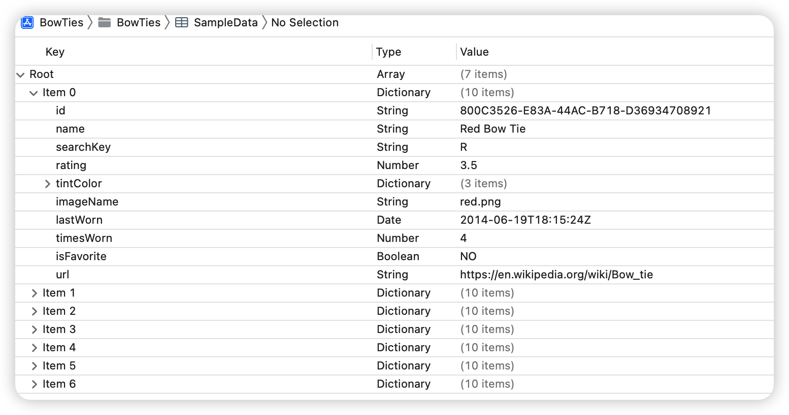

此外，应用程序的 Assets.xcassets 包含与 SampleData.plist 中的七个领结对应的七个图像。

您现在要做的就是获取此示例数据，将其存储在 Core Data 中并使用它来实现领结管理功能。


## 构造数据

在上一章中，您了解了在开始一个新的 Core Data 项目时首先要做的事情之一就是创建您的 data model。

打开 BowTies.xcdatamodeld 并单击左下角的 Add Entity 以创建一个新实体。双击新实体并将其名称更改为 BowTie，如下所示：

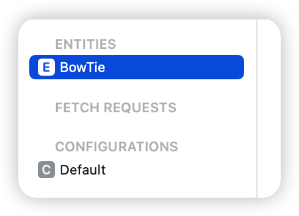

在上一节中，您创建了一个简单的 Person 实体，它有一个 String 属性来保存 name。 Core Data 支持其他几种数据类型，您将在新的 BowTie 实体中使用它们中的大部分。

属性的数据类型决定了您可以在其中存储什么样的数据以及它将在磁盘上占用多少空间。在 Core Data 中，属性的数据类型以 Undefined 开头，因此您必须将其更改为其他类型。

如果您还记得 SampleData.plist，每个领结都有十条相关信息。 这意味着 BowTie Entity 最终将在 model editor 中具有至少十个属性。

选择左侧的 BowTie，然后单击 Attributes 下的加号 (+)。 将新属性的名称更改为 name 并将其类型设置为 String：


再重复此过程七次以添加以下属性：

- 名为 isFavorite 的 Boolean

- 名为 lastWorn 的 Date

- 名为 rating 的 Double

- 名为 searchKey 的 String

- 名为 timesWorn 的 Integer 32

- 名为 id 的 UUID

- 名为 url 的 URI

这些数据类型中在日常编程中都很常见。如果您之前没有听说过 UUID，它是通用唯一标识符的缩写，通常用于唯一标识信息。

URI代表统一资源标识符，用于命名和标识不同的资源，如文件和网页。事实上，所有的 URL 都是 URI！

完成后，您的属性部分应类似于以下内容：


如果属性的顺序不同，请不要担心——重要的是属性名称和类型是正确的。

> 注意：您可能已经注意到 timesWorn 整数属性有三个选项：Integer 16、Integer 32 或 Integer 64。
>
> 16、32、64是指表示整数的位数。这一点很重要，原因有二：位数反映了一个整数在磁盘上占用的空间大小以及它可以表示多少个值，也称为它的范围。以下是三种整数的范围：
>
> 16 位整数的范围：-32768 到 32767
>
> 32 位整数的范围：–2147483648 到 2147483647
>
> 64 位整数的范围：–9223372036854775808 到 9223372036854775807

你如何选择？您的数据来源将决定最佳的整数类型。你假设你的用户真的很喜欢领结，所以一个 32 位整数应该提供足够的存储空间供领结佩戴一生。


每个领结都有一个关联的图像。您将如何将其存储在 Core Data 中？向 BowTie 实体添加一个属性，将其命名为 photoData 并将其数据类型更改为二进制数据：


Core Data 提供了直接在数据模型中存储任意二进制数据块的选项。这些可以是任何东西，从图像到 PDF 文件，再到任何可以序列化为 0 和 1 的东西。

正如您所想象的，这种便利可能会付出高昂的代价。在与其他属性相同的 SQLite 数据库中存储大量二进制数据可能会影响应用程序的性能。这意味着每次访问实体时都会将一个巨大的二进制加载到内存中，即使您只需要访问它的名称也是如此！

幸运的是，Core Data 预见到了这个问题。选择 photoData 属性后，打开 Attributes Inspector 并选中 Allows External Storage 选项。


当您启用 Allows External Storage 时，Core Data 会根据每个值试探性地决定是否应将数据直接保存在数据库中或存储指向单独文件的 URI。

> 注意：允许外部存储选项仅适用于二进制数据属性类型。此外，如果你打开它，你将无法使用该属性查询 Core Data。

综上所述，除了 Strings、Integers、Doubles、Booleans 和 Dates，Core Data 还可以保存 Binary Data，而且可以高效智能地保存。


## 在 Core Data 中存储非标准数据类型

不过，您可能还想保存许多其他类型的数据。 例如，如果必须存储 UIColor 的实例，您会怎么做？

使用目前提供的选项，您必须将颜色解构为其单独的组件并将它们保存为整数（例如，红色：255，绿色：101，蓝色：155）。 然后，在获取这些组件后，您必须在运行时重新构建颜色。

或者，您可以将 UIColor 实例序列化为 Data 并将其保存为二进制数据。 然后，您还必须在之后“加水”以将二进制数据重新构造回您最初想要的 UIColor 对象。

Core Data 再次为您提供支持。 如果您仔细查看 SampleData.plist，您可能会注意到每个领结都有一个相关联的颜色。 在 model editor 中选择 BowTie 实体并添加一个名为 tintColor 且类型为 Transformable 的新属性。


Transformable 属性持久化 Xcode 的 Data Model Inspector 中未列出的数据类型。这些包括 Apple 在其框架中提供的类型，例如 UIColor 和 CLLocationCoordinate2D 以及您自己的类型。

Transformable 属性非常强大和灵活，但您需要预先做一些工作来告诉 iOS 如何将这些类型与数据相互转换。您必须满足三个要求才能使用 Transformable 属性：

1. 将 NSSecureCoding 协议添加到将受支持数据类型。

2. 创建并注册一个 NSSecureUnarchiveFromDataTransformer 子类。

3. 将自定义 data transformer 子类与 Data Model Editor 中的 Transformable 属性相关联。

由于您正在处理 UIColor，好消息是它已经符合 NSSecureCoding。 Apple 框架中的大多数数据类型都可以。

要满足第二个要求，请单击 File\New\File... 并从 Cocoa Touch 模板创建一个文件。将文件命名为 ColorAttributeTransformer 并使其成为 NSSecureUnarchiveFromDataTransformer 的子类。单击下一步并将文件保存在您的项目中。

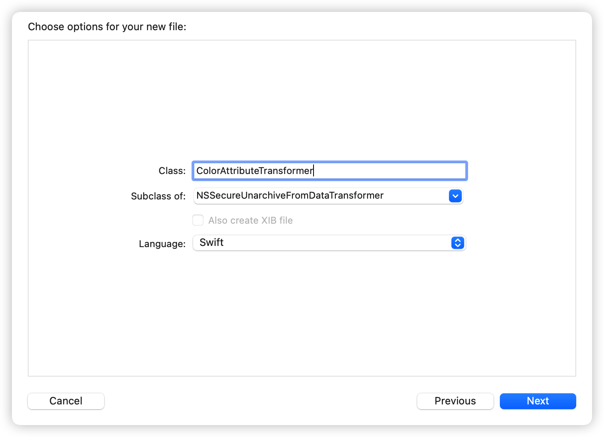

接下来，用以下实现替换新文件的内容。

```swift
import UIKit

class ColorAttributeTransformer:
  NSSecureUnarchiveFromDataTransformer {

  //1
  override static var allowedTopLevelClasses: [AnyClass] {
    [UIColor.self]
  }

  //2
  static func register() {
    let className =
      String(describing: ColorAttributeTransformer.self)
    let name = NSValueTransformerName(className)

    let transformer = ColorAttributeTransformer()
    ValueTransformer.setValueTransformer(
      transformer, forName: name)

  }
}
```

下面是这段代码的作用：

1. 覆盖 allowedTopLevelClasses 以返回此 data transformer 可以 decode 的类列表。我们想要持久化和检索 UIColor 的实例，因此在这里您返回一个仅包含该类的数组。

2. 顾名思义，静态函数 register() 帮助您使用 ValueTransformer 注册您的子类。但是为什么你需要这样做呢？ ValueTransformer 维护一个键值映射，其中键是您使用 NSValueTransformerName 提供的名称，值是相应转换器的实例。您稍后将在数据模型编辑器中需要此映射。


接下来，打开 AppDelegate.swift 并将 application(\_:didFinishLaunchingWithOptions:) 替换为以下实现：

```swift
func application(_ application: UIApplication,
                 didFinishLaunchingWithOptions
  launchOptions: [UIApplication.LaunchOptionsKey: Any]?)
                 -> Bool {

  ColorAttributeTransformer.register()

  return true
}
```

在这里，您使用之前实现的静态方法注册 data transformer。注册可以在您的应用程序设置 Core Data stack 之前的任何时候进行。

接下来，回到 BowTies.xcdatamodeld，选择 tintColor 属性并打开 Data Model Inspector。将 Transformer 的值更改为 ColorAttributeTransformer，并将 Custom Class 设置为 UIColor。

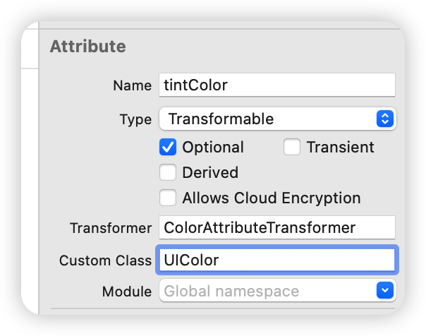

您的数据模型现已完成。 BowTie 实体具有将所有信息存储在 SampleData.plist 中所需的十个属性。


## Managed 对象子类

在上一章的示例项目中，您使用 KVC 来访问 Person 实体的属性。它看起来类似于以下内容：

```swift
// Set the name
person.setValue(aName, forKeyPath: "name")

// Get the name
let name = person.value(forKeyPath: "name")
```

即使你可以使用 KVC 直接在 NSManagedObject 上做任何事情，但这并不意味着你应该这样做！

KVC 的最大问题是您使用字符串而不是强类型类访问数据。这通常被开玩笑地称为编写字符串类型的代码。

您可能从经验中知道，字符串类型的代码容易出现愚蠢的人为错误，例如打字错误和拼写错误。键值编码也没有充分利用 Swift 的类型检查和 Xcode 的自动完成功能。 “一定有别的办法！”你可能在想，你是对的。

KVC 的最佳替代方法是为 data model 中的每个 entity 创建 NSManagedObject 子类。这意味着将有一个 BowTie 类，每个属性都有正确的类型。

Xcode 可以手动或自动为您生成子类。你为什么希望 Xcode 为你做这件事？如果您永远不必查看或更改它们，那么生成这些子类文件并让它们弄乱您的项目可能会有点麻烦。从 Xcode 8 开始，您可以在每个实体的基础上选择让 Xcode 自动生成和更新这些文件，并将它们存储在项目的派生数据文件夹中。

使用 model editor 时，此设置位于 Data Model inspector 的 Codegen field 中。因为你在本书中学习 Core Data，所以你不会使用自动代码生成。

确保您仍然打开 BowTies.xcdatamodeld，选择 BowTie 实体并打开数 Data Model inspector。将 Codegen 下拉菜单设置为 Manual/None，如下所示：


> 注意：确保将 BowTie entity 添加到 model 后，第一次编译之前，更改此生成设置。
>
> 如果您在第一次编译后设置代码生成设置，您将拥有两个版本的托管对象子类：一个在派生数据中，另一个在源代码中。如果发生这种情况，当您再次尝试编译时会遇到问题。


接下来，转到 Editor\Create NSManagedObject Subclass...。在接下来的两个对话框中选择  data model，然后选择 BowTie entity。单击创建以保存文件。

Xcode 为您生成了两个 Swift 文件，一个名为 BowTie+CoreDataClass.swift，另一个名为 BowTie+CoreDataProperties.swift。打开 BowTie+CoreDataClass.swift。它应该类似于以下内容：

```swift
import Foundation
import CoreData

@objc(BowTie)
public class BowTie: NSManagedObject {

}
```

接下来，打开 BowTie+CoreDataProperties.swift。您生成的属性可能与此处显示的顺序不同，但该文件应类似于以下内容：

```swift
import Foundation
import CoreData

extension BowTie {

  @nonobjc public class func fetchRequest() 
    -> NSFetchRequest<BowTie> {
    

    return NSFetchRequest<BowTie>(entityName: "BowTie")

  }

  @NSManaged public var name: String?
  @NSManaged public var isFavorite: Bool
  @NSManaged public var lastWorn: Date?
  @NSManaged public var rating: Double
  @NSManaged public var searchKey: String?
  @NSManaged public var timesWorn: Int32
  @NSManaged public var id: UUID?
  @NSManaged public var url: URL?
  @NSManaged public var photoData: Data?
  @NSManaged public var tintColor: UIColor?
}

extension BowTie : Identifiable {

}
```

在面向对象的说法中，对象是一组值以及在这些值上定义的一组操作。在这种情况下，Xcode 将这两个东西分成两个单独的文件。值（即与 data model 中的 BowTie 属性对应的属性）在 BowTie+CoreDataProperties.swift 中，而操作在当前为空的 BowTie+CoreDataClass.swift 中。

> 注意：您可能想知道为什么会生成两个单独的文件。将自定义代码添加到 NSManagedObject 子类是很常见的。如果您在 model editor 中更新 BowTie 实体并再次转到 Editor\Create NSManagedObject Subclass...，您不会希望丢失该代码。代码创建很智能 - 如果 BowTie+CoreDataClass.swift 已经存在，它只会创建 BowTie+CoreDataProperties.swift，保留所有自定义代码。这就是 Core Data 生成两个文件的主要原因，而不是像以前的 Xcode 版本那样生成一个文件。


Xcode 已经为 data model 中的每个属性创建了一个具有属性的类。由于它创建了 UIColor 的属性，因此您需要在 import CoreData 下添加以下 import UIKit 以修复错误。

Foundation 或 Swift 标准库中对于模型编辑器中的每个属性类型都有一个相应的类。这是属性类型到运行时类的完整映射：

- String maps to String?

- Integer 16 maps to Int16

- Integer 32 maps to Int32
- Integer 64 maps to Int64
- Float maps to Float
- Double maps to Double
- Boolean maps to Bool
- Decimal maps to NSDecimalNumber?
- Date maps to Date?
- URI maps to URL?
- UUID maps to UUID?
- Binary data maps to Data?
- Transformable maps to NSObject?

> 注意：与 Objective-C 中的 @dynamic 类似，@NSManaged 属性通知 Swift 编译器，属性的后备存储和实现将在运行时而不是编译时提供。

正常模式是属性由内存中的实例变量支持。managed object 的属性不同：它由managed object context，因此在编译时不知道数据的来源。

请注意，由于您为 tintColor 属性提供了 UIColor 的自定义类，Core Data 已经使用 UIColor 生成了该属性？而不是 NSObject?。


恭喜，你刚刚在 Swift 中创建了你的第一个托管对象子类！

与 KVC 相比，这是一种更好的处理 Core Data 实体的方法，并且有两个主要好处：

1. Managed object subclasses 释放了 Swift 属性的语法能力。通过使用属性而不是 KVC 访问属性，您可以与 Xcode 和编译器友好相处。

2. 您获得了覆盖现有方法或添加自己的方法的能力。注意有一些 NSManagedObject 方法你永远不能覆盖。查看 Apple 的 NSManagedObject 文档以获取完整列表。

为了确保数据模型和新的托管对象子类之间的所有内容都正确连接，您将执行一个小测试。

打开 AppDelegate.swift 并将 application(_:didFinishLaunchingWithOptions:) 替换为以下实现：

```swift
func application(_ application: UIApplication,
                 didFinishLaunchingWithOptions
  launchOptions: [UIApplication.LaunchOptionsKey: Any]?)
                 -> Bool {

  ColorAttributeTransformer.register()

  // Save test bow tie
  let bowtie = NSEntityDescription.insertNewObject(
    forEntityName: "BowTie",
    into: self.persistentContainer.viewContext) as! BowTie
  bowtie.name = "My bow tie"
  bowtie.lastWorn = Date()
  saveContext()

  // Retrieve test bow tie
  let request: NSFetchRequest<BowTie> = BowTie.fetchRequest()

  if let ties =
    try? self.persistentContainer.viewContext.fetch(request),
    let testName = ties.first?.name,
    let testLastWorn = ties.first?.lastWorn {
    print("Name: \(testName), Worn: \(testLastWorn)")
  } else {
    print("Test failed.")
  }

  return true
}
```

在应用程序启动时，此测试会创建一个领结设置其名称和 lastWorn 属性，并在保存 managed object context。之后，它立即获取所有 BowTie 实体并将第一个实体的名称和 lastWorn 日期打印到控制台；此时应该只有一个。构建并运行应用程序并密切关注控制台：

```swift
Name: My bow tie, Worn: 2022-11-15 18:24:39 +0000
```

如果您一直在仔细遵循，请按预期将 name 和 lastWorn 打印到控制台。这意味着您能够成功保存和获取 BowTie 托管对象子类。掌握了这些新知识，是时候实现整个示例应用程序了。


## 传递 managedContext

打开 ViewController.swift 并在 import UIKit 下方添加以下内容：

```swift
import CoreData
```

接下来，在最后一个 IBOutlet 属性下面添加以下内容：

```swift
// MARK: - Properties
var managedContext: NSManagedObjectContext!
```

重申一下，在 Core Data 中执行任何操作之前，您首先必须获得一个 NSManagedObjectContext 才能使用。 了解如何将 managed object context 传递到应用程序的不同部分是 Core Data 编程的一个重要方面。

打开 AppDelegate.swift 并将当前包含测试代码的 application(\_:didFinishLaunchingWithOptions:) 替换为之前的实现：

```swift
func application(_ application: UIApplication,
                  didFinishLaunchingWithOptions
  launchOptions: [UIApplication.LaunchOptionsKey: Any]?)
  -> Bool {
  ColorAttributeTransformer.register()
  return true
}
```

您有七个领结很想进入您的 Core Data 存储。 打开 ViewController.swift 并在 rate(_:) 下面添加以下方法：

```swift
// Insert sample data
func insertSampleData() {

  let fetch: NSFetchRequest<BowTie> = BowTie.fetchRequest()
  fetch.predicate = NSPredicate(format: "searchKey != nil")

  let tieCount = (try? managedContext.count(for: fetch)) ?? 0

  if tieCount > 0 {
    // SampleData.plist data already in Core Data
    return
  }

  let path = Bundle.main.path(forResource: "SampleData",
                              ofType: "plist")
  let dataArray = NSArray(contentsOfFile: path!)!

  for dict in dataArray {
    let entity = NSEntityDescription.entity(
      forEntityName: "BowTie",
      in: managedContext)!
    let bowtie = BowTie(entity: entity,
                        insertInto: managedContext)
    let btDict = dict as! [String: Any]

    bowtie.id = UUID(uuidString: btDict["id"] as! String)
    bowtie.name = btDict["name"] as? String
    bowtie.searchKey = btDict["searchKey"] as? String
    bowtie.rating = btDict["rating"] as! Double
    let colorDict = btDict["tintColor"] as! [String: Any]
    bowtie.tintColor = UIColor.color(dict: colorDict)
    
    let imageName = btDict["imageName"] as? String
    let image = UIImage(named: imageName!)
    bowtie.photoData = image?.pngData()
    bowtie.lastWorn = btDict["lastWorn"] as? Date
    
    let timesNumber = btDict["timesWorn"] as! NSNumber
    bowtie.timesWorn = timesNumber.int32Value
    bowtie.isFavorite = btDict["isFavorite"] as! Bool
    bowtie.url = URL(string: btDict["url"] as! String)

  }
  try? managedContext.save()
}
```

Xcode 会抱怨缺少 UIColor 上的方法声明。 要解决此问题，请将以下私有 UIColor 扩展名添加到文件末尾最后一个大括号下方。

```swift
private extension UIColor {

  static func color(dict: [String: Any]) -> UIColor? {
    guard 
      let red = dict["red"] as? NSNumber,
      let green = dict["green"] as? NSNumber,
      let blue = dict["blue"] as? NSNumber else {
        return nil
    }
    

    return UIColor(
      red: CGFloat(truncating: red) / 255.0,
      green: CGFloat(truncating: green) / 255.0,
      blue: CGFloat(truncating: blue) / 255.0,
      alpha: 1)

  }
}
```

这是相当多的代码，但都相对简单。第一个方法，insertSampleData，检查任何领结；稍后您将了解这是如何工作的。如果不存在，它会在 SampleData.plist 中获取领结信息，遍历每个领结字典并将新的 BowTie 实体插入到您的 Core Data 存储中。在此迭代结束时，它保存 managed object context 属性以将这些更改提交到磁盘。

您通过私有扩展添加到 UIColor 的 color(dict:) 方法也很简单。 SampleData.plist 将颜色存储在包含三个键的字典中：红色、绿色和蓝色。这个静态方法接受这个字典并返回一个真正的 UIColor。

这里有两点需要特别注意：

1. 在 Core Data 中存储图像的方式。属性列表包含每个领结的文件名，而不是文件图像——实际图像在项目的资产目录中。使用此文件名，您可以实例化 UIImage 并立即通过 pngData() 将其转换为数据，然后再将其存储在 imageData 属性中。
2. 存储颜色的方式。尽管颜色存储在可转换属性中，但在将其存储在 tintColor 中之前不需要任何特殊处理。您只需设置属性即可。

前面的方法将您在 SampleData.plist 中的所有领结数据插入到 Core Data 中。现在您需要从某个地方访问数据！

接下来，将 viewDidLoad() 替换为以下实现：

```swift
// MARK: - View Life Cycle
override func viewDidLoad() {
  super.viewDidLoad()

  let appDelegate = 
    UIApplication.shared.delegate as? AppDelegate
  managedContext = appDelegate?.persistentContainer.viewContext

  //1
  insertSampleData()

  //2
  let request: NSFetchRequest<BowTie> = BowTie.fetchRequest()
  let firstTitle = segmentedControl.titleForSegment(at: 0) ?? ""
  request.predicate = NSPredicate(
    format: "%K = %@",
    argumentArray: [#keyPath(BowTie.searchKey), firstTitle])

  do {
    //3
    let results = try managedContext.fetch(request)

    //4
    if let tie = results.first {
      populate(bowtie: tie)
    }

  } catch let error as NSError {
    print("Could not fetch \(error), \(error.userInfo)")
  }
}
```

这是您从 Core Data 获取领结并填充 UI 的地方。

一步一步，这是你用这段代码做的事情：

1. 您调用之前实现的 insertSampleData()。由于每次启动应用程序时都可以调用 viewDidLoad() ，因此 insertSampleData() 执行一次提取以确保它不会多次将示例数据插入到 Core Data 中。

2. 您创建一个获取请求以获取新插入的 BowTie entities。segmented control 有按颜色筛选的选项卡，因此 predicate 添加条件以查找与所选颜色匹配的领结。predicate 既非常灵活又非常强大——您将在后文中阅读更多关于它们的内容。

   现在，知道这个特定的 predicate 正在寻找领结，其 searchKey 属性设置为分段控件的第一个按钮标题：在本例中为 R。

3. 一如既往，managed object context 为您完成繁重的工作。它执行您刚才制作的获取请求并返回一个 BowTie 对象数组。

4. 用结果数组中的第一个领结填充用户界面。如果有错误，将错误打印到控制台。

您尚未定义 populate 方法，因此 Xcode 会发出警告。在 insertSampleData() 下面添加以下实现：

```swift
func populate(bowtie: BowTie) {

  guard let imageData = bowtie.photoData as Data?,
    let lastWorn = bowtie.lastWorn as Date?,
    let tintColor = bowtie.tintColor else {
      return
  }

  imageView.image = UIImage(data: imageData)
  nameLabel.text = bowtie.name
  ratingLabel.text = "Rating: \(bowtie.rating)/5"

  timesWornLabel.text = "# times worn: \(bowtie.timesWorn)"

  let dateFormatter = DateFormatter()
  dateFormatter.dateStyle = .short
  dateFormatter.timeStyle = .none

  lastWornLabel.text =
    "Last worn: " + dateFormatter.string(from: lastWorn)

  favoriteLabel.isHidden = !bowtie.isFavorite
  view.tintColor = tintColor
}
```

领结中定义的大多数属性都有一个 UI 元素。 由于 Core Data 仅将图像存储为二进制数据块，因此您的工作是将其重新组合成图像，以便视图控制器的图像视图可以使用它。

同样，您不能直接使用 lastWorn 日期属性。 您首先需要创建一个日期格式化程序，将日期转换为人类可以理解的字符串。

最后，存储领结颜色的 tintColor 可转换属性不仅会更改屏幕上的一个元素的颜色，还会更改屏幕上所有元素的颜色。 只需在视图控制器的视图上设置色调颜色即可！ 现在一切都染上了相同的颜色。

> 注意：Xcode 生成一些 NSManagedObject 子类属性作为可选类型。 这就是为什么在 populate 方法中，您在方法开头使用 guard 语句解开 BowTie 上的一些 Core Data 属性。


构建并运行应用程序。 屏幕上出现红色领结，如下所示：


Wear 和 Rate 按钮目前没有任何作用。 点击分段控件的不同部分也没有任何作用。 你还有工作要做！

首先，您需要跟踪当前选择的领结，以便您可以在课堂上的任何地方引用它。 仍然在 ViewController.swift 中，在 managedContext 下面添加以下属性来执行此操作：

```swift
var currentBowTie: BowTie!
```

接下来，在viewDidLoad()中的do-catch语句中找到对populate(bowtie:)的调用，在其上方添加如下一行，设置currentBowTie的初始值：

```swift
currentBowTie = tie
```

跟踪当前选择的领结对于实现 Wear 和 Rate 按钮是必要的，因为这些操作只会影响当前的领结。

每次用户点击 Wear 时，按钮都会执行 wear(\_:) 操作方法。 但是 wear(\_:) 目前是空的。 将 wear(\_:) 实现替换为以下内容：

```swift
@IBAction func wear(_ sender: UIButton) {  
  currentBowTie.timesWorn += 1
  currentBowTie.lastWorn = Date()

  do {
    try managedContext.save()
    populate(bowtie: currentBowTie)    
  } catch let error as NSError {    
    print("Could not fetch \(error), \(error.userInfo)")
  }
}
```

此方法采用当前选定的领结并将其 timesWorn 属性递增 1。 接下来，将 lastWorn 日期更改为今天并保存托管对象上下文以将这些更改提交到磁盘。 最后，您填充用户界面以可视化这些更改。

构建并运行应用程序，然后根据需要多次点击 Wear。 看起来你非常喜欢红色领结的永恒优雅！

同样，每次用户点击 Rate 时，它都会执行代码中的 rate(\_:) 操作方法。 rate(\_:) 当前为空。 将 rate(\_:) 的实现替换为以下内容：

```swift
@IBAction func rate(_ sender: UIButton) {

  let alert = UIAlertController(title: "New Rating",
                                message: "Rate this bow tie",
                                preferredStyle: .alert)

  alert.addTextField { textField in
    textField.keyboardType = .decimalPad
  }

  let cancelAction = UIAlertAction(title: "Cancel",
                                   style: .cancel)

  let saveAction = UIAlertAction(
    title: "Save",
    style: .default
    ) { [unowned self] _ in
      if let textField = alert.textFields?.first {
        self.update(rating: textField.text)
      }
    }

  alert.addAction(cancelAction)
  alert.addAction(saveAction)

  present(alert, animated: true)
}
```

点击 Rate 现在会弹出一个带有单个文本字段、一个取消按钮和一个保存按钮的警报视图控制器。 点击保存按钮调用 update(rating:)，这...

糟糕，你还没有定义那个方法。 通过在 populate(bowtie:) 下面添加以下实现来安抚 Xcode：

```swift
func update(rating: String?) {

  guard let ratingString = rating,
    let rating = Double(ratingString) else {
      return
  }

  do {
    currentBowTie.rating = rating
    try managedContext.save()
    populate(bowtie: currentBowTie)
  } catch let error as NSError {    
    print("Could not save \(error), \(error.userInfo)")
  }
}
```

您将 alert 的文本字段中的文本转换为 Double 并使用它来更新 currentBowTie rate 属性。 最后，您像往常一样通过 managedContext 来提交您的更改并刷新 UI 以实时查看您的更改。

试试看。 构建并运行应用程序并点击 Rate：


输入 0 到 5 之间的任何十进制数，然后点击保存。 如您所料，评级标签会更新为您输入的新值。 现在再点击一次评分。 还记得红色领结的永恒优雅吗？ 假设您非常喜欢它，您决定给它打 6 分（满分 5 分）。点击保存刷新用户界面：


虽然您可能绝对喜欢红色，但现在既不是夸张的时间也不是夸张的地方。 您的应用程序允许您将 6 保存为一个应该最多为 5 的值。您手上的数据无效。


## Core Data 中的数据验证

你的第一直觉可能是编写客户端验证——类似于“只有当值大于 0 且小于 5 时才保存新评级”。幸运的是，您不必自己编写这段代码。 Core Data 支持开箱即用的大多数属性类型的验证。

打开 BowTies.xcdatamodeld，选择评级属性并打开the data model inspector。

在 Validation 旁边，键入 0 表示最小值，键入 5 表示最大值。而已！无需编写任何 Swift 来拒绝无效数据。


> 注意：通常，如果你想在你的应用程序发布后更改它，你必须对你的数据模型进行版本控制。您将在第 6 节“版本控制和迁移”中了解更多相关信息。

属性验证是少数例外之一。如果您在发布后将其添加到您的应用程序中，则无需对您的数据模型进行版本控制。


但这究竟是做什么的？

在您对 managed object context 调用 save() 后，验证立即开始。managed object context 检查模型以查看是否有任何新值与您设置的验证规则冲突。

如果存在验证错误，则保存失败。还记得 do-catch 块中包装 save 方法的 NSError 吗？到目前为止，如果出现错误，除了将其记录到控制台之外，您没有理由做任何特殊的事情。验证改变了这一点。

再次构建并运行该应用程序。给红色领结打 6 分（满分 5 分）并保存。一个相当神秘的错误消息将显示到您的控制台：

```
Could not save Error Domain=NSCocoaErrorDomain Code=1610 "rating is too large." UserInfo={NSValidationErrorObject=<BowTie: 0x6000038c2da0> (entity: BowTie; id: 0xac775ff23f190c42 <x-coredata://67543601-368D-464C-B976-957548F4AF71/BowTie/p3>; data: {
    id = "800C3526-E83A-44AC-B718-D36934708921";
    isFavorite = 0;
    lastWorn = "2014-06-19 18:15:24 +0000";
    name = "Red Bow Tie";
    photoData = "{length = 50, bytes = 0x89504e47 0d0a1a0a 0000000d 49484452 ... aece1ce9 00000078 }";
    rating = 6;
    searchKey = R;
    timesWorn = 4;
    tintColor = "UIExtendedSRGBColorSpace 0.937255 0.188235 0.141176 1";
    url = "https://en.wikipedia.org/wiki/Bow_tie";
}), NSLocalizedDescription=rating is too large., NSValidationErrorKey=rating, NSValidationErrorValue=6}, ["NSValidationErrorObject": <BowTie: 0x6000038c2da0> (entity: BowTie; id: 0xac775ff23f190c42 <x-coredata://67543601-368D-464C-B976-957548F4AF71/BowTie/p3>; data: {
    id = "800C3526-E83A-44AC-B718-D36934708921";
    isFavorite = 0;
    lastWorn = "2014-06-19 18:15:24 +0000";
    name = "Red Bow Tie";
    photoData = "{length = 50, bytes = 0x89504e47 0d0a1a0a 0000000d 49484452 ... aece1ce9 00000078 }";
    rating = 6;
    searchKey = R;
    timesWorn = 4;
    tintColor = "UIExtendedSRGBColorSpace 0.937255 0.188235 0.141176 1";
    url = "https://en.wikipedia.org/wiki/Bow_tie";
}), "NSLocalizedDescription": rating is too large., "NSValidationErrorValue": 6, "NSValidationErrorKey": rating]
```

错误附带的 userInfo 字典包含有关 Core Data 为何中止您的保存操作的各种有用信息。 它甚至有一条本地化的错误消息，您可以在关键字 NSLocalizedDescription 下向您的用户显示：评级太大。

但是，您如何处理此错误完全取决于您。 打开 ViewController.swift 并用以下内容替换 update(rating:) 以适当地处理错误：

```swift
func update(rating: String?) {

  guard let ratingString = rating,
    let rating = Double(ratingString) else {
      return
  }

  do {

    currentBowTie.rating = rating
    try managedContext.save()
    populate(bowtie: currentBowTie)

  } catch let error as NSError {

    if error.domain == NSCocoaErrorDomain &&
      (error.code == NSValidationNumberTooLargeError ||
        error.code == NSValidationNumberTooSmallError) {
      rate(rateButton)
    } else {
      print("Could not save \(error), \(error.userInfo)")
    }

  }
}
```

如果由于新评级太大或太小而发生错误，则再次显示 alert view。

否则，您将像以前一样使用新评级填充用户界面。

但是等等…… NSValidationNumberTooLargeError 和 NSValidationNumberTooSmallError 是从哪里来的？回到之前的控制台阅读并仔细查看第一行：

```
Could not save Error Domain=NSCocoaErrorDomain Code=1610 "rating is too large."
```

NSValidationNumberTooLargeError 是一个映射到整数 1610 的错误代码。

如需 Core Data 错误和代码定义的完整列表，您可以通过 Cmd 键单击 NSValidationNumberTooLargeError 来查阅 Xcode 中的 CoreDataErrors.h。

> 注意：当涉及 NSError 时，标准做法是检查错误的域和代码以确定出了什么问题。您可以在 Apple 的错误处理编程指南中阅读更多相关信息：https://developer.apple.com/library/archive/documentation/Cocoa/Conceptual/ErrorHandlingCocoa/CreateCustomizeNSError/CreateCustomizeNSError.html

构建并运行应用程序。通过再次向红色领带展示一些爱来验证新的验证规则是否正常工作。

如果您输入超过 5 的任何值并尝试保存，该应用程序会拒绝您的评分并要求您使用新的警报视图重试。 成功！


## 完成剩下的内容

Wear 和 Rate 按钮工作正常，但应用程序只能显示一条领带。 在分段控件上点击不同的值应该可以切换领带。 您将通过实现该功能来完成此示例项目。

每次用户点击分段控件时，它都会在您的代码中执行 segmentedControl(\_:) 操作方法。 将 segmentedControl(\_:) 的实现替换为以下内容：

```swift
@IBAction func segmentedControl(_ sender: UISegmentedControl) {
  guard let selectedValue = sender.titleForSegment(
    at: sender.selectedSegmentIndex) else {
      return
  }

  let request: NSFetchRequest<BowTie> = BowTie.fetchRequest()
  request.predicate = NSPredicate(
    format: "%K = %@",
    argumentArray: [#keyPath(BowTie.searchKey), selectedValue])

  do {
    let results = try managedContext.fetch(request)
    currentBowTie = results.first
    populate(bowtie: currentBowTie)
  } catch let error as NSError {
    print("Could not fetch \(error), \(error.userInfo)")
  }
}
```

分段控件中每个分段的标题对应于特定关系的 searchKey 属性。 获取当前所选片段的标题并使用精心设计的 NSPredicate 获取合适的领结。

然后，使用结果数组中的第一个领结（每个 searchKey 应该只有一个）来填充用户界面。

构建并运行应用程序。 点击分段控件上的不同字母以获得迷幻效果。

你做到了！ 有了这个领结应用程序，您就可以成为 Core Data 大师了。


## 关键点

- Core Data 支持不同的属性数据类型，这决定了您可以在实体中存储的数据类型以及它们将占用磁盘空间的大小。 一些常见的属性数据类型是 String、Date 和 Double。
- 二进制数据属性数据类型使您可以选择在数据模型中存储任意数量的二进制数据。
- Transformable 属性数据类型允许您在数据模型中存储任何符合 NSSecureCoding 的对象。
- 使用 NSManagedObject 子类是处理 Core Data Entity 的更好方法。 您可以手动生成子类，也可以让 Xcode 自动生成。
- 您可以使用 NSPredicate 细化 NSFetchRequest 获取的 set entities。
- 您可以直接在数据模型编辑器中为大多数属性数据类型设置验证规则（例如最大值和最小值）。 如果您尝试保存无效数据，managed object context 将抛出错误。


# 第 3 节：Core Data Stack

到目前为止，您一直依赖 Xcode 的 Core Data 模板。 从 Xcode 获得帮助并没有错（这就是它的用途！）。 但是如果你真的想知道 Core Data 是如何工作的，那么构建你自己的 Core Data Stack 是必须的。

该 Stack 由四个 Core Data 类组成：

- NSManagedObjectModel

- NSPersistentStore

- NSPersistentStoreCoordinator

- NSManagedObjectContext

在这四个类中，到目前为止，您在本书中只遇到过 NSManagedObjectContext。 但其他三个一直在幕后支持您的managed context。

在本章中，您将详细了解这四个类的作用。 您将构建自己的 Core Data Stack，而不是依赖默认的入门模板； 围绕这些类的可定制的 wrapper。

在这四个类中，到目前为止，您在本书中只遇到过 NSManagedObjectContext。但其他三个一直在幕后，支持您的托管环境。

在本章中，您将详细了解这四个类的作用。您将构建自己的 Core Data 堆栈，而不是依赖默认的入门模板；围绕这些类的可定制包装器。


## 入门

本章的示例项目是一个简单的遛狗应用程序。此应用程序可让您在简单的表格视图中保存遛狗的日期和时间。定期使用此应用程序，您的狗狗就会爱上您。

您将在本书随附的资源中找到示例项目 DogWalk。打开 DogWalk.xcodeproj，然后构建并运行起始项目。

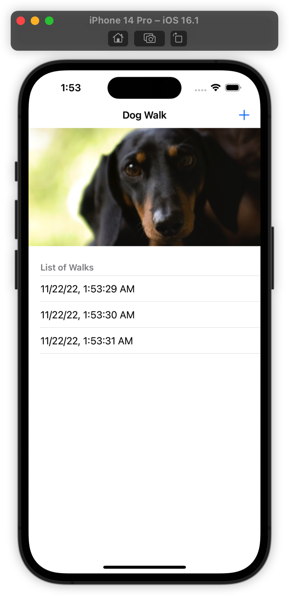

如您所见，示例应用程序已经是一个完全可用（虽然简单）的原型。点击右上角的加号 (+) 按钮会在散步列表中添加一个新条目。该图像代表您当前正在遛狗，但除此之外什么都不做。

该应用程序具有它需要的所有功能，除了一项重要功能：散步列表不会持续存在。如果您终止 DogWalk 并重新启动，您的整个历史记录都将消失。如果你今天早上遛过狗，你会怎么记得？

本章的任务是在 Core Data 中保存散步列表。如果这听起来像是您在第 1 节和第 2 节中已经做过的事情，那么这里就是转折点；您将编写自己的 Core Data Stack 以了解幕后真正发生的事情！


## 了解 Core Data Stack

知道 Core Data Stack 是如何工作的不仅仅是一件好事。如果您正在使用更高级的设置，例如从旧的持久存储中迁移数据，那么深入研 Core Data Stack 栈是必不可少的。

在开始编写代码之前，让我们仔细考虑一下 Core Data 堆栈中的四个类——NSManagedObjectModel、NSPersistentStore、NSPersistentStoreCoordinator 和 NSManagedObjectContext——分别做了什么。


### managed object model

NSManagedObjectModel 代表应用程序 data model 中的每个对象类型，它们可以拥有的属性以及它们之间的关系。 Core Data Stack 的其他部分使用该 model 来创建 objects、存储 properties 和保存 data。

正如本书前面提到的，将 NSManagedObjectModel 视为 database schema 可能会有所帮助。如果您的 Core Data Stack在底层使用 SQLite，则 NSManagedObjectModel 表示 database schema。

然而，SQLite 只是您可以在 Core Data 中使用的众多持久存储类型中的一种（稍后会详细介绍），因此最好从更一般的角度来考虑 managed object model。

> 注意：您可能想知道 NSManagedObjectModel 与您一直使用的 data model editor 有什么关系。好问题！
>
> 可视化 editor 创建并编辑 xcdatamodel 文件。有一个特殊的编译器 momc，它将 model 文件编译成 momd 文件夹中的一组文件。
>
> 正如您的 Swift 代码经过编译和优化以便可以在设备上运行一样，编译后的模型也可以在运行时高效访问。 Core Data 使用 momd 文件夹的编译内容在运行时初始化 NSManagedObjectModel。


### persistent store

NSPersistentStore 是将数据读取和写入的存储方法。 Core Data 提供了四种开箱即用的 NSPersistentStore：三种原子(atomic)的和一种非原子(non-atomic)的。

原子 persistent store 需要完全反序列化并加载到内存中，然后才能进行任何读取或写入操作。相比之下，非原子persistent store 可以根据需要将自身的 chunks 加载到内存中。

以下是四种内置 Core Data store 类型的简要概述：

1. NSSQLiteStoreType 由 SQLite 数据库支持。它是 Core Data 唯一支持的开箱即用的非原子存储类型，使其具有轻量级和高效的内存占用。这使它成为大多数 iOS 项目的最佳选择。 Xcode 的 Core Data 模板默认使用这种存储类型。

2. NSXMLStoreType 由 XML 文件支持，使其成为所有存储类型中最易读的。这种存储类型是原子的，因此它可能占用大量内存。 NSXMLStoreType 仅在 OS X 上可用。

3. NSBinaryStoreType 由二进制数据文件支持。与 NSXMLStoreType 一样，它也是一个原子存储，因此必须先将整个二进制文件加载到内存中，然后才能对其进行任何操作。在现实世界的应用程序中，您很少会发现这种类型的持久性存储。

4. NSInMemoryStoreType 是内存中持久存储类型。在某种程度上，这种存储类型并不是真正持久的。终止应用程序或关闭手机，存储在内存存储类型中的数据就会消失得无影无踪。尽管这似乎违背了 Core Data 的目的，但内存中的持久存储对于单元测试和某些类型的缓存可能很有帮助。

> 注意：您是否对由 JSON 文件或 CSV 文件支持的持久存储类型感兴趣？好消息是您可以通过子类化 NSIncrementalStore 创建您自己的持久存储类型。
>
> 如果您对此选项感到好奇，请参阅 Apple 文档：https://developer.apple.com/library/archive/documentation/DataManagement/Conceptual/IncrementalStorePG/Introduction/Introduction.html


### persistent store coordinator

NSPersistentStoreCoordinator 是 managed object model 和 persistent store 之间的桥梁。它负责使用 model 和 persistent store 来完成 Core Data 中的大部分繁重工作。它了解 NSManagedObjectModel 并知道如何向 NSPersistentStore 发送信息和从中获取信息。

NSPersistentStoreCoordinator 还隐藏了如何配置 persistent store 的实现细节。这很有用，原因有二：

1. NSManagedObjectContext（下一个！）不必知道它是保存到 SQLite 数据库、XML 文件还是自定义增量存储。

2. 如果您有多个 persistent store，则 persistent store coordinator 会为 managed context 提供一个统一的接口。就managed context 而言，它始终与单个聚合 persistent store 交互。


### managed object context

在日常工作中，您大部分时间将使用 NSManagedObjectContext。当您需要使用 Core Data 做一些更高级的事情时，您才可能会看到其他三个组件。

由于使用 NSManagedObjectContext 非常普遍，了解 context 的工作原理非常重要！到目前为止，您可能已经从本书中学到了一些东西：

- context 是用于处理 managed objects 的内存暂存器。

- 您在 managed object context 中使用 Core Data objects 完成所有工作。

- 在调用 context 中的 save() 之前，您所做的任何更改都不会影响磁盘上的基础数据。

现在这里有五件关于 context 的事情，之前没有提到。其中一些对后面的章节非常重要，因此请密切注意：

1. context 管理它创建或获取的对象的 lifecycle。这种 lifecycle 管理包括强大的功能，例如错误处理、反向关系处理和验证。

2. 没有关联的 context， managed object 就无法存在。事实上，一个 managed object 和它的 context 是紧密耦合的，以至于每个 managed object 都保留一个对其 context 的引用，可以像这样访问它：

```swift
let managedContext = employee.managedObjectContext
```

3. context 是非常地域性的；一旦 managed object 与特定 context 相关联，它将在其生命周期期间保持与同一 context 相关联。

4. 一个应用程序可以使用多个 context——大多数重要的 Core Data 应用程序都属于这一类。由于 context 是磁盘上内容的内存暂存器，您实际上可以同时将同一个 Core Data object 加载到两个不同的 context 中。

5. context 不是线程安全的。  managed object 也是如此：您只能在创建它们的同一线程上与 context 和 managed object 进行交互。

Apple 提供了许多在多线程应用程序中处理 context 的方法。您将在第 9 章“Multiple Managed Object Contexts”中阅读有关不同并发模型的所有内容。


###  persistent store container

如果您认为 Core Data Stack 只有四个部分，您会大吃一惊！从 iOS 10 开始，有一个新类来编排所有四个 Core Data stack 类：the managed model, the store coordinator, the persistent store and the managed context。

这个类的名字是 NSPersistentContainer ，顾名思义，它是一个容器，将所有东西都放在一起。与其浪费时间编写样板代码将所有四个堆栈组件连接在一起，您可以简单地初始化一个 NSPersistentContainer，加载它的持久存储，然后就可以开始了。


## 创建 stack object

现在您知道了每个组件的作用，是时候返回 DogWalk 并实现您自己的 Core Data stack 了。

正如你从前面的章节中了解到的，Xcode 在 app delegate 中创建了它的 Core Data stack。你会以不同的方式去做。您将创建一个单独的类来封装 stack，而不是将应用程序委托代码与 Core Data 代码混合。

转到 File ▸ New ▸ File…，选择 iOS ▸ Source ▸ Swift File 模板并单击 Next。将文件命名为 CoreDataStack 并单击创建以保存文件。

转到新创建的 CoreDataStack.swift。您将逐个创建此文件。首先用以下内容替换文件的内容：

```swift
import Foundation
import CoreData

class CoreDataStack {
  private let modelName: String

  init(modelName: String) {
    self.modelName = modelName
  }

  private lazy var storeContainer: NSPersistentContainer = {

    let container = NSPersistentContainer(name: self.modelName)
    container.loadPersistentStores { _, error in
      if let error = error as NSError? {
        print("Unresolved error \(error), \(error.userInfo)")
      }
    }
    return container

  }()
}
```

您首先导入 Foundation 和 CoreData。接下来，创建一个私有属性来存储 modelName。接下来，创建一个 init 以将 modelName 保存到私有属性中。

接下来，您设置一个 lazy 实例化的 NSPersistentContainer，传递您在初始化期间存储的 modelName。您唯一需要做的另一件事是在持久容器上调用 `loadPersistentStores(completionHandler:)`（尽管出现了 completionHandler，但默认情况下此方法不会异步运行）。最后，在 modelName 下面添加以下延迟实例化的属性：

```swift
lazy var managedContext: NSManagedObjectContext = {
  return self.storeContainer.viewContext
}()
```

尽管 NSPersistentContainer 为 managed context、managed model、store coordinator 和  persistent stores（通过 [NSPersistentStoreDescription]）提供公共访问器，但 CoreDataStack 的工作方式略有不同。

例如，CoreDataStack 唯一可公开访问的部分是 NSManagedObjectContext，因为您刚刚添加了 lazy 属性。其他所有内容都标记为私有。为什么是这样？

managed context 是访问 stack 其余部分所需的唯一入口点。persistent store coordinator 是 NSManagedObjectContext 的 public 属性。同样，managed object model 和持 persistent store 数组都是 NSPersistentStoreCoordinator 的 public 属性。

最后，在 storeContainer 属性下面添加以下方法：

```swift
func saveContext () {
  guard managedContext.hasChanges else { return }

  do {
    try managedContext.save()
  } catch let error as NSError {
    print("Unresolved error \(error), \(error.userInfo)")
  }
}
```

这是保存 stack 的  managed object context  并处理任何由此产生的错误的便捷方法。

打开 ViewController.swift 并进行以下更改。首先，导入核心数据模块。在 import UIKit 下方添加以下内容：

```
import CoreData
```

接下来，在 dateFormatter 下面添加以下属性以保存核心数据堆栈：

```swift
lazy var coreDataStack = CoreDataStack(modelName: "DogWalk")	
```


## 构造数据

现在你闪亮的新 Core Data stack 已经安全地固定到 main view controller 上了，是时候创建你的 data model 了。

转到您的项目导航器并...等一下。没有数据模型文件！这是正确的。由于我生成此示例应用程序时未启用使用 Core Data 的选项，因此没有 .xcdatamodeld 文件。

不用担心。转到 File ▸ New ▸ File..., select the iOS ▸ Core Data ▸ Data Model template，然后单击下一步。

将文件命名为 DogWalk.xcdatamodeld 并单击创建以保存文件。

> 注意：如果您没有准确命名您的数据模型文件 DogWalk.xcdatamodeld，您以后会遇到问题。 这是因为 CoreDataStack.swift 期望在 DogWalk.momd 找到编译后的版本。


打开数据模型文件并创建一个名为 Dog 的新实体。 您现在应该能够自己完成此操作，但如果您忘记了如何操作，请单击左下角的“添加实体”按钮。

添加一个名为 name 的 String 类型的属性。 您的 data model 应如下所示：


您还想跟踪特定狗的散步情况。 毕竟，这就是应用程序的全部意义所在！

定义另一个实体并将其命名为 Walk。 然后添加一个名为 date 的属性并将其类型设置为 Date。


回到 Dog entity。 您可能认为您需要添加一个 Array 类型的新属性来保存 walks，但 Core Data 中没有数组类型。 相反，这样做的方法是将其建模为一种关系。 添加一个新的关系并将其命名为 walks。 将 destination 设置为 Walk：


您可以将 destination 视为一段关系的接收端。 默认情况下，每段关系都以一对一关系开始，这意味着您目前只能跟踪每只狗的一次散步。 除非您不打算长期饲养您的狗，否则您可能想要跟踪不止一次散步。

要解决此问题，请选择 walks 关系，打开 Data Model Inspector：


单击“Type”下拉菜单，选择“To Many”并选中“Ordered”。这意味着一只 Dog 可以有很多次 Walk，并且 Walk 的顺序很重要，因为您将显示按日期排序的 Walk。

选择 Walk 实体并创建返回到 Dog 的反向关系。将 destination 设置为 Dog，将 inverse 设置为 Walk。


将这种关系保留为一对一关系是可以的。一只 Dog 可以有很多次 Walk，但一次 Walk 只能属于一只 Dog——至少对于这个应用程序来说是这样。

逆向(inverse)让 model 知道如何找到返回的方式，可以这么说。鉴于 Walk 记录，您可以跟踪与狗的关系。多亏了 inverse， model 知道遵循 walks 关系以返回 walk 记录。

这是让您知道数据模型编辑器有另一种视图样式的好时机。您一直在关注表编辑器样式。

切换右下角的分段控件以切换到图形编辑器样式：


> 图形编辑器已经在 Xcode14 种删除。https://developer.apple.com/forums/thread/710008

图形编辑器是可视化 Core Data 实体之间关系的好工具。这里从 Dog 到 Walk 的对多关系用双箭头表示。 Walk 用一个箭头指向 Dog，表示一对一的关系。

随意在两种编辑器风格之间来回切换。您可能会发现使用表格样式添加和删除实体和属性更容易，使用图表样式可以更轻松地查看 data model 的大图。


## 添加 managed object 子类

在上一章中，您学习了如何为您的 Core Data 实体创建自定义 managed object 子类。以这种方式工作更方便，因此这也是您将对 Dog 和 Walk 执行的操作。

与上一章一样，您将手动生成自定义 managed object 子类，而不是让 Xcode 为您完成，这样您就可以看到幕后发生的事情。打开 DogWalk.xcdatamodeld，选择 Dog Entity 并将 Data Model inspector 中的代码生成下拉列表设置为 Manual/None。对 Walk 实体重复相同的过程。

然后，转到 Editor ▸ Create NSManagedObject Subclass... 并选择 DogWalk 模型，然后选择 Dog 和 Walk 实体。单击下一个屏幕上的创建以创建文件。

正如您在第 2 章中看到的那样，这样做会为每个实体创建两个文件：一个用于您在模型编辑器中定义的核心数据属性，另一个用于您可能添加到托管对象子类的任何未来功能。

Dog+CoreDataProperties.swift 应该是这样的：
导入基金会
导入核心数据

```swift
import Foundation
import CoreData

extension Dog {

  @objc(insertObject:inWalksAtIndex:)
  @NSManaged public func insertIntoWalks(_ value: Walk,
                                         at idx: Int)

  @objc(removeObjectFromWalksAtIndex:)
  @NSManaged public func removeFromWalks(at idx: Int)

  @objc(insertWalks:atIndexes:)
  @NSManaged public func insertIntoWalks(_ values: [Walk],
                                         at indexes: NSIndexSet)

  @objc(removeWalksAtIndexes:)
  @NSManaged public func removeFromWalks(at indexes: NSIndexSet)
  @objc(replaceObjectInWalksAtIndex:withObject:)
  @NSManaged public func replaceWalks(at idx: Int,
                                      with value: Walk)

  @objc(replaceWalksAtIndexes:withWalks:)
  @NSManaged public func replaceWalks(at indexes: NSIndexSet,
                                      with values: [Walk])

  @objc(addWalksObject:)
  @NSManaged public func addToWalks(_ value: Walk)

  @objc(removeWalksObject:)
  @NSManaged public func removeFromWalks(_ value: Walk)

  @objc(addWalks:)
  @NSManaged public func addToWalks(_ values: NSOrderedSet)

  @objc(removeWalks:)
  @NSManaged public func removeFromWalks(_ values: NSOrderedSet)
}

extension Dog : Identifiable {

}
```

和以前一样，name 属性是一个 String 可选的。但是 Walk 的关系呢？ Core Data 使用 set 而不是数 array 来表示对多关系。因为你让 walks 关系有序，所以你有一个 NSOrderedSet。

> 注意：NSSet 似乎是一个奇怪的选择，不是吗？与 array 不同，set 不允许通过索引访问其成员。事实上，根本没有顺序！ Core Data 使用 NSSet 是因为 set 强制其成员之间的唯一性。在一对多关系中，同一个对象不能出现多次。

如果您需要按索引访问单个对象，您可以在可视化编辑器中选中 Ordered 复选框，就像您在此处所做的那样。然后，Core Data 会将关系表示为 NSOrderedSet。

同样，Walk+CoreDataProperties.swift 应该是这样的：

```swift
import Foundation
import CoreData

extension Walk {

  @nonobjc public class func fetchRequest()
    -> NSFetchRequest<Walk> {
    return NSFetchRequest<Walk>(entityName: "Walk")
  }

  @NSManaged public var date: Date?
  @NSManaged public var dog: Dog?
}

extension Walk : Identifiable {

}
```

回到 Dog 的反向关系只是 Dog 类型的一个属性。非常简单。

> 注意：有时 Xcode 会使用通用 NSManagedObject 类型而不是特定类创建关系属性，尤其是当您同时创建大量子类时。如果发生这种情况，只需自己更正类型或重新生成特定文件即可。


## 使用 Core Data 

现在您的设置已经完成；你的 Core Data Stack，你的 data model  和你的managed object subclasses。是时候将 DogWalk 转换为使用 Core Data 了。您之前已经做过几次，所以这对您来说应该是一个简单的部分。

假设此应用程序将在某个时候支持跟踪多只 Dog。第一步是跟踪当前选择的 Dog。

打开 ViewController.swift 并将 walks 数组替换为以下属性。现在忽略错误，您将在一分钟内修复这些错误：

```swift
var currentDog: Dog?
```

接下来，将以下代码添加到 viewDidLoad() 的末尾：

```swift
let dogName = "Fido"
let dogFetch: NSFetchRequest<Dog> = Dog.fetchRequest()
dogFetch.predicate = NSPredicate(format: "%K == %@",
                                 #keyPath(Dog.name), dogName)

do {
  let results = try coreDataStack.managedContext.fetch(dogFetch)
  if results.isEmpty {
    // Fido not found, create Fido
    currentDog = Dog(context: coreDataStack.managedContext)
    currentDog?.name = dogName
    coreDataStack.saveContext()
  } else {
    // Fido found, use Fido
    currentDog = results.first
  }
} catch let error as NSError {
  print("Fetch error: \(error) description: \(error.userInfo)")
}
```

首先，您从 Core Data 中获取所有名称为“Fido”的 Dog Entity。如果获取请求返回结果，则将第一个 Entity（应该只有一个）设置为当前选择的 Dog。

如果获取请求返回空结果，这可能意味着这是用户第一次打开应用程序。如果是这种情况，则插入一只新狗，将其命名为“Fido”，并将其设置为当前选择的狗。

> 注意：您刚刚实现了通常称为“查找”或“创建”模式的模式。此模式的目的是操作存储在 Core Data 中的对象，而不会冒在过程中添加重复对象的风险。在 iOS 9 中，Apple 引入了在 Core Data Entity 上指定唯一约束的功能。使用唯一约束，您可以在数据模型中指定哪些属性在实体上必须始终是唯一的，以避免添加重复项。

接下来，将 tableView(\_:numberOfRowsInSection:) 的实现替换为以下内容：

```swift
func tableView(_ tableView: UITableView,
               numberOfRowsInSection section: Int) -> Int {
  currentDog?.walks?.count ?? 0
}
```


正如您可能猜到的那样，这将表视图中的行数与当前所选狗中设置的行走次数相关联。如果当前没有选中的狗，则返回 0。

接下来，将 tableView(\_:cellForRowAt:) 替换为以下内容：

```swift
func tableView(
  _ tableView: UITableView,
  cellForRowAt indexPath: IndexPath
  ) -> UITableViewCell {
  let cell = tableView.dequeueReusableCell(
    withIdentifier: "Cell", for: indexPath)

  guard let walk = currentDog?.walks?[indexPath.row] as? Walk,
    let walkDate = walk.date as Date? else {
      return cell
  }

  cell.textLabel?.text = dateFormatter.string(from: walkDate)
  return cell
}
```

只有两行代码发生了变化。 现在，您获取每次步行的日期并将其显示在相应的表格视图单元格中。

add(\_:) 方法仍然引用旧的 walks 数组。 暂时将其注释掉； 您将在下一步中重新实现此方法：

```swift
@IBAction func add(_ sender: UIBarButtonItem) {
  // walks.append(Date())
  tableView.reloadData()
}
```

构建并运行以确保您已正确连接所有内容。


万岁！如果你已经走到这一步，你刚刚将一只狗插入到 Core Data 中，并且当前正在用他的散步列表填充表格视图。这个列表目前没有任何走动，所以这个表看起来不是很令人兴奋。

点击加号 (+) 按钮，它什么也不做是可以理解的。你还没有在这个控件下实现任何东西！在转换到 Core Data 之前，add(\_:) 只是将 Date 添加到数组并重新加载表视图。重新实现如下图：

```swift
@IBAction func add(_ sender: UIBarButtonItem) {
  // Insert a new Walk entity into Core Data
  let walk = Walk(context: coreDataStack.managedContext)
  walk.date = Date()

  // Insert the new Walk into the Dog's walks set
  if let dog = currentDog,
    let walks = dog.walks?.mutableCopy()
      as? NSMutableOrderedSet {
      walks.add(walk)
      dog.walks = walks
  }

  // Save the managed object context
  coreDataStack.saveContext()

  // Reload table view
  tableView.reloadData()
}
```

这种方法的 Core Data 版本要复杂得多。首先，您必须创建一个新的 Walk 实体并将其日期属性设置为现在。接下来，您必须将此步行插入到当前选定的狗的步行列表中。

但是，walks 属性是 NSOrderedSet 类型。 NSOrderedSet 是不可变的，因此您首先必须创建一个可变副本 (NSMutableOrderedSet)，插入新的 walk，然后将这个可变有序集的不可变副本重置回狗身上。


注意：将新对象添加到一对多关系中是否会让您头晕目眩？许多人对此表示同情，这就是为什么 Dog+CoreDataProperties 包含生成的遍历有序集访问器的原因，这些访问器将为您处理所有这些。

例如，您可以将最后一个代码片段中的整个 if-let 语句替换为以下内容：

```swift
currentDog?.addToWalks(walk)
```

试试看！


不过，Core Data 可以让事情变得更容易。如果关系没有排序，你只能设置关系的一侧（例如，walk.dog = currentDog）而不是多侧，Core Data 将使用模型编辑器中定义的反向关系来将 Walk 添加到 Dog 的 Walk 中。

最后，您通过调用 Core Data 堆栈上的 saveContext() 将更改提交到持久存储，然后重新加载表视图。

构建并运行应用程序，然后点击加号 (+) 按钮几次。

伟大的！步行列表现在应该保存在 Core Data 中。通过在快速应用程序切换器中终止应用程序并从头开始重新启动来验证这一点。


## 从 Core Data 中删除对象

假设您对触发器过于友好，并且在您无意的时候点击了加号 (+) 按钮。你实际上并没有遛狗，所以你想删除刚刚添加的散步。

你已经将对象添加到 Core Data，你已经获取它们，修改它们并再次保存它们。您还没有做的是删除它们——但您接下来要做的就是删除它们。

首先，打开 ViewController.swift 并将以下方法添加到 UITableViewDataSource 扩展：

```swift
func tableView(_ tableView: UITableView,
               canEditRowAt indexPath: IndexPath) -> Bool {
  true
}
```

你将使用 UITableView 的默认行为来删除项目：向左滑动以显示红色的删除按钮，然后点击它进行删除。

表格视图调用此 UITableViewDataSource 方法来询问特定单元格是否可编辑，返回 true 意味着所有单元格都应该是可编辑的。

接下来，将以下方法添加到相同的 UITableViewDataSource 扩展：

```swift
func tableView(
  _ tableView: UITableView,
  commit editingStyle: UITableViewCell.EditingStyle,
  forRowAt indexPath: IndexPath
) {

  //1
  guard let walkToRemove =
    currentDog?.walks?[indexPath.row] as? Walk,
    editingStyle == .delete else {
      return
  }

  //2
  coreDataStack.managedContext.delete(walkToRemove)

  //3
  coreDataStack.saveContext()

  //4
  tableView.deleteRows(at: [indexPath], with: .automatic)
}
```

当您点击红色的删除按钮时，将调用此表视图数据源方法。让我们逐步查看代码：

1. 首先，您获得对要删除的 walk 的引用。

2. 通过调用 NSManagedObjectContext 的 delete() 方法从 Core Data 中移除 walk。 Core Data 还负责从当前 dog 的 walks 关系中删除已删除的 walk。

3. 在您保存 managed object context 之前，任何更改都是最终的——甚至删除也不行！

4. 最后，如果保存操作成功，则为表视图设置动画以告知用户删除操作。

再次构建并运行该应用程序。您应该从之前的 walk 中选择任意一个并向左滑动。


点击删除按钮以删除 Walk。通过终止应用程序并从头开始重新启动来验证步行是否真的消失了。您刚刚删除的 Walk 已永久消失。

> 注意：删除曾经是最“危险”的 Core Data 操作之一。为什么是这样？当您从 Core Data 中删除某些内容时，您必须同时删除磁盘上的记录以及代码中任何未完成的引用。

尝试访问没有 Core Data 后备存储的 NSManagedObject 会导致令人担忧的无法访问故障 Core Data 崩溃。

从 iOS 9 开始，删除比以往更安全。 Apple 在 NSManagedObjectContext 上引入了属性 shouldDeleteInaccessibleFaults，默认开启。这会标记数据删除，并将丢失的数据视为 NULL/nil/0。


## 关键点

- Core Data Stack 由五个类组成：NSManagedObjectModel、NSPersistentStore、NSPersistentStoreCoordinator、NSManagedObjectContext 和将所有内容放在一起的 NSPersistentContainer。

- managed object model 代表应用程序数据模型中的每个 data model、它们可以拥有的属性以及它们之间的关系。

- 持久存储可以由 SQLite 数据库（默认）、XML、二进制文件或内存存储支持。您还可以使用增量存储 API 提供您自己的后备存储。

- persistent store coordinator 隐藏了 persistent stores 如何配置的实现细节，并为您的 managed object context 提供了一个简单的接口。

- managed object context 管理它创建或获取的 managed object 的生命周期。它们负责获取、编辑和删除 managed object，以及更强大的功能，如验证、错误和反向关系处理。


# 第 4 节：Fetch

在本书的前三节中，您开始探索 Core Data 的基础，包括在 Core Data persistent store 中保存和获取数据的非常基本的方法。

到目前为止，您执行的大多是简单的、未优化的 fetch，例如“fetch 所有 BowTie Entity”。有时这就是您需要做的全部。通常，您会希望对如何从 Core Data 检索信息施加更多控制。

基于您目前所学的内容，本章将深入探讨 Fetch 主题。Fetch 是 Core Data 中的一个大主题，您可以使用许多工具。到本节结束时，您将知道如何：

- 只 fetch 你需要的

- 使用谓词(predicate)优化 fetch 的结果

- 在后台 fetch 以避免阻塞 UI

- 通过直接在 persistent store 中更新对象来避免不必要的 fetch

本章是一个 toolbox sampler；它的目的是让您接触到许多 fetch 技术，所以到时候，您就会知道使用什么工具。


## NSFetchRequest

正如你在前面学到的，你可以通过创建一个 NSFetchRequest 的实例来从 Core Data 中获取记录，根据需要配置它并将它交给 NSManagedObjectContext 来完成繁重的工作。

看起来很简单，但实际上有五种不同的方法来获取 fetch 请求。有些比其他的更受欢迎，但作为 Core Data 开发人员，您可能会在某个时候遇到所有这些。

在跳转到本章的起始项目之前，这里有五种不同的方法来设置获取请求，这样你就不会感到惊讶了：

```swift
// 1
let fetchRequest1 = NSFetchRequest<Venue>()
let entity = 
  NSEntityDescription.entity(forEntityName: "Venue",
                             in: managedContext)!
fetchRequest1.entity = entity

// 2
let fetchRequest2 = NSFetchRequest<Venue>(entityName: "Venue")

// 3
let fetchRequest3: NSFetchRequest<Venue> = Venue.fetchRequest()

// 4
let fetchRequest4 = 
  managedObjectModel.fetchRequestTemplate(forName: "venueFR")

// 5
let fetchRequest5 =
  managedObjectModel.fetchRequestFromTemplate(
    withName: "venueFR",
    substitutionVariables: ["NAME" : "Vivi Bubble Tea"])
```


依次通过每个：

1. 将 NSFetchRequest 的实例初始化为通用类型：NSFetchRequest\<Venue\>。至少，您必须为获取请求指定一个 NSEntityDescription。在这种情况下，实体是 Venue。您初始化 NSEntityDescription 的一个实例，并使用它来设置获取请求的 entity 属性。
2. 这里使用了 NSFetchRequest 的便利初始化器。它初始化一个新的获取请求并一步设置其 entity 属性。您只需要为实体名称提供一个字符串，而不是完整的 NSEntityDescription。
3. 正如第二个例子是第一个的缩写，第三个是第二个的缩写。当您生成 NSManagedObject 子类时，此步骤还会生成一个类方法，该方法返回一个 NSFetchRequest 已经设置为获取相应的实体类型。这就是 Venue.fetchRequest() 的来源。此代码位于 Venue+CoreDataProperties.swift 中。
4. 在第四个示例中，您从 NSManagedObjectModel 中检索您的 fetch 请求。您可以在 Xcode 的数据模型编辑器中配置和存储常用的获取请求。您将在本章后面学习如何执行此操作。
5. 最后一种情况与第四种类似。从您的 managed object model 中检索一个提取请求，但是这次，您传递了一些额外的变量。这些“替代”变量在 predicate 中用于优化您获取的结果。

前三个示例是您已经见过的简单案例。除了存储的获取请求和 NSFetchRequest 的其他技巧之外，您将在本节的其余部分看到更多这些简单的案例！

> 注意：如果你还不熟悉它，NSFetchRequest 是一个通用类型。如果您检查 NSFetchRequest 的初始化程序，您会注意到它接受类型作为参数 \<ResultType : NSFetchRequestResult\>。
>
> ResultType 指定您希望作为获取请求结果的对象类型。例如，如果您需要一个 Venue 对象数组，则获取请求的结果现在将是 [Venue] 而不是 [Any]。这很有用，因为您不必再转为 [Venue]。


## 介绍 BubbleTea 应用程序

本章的示例项目是一个 BubbleTea 应用程序。您可以将这款珍珠奶茶应用视为一款超小众的 Yelp。使用该应用程序，您可以找到附近出售您最喜欢的饮品的地点。

对于本节，您将只使用来自 Foursquare 的静态场所数据：即纽约市大约 30 个出售珍珠奶茶的地点。您将使用此数据来构建  filter/sort，以按照您认为合适的方式排列场所列表。

转到本节的文件并打开 BubbleTeaFinder.xcodeproj。构建并运行起始项目。

您会看到以下内容：


示例应用程序由许多具有静态信息的表视图单元格组成。虽然示例项目目前不是很令人兴奋，但已经为您完成了很多设置。

打开项目导航器并查看启动项目中的完整文件列表：

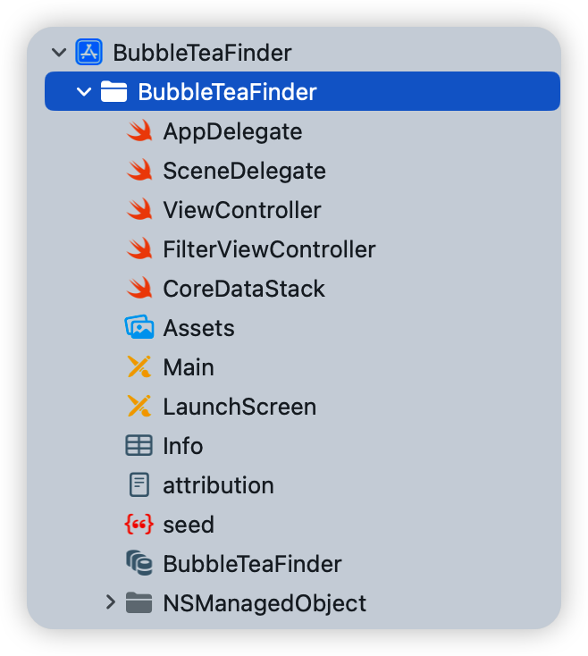

事实证明，您在本书第一部分必须完成的大部分 Core Data 设置都已准备好供您使用。以下是您在入门项目中获得的组件的快速概述，分为几类：

- Seed data：seed.json 是一个 JSON 文件，其中包含纽约市 bubble tea 的场所的真实场所数据。由于这是来自 Foursquare 的真实数据，因此结构比本书之前使用的 Seed data 更复杂。

- Data model：点击 BubbleTeaFinder.xcdatamodeld 打开 Xcode 的模型编辑器。最重要的实体是 Venue。它包含场地名称、电话号码和目前提供的特价商品数量等属性。

  由于 JSON 数据相当复杂，Data model 将场所的信息分解为其他 entity。它们是 Category、 Location、 PriceInfo 和 Stats。

- Managed object 子类：数据模型中的所有实体也有相应的 NSManagedObject 子类。它们是 Venue+CoreDataClass.swift、Location+CoreDataClass.swift、PriceInfo+CoreDataClass.swift、Category+CoreDataClass.swift 和 Stats+CoreDataClass.swift。您可以在 NSManagedObject 组中找到它们及其随附的 EntityName+CoreDataProperties.swift 文件。

- CoreDataStack：与前面的章节一样，这个对象包装了一个 NSPersistentContainer 对象，它本身包含 Core Date 对象的核心，称为“stack”；the context、the model、the persistent store、the persistent store coordinator。无需设置 - 它随时可用。

- ViewController：显示场地列表的初始视图控制器是 ViewController.swift。首次启动时，初始视图控制器从 seed.json 中读取，创建相应的 Core Data object 并将它们保存到 persistent store 中。点击右上角的 Filter 按钮会弹出 FilterViewController.swift。目前这里没有发生太多事情。在本节中，您将向这两个文件添加代码。

当您第一次启动示例应用程序时，您只会看到静态信息。但是，您的应用委托已经从 seed.json 中读取了种子数据，将其解析为核心数据对象并将它们保存到持久存储中。

您的第一个任务是获取此数据并将其显示在表视图中。


## 存储 fetch 请求

如前所述，您可以在数据模型中存储经常使用的 fetch 请求。这不仅使它们更易于访问，而且您还可以获得使用基于 GUI 的工具来设置获取请求参数的好处。

打开 BubbleTeaFinder.xcdatamodeld 并长按“Add Entity”按钮：


从菜单中选择 Add Fetch Request。这将在左侧栏上创建一个新的获取请求，并将您带到一个特殊的 fetch request editor：


> 注意：您可以单击左侧边栏中新创建的 FetchRequest 来更改其名称。


使用 Xcode  data model editor 中的可视化工具，您可以根据需要将获取请求设置为 general 或者 specific。首先，创建一个 fetch request，从持久存储中检索所有 Venue 对象。

您只需在此处进行一项更改：单击 Fetch all 旁边的下拉菜单并选择 Venue。


这就是你需要做的。如果您想使用额外的 predicate 来优化您的获取请求，您还可以从 fetch request editor 中添加条件。

是时候试用一下您新创建的获取请求了。打开 ViewController.swift 并在 coreDataStack 下面添加以下两个属性：

```swift
var fetchRequest: NSFetchRequest<Venue>?
var venues: [Venue] = []
```

第一个属性将保存您的 fetchRequest。 第二个属性是将用于填充表视图的 Venue 对象数组。

接下来，将以下内容添加到 viewDidLoad() 的末尾：

```swift
guard let model = 
  coreDataStack.managedContext
    .persistentStoreCoordinator?.managedObjectModel,
  let fetchRequest = model
    .fetchRequestTemplate(forName: "FetchRequest")
    as? NSFetchRequest<Venue> else {
      return
}
self.fetchRequest = fetchRequest
fetchAndReload()
```

这样做会将您刚刚设置的 fetchRequest 属性连接到您使用 Xcode 的 data model editor 创建的属性。 这里要记住三件事：

1. 与获取 fetch 请求的其他方式不同，这种方式涉及 managed object model。 这就是为什么您必须通过 coreDataStack 属性来检索您的 fetch 请求的原因。

2. 正如您在上一章中看到的，您构建了 CoreDataStack，因此只有 managed context 是公共的。要检索 managed object model，您必须通过 managed context 的 persistent store coordinator。

3. NSManagedObjectModel 的 fetchRequestTemplate(forName:) 接受一个字符串标识符。此标识符必须与您在模型编辑器中为获取请求选择的名称完全匹配。否则，您的应用程序将抛出异常并崩溃。

最后一行调用了一个你还没有定义的方法，所以 Xcode 会报错。要解决这个问题，请在 UITableViewDataSource 扩展之上添加以下扩展：

```swift
// MARK: - Helper methods
extension ViewController {

  func fetchAndReload() {

    guard let fetchRequest = fetchRequest else {
      return
    }
    
    do {
      venues =
        try coreDataStack.managedContext.fetch(fetchRequest)
      tableView.reloadData()
    } catch let error as NSError {
      print("Could not fetch \(error), \(error.userInfo)")
    }

  }
}
```

顾名思义，fetchAndReload() 执行获取请求并重新加载表视图。此类中的其他方法需要查看获取的对象，因此您将获取的结果存储在之前定义的 venues 属性中。

在运行示例项目之前，您还需要做一件事：将表视图的数据源与获取的 Venue 对象连接起来。

在 UITableViewDataSource 扩展中，将 tableView(\_:numberOfRowsInSection:) 和 tableView\(_:cellForRowAt:) 的占位符实现替换为以下内容：

```swift
func tableView(_ tableView: UITableView,
               numberOfRowsInSection section: Int) -> Int {
  venues.count
}

func tableView(_ tableView: UITableView,
               cellForRowAt indexPath: IndexPath)
               -> UITableViewCell {

  let cell =
    tableView.dequeueReusableCell(
      withIdentifier: venueCellIdentifier, for: indexPath)

  let venue = venues[indexPath.row]
  cell.textLabel?.text = venue.name
  cell.detailTextLabel?.text = venue.priceInfo?.priceCategory  
  return cell
}
```

你已经在本书中多次实现了这些方法，所以你可能熟悉它们的作用。 第一个方法，tableView(_:numberOfRowsInSection:)，将表格视图中的单元格数量与 venues 数组中获取的对象数量相匹配。

第二种方法，tableView(_:cellForRowAt:)，将给定索引路径的单元格出队，并使用 venues 数组中相应 Venue 的信息填充它。 在这种情况下，主标签获取场地名称，详细标签获取价格类别，该价格类别是三个可能值之一：$、$$ 或 $$$。

构建并运行项目，您将看到以下内容：


向下滚动列表。这些都是纽约市真正出售这种美味饮品的地方。

> 注意：什么时候应该在 data model 中存储 fetch request？
>
> 如果您知道您将在应用程序的不同部分反复进行相同的 fetch，则可以使用此功能来避免多次编写相同的代码。存储  fetch request 的一个缺点是无法指定结果的排序顺序。因此，您看到的场地列表可能与截图中的顺序不同。


## fetch 不同的 result type

一直以来，您可能一直认为 NSFetchRequest 是一个相当简单的工具。你给它一些指令，你会得到一些东西作为回报。还有什么呢？

如果是这样的话，你就低估了这个 class。 NSFetchRequest 是 Core Data 框架的多功能瑞士军刀！

您可以使用它来获取单个值，计算数据的统计信息，例如平均值、最小值、最大值等。

你问这怎么可能？ NSFetchRequest 有一个名为 resultType 的属性。到目前为止，您只使用了默认值 .managedObjectResultType。以下是获取请求的 resultType 的所有可能值：

- .managedObjectResultType：返回 managed objects（默认值）。

- .countResultType：返回匹配 fetch request 的对象的计数。

- .dictionaryResultType：这是一个包罗万象的返回类型，用于返回不同计算的结果。

- .managedObjectIDResultType：返回唯一标识符而不是完整的 managed objects。

让我们回到示例项目并在实践中应用这些概念。

在示例项目运行的情况下，点击右上角的 Filter 以调出过滤器屏幕的 UI。

您现在不会实施实际的过滤器或排序。相反，您将关注以下四个标签：


筛选分为三个部分：价格、最受欢迎和排序方式。 最后一部分在技术上不是由“filters”组成的，但排序通常与过滤器密切相关，所以你可以这样保留它。

每个价格过滤器下方是属于该价格类别的场地总数的空间。 同样，所有场所的交易总数都有一个位置。 接下来您将实现这些。


### return count

打开 FilterViewController.swift 并在 import UIKit 下方添加以下内容：

```swift
import CoreData
```

接下来，在最后一个 @IBOutlet 属性下面添加以下属性：

```swift
// MARK: - Properties
var coreDataStack: CoreDataStack!
```

这将保存对您在 ViewController.swift 中使用的 CoreDataStack 对象的引用。

接下来，打开 ViewController.swift 并将 prepare(for:sender:) 实现替换为以下内容：

```swift
override func prepare(for segue: UIStoryboardSegue,
                      sender: Any?) {

  guard segue.identifier == filterViewControllerSegueIdentifier,
    let navController = segue.destination
      as? UINavigationController,
    let filterVC = navController.topViewController
      as? FilterViewController else {
        return
  }

  filterVC.coreDataStack = coreDataStack
}
```

新的代码行将 CoreDataStack 对象从 ViewController 传到 FilterViewController。 

打开 FilterViewController.swift 并在 coreDataStack 下面添加以下惰性属性：

```swift
lazy var cheapVenuePredicate: NSPredicate = {
  return NSPredicate(format: "%K == %@", 
    #keyPath(Venue.priceInfo.priceCategory), "$")
}()
```

您将使用这个延迟实例化的 NSPredicate 来计算最低价格类别中的场所数量。

> 注意：NSPredicate 支持基于字符串的 #keyPath。 这就是为什么您可以使用 priceInfo.priceCategory 从 Venue entity 取到 PriceInfo entity，并使用 #keyPath 关键字来获取关键路径的安全、编译时检查值。


接下来，在 UITableViewDelegate 扩展下面添加以下扩展：

```swift
// MARK: - Helper methods
extension FilterViewController {

  func populateCheapVenueCountLabel() {

    let fetchRequest =
      NSFetchRequest<NSNumber>(entityName: "Venue")
    fetchRequest.resultType = .countResultType
    fetchRequest.predicate = cheapVenuePredicate
      
    do {
      let countResult =
        try coreDataStack.managedContext.fetch(fetchRequest)
    
      let count = countResult.first?.intValue ?? 0
      let pluralized = count == 1 ? "place" : "places"
      firstPriceCategoryLabel.text = 
        "\(count) bubble tea \(pluralized)"
    } catch let error as NSError {
      print("count not fetched \(error), \(error.userInfo)")
    }

  }
}
```

此扩展提供 populateCheapVenueCountLabel()，它创建一个获取请求以获取 Venue 实体。 然后将结果类型设置为 .countResultType 并将获取请求的谓词设置为 cheapVenuePredicate。 请注意，为了使其正常工作，获取请求的类型参数必须是 NSNumber，而不是 Venue。

当您将获取结果的结果类型设置为 .countResultType 时，返回值将变为包含单个 NSNumber 的 Swift 数组。 NSNumber 中的整数是您要查找的总数。

再一次，您针对 CoreDataStack 的 NSManagedObjectContext 属性执行获取请求。 然后从结果 NSNumber 中提取整数并使用它来填充 firstPriceCategoryLabel。

在运行示例应用程序之前，将以下内容添加到 viewDidLoad() 的底部：

```swift
populateCheapVenueCountLabel()
```

现在构建并运行以测试这些更改是否生效：

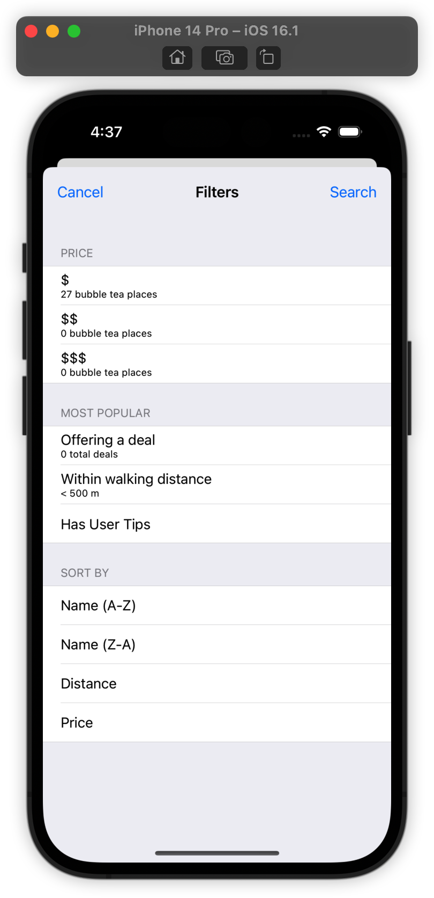


第一个价格过滤器下的标签现在显示为“27”。万岁！您已经成功地使用 NSFetchRequest 来计算计数。

> 注意：您可能认为您可以轻松获取实际的 Venue 对象并从数组的 count 属性中获取计数。确实如此。获取计数而不是对象主要是一种性能优化。例如，如果您有纽约市的人口普查数据并且想知道有多少人居住在其大都市区，您更愿意 Core Data 给您数字 8,300,000（整数）还是一个包含 8,300,000 条记录的数组？
>
> 显然，直接获取计数更节省内存。有一整章专门讨论 Core Data 性能。如果您想了解更多有关 Core Data 中性能优化的信息，请查看第 8 节“衡量和提升性能”。

现在您已经熟悉了计数结果类型，您可以快速实现第二个价格类别过滤器的计数。在 cheapVenuePredicate 下面添加以下惰性属性：

```swift
lazy var moderateVenuePredicate: NSPredicate = {
  return NSPredicate(format: "%K == %@", 
    #keyPath(Venue.priceInfo.priceCategory), "$$")
}()
```

这个 NSPredicate 几乎与 cheap venue predicate 相同，除了这个匹配 $$ 而不是 $。同样，在 populateCheapVenueCountLabel() 下面添加如下方法：

```swift
func populateModerateVenueCountLabel() {

  let fetchRequest = 
    NSFetchRequest<NSNumber>(entityName: "Venue")
  fetchRequest.resultType = .countResultType
  fetchRequest.predicate = moderateVenuePredicate

  do {
    

    let countResult = 
      try coreDataStack.managedContext.fetch(fetchRequest)
    
    let count = countResult.first?.intValue ?? 0
    let pluralized = count == 1 ? "place" : "places"
    secondPriceCategoryLabel.text = 
      "\(count) bubble tea \(pluralized)"

  } catch let error as NSError {
    print("count not fetched \(error), \(error.userInfo)")
  }
}
```

最后，将以下行添加到 viewDidLoad() 的底部以调用您新定义的方法：

```swift
populateModerateVenueCountLabel()
```

构建并运行示例项目。 和以前一样，点击右上角的 Filter：

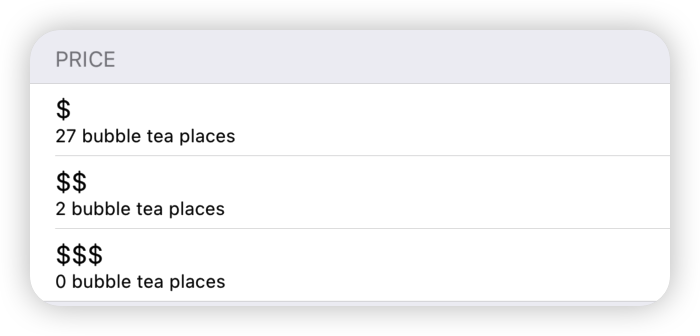

珍珠奶茶爱好者的好消息！ 只有两个地方价格适中。 珍珠奶茶作为一个整体似乎很容易获得。


### 另一种获取计数的方法

现在您已经熟悉了 .countResultType，是时候提一下有一个替代 API 可以直接从 Core Data 中获取计数。

由于还有一个价格类别计数需要实施，您现在将使用此备用 API。

在 moderateVenuePredicate 下面添加以下惰性属性：

```swift
lazy var expensiveVenuePredicate: NSPredicate = {
  return NSPredicate(format: "%K == %@", 
    #keyPath(Venue.priceInfo.priceCategory), "$$$")
}()
```

接下来，在 populateModerateVenueCountLabel() 下面实现以下方法：

```swift
func populateExpensiveVenueCountLabel() {

  let fetchRequest: NSFetchRequest<Venue> = Venue.fetchRequest()
  fetchRequest.predicate = expensiveVenuePredicate

  do {
    let count =
      try coreDataStack.managedContext.count(for: fetchRequest)
    let pluralized = count == 1 ? "place" : "places"
    thirdPriceCategoryLabel.text = 
      "\(count) bubble tea \(pluralized)"
  } catch let error as NSError {
    print("count not fetched \(error), \(error.userInfo)")
  }
}
```

与前两个场景一样，您创建一个获取请求以检索 Venue 对象。

接下来，设置您之前定义为惰性属性的谓词：expensiveVenuePredicate。

此场景与后两个场景的区别在于，您没有将结果类型设置为 .countResultType。而不是通常的 fetch(_:)，而是使用 NSManagedObjectContext 的方法 count(for:)。

count(for:) 的返回值是一个整数，您可以直接使用它来填充第三个价格类别标签。最后，将以下行添加到 viewDidLoad() 的底部以调用您新定义的方法：

```swift
populateExpensiveVenueCountLabel()
```

构建并运行以查看您的最新更改是否生效：


## 使用 fetch 请求执行计算

所有三个价格类别标签都填充了属于每个类别的场所数量。下一步是在“提供交易”下填充标签。它目前说“0 笔交易”。那是不对的！

这些信息究竟从何而来？ Venue 有一个 specialCount 属性，用于捕获该场所当前提供的交易数量。与价格类别下的标签不同，您现在需要了解所有场馆的交易总额，因为特别精明的场馆可能会同时进行多项交易。

天真的方法是将所有场所加载到内存中，然后使用 for 循环对它们的交易求和。如果你希望有更好的方法，那么你很幸运：Core Data 内置了对许多不同函数的支持，例如 average、sum、min 和 max。

打开 FilterViewController.swift，在 populateExpensiveVenueCountLabel() 下面添加如下方法：

```swift
func populateDealsCountLabel() {

  // 1
  let fetchRequest = 
    NSFetchRequest<NSDictionary>(entityName: "Venue")
  fetchRequest.resultType = .dictionaryResultType

  // 2
  let sumExpressionDesc = NSExpressionDescription()
  sumExpressionDesc.name = "sumDeals"

  // 3
  let specialCountExp = 
    NSExpression(forKeyPath: #keyPath(Venue.specialCount))
  sumExpressionDesc.expression = 
    NSExpression(forFunction: "sum:",
                 arguments: [specialCountExp])
  sumExpressionDesc.expressionResultType =
    .integer32AttributeType

  // 4
  fetchRequest.propertiesToFetch = [sumExpressionDesc]

  // 5
  do {

    let results = 
      try coreDataStack.managedContext.fetch(fetchRequest)
    
    let resultDict = results.first
    let numDeals = resultDict?["sumDeals"] as? Int ?? 0
    let pluralized = numDeals == 1 ?  "deal" : "deals"
    numDealsLabel.text = "\(numDeals) \(pluralized)"

  } catch let error as NSError {
    print("count not fetched \(error), \(error.userInfo)")
  }
}
```

这个方法包含了一些你之前在书中没有遇到过的类，所以这里依次解释一下：

1. 您首先创建用于检索 Venue 对象的典型提取请求。接下来，您将结果类型指定为 .dictionaryResultType。

2. 您创建一个 NSExpressionDescription 来请求总和，并将其命名为 sumDeals，这样您就可以从获取请求返回的结果字典中读取它的结果。

3. 你给表达式描述一个 NSExpression 来指定你想要求和函数。接下来，为该表达式提供另一个 NSExpression 以指定要求和的属性——在本例中为 specialCount。最后，您必须设置表达式描述的返回数据类型，因此将其设置为 integer32AttributeType。

4. 通过将其 propertiesToFetch 属性设置为您刚创建的表达式描述，您告诉原始获取请求获取总和。

5. 最后，在通常的 do-catch 语句中执行 fetch 请求。结果类型是一个 NSDictionary 数组，因此您可以使用表达式描述的名称 (sumDeals) 检索表达式的结果，这样就完成了！

> 注意：Core Data 还支持哪些其他功能？仅举几例：计数、最小值、最大值、平均值、中值、众数、绝对值等等。有关完整列表，请查看 Apple 的 NSExpression 文档。

从 Core Data 获取计算值需要您遵循许多通常不直观的步骤，因此请确保您有充分的理由使用此技术，例如性能方面的考虑。最后，将以下行添加到 viewDidLoad() 的底部：

```swift
populateDealsCountLabel()
```

构建示例项目并打开筛选/排序屏幕以验证您的更改：

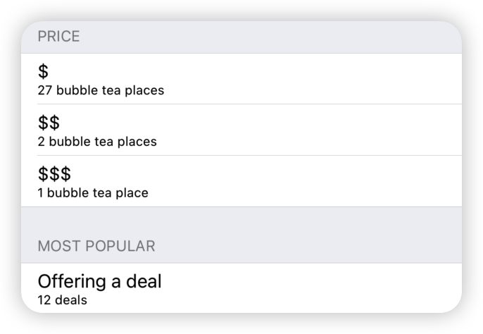

您现在已经使用了四种受支持的 NSFetchRequest 结果类型中的三种：.managedObjectResultType、.countResultType 和 .dictionaryResultType。

剩下的结果类型是 .managedObjectIDResultType。当你使用这种类型获取时，结果是一个 NSManagedObjectID 对象数组，而不是它们所代表的实际托管对象。 NSManagedObjectID 是托管对象的紧凑通用标识符。它就像数据库中的主键一样工作！

在 iOS 5 之前，通过 ID 获取很流行，因为 NSManagedObjectID 是线程安全的，使用它可以帮助开发人员实现线程限制并发模型。

现在线程限制已被弃用，取而代之的是更现代的并发模型，几乎没有理由再按对象 ID 获取了。

> 注意：您可以设置多个 managed object context 来运行并发操作，并使长时间运行的操作远离主线程。有关详细信息，请查看第 9 节“多个 managed object context”。


您已经体验了 fetch 请求可以为您做的所有事情。但与 fetch 请求返回的信息一样重要的是它没有返回的信息。出于实际原因，您必须在某个时候限制传入数据。

为什么？想象一个完美连接的对象图，其中每个 Core Data 对象都通过一系列关系连接到每个其他对象。如果 Core Data 没有对 fetch 请求返回的信息进行限制，那么你每次都会获取整个对象图！那不是内存有效的。

您可以手动限制从获取请求中获取的信息。例如，NSFetchRequest 支持批量获取。您可以使用属性 fetchBatchSize、fetchLimit 和 fetchOffset 来控制批处理行为。

Core Data 还尝试通过使用称为 faulting 的技术来为您最小化其内存消耗。fault 是一个占位符对象，表示尚未完全进入内存的 managed object。

另一种限制对象图的方法是使用 predicate，就像您在上面填充场地计数标签时所做的那样。让我们使用 predicate 将 Filter 添加到示例应用程序。

打开 FilterViewController.swift，并在类定义上方添加以下协议声明：

```swift
protocol FilterViewControllerDelegate: class {
  func filterViewController(
    filter: FilterViewController,
    didSelectPredicate predicate: NSPredicate?,
    sortDescriptor: NSSortDescriptor?)
}
```

该协议定义了一个委托方法，该方法将在用户选择新的排序/过滤组合时通知委托。

接下来，在 coreDataStack 下面添加以下三个属性：

```swift
weak var delegate: FilterViewControllerDelegate?
var selectedSortDescriptor: NSSortDescriptor?
var selectedPredicate: NSPredicate?
```

第一个属性将保存对 FilterViewController 委托的引用。 为了避免保留周期，它是一个 weak 属性。 第二个和第三个属性将分别保存对当前选择的 NSSortDescriptor 和 NSPredicate 的引用。

接下来，实现 search(\_:) 如下所示：

```swift
@IBAction func search(_ sender: UIBarButtonItem) {
  delegate?.filterViewController(
    filter: self,
    didSelectPredicate: selectedPredicate,
    sortDescriptor: selectedSortDescriptor)

  dismiss(animated: true)
}
```

这意味着每次您点右上角的搜索时，您都会通知 delegate 您的选择并关闭列表。

您需要在此文件中再做一项更改。 找到 tableView(\_:didSelectRowAt:) 并实现如下所示：

```swift
override func tableView(_ tableView: UITableView,
                        didSelectRowAt indexPath: IndexPath) {

  guard let cell = tableView.cellForRow(at: indexPath) else {
    return
  }

  // Price section
  switch cell {
  case cheapVenueCell:
    selectedPredicate = cheapVenuePredicate
  case moderateVenueCell:
    selectedPredicate = moderateVenuePredicate
  case expensiveVenueCell:
    selectedPredicate = expensiveVenuePredicate
  default: break
  }

  cell.accessoryType = .checkmark
}
```

当用户点击前三个价格类别单元格中的任何一个时，此方法会将所选单元格映射到适当的 predicate。 您将对此 predicate 的引用存储在 selectedPredicate 中，以便在您通知代理用户选择时准备就绪。

接下来，打开 ViewController.swift 并添加以下扩展以符合 FilterViewControllerDelegate 协议：

```swift
// MARK: - FilterViewControllerDelegate
extension ViewController: FilterViewControllerDelegate {

  func filterViewController(
    filter: FilterViewController,
    didSelectPredicate predicate: NSPredicate?,
    sortDescriptor: NSSortDescriptor?) {

    guard let fetchRequest = fetchRequest else {
      return
    }
    
    fetchRequest.predicate = nil
    fetchRequest.sortDescriptors = nil
    
    fetchRequest.predicate = predicate
    
    if let sort = sortDescriptor {
      fetchRequest.sortDescriptors = [sort]
    }
    
    fetchAndReload()

  }
}
```

添加 FilterViewControllerDelegate Swift 扩展告诉编译器这个类将符合这个协议。每次用户选择新的过滤器/排序组合时都会触发此委托方法。

在这里，您重置获取请求的谓词和排序描述符，然后设置传递给方法的谓词和排序描述符并重新加载数据。

在测试价格类别过滤器之前，您还需要做一件事。找到 prepare(for:sender:) 并将以下行添加到方法的末尾：

```swift
filterVC.delegate = self
```

这将 ViewController 设置为 FilterViewController 的委托。

构建并运行示例项目。转到过滤器屏幕，点击第一个价格类别单元格（$），然后点击右上角的搜索。

您的应用程序崩溃并在控制台中显示以下错误消息：

```
*** Terminating app due to uncaught exception 'NSInternalInconsistencyException', reason: 'Can't modify a named fetch request in an immutable model.'
```

发生了什么？在本章的前面，您在数据模型中定义了获取请求。事实证明，如果您使用该技术，获取请求将变得不可变。你不能在运行时改变它的 predicate，否则你会崩溃。如果你想以任何方式修改获取请求，你必须提前在数据模型编辑器中进行。

打开 ViewController.swift，并将 viewDidLoad() 替换为以下内容：

```swift
override func viewDidLoad() {
  super.viewDidLoad()

  importJSONSeedDataIfNeeded()

  fetchRequest = Venue.fetchRequest()
  fetchAndReload()
}
```

您删除了从 managed object model 中的模板检索提取请求的行。 相反，您直接从 Venue 实体获取 NSFetchRequest 的实例。

再次构建并运行示例应用程序。 转到过滤器屏幕，点击第二个价格类别单元格（$$），然后点击右上角的搜索。

这是结果：

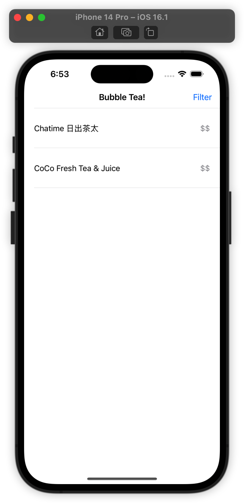

不出所料，该类别中只有两个 venue。您将练习为其余过滤器编写更多 predicates。 该过程与您已经完成的过程类似，因此这次您将进行较少的解释。

打开 FilterViewController.swift 并在 expensiveVenuePredicate 下面添加这三个 lazy 属性：

```swift
lazy var offeringDealPredicate: NSPredicate = {
  return NSPredicate(format: "%K > 0",
    #keyPath(Venue.specialCount))
}()

lazy var walkingDistancePredicate: NSPredicate = {
  return NSPredicate(format: "%K < 500",
    #keyPath(Venue.location.distance))
}()

lazy var hasUserTipsPredicate: NSPredicate = {
  return NSPredicate(format: "%K > 0",
    #keyPath(Venue.stats.tipCount))
}()
```

第一个 predicate 指定当前提供一个或多个 venue，第二个 predicate 指定距离您当前位置不到 500 米的场所，第三个 predicate 指定至少有一个用户提示的 venue。

> 注意：到目前为止，在本书中，您已经编写了具有单一条件的 predicate。您还应该知道，您可以使用复合 predicate 运算符（如 AND、OR 和 NOT）编写检查两个条件而不是一个条件的 predicate。
>
> 或者，您可以使用类 NSCompoundPredicate 将两个简单 predicate 串成一个 compound predicate。
>
> NSPredicate 在技术上不是 Core Data 的一部分（它是 Foundation 的一部分）所以本书不会深入介绍它，但是你可以通过学习这个漂亮课程的来龙去脉来认真提高你的 Core Data 技能。有关更多信息，请务必查看 Apple 的谓词编程指南：
>
> https://developer.apple.com/library/archive/documentation/Cocoa/Conceptual/Predicates/Articles/pUsing.html

接下来，向下滚动到 tableView(\_:didSelectRowAt:)。您将向之前添加的 switch 语句中再添加三种情况：

```swift
override func tableView(_ tableView: UITableView, didSelectRowAt indexPath: IndexPath) {

  guard let cell = tableView.cellForRow(at: indexPath) else {
    return
  }

  switch cell {
  // Price section
  case cheapVenueCell:
    selectedPredicate = cheapVenuePredicate
  case moderateVenueCell:
    selectedPredicate = moderateVenuePredicate
  case expensiveVenueCell:
    selectedPredicate = expensiveVenuePredicate
    
  // Most Popular section
  case offeringDealCell:
    selectedPredicate = offeringDealPredicate
  case walkingDistanceCell:
    selectedPredicate = walkingDistancePredicate
  case userTipsCell:
    selectedPredicate = hasUserTipsPredicate
  default: break
  }

  cell.accessoryType = .checkmark
}
```

在上面，您添加了 offeringDealCell、walkingDistanceCell 和 userTipsCell 的案例。 这些是您现在为其添加支持的三个新过滤器。

这就是你需要做的。 构建并运行示例应用程序。 转到过滤器页面，选择提供交易过滤器并点击搜索：


你会看到总共六个场地。 请注意，由于您没有指定排序描述符，您的场所列表可能与屏幕截图中的场所顺序不同。


## 对 fetch 的结果进行排序

NSFetchRequest 的另一个强大功能是它能够为您对获取的结果进行排序。它通过使用另一个方便的基础类 NSSortDescriptor 来做到这一点。这些排序发生在 SQLite 级别，而不是内存中。这使得 Core Data 中的排序变得快速高效。

在本节中，您将实现四种不同的排序来完成过滤/排序屏幕。

打开 FilterViewController.swift 并在 hasUserTipsPredicate 下面添加以下三个惰性属性：

```swift
lazy var nameSortDescriptor: NSSortDescriptor = {
  let compareSelector =
    #selector(NSString.localizedStandardCompare(_:))
  return NSSortDescriptor(key: #keyPath(Venue.name),
                          ascending: true,
                          selector: compareSelector)
}()

lazy var distanceSortDescriptor: NSSortDescriptor = {
  return NSSortDescriptor(
    key: #keyPath(Venue.location.distance),
    ascending: true)
}()

lazy var priceSortDescriptor: NSSortDescriptor = {
  return NSSortDescriptor(
    key: #keyPath(Venue.priceInfo.priceCategory),
    ascending: true)
}()
```

添加 sort descriptor 的方式与添加过滤器的方式非常相似。每个排序描述符都映射到这三个 lazy NSSortDescriptor 属性之一。

要初始化 NSSortDescriptor 的实例，您需要三样东西：指定要排序的属性的 key path、排序是升序还是降序的说明以及执行比较操作的可选 selector。

> 注意：如果你以前使用过 NSSortDescriptor，那么你可能知道有一个基于 block 的 API，它使用比较器而不是选择器。不幸的是，Core Data 不支持这种定义排序描述符的方法。
>
> 同样的事情也适用于定义 NSPredicate 的基于 block 的方法。 Core Data 也不支持这个。原因是过滤和排序发生在 SQLite 数据库中，因此 predicate/sort descriptor 必须很好地匹配可以编写为 SQL 语句的内容。

三个排序描述符将分别按名称、距离和价格类别升序排序。在继续之前，请仔细查看第一个排序描述符 nameSortDescriptor。初始化器接受一个可选的选择器，NSString.localizedStandardCompare(_:)。那是什么？

每当您对面向用户的字符串进行排序时，Apple 建议您传入 NSString.localizedStandardCompare(_:) 以根据当前语言环境的语言规则进行排序。这意味着 sort 将“正常工作”并为具有特殊字符的语言做正确的事情。

接下来，找到 tableView(_:didSelectRowAt:) 并将以下 case 添加到 default case 上方的 switch 语句的末尾：

```swift
// Sort By section
case nameAZSortCell:
  selectedSortDescriptor = nameSortDescriptor
case nameZASortCell:
  selectedSortDescriptor =
    nameSortDescriptor.reversedSortDescriptor
    as? NSSortDescriptor
case distanceSortCell:
  selectedSortDescriptor = distanceSortDescriptor
case priceSortCell:
  selectedSortDescriptor = priceSortDescriptor
```

与之前一样，此 switch 语句将用户点击的单元格与适当的排序描述符相匹配，因此当用户点击搜索时它已准备好传递给委托。

唯一的问题是 nameZA sort descriptor。无需创建单独的 sort descriptor，您可以重用 A-Z 的排序描述符并简单地调用 reversedSortDescriptor 方法。多么方便！

其他一切都连接起来供您测试您刚刚实施的种类。构建并运行示例应用程序。点击名称 (Z-A) 排序，然后点击搜索。您会看到这样排序的搜索结果：


当您向下滚动表格视图时，您会看到该应用程序确实按字母顺序从 Z 到 A 对场地进行了排序。

您现在已经完成了过滤器，设置它以便用户可以将任何一个过滤器与任何一种类型组合在一起。尝试不同的组合，看看你得到了什么。 venue cell显示的信息不多，所以如果需要验证排序，可以直接上源码查阅 seed.json。


## 异步 fetch

如果您已经达到这一点，那么既有好消息也有坏消息（然后是更多好消息）。好消息是你已经学到了很多关于你可以用普通的 NSFetchRequest 做什么的知识。坏消息是，到目前为止，您执行的每个获取请求都在等待结果返回时阻塞了主线程。

当您阻塞主线程时，它会使屏幕对传入的触摸没有响应并产生一系列其他问题。你没有感觉到主线程的这种阻塞，因为你发出了一次获取几个对象的简单获取请求。

从 Core Data 开始，该框架就为开发人员提供了多种在后台执行提取的技术。从 iOS 8 开始，Core Data 有一个 API，用于在后台执行长时间运行的提取请求，并在提取完成时获得完成回调。

让我们看看这个新 API 的实际应用。打开 ViewController.swift 并在 venues 下面添加以下属性：

```swift
var asyncFetchRequest: NSAsynchronousFetchRequest<Venue>?
```

你有它。负责这种异步魔法的类被恰当地称为 NSAsynchronousFetchRequest。不过，不要被它的名字所迷惑。它与 NSFetchRequest 没有直接关系；它实际上是 NSPersistentStoreRequest 的子类。

接下来，将 viewDidLoad() 的内容替换为以下内容：

```swift
override func viewDidLoad() {
  super.viewDidLoad()

  importJSONSeedDataIfNeeded()

  // 1
  let venueFetchRequest: NSFetchRequest<Venue> = 
    Venue.fetchRequest()
  fetchRequest = venueFetchRequest

  // 2
  asyncFetchRequest =
    NSAsynchronousFetchRequest<Venue>(
    fetchRequest: venueFetchRequest) {
      [unowned self] (result: NSAsynchronousFetchResult) in

      guard let venues = result.finalResult else {
        return
      }
    
      self.venues = venues
      self.tableView.reloadData()

  }

  // 3
  do {
    guard let asyncFetchRequest = asyncFetchRequest else {
      return
    }
    try coreDataStack.managedContext.execute(asyncFetchRequest)
    // Returns immediately, cancel here if you want
  } catch let error as NSError {
    print("Could not fetch \(error), \(error.userInfo)")
  }
}
```


有很多你以前没见过的，所以让我们一步一步地介绍它：

1. 请注意，异步获取请求不会取代常规 fetch 请求。相反，您可以将异步获取请求视为您已有的 fetch 请求的 wrapper。

2. 要创建 NSAsynchronousFetchRequest，您需要两件事：一个普通的旧 NSFetchRequest 和一个 completion handler。你获取的地点包含在 NSAsynchronousFetchResult 的 finalResult 属性中。在完成处理程序中，您更新 venues 属性并重新加载表视图。

3. 指定完成处理程序是不够的！您仍然必须执行异步获取请求。 CoreDataStack 的 managedContext 属性再次为您处理繁重的工作。但是，请注意您使用的方法不同——这次是 execute(\_:) 而不是通常的 fetch\(_:)。

execute(\_:) 立即返回。您不需要对返回值做任何事情，因为您将从 completion block 中更新表视图。返回类型是 NSAsynchronousFetchResult。

> 注意：作为此 API 的额外好处，您可以使用 NSAsynchronousFetchResult 的 cancel() 方法取消获取请求。


是时候看看您的异步提取是否按承诺交付了。如果一切顺利，您应该不会注意到用户界面有任何差异。

构建并运行示例应用程序，您应该会像以前一样看到场地列表：


万岁！你已经掌握了异步抓取。过滤器和排序也将起作用，除了它们仍然使用普通的 NSFetchRequest 来重新加载表视图。


## Batch updates：无 fetch 请求

有时，您从 Core Data 获取 objiect 的唯一原因是更改单个属性。然后，在您进行更改后，您必须将 Core Data object 提交回 persistent store 并收工。这是您一直遵循的正常流程。

但是如果你想一次更新十万条记录怎么办？获取所有这些对象只是为了更新一个属性将花费大量时间和大量内存。

幸运的是，从 iOS 8 开始，有一种新的方法可以更新 Core Data objects，而无需将任何内容提取到内存中：batch updates。这种新技术大大减少了进行这些大量更新所需的时间和内存量。

新技术绕过 NSManagedObjectContext 并直接进入persistent store。batch updates 的经典用例是消息传递应用程序或电子邮件客户端中的“全部标记为已读”功能。对于这个示例应用程序，您将做一些更有趣的事情。由于您非常喜欢珍珠奶茶，因此您会将 Core Data 中的每个地点标记为您的最爱。

让我们在实践中看看。打开 ViewController.swift 并将以下内容添加到 importJSONSeedDataIfNeeded() 调用下方的 viewDidLoad() 中：

```swift
let batchUpdate = NSBatchUpdateRequest(entityName: "Venue")
batchUpdate.propertiesToUpdate = 
  [#keyPath(Venue.favorite): true]

batchUpdate.affectedStores = 
  coreDataStack.managedContext
    .persistentStoreCoordinator?.persistentStores

batchUpdate.resultType = .updatedObjectsCountResultType

do {
  let batchResult = 
    try coreDataStack.managedContext.execute(batchUpdate)
      as? NSBatchUpdateResult
  print("Records updated \(String(describing: batchResult?.result))")
} catch let error as NSError {
  print("Could not update \(error), \(error.userInfo)")
}
```

您使用要更新的实体创建 NSBatchUpdateRequest 实例，在本例中为 Venue。

接下来，通过将 propertiesToUpdate 设置为一个字典来设置批量更新请求，该字典包含您要更新的属性的键路径 favorite 及其新值 true。然后将 affectedStores 设置为持久存储协调器的 persistentStores 数组。

最后，您将结果类型返回一个计数并执行您的批量更新请求。

构建并运行您的示例应用程序。如果一切正常，您将在控制台日志中看到以下内容：

```
Records updated Optional(30)
```

伟大的！ 您已经偷偷将纽约市的每家珍珠奶茶店标记为您的最爱。

现在你知道了如何在不将它们加载到内存的情况下更新你的 Core Data 对象。 是否还有另一个用例，您可能希望绕过 managed context 并直接在持久存储中更改核心数据对象？

当然有——batch deletion！

您不必为了删除对象而将对象加载到内存中，尤其是在处理大量对象时。 从 iOS 9 开始，你有 NSBatchDeleteRequest 用于此目的。

顾名思义，批量删除请求可以高效地一次性删除大量 Core Data 对象。

与 NSBatchUpdateRequest 一样，NSBatchDeleteRequest 也是 NSPersistentStoreRequest 的子类。 这两种批处理请求的行为相似，因为它们都直接在 persistent store 上操作。

> **注意**：由于您回避了 NSManagedObjectContext，因此如果您使用批量更新请求或批量删除请求，您将不会获得任何验证。您的更改也不会反映在您的  managed context。
>
> 在使用持久存储请求之前，请确保您正确地清理和验证了您的数据！


## 关键点

- NSFetchRequest 是一个**通用类型**。它采用一个类型参数，该参数指定您希望作为 fetch 请求的结果获得的对象类型。
- 如果您希望在应用程序的不同部分重复使用相同类型的提取，请考虑使用 Data Model Editor 将 不可变 fetch 请求直接存储在您的数据模型中。
- 使用 NSFetchRequest 的 **count** 结果类型来有效地计算和返回来自 SQLite 的计数。
- 使用 NSFetchRequest 的 **dictionary** 结果类型从 SQLite 中有效地计算和返回平均值、总和和其他常见计算。
- 获取请求使用不同的技术，例如使用**batch sizes**, **batch limits**和**faulting**来限制返回的信息量。
- 在您的抓取请求中添加 **sort description**，以高效地对 fetch 的结果进行排序。
- 获取大量信息会阻塞主线程。使用 NSAsynchronousFetchRequest 将部分工作卸载到后台线程。
- NSBatchUpdateRequest 和 NSBatchDeleteRequest 减少了更新或删除 Core Data 中大量记录所需的时间和内存量。


# 第 5 节：NSFetchedResultsController

如果您仔细阅读了前面的章节，您会注意到大多数示例项目都使用 UITableView。那是因为 Core Data 非常适合 UITableView。设置您的 fetch 请求，获取一组 managed objects 并将结果插入 UITableView 的数据源。这是一个常见场景。

 Apple 的 Core Data 框架的作者也是这么想的！事实上，他们看到了 UITableView 和 Core Data 之间紧密联系的巨大潜力，他们编写了一个类来正式化这种联系：NSFetchedResultsController。

顾名思义，NSFetchedResultsController 是一个 controller，但它不是 view controller。它没有用户界面。它的目的是通过抽象出将 UITableView 与 Core Data 支持的数据源同步所需的大部分代码，从而使开发人员的工作更轻松。

正确设置 NSFetchedResultsController，您的 table 将“神奇地”模仿其数据源，而您无需编写多行代码。在本节中，您将了解本课程的来龙去脉。您还将了解何时使用它以及何时不使用它。你准备好了吗？


## World Cup App

本章的示例项目是适用于 iOS 的世界杯记分牌应用程序。启动时，应用程序将列出所有参加世界杯的球队。点击一个国家的 cell 将使该国的胜利加一。在这个简化版的世界杯中，点击次数最多的国家将赢得比赛。这个排名大大简化了真正的淘汰规则，但对于演示目的来说已经足够了。

转到本章的文件并找到启动文件夹。打开 WorldCup.xcodeproj。构建并运行启动项目：


示例应用程序由表视图中的 20 个静态单元格组成。 那些明亮的蓝色方框是球队旗帜所在的地方。 您看到的不是真实 name，而是“Team name”。虽然示例项目不太令人兴奋，但它实际上为您做了很多设置。

打开项目导航器并查看启动项目中的完整文件列表：


在进入代码之前，让我们简要回顾一下每个开箱即用的类的功能。你会发现你在前面章节中手动完成的很多设置已经为你实现了。万岁！

- CoreDataStack：与前面的章节一样，这个对象包装了一个 NSPersistentContainer 的实例，它又包含核心数据对象的核心，称为“Stack”；the context、the model、the persistent store、the persistent store coordinator。不需要额外设置这个，它随时可用。

- ViewController：示例项目是一个单页应用程序，该文件代表该页面。第一次启动时，视图控制器从 seed.json 中读取，创建相应的 Core Data objects 并将它们保存到 persistent store 中。如果您对其 UI 元素感到好奇，请前往 Main.storyboard。有一个 table、一个 navigation 和一个 prototype cell。

- Team+CoreDataClass & Team+CoreDataProperties：这些文件代表一个国家的球队。它是一个 NSManagedObject 子类，其四个属性中的每一个都有属性：teamName、qualifyingZone、imageName 和 wins。如果您对其实体定义感到好奇，请前往 WorldCup.xcdatamodel。

- Assets.xcassets：示例项目的资产目录包含 seed.json 中每个国家/地区的国旗图像。

本书的前三章涵盖了上述 Core Data 概念。如果“managed object subclass”没有引起您的注意，或者如果您不确定 Core Data Stack 应该做什么，您可能需要返回并重新阅读相关章节。如果您准备好继续，您将开始实施世界杯应用程序。您可能已经知道上次谁赢得了世界杯，但这是您为您选择的国家/地区改写历史的机会，只需轻点几下！


## 这一切都始于一个获取请求……

NSFetchedResultsController 的核心是 NSFetchRequest 的结果的包装器。现在，示例项目包含静态信息。您将创建一个fetched results controller 以在 tableview 中显示来自 Core Data 的 teams 列表。

打开 ViewController.swift 并添加一个 lazy 属性以将获取的结果控制器保存在 coreDataStack 下方：

```swift
lazy var fetchedResultsController:
  NSFetchedResultsController<Team> = {
  // 1
  let fetchRequest: NSFetchRequest<Team> = Team.fetchRequest()

  // 2
  let fetchedResultsController = NSFetchedResultsController(
    fetchRequest: fetchRequest,
    managedObjectContext: coreDataStack.managedContext,
    sectionNameKeyPath: nil,
    cacheName: nil)

  return fetchedResultsController
}()
```

与 NSFetchRequest 一样，NSFetchedResultsController 需要一个通用类型参数，在本例中为 Team，以指定您希望使用的 entity 类型。让我们一步一步地完成这个过程：

1. fetched results controller 处理 Core Data 和你的 table view 之间的协调，但它仍然需要你提供一个 NSFetchRequest。请记住 NSFetchRequest 类是高度可定制的。它可以采用 sort descriptors, predicates 等。

   在此示例中，您直接从 Team 类获取 NSFetchRequest，因为您想要获取所有 Team 对象。

2. fetched results controller 的初始化方法有四个参数：首先是您刚刚创建的 fetch 请求。

   第二个参数是 NSManagedObjectContext 的实例。与 NSFetchRequest 一样，获取结果控制器类需要一个 managed object context 来执行 fetch。它实际上不能自己获取任何东西。

   其他两个参数是可选的：sectionNameKeyPath 和 cacheName。现在将它们留空；您将在本节后面阅读更多关于它们的信息。

接下来，将以下代码添加到 viewDidLoad() 的末尾以实际执行 fetch：

```swift
do {
  try fetchedResultsController.performFetch()
} catch let error as NSError {
  print("Fetching error: \(error), \(error.userInfo)")
}
```

在这里执行 fetch 请求。如果有错误，您将错误记录到控制台。

但是等一下……你获取的结果在哪里？使用 NSFetchRequest 获取返回结果数组，使用 NSFetchedResultsController 获取不返回任何内容。

NSFetchedResultsController 既是获取请求的包装器，也是获取结果的容器。您可以使用 fetchedObjects 属性或 object(at:) 方法获取它们。

接下来，您将把获取的 ResultsController 连接到常用的 tableView 数据源方法。获取的结果决定了部分的数量和每个部分的行数。

考虑到这一点，重新实现 numberOfSections(in:) 和 tableView(_:numberOfRowsInSection:)，如下所示：

```swift
func numberOfSections(in tableView: UITableView) -> Int {
  fetchedResultsController.sections?.count ?? 0
}

func tableView(_ tableView: UITableView,
               numberOfRowsInSection section: Int)
               -> Int {
  guard let sectionInfo = 
    fetchedResultsController.sections?[section] else {
      return 0
  }

  return sectionInfo.numberOfObjects
}
```

tableView 中的 sections 数对应于 fetchedResultsController 中的 sections 数。您可能想知道这个 tableView 怎么可以有多个部分。你不是简单地获取并显示所有 Team 吗？

没错。这次您将只有一个部分，但请记住 NSFetchedResultsController 可以将您的数据分成多个 section。您将在本章后面看到这样的示例。

此外，每个 tableView section 中的 rows 对应于每个 fetchedResultsController section 中的 numberOfObjects。您可以通过其 sections 属性查询有关 fetchedResultsController section 的信息。

> 注意：sections 数组包含实现 NSFetchedResultsSectionInfo 协议的不透明对象。此轻量级协议提供有关 section 的信息，例如其 title 和 object 数。


实现 tableView(_:cellForRowAt:) 通常是下一步。

然而，快速浏览一下该方法就会发现它已经在根据 TeamCell 需要调用 configure。您需要更改的是填充单元格的辅助方法。找到 configure(cell:for:) 并将其替换为以下内容：

```swift
func configure(cell: UITableViewCell,
               for indexPath: IndexPath) {
  guard let cell = cell as? TeamCell else {
      return
  }

  let team = fetchedResultsController.object(at: indexPath)
  cell.teamLabel.text = team.teamName
  cell.scoreLabel.text = "Wins: \(team.wins)"

  if let imageName = team.imageName {
    cell.flagImageView.image = UIImage(named: imageName)
  } else {
    cell.flagImageView.image = nil
  }
}
```

此方法采用 cell 和 indexPath。您使用此 indexPath 从 fetchedResultsController 中获取相应的 Team 对象。

接下来，您使用 Team 对象填充 cell 的旗 teamLabel、scoreLabel 和 flagImageView。

再次注意没有数组变量保存你的 Team。它们都存储在 fetched results controller 中，你可以通过 object(at:) 访问它们。

是时候测试您的创作了。构建并运行应用程序。准备好，设置和......崩溃？

```
Terminating app due to uncaught exception 'NSInvalidArgumentException', reason: 'An instance of NSFetchedResultsController requires a fetch request with sort descriptors'
```

发生了什么？ NSFetchedResultsController 正在帮助您解决这个问题，尽管您可能并不喜欢它！

如果你想用它来填充 tableview 并让它知道哪个 managed object 应该出现在哪个 indexPath，你不能只给它一个基本的获取请求。

它的最低要求是您设置一个 entity description，它将获取该 entity 类型的所有对象。然而，NSFetchedResultsController 至少需要一个排序描述符。否则，它怎么知道你的表视图的正确顺序？

回到 fetchedResultsController 惰性属性，在 let fetchRequest 之后添加如下几行：

```swift
let sort = NSSortDescriptor(
  key: #keyPath(Team.teamName),
  ascending: true)
fetchRequest.sortDescriptors = [sort]
```

添加此排序描述符将按字母顺序从 A 到 Z 显示团队并修复较早的崩溃。构建并运行应用程序。

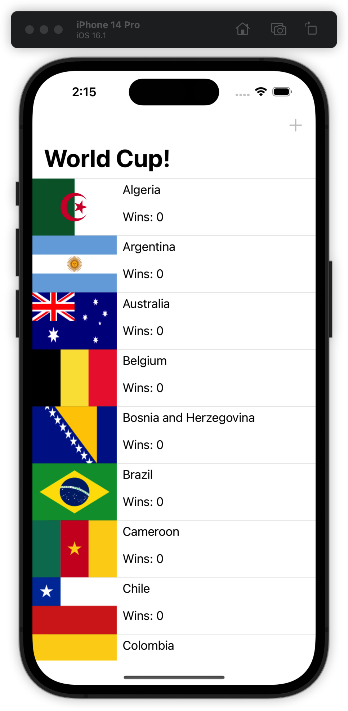

成功！ 世界杯参赛者的完整名单在您的设备或 iOS 模拟器上。 但是请注意，每个国家的胜利都是零，并且没有办法增加分数。 


### 修改数据

让我们修复每个人的零分并添加一些代码来增加获胜次数。 仍然在 ViewController.swift 中，将表视图委托方法 tableView(\_:didSelectRowAt:) 的当前空实现替换为以下内容：

```swift
func tableView(_ tableView: UITableView,
               didSelectRowAt indexPath: IndexPath) {

  let team = fetchedResultsController.object(at: indexPath)
  team.wins += 1
  coreDataStack.saveContext()
}
```

当用户点击一行时，您将获取与 indexPath 对应的 Team，增加其获胜次数并将更改提交到 Core Data 的持久存储。

您可能认为 fetchedResultsController 仅适用于从 Core Data 获取结果，但您返回的 Team 对象是相同的 managed object 子类。 您可以像往常一样更新它们的值并保存。

再次构建并运行，并点击列表中的第一个国家（Algeria）几次：


这里发生了什么？ 您正在点击，但获胜的次数并没有增加。 您正在 Core Data 的底层持久存储中更新 Algeria 的获胜次数，但您没有触发 UI 刷新。 返回 Xcode，停止应用程序，然后再次构建并运行。


正如您所怀疑的那样，从头开始重新启动应用程序会强制刷新 UI，显示阿尔及利亚的真实得分为 6。NSFetchedResultsController 有一个很好的解决这个问题的方法，但现在，让我们使用暴力解决方案。

将以下行添加到 tableView(_:didSelectRowAt:) 的末尾：

```swift
tableView.reloadData()
```

除了增加 Team 的获胜次数外，点击一个单元格现在会重新加载整个表格视图。 这种方法是笨拙的，但它现在可以完成工作。 再次构建并运行该应用程序。

点击任意多个国家/地区，点击次数不限。 验证 UI 是否始终是最新的。


你已经启动并运行了一个 fetchedResultsController。

如果这就是 NSFetchedResultsController 所能做的全部，您可能会感到有点失望。毕竟，您可以使用 NSFetchRequest 和一个简单的数组来完成同样的事情。

真正的魔力出现在本节的其余部分。 NSFetchedResultsController 在 Cocoa Touch 框架中占有一席之地，具有 section 处理和更改监控等功能，您将在接下来介绍这些功能。


## 将结果分为 sections

世界杯有六个资格赛区：非洲、亚洲、大洋洲、欧洲、南美洲和北美/中美洲。 Team 实体有一个名为 qualifyingZone 的字符串属性，用于存储此信息。

在本节中，您将把国家列表分成各自的区。 NSFetchedResultsController 使这变得非常简单。

让我们看看它的实际效果。返回到实例化 NSFetchedResultsController 的 lazy 属性，并对 fetchedResultsController 的初始化程序进行以下更改：

```swift
let fetchedResultsController = NSFetchedResultsController(
  fetchRequest: fetchRequest,
  managedObjectContext: coreDataStack.managedContext,
  sectionNameKeyPath: #keyPath(Team.qualifyingZone),
  cacheName: nil)
```

此处的不同之处在于您为可选的 sectionNameKeyPath 参数传递了一个值。您可以使用此参数来指定 fetchedResultsController 应该用于对结果进行分组和生成部分的属性。

这些部分究竟是如何生成的？每个唯一的属性值成为一个 section。 NSFetchedResultsController 然后将其获取的结果分组到这些部分中。在这种情况下，它将为 qualifyingZone 的每个唯一值生成 section，例如“Africa”、“Asia”、“Oceania”等。这正是您想要的！

> 注意：sectionNameKeyPath 采用 keyPath 字符串。它可以采用属性名称的形式，例如 qualifyingZone 或 teamName，也可以深入到 Core Data 关系中，例如 employee.address.street。使用#keyPath 语法来防止拼写错误和字符串类型的代码。

sectionNameKeyPath 现在将向表视图报告部分和行，但当前的 UI 看起来没有任何不同。要解决此问题，请将以下方法添加到 UITableViewDataSource 扩展：

```swift
func tableView(_ tableView: UITableView,
               titleForHeaderInSection section: Int)
               -> String? {
  let sectionInfo = fetchedResultsController.sections?[section]
  return sectionInfo?.name
}
```

实现此数据源方法会将 section 标题添加到 tableView 中，从而可以轻松查看一个 section 的结束位置和另一个 section 的开始位置。在这种情况下，该部分的标题来自区。和以前一样，这个信息直接来自 NSFetchedResultsSectionInfo 协议。

构建并运行应用程序。您的应用程序将如下所示：

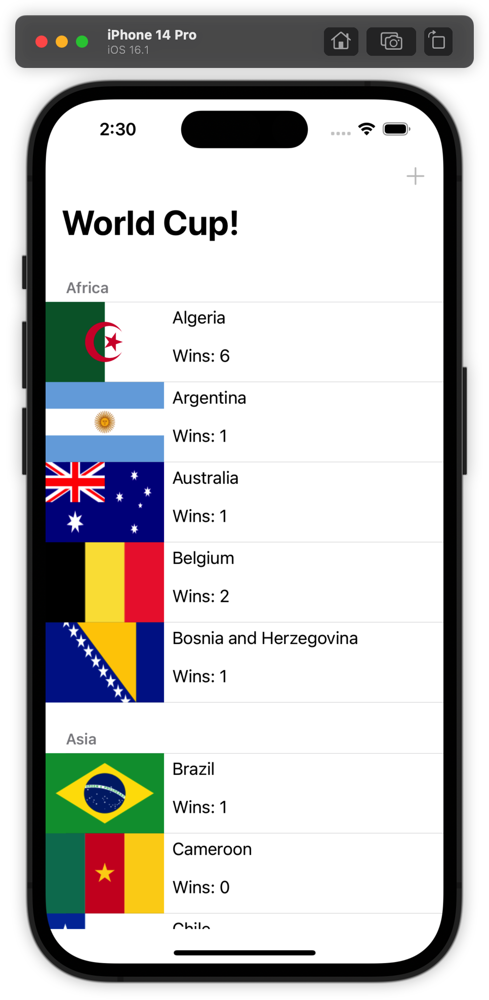

向下滚动页面。 有好消息也有坏消息。 好消息是该应用程序占所有六个 section。 万岁！ 坏消息是世界颠倒了。

仔细看看这些部分。 你会在非洲看到阿根廷，在亚洲看到喀麦隆，在南美洲看到俄罗斯。 这怎么发生的？ 这不是数据的问题； 您可以打开 seed.json 并验证每个团队是否列出了正确的区。

你想出来了吗？ 国家列表仍然按字母顺序显示，fetchedResultsController 只是将 tableView 分成几个 section，就好像同一排位赛区的所有球队都分组在一起一样。

返回延迟实例化的 NSFetchedResultsController 属性并进行以下更改以解决问题。

用以下代码替换在获取请求上创建和设置排序描述符的现有代码：

```swift
let zoneSort = NSSortDescriptor(
  key: #keyPath(Team.qualifyingZone), 
  ascending: true)
let scoreSort = NSSortDescriptor(
  key: #keyPath(Team.wins), 
  ascending: false)
let nameSort = NSSortDescriptor(
  key: #keyPath(Team.teamName), 
  ascending: true)

fetchRequest.sortDescriptors = [zoneSort, scoreSort, nameSort]
```

问题是 sort descriptor。 这是另一个需要记住的 NSFetchedResultsController “陷阱”。 如果要使用 section keyPath 分隔获取的结果，则第一个排序描述符的属性必须与 keyPath 的属性相匹配。

NSFetchedResultsController 的文档强调了这一点，并且有充分的理由！ 您看到了当排序描述符与键路径不匹配时发生的情况——您的数据没有任何意义。

再构建并运行一次以验证此更改是否解决了问题：


确实如此。 更改排序描述符恢复了示例应用程序中的地缘政治平衡。 非洲球队在非洲，欧洲球队在欧洲等等。

> 请注意，在每个排位赛区内，球队按获胜次数从高到低排序，然后按名称排序。这是因为在前面的代码片段中，您添加了三个排序描述符：首先按排位赛区排序，然后按获胜次数排序，最后按名称排序。

在继续之前，花点时间想一想如果没有 fetched results controller，你需要做些什么来按排位赛区分开团队。首先，您必须创建一个字典并遍历团队以找到唯一的区。

当您遍历团队数组时，您必须将每个团队与正确的排位赛区相关联。一旦你有了按区域划分的团队列表，你就必须对数据进行排序。

当然自己做也不是不可以，但是很繁琐。这就是 NSFetchedResultsController 让你免于做的事情。您可以在今天剩下的时间里休息，去海滩观看世界杯比赛。谢谢你，NSFetchedResultsController！


## 缓存 Cell

正如您可能想象的那样，将 Team 分组并不是一项成本低廉的操作。没有办法避免遍历每个 Team。

在这种情况下这不是性能问题，因为只有 32 个团队需要考虑。但是想象一下，如果您的数据集更大，会发生什么。如果您的任务是迭代超过 300 万个人口普查记录并按州或省将它们分开怎么办？

“我它放在后台线程上！”可能是你的第一个想法。但是，在所有 section 都可用之前，tableView 无法自行填充。您可能会避免阻塞主线程，但您仍然需要查看 spinner。不可否认，这成本很高。至少，您应该只支付一次成本：一次找出 section 分组，然后每次都重复使用您的结果。

NSFetchedResultsController 的作者思考了这个问题，想出了一个解决方案：缓存。您无需执行太多操作即可将其打开。

回到延迟实例化的 NSFetchedResultsController 并对获取的结果控制器初始化进行以下修改，向 cacheName 参数添加一个值：

```swift
let fetchedResultsController = NSFetchedResultsController(
  fetchRequest: fetchRequest,
  managedObjectContext: coreDataStack.managedContext,
  sectionNameKeyPath: #keyPath(Team.qualifyingZone),
  cacheName: "worldCup")
```

您指定一个缓存名称以打开 NSFetchedResultsController 的磁盘部分缓存。这就是您需要做的一切！请记住，这部分缓存完全独立于 Core Data 的 persistent store,，您在其中持久存储 Team。

> 注意：NSFetchedResultsController 的 section 缓存对其 fetch 请求的变化非常敏感。可以想象，任何更改（例如不同的实体描述或不同的排序描述符）都会为您提供一组完全不同的已提取对象，从而使缓存完全无效。如果您进行这样的更改，则必须使用 deleteCache(withName:) 删除现有缓存或使用不同的缓存名称。


构建并运行应用程序几次。第二次应该比第一次快一点，这是 NSFetchedResultsController 的缓存系统在工作！

在第二次启动时，NSFetchedResultsController 直接从缓存中读取。这节省了到 Core Data 持久存储的往返，以及计算这些部分所需的时间。万岁！

在第 8 节“衡量和提升性能”中，您将了解如何衡量性能并了解您的代码更改是否真的让事情变得更快。

在您自己的应用程序中，如果您将结果分组到多个 section 并且拥有非常大的数据集或针对较旧的设备，请考虑使用 NSFetchedResultsController 的缓存。


## 监控变化

本节已经涵盖了使用 NSFetchedResultsController 的三个主要好处中的两个：section 和 cache。第三个也是最后一个好处有点像一把双刃剑：它很强大但也很容易被误用。

在本章的前面，当您实现点击以增加获胜次数时，您添加了一行代码来重新加载表视图以显示更新后的分数。这是一个蛮力解决方案，但它奏效了。

当然，您可以通过巧妙地使用 UITableView API 来仅重新加载选定的 cell，但这并不能解决根本问题。

不要过于哲学化，但根本问题是改变。底层数据发生了一些变化，您必须明确重新加载用户界面。

想象一下世界杯应用程序的第二个版本会是什么样子。也许每个团队都有一个详细信息屏幕，您可以在其中更改分数。

也许应用程序调用 API 端点并从网络服务获取新的分数信息。您的工作是为每个更新基础数据的代码路径刷新 tableView。

明确地这样做很容易出错，更不用说有点无聊了。有没有更好的办法？就在这里 fetched results controller 来救援。

NSFetchedResultsController 可以侦听其结果集中的变化并通知其委托 NSFetchedResultsControllerDelegate。每当基础数据发生变化时，您都可以根据需要使用此委托来刷新 tableView。

fetched results controller 可以监控其“结果集”的变化是什么意思？这意味着除了已经获取的对象之外，它还可以监控所有对象的变化，无论是旧的还是新的。这种区别将在本节后面变得更加清楚。

让我们在实践中看看。还是在 ViewController.swift 中，将以下扩展名添加到文件底部：

```swift
// MARK: - NSFetchedResultsControllerDelegate
extension ViewController: NSFetchedResultsControllerDelegate {

}
```

这只是告诉编译器 ViewController 类将实现一些获取结果控制器的委托方法。

接下来，回到你的 lazy NSFetchedResultsController 属性并在返回之前将 viewController 设置为 fetched results controller 的委托。在初始化 fetched results controller 后添加以下代码行：

```swift
fetchedResultsController.delegate = self
```

这就是开始监视更改所需的全部内容！当然，下一步是在收到这些更改报告时做一些事情。接下来你会做的。

> 注意： fetchedResultsController 只能监视通过其初始化程序中指定的 managed object context 所做的更改。如果您在应用程序的其他地方创建一个单独的 NSManagedObjectContext 并开始在那里进行更改，那么您的委托方法将不会运行，直到这些更改被保存并与 fetchedResultsController 的 context 合并。


## 应对变化

首先，从 tableView(_:didSelectRowAt:) 中删除 reloadData() 调用。如前所述，这是您现在要替换的蛮力方法。

NSFetchedResultsControllerDelegate 有四种不同粒度的方法。首先，实施最广泛的委托方法，即说：“嘿，有些东西刚刚改变了！”

在 NSFetchedResultsControllerDelegate 扩展中添加以下方法：

```swift
func controllerDidChangeContent(_ controller: 
  NSFetchedResultsController<NSFetchRequestResult>) {
    tableView.reloadData()
}
```

更改可能看起来很小，但实施此方法意味着任何更改，无论来源如何，都会刷新表视图。构建并运行应用程序。通过点击几个单元格来验证表视图的单元格是否仍然正确更新：


分数标签像以前一样更新，但还有其他事情发生。 当一个国家的积分多于同一排位赛区的另一个国家时，该国家将“跳”上一个级别。 这是 fetchedResultsController，它注意到抓取结果的排序顺序发生了变化，并相应地重新调整表视图的数据源。

当单元格确实四处移动时，它会非常紧张……几乎就像每次发生变化时你都在完全重新加载表格一样。

接下来，您将从重新加载整个表格到仅刷新需要更改的内容。 获取结果控制器委托可以告诉您是否需要移动、插入或删除特定索引路径，因为获取结果控制器的结果集发生了变化。

将 NSFetchedResultsControllerDelegate 扩展的内容替换为以下三个委托方法以查看实际效果：

```swift
func controllerWillChangeContent(_ controller:
  NSFetchedResultsController<NSFetchRequestResult>) {
    tableView.beginUpdates()
}

func controller(_ controller:
  NSFetchedResultsController<NSFetchRequestResult>,
  didChange anObject: Any,
  at indexPath: IndexPath?,
  for type: NSFetchedResultsChangeType,
  newIndexPath: IndexPath?) {

  switch type {
  case .insert:
    tableView.insertRows(at: [newIndexPath!], with: .automatic)
  case .delete:
    tableView.deleteRows(at: [indexPath!], with: .automatic)
  case .update:
    let cell = tableView.cellForRow(at: indexPath!) as! TeamCell
    configure(cell: cell, for: indexPath!)
  case .move:
    tableView.deleteRows(at: [indexPath!], with: .automatic)
    tableView.insertRows(at: [newIndexPath!], with: .automatic)
  @unknown default:
    print("Unexpected NSFetchedResultsChangeType")
  }
}

func controllerDidChangeContent(_ controller:
  NSFetchedResultsController<NSFetchRequestResult>) {
    tableView.endUpdates()
}
```

让我们简要回顾一下您刚刚添加或修改的所有三种方法。

- controllerWillChangeContent(_:)：此委托方法通知您即将发生更改。您使用 beginUpdates() 准备好您的 tableView。

- controller(_:didChange:at:for:newIndexPath:): 这个方法比较啰嗦。并且有充分的理由——它准确地告诉您哪些对象发生了变化，发生了什么类型的变化（插入、删除、更新或重新排序）以及受影响的 indexPath 是什么。

  这个中间方法是众所周知的将表格视图与 Core Data 同步的粘合剂。无论底层数据发生多少变化，您的 tableView 都将与 persistent store 中发生的事情保持一致。

- controllerDidChangeContent(_:)：您最初实现的用于刷新 UI 的委托方法结果是通知您更改的三个委托方法中的第三个。无需刷新整个表视图，您只需调用 endUpdates() 来应用更改。

> 注意：您最终如何处理更改通知取决于您的个人应用程序。您在上面看到的实现是 Apple 在 NSFetchedResultsControllerDelegate 文档中提供的示例。


请注意，这些方法的顺序和性质非常巧妙地与用于更新表视图的“开始更新、进行更改、结束更新”模式相关联。这不是巧合！

构建并运行以查看您的工作成果。马上，每个排位赛区都会根据获胜次数列出球队。点击不同的国家几次。您会看到 cell 平滑地动画以维持此顺序。

本节还有一个 NSFetchedResultsControllerDelegate 方法需要探索。将其添加到扩展中：

```swift
func controller(_ controller: 
  NSFetchedResultsController<NSFetchRequestResult>,
  didChange sectionInfo: NSFetchedResultsSectionInfo,
  atSectionIndex sectionIndex: Int,
  for type: NSFetchedResultsChangeType) {

  let indexSet = IndexSet(integer: sectionIndex)

  switch type {
  case .insert:
    tableView.insertSections(indexSet, with: .automatic)
  case .delete:
    tableView.deleteSections(indexSet, with: .automatic)
  default: break
  }
}
```

此委托方法与 controllerDidChangeContent(_:) 类似，但会通知您对部分而不是单个对象的更改。在这里，您将处理基础数据的更改触发整个部分的创建或删除的情况。

花点时间想想什么样的变化会触发这些通知。也许如果一支新球队从一个全新的资格赛区进入世界杯，则 fetchedResultsController 会利用该值的唯一性并通知其 delegate 有关新 section 的信息。


## 插入一个 section

为了演示在结果集中插入时表视图会发生什么，让我们假设有一种添加新团队的方法。

如果您仔细观察，您可能会注意到右上角的 + 栏按钮项。 它一直被禁用。

让我们现在来实现它。 在 ViewController.swift 中，在 viewDidLoad() 下面添加以下方法：

```swift
override func motionEnded(
  _ motion: UIEvent.EventSubtype,
  with event: UIEvent?) {
  if motion == .motionShake {
    addButton.isEnabled = true
  }
}
```

您覆盖 motionEnded(_:with:) 以便摇动设备启用 + 条按钮项。 这将是您进入的秘密方式。 addButton 属性一直持有对该栏按钮项的引用！

接下来，在标有 // MARK 的扩展名上方添加以下扩展名： - Internal：

```swift
// MARK: - IBActions
extension ViewController {
  @IBAction func addTeam(_ sender: Any) {
    let alertController = UIAlertController(
      title: "Secret Team",
      message: "Add a new team",
      preferredStyle: .alert)

    alertController.addTextField { textField in
      textField.placeholder = "Team Name"
    }
    
    alertController.addTextField { textField in
      textField.placeholder = "Qualifying Zone"
    }
    
    let saveAction = UIAlertAction(
      title: "Save",
      style: .default
    ) { [unowned self] _ in
    
      guard 
        let nameTextField = alertController.textFields?.first,
        let zoneTextField = alertController.textFields?.last
        else {
          return
      }
    
      let team = Team(
        context: self.coreDataStack.managedContext)
    
      team.teamName = nameTextField.text
      team.qualifyingZone = zoneTextField.text
      team.imageName = "wenderland-flag"
      self.coreDataStack.saveContext()
    }
    
    alertController.addAction(saveAction)
    alertController.addAction(UIAlertAction(title: "Cancel",
                                            style: .cancel))
    
    present(alertController, animated: true)

  }
}
```

这**是**一个相当长但易于理解的方法。 当用户点击添加按钮时，它会显示一个 alert controller，提示用户输入一个 Team。

alert controller 有两个文本字段：一个用于输入球队名称，另一个用于进入排位赛区。点击保存提交更改并将新团队插入到 Core Data 的 persistent store 中。再次构建并运行该应用程序。

如果您在设备上跑步，请摇晃它。如果您在模拟器上运行，请按 Command + Control + Z 来模拟摇晃事件。

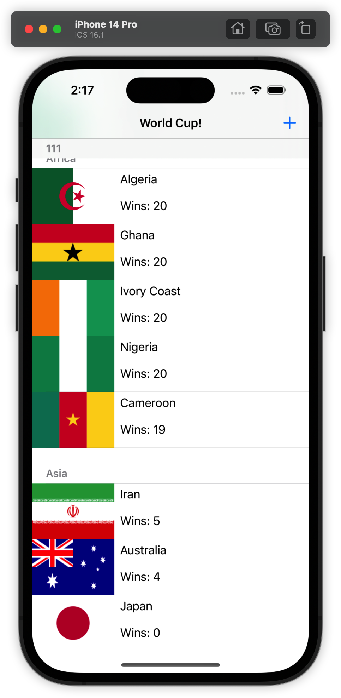

芝麻开门！“摇一摇”，添加按钮现在处于活动状态！

世界杯正式接受一支新球队。向下滚动表格至欧洲资格区的末尾和北美、中美洲和加勒比地区资格区的开头。你马上就会明白为什么。

在继续之前，请花几秒钟时间接受这一点。您将通过将另一支球队加入世界杯来改变历史。你准备好了吗？

点击右上角的 + 按钮。您会看到一个警报视图，询问新 Team 的详细信息。

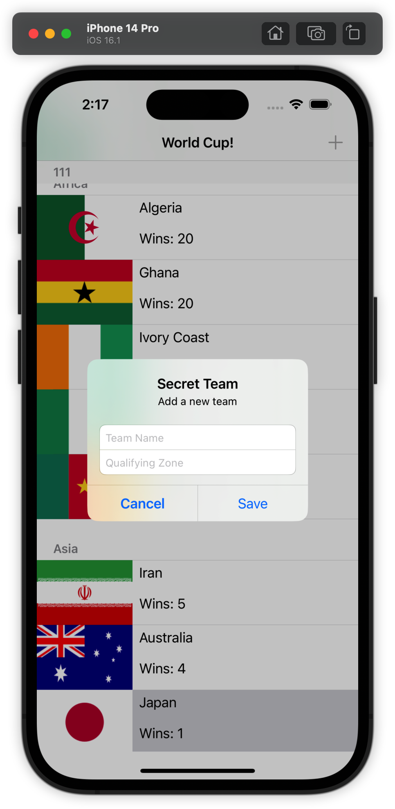

作为新 Team 进入虚构（但繁荣）的 Wenderland 合条件的区域键入 Internets，然后点击保存。 快速动画后，您的用户界面应如下所示：


由于“Internets”是获取结果控制器的 sectionNameKeyPath 的新值，因此此操作创建了一个新部分并将一个新 Team 添加到 fetched results controller 结果集中。

它处理事物的数据方面。此外，由于您适当地实现了 fetched results controller 的委托方法，因此 tableView 通过插入一个包含一个新行的新 section 来响应。

这就是 NSFetchedResultsControllerDelegate 的美妙之处。您可以设置一次并忘记它。底层数据源和您的 tableView 将始终同步。

至于 Wenderland 旗帜是如何进入应用程序的：嘿，我们是开发者！我们需要为各种可能性做好计划。


## Diffable data sources

在 iOS 13 中，Apple 引入了一种实现 tableView 和 collectionView 的新方法：Diffable data sources。无需实现常用的数据源方法，如 numberOfSections(in:) 和 tableView(_:cellForRowAt:) 来提供部分信息和单元格，使用 Diffable data sources，您可以使用快照提前设置 section 和 row。

除了 Diffable data sources，还有一种使用 NSFetchedResultsController 来监控获取请求结果集变化的新方法。

让我们从示例项目中删除现有的数据源实现开始。继续并删除符合 UITableViewDataSource 的整个 ViewController 扩展。添加 // MARK: - UITableViewDataSource。

然后，滚动到 ViewController 的顶部并添加以下属性：

```swift
var dataSource: UITableViewDiffableDataSource<String, NSManagedObjectID>?
```

UITableViewDiffableDataSource 对于两种类型是通用的——String 表示部分标识符，NSManagedObjectID 表示不同 Team 的 managed object 标识符。

接下来，在 configure(cell:for) 下面添加以下新方法：

```swift
func setupDataSource()
  -> UITableViewDiffableDataSource<String, NSManagedObjectID> {
    UITableViewDiffableDataSource(
    tableView: tableView
    ) { [unowned self] (tableView, indexPath, managedObjectID) 
      -> UITableViewCell? in

      let cell = tableView.dequeueReusableCell(
        withIdentifier: self.teamCellIdentifier,
        for: indexPath)
    
      if let team =
          try? coreDataStack.managedContext.existingObject(
            with: managedObjectID) as? Team {
        self.configure(cell: cell, for: team)
      }
      return cell
    }

}
```

此方法创建您的 diffable data source。 当像这样创建数据源时，它会自动将自己添加为 tableView 的数据源。 请注意，您传入了一个用于配置 cell 的闭包，而不是一个单独的方法。

由于数据源对于 NSManagedObjectID 是通用的，因此您使用 existingObject(with:) 将标识符转换为相应的 Team 对象以配置每个 cell。

由于您在数据源闭包中解析了 Team 对象，因此您需要重新实现 configure(cell:for)。 用以下内容替换其实现：

```swift
  func configure(cell: UITableViewCell,
                 for team: Team) {

    guard let cell = cell as? TeamCell else {
        return
    }
    
    cell.teamLabel.text = team.teamName
    cell.scoreLabel.text = "Wins: \(team.wins)"
    
    if let imageName = team.imageName {
      cell.flagImageView.image = UIImage(named: imageName)
    } else {
      cell.flagImageView.image = nil
    }

  }
```

接下来，将以下内容添加到 importJSONSeedDataIfNeeded() 之后的 viewDidLoad() 中

```swift
dataSource = setupDataSource()
```

在之前的设置中，表视图的数据源是视图控制器。表视图数据源现在是您之前设置的可比较数据源对象。

现在找到 NSFetchedResultsControllerDelegate 实现并删除您在上一节中设置的所有四个委托方法：

- controllerWillChangeContent(_:)_
- controller(_:didChangeContentWith:)

- controllerDidChangeContent(_:)

- controller(didChange:atSectionIndex:for:)

取而代之的是，实现以下委托方法：

```swift
func controller(
  _ controller: NSFetchedResultsController<NSFetchRequestResult>,
  didChangeContentWith
  snapshot: NSDiffableDataSourceSnapshotReference) {

  let snapshot = snapshot
    as NSDiffableDataSourceSnapshot<String, NSManagedObjectID>
  dataSource?.apply(snapshot)
}
```

之前委托调用与 UITableView 中的方法很好地对齐，例如 beginUpdates() 和 endUpdates()，您不再需要调用它们，因为您已切换到 diffable data source。

相反，新的委托方法为您提供了对获取的结果集的任何更改的摘要，并向您传递了一个预先计算的快照，您可以将其直接应用于您的 tableView。简单多了！

构建并运行以查看新的可差异快照所处的位置：


伟大的！似乎大多数事情都有效，但有两个问题。首先，控制台警告您 tableView 在显示在屏幕上之前正在布置其单元格，其次是 team 似乎按区分组，但 section 标题不见了。

控制台警告正在发生，因为现在事情以不同的顺序发生。当 viewController 是表的数据源，并且您正在实现旧的获取结果控制器委托方法时，table 在加载并添加到屏幕之前不会请求任何信息。现在您正在使用一个 diffable data source，当您在  results controller 上调用 performFetch() 时会发生第一个更改， results controller 又调用 controller(_: didChangeContentWith:)，它从第一行开始“添加”所有行拿来。您在 viewDidLoad() 中调用 performFetch()，这发生在将视图添加到窗口之前。呸！

要解决此问题，您需要稍后执行第一次提取。从 viewDidLoad() 中删除 do / catch 语句，因为它现在在生命周期中发生得太早了。实现 viewDidAppear(_:)，在视图添加到窗口后调用：

```swift
override func viewDidAppear(_ animated: Bool) {
  super.viewDidAppear(animated)
  UIView.performWithoutAnimation {
    do {
      try fetchedResultsController.performFetch()
    } catch let error as NSError {
      print("Fetching error: \(error), \(error.userInfo)")
    }
  }
}
```

构建并运行，控制台警告消失了。 现在修复 section 标题。

他们为什么失踪了？ 早些时候，当你移除 UITableViewDataSource 的实现时，你也移除了 tableView(_:titleForHeaderInSection:)。 此方法提供了填充节标题的字符串，如果没有这些字符串，标题就会消失。

无法使用 UITableViewDiffableDataSource 重新打开这些标头，因此您将采用替代方法。 找到实现 UITableViewDelegate 方法的部分并实现这两个：

```swift
func tableView(_ tableView: UITableView,
               viewForHeaderInSection section: Int) -> UIView? {

  let sectionInfo = fetchedResultsController.sections?[section]

  let titleLabel = UILabel()
  titleLabel.backgroundColor = .white
  titleLabel.text = sectionInfo?.name

  return titleLabel
}

func tableView(_ tableView: UITableView,
               heightForHeaderInSection section: Int)
  -> CGFloat {
  20
}
```

这两个委托方法不是只返回填充 setion header 的标题，而是创建并返回 UILabel 以与节标题的高度一起显示。

构建并运行以查看是否带回了丢失的 header：


section header 回来了，但如果你点击任何 team cell，你会注意到获胜次数不再增加。 diffable 数据源只考虑哪些对象 ID 在哪个部分中的顺序。即使您的团队因为胜利增加而在该部分中上升，数据源也只会移动现有单元而不是重新配置它。只有当单元格移出屏幕并再次打开时，您才会看到新分数。

要解决此问题，请在 UITableViewDelegate 部分找到 tableView(_:didSelectRowAt:) 并在调用 saveContext() 之前添加以下代码：

```swift
if var snapshot = dataSource?.snapshot() {
  snapshot.reloadItems([team.objectID])
  dataSource?.apply(snapshot, animatingDifferences: false)
}
```

在这里，您获取现有快照，告诉它您的团队需要重新加载，然后将更新后的快照应用回数据源。然后数据源将为您的 team 重新加载 cell。当您保存上下文时，这将触发获取的结果控制器的委托方法，该方法将应用任何需要发生的重新排序。再次构建并运行并确认一切都像宣传的那样工作。

如果你走到这一步，请拍拍自己的背。您不仅使用不同的数据源重新实现示例项目，而且还使用新的获取结果控制器委托方法对监控更改的方式进行了现代化改造。在此过程中，您还删除了许多以前需要的样板文件。

> 注意：如果您正在更改不支持 diffable data sources 的视图的状态，您应该记住还有另一个 NSFetchedResultsControllerDelegate 方法可以一次性为您提供对获取结果的所有更改的摘要，但使用CollectionDifference<NSManagedObjectID> 返回结果。


## 关键点

- NSFetchedResultsController 抽象掉了将 tableView 与 CoreData store 同步所需的大部分代码。

- NSFetchedResultsController 的核心是 NSFetchRequest 的包装器和获取结果的容器。

- fetched results controller 需要在其获取请求上设置至少一个排序描述符。如果您忘记了排序描述符，您的应用程序将会崩溃。

- 您可以设置获取结果的控制器 sectionNameKeyPath 以指定一个属性以将结果分组到 section Section。每个唯一值对应于不同的表视图部分。

- 将一组获取的结果分组为多个 section 是一项昂贵的操作。通过在获取的结果控制器上指定缓存名称，避免多次计算部分。

- fetched results controller 可以侦听其结果集中的变化并通知其代理 NSFetchedResultsControllerDelegate 响应这些变化。

- NSFetchedResultsControllerDelegate 监视单个 Core Data 记录中的更改（无论是插入、删除还是修改）以及对整个部分的更改。

- Diffable data source 使使用 fetched results controller 和 tableView 更容易。


## 然后去哪儿？

你已经看到了 NSFetchedResultsController 是多么强大和有用，并且你已经了解了它与 table view 一起工作的效果。table view 在 iOS 应用程序中非常常见，您已经亲眼目睹了 fetched results 控制器如何为您节省大量时间和代码！

通过对委托方法进行一些调整，您还可以使用 fetched results controller 来驱动 collectionView——主要区别在于 collectionView 不将其更新包含在开始和结束调用中，因此有必要存储更改和最后批量应用它们。

在其他上下文中使用 fetched results controller 之前，您应该记住一些事情。请注意如何实现 fetched results controller 委托方法。即使基础数据发生最轻微的变化也会触发这些变化通知，因此请避免执行任何您不愿意反复执行的昂贵操作。

NSFetchedResultsController 之所以重要还有另一个原因：它填补了 iOS 开发人员与 macOS 开发人员相比所面临的空白。与 iOS 不同，macOS 具有 Cocoa 绑定，它提供了一种将视图与其底层数据模型紧密耦合的方法。听起来有点熟？

如果你发现自己编写了复杂的逻辑来计算 section，或者为了让你的 tableView 与 Core Data 很好地配合而大费周章，请回想一下本章！


